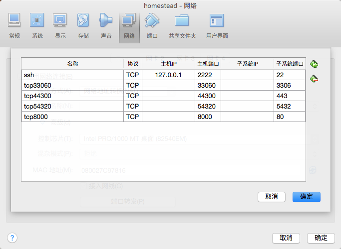
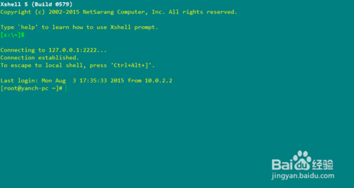
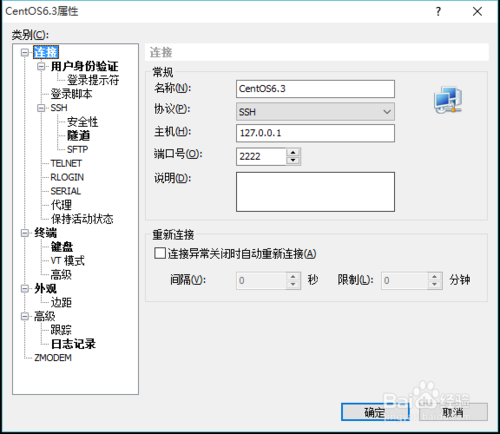
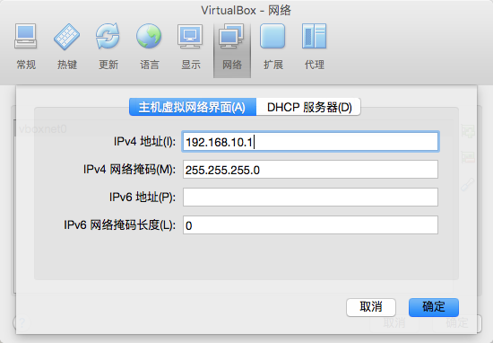
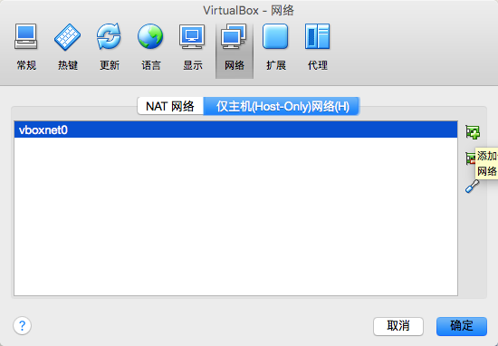
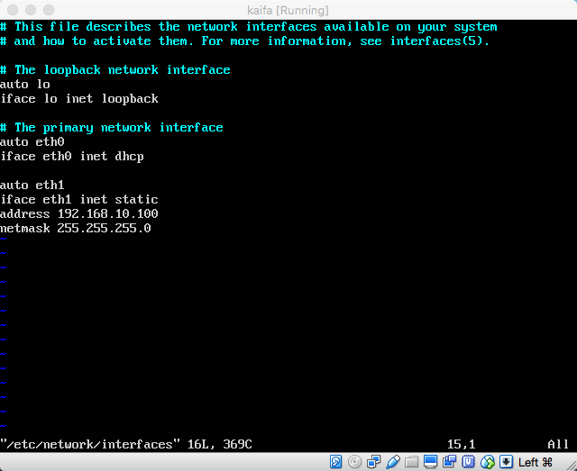
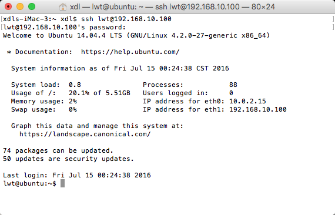
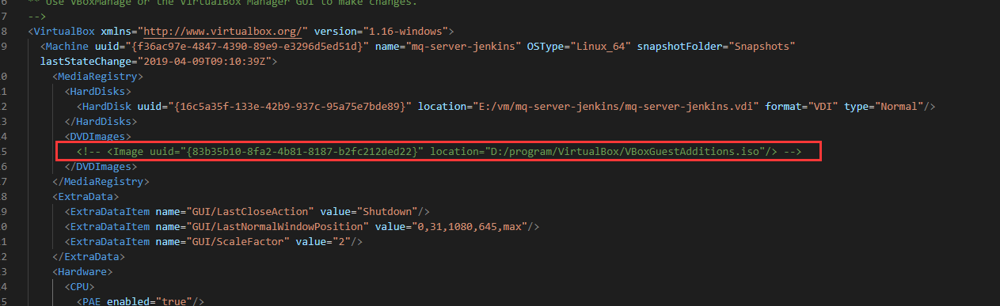

# VirtualBox

- [知乎VirtualBox专题](https://www.zhihu.com/topic/19597193/hot)
- [UltraISO软碟通制作U盘启动盘](http://www.xitong86.com/article/upanjc/3648.html)

PS: 正常情况下不推荐导出虚拟机再导入到别的机器上。因为不同的宿主机之间的硬件配置、操作系统、软件版本等各方面都可能存在差异，容易出现问题。
推荐的做法是重新安装与配置。

## 1.介绍

### 1.1.vmm技术
云计算是构建在虚拟化技术之上的，虚拟化技术可以实现资源池化和弹性扩展，将服务器的CPU、内存、磁盘等资源进行集中管理。
通过集中式的管理将资源动态按需分配，提供资源的利用率。

重要角色：
- 宿主机：在一个物理机上运行多个虚拟机，这个物理机就是宿主机
- 客户机：运行的虚拟机就是客户机

虚拟化技术：
1. 它是物理服务器与虚拟机的中间层。
2. 在服务器启动时负责给每个虚拟机分配适量的CPU、内存、磁盘、网络等资源。并加载所有虚拟机的 Guest OS。
3. 负责协调所有虚拟机共享访问一套底层硬件资源。
4. 主流的Hypervisor有Hyper-V、Vmware、KVM、  Xen等。

- 完全虚拟化：在客户操作系统看来，客户机操作系统察觉不到是运行在一个虚拟平台上，完全虚拟化的虚拟平台和现实平台是一样的，
  这样的虚拟平台可以运行现有的操作系统，无须对操作系统进行任何修改，因此这种方式  被称为完全虚拟化;
  但是VMM需要能够正确处理所有可能的指令。
- 半虚拟化：客户机操作系统知道其运行在虚拟平台上，并且会去主动适应;这样的虚拟平台需要对所运行的客户机操作系统进行修改使之适应虚拟环境。
  因此这种方式被称为半虚拟化;因此VMM不需要处理所有的指令。通常认为半虚拟化的性能要高于完全虚拟化

常见的三种架构
- 裸金属架构。由硬件级别直接管理资源实现的虚拟化。性能最好，实现难度也打。例子：vmware vsphere
- 宿主架构。运行在操作系统之上。例子：kvm、VirtualBox、vmware workstation
- 混合架构。裸金属架构的一种升级，通过在硬件层面上虚拟出一个虚拟机进行资源的管理，通过这个特权的虚拟机进行虚拟环境的创建与管理。比如Xen

### 1.2.常见的虚拟化技术
[除了 VirtualBox 和 VMware，还有么有更好更优秀的虚拟机软件？](https://www.zhihu.com/question/289843223/answer/2852809831)
- VMware Workstation。是一款功能强大的桌面虚拟计算机软件
- Vmware Fusion。Mac OS 上提供的个人版虚拟机
- VirtualBox。德国InnoTek软件公司出品的自由及开放源代码的虚拟机软件，现由甲骨文公司进行开发。个人和企业版都免费
- Parallels Desktop。在Mac上面模拟windows运行环境，用来运行windows的应用
- Microsoft Hyper-V。微软提供的虚拟化支持，windows server自带的虚拟化工具，不支持GPU。
- QEMU。可执行硬件虚拟化的开源仿真器，不仅仅是虚拟机，更是机器模拟器
- kvm。KVM本身是一个内核模块，它导出了一系列的接口到用户空间，用户态程序可以使用这些接口创建虚拟机。通常与QEMU一起实现几乎物理机性能的虚拟化

通常：
- vmware vsphere是商业应用级别的软件。
- kvm会被作为一般的后端服务器的虚拟化技术，作为一个开源的技术与vmware vsphere对标
- 桌面应用可使用VirtualBox 和 VMware个人版。

## 2.常用命令

处理使用界面操作外，我们还可以使用命令进行操作。从而实现虚拟机的自动化运维。

1.创建虚拟机
```shell
## 1.导入虚拟机
VBoxManage import <ova_path> --vsys 0 --vmname <vm_name> --basefolder <import_folder>
  参数：
  1. ova_path     ova文件的全路径
  2. vm_name      自定义的客户机名称
  3. import_folder    安装的目录。该目录必须是空目录
```

2.启动/关闭虚拟机
```shell
## 1.启动
  VBoxManage startvm <vm_name> -type <start_type>
  参数：
  1. vm_name      客户机名称
  2. start_type   启动类型。
      --type separate 是 有界面启动
      --type headless 是 无界面启动
      --type vrdp     是 开启虚拟机并开启远程桌面连接的支持
  
  例如：VBoxManage startvm centos-node1 -type headless
  Waiting for VM "centos-node1" to power on...
  VM "centos-node1" has been successfully started.
  
## 2.关闭虚拟机
  VBoxManage controlvm <vm_name> acpipowerbutton

## 3.强制关闭虚拟机
  VBoxManage controlvm <vm_name> poweroff  
```

3.查看内容
```shell
## 1.查看有哪些虚拟机
  VBoxManage list vms
  
  "centos-node1" {e692b664-1f53-42c4-b68b-24076ff2b899}
  "centos-node2" {03dbac75-f008-4099-8a7a-a428488dea21}
  "centos-node3" {649acb2d-3349-43c7-901b-8298b6d58d03}

## 2.查看虚拟的详细信息【非常详细】
  VBoxManage list vms --long

## 3.查看运行着的虚拟机
  VBoxManage list runningvms
  
## 4.获取桥接的网卡
  VBoxManage list hostifs
  
## 5.查看虚拟机信息【与 list vms --long 命令的内容一样】
  VBoxManage showvminfo <vm_name>
```

4.修改
```shell
## 1.修改资源
memory：VBoxManage modifyvm <vm_name> --memory <use_memory>
cpu：VBoxManage modifyvm <vm_name> --cpus {use_cpu}

## 2.一个虚拟机可以设置多个网卡 <1-N>  表示网卡的顺序
设置桥接：VBoxManage modifyvm <vm_name> --nic<1-N> none|null|nat|bridged|intnet|hostonly|generic|natnetwork
设置桥接：VBoxManage modifyvm <vm_name> --bridgeadapter<1-N> none|<devicename>

## 3.改变虚拟机的远程连接端口,用于多个vbox虚拟机同时运行
  VBoxManage controlvm <vm_name> vrdpprot <ports>
  
## 4.删除虚拟机
  VBoxManage unregistervm  <vm_name> --delete
```

## 3.网络设置

### 3.1.网络模式

#### 3.1.1.Network Address Translation (NAT) 网络地址转发


这个一般是VirtualBox的默认网络模式,特点是可以直接访问外网,但是不能访问host主机,host主机当然也不能访问到虚拟机了.这是一个由VirtualBox分配的私有网络,如果需要它的一些端口对外部可见,我们可以添加一些转发规则.


|机器      | IP|
----------| -------------|
|host主机   |192.168.1.2|
|虚拟机1    |10.0.2.15|
|虚拟机2    |10.0.2.15|
|虚拟机3    |10.0.2.15|




在主机启动ssh连接客户端，连接选择127.0.0.1，端口2222。见图连接上了







#### 3.1.2.Bridged networking 桥接网卡

可以满足虚拟机中的所有网络需求,通过使用host主机的网卡,直接连到host网络,此时的虚拟机就和真正的机器一样.虚拟机可以访问外网,可以访问host主机.host主机也可以访问虚拟机.

|机器      | IP|
----------| -------------|
|host主机   |192.168.1.2|
|虚拟机1    |192.168.1.2|
|虚拟机2    |192.168.1.3
|虚拟机3    |192.168.1.4|


#### 3.1.3.Internal networking 内部网络

顾名思义,就是虚拟机内部之间通讯的网络,不能访问host,也不能访问外网

|机器      | IP|
----------| -------------|
|host主机   |192.168.1.2|
|虚拟机1    |123.124.125.12|
|虚拟机2    |123.124.125.13|
|虚拟机3    |123.124.125.14|


#### 3.1.4.Host-only networking 仅主机


看名字就知道了,这个网络模式只有host主机可以访问虚拟机,虚拟机可以访问host主机,但是虚拟机是不可以访问外网的.


NAT模式和仅主机模式,我们都可以在VirtualBox的全局设定中去添加并且设置一些我们需要的参数,


比如设置仅主机的IP,这样我们可以直接这个网关下的IP访问到我们的虚拟机





|机器      | IP|
----------| -------------|
|host主机   |192.168.1.2|
|虚拟机1    |192.168.10.2|
|虚拟机2    |192.168.10.3|
|虚拟机3    |192.168.10.4|

### 3.2.ubuntu中的网络设置

我们常用的大概也就这些,现在我们来说说具体在ubuntu中如何设置

#### 3.2.1.桥接


这是最简单的一种方式,直接使你的ubuntu虚拟机和你的host主机是在同一个路由里面的,虚拟机可以访问外网和host主机.


不过这种方式有一个前提,是你得有路由器.这样才能让路由器分配ip


如果是我们使用的无线网卡,或者我们没有任何路由器,只是在本机无网络的情况下开发呢?我们就需要使用仅主机模式了

#### 3.2.2.NAT网络转发 + 仅主机

个人认为这是最理想的一种方式了,首先在我们安装ubuntu的时候,VirtualBox就默认给我们安装了一个NAT网络转发的网卡,这个就让虚拟机可以访问外网了,但是不能访问host主机,host主机也不能访问到虚拟机.所以我们需要再添加一块网卡,设置一个仅主机的网络模式,这样双网卡,就实现了我们想要的效果了.

我们首先要在VirtualBox全局设置里面添加一个仅主机的网络,并设置一下网关



然后在设置ubuntu虚拟机,增加一块网卡


在ubuntu中配置新添加的网卡

sudo vim /etc/network/interfaces

修改这个文件成下面这样的




我试了重启网卡没有效果,就直接重启ubuntu系统了

sudo reboot


host主机连接ubuntu,IP就是我们刚才新添加的那个网卡的IP

ssh lwt@192.168.10.100





基本上这样配置足以满足我们的开发需求了


### 3.3.配置固定IP

VirtualBox 设置当前虚拟机的网络 桥接模式

这样虚拟机与宿主机，处于同一个网段中，可以相互访问

## 4.常见问题

### 4.1.Cannot attach medium 'D:\\XXXXXX\\VBoxGuestAdditions.iso'

详细的错误信息如下：

```text
Cannot attach medium 'D:\\program\\VirtualBox\\VBoxGuestAdditions.iso'
{83b35b10-8fa2-4b81-8187-b2fc212ded22}: medium is already associated
with the current state of machine uuid{f36ac97e-4847-4390-89e9-e3296d5ed51d}!.
```

返回 代码:

VBOX_E_OBJECT_IN_USE (0x80BB000C)

组件:

MediumWrap

界面:

IMedium {4afe423b-43e0-e9d0-82e8-ceb307940dda}


解决办法：经过仔细观察，错误信息提示的很明显了

1. 打开系统所在位置C:\\Users\\Administrator\\VirtualBox VMs\\centos7-03\\centos7-03.vbox
2. 备份旧文件
3. 修改，搜索VBoxGuestAdditions.iso，去掉DVDImages标签中的image标签





4.重启virtualbox即可

### 4.2.虚机复制后出现多个inte6

kvm在复制后，在ifconfig查看信息的时候发现出现了两个inte6的地址，其中一个为被克隆服务器的，另一个是新生成的。

解决方案：将模板OS中的/etc/machine-id文件移走备份，并重新生成，之后再重启机器

```shell
#查看当前此文件信息
[root@localhost ~]# ll /etc/machine-id 
-r--r--r--. 1 root root 33  6月 16 16:09 /etc/machine-id
[root@localhost ~]# more /etc/machine-id 
9d5ace5e1e714ee2bf8d830de29e7bc5
 
#我移走它做好备份
[root@localhost ~]# mkdir /baks
[root@localhost ~]# cp /etc/machine-id /baks/ 
[root@localhost ~]# rm -f /etc/machine-id 
[root@localhost ~]# ll /etc/machine-id 
ls: 无法访问 '/etc/machine-id': 没有那个文件或目录
 
 
#重新创建这个文件
[root@localhost ~]# systemd-machine-id-setup
Initializing machine ID from random generator.
[root@localhost ~]# ll /etc/machine-id 
-r--r--r--. 1 root root 33  7月 29 13:16 /etc/machine-id
[root@localhost ~]# more /etc/machine-id 
4c8d90b2c5294743bf93d6b0408b2293
[root@localhost ~]# 
```

### 4.3.增强功能

1. 虚拟机内部系统与本地的文件拖拽必须安装 “增强功能”

2. 虚拟机内部系统分辨率修改必须安装 “增强功能”

### 4.4.数据盘扩容

[https://blog.csdn.net/qq_41805514/article/details/88826215](https://blog.csdn.net/qq_41805514/article/details/88826215)

## 5.虚拟机文件 vdi 瘦身

vdi是Virtualbox在建立虚拟空间时的动态磁盘格式，相对于固定磁盘格式来说，它的最大好处在于在建立空间时速度较快，而且初始大小很小。但是缺点也是有的。相对于固定磁盘格式来说，速度较慢，并且当一个空间区域第一次被写入时，以后哪怕这部分空间的数据被移除了，但是增大的空间并不会减少...换言之这个vdi文件，它只会大不会小。

### 5.1.磁盘碎片整理，清理一下垃圾

一、如果客户机为Windows操作系统：

1. 下载SDelete工具，用于磁盘清零。https://docs.microsoft.com/zh-cn/sysinternals/downloads/sdelete

2. 以管理员模式（如果有）打开命令提示符，进入放置SDelete的文件夹内。

3. 执行以下命令开始清理未使用的空间，等待清理完成。 sdelete -z （或 sdelete -c -z C: ）

二、如果客户机为Linux操作系统：（这里以Ubuntu 14.04 LTS为例）

方法1：通过拷贝/dev/zero填充闲置空间
```shell
sudo dd if=/dev/zero of=zero.fill
sudo rm -f zero.fill
```

方法2：通过zerofree置零闲置空间

有不少文档介绍使用remount根文件系统为ReadOnly的方法(init
1)，而这种方法在文件系统为ext4时无效。所以在这里我们采用另一种方式来实现。

1、执行下面的命令安装zerofree sudo apt-get install zerofree -y

2、重启系统，选择“Ubuntu高级选项”，启动到Recovery Mode，然后选择root。

3、执行下面的命令：（/dev/sda1/ 需要替换成你的磁盘位置，换成 /
应该也OK）
```shell
busybox mount -o ro,remount /dev/sda1
zerofree /dev/sda1
busybox mount -o rw,remount /dev/sda1
```

4、完成指令后关闭虚拟机

### 5.2.压缩文件

宿主机以管理员模式打开命令提示符，执行以下命令：（路径需要根据实际情况进行更改）

cd /d "%ProgramFiles%\\Oracle\\VirtualBox"

VboxManage modifyhd "%VDIPath%%Name%.vdi" --compact

VBoxManage.exe modifyhd "D:\\Program
Files\\vmISO\\window\\win10\\win10.vdi" --compact

等待进行到100%，便可以查看效果了。

### 5.3.常见问题

如果开始直接用VDI文件名，不成功；提示为：

```text
rocky@rocky-desktop:~/.VirtualBox/VDI$ VBoxManage modifyhd WinXP.vdi --compact
VirtualBox Command Line Management Interface Version 2.2.2
(C) 2005-2009 Sun Microsystems, Inc.
All rights reserved.
ERROR: Could not find a hard disk with location 'WinXP.vdi' in the media registry ('/home/rocky/.VirtualBox/VirtualBox.xml')
Details: code VBOX_E_OBJECT_NOT_FOUND (0x80bb0001), component VirtualBox, interface IVirtualBox, callee nsISupports
Context: "FindHardDisk(Bstr(FilenameOrUuid), hardDisk.asOutParam())" at line 415 of file VBoxManageDisk.cpp
```

我的这个VDI从vbox
1.5.2开始，存放目录中间改过多次，不知是否有关系。后改为使用UUID成功。

虚拟机硬盘的UUID可以在~/.VirtualBox/VirtualBox.xml里找到。

代码:
```text
VBoxManage modifyhd b5cf7595-9709-421e-a2b4-96c8683425c4 --compact
VirtualBox Command Line Management Interface Version 2.2.2
(C) 2005-2009 Sun Microsystems, Inc.
All rights reserved.
0%...10%...20%...30%...40%...50%...60%...70%...80%...
```


注：vdi文件的uuid可以从C:\\Documents and Settings\\用户名.VirtualBox文件夹下的VirtualBox.xml文件中查看，


