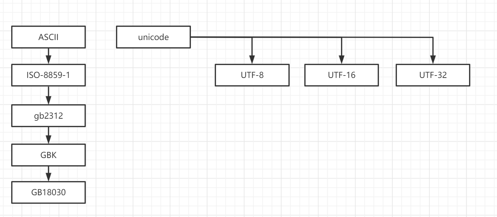
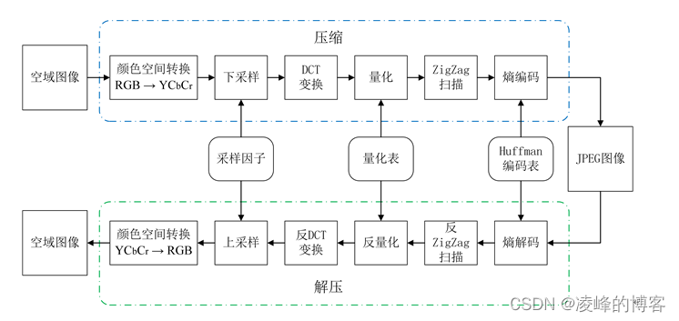
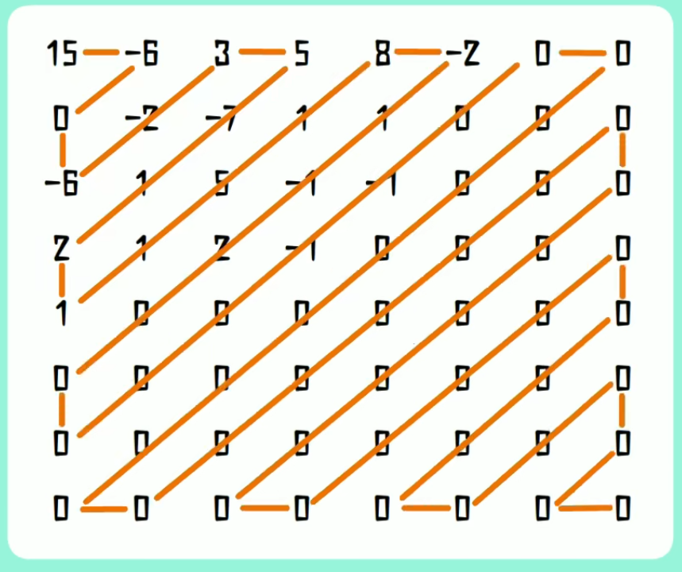

# 加密

- [代码案例](https://gitee.com/luckSnow/knowledge/tree/master/learn_code/src/main/java/com/zx/_04_%E5%AE%89%E5%85%A8)
- [教程](https://www.liaoxuefeng.com/wiki/1252599548343744/1255943717668160)
- [国密算法分类](https://zhuanlan.zhihu.com/p/577195882)

## 1.加密算法

### 1.1.常见加密算法
- BASE64进行加密/解密：通常用作对二进制数据进行加密。没有安全性
  
- MD5(Message Digest Algorithm)加密算法。是一种单向加密算法，只能加密不能解密。
> 目前已经不在安全，推荐使用  SHA

- SHA(Secure Hash Algorithm，安全散列算法)：数字签名等密码学应用中重要的工具，被广泛地应用于电子商务等信息安全领域

- DES(Data Encryption Standard)对称加密/解密： 数据加密标准算法,和BASE64最明显的区别就是有一个工作密钥，该密钥既用于加密、也用于解密，并且要求密钥是一个长度至少大于8位的字符串
> 目前已经不在安全，已经可以被破解，推荐使用RSA

- AES。对称加密算法。

- RSA非对称加密/解密： 非对称加密算法的典型代表，既能加密、又能解密。和对称加密算法比如DES的明显区别在于用于加密、解密的密钥是不同的。使用RSA算法，只要密钥足够长(一般要求1024bit)，加密的信息是不能被破解的。

- HMAC(Hash Message Authentication Code，散列消息鉴别码)：使用一个密钥生成一个固定大小的小数据块，即MAC，并将其加入到消息中，然后传输。接收方利用与发送方共享的密钥进行鉴别认证

对称加密 与 非对称加密？
1. 对称加密加密与解密使用的是同样的密钥，所以速度快，但由于需要将密钥在网络传输，所以安全性不高
2. 非对称加密使用了一对密钥，公钥与私钥，所以安全性高，但加密与解密速度慢
它使用了一对密钥，公钥（public key）和私钥（private key）。私钥只能由一方安全保管，不能外泄，而公钥则可以发给任何请求它的人。
非对称加密使用这对密钥中的一个进行加密，而解密则需要另一个密钥。比如，你向银行请求公钥，银行将公钥发给你，你使用公钥对消息加密，
那么只有私钥的持有人--银行才能对你的消息解密。与对称加密不同的是，银行不需要将私钥通过网络发送出去，因此安全性大大提高

### 1.2.国密算法

国密算法是国家密码局制定标准的一系列算法。其中包括了对称加密算法，椭圆曲线非对称加密算法，杂凑算法。具体包括SM1,SM2,SM3等，其中：
- SM1，对称加密算法，加密强度为128位，采用硬件实现；
- SM2，为国家密码管理局公布的公钥算法，其加密强度为256位。其它几个重要的商用密码算法包括：
- SM3，密码杂凑算法，杂凑值长度为32字节，和SM2算法同期公布，参见《国家密码管理局公告（第 22 号）》；
- SM4，对称加密算法，随WAPI标准一起公布，可使用软件实现，加密强度为128位。

简单说明：RSA换成SM2、MD5换成SM3，AES换成SM4。

使用方式：
```xml
<!--轻量级密码学库-->
<!-- https://www.bouncycastle.org/java.html -->
<dependency>
   <groupId>org.bouncycastle</groupId>
   <artifactId>bcprov-jdk15to18</artifactId>
   <version>1.68</version>
</dependency>

<!--hutool 使用bcprov封装了SmUtil -->
<dependency>
   <groupId>cn.hutool</groupId>
   <artifactId>hutool-all</artifactId>
   <version>5.7.17</version>
</dependency>
```

### 1.3.Jasypt

- 官网：[http://www.jasypt.org/](http://www.jasypt.org/)
- [使用教程](https://blog.csdn.net/C_Karen/article/details/127803058)

Jasypt也即Java Simplified Encryption是Sourceforge.net上的一个开源项目。
Jasypt 1.4的新特性包括：加密属性文件（encryptable properties files）、Spring Framework集成、加密Hibernate数据源配置、新的命令工具、URL加密的Apache wicket集成以及升级文档。

根据Jasypt文档，该技术可用于加密任务与应用程序，例如：加密密码、敏感信息和数据通信、创建完整检查数据的sums、其他性能包括高安全性、基于标准的加密技术、
可同时单向和双向加密的加密密码、文本、数字和二进制文件。

Jasypt也可以与Acegi Security 整合也即Spring Security。Jasypt亦拥有加密应用配置的集成功能，而且提供一个开放的API从而任何一个Java Cryptography Extension都可以使用Jasypt。

Jasypt还符合RSA标准的基于密码的加密，并提供了无配置加密工具以及新的、高可配置标准的加密工具。
使用最多的场景为配置文件中，数据库账号密码的加密

## 2.编码

### 2.1.字符编码

#### 2.1.1.基础

最早期计算机只有ASCII字符集:美国信息交互标准代码，使用7位表示128个字符，包括大小写字母、数字、标点符号和设备控制符。
对于早期计算机已经足够了，但是随着计算机技术发展，已经不能满足全球各地本地字符的需求。

所以就有了Unicode，官网[https://home.unicode.org/](https://home.unicode.org/)
unicode收集了全球所有的字符、标点符合，设置还有表情包等，所以字符集也在不管的增长，最近的第八版本中字符集数量就超过12W。
unicode字符序列为int32序列，也就是每个字符都占用 32bit/4字节，方式虽然简单，但是空间浪费非常多。

所以就产生了utf-8，是对Unicode字节码的变长编码，目前已经是Unicode的标准，utf-8表示用1~4个字节表示Unicode的码点，utf-8长度的规则:
1. ASCII部分用一个字节表示
2. 常用字符用2~3个字节表示
3. 剩余字符用4个字节表示

长度计算：每个字符的第一个字节高端bit位表示字符的字节长度。如下：
```text
0xxxxxxx                             runes 0-127    (ASCII)，				最高位是0，表示ASCII
110xxxxx 10xxxxxx                    128-2047       (values <128 unused)	高端bit是110，则是2字节；后面每个字节的高端bit都以10开头
1110xxxx 10xxxxxx 10xxxxxx           2048-65535     (values <2048 unused)	高端bit是1110，则是2字节；后面每个字节的高端bit都以10开头
11110xxx 10xxxxxx 10xxxxxx 10xxxxxx  65536-0x10ffff (other values unused)	高端bit是11110，则是2字节；后面每个字节的高端bit都以10开头
```

我们可以看到，utf-8相比 Unicode ，高bit位为固定值，所以值变长了，但是对于常用字符来说，utf8只是有2~3个字节，极大的减少了空间。
并且完全兼容ASCII，字节码紧凑，编码有规则，让人很容易知道字符从哪个节点可以读取，不会有歧义。

```text
fmt.Println("世界",
"\xe4\xb8\x96\xe7\x95\x8c", // \x   表示Unicode的16进制转移字节码,这里已经可以看出来“世界”两个字符 各占3个字节。
"\u4e16\u754c",             // \u   表示utf8的16bit的码点值
"\U00004e16\U0000754c")     // \U   表示utf8的32bit的码点值
```


#### 2.1.1.常见字符编码
1.ASCII码

总共128个，用一个字节的低7位表示，0~31是控制字符，如换行、回车、删除等，32~126是打印字符，可以通过键盘输入并且能够显示出来.

在计算机中，所有的数据在存储和运算时都要使用二进制数表示（因为计算机用高电平和低电平分别表示1和0），
例如，像a、b、c、d这样的52个字母（包括大写）以及0、1等数字还有一些常用的符号（例如*、#、@等）在计算机中存储时也要使用二进制数来表示，
而具体用哪些二进制数字表示哪个符号，当然每个人都可以约定自己的一套（这就叫编码），而大家如果要想互相通信而不造成混乱，
那么大家就必须使用相同的编码规则，于是美国有关的标准化组织就出台了ASCII编码，统一规定了上述常用符号用哪些二进制数来表示。

2.ISO-8859-1

扩展自ASCII，仍然是单字节编码，一共能表示256个字符。

ISO-8859-1收录的字符除ASCII收录的字符外，还包括西欧语言、希腊语、泰语、阿拉伯语、希伯来语对应的文字符号。
欧元符号出现的比较晚，没有被收录在ISO-8859-1当中。属于单字节编码，最多能表示的字符范围是0-255，应用于英文系列。
- HTML 4.01 支持 ISO 8859-1 (Latin-1) 字符集。
- ISO-8859-1 的较低部分（从 0 到 127 之间的代码）是最初的 7 比特 ASCII。
- ISO-8859-1 的较高部分（从 160 到 255 之间的代码）全都有实体名称。

这些符号中的大多数都可以在不进行实体引用的情况下使用，但是实体名称或实体编号为那些不容易通过键盘键入的符号提供了表达的方法。

3.GB2312

早期，中国使用的标准是gb2312，双字节编码。总编码范围A1~F7 ，其中A1~A9是符号区，包含682个符号，从B0~F7是汉字区，包含6763个汉字，
而英文字母和iso8859-1一致（兼容iso8859-1编码）

4.GBK【汉字的国标码】

扩展自GB2312，能表示21003个汉字，其编码和GB2312是兼容的。GBK的文字编码是用双字节来表示的，即不论中、英文字符均使用双字节来表示，
为了区分中文，将其最高位都设定成。GBK包含全部中文字符

5.GB18030

在实际应用系统中使用的并不广泛，在技术上是GBK的超集，并与之兼容。是目前中国字符集最全的国家标准字符集。

6.Unicode

这是最统一的编码，可以用来表示所有语言的字符，而且是定长双字节（也有四字节的）编码，包括英文字母在内。
所以可以说它是不兼容iso8859-1编码的，也不兼容任何编码。不过，相对于iso8859-1编码来说，uniocode编码只是在前面增加了一个0字节，
比如字母a为"00 61"。

需要说明的是，定长编码便于计算机处理（注意GB2312/GBK不是定长编码），而unicode又可以用来表示所有字符，所以在很多软件内部是使用unicode编码来处理的，
比如java。其实就是原始的unicode字符集非常的大，大概超过100万字符，所有有了不同的实现格式，用来降低字符集的大小。

unicode编码的实现格式有三种：UTF-8,UTF-16,UTF-32。其中最流行的就是UTF-8，但是Unicode、UTF-8、UTF-16、UTF-32之间是相互不兼容的，需要使用程序实现转化。

7.UTF-8

是用以解决国际上字符的一种多字节编码，它对英文使用8位（即一个字节），中文使用24为（三个字节）来编码，使用Unicode编码，
一个英文字符要占用两个字节，在Internet上，大多数的信息都是用英文来表示的，如果都采用Unicode编码，将会使数据量增加一倍。
为了减少存储和传输英文字符数据的数据量，可以使用UTF-8编码。

8.总结
1. ASCII 与 Unicode 是 2 套独立的编码，作为各类衍生编码的基础。
2. ASCII系（ISO-8859-1 、GB2312、GBK、GB18030） 与 Unicode系（UTF-8、UTF-16、UTF-32） 之间都必须通过Unicode编码才能相互转换
   1. GBK、GB2312－>Unicode－>UTF8
   2. UTF8－>Unicode－>GBK、GB2312
   


#### 2.1.2.编码表

各类编码表，下载地址

- [【编码表】GB2312简体中文编码表.txt](./encode/【编码表】GB2312简体中文编码表.txt)
- [【编码表】gb18030的汉字编码.xls](./encode/【编码表】gb18030的汉字编码.xls)
- [【编码表】GBK编码表.txt](./encode/【编码表】GBK编码表.txt)
- [【编码表】Unicode汉字编码表.txt](./encode/【编码表】Unicode汉字编码表.txt)
- [【编码表】Unicode范围.txt](./encode/【编码表】Unicode范围.txt)
- [【编码表】UTF-8编码表.txt](./encode/【编码表】UTF-8编码表.txt)

#### 2.1.3.案例

<p style="color: red">1.随机生成汉字</p>
使用GB2312比较靠谱！
- GB2312中高位是从：B0~FF
- GB2312中低们是从：A0~FF，其中00~99是GBK添加的，有很多生僻字！

可以自己去观察GB2312，你会发现其中高位在DF之后也会有很多生僻字，所以我们应该把高位定在B0~D0之间。
如果使用汉字验证码，那么可能会出现图片宽度的问题！这需要你细心的去调整它！ 如果你的时间有限，那么还是把这东东先放一下吧！

### 2.2.URL编码
URL编码的目的是把任意文本数据编码为%前缀表示的文本，便于浏览器和服务器处理，之所以需要URL编码，是因为出于兼容性考虑，
很多服务器只识别ASCII字符（如果URL中包含中文、日文等就可能会丢失数据）

### 2.2.Base64编码
Base64编码的目的是把任意二进制数据编码为文本，但编码后数据量会增加1/3。
例如，电子邮件协议就是文本协议，如果要在电子邮件中添加一个二进制文件，就可以用Base64编码，然后以文本的形式传送。

Base64常用于在通常处理文本数据的场合，表示、传输、存储一些二进制数据。包括MIME的email，email via MIME, 在XML中存储复杂数据

## 3.哈希算法
哈希算法（Hash）又称摘要算法（Digest），它的作用是：对任意一组输入数据进行计算，得到一个固定长度的输出摘要。

哈希算法最重要的特点就是：
- 相同的输入一定得到相同的输出；
- 不同的输入大概率得到不同的输出。

常见的hash算法：
- MD5：将任意数据计算为128位的信息摘要，且不可逆。
- SHA系列：安全散列算法，例如SHA-1、SHA-256、SHA-512等，相比MD5，在安全领域使用更多
- HmacMD5。可以看作带有一个安全的key的MD5。使用HmacMD5而不是用MD5加salt

### 3.1.hash取模算法
他是一种常用的分布式寻址技术，通过计算数据键的hash值，获得对应的地址信息。
常见的算法有 经典hash取模算法、一致性hash算法、hash slot等。


- 经典hash取模算法：这是最基础的取模算法，与固定数字取模运算获得结果：index = hash(key) % N
  - 缺点：
    - 1. 扩缩容不友好：N发生变化后分片路由算法结果也会变化。比如取模分片缓存中，会导致之前的缓存全部失去作用，无法命中。
    - 2. hash碰撞：看后面详细内容。
  - 扩缩容难点解决：在分库分表场景中，正常扩缩容后，至少导致80%数据进行迁移。建议使用多倍扩容的方式，这样只需要适移50%的数据。
- 一致性hash算法：解决经典hash取模算法hash碰撞的问题。公式为：index = hash(key) % (2^32)
  - 工作过程：1.使用key 取模，获得index; 2.将2^32围成环形，node分不到环各个位置，然后index从0开始顺时针寻找node，第一个node就是结果。
  - 目标：扩缩容后迁移的数据量最少
  - 缺点：容易发生数据倾斜。
  - 解决方案：增加一层虚拟node，数据比较多，且后续不可以改变。虚拟node与真实node有映射关系。寻址时先是虚拟node，然后虚拟node找到真实node
- hash slot。Redis cluster使用的分片方案。公式为：index = hash(key) % (2^14 也就是 16384)
  - 工作过程：1.使用key 取模，获得slot; 2.将16384个slot分配给所有node，形成映射表，然后从映射表中获得该slot所在的node。
  - 目标：使数据(特指数据量)均为分布到各个节点。方便扩缩容
  


如何选择hash取模算法


### 3.1.hash碰撞

hash碰撞是避免不了的，碰撞不可怕，我们担心的不是碰撞，而是碰撞的概率，因为碰撞概率的高低关系到哈希算法的安全性。

常用的解决方法：
- 数组链表法（hashMap）。将发生碰撞的数据，存在在链表中，然后继续使用更加详细的对比算法判断使用存在。
- 开放寻址法（ThreadLocalMap）：计算获得index后如果发现碰撞则沿着数组向后寻找空地。
- hash一致性。最大化取模的长度，极大程度的降低碰撞

### 3.2.MD5

一种被广泛使用的密码散列函数，无论输入任何数据都可以产生出一个128位（16字节）的散列值（hash value），用于确保信息传输完整一致。

- 1996年后该算法被证实存在弱点，可以被加以破解，对于需要高度安全性的数据，专家一般建议改用其他算法，如SHA-2。
- 2004年，证实MD5算法无法防止碰撞（collision），因此不适用于安全性认证，如SSL公开密钥认证或是数字签名等用途。
- 2007年，fastcool， 相同前缀碰撞，可以生成2个MD5相同，但是可实现的行为不同的数据。

实现原理：
1. 填充对其。将输入转为二进制，将其转为 512 的整数倍。比如 750B 填充后 为 1024B。填充后的最后64位为数据的元数据。 
2. 分块。将填充后的数据，按照 512 为一个数据块。每个 数据块 分为 4个 128，比如 a,b,c,d四组
3. 多轮压缩。a,b,c,d四组中每个值都进行4轮 与、或、非、移位运算。将512转为128。
4. 第一个数据块的结果与第二个数据块加和到一个，再对第二个数据块进行多轮压缩，直到最后只剩下128。

结论:
1. 文件越大，MD5的时间越长。
2. MD5值是不可逆的。
3. 结果的固定的128位，输入的没有限制的，所以一定存在2个不同的输入有同一个MD5，但是这种方式几乎不可能被破解。

### 3.3.Merkle Tree

[Merkle Tree（默克尔树）算法解析](https://mp.weixin.qq.com/s/Xo4aXEh4Y8aBXKNlCNs6YQ)

Merkle树的叶子是数据块的hash值，非叶节点是其对应子节点串联字符串的hash。以下为解释：
- hash:文件完整无篡改，可以计算文件hash，下载后再进行hash，对比两个值，如果不相等的话，就需要重新下载
- Hash List:重新下载太麻烦，在p2p中分段下载，每一个都有对于的hash，如果不对的话只需要下载一段。多个hash连在一起就是Hash List。
   - Root Hash：如何知道Hash List是否正确，就是将Hash List进行hash计算获得Root Hash，与官方的对比。就知道Hash List的真伪
- Merkle Tree：就是Hash List的泛化。在p2p中就是从可信的源先下载Merkle Tree，然后在进行对比。

应用：数字签名、可信计算、p2p网络、Merkle DAG、BitCoin(改进后为Merkle Proof)

## 4.接口安全

1. Basic authentication：是一种简单的认证方案。客户端发送HTTP请求，其中包含Authorization标头的值为Basic base64_url编码的用户名:密码。
   Basic authentication仅在HTTPS / SSL等其他安全机制下才被认为是安全的。
2. OAuth2：是REST API安全的行业标准。它是一种开放的认证和授权标准，允许资源所有者通过访问令牌将授权委托给客户端，以获得对私有数据的访问权限。
3. API Keys：一些REST API使用API密钥进行身份验证。API密钥是一个标记，用于向API客户端标识API，而无需引用实际用户。标记可以作为查询字符串或在请求头中发送。

### 4.1.（HTTP基本认证）Basic Authentication
教程： https://zhuanlan.zhihu.com/p/64584734

代码案例： HttpBasicAuthentication.java

优点：使用简单，应用广泛。

缺点：a)不安全，容易导致密码被破解;b)容易被人利用进行重放攻击;c)即使不被破解，也可以被中间人进行报文篡改

### 4.2.安全认证-签名算法

接口安全问题
- 请求身份是否合法？
- 请求参数是否被篡改？
- 请求是否唯一？

#### 4.2.1. Access Key（开放平台）

使用场景：通常使用在公有云中，用于基于api的公有云资源操作，例如阿里云、腾讯云等

重要的两个数据：
- accessId  开发者标识，确保唯一，作为请求的参数。
- accessKey 用于接口加密，确保不易被穷举，生成算法不易被猜测，不能出现在请求的报文中。值一旦泄露可能造成严重的后果。

我们可以简单理解，accessId 为用户账号，accessKey 为密码，以下是简单的工作流程：
1. 接口调用前，将 accessId accessKey timestamp 请求的参数 组合在一起，使用MD5生成一个值，也就是sign 
2. 发送请求时，将 accessId timestamp sign 添加到请求体中发送出去，accessKey不发送出去 
3. 服务端，拿着 accessId  查到 accessKey，将数据生产新的sign值，与客户端发送来的sign进行对比，保持一致的话，校验就通过了。

扩展：
1. 为了防篡改，很多时候，也需要将请求发送的数据参与生成sign，Access相关信息可以写在请求头中，方便鉴权使用。
2. 为了提升安全性，可以选择更加安全的SHA、AES等其他算法。 
3. 使用timestamp 进行时间的控制，比如，一个sign只能被调用一次，或者同一个sign，可以在指定的有效时间内多次调用等。

#### 4.2.2.Token

Token（通常指的是JWT，即Json Web Token）, 我们一般利用cookie或者header保存token信息，token中保存鉴权相关的信息，比如，账号名，用户名，签名等。

以在浏览器中登录为例子，工作流程如下：
1. 浏览器：用户账号密码登录
2. 服务端：账户密码校验成功，使用特定的算法生成token，并在响应的cookie中写入token，账号id、过期时间、基础权限等自定义信息
3. 浏览器：每次访问后端cookie都会携带token（未跨域场景）

这样即使Token被劫持，对方不知道签名算法，就无法伪造请求和篡改参数。
当然通常使用安全性更强的算法生成token，例如增加appId信息

### 4.3.JWT

- [JWT介绍与攻防指南](https://mp.weixin.qq.com/s/CfxXaOh_GTF8_qKih0QuVA)
- [JWT和Token之间的区别](https://mp.weixin.qq.com/s/5r9CdVWeNoLB1gUlKYmWeA)

#### 4.3.1.介绍

JWT（JSON Web Token）是为了网络应用环境间传递声明而执行的一种基于JSON的开发标准（RFC 7519）。
JWT描述了一个轻便的安全跨平台传输格式，定义了一个紧凑的自包含的JSON 对象作为通信双方传递信息的安全载体。
因为数字签名的存在，这些信息的传输是可信的、不可篡改的。

JWT规范地址[https://datatracker.ietf.org/doc/html/rfc7519](https://datatracker.ietf.org/doc/html/rfc7519)

#### 4.3.2.使用场景
这里特指web服务登录，而http是无状态的，无法记录用户状态。所有就出现了session与cookie两种方案。
session数据保存在服务端与cookie数据保存在客户端。

1. 浏览器与服务端交互，用于保存登录状态信息。通常会将信息保存到cookie中，这样登录后之后的操作就会自动携带验证信息。
2. 服务端之间交互，通常保存到header中，用于接口鉴权。

#### 4.3.3.常用的框架
```xml
<dependency>
    <groupId>com.auth0</groupId>
    <artifactId>java-jwt</artifactId>
    <version>3.10.3</version>
</dependency>
```

#### 4.3.4.认证流程
- 基于session的认证流程
    - 用户在浏览器中输入用户名和密码，服务器通过密码校验后生成一个session并保存到数据库
    - 服务器为用户生成一个sessionId，并将具有sesssionId的cookie放置在用户浏览器中，在后续的请求中都将带有这个cookie信息进行访问
    - 服务器获取cookie，通过获取cookie中的sessionId查找数据库判断当前请求是否有效

- 基于JWT的认证流程
    - 用户在浏览器中输入用户名和密码，服务器通过密码校验后生成一个token并保存到数据库
    - 前端获取到token，存储到cookie或者local storage中，在后续的请求中都将带有这个token信息进行访问
    - 服务器获取token值，通过查找数据库判断当前token是否有效


优缺点:

JWT保存在客户端，在分布式环境下不需要做额外工作。而session因为保存在服务端，分布式环境下需要实现多机数据共享 session，
一般需要结合Cookie实现认证，所以需要浏览器支持cookie，因此移动端无法使用session认证方案

安全性：

JWT的payload使用的是base64编码的，如果在JWT中存储了敏感信息，可以解码出来非常的不安全，因此在JWT中不能存储敏感数据。
在实际开发中需要用下列手段来增加JWT的安全性：

因为JWT是在请求头中传递的，所以为了避免网络劫持，推荐使用HTTPS来传输，更加安全
JWT的哈希签名的密钥是存放在服务端的，所以只要服务器不被攻破，理论上JWT是安全的。因此要保证服务器的安全JWT可以使用暴力穷举来破解，
所以为了应对这种破解方式，可以定期更换服务端的哈希签名密钥(相当于盐值)。

性能：

经过编码之后JWT将非常长，cookie的限制大小一般是4k，cookie很可能放不下，所以JWT一般放在local storage里面。
并且用户在系统中的每一次http请求都会把JWT携带在Header里面，HTTP请求的Header可能比Body还要大。
而sessionId只是很短的一个字符串，因此使用JWT的HTTP请求比使用session的开销大得多

#### 4.3.5.分类

- JWS：Signed JWT，Signature部分不为空。是一种常用的、简单的JWT实现方案。
- JWE：Encrypted JWT，全文加密的JWT，数据无法使用base64解析。
- JKU：JSON Web Key Set URL，Header中包括URI，该URI用于指定用于验证令牌秘钥的服务器，验证时需要范围URI获得JWK。
- X5U：是 Header中的一个字段，指向一组X509公共证书的URL，与JKU功能类似

上面分类中提到当前概念
- JWK：JWT的密钥，也就是我们常说的secret
- X.509标准：X.509标准是密码学里公钥证书的格式标准，包括TLS/SSL(WWW万维网安全浏览的基石)在内的众多Internet协议都应用了X.509证书）

#### 4.3.6.基本结构

下面是一个JWT在线构造和解构的平台：[https://jwt.io/](https://jwt.io/)

JWT(JSON Web Token)的结构由三部分组成，分别是Header、Payload和Signature，以下为JWS的案例。

##### 4.3.6.1.Header
Header包含了JWT使用的算法和类型等元数据信息，通常是JSON结构、使用Base64编码，数据内容不固定，允许自定义。

下面的案例中，Header中包含两个字段：alg和typ
- alg(algorithm)：指定了使用的加密算法，常见的有HMAC、RSA和ECDSA等算法
- typ(type)：指定了JWT的类型，通常为JWT

下面是一个示例Header：
```json
{
  "alg": "HS256", # 使用HMAC-SHA256算法进行签名
  "typ": "JWT"    # JWT的类型为JWT
}
```

##### 4.3.6.2.Payload

Payload包含了JWT的主要信息，通常是JSON结构、使用Base64编码，Payload中包含三个类型的字段：注册声明、公共声明和私有声明
- 公共声明(Public Claims)：是自定义的字段，用于传递非敏感信息，例如:用户ID、角色等
- 私有声明(Private Claims)：是自定义的字段，用于传递敏感信息，例如密码、信用卡号等
- 注册声明(Registered Claims)：预定义的标准字段，包含了一些JWT的元数据信息，例如:发行者、过期时间等

下面是一个示例Payload：
```json
{
  "sub": "1234567890",  # 主题
  "name": "John Doe",   # 名称
  "iat": 1516239022     # JWT的签发时间
}
```

##### 4.3.6.3.Signature

Signature是使用指定算法对Header和Payload进行签名生成的，用于验证JWT的完整性和真实性。
Signature的生成方式通常是将Header和Payload连接起来然后使用指定算法对其进行签名，
最终将签名结果与Header和Payload一起组成JWT，Signature的生成和验证需要使用相同的密钥。

下面是一个示例Signature：HMACSHA256(base64UrlEncode(header) + "." +base64UrlEncode(payload), secret)
- HMACSHA256是使用HMAC SHA256算法进行签名，
- header和payload经过Base64编码，并使用句点(.)连接
- secret是用于签名和验证的密钥

##### 4.3.6.4.最终数据

Header、Payload和Signature使用句点(.)连接起来。因为JWT中的每一部分都是经过Base64编码的，不是加密的，因此JWT中的信息是可以被解密的。
如果响应高安全性的JWT，可以选择JWE进行全文加密。

```json
eyJhbGciOiJIUzI1NiIsInR5cCI6IkpXVCJ9.
eyJzdWIiOiIxMjM0NTY3ODkwIiwibmFtZSI6IkpvaG4gRG9lIiwiaWF0IjoxNTE2MjM5MDIyfQ.
SflKxwRJSMeKKF2QT4fwpMeJf36POk6yJV_adQssw5c
```

##### 4.3.6.5.最佳实践

JWS：
```json
# header
{
  "alg": "HS256", # 签名使用的加密算法
  "typ": "JWS"    # JWT的类型：JWS 和 JWE
}
# payload
{
    "iss": "saabadmin",   # JWT的签发者
    "sub": "02110001",    # 生成JWT的用户
	"aud": "qnbapp",      # 接收JWT的用户
    "exp": "1586073540123", # 过期的时间
    "iat": "1586071749953",  # 签发的时间
    "???": "??"           # 自定义数据，确保最小可用
}
# Signature
此部分为算法自行生产，无需控制。
```

JWE：JWS是最常见的JWT实现策略，但只能保证请求过程中Token不可篡改，无法实现请求报文完全加密，也无法避免Token被拦截后的重放攻击。
所以可以使用JWE，JWE模式结合了对称加密、非对称加密和签名认证，提升安全防护等级。
```json
# header
{
  "alg": "SM4",   # 签名使用的加密算法
  "typ": "JWE",    # JWT的类型：JWS 和 JWE
  "secretId": "xxxxxxxxxx"  # 用于表示加密算法的信息。
  # 使用SM4为对称加密，双方使用同一个秘钥，秘钥不能出现在JWT中，所以使用一个标识，让接收方知道使用哪个秘钥进行验签。
  # 使用SM2非对称加密，secretId可以写入公钥，让接收方知道使用哪个私钥进行验签。
}
# payload。同JWS，但是整个json数据进行了加密
```

#### 4.3.7.更新策略
JWT的签发是基于统一的RFC 7519标准，但Token签发后的更新策略则需要根据使用场景具体规划，不同的更新策略的带来的实现效果差距很大。以下为常见的Token更新策略及对比。

##### 4.3.7.1.主动更新
主动更新模式下，客户端每次请求服务端，服务端在校验请求中的Token可用后，会主动签发新Token返回客户端，以此更新客户端Token有效期，旧Token在过期时间前仍然有效。
此策略可以保证客户端在Token有效期内操作不会出现超时情况，用户体验较好，实现方式也较简单。但由于每次请求都需要做解密和加密操作，认证服务会有较高压力。

##### 4.3.7.2.被动更新
为了解决主动更新带来的认证服务压力问题，部分使用场景使用了Token被动更新策略。被动更新模式下，服务端对客户端正常请求包含的Token只做验证操作，不主动更新Token。
服务端提供单独的Token更新接口，更新动作由客户端触发，客户端通过设定的定时请求策略（请求间隔需小于Token有效期），携带旧Token或专门的RefreshToken请求服务端Token更新接口，服务端校验通过后签发新Token返回客户端。
此策略大大降低了后端认证服务的压力，同时保证客户端在Token有效期内操作不会出现超时情况。但此方案需要在客户端维护定时更新逻辑，对接外部系统的复杂度较高，一般仅在自有的移动端APP中使用。

##### 4.3.7.3.判断更新
主动更新和被动更新策略都或多或少都存在不足，为了即降低服务端压力，同时降低对接复杂度，可以结合两种策略的实现方式采用服务端判断更新策略。具体实现方式如下：
1. 服务端设置Token更新阈值，此阈值需小于Token有效期。
2. 客户端每次请求服务端，服务端除校验Token的合法性还需判断Token有效期，如有效期低于更新阈值，则签发新Token返回客户端。

注意事项：
1. 因客户端请求服务端的时间不确定，Token更新的时间也是不确定的，故会出现客户端实际操作超时时间小于Token有效期的情况。
   可通过设置更新容忍期提升用户体验，实现思路如下： （期望最短超时时间+更新容忍期=Token有效期）
   示例：如期望客户端实际操作超时不低于30分钟，则可设置Token有效期为40分钟，服务端判断Token有效期低于30分钟时更新Token，更新容忍期为10分钟。
2. 某些场景下需控制单次登录后Token的更新期限，如JWE模式仍不满足要求，又不希望引入统一缓存，则可考虑在Token中增加Refresh过期时间（比如设置为12小时），
3. 一次登录之后Token中Refresh过期时间不变，直至下次重新登录，避免某次Token被拦截泄露后，对方持续使用旧Token获得新Token。
   客户端每次请求后端，后端先对比Refresh过期时间和Token超时时间，如Token超时时间晚于Refresh过期时间，则不再更新Token，直至客户端超时重新登录。
   如Token超时时间早于Refresh过期时间，则更新Token。

##### 4.3.7.4.过期后更新

当请求中的token已经过期后，再去更新token。但是需要限定被更新的时间和次数。例如登录之后24小时后必须重新登录，期间token过期了可以自动续期。

#### 4.3.8.实践方案

常用的是单token方案、双token方案。微信网页授权是通过OAuth2.0机制实现的，也使用了双token方案。

1. 登录成功以后，后端返回 access_token 和 refresh_token，客户端缓存此两种token;
2. 使用 access_token 请求接口资源，成功则调用成功；如果token超时，客户端携带 refresh_token 调用token刷新接口获取新的 access_token;
3. 后端接受刷新token的请求后，检查 refresh_token 是否过期。如果过期，拒绝刷新，客户端收到该状态后，跳转到登录页；如果未过期，生成新的 access_token 返回给客户端。
4. 客户端携带新的 access_token 重新调用上面的资源接口。
5. 客户端退出登录或修改密码后，注销旧的token，使 access_token 和 refresh_token 失效，同时清空客户端的 access_token 和 refresh_toke。

#### 4.3.9.优缺点

优点
- 轻量级：JWT是一种紧凑的标准，因此在网络上传输时的开销相对较小。
- 自包含：JWT令牌中包含了所有必要的信息，不需要再向服务器请求更多数据。
- 跨语言：JWT是一种开放标准，因此可以在多种编程语言中使用和解析。
- 可扩展性：JWT的声明部分允许添加自定义声明，以满足特定应用的需求。
- 无状态：由于JWT令牌自包含，不需要在服务器端保存会话信息，使应用可以更容易地实现无状态服务。
- 防篡改；使用算法进行签名和验证。

缺点
- 不可撤销：一旦JWT令牌生成并颁发，就很难撤销或回收。这意味着一旦令牌被泄露，它将有效直到过期。
- 安全依赖于密钥管理：JWT的安全性高度依赖于密钥的安全管理。如果密钥不够安全或被泄露，令牌可能会受到威胁。
- 不适用于大型应用：对于大型应用或需要高度扩展性的系统，JWT可能不是最佳选择，因为它可能导致扩展性问题和性能下降。
- 携带多余信息：JWT令牌中可能包含了一些应用不需要的信息，导致传输带宽的浪费。

但在大型应用中可能会遇到一些挑战，导致大型公司较少采用：
- 扩展性问题：JWT在某些情况下可能导致扩展性问题，特别是在处理大量声明或密钥轮换方面。这可能会使JWT变得笨重和不适合大规模应用。
- 安全性问题：JWT的安全性高度依赖于密钥的保护，如果密钥不够安全或者泄露，那么攻击者可能会伪造JWT令牌。因此，必须非常小心地管理密钥。
- 无法取消或回收：一旦颁发了JWT令牌，就很难取消或回收。如果需要撤销访问权限，必须等待JWT令牌到期，或者实施额外的机制。
- 大型令牌：JWT令牌可能变得非常大，特别是当包含了多个声明或附加信息时。这可能会导致不必要的带宽开销。
- 复杂性：JWT需要在客户端和服务器之间正确实现和验证，这可能需要大量开发工作。大型公司可能更愿意采用其他更成熟的身份验证和授权解决方案。

总结：
- AccessKey：安全性高、方便管理。有客户端一次性生成后，服务端验证。 
- Token：结构简单、易于实现。通常服务端生成，客户端拿到后使用。

下面使用腾讯云API为例，使用accessKey的案例。

```java
// 1.生成stringToSign
byte[] requestPayload = jsonPayload.getBytes(StandardCharsets.UTF_8);
String canonicalUri = "/";
String canonicalQueryString = "";
String canonicalHeaders = "content-type:" + contentType + "\nhost:" + endpoint + "\n";
String signedHeaders = "content-type;host";
String hashedRequestPayload = "";
if (this.profile.isUnsignedPayload()) {
  hashedRequestPayload = Sign.sha256Hex("UNSIGNED-PAYLOAD".getBytes(StandardCharsets.UTF_8));
} else {
  hashedRequestPayload = Sign.sha256Hex(requestPayload);
}
String canonicalRequest =
    HttpProfile.REQ_POST
        + "\n"
        + canonicalUri
        + "\n"
        + canonicalQueryString
        + "\n"
        + canonicalHeaders
        + "\n"
        + signedHeaders
        + "\n"
        + hashedRequestPayload;

String timestamp = String.valueOf(System.currentTimeMillis() / 1000);
SimpleDateFormat sdf = new SimpleDateFormat("yyyy-MM-dd");
sdf.setTimeZone(TimeZone.getTimeZone("UTC"));
String date = sdf.format(new Date(Long.valueOf(timestamp + "000")));
String service = endpoint.split("\\.")[0];
String credentialScope = date + "/" + service + "/" + "tc3_request";
String hashedCanonicalRequest = Sign.sha256Hex(canonicalRequest.getBytes(StandardCharsets.UTF_8));
String stringToSign = "TC3-HMAC-SHA256\n" + timestamp + "\n" + credentialScope + "\n" + hashedCanonicalRequest;

String secretId = this.credential.getSecretId();

// 2、生成secretSigning
String secretKey = this.credential.getSecretKey();
byte[] secretDate = Sign.hmac256(("TC3" + secretKey).getBytes(StandardCharsets.UTF_8), date);
byte[] secretService = Sign.hmac256(secretDate, service);
byte[] secretSigning = Sign.hmac256(secretService, "tc3_request");

// 3.使用 secretSigning 和 stringToSign 生成签名
String signature =  DatatypeConverter.printHexBinary(Sign.hmac256(secretSigning, stringToSign)).toLowerCase();

// 4.生成鉴权信息    
String authorization =
    "TC3-HMAC-SHA256 "    //固定值，描述算法
    + "Credential="       //客户唯一标识，用户查询私钥
    + secretId
    + "/"
    + credentialScope     //date + "/" + service + "/" + "tc3_request";
    + ", "
    + "SignedHeaders="    // 固定值
    + signedHeaders
    + ", "
    + "Signature="        // 签名[最重要]
    + signature;
        
// 5.设置header
Builder hb = new Headers.Builder();
hb.add("Content-Type", contentType)
    .add("Host", endpoint)
    .add("Authorization", authorization)
    .add("X-TC-Action", action)
    .add("X-TC-Timestamp", timestamp)
    .add("X-TC-Version", this.apiVersion)
    .add("X-TC-Region", this.getRegion())
    .add("X-TC-RequestClient", SDK_VERSION)
    .add("X-TC-Content-SHA256", "UNSIGNED-PAYLOAD");
    .add("X-TC-Language", this.profile.getLanguage().getValue());

Headers headers = hb.build();
Response resp = conn.postRequest(url, requestPayload, headers);
```

## 5.uuid

百度百科：[https://baike.baidu.com/item/UUID/5921266?fr=aladdin](https://baike.baidu.com/item/UUID/5921266?fr=aladdin)

UUID 的十六个八位字节被表示为 32个十六进制数字
以连字号分隔的五组来显示，形式为 8-4-4-4-12，总共有 36个字符（即三十二个英数字母和四个连字号）
例如： 123e4567-e89b-12d3-a456-426655440000

格式为 ： xxxxxxxx-xxxx-Mxxx-Nxxx-xxxxxxxxxxxx

上面的以数字 M开头的四位表示 UUID 版本，目前UUID的规范有5个版本，M可选值为1, 2, 3, 4, 5 ;各个版本的具体介绍如下所示：
- version 1：0001。基于时间和 MAC 地址。由于使用了 MAC 地址，因此能够确保唯一性，但是同时也暴露了 MAC 地址，私密性不够好。
- version 2：0010。DCE 安全的 UUID。该版本在规范中并没有仔细说明，因此并没有具体的实现。
- version 3：0011。基于名字空间 (MD5)。用户指定一个名字空间和一个字符串，通过 MD5 散列，生成 UUID。字符串本身需要是唯一的。
- version 4：0100。基于随机数。虽然是基于随机数，但是重复的可能性可以忽略不计，因此该版本也是被经常使用的版本。
- version 5：0101。基于名字空间 (SHA1)。跟 Version 3 类似，但是散列函数编程了 SHA1。

上面以数字 N开头的四个位表示 UUID 变体( variant )，变体是为了能兼容过去的 UUID，以及应对未来的变化，目前已知的变体有如下几种，因为目前正在使用的 UUID 都是 variant1，所以取值只能是 8，9，a，b 中的一个(分别对应1000,1001,1010,1011)。
- variant 0：0xxx。为了向后兼容预留。
- variant 1：10xx。当前正在使用的。
- variant 2：11xx。为早期微软 GUID 预留。
- variant 3：111x。为将来扩展预留。目前暂未使用。

## 6.压缩算法

- [无损压缩算法专题——无损压缩算法介绍](https://blog.csdn.net/qq_34254642/article/details/103651815)
- [无损压缩算法专题——RLE算法实现](https://blog.csdn.net/qq_34254642/article/details/103836530)
- [无损压缩算法专题——LZSS算法实现](https://blog.csdn.net/qq_34254642/article/details/103741228)
- [无损压缩算法专题——miniLZO](https://blog.csdn.net/qq_34254642/article/details/104717110)

### 6.1.压缩算法分类

[数据压缩的历史、常用算法原理](https://blog.csdn.net/pansaky/article/details/90639185)

压缩算法的分类可以根据不同的标准进行，以下是一些常见的分类方式：

1. 无损压缩与有损压缩：
   - 无损压缩：能够无失真地从压缩后的数据重构，准确地还原原始数据。该方法适用于对数据的准确性要求严格的场合，如可执行文件、普通文件、磁盘的压缩，也可用于多媒体数据的压缩。
        常见的无损压缩算法包括差分编码、RLE、Huffman编码、LZW编码、算术编码等。
   - 有损压缩：有失真，不能完全准确地恢复原始数据，重构的数据只是原始数据的一个近似。该方法适用于对数据的准确性要求不高的场合，如多媒体数据的压缩。
        常见的有损压缩算法包括预测编码、音感编码、分形压缩、小波压缩、JPEG/MPEG等。
2. 对称性：
   -  如果编解码算法的复杂性和所需时间差不多，则为对称的编码方法。多数压缩算法都是对称的。
   -  但也有不对称的，一般是编码难而解码容易，如Huffman编码和分形编码。
3. 帧间与帧内：
    -  在视频编码中会同时用到帧内与帧间的编码方法。
    -  帧内编码是指在一帧图像内独立完成的编码方法，如JPEG。
    -  帧间编码则需要参照前后帧才能进行编解码，如MPEG。
4. 实时性：在有些多媒体的应用场合，需要实时处理或传输数据，如现场的数字录音和录影、网络现场直播等，编解码一般要求延时≤50ms。这就需要简单、快速、高效的算法和高速、复杂的CPU/DSP芯片。
5. 分级处理：有些压缩算法可以同时处理不同分辨率、不同传输速率、不同质量水平的多媒体数据，如JPEG2000、MPEG-2/4。
6. 熵编码和混合编码：熵编码是一类利用数据的统计信息进行压缩的无语义数据流的无损编码。常见的熵编码有行程码（RLE）、LZW编码、香农（Shannon）编码、哈夫曼（Huffman）编码和算术编码（Arithmetic coding）。混合编码则是熵编码和（信）源编码的组合。

### 6.2.数据压缩算法
数据压缩特指一类无损压缩算法，常见的数据压缩算法如下：
1. LZ算法，LZ是一种无损压缩，先处理一遍数据，获得数据中各个数据出现的次数，将重复出现的数据替换为字典值。适用于数据中存在大量重固子串的情况，LZ77,LZ78, LZW（主要应用于gif）
2. Huffman，霍夫曼压缩，是无损压缩当中最好的方法，使用预先二进制描述来替换每个符号，长度由特殊符号出现的频率决定。常见的符号需要很少的位来表示，而不常见的符号需要很多位来表示。
3. RLC，游程编码，游程编码又称“运行长度编码”或“行程编码”，是一种无损压缩编码，JPEG图片压缩就用此方法，很多栅格数据压缩也是采用这种方法。
3. deflate，LZ77算法和Huffman算法相结合。是目前日常使用中最主流的压缩算法

### 6.3.数据压缩格式
上面提到的都是具体的压缩算法，和我们平时知道的不太一样，因为我们平时使用的zip,gzip,rar,7z,tar,tar.gz等其实只是一种压缩格式。
1. ZIP
   - 采用用deflate算法压缩数据，支持目录结构，多文件压缩，支持加密，跨平台性好。
   - 使用场景：通常用于打包和压缩文件以便在网络上传输或在本地存储。
   - 压缩比：ZIP格式的压缩速度相对较快,压缩比不高，主要是速度优先。
2. GZIP
    - 作用：采用用deflate算法压缩数据；应用十分广泛，尤其是在Linux平台。
    - 使用场景：主要用于压缩单个文件，如网页、代码等。常用于在Linux或Unix系统上压缩文件或网络传输文件
    - 压缩比：GZIP格式的压缩速度相对较慢，压缩比较高，可以单独设置压缩比。对于纯中文文本，压缩比通常能控制到70%以上。
3. RAR
   - 作用：采用自己的RAR压缩算法，通常能实现比ZIP更高的压缩比。
   - 使用场景：支持多卷压缩、密码保护、错误恢复。但由于商业性质，可能受到一些限制。
   - 压缩比：
4. TAR
   - 作用：本身不进行压缩，只是将多个文件和文件夹合并成一个单独的文件。
   - 使用场景：只进行归档，不压缩。通常配合GZIP一起工作
5. tar.gz
   - 作用：TAR和GZIP的结合，先使用TAR进行归档，然后使用GZIP进行压缩
   - 使用场景：主要用于Unix和Linux系统中的软件包分发、备份和归档
6. 7z
   - 作用：使用更高级的压缩算法，如LZMA和LZMA2，能够实现非常高的压缩率。
   - 使用场景：对于需要高压缩率的场景，或者需要加密和分卷压缩的场景。

### 6.4.有损压缩

[JPEG图像的压缩标准](https://blog.csdn.net/q15516221118/article/details/136084633)

这里以JPEG为例：JPEG标准包含有损量化压缩和无损编码压缩两种压缩方式，利用了不同视觉信息在人眼中的敏感程度差异（人眼对亮度敏感、色彩不敏感）,
在取得更高的压缩性能的同时，也有着良好的图像视觉质量。 JPEG有基于预测编码技术的无损压缩和基于DCT变换的有损压缩两种压缩格式

色彩模型：
1. RGB色彩模型构建各种颜色，例如显示屏
2. CMYK（青色、品红、黄色、黑色），用于印刷
3. YUV模型，包含三个分量 Y（亮度）、Cb（彩度蓝）、Cr（彩度红）

JPEG有损压缩时，会将原图片的色彩模型转换为YUV模型，也就是经离散余弦变换(DCT)，以下为转换过程：
彩色空域图像经颜色空间转换和像素采样，由RGB格式转化成YCbCr格式存储，经离散余弦变换 (DCT) ，量化表量化，得到频域的量化DCT系数矩阵，使用ZiaZag扫描，顺序熵编码成为JPEG图像文件。



压缩过程主要有两步
1. 缩减采样：模型转换后，对Y:cb:cr=1:1/4:1/4的比例进行采用。重点保留亮度，色彩降低1/4，总体减少一半。
2. DCT转换，就是将图片切割为多个8x8像素的小方块。将其中每个像素点以余弦函数进行表示，换算为 高频 和 低频 两种数据。低频在左上角，高频在右下角
    - 低频信号，数据占比较高，用于表示图片的主要内容。
    - 高频信号，用于表示图片中的细节，纹理等，占比小些。DCT转换就是将高频信号适当减少的过程。
    - 8x8像素，通常认为颜色相似的概率非常大，8*8内修改像素不太会影响人眼识别，适当降低高频信号，影响很小。通常去掉1/4或者1/2即可，再高的话，图片就会变得模糊不清楚
3. 因为进过DCT转换高频信号被删除，8x8的右下角出现大量Y=0。经过ZiaZag扫描，获得数据中就会出现大量连续的Y=0的片段。
    进过Huffman编码，这些片段就被替换为EOB（表示8X8内后面的Y值就是0）,从而实现图片的进一步压缩



### 6.5.图片的构成
图像的尺寸可以表示为横向像素数x纵向像素数，图像的总像素数（即分辨率）是横向像素数和纵向像素数的乘积。
例如，一个1920x1080的图像含有2,073,600个像素点，通常称为二百万像素。决定图片字节数的有几个关键因素。

- 分辨率：也就是我们常说的像素，表示图片在 width 和 height 分别有多少个点，16x16 表示图片一共有 256 个像素点；
- 色深：每个像素能够显示的颜色数量。常见的色深包括8位（256色）、16位（65,536色）、24位（约1677万色，也称为真彩色）等。色深越高，每个像素需要的位数（bits）就越多；
- 图片格式与压缩算法：图像格式决定了图片的存储和压缩方式。常见的格式包括JPEG（有损压缩）、PNG（无损压缩）、GIF（无损压缩，但限制为256色）、BMP（通常无压缩）、WEBP（支持有损和无损压缩）等。不同的压缩算法会导致不同的文件大小；
- 文件头信息和元数据：图片文件通常包括一个文件头，其中包含了文件类型、尺寸、色深、压缩类型等基本信息。元数据包括拍摄信息（如ISO、快门速度、光圈）、版权信息、编辑历史、ICC配置文件等；

其中图片格式、分辨率可以显著影响图片的字节数。

元数据：可以看到图片中包括了大量的基础信息，可能暴露我们的个人信息。
```text
TiffMetadataItem：keyword=ImageWidth, text=4096              // 图片宽度
TiffMetadataItem：keyword=ImageLength, text=3072             // 图片高度
TiffMetadataItem：keyword=BitsPerSample, text=8, 8, 8        // 图片的每个像素点占多少bit
TiffMetadataItem：keyword=ImageDescription, text='_cuva'     // 图片描述
TiffMetadataItem：keyword=Make, text='HUAWEI'                // 图片拍摄设备的制造商
TiffMetadataItem：keyword=Model, text='HUAWEI Mate 50'       // 图片拍摄设备的型号
TiffMetadataItem：keyword=Orientation, text=0                // 图片拍摄方向
TiffMetadataItem：keyword=XResolution, text=72               // 水平分辨率
TiffMetadataItem：keyword=YResolution, text=72               // 垂直分辨率
TiffMetadataItem：keyword=ResolutionUnit, text=2             // 分辨率单位
TiffMetadataItem：keyword=Software, text='CET-AL00 4.0.0.132(C00E116R5P6)'  // 图片拍摄软件程序名称
TiffMetadataItem：keyword=DateTime, text='2024:05:15 16:43:55'       // 图片拍摄时间
TiffMetadataItem：keyword=YCbCrPositioning, text=1                   // 图片的YCbCr位置
TiffMetadataItem：keyword=ExifOffset, text=298                       // Exif信息偏移量
TiffMetadataItem：keyword=GPSInfo, text=1154                         // GPS信息偏移量
TiffMetadataItem：keyword=Unknown Tag (0x10d), text=                 // 未知标签
TiffMetadataItem：keyword=ExposureTime, text=563000/1000000000 (0.001) // 曝光时间
TiffMetadataItem：keyword=FNumber, text=2                                // 焦距
TiffMetadataItem：keyword=ExposureProgram, text=2                        // 曝光程序
TiffMetadataItem：keyword=PhotographicSensitivity, text=50               // 感光度
TiffMetadataItem：keyword=ExifVersion, text=48, 50, 49, 48               // Exif版本
TiffMetadataItem：keyword=DateTimeOriginal, text='2024:05:15 16:43:55'   // 原始拍摄时间
TiffMetadataItem：keyword=DateTimeDigitized, text='2024:05:15 16:43:55'  // 数字化时间
TiffMetadataItem：keyword=ComponentsConfiguration, text=1, 2, 3, 0       // 组件配置
TiffMetadataItem：keyword=ShutterSpeedValue, text=29                     // 快门速度
TiffMetadataItem：keyword=ApertureValue, text=2                          // 光圈
TiffMetadataItem：keyword=BrightnessValue, text=-2                       // 亮度
TiffMetadataItem：keyword=ExposureCompensation, text=0                   // 曝光补偿
TiffMetadataItem：keyword=MeteringMode, text=5                            // 测光模式
TiffMetadataItem：keyword=LightSource, text=1                             // 光源
TiffMetadataItem：keyword=Flash, text=0                                   // 闪光灯
TiffMetadataItem：keyword=FocalLength, text=5750/1000 (5.75)              // 焦距
TiffMetadataItem：keyword=MakerNote, text=65, 117, 116, 111, 0            // 制造商
TiffMetadataItem：keyword=MakerNote, text=72, 85, 65, 87, 69, 73, 0, 0, 73, 73, 4 (214)  // 制造商
TiffMetadataItem：keyword=SubSecTime, text='337000'                       // 秒数
TiffMetadataItem：keyword=SubSecTimeOriginal, text='337000'               // 原始秒数
TiffMetadataItem：keyword=SubSecTimeDigitized, text='337000'              // 数字化秒数
TiffMetadataItem：keyword=FlashpixVersion, text=48, 49, 48, 48            // Flashpix版本
TiffMetadataItem：keyword=ColorSpace, text=-1                             // 颜色空间
TiffMetadataItem：keyword=ExifImageWidth, text=4096                       // Exif图片宽度
TiffMetadataItem：keyword=ExifImageLength, text=3072                      // Exif图片高度
TiffMetadataItem：keyword=InteropOffset, text=1124                         // 互操作偏移量
TiffMetadataItem：keyword=SensingMethod, text=2                           // 感光方式
TiffMetadataItem：keyword=FileSource, text=3                              // 文件源
TiffMetadataItem：keyword=SceneType, text=1                                // 场景类型
TiffMetadataItem：keyword=CustomRendered, text=1                           // 自定义渲染
TiffMetadataItem：keyword=ExposureMode, text=0                             // 曝光模式
TiffMetadataItem：keyword=WhiteBalance, text=0                             // 白平衡
TiffMetadataItem：keyword=FocalLengthIn35mmFormat, text=27                 // 35mm焦距
TiffMetadataItem：keyword=SceneCaptureType, text=0                          // 场景捕获类型
TiffMetadataItem：keyword=GainControl, text=0                                // 增益控制
TiffMetadataItem：keyword=Contrast, text=0                                    // 对比度
TiffMetadataItem：keyword=Saturation, text=0                                  // 饱和度
TiffMetadataItem：keyword=Sharpness, text=0                                  // 锐度
TiffMetadataItem：keyword=SubjectDistanceRange, text=0                        // 目标距离范围
TiffMetadataItem：keyword=InteroperabilityIndex, text='R98'                  // 互操作索引
TiffMetadataItem：keyword=InteroperabilityVersion, text=48, 49, 48, 48       // 互操作版本
TiffMetadataItem：keyword=GPSLatitudeRef, text='N'                           // 纬度, 北纬
TiffMetadataItem：keyword=GPSLatitude, text=39, 56, 59824218/1000000 (59.824)    // 纬度
TiffMetadataItem：keyword=GPSLongitudeRef, text='E'                           // 经度, 东经
TiffMetadataItem：keyword=GPSLongitude, text=116, 38, 35148925/1000000 (35.149)  // 经度
TiffMetadataItem：keyword=GPSAltitudeRef, text=1                              // 海拔, 海拔参考
TiffMetadataItem：keyword=GPSAltitude, text=0                                  // 海拔
TiffMetadataItem：keyword=GPSTimeStamp, text=8, 43, 55                        // GPS时间戳
TiffMetadataItem：keyword=GPSProcessingMethod, text='CELLID'                  // GPS处理方法
TiffMetadataItem：keyword=GPSDateStamp, text='2024:05:15'                     // GPS日期
```

### 6.6.图片音视频编码

图片
1. [音视频编解码--图像编码汇总](https://zhuanlan.zhihu.com/p/608371417)
2. [音视频编解码--JPEG格式介绍](https://zhuanlan.zhihu.com/p/609995270)
3. [音视频编解码--数字图像系列](https://zhuanlan.zhihu.com/p/632928504)汇总，JPEG、PNG、GIF、WEBP、AVIF、HEIF等格式。

视频
1. [音视频编解码--AVI格式](https://zhuanlan.zhihu.com/p/162679898)。AVI文件采用的是RIFF文件结构的视频存储压缩格式。
2. [音视频编解码--M3U8文件格式](https://zhuanlan.zhihu.com/p/184577862)。用于移动设备，作用是多码率适配，根据网络带宽，匹配一个合适的码率，保证视频流的流畅。
3. [音视频编解码--Opus系列一](https://zhuanlan.zhihu.com/p/191518845)。Opus 是一个完全开源，免费的，通用性高的音频解码器。
4. [音视频编解码--OPUS之Range解码器](https://zhuanlan.zhihu.com/p/217657517)。Opus使用基于Range编码[RANGE-CODING]的熵编码器
5. [音视频编解码--H264熵编码](https://zhuanlan.zhihu.com/p/338411713)。

## 7.字节与进制

### 7.1.进制
进制是数字系统中数字的表示方式。常见的进制如下：
- 二进制（Base-2）：使用0和1这两个数字表示数值。
- 八进制（Base-8）：使用0到7这8个数字表示数值。
- 十进制（Base-10）：我们常用的十进制，使用0到9这10个数字表示数值。
- 十六进制（Base-16）：使用0到9和A到F（分别对应10到15）这16个数字表示数值。

在计算机领域中，二进制和十六进制是最常使用的，十进制通常用于人类交互，除此之外还有3，4，5进制，甚至32，64等进制。

### 7.2.数字的范围


|类型	|所占字节(byte)	|所占位数(bit)| 	取值范围          |
|--|--|--|----------------|
|byte	|1	|8	| -2^7 ~ 2^7-1   |
|short	|2	|16	| -2^15 ~2^15-1  |
|int	|4	|32	| -2^31 ~ 2^31-1 |
|long	|8	|64	| -2^63 ~ 2^63-1 |
|char	|2字节	|16位| 	0~65535       |
|float	|4字节	|32位| 	±3.4E+38      |
|double	|8字节	|64位| 	±1.7E+308     |


### 7.3.byte与bit

在计算机中，字节Byte是计算机数据处理的最小单位，一个byte通常由8个bit组成。1 byte = 8 bit。

因为 2^4 = 16，两个16进制数字正好表示一个字节。因此16进制是二进制的好朋友。至于更高的32进制(2^5)，64进制(2^6)因为可读性太差，所以不长被使用。
```text
int类型 32 位 = 4 字节：如下为：int a = 119
二进制:  0000 0000 0000 0000 0000 0000 0111 0111 
十六进制:0    0    0    0    0    0    7    7 
```

### 7.4.字与byte

“字”在计算机中指的是一个基本的数据单元，一个字通常指的是处理器一次能够处理的数据的最大位数。
字节是计算机存储中最小的可寻址单元，而字则是处理器能够一次处理的数据位数。
字的长度与计算架构有关，比如32位机，一个字就是32位；同样的64位机，一个字就是64位。

32位计算机：1字=32位=4字节 64位计算机：1字=64位=8字节

### 7.5.字符与byte
常见的字符有ASCII、GB2312、GBK、UTF-8、Unicode等。

一台计算机，能够显示字符就必须安装字符集，而字符集可以理解为索引和字符。
例如文本文件，内部保存的就是字符的元数据以及字符的索引。查看时，会使用索引将字符集中的文字读取出来。
而不同的字符集，对应的索引长度也是不同的，其实ASCII 1byte，UTF-8是可变长度1~4byte。


