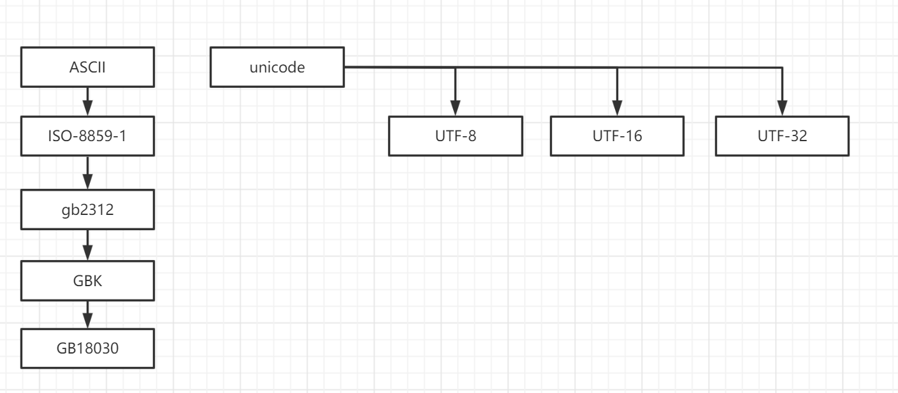

# 加密

- [代码案例](https://gitee.com/luckSnow/knowledge/tree/master/learn_code/src/main/java/com/zx/_04_%E5%AE%89%E5%85%A8)
- [教程](https://www.liaoxuefeng.com/wiki/1252599548343744/1255943717668160)
- [国密算法分类](https://zhuanlan.zhihu.com/p/577195882)

## 1.常见的加密算法

- BASE64进行加密/解密：通常用作对二进制数据进行加密。没有安全性
  
- MD5(Message Digest Algorithm)加密算法。是一种单向加密算法，只能加密不能解密。
> 目前已经不在安全，推荐使用  SHA

- SHA(Secure Hash Algorithm，安全散列算法)：数字签名等密码学应用中重要的工具，被广泛地应用于电子商务等信息安全领域

- DES(Data Encryption Standard)对称加密/解密： 数据加密标准算法,和BASE64最明显的区别就是有一个工作密钥，该密钥既用于加密、也用于解密，并且要求密钥是一个长度至少大于8位的字符串
> 目前已经不在安全，已经可以被破解，推荐使用RSA

- AES。对称加密算法。

- RSA非对称加密/解密： 非对称加密算法的典型代表，既能加密、又能解密。和对称加密算法比如DES的明显区别在于用于加密、解密的密钥是不同的。使用RSA算法，只要密钥足够长(一般要求1024bit)，加密的信息是不能被破解的。

- HMAC(Hash Message Authentication Code，散列消息鉴别码)：使用一个密钥生成一个固定大小的小数据块，即MAC，并将其加入到消息中，然后传输。接收方利用与发送方共享的密钥进行鉴别认证

对称加密 与 非对称加密？
1. 对称加密加密与解密使用的是同样的密钥，所以速度快，但由于需要将密钥在网络传输，所以安全性不高
2. 非对称加密使用了一对密钥，公钥与私钥，所以安全性高，但加密与解密速度慢
   它使用了一对密钥，公钥（public key）和私钥（private key）。私钥只能由一方安全保管，不能外泄，而公钥则可以发给任何请求它的人。
   非对称加密使用这对密钥中的一个进行加密，而解密则需要另一个密钥。比如，你向银行请求公钥，银行将公钥发给你，你使用公钥对消息加密，
   那么只有私钥的持有人--银行才能对你的消息解密。与对称加密不同的是，银行不需要将私钥通过网络发送出去，因此安全性大大提高。

## 2.编码

### 2.1.字符编码

#### 2.1.1.常见字符编码
1.ASCII码

总共128个，用一个字节的低7位表示，0~31是控制字符，如换行、回车、删除等，32~126是打印字符，可以通过键盘输入并且能够显示出来.

在计算机中，所有的数据在存储和运算时都要使用二进制数表示（因为计算机用高电平和低电平分别表示1和0），
例如，像a、b、c、d这样的52个字母（包括大写）以及0、1等数字还有一些常用的符号（例如*、#、@等）在计算机中存储时也要使用二进制数来表示，
而具体用哪些二进制数字表示哪个符号，当然每个人都可以约定自己的一套（这就叫编码），而大家如果要想互相通信而不造成混乱，
那么大家就必须使用相同的编码规则，于是美国有关的标准化组织就出台了ASCII编码，统一规定了上述常用符号用哪些二进制数来表示。

2.ISO-8859-1

扩展自ASCII，仍然是单字节编码，一共能表示256个字符。

ISO-8859-1收录的字符除ASCII收录的字符外，还包括西欧语言、希腊语、泰语、阿拉伯语、希伯来语对应的文字符号。
欧元符号出现的比较晚，没有被收录在ISO-8859-1当中。属于单字节编码，最多能表示的字符范围是0-255，应用于英文系列。
- HTML 4.01 支持 ISO 8859-1 (Latin-1) 字符集。
- ISO-8859-1 的较低部分（从 0 到 127 之间的代码）是最初的 7 比特 ASCII。
- ISO-8859-1 的较高部分（从 160 到 255 之间的代码）全都有实体名称。

这些符号中的大多数都可以在不进行实体引用的情况下使用，但是实体名称或实体编号为那些不容易通过键盘键入的符号提供了表达的方法。

3.GB2312

早期，中国使用的标准是gb2312，双字节编码。总编码范围A1~F7 ，其中A1~A9是符号区，包含682个符号，从B0~F7是汉字区，包含6763个汉字，
而英文字母和iso8859-1一致（兼容iso8859-1编码）

4.GBK【汉字的国标码】

扩展自GB2312，能表示21003个汉字，其编码和GB2312是兼容的。GBK的文字编码是用双字节来表示的，即不论中、英文字符均使用双字节来表示，
为了区分中文，将其最高位都设定成。GBK包含全部中文字符

5.GB18030

在实际应用系统中使用的并不广泛，在技术上是GBK的超集，并与之兼容。是目前中国字符集最全的国家标准字符集。

6.Unicode

这是最统一的编码，可以用来表示所有语言的字符，而且是定长双字节（也有四字节的）编码，包括英文字母在内。
所以可以说它是不兼容iso8859-1编码的，也不兼容任何编码。不过，相对于iso8859-1编码来说，uniocode编码只是在前面增加了一个0字节，
比如字母a为"00 61"。

需要说明的是，定长编码便于计算机处理（注意GB2312/GBK不是定长编码），而unicode又可以用来表示所有字符，所以在很多软件内部是使用unicode编码来处理的，
比如java。其实就是原始的unicode字符集非常的大，大概超过100万字符，所有有了不同的实现格式，用来降低字符集的大小。

unicode编码的实现格式有三种：UTF-8,UTF-16,UTF-32。其中最流行的就是UTF-8，但是Unicode、UTF-8、UTF-16、UTF-32之间是相互不兼容的，需要使用程序实现转化。

7.UTF-8

是用以解决国际上字符的一种多字节编码，它对英文使用8位（即一个字节），中文使用24为（三个字节）来编码，使用Unicode编码，
一个英文字符要占用两个字节，在Internet上，大多数的信息都是用英文来表示的，如果都采用Unicode编码，将会使数据量增加一倍。
为了减少存储和传输英文字符数据的数据量，可以使用UTF-8编码。

总结：
1. ASCII 与 Unicode 是 2 套独立的编码，作为各类衍生编码的基础。
2. ASCII系（ISO-8859-1 、GB2312、GBK、GB18030） 与 Unicode系（UTF-8、UTF-16、UTF-32） 之间都必须通过Unicode编码才能相互转换
   1. GBK、GB2312－>Unicode－>UTF8
   2. UTF8－>Unicode－>GBK、GB2312
   


#### 2.1.2.编码表

各类编码表，下载地址

- [【编码表】GB2312简体中文编码表.txt](./encode/【编码表】GB2312简体中文编码表.txt)
- [【编码表】gb18030的汉字编码.xls](./encode/【编码表】gb18030的汉字编码.xls)
- [【编码表】GBK编码表.txt](./encode/【编码表】GBK编码表.txt)
- [【编码表】Unicode汉字编码表.txt](./encode/【编码表】Unicode汉字编码表.txt)
- [【编码表】Unicode范围.txt](./encode/【编码表】Unicode范围.txt)
- [【编码表】UTF-8编码表.txt](./encode/【编码表】UTF-8编码表.txt)

#### 2.1.3.案例

<p style="color: red">1.随机生成汉字</p>
使用GB2312比较靠谱！
- GB2312中高位是从：B0~FF
- GB2312中低们是从：A0~FF，其中00~99是GBK添加的，有很多生僻字！

可以自己去观察GB2312，你会发现其中高位在DF之后也会有很多生僻字，所以我们应该把高位定在B0~D0之间。
如果使用汉字验证码，那么可能会出现图片宽度的问题！这需要你细心的去调整它！ 如果你的时间有限，那么还是把这东东先放一下吧！


### 2.2.URL编码
URL编码的目的是把任意文本数据编码为%前缀表示的文本，便于浏览器和服务器处理

之所以需要URL编码，是因为出于兼容性考虑，很多服务器只识别ASCII字符。但如果URL中包含中文、日文

### 2.2.Base64编码
Base64编码的目的是把任意二进制数据编码为文本，但编码后数据量会增加1/3。
例如，电子邮件协议就是文本协议，如果要在电子邮件中添加一个二进制文件，就可以用Base64编码，然后以文本的形式传送。

Base64常用于在通常处理文本数据的场合，表示、传输、存储一些二进制数据。包括MIME的email，email via MIME, 在XML中存储复杂数据

## 3.哈希算法
哈希算法（Hash）又称摘要算法（Digest），它的作用是：对任意一组输入数据进行计算，得到一个固定长度的输出摘要。

哈希算法最重要的特点就是：
- 相同的输入一定得到相同的输出；
- 不同的输入大概率得到不同的输出。

常见的hash算法：
- MD5
- SHA-1
- RipeMD-160   
- SHA-256
- SHA-512
- HmacMD5。可以看作带有一个安全的key的MD5。使用HmacMD5而不是用MD5加salt

### 3.1.hash碰撞
根据碰撞概率，哈希算法的输出长度越长，就越难产生碰撞，也就越安全。
hash碰撞是避免不了的，碰撞不可怕，我们担心的不是碰撞，而是碰撞的概率，因为碰撞概率的高低关系到哈希算法的安全性。

常用的解决方法：
- 数组链表法（hashMap）
- 开放寻址法（ThreadLocalMap）
- hash一致性。极大程度的降低碰撞

### 3.2.MD5

一种被广泛使用的密码散列函数，无论输入任何数据都可以产生出一个128位（16字节）的散列值（hash value），用于确保信息传输完整一致。

- 1996年后该算法被证实存在弱点，可以被加以破解，对于需要高度安全性的数据，专家一般建议改用其他算法，如SHA-2。
- 2004年，证实MD5算法无法防止碰撞（collision），因此不适用于安全性认证，如SSL公开密钥认证或是数字签名等用途。
- 2007年，fastcool， 相同前缀碰撞，可以生成2个MD5相同，但是可实现的行为不同的数据。

实现原理：
1. 填充对其。将输入转为二进制，将其转为 512 的整数倍。比如 750B 填充后 为 1024B。填充后的最后64位为数据的元数据。 
2. 分块。将填充后的数据，按照 512 为一个数据块。每个 数据块 分为 4个 128，比如 a,b,c,d四组
3. 多轮压缩。a,b,c,d四组中每个值都进行4轮 与、或、非、移位运算。将512转为128。
4. 第一个数据块的结果与第二个数据块加和到一个，再对第二个数据块进行多轮压缩，直到最后只剩下128。

结论:
1. 文件越大，MD5的时间越长。
2. MD5值是不可逆的。
3. 结果的固定的128位，输入的没有限制的，所以一定存在2个不同的输入有同一个MD5，但是这种方式几乎不可能被破解。

## 4.（HTTP基本认证）Basic Authentication
教程： https://zhuanlan.zhihu.com/p/64584734

代码案例： HttpBasicAuthentication.java

优点：使用简单，应用广泛。

缺点：a)不安全，容易导致密码被破解;b)容易被人利用进行重放攻击;c)即使不被破解，也可以被中间人进行报文篡改

## 5.签名算法（sign）

1. 接口安全问题
- 请求身份是否合法？
- 请求参数是否被篡改？
- 请求是否唯一？

2. AccessKey&SecretKey （开放平台）

代码案例： TokenUtil.java

重要的两个数据：
- accessKey 开发者标识，确保唯一,作为请求的参数
- secretKey 用于接口加密，确保不易被穷举，生成算法不易被猜测，不出现在请求的报文中。

我们可以简单理解，accessKey 为用户账号，secretKey 为密码
接口调用的时候，我们将accessKey  secretKey  timestamp 请求的参数 组合在一起，生产MD5值，也就是sign
我们发生请求的时候，将accessKey  timestamp 请求的参数 sign 发送出去，secretKey  不发送出去
服务端，拿着accessKey  查到 secretKey，将数据生产新的sign值，与客户端发送来的sign进行对比，保持一致的话，校验就通过了。
也确保了客户端发送的数据没有被中间人篡改
而且我们也可以使用timestamp 进行时间的控制，比如，一个sign只能被调用一次，或者同一个sign，可以在指定的有效时间内多次调用等。


3. Token&AppKey（APP）
我们一般利用cookie，保存token信息。
token中，我们一般可以保存一些用户登录相关的系统，比如，账号名，用户名，权限，机构等等。
AppKey，我们在生产token的时候，进行数据的加密，生产token数据，返回给客户端，AppKey本身不在请求的报文中。这样即使Token被劫持，对方不知道AppKey和签名算法，就无法伪造请求和篡改参数

## 6.uuid

百度百科：[https://baike.baidu.com/item/UUID/5921266?fr=aladdin](https://baike.baidu.com/item/UUID/5921266?fr=aladdin)

UUID 的十六个八位字节被表示为 32个十六进制数字
以连字号分隔的五组来显示，形式为 8-4-4-4-12，总共有 36个字符（即三十二个英数字母和四个连字号）
例如： 123e4567-e89b-12d3-a456-426655440000

格式为 ： xxxxxxxx-xxxx-Mxxx-Nxxx-xxxxxxxxxxxx

上面的以数字 M开头的四位表示 UUID 版本，目前UUID的规范有5个版本，M可选值为1, 2, 3, 4, 5 ;各个版本的具体介绍如下所示：
- version 1：0001。基于时间和 MAC 地址。由于使用了 MAC 地址，因此能够确保唯一性，但是同时也暴露了 MAC 地址，私密性不够好。
- version 2：0010。DCE 安全的 UUID。该版本在规范中并没有仔细说明，因此并没有具体的实现。
- version 3：0011。基于名字空间 (MD5)。用户指定一个名字空间和一个字符串，通过 MD5 散列，生成 UUID。字符串本身需要是唯一的。
- version 4：0100。基于随机数。虽然是基于随机数，但是重复的可能性可以忽略不计，因此该版本也是被经常使用的版本。
- version 5：0101。基于名字空间 (SHA1)。跟 Version 3 类似，但是散列函数编程了 SHA1。

上面以数字 N开头的四个位表示 UUID 变体( variant )，变体是为了能兼容过去的 UUID，以及应对未来的变化，目前已知的变体有如下几种，因为目前正在使用的 UUID 都是 variant1，所以取值只能是 8，9，a，b 中的一个(分别对应1000,1001,1010,1011)。
- variant 0：0xxx。为了向后兼容预留。
- variant 1：10xx。当前正在使用的。
- variant 2：11xx。为早期微软 GUID 预留。
- variant 3：111x。为将来扩展预留。目前暂未使用。

## 7.解压缩

### 7.1.gzip
gzip是一种数据格式，采用用deflate算法压缩数据；gzip是一种流行的数据压缩算法，应用十分广泛，尤其是在Linux平台。
当GZIP压缩到一个纯文本数据时，效果是非常明显的，大约可以减少70％以上的数据大小。


## 8.国密算法

国密算法是国家密码局制定标准的一系列算法。其中包括了对称加密算法，椭圆曲线非对称加密算法，杂凑算法。具体包括SM1,SM2,SM3等，其中：
- SM1，对称加密算法，加密强度为128位，采用硬件实现；
- SM2，为国家密码管理局公布的公钥算法，其加密强度为256位。其它几个重要的商用密码算法包括：
- SM3，密码杂凑算法，杂凑值长度为32字节，和SM2算法同期公布，参见《国家密码管理局公告（第 22 号）》；
- SM4，对称加密算法，随WAPI标准一起公布，可使用软件实现，加密强度为128位。

简单说明：RSA换成SM2、MD5换成SM3，AES换成SM4。

使用方式：
```xml
<!--轻量级密码学库-->
<!-- https://www.bouncycastle.org/java.html -->
<dependency>
   <groupId>org.bouncycastle</groupId>
   <artifactId>bcprov-jdk15to18</artifactId>
   <version>1.68</version>
</dependency>

<!--hutool 使用bcprov封装了SmUtil -->
<dependency>
   <groupId>cn.hutool</groupId>
   <artifactId>hutool-all</artifactId>
   <version>5.7.17</version>
</dependency>
```