# 数据结构

[数据结构学习资料](https://www.cs.usfca.edu/~galles/visualization/Algorithms.html)

通过交互的方式学习各种数据结构。

## 1.数据结构

数据结构是以某种特定的布局方式存储数据的容器。这种“布局方式”决定了数据结构对于某些操作是高效的，而对于其他操作则是低效的。
首先我们需要理解各种数据结构，才能在处理实际问题时选取最合适的数据结构。

### 1.1.为什么需要数据结构
数据是计算机科学当中最关键的实体，而数据结构则可以将数据以某种组织形式存储，因此，数据结构的价值不言而喻。
无论你以何种方式解决何种问题，你都需要处理数据——无论是涉及员工薪水、股票价格、购物清单，还是只是简单的电话簿问题。
数据需要根据不同的场景，按照特定的格式进行存储。有很多数据结构能够满足以不同格式存储数据的需求。

### 1.2.常见的数据结构
- 数组
- 栈
- 队列
- 链表
- 树
- 图
- 树
- 字典树（这是一种高效的树形结构，但值得单独说明）
- 散列表（哈希表）

### 1.3.常见的数据库数据结构

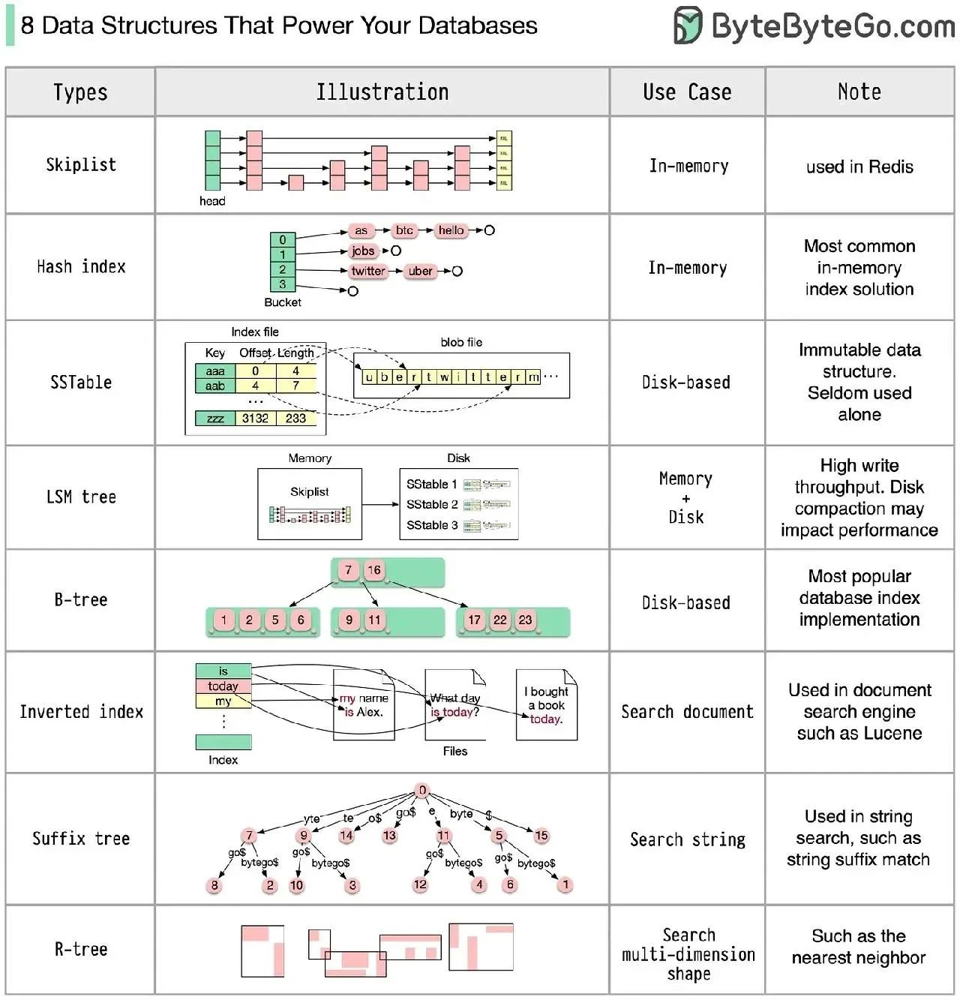

- 跳表 (Skip Lists):跳表被用于Redis等内存数据库中作为有序集合的底层实现。
  - 优势：跳表提供类似于平衡树的操作时间复杂度，实现简单。提供快速搜索、插入、删除操作，支持高效地执行范围查询和近似查找。
  - 劣势：在极端情况下性能可能不如平衡树，跳表也需要更多的空间来存储指针信息。
- 哈希索引 (Hash Index):哈希表适用于快速键值查找的场景，如缓存系统和一些数据库的索引。
  - 优势：哈希表提供了常数时间复杂度的搜索性能，非常适合等值查询。
  - 劣势：不支持范围查询，对于哈希冲突处理需要额外的逻辑，且哈希表的性能对哈希函数的质量敏感。
- SSTable (Sorted String Table):一种持久化到磁盘的有序键值对集合，常用于NoSQL数据库的数据文件格式。
  - 优势：由于数据有序，SSTable支持高效的范围查询，并且读取时可以利用顺序I/O的优势。
  - 劣势：写入性能不如其他数据结构，因为每次更新都需要重写整个文件或执行较为复杂的合并操作。
- LSM树 (Log-Structured Merge-Tree):适用于写入密集型的数据库系统，如LevelDB和RocksDB。
  - 优势：提供非常高的写入性能和批处理能力，支持对数据的压缩。
  - 劣势：因为涉及多层查找和合并操作，读取性能不如其他数据结构。
- B/B+树:广泛用于RDBMS中实现索引。
  - 优势：B/B+树支持高效的插入、删除和范围查询操作，且由于它们的平衡性质，操作的时间复杂度是对数的。
  - 劣势：对于写入密集型的应用，特别是存在大量随机写入的场景，可能不如LSM树高效。
- 倒排索引 (Inverted Index):用于文本搜索引擎，如Elasticsearch和Apache Lucene。
  - 优势：支持文本快速搜索和查询，适用于全文搜索和多条件组合搜索。
  - 劣势：更新成本较高，数据结构复杂，不适用于频繁变化的数据。
- 后缀树 (Suffix Tree):用于字符串搜索、生物信息学等领域。
  - 优势：可以快速解决多种字符串相关的问题，如查找子字符串出现的位置、查找最长重复子字符串等。
  - 劣势：空间占用较大，构建过程复杂且耗时。
- R树 (R-Tree):适用于空间数据库中索引多维空间数据，如地理信息系统（GIS）。
  - 优势:支持多维范围查询和最邻近搜索，适合存储空间数据。
  - 劣势:更新成本高，查询性能依赖于数据分布。

## 2.数组
数组是最简单、也是使用最广泛的数据结构。栈、队列等其他数据结构均由数组演变而来。

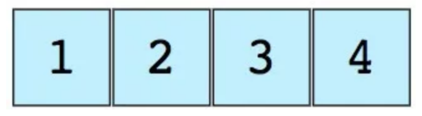

特点：
- 使用连续内存
- 寻址的时间复杂度为 O(1)
- 长度不可改变。很多技术的底层实现，都是隐藏了动态扩容的实现方式。大多数的都是重新分配
- 可能创建出多维度数组。

## 3.栈

著名的撤销操作几乎遍布任意一个应用。但你有没有思考过它是如何工作的呢？这个问题的解决思路是按照将最后的状态排列在先的顺序，
在内存中存储历史工作状态（当然，它会受限于一定的数量）。这没办法用数组实现。但有了栈，这就变得非常方便了。
可以把栈想象成一列垂直堆放的书。为了拿到中间的书，你需要移除放置在这上面的所有书。这就是LIFO（后进先出）的工作原理。
下图是包含三个数据元素（1，2和3）的栈，其中顶部的3将被最先移除：

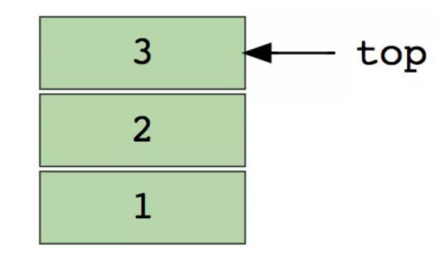

## 4.队列
与栈相似，队列是另一种顺序存储元素的线性数据结构。栈与队列的最大差别在于栈是LIFO（后进先出），而队列是FIFO，即先进先出。
下图是包含四个元素（1，2，3和4）的队列，其中在顶部的1将被最先移除：
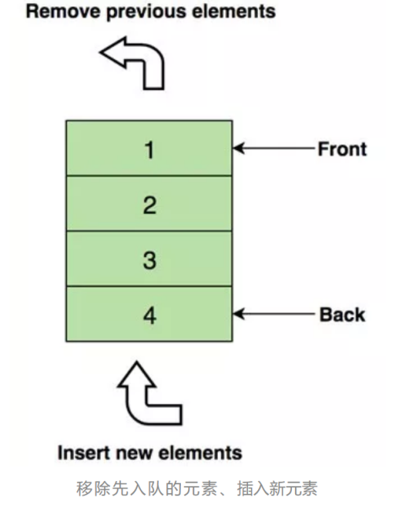

## 5.链表
链表是另一个重要的线性数据结构，乍一看可能有点像数组，但在内存分配、内部结构以及数据插入和删除的基本操作方面均有所不同。
链表就像一个节点链，其中每个节点包含着数据和指向后续节点的指针。 链表还包含一个头指针，它指向链表的第一个元素，但当列表为空时，它指向null或无具体内容。
链表一般用于实现文件系统、哈希表和邻接表。

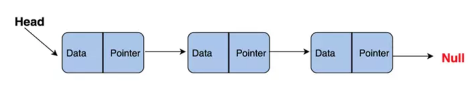

类型：
- 单链表（单向）
- 双向链表（双向）

## 6.图
图是一组以网络形式相互连接的节点。节点也称为顶点。 一对节点（x，y）称为边（edge），表示顶点x连接到顶点y。边可以包含权重/成本，显示从顶点x到y所需的成本。

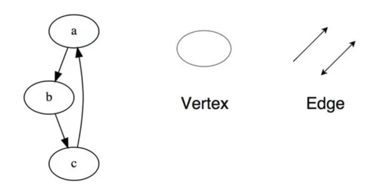

图的类型
- 无向图
- 有向图

图可以用两种形式表示
- 邻接矩阵
- 邻接表

图遍历算法
- 广度优先搜索
- 深度优先搜索

## 7.树
树形结构是一种层级式的数据结构，由顶点（节点）和连接它们的边组成。 树类似于图，但区分树和图的重要特征是树中不存在环路。
树形结构被广泛应用于人工智能和复杂算法，它可以提供解决问题的有效存储机制。
这是一个简单树的示意图，以及树数据结构中使用的基本术语：

### 7.1.树的概念
简单的概念
- 如果n=0,则是一颗空树
- 如果n>0,树就会有一个特殊的节点，这个节点没有父节点，被称为根节点（root）
- 除根节点之外的其余数据元素被分为m(m>=0)个互不相交的集合T1,T2....Tm-1,这个些集合中的每一个都是一颗树，称为子树。
- Parent - 父节点
- Child - 子节点
- Leaf - 叶子节点
- Sibling - 兄弟节点
这是一个简单树的示意图，以及树数据结构中使用的基本术语：
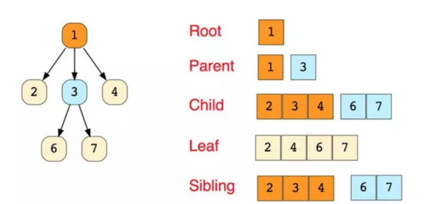

- 节点的度，可以简单理解为有几个子节点
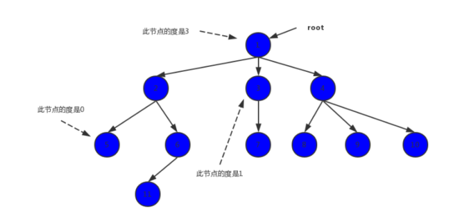
  
- 树的度，树中节点度的最大值。所有节点的度的最大值是3，树的度就是3
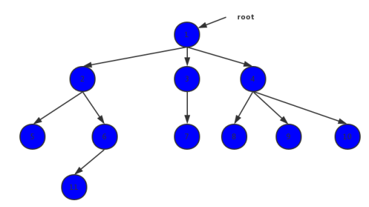
  
- 节点的层次，根节点在第一层，它的子女在第二层
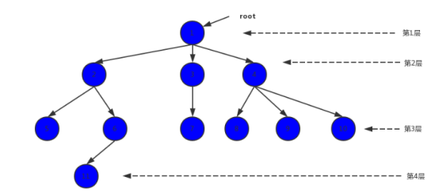

- 树的深度
树中距离根节点最远的节点所处的层次就是树的深度，正常情况下层次等于深度
  
- 树的高度
叶节点的高度为1，非叶节点的高度是它子女节点高度的最大值加1。高度与深度的值是相等的，但是两者计算的公式是不一样的。
- 有序树
树中节点的各棵字树 T1，T2...是有次序的，T1是第1棵子树，T2是第2棵子树
- 无序树
树中节点的各棵子树之间的次序不重要，可以互相交换位置
- 森林
森林是m(m>=0)棵树的集合，这片森林里有3棵树，如果我们增加一个根节点1，让2 3 4 成为它的子女，那么就森林就变成了一颗树

### 7.2.常见的树结构
- N元树
- 平衡树
- 二叉树
- 二叉搜索树
- AVL树
- 红黑树
- 2-3树

## 8.字典树
字典树，也称为“前缀树”，是一种特殊的树状数据结构，对于解决字符串相关问题非常有效。它能够提供快速检索，主要用于搜索字典中的单词，在搜索引擎中自动提供建议，甚至被用于IP的路由。
以下是在字典树中存储三个单词“top”，“so”和“their”的例子：

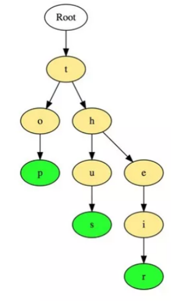

这些单词以顶部到底部的方式存储，其中绿色节点“p”，“s”和“r”分别表示“top”，“thus”和“theirs”的底部。

## 9.hash表
哈希法（Hashing）是一个用于唯一标识对象并将每个对象存储在一些预先计算的唯一索引（称为“键（key）”）中的过程。
因此，对象以键值对的形式存储，这些键值对的集合被称为“字典”。可以使用键搜索每个对象。基于哈希法有很多不同的数据结构，但最常用的数据结构是哈希表。

哈希表通常使用数组实现。

散列数据结构的性能取决于以下三个因素
- 哈希函数
- 哈希表的大小
- 碰撞处理方法

## 10.btree 与 b+tree

多叉树的作用，使得节点数量变少。查找节点的数量变少。
多叉树，降层高。为了寻址次数减少。

btree和b+树的区别
1. 在btree基础上，将所有叶子节点做了一个链表；
2. b+数所有数据都存在叶子节点上，内节点不存储数据，当作索引来用。b树叶子节点和内节点都存储数据，不重复。主要用于磁盘存储的时候做索引。

