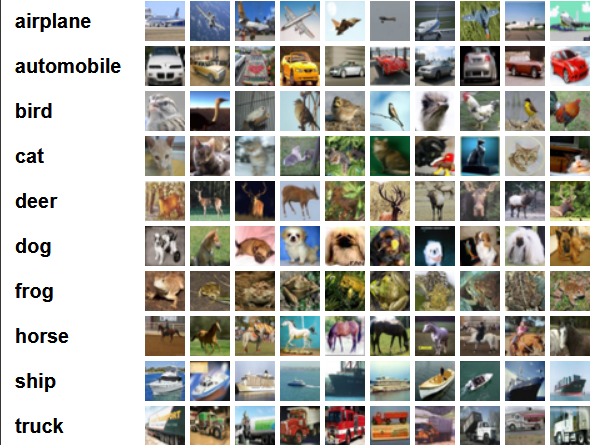

# 机器学习


## 1.算法基础

### 1.1.机器学习方向包括

- 模式识别
- 数据挖掘
- 统计学习
- 计算机视觉
- 语音识别
- 自然语言处理

### 1.2.基本步骤
1. 训练样本  
2. 特征抽取 
3. 学习函数
4. 预测

### 1.3.python库

- Numpy       : 科学计算库
- pandas      : 数据分析处理库 
- matplotlib  : 数据可视化库
- scilit-lean : 机器学习库
- TensorFlow  : 机器学习库

### 1.4.分类

- 监督学习:比如判断照片里面的动物是否是猫，具有明确的标签。
- 非监督学习:比如判断照片里面的是那种动物，标签不明确。

### 1.5.算法基础
1. 线性回归
2. 决策树与随机森林
3. 贝叶斯
4. xgboost
5. 支持向量机算法
6. ARIMA时间序列模型
7. 神经网络
8. 聚类算法
9. 推荐系统

## 2.基于Linux生态的十大AI开源框架

### 2.1.Deeplearning4j：为Java用户量身定制

官网：http://deeplearning4j.org/

Deeplearning4j(Deep Learning For Java)是Java和Scala环境下的一个开源分布式的深度学习项目，由总部位于美国旧金山的商业智能和企业软件公司Skymind牵头开发，
并得到了腾讯的投资。正如它的命名，Deeplearning4j的运行需要Java虚拟机JVM的支持。

Deeplearning4j团队在官网表示，他们希望通过一些深度学习算法的开发，将商业带入智能化数据的时代。
也正是为了实现这一理想，惠及更多的用户，因此选择了移植性更好的Java环境来实现这些算法。
目前，Deeplearning4j的这些算法已经在谷歌、Facebook和微软等平台得到了广泛应用。

值得一提的是，为了便于开发者自由定制，Deeplearning4j已经开放了尽可能多的算法调节接口，并对接口参数做出了详尽解释。
同时，Deeplearning4j团队还开发了针对矩阵运算的ND4J和ND4S库(N-Dimensional Arrays for Java/Scala)，同样需要JVM的支持。

Deeplearning4j遵循Apache 2.0开源协议，提供了基于AWS云服务的GPU运算支持，以及微软服务器框架的支持。

### 2.2.Caffe：广受欢迎的深度学习框架

官网：http://caffe.berkeleyvision.org/

Caffe的全称是 “Convolution Architecture For Feature Extraction”，意为“用于特征提取的卷积架构”，
主要开发者来自伯克利大学的视觉与学习中心(Berkeley Vision and Learning Center，BVLC)，基于BSD 2-Clause开源许可协议发布。

Caffe是业内著名的深度学习框架， 根据官网介绍 ，其主要特点是：运算速度快(官方显示在单片NVIDIA K40 GPU的运算能力下，
Caffe每天可以处理超过60M的图片数据)，模块定制方便(在CPU或GPU之间的转换只需要简单修改一下参数设定)，
扩展能力强大(目前有超过一千名开发者基于Caffe开发了分支版本 )，以及丰富的社区支持(Caffe已经被授权给各种研究机构、初创公司和工业集团)，
因此特别适合于神经网络建模和图像处理任务。

### 2.3.H2O：企业级机器学习框架

官网：http://www.h2o.ai/

H2O(即水的化学式)是一个开源、快速、可扩展的分布式机器学习框架，同时提供了大量的算法实现。
它支持深度学习、梯度推进(Gradient Boosting)、随机森林(Random Forest)、广义线性模型(即逻辑回归，弹性网络)等各种机器学习算法。

H2O框架的核心代码由Java编写，数据和模型通过分布式的key/value存储在各个集群节点的内存中，算法使用Map/Reduce框架实现，并使用了Java中的Fork/Join机制来实现多线程。

H2O是一个更关注企业用户的人工智能分析工具，它聚焦于为掌握大量数据的企业用户提供快速精准的预测分析模型，从海量数据中提取有助于商业决策的信息。

根据H2O官方的数据，目前已经有超过7万名数据科学家和8万家组织机构成为了H2O平台的忠实拥趸。


### 2.4.MLlib：基于Spark框架的机器学习算法实现库

官网：https://spark.apache.org/mllib/

MLlib是Apache开源项目Spark针对一些常用的机器学习算法的实现库，同时也包括了相关的测试程序和数据生成器。

按照官网的描述，MLlib的主要特点是易用(天生兼容Spark框架的API接口和Python、Java、Scala等多种语言)、高性能(依靠Spark的数据管理能力，
运行迭代和逻辑回归算法时比Hadoop框架快100倍)和易于部署(可以直接在现有的Hadoop数据集群上运行)。

MLlib目前支持分类、回归、推荐、聚类、生存分析等多种机器学习算法。


### 2.5.Apache Mahout：Hadoop广泛采用的机器学习开源框架

官网：http://mahout.apache.org/

Apache Mahout同样也是一个Apache开源项目，与MLlib相对应，Mahout是应用在Hadoop平台下的机器学习开源框架。
Mahout有如下三个主要特点：
1. 提供简单、可扩展的编程环境和框架;
2. 同时为Scala + Apache Spark、H2O以及Apache Flik平台提供打包好的算法实现;
3. 支持R语言的语法规则进行矩阵计算。


### 2.6.OpenNN：专注神经网络的实现库

官网：http://www.opennn.net/

OpenNN的全称为“Open Neural Networks Library”，即开源神经网络库，其核心代码由C++编写，从名字就可以看出，
其主要面向深度学习领域，助力于用户构建各种不同的神经网络模型。

据官方描述，OpenNN可用于实现监督学习场景中任何层次的非线性模型，同时还支持各种具有通用近似属性的神经网络设计。

除了模型的多层支持外，OpenNN最主要优势还在于强大的性能表现。具体来说就是，OpenNN能够通过C++语言实现的核心代码高效地调节内容使用，
通过OpenMP库很好地平衡多线程CPU调用，以及通过CUDA工具对GPU进行加速。


### 2.7.Oryx 2：重新设计了Lambda架构

官网：http://oryx.io/

Oryx 2是Oryx项目的2.0版，前身名为 Myrrix，后来被大数据公司 Cloudera 收购，才改名为 Oryx。

Oryx 2.0关注于大规模机器学习/预测分析基础框架的实时表现，它基于Apache Spark和Apache Kafka框架开发，并重新设计了Lambda架构，使得层次之间的复用性更强。

2.0版相比之前实现了更多算法，包括ALS协同过滤、随机森林、以及K-means++等。

### 2.8.OpenCyc：全球最庞大、最完备的通用型知识库与常识推理引擎

官网：http://www.cyc.com/platform/opencyc/

OpenCyc是Cycorp公司推出的一个基于Cyc的开源版本，而Cyc是目前全球最庞大、最完备的通用型知识库与常识推理引擎。

OpenCyc包含数十万个精心组织的Cyc词条。Cycorp公司不但免费提供OpenCyc，同时也鼓励开发者基于OpenCyc开发针对于特定应用领域的分支版本。

目前，OpenCyc已经被成功应用在大数据建模、语言数据整合、智能文本理解、特定领域的专家系统建模和人工智能游戏。

### 2.9.Apache SystemML：专注于大数据分析的开源机器学习平台

官网：http://systemml.apache.org/

SystemML是一个利用机器学习算法进行大数据分析的开源AI平台，其主要特点是支持R语言和Python的语法，专注于大数据分析领域，以及专门为高阶数学计算设计。
按照官网的介绍，Apache SystemML基于Apache Spark框架运行，其最大的特点就是能够自动、逐行地评估数据，并根据评估结果确定用户的代码应该直接运行在驱动器上还是运行在Apache Spark集群上。
除了Apache Spark之外，SystemML还支持Apache Hadoop、Jupyter和Apache Zeppelin等多个平台。目前，SystemML技术已经成功应用在交通、航空和金融等多个领域。

### 2.10.NuPIC：基于层级实时存储算法的机器智能平台

官网：http://numenta.org/

NuPIC是一个与众不同的开源机器智能平台，它基于一种大脑皮层理论，即“层级实时存储算法”(Heirarchical Temporary Memory，HTM)。
NuPIC聚焦于分析实时数据流，可以通过学习数据之间基于时间的状态变化，对未知数据进行预测，并揭示其中的非常规特性。

NuPIC关键的功能特性包括：
1. 持续的在线学习：NuPIC模型可以持续根据快速变化的数据流进行实时调整;
2. 时间和空间分析：像人脑一样，NuPIC可以同时模拟时间和空间的变化;
3. 实时的数据流分析：智能化的数据分析不会随着数据量的增加而改变;
4. 预测和建模：通过通用性的大脑皮层算法，对数据进行预测、建模和学习;
5. 强大的异常检测能力：实时检测数据流的扰动，不依靠僵化的阈值设置和过时的算法;
6. 层级实时存储算法：支持全新的HTM计算架构。


### 2.11.TensorFlow，真正的主流

官网：http://www.tensorfly.cn/

TensorFlow™ 是一个采用数据流图（data flow graphs），用于数值计算的开源软件库。
节点（Nodes）在图中表示数学操作，图中的线（edges）则表示在节点间相互联系的多维数据数组，即张量（tensor）。

它灵活的架构让你可以在多种平台上展开计算，例如台式计算机中的一个或多个CPU（或GPU），服务器，移动设备等等。

TensorFlow 最初由Google大脑小组（隶属于Google机器智能研究机构）的研究员和工程师们开发出来，用于机器学习和深度神经网络方面的研究，
但这个系统的通用性使其也可广泛用于其他计算领域。


### 2.12.HanLP

官网：https://github.com/FudanNLP/fnlp

GitHub地址：https://nndl.github.io/

PDF讲义：https://nndl.github.io/nndl-book.pdf

示例代码：https://github.com/nndl/nndl-codes

课后练习：https://github.com/nndl/exercise

复旦大学--神经网络与机器学习

### 2.13.总结
由于2016仅仅是人工智能走向主流的元年，未来随着技术的进一步发展和革新，势必会出现更多、更丰富的开发工具。
这里值得注意的一点是：工具的意义不仅在于解决了日常研发中遇到的各种问题，更在于降低了开发的难度，引导了更多人投入到人工智能的研发之中。


## 3.数据集

### 3.1.CIFAR-10

CIFAR-10和CIFAR-100是带有标签的数据集，都出自于规模更大的一个数据集，
他有八千万张小图片   http://groups.csail.mit.edu/vision/TinyImages

这个是一个大项目，你可以点击那个big map提交自己的标签，可以帮助他们训练让计算机识别物体的模型）

#### 3.1.1.CIFAR-10
该数据集共有60000张彩色图像，这些图像是32*32，分为10个类，每类6000张图。
这里面有50000张用于训练，构成了5个训练批，每一批10000张图；另外10000用于测试，单独构成一批。
测试批的数据里，取自10类中的每一类，每一类随机取1000张。抽剩下的就随机排列组成了训练批。
注意一个训练批中的各类图像并不一定数量相同，总的来看训练批，每一类都有5000张图。

其中每张照片为32*32的彩色照片，每个像素点包括RGB三个数值，数值范围 0 ~ 255。有照片分属10个不同的类别，
分别是 'airplane', 'automobile', 'bird', 'cat', 'deer', 'dog', 'frog', 'horse', 'ship', 'truck'

下面这幅图就是列举了10各类，每一类展示了随机的10张图片



#### 3.1.2.数据集读取

目前支持python、matlab、c三种语言的库。

下载地址： http://www.cs.toronto.edu/~kriz/cifar.html

```python
import pickle

#读取数据
def load_file(filename):
    with open(filename, 'rb') as fo:
        data = pickle.load(fo, encoding='latin1')
    return data

#读取一个数据集，data_batch_1..5和test_batch的内容格式是一样的
data = load_file('F:/1. Java/4. 机器学习（未完成）/数据集/cifar-10-batches-py/test_batch')

print(data.keys())#dict_keys(['batch_label', 'labels', 'data', 'filenames'])
print(data['batch_label'])#数据集的描述信息： testing batch 1 of 1
print(data['labels'])#每个图片的类型，使用0~9表示
print(data['filenames'])#数据集中图片的名称['domestic_cat_s_000907.png'....
print(data['data'])#真正的数据，每个数据都是一个32*32的图片

# 读取数据集的元数据(描述数据集的数据)
'''
    {'label_names': ['airplane', 'automobile', 'bird', 'cat', 'deer', 'dog', 'frog', 'horse', 'ship', 'truck'], 
    'num_cases_per_batch': 10000, 
    'num_vis': 3072}
'''

meta = load_file('F:/1. Java/4. 机器学习（未完成）/数据集/cifar-10-batches-py/batches.meta')
print(meta)
```

#### 3.1.3.内容定义
1.Data
   
一个10000*3072的numpy数组（numpy:https://docs.scipy.org/doc/numpy-dev/user/quickstart.html），数据类型是无符号整形uint8。
这个数组的每一行存储了32*32大小的彩色图像（32*32*3通道=3072）。前1024个数是red通道，然后分别是green,blue。
另外，图像是以行的顺序存储的，也就是说前32个数就是这幅图的像素矩阵的第一行。

2.labels

一个范围在0-9的含有10000个数的列表（一维的数组）。第i个数就是第i个图像的类标。

3.batches.meta

数据集除了6个batch之外，还有一个文件batches.meta。它包含一个python字典对象，内容有： 一个包含10个元素的列表，
每一个描述了labels array中每个数字对应类标的名字。比如：label_names[0] == "airplane", label_names[1] == "automobile"

## 4.算法学习

学习教程：[https://gitee.com/luckSnow/knowledge-python.git](https://gitee.com/luckSnow/knowledge-python.git)

包括 数据分析 与 机器学习 2部分，有教程和代码案例
