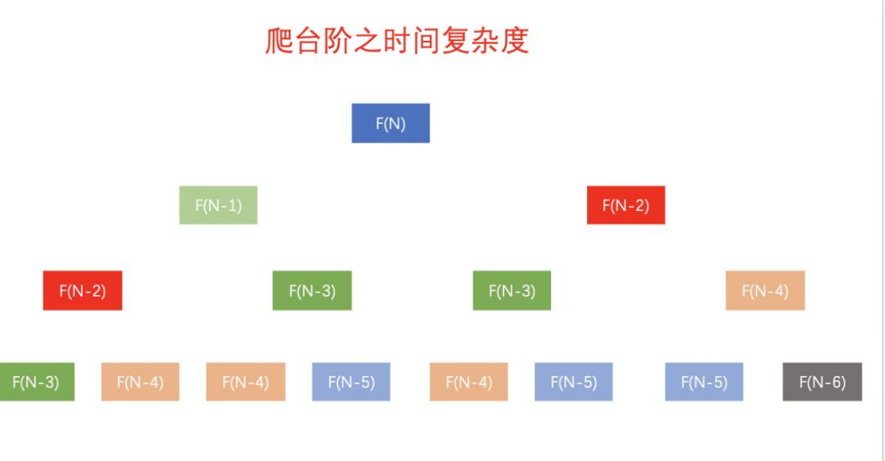
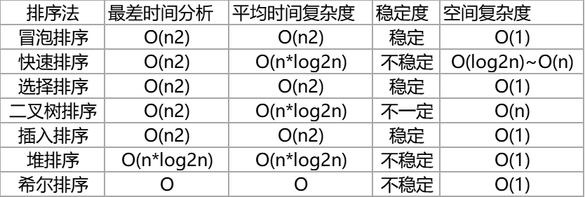

# 算法

## 1.算法解法思想

### 1.1.常见思路

https://mp.weixin.qq.com/s/3jLkKAsmSsPaw5SSN0gE-A

- 枚举法：也就是穷举法、暴力破解法
- 逻辑推导法：根据显示逻辑，推导出正确的规律
- 递归：将大问题分解为小问题，先处理小问题，大问题就处理好了
- 分而治之：二分法这类的思想
- 动态规划：.....
- 回溯：.....

### 1.2.TopN常见4种解法

https://leetcode-cn.com/problems/zui-xiao-de-kge-shu-lcof/solution/3chong-jie-fa-miao-sha-topkkuai-pai-dui-er-cha-sou/

### 1.3.限流算法
限流是解决高并发大流量的一种方案，至少是可以保证应用的可用性
TODO

### 1.4.LRU
Least Recently Used就是字面意思。最近最少使用。
Redis一般会在内存达到瓶颈的时候进行数据释放，一般会配置为LRU算法。尽可能保证数据为热数据

### 1.5.Bloom Filter

常见的面试题

现在有一个非常庞大的数据，假设全是 int 类型。现在我给你一个数，你需要告诉我它是否存在其中(尽量高效)。需求其实很清晰，只是要判断一个数据是否存在即可。但这里有一个比较重要的前提：非常庞大的数据。
在常见的场景中，如果不考虑数据量的话，可以使用hashMap/hashSet实现。考虑的算法的效率以及准确性肯定是要把数据全部 load 到内存中的，这种方式就不能适用了。
基于上面分析的条件，要实现这个需求最需要解决的是如何将庞大的数据 load 到内存中。
而我们是否可以换种思路，因为只是需要判断数据是否存在，也不是需要把数据查询出来，所以完全没有必要将真正的数据存放进去。伟大的科学家们已经帮我们想到了这样的需求。
Burton Howard Bloom 在 1970 年提出了一个叫做 Bloom Filter（中文翻译：布隆过滤）的算法。
它主要就是用于解决判断一个元素是否在一个集合中，但它的优势是只需要占用很小的内存空间以及有着高效的查询效率。所以在这个场景下在合适不过了。

使用原理

对写入的数据做 H 次 hash 运算定位到数组中的位置，同时将数据改为 1 。当有数据查询时也是同样的方式定位到数组中。 
一旦其中的有一位为 0 则认为数据肯定不存在于集合，否则数据可能存在于集合中

特点

所以布隆过滤有以下几个特点：
- 只要返回数据不存在，则肯定不存在。
- 返回数据存在，但只能是大概率存在。
- 同时不能清除其中的数据。因为hash碰撞的存在，删除一个数据的值时，可能误删其他数据

应用场景

布隆过滤的应用还是蛮多的，比如数据库、爬虫、防缓存击穿等。
特别是需要精确知道某个数据不存在时做点什么事情就非常适合布隆过滤。


## 2.递归与动态规划

### 2.1.递归
定义：递归算法是一种直接或者间接调用自身函数或者方法的算法。
通俗来说，递归算法的实质是把问题分解成规模缩小的同类问题的子问题，然后递归调用方法来表示问题的解。它有如下特点：
1. 一个问题的解可以分解为几个子问题的解
2. 这个问题与分解之后的子问题，除了数据规模不同，求解思路完全一样
3. 存在递归终止条件，即必须有一个明确的递归结束条件，称之为递归出口

> 1.经典示例-数组求和

Sum(arr[0...n-1]) = arr[0] + Sum(arr[1...n-1])
后面的 Sum 函数要解决的就是比前一个 Sum 更小的同一问题。

Sum(arr[1...n-1]) = arr[1] + Sum(arr[2...n-1])
以此类推，直到对一个空数组求和，空数组和为 0 ，此时变成了最基本的问题。

Sum(arr[n-1...n-1] ) = arr[n-1] + Sum([])

> 2.经典示例-爬台阶

问题描述：
一个人爬楼梯，每次只能爬1个或2个台阶，假设有n个台阶，那么这个人有多少种不同的爬楼梯方法？
先从简单的开始，以 4 个台阶为例，可以通过每次爬 1 个台阶爬完楼梯
可以通过先爬 2 个台阶，剩下的每次爬 1 个台阶爬完楼梯

在这里，可以思考一下：可以根据第一步的走法把所有走法分为两类：
① 第一类是第一步走了 1 个台阶
② 第二类是第一步走了 2 个台阶
所以 n 个台阶的走法就等于先走 1 阶后，n-1 个台阶的走法 ，然后加上先走 2 阶后，n-2 个台阶的走法。
用公式表示就是：
f(n) = f(n-1)+f(n-2)

有了递推公式，递归代码基本上就完成了一半。那么接下来考虑递归终止条件。
当有一个台阶时，我们不需要再继续递归，就只有一种走法。
所以 f(1)=1。
通过用 n = 2，n = 3 这样比较小的数试验一下后发现这个递归终止条件还不足够。
n = 2 时，f(2) = f(1) + f(0)。如果递归终止条件只有一个f(1) = 1，那 f(2) 就无法求解，递归无法结束。  
所以除了 f(1) = 1 这一个递归终止条件外，还要有 f(0) = 1，表示走 0 个台阶有一种走法，从思维上以及动图上来看，这显得的有点不符合逻辑。所以为了便于理解，把 f(2) = 2 作为一种终止条件，表示走 2 个台阶，有两种走法，一步走完或者分两步来走。

总结如下：
① 假设只有一个台阶，那么只有一种走法，那就是爬 1 个台阶
② 假设有两个个台阶，那么有两种走法，一步走完或者分两步来走

1f(1) = 1;
2f(2) = 2;
3f(n) = f(n-1)+f(n-2)
很容易推导出递归代码：
int f(int n) {
  if (n == 1) return 1;
  if (n == 2) return 2;
  return f(n-1) + f(n-2);
}

通过上述三个示例，总结一下如何写递归代码：
1. 找到如何将大问题分解为小问题的规律
2. 通过规律写出递推公式
3. 通过递归公式的临界点推敲出终止条件
4. 将递推公式和终止条件翻译成代码

### 2.2.动态规划
将原问题分解为若干个规模较小但类似于原问题的子问题（Divide），「递归」的求解这些子问题（Conquer），然后再合并这些子问题的解来建立原问题的解。
因为在求解大问题时，需要递归的求小问题，因此一般用「递归」的方法实现，即自顶向下。这个做法其实还是MapReduce的思想。

2.4.详解动态规划
「动态规划」中包含三个重要的概念：
- 【最优子结构】
- 【边界】
- 【状态转移公式】

在「 爬台阶问题 」中
- f(10) = f(9) + f(8) 是【最优子结构】  
- f(1) 与 f(2) 是【边界】  
- f(n) = f(n-1) + f(n-2) 【状态转移公式】

「 爬台阶问题 」 只是动态规划中相对简单的问题，因为它只有一个变化维度，如果涉及多个维度的话，那么问题就变得复杂多了。
难点就在于找出 「动态规划」中的这三个概念。


> 经典示例-爬台阶

还是以 爬台阶 为例，如果以递归的方式解决的话，那么这种方法的时间复杂度为O(2^n)
相同颜色代表着 爬台阶问题 在递归计算过程中重复计算的部分


通过图片可以发现一个现象，我们是 自顶向下 的进行递归运算，比如：f(n) 是f(n-1)与f(n-2)相加，f(n-1) 是f(n-2)与f(n-3)相加。

思考一下：如果反过来，采取自底向上，用迭代的方式进行推导会怎么样了？

```java
public static int f(int n) {
  if(n == 1) {
    return 1;
  }
  if(n == 2) {
    return 2;
  }
  int a = 1; 
  int b = 2;
  int temp = 0; 
  for (int i = 3; i <= n; i++) {
    temp = a + b;
    a = b;
    b = temp;
  }
  return temp;
}
```
事实上并没有增加太多的代码，只是简单的进行了优化，时间复杂度便就降为O(n)，而空间复杂度也变为O(1)，这，就是「动态规划」的强大！

## 3.排序算法

[白话经典算法系列](https://blog.csdn.net/morewindows/category_859207.html)
```text
1.插入排序
  1.1 直接插入排序
  1.2 希尔排序
2.交换排序
  2.1 冒泡排序
  2.2 快速排序
3.选择排序
  3.1 直接选择排序
  3.2 堆排序
4.归并排序
5.基数排序
```

各种排序的优缺点
- 所需辅助空间最多：归并排序
- 所需辅助空间最少：堆排序
- 平均速度最快：快速排序
- 不稳定：快速排序，希尔排序，堆排序。

常用的排序算法的时间复杂度和空间复杂度:
