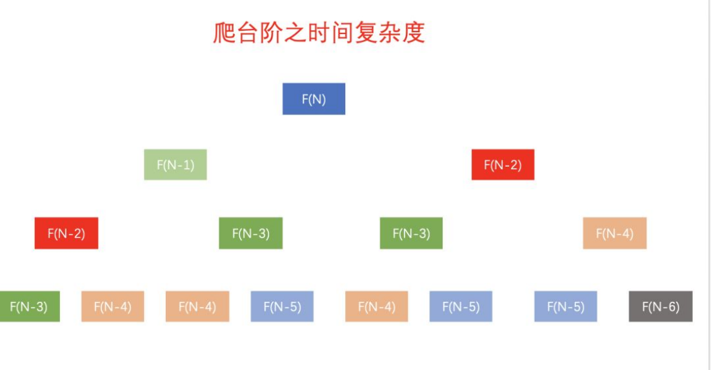
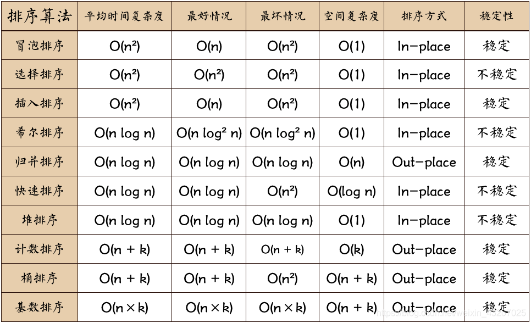

# 算法

- [旧金山大学 数据结构 和 算法 可视化(大学教程, 内容非常基础)](https://www.cs.usfca.edu/~galles/visualization/Algorithms.html)
- [github 热门算法可视化工具](https://algorithm-visualizer.org)

## 1.算法解法思想

[不懂这八大算法思想，刷再多题也白搭！](https://mp.weixin.qq.com/s/3jLkKAsmSsPaw5SSN0gE-A)

### 1.1.简单解题思路

- 枚举法：也就是穷举法，包所有的可能性全部列举出来。例如:1000以内的有几个7的倍数，就可以遍历一遍1000内的所有数字依次对比。
- 逻辑推导法(暴力破解)：根据显示逻辑，推导出正确的规律。例如：爬楼梯1步或2步，直接就是递归解题。

### 1.2.递归

将大问题分解为小问题，先处理小问题，大问题就处理好了。

例如：爬楼梯（斐波那契数列）、反转链表等。

### 1.3.动态规划

将复杂问题分解为重叠子问题，通过存储子问题的解（避免重复计算），逐步构建原问题的解。 核心要素
1. 状态定义：用 dp[i] 表示规模为 i 的子问题的解（可以是数组、二维数组等）。
2. 状态转移方程：描述子问题之间的关系（核心！）。 
3. 初始条件：最小子问题的解（如 dp[0]）。 
4. 填表顺序：从小规模子问题逐步计算到大规模。

案例1：斐波那契数列

```python
使用递归解法，重复计算，时间复杂度O(2^n)
def fib(n):
    if n <= 1: return n
    return fib(n-1) + fib(n-2)
    
动态规划解法，存储子问题，时间复杂度O(n)：
def fib_dp(n):
    dp = [0]*(n+1)        # 创建长度为n+1，值为0的数组，用于存储状态
    dp[0], dp[1] = 0, 1   # 设置初始化值
    for i in range(2, n+1):
        dp[i] = dp[i-1] + dp[i-2]  # 状态转移
    return dp[n]
```

案例2：背包问题（二维 DP 示例）

- 目标：选物品使总价值最大，不超过背包容量。
- 状态定义：dp[i][j] 表示前 i 个物品、容量 j 时的最大价值。
- 状态转移：
  - 不选第 i 个物品：dp[i][j] = dp[i-1][j]
  - 选第 i 个物品（若容量够）：dp[i][j] = dp[i-1][j - weight[i]] + value[i]
  - 取两者最大值。

### 1.4.贪心算法

每一步选择当前局部最优解，无需回溯，期望通过局部最优达到全局最优。关键在于问题需具备贪心选择性质（局部最优解能导出全局最优解）。

核心要素
1. 贪心策略：定义每一步的选择规则（如 “选最小”“选最大”“选性价比最高” 等）。 
2. 正确性证明：需证明贪心策略的全局有效性（常用数学归纳法、交换论证）。

经典例子：零钱兑换（假设硬币面值为无限且满足贪心条件，如 1、5、10、25）
1. 目标：用最少硬币凑出金额 n。
2. 贪心策略：每次选面值不超过剩余金额的最大硬币。

```python
def coin_change(n):
    coins = [25, 10, 5, 1]
    count = 0
    for coin in coins:
        count += n // coin
        n %= coin
        if n == 0:
            break
    return count
```

### 1.5.优化类算法

1. 哈希。通过哈希表实现查询时间复杂度为O(1)。
2. 双指针。通常用于数组和链表，例如：查找子数组、判断环链等。
3. 滑动窗口。是一种特殊的双指标，用于解决连续数组和链表的问题。
4. 二分。用于在有序数组中查询某个元素，时间复杂度为O(logN)。

### 1.6.搜索算法

- 深度优先搜索dfs：尽可能深的去搜索树的分支，搜索所有的节点找到所有的解，通常采用递归和栈实现。
  - 特点：数据量少（明确数据上限），找到多个答案。
- 广度优先搜索bfs：逐层搜索，通常使用队列实现，适合搜索最短路径问题，但是空间复杂度高。
  - 特点：查找最优解。

## 2.常见基础算法

### 2.1.递归
定义：递归算法是一种直接或者间接调用自身函数或者方法的算法。
通俗来说，递归算法的实质是把问题分解成规模缩小的同类问题的子问题，然后递归调用方法来表示问题的解。它有如下特点：
1. 一个问题的解可以分解为几个子问题的解
2. 这个问题与分解之后的子问题，除了数据规模不同，求解思路完全一样
3. 存在递归终止条件，即必须有一个明确的递归结束条件，称之为递归出口

> 1.经典示例-数组求和

```text
Sum(arr[0...n-1]) = arr[0] + Sum(arr[1...n-1])
后面的 Sum 函数要解决的就是比前一个 Sum 更小的同一问题。

Sum(arr[1...n-1]) = arr[1] + Sum(arr[2...n-1])
以此类推，直到对一个空数组求和，空数组和为 0 ，此时变成了最基本的问题。

Sum(arr[n-1...n-1] ) = arr[n-1] + Sum([])
```

> 2.经典示例-爬台阶/斐波那契数列/青蛙跳台阶等问题

```shell
问题描述：
一个人爬楼梯，每次只能爬1个或2个台阶，假设有n个台阶，那么这个人有多少种不同的爬楼梯方法？
先从简单的开始，以 4 个台阶为例，可以通过每次爬 1 个台阶爬完楼梯
可以通过先爬 2 个台阶，剩下的每次爬 1 个台阶爬完楼梯

在这里，可以思考一下：可以根据第一步的走法把所有走法分为两类：
① 第一类是第一步走了 1 个台阶
② 第二类是第一步走了 2 个台阶
所以 n 个台阶的走法就等于先走 1 阶后，n-1 个台阶的走法 ，然后加上先走 2 阶后，n-2 个台阶的走法。
用公式表示就是：
f(n) = f(n-1)+f(n-2)

有了递推公式，递归代码基本上就完成了一半。那么接下来考虑递归终止条件。
当有一个台阶时，我们不需要再继续递归，就只有一种走法。
所以 f(1)=1。
通过用 n = 2，n = 3 这样比较小的数试验一下后发现这个递归终止条件还不足够。
n = 2 时，f(2) = f(1) + f(0)。如果递归终止条件只有一个f(1) = 1，那 f(2) 就无法求解，递归无法结束。  
所以除了 f(1) = 1 这一个递归终止条件外，还要有 f(0) = 1，表示走 0 个台阶有一种走法，从思维上以及动图上来看，这显得的有点不符合逻辑。所以为了便于理解，把 f(2) = 2 作为一种终止条件，表示走 2 个台阶，有两种走法，一步走完或者分两步来走。

总结如下：
① 假设只有一个台阶，那么只有一种走法，那就是爬 1 个台阶
② 假设有两个个台阶，那么有两种走法，一步走完或者分两步来走

1f(1) = 1;
2f(2) = 2;
3f(n) = f(n-1)+f(n-2)
很容易推导出递归代码：
int f(int n) {
  if (n == 1) return 1;
  if (n == 2) return 2;
  return f(n-1) + f(n-2);
}
```

> 3.经典示例-快速排序

快速排序的思想很简单，就是先找到一个基准值（pivot），然后将小于这个值的元素放到左边，大于等于它的放在右边。然后分别继续递归处理左右两边。

总结一下如何写递归代码：
1. 找到如何将大问题分解为小问题的规律
2. 通过规律写出递推公式
3. 通过递归公式的临界点推敲出终止条件
4. 将递推公式和终止条件翻译成代码

### 2.2.分治算法

分治算法的思想是将一个难以直接解决的大问题分成两个或多个规模较小但类似于原问题的子问题，递归求解这些子问题，然后将各个子问题的解合并得到原问题的解。

分治算法的步骤：
1. 分解（Divide）：将原问题分解为若干个规模较小、相互独立、与原问题形式相同的子问题；
2. 解决（Conquer）：递归地求解各个子问题；
3. 合并（Combine）：将子问题的结果合并为原问题的解。

案例
1. 二分查找：算法复杂度 O(log(n)) ，体现在分解过程，组合过程不需要再次递归调用。
2. 快速排序：算法复杂度 O(nlogn) ，将问题拆分为左右两个部分，并递归完成。
3. 归并排序：算法复杂度 O(nlogn) ，空间复杂度 O(n) ，利用大集合拆分为小集合，小集合排序后合并成大集合。

### 2.3.动态规划
将原问题分解为若干个规模较小但类似于原问题的子问题（Divide），「递归」的求解这些子问题（Conquer），然后再合并这些子问题的解来建立原问题的解。
因为在求解大问题时，需要递归的求小问题，因此一般用「递归」的方法实现，即自顶向下。这个做法其实还是MapReduce的思想。

详解动态规划
「动态规划」中包含三个重要的概念：
- 【最优子结构】
- 【边界】
- 【状态转移公式】

在「 爬台阶问题 」中
- f(10) = f(9) + f(8) 是【最优子结构】  
- f(1) 与 f(2) 是【边界】  
- f(n) = f(n-1) + f(n-2) 【状态转移公式】

「 爬台阶问题 」 只是动态规划中相对简单的问题，因为它只有一个变化维度，如果涉及多个维度的话，那么问题就变得复杂多了。
难点就在于找出 「动态规划」中的这三个概念。


> 经典示例-爬台阶

还是以 爬台阶 为例，如果以递归的方式解决的话，那么这种方法的时间复杂度为O(2^n)
相同颜色代表着 爬台阶问题 在递归计算过程中重复计算的部分


通过图片可以发现一个现象，我们是 自顶向下 的进行递归运算，比如：f(n) 是f(n-1)与f(n-2)相加，f(n-1) 是f(n-2)与f(n-3)相加。

思考一下：如果反过来，采取自底向上，用迭代的方式进行推导会怎么样了？

```java
public static int f(int n) {
  if(n == 1) {
    return 1;
  }
  if(n == 2) {
    return 2;
  }
  int a = 1; 
  int b = 2;
  int temp = 0; 
  for (int i = 3; i <= n; i++) {
    temp = a + b;
    a = b;
    b = temp;
  }
  return temp;
}
```
事实上并没有增加太多的代码，只是简单的进行了优化，时间复杂度便就降为O(n)，而空间复杂度也变为O(1)，这，就是「动态规划」的强大！

## 3.排序算法

- [白话经典算法系列](https://blog.csdn.net/morewindows/category_859207.html)
- [排序算法及其时间复杂度](https://blog.csdn.net/weixin_43207025/article/details/114902065)
- [4种解法秒杀TopK（快排/堆/二叉搜索树/计数排序）](https://leetcode.cn/problems/zui-xiao-de-kge-shu-lcof/solutions/159853/3chong-jie-fa-miao-sha-topkkuai-pai-dui-er-cha-sou/)

```text
1.插入排序
  1.1 直接插入排序：倒序遍历，依次找到每个元素应该插入的位置。时间复杂度为O(n^2)，稳定，适合已经有部分元素已经有序的场景。
  1.2 希尔排序
2.交换排序
  2.1 冒泡排序：比较相邻的元素，如果顺序不对则交换元素位置，时间复杂度为O(n^2)，稳定，易实现。
  2.2 快速排序：【*】采用分治思想实现，通过一个基准元素，将数组分为两部分，各自排序。时间复杂度：平均O(n*logN)  最差O(n^2)
3.选择排序
  3.1 直接选择排序：依次将最大(小)的元素放到末尾，时间复杂度为O(n^2)，不稳定，易实现。
  3.2 堆排序
4.辅助排序
  1. 计数排序：通过额外的内存空间（例如元素最大为100，则额外空间长度为100），统计每个元素的出现次数，然后完成排序。时间复杂度为O(n+k)，适合数据范围小的场景。
  2. 桶排序
  3. 基数排序
5.归并排序：【*】采用分治思想实现，将数组分为两个部分，分别排序后进行合并。时间复杂度：平均O(n*logN)，稳定。
```

各种排序的优缺点
- 所需辅助空间最多：归并排序
- 所需辅助空间最少：堆排序
- 平均速度最快：快速排序
- 不稳定：快速排序，希尔排序，堆排序。

常用的排序算法的时间复杂度和空间复杂度:



## 4.辅助类算法

### 4.1.限流算法
限流是解决高并发大流量的一种方案，至少是可以保证应用的可用性。
- 计数器：固定时间内，访问次数固定。无法流量整形，不能应对流量突刺。
- 滑动时间窗口：将计数器的时间窗口划分更细，可以流量整形，但是实现更加复杂。
- 漏洞算法：以固定的频率通过数据，可以流量整形，不能应对流量突刺。
- 令牌桶算法：以固定频率生成令牌，能解决一定程度的流量整形和突刺问题。

### 4.2.缓存淘汰算法
- LRU：Least Recently Used 最近最少使用。当缓存达到其容量限制时，它会移除最久未被访问的数据项。算法会假设最近被访问的数据项在未来更有可能被再次访问，因此保留它们是有意义的。
  - 数据结构：通常使用hash表和双向链表组合实现。hash表存储数据，双向链表存储的是访问顺序，队列头存储最新被访问的数据，尾部存储最久未访问的数据。
  - 实现原理：当访问数据时，如果数据在hash表中存储，则将该数据从队列移动到队列头部。触发淘汰后会从队尾移除数据即可。
  - 缺点：LRU只考虑时间，存在缓存污染的可能（例如一次性访问大量数据），导致真实的高频数据被淘汰。
  - 解决方案：MySQL中将buffer pool分为老年代和年轻代，使用LRU算法对年轻代进行缓存淘汰，使用LFU算法对老年代进行缓存淘汰。
- LFU：Least Frequently Used 最少使用。
  - 实现原理：通过维护计数器，可以使用hash表记录访问次数。在Java中可以使用TreeMap，使用频率作为compare，put数据会重新排序，淘汰数据时时间复杂O(1)。
  - 缺点：LFU只考虑频率，容易导致历史数据堆积，也就是过去访问频率高，但是后续没有访问了，相当于死缓存，但是无法被淘汰掉。
  - 解决方案：例如Redis引入计数器衰减机制。
- FIFO：First In First Out，最先进的最先出去，当缓存达到其容量限制时，会淘汰最早进入缓存的数据。通常不会使用FILO。
- TTL：time to live，缓存设置过期时间，每次操作延长过期时间。
- Random：随机过期淘汰，不推荐使用。

优秀的解决方案：
1. MySQL中将buffer pool分为老年代和年轻代。
2. W-TinyLFU。caffeine采用了一种结合LRU、LFU优点的算法：W-TinyLFU，在性能上有明显的优越性。
    caffeine内部分为多个区域，新增的缓存项写入 Window Cache ，可以解决稀疏流量的缓存加载问题；访问频率高的缓存项写入 Protected Cache，不会被淘汰。
   通过这个机制，平衡了访问频率和访问时间新鲜程度两个维度因素，能够尽可能地将新鲜的和访问频率高的缓存项保留在缓存中。 
   guava采用的是分段锁。底层只支持简单的LRU和LFU。
3. CLOCK时钟算法。


### 4.3.Bloom Filter

常见的面试题

现在有一个非常庞大的数据，假设全是 int 类型。现在我给你一个数，你需要告诉我它是否存在其中(尽量高效)。需求其实很清晰，只是要判断一个数据是否存在即可。但这里有一个比较重要的前提：非常庞大的数据。
在常见的场景中，如果不考虑数据量的话，可以使用hashMap/hashSet实现。考虑的算法的效率以及准确性肯定是要把数据全部 load 到内存中的，这种方式就不能适用了。
基于上面分析的条件，要实现这个需求最需要解决的是如何将庞大的数据 load 到内存中。
而我们是否可以换种思路，因为只是需要判断数据是否存在，也不是需要把数据查询出来，所以完全没有必要将真正的数据存放进去。伟大的科学家们已经帮我们想到了这样的需求。
Burton Howard Bloom 在 1970 年提出了一个叫做 Bloom Filter（中文翻译：布隆过滤）的算法。
它主要就是用于解决判断一个元素是否在一个集合中，但它的优势是只需要占用很小的内存空间以及有着高效的查询效率。所以在这个场景下在合适不过了。

使用原理

对写入的数据做 H 次 hash 运算定位到数组中的位置，同时将数据改为 1 。当有数据查询时也是同样的方式定位到数组中。
一旦其中的有一位为 0 则认为数据肯定不存在于集合，否则数据可能存在于集合中

特点

所以布隆过滤有以下几个特点：
- 只要返回数据不存在，则肯定不存在。
- 返回数据存在，但只能是大概率存在。
- 同时不能清除其中的数据。因为hash碰撞的存在，删除一个数据的值时，可能误删其他数据

应用场景

布隆过滤的应用还是蛮多的，比如数据库、爬虫、防缓存击穿等。
特别是需要精确知道某个数据不存在时做点什么事情就非常适合布隆过滤。