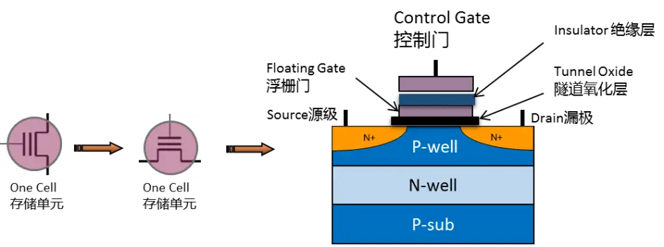

# 计算机设备


## 1.磁盘

### 1.1.基础知识

存储文件类型有NTFS和FAT32两种，
- NTFS：安全有效
- FAT32：单个文件不能超过4G

存储基础知识总结，内容涉及RAID、磁盘COW/ROW快照、备份、CDP、集群、VTL虚拟带库等存储技术。:
https://mp.weixin.qq.com/s/Eyii15aWBef0jG2zQDxkWA


硬盘有机械硬盘(HDD)和 固态硬盘 (SSD)之分
- 固态硬盘：SSD由 控制单元 和 存储单元 （ 闪存）组成
- 机械硬盘：通过指针读取高速转动的磁盘。一般根据使用场景分为蓝盘、红盘、黑、紫盘。


### 1.2.SSD

SSD由控制单元和存储单元组成。其中存储单元，也就是NAND闪存。NAND闪存是一种比硬盘驱动器更好的存储设备，
NAND闪存是一种非易失性存储技术，即断电后仍能保存数据。它的发展目标就是降低每比特存储成本、提高存储容量。

随着SSD的发展，从SLC、MLC，到今天的TLC乃至QLC，技术的迭代使得NAND存储密度越来越高，每GB的拥有成本也越来越低。 

SSD寿命：指在SSD生命周期内允许的数据写入量。增大SSD的用户容量、选择更高可擦写次数的NAND颗粒，无疑都是延长SSD寿命的有效手段。

为什么寿命会降低？

不论是SLC、MLC，还是TLC，它们都利用了量子力学的隧道效应，在控制门上加较高的编程电压，使电子穿越隧道氧化层到达浮栅，并聚集在浮栅上，存储信息。
擦除时仍利用隧道效应，将电压反转，从而消除浮栅上的电子，达到清除信息的结果。电子在反复来回穿越的过程中会对隧道氧化层造成不可逆的磨损，
使其不能再有效保持浮栅门中的电荷，并最终失效。

NAND寿命的量化指标为P/E Cycles，也就是写入/擦除（Program / Erase）次数，一写一擦就会消耗NAND的1个P/E

P/E指标
- SLC 可达100000
- MLC约为3000
- 主流的消费级TLC NAND大约在500~1000，
- 而企业级SSD使用的eTLC则高得多，一般为5000~10000（这也是为什么企业级SSD寿命更长的根本原因）

NAND工作原理：

它以Page（页）为单位写入数据，以Block（块）为单位进行擦除，在新数据写入时，需要先对写入位置进行擦除操作，而不是像HDD那样可以直接覆盖。
由于一个Block中含有多个Page，因此在擦除时需要先对里面的有效数据进行保留，重新写入，引发GC（Garbage Collection，垃圾回收）和写放大（WA，Write Amplification）。
即，用户写1笔数据，真正写入到SSD中的可能是2~3笔，这样无疑会加剧NAND的P/E消耗。

例如：一个block是1024KB，一个page是4KB。当我们写入一个4KB的数据时，最坏的情况是一个空闲的block，这个block已经充满了无效的数据。
所以主控就把所有的数据读到缓存，擦除块，缓存里更新整个块的数据，再把新数据写回去，这个操作带来的写入放大就是: 实际写4K的数据，
造成了整个块（共1024KB）的写入操作，那就是放大了256倍。同时还带来了原本只需要简单一步写入4KB的操作变成：
闪存读取 (1024KB)→缓存改（4KB）→闪存擦除（1024KB）→闪存写入（1024KB），共四步操作，造成延迟大大增加，速度变慢。
所以说WA是影响 SSD随机写入性能和寿命的关键因素。



SSD:
什么是写入放大（write amplification）
https://blog.csdn.net/guojing3625/article/details/10136751

在使用SSD时，针对小文件的随机写入，会造成写放大，影响性能和SSD寿命。
所以很多中间件，比如数据库、mq等，都是现将数据写入内存，等待数据积累到一定程度或者等待一定时间后，再对文件进行顺序写入。

寿命检测：
一般根据自己设备的硬盘厂商，下载官方的检测工具即可。

检测工具：
- 西数官方：https://support.wdc.com/downloads.aspx?p=279
- 金士顿：https://www.kingston.com.cn/cn/support/technical/ssdmanager
- inter：

### 1.3.raid

RAID0：又称为Stripe或Striping，它代表了所有RAID级别中最高的存储性能。

[服务器中硬盘JBOD模式和RAID0模式区别](https://blog.csdn.net/weixin_43860781/article/details/124673273)

[clickhouse之数据存储：JBOD vs RAID](https://blog.csdn.net/weixin_40104766/article/details/122683272)

RAID0性能更好，io能力是所有磁盘的和，JBOD就是写满一个磁盘再写第二个，JBOD的优势在于简单，名字就说明了：Just　Bundle Of Disks。

[RAID0 RAID1 RAID5 RAID10区别](https://blog.51cto.com/qcwsh/2723566)

## 2.内存

内存分为DRAM和ROM：
- DRAM被称为动态随机存储器，不过DRAM断电后数据会丢失。 
- ROM称为只读

内存类型: 内存类型有DDR、DDR2、DDR3、DDR4

不同的类型频率不同，电压不同，针脚数不同，接口位置也不同。在选购内存条的时候需要确认主板上面的是支持DDR哪一代，因为它们的接口完全不一样。
内存条的作用是将软件需要的数据进行存储，如果内存不够，就会出现卡顿。


内存频率：就是单位时间内，传输数据的速度，频率越高，速度越快。当然也就越耗电。

内存通道：一般分为单通道和双通道。
- 单通道：读写数据混合在一起
- 双通道：读写各自一个通道，效率很高

## 3.设备类型
- 物理机
  - 堡垒机
  - 测试设备
- ups电源
- 刀片
- box
- jbod：是存储领域中一类重要的存储设备。JBOD（Just a Bunch Of Disks，磁盘簇）是在一个底板上安装的带有多个磁盘驱动器的存储设备。通常又称为Span。
- 磁带库-主控柜
- 磁带库-扩展柜
- 磁带库-高密度扩展柜

## 4.网络设备
- 路由器
- 交换机
- 防火墙
- 波分设备
- 光放设备
- 无线设备

## 5.CPU

### 5.1.CPU架构

[浅谈NUMA](https://blog.csdn.net/zhaoyi40233/article/details/126096623)

[NUMA架构详解](https://blog.csdn.net/qq_20817327/article/details/105925071)

#### 5.1.1.架构分类

- SMP。对称多处理器架构，现今主流的x86多处理器服务器都是SMP架构
- AMP。非对称多处理器架构，多用于嵌入式系统。

SMP 与 AMP 的区别？

- SMP的多个处理器都是同构的，使用相同架构的CPU；而AMP的多个处理器则可能是异构的。
- SMP的多个处理器共享同一内存地址空间；而AMP的每个处理器则拥有自己独立的地址空间。
- SMP的多个处理器操通常共享一个操作系统的实例；而AMP的每个处理器可以有或者没有运行操作系统，运行操作系统的CPU也是在运行多个独立的实例。
- SMP的多处理器之间可以通过共享内存来协同通信；而AMP则需要提供一种处理器间的通信机制。
- NUMA(Non-Uniform Memory Access)非一致存储访问结构。NUMA 服务器的基本特征是具有多个 CPU 模块，每个 CPU 模块由多个 CPU( 如 4 个 ) 组成，
  并且具有独立的本地内存、 I/O 槽口等。由于其节点之间可以通过互联模块 ( 如称为 Crossbar Switch) 进行连接和信息交互，
  因此每个 CPU 可以访问整个系统的内存 ( 这是 NUMA 系统与 MPP 系统的重要差别 ) 。
  显然，访问本地内存的速度将远远高于访问远地内存 ( 系统内其它节点的内存 ) 的速度，这也是非一致存储访问 NUMA 的由来。
  由于这个特点，为了更好地发挥系统性能，开发应用程序时需要尽量减少不同 CPU 模块之间的信息交互。

缺点：NUMA 技术同样有一定缺陷，由于访问远地内存的延时远远超过本地内存，因此当 CPU 数量增加时，系统性能无法线性增加。

- UMA(Uniform Memory Access)均匀内存访问架构则是与NUMA相反，所以处理器对共享内存的访问距离和时间是相同的。
  这种架构下，多个CPU通过同一个北桥(North Bridge)芯片与内存链接。北桥芯片里集成了内存控制器(Memory Controller)。

不论是NUMA还是UMA都是SMP架构的一种设计和实现上的选择。

- MPP（Massive Parallel Processing）：海量并行处理结构。和 NUMA 不同， MPP 提供了另外一种进行系统扩展的方式，
  它由多个 SMP 服务器通过一定的节点互联网络进行连接，协同工作，完成相同的任务，从用户的角度来看是一个服务器系统。
  MPP 的节点互联机制是在不同的 SMP 服务器外部通过 I/O 实现的，每个节点只访问本地内存和存储，节点之间的信息交互与节点本身的处理是并行进行的。
  其基本特征是由多个 SMP 服务器 ( 每个 SMP 服务器称节点 ) 通过节点互联网络连接而成，每个节点只访问自己的本地资源 ( 内存、存储等 ) ，
  是一种完全无共享 (Share Nothing) 结构，因而扩展能力最好，理论上其扩展无限制，目前的技术可实现 512 个节点互联，数千个 CPU 。
- 为什么出现 NUMA、UMA、MPP？

因为随着cpu数量的增加，cpu分配内存的竞争越激烈，cpu lock的时间就越多，导致服务器性能变低。

- 如何开启或者禁用CPU架构？
  - 查询硬件是否支持：需要去服务器厂商官网，查询硬件是否支持，以及去CPU生产商官网，查询相关型号的支持情况
  - 查询系统层是否开启：通过 lscpu 、numactl  --hardware、grep -i numa  /var/log/dmesg等命令可以看到相关配置

NUMA关闭方式

- 硬件层关闭：BIOS:interleave = Disable / Enable
- 软件层关闭：引导的时候关闭

#### 5.1.2.物理设备

1.Hyper-threading（超线程）技术：就是在一个CPU Core上集成了两个逻辑处理器单元，即，两个Logical Processor。

下图案例，就是6核12线程。


2.Socket。cpu是通过一个插槽安装在主板上的，这个插槽就叫做 cpu socket，有时候翻译成座。一个socket可以插入一枚CPU。

我们普通的电脑，一般只有1个socket。但是高配置的服务器可能存在多个socket，可以放置多枚CPU。

3.NUMA node。一个NUMA node包括一个或者多个Socket，以及与之相连的local memory。

也就是说，一枚CPU即使开启了numa，也就只有一个numa node，对性能提升少，甚至降低性能。

所有numa架构，适合多枚CPU的场景，比如 2枚 4核CPU，有2个socket，可以划分为2个numa node。

```shell
# 1.查看numa的使用情况：
[root@HOSTNAME ~]# numactl --hardware
available: 2 nodes (0-1)
node 0 cpus: 0 1 2 3
node 0 size: 8183 MB
node 0 free: 4255 MB
node 1 cpus: 4 5 6 7
node 1 size: 8192 MB
node 1 free: 6139 MB
node distances:
node   0   1 
  0:  10  21 
  1:  21  10 
  
# 2.查看有几个numa node。2个numa node
[root@HOSTNAME ~]# ls -tlr /sys/devices/system/node/
total 0
drwxr-xr-x 3 root root    0 2014-11-12 19:03 node1
drwxr-xr-x 3 root root    0 2014-11-12 19:03 node0
-rw-r--r-- 1 root root 4096 2014-11-20 16:27 uevent
-r--r--r-- 1 root root 4096 2014-11-20 16:27 possible
-r--r--r-- 1 root root 4096 2014-11-20 16:27 online
-r--r--r-- 1 root root 4096 2014-11-20 16:27 has_normal_memory
-r--r--r-- 1 root root 4096 2014-11-20 16:27 has_cpu

# 3.查看当前系统有几个socket。2个socket
[root@HOSTNAME ~]# cat /proc/cpuinfo | grep "physical id"
physical id     : 0
physical id     : 0
physical id     : 0
physical id     : 0
physical id     : 1
physical id     : 1
physical id     : 1
physical id     : 1

# 4.查看当前系统有几个core。一个socket有4个core。分别为0、1、9、10。
[root@YMOS_DEFAULT ~]# cat /proc/cpuinfo | grep "core id"
core id         : 0
core id         : 1
core id         : 9
core id         : 10
core id         : 0
core id         : 1
core id         : 9
core id         : 10

# 5.查看当前系统的Logical Processor。8个线程
[root@HOSTNAME ~]# cat /proc/cpuinfo | grep "processor"
processor       : 0
processor       : 1
processor       : 2
processor       : 3
processor       : 4
processor       : 5
processor       : 6
processor       : 7

# 6.查看CPU0的cache的详细信息
[root@HOSTNAME ~]# ls /sys/devices/system/cpu/cpu0/cache/
index0  index1  index2  index3
#index0:1级数据cache
#index1:1级指令cache
#index2:2级cache
#index3:3级cache ；对应cpuinfo里的cache
 
# 7.通过查看各个CPU的index3的shared_cpu_map的。
# 可以发现，一个socket上每个core共享L3 Cache。
[root@HOSTNAME ~]# cat /sys/devices/system/cpu/cpu0/cache/index3/shared_cpu_map
00000000,0000000f
[root@HOSTNAME ~]# cat /sys/devices/system/cpu/cpu1/cache/index3/shared_cpu_map
00000000,0000000f
[root@HOSTNAME ~]# cat /sys/devices/system/cpu/cpu2/cache/index3/shared_cpu_map
00000000,0000000f
[root@HOSTNAME ~]# cat /sys/devices/system/cpu/cpu3/cache/index3/shared_cpu_map
00000000,0000000f

8.概览。使用lscpu可以看到上面1~7的概览内容
[root@localhost ~]# lscpu
Architecture:          x86_64
CPU op-mode(s):        32-bit, 64-bit
Byte Order:            Little Endian
CPU(s):                8
On-line CPU(s) list:   8
Thread(s) per core:    16
Core(s) per socket:    2
座：                 2
NUMA 节点：         2
厂商 ID：           GenuineIntel
CPU 系列：          6
型号：              142
型号名称：        Intel(R) Core(TM) i7-10510U CPU @ 1.80GHz
步进：              12
CPU MHz：             2304.038
BogoMIPS：            4608.07
超管理器厂商：  KVM
虚拟化类型：     完全
L1d 缓存：          32K
L1i 缓存：          32K
L2 缓存：           256K
L3 缓存：           8192K
NUMA 节点0 CPU：    0 1 2 3
NUMA 节点1 CPU：    4 5 6 7
```

#### 5.1.3.使用numa

在NUMA架构中，使用numactl命令将应用程序绑定在一个Socket上的core上运行，可以提高内存的访问效率

```shell
[root@HOSTNAME ~]#numactl -m 0 –physcpubind=2,3 ./test
- m 0：在node 0上分配内存
- physcpubind=2,3 ：在cpu 2和3上运行程序，即一个线程运行在cpu2上，另一个运行在cpu3上。
```