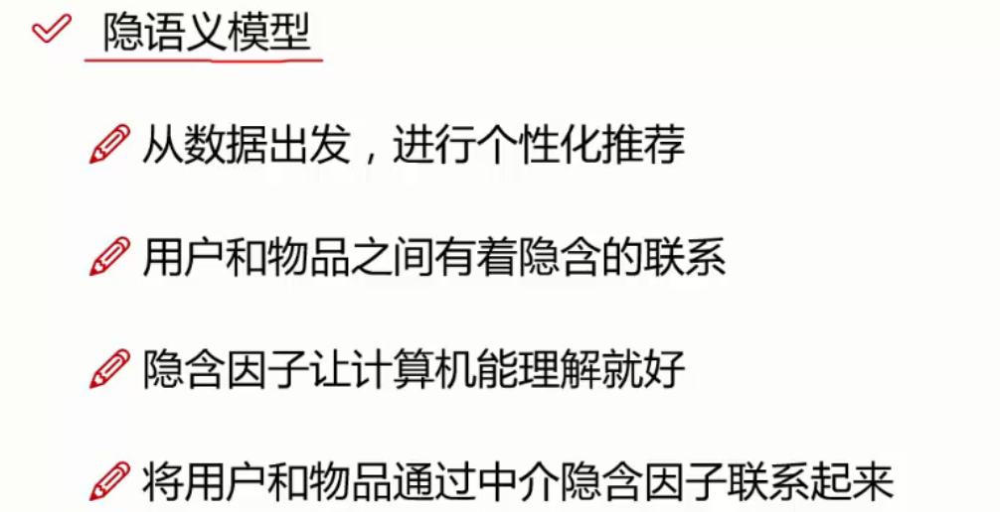

# 1.机器学习

学习教程：[https://gitee.com/luckSnow/knowledge-python.git](https://gitee.com/luckSnow/knowledge-python.git)

包括 数据分析 与 机器学习，有教程和代码案例

## 1.机器学习概述

### 1.1.学习方向

- 模式识别
- 数据挖掘
- 统计学习
- 计算机视觉
- 语音识别
- 自然语言处理

### 1.2.基本步骤
1. 训练样本
2. 特征抽取
3. 学习函数
4. 预测

### 1.3.常用类库

1. 通用机器学习库。这些库提供了广泛的机器学习算法，适合处理各种常见的机器学习任务（如分类、回归、聚类等）。
   - Scikit-learn：最流行的通用机器学习库，涵盖了从数据预处理到模型评估的完整流程。提供广泛的监督和无监督学习算法，如分类、回归、聚类、降维等。
   - XGBoost：专注于梯度提升算法，适用于结构化数据的分类和回归任务。
   - LightGBM：高效的梯度提升框架，适合大规模数据集。
   - CatBoost：支持分类特征的梯度提升库，性能优异。
2. 深度学习库。这些库专注于神经网络和深度学习模型的构建与训练。
   - TensorFlow：Google开发的深度学习框架，支持大规模分布式计算。主要用于深度学习，支持神经网络、卷积神经网络、循环神经网络等
   - Keras：高级神经网络API，是对TensorFlow的高级封装，可以简化神经网络的构建和训练过程。
   - PyTorch：Facebook开发的深度学习框架，以动态计算图和灵活性著称。
3. 数据处理与分析库。这些库主要用于数据预处理、清洗和分析，是机器学习工作流中不可或缺的工具。
   - Pandas：提供高效的数据结构和操作工具，适合处理表格数据。
   - NumPy：支持高效的数值计算，尤其是多维数组和矩阵运算。
   - JAX：基于NumPy的自动微分和加速计算。
4. 数据可视化库。这些库用于数据探索和结果的可视化。
   - Matplotlib：基础的绘图库，功能强大且灵活。
   - Seaborn：基于Matplotlib的高级可视化库，提供更美观的统计图形。
5. 统计建模与计量经济学库。这些库专注于统计分析和建模。
   - Statsmodels：提供统计模型和假设检验工具，适合回归分析、时间序列分析等。
6. 自然语言处理（NLP）库。这些库专注于文本数据的处理和分析。
   - NLTK：自然语言处理工具包，适合文本挖掘和语言学研究。
   - SpaCy：工业级NLP库，速度快，适合生产环境。
   - Gensim：专注于主题建模和文档相似度分析，支持Word2Vec、LDA等算法。

### 1.4.分类

- 监督学习:比如判断照片里面的动物是否是猫，具有明确的标签。
- 非监督学习:比如判断照片里面的是那种动物，标签不明确。

### 1.5.经典机器学习算法
1. 线性回归
2. 决策树与随机森林
3. 贝叶斯
4. xgboost
5. 支持向量机算法
6. ARIMA时间序列模型
7. 神经网络
8. 聚类算法
9. 推荐系统

## 2.深度学习

### 2.1.概述

机器学习和深度学习是人工智能领域的两个重要分支：

#### 2.1.1.相同点
1. 目标一致：机器学习和深度学习的目标都是从数据中学习规律，并用于预测、分类、回归等任务。
2. 依赖数据：两者都需要大量的数据进行训练，数据的质量和数量直接影响模型性能。
3. 算法驱动：都依赖于算法来提取数据中的特征和模式。
4. 应用领域重叠：在计算机视觉、自然语言处理、推荐系统等领域，两者都有广泛应用。
5. 模型评估：都使用类似的评估指标（如准确率、精确率、召回率、F1分数等）来衡量模型性能。

#### 2.1.2.不同点

| 方面            | 机器学习                | 深度学习          |
|----------------|----------------------------------|-------------------------------------------------|
| 定义            | 通过算法从数据中学习模式，通常需要手动设计特征。| 是机器学习的一个子集，使用神经网络自动学习特征。|
| 特征工程        | 依赖人工设计特征，特征工程对模型性能影响较大。| 自动学习特征，无需人工设计，适合处理高维和非结构化数据。|
| 数据需求        | 对数据量的需求相对较小，适合中小规模数据集。  | 需要大量数据，数据量越大，模型性能通常越好。  |
| 计算资源        | 计算资源需求较低，普通硬件即可运行。| 计算资源需求高，通常需要GPU或TPU等高性能硬件。|
| 模型复杂度      | 模型相对简单，如决策树、支持向量机、随机森林等。 | 模型复杂度高，通常是多层神经网络（如CNN、RNN、Transformer等）。|
| 训练时间        | 训练时间较短，适合快速迭代和实验。| 训练时间较长，尤其是大规模模型和数据集。|
| 可解释性        | 模型通常具有较好的可解释性（如决策树、线性回归）。| 模型可解释性较差，通常被视为“黑箱”。|
| 应用场景        | 适合结构化数据和小规模任务（如分类、回归、聚类）。| 适合非结构化数据（如图像、文本、音频）和复杂任务（如目标检测、机器翻译）。 |
| 算法示例        | 线性回归、逻辑回归、支持向量机、随机森林、K近邻等。| 卷积神经网络（CNN）、循环神经网络（RNN）、Transformer、GAN等。|
| 领域依赖        | 依赖领域知识进行特征工程和模型选择。| 对领域知识依赖较低，模型自动学习特征。|

#### 2.1.3.适用场景对比
1. 机器学习：
    - 数据量较小或中等。
    - 数据是结构化的（如表格数据）。
    - 需要快速迭代和实验。
    - 需要模型可解释性（如金融、医疗领域）。
2. 深度学习：
    - 数据量非常大。
    - 数据是非结构化的（如图像、文本、音频）。
    - 任务复杂，需要高精度（如自然语言处理、计算机视觉）。
    - 计算资源充足，可以接受较长的训练时间。

### 2.2.深度学习类库

#### 2.2.1.Deeplearning4j

Deeplearning4j：为Java用户量身定制：官网：[http://deeplearning4j.org/](http://deeplearning4j.org/)

Deeplearning4j(Deep Learning For Java)是Java和Scala环境下的一个开源分布式的深度学习项目，由总部位于美国旧金山的商业智能和企业软件公司Skymind牵头开发，
并得到了腾讯的投资。正如它的命名，Deeplearning4j的运行需要Java虚拟机JVM的支持。

Deeplearning4j团队在官网表示，他们希望通过一些深度学习算法的开发，将商业带入智能化数据的时代。
也正是为了实现这一理想，惠及更多的用户，因此选择了移植性更好的Java环境来实现这些算法。
目前，Deeplearning4j的这些算法已经在谷歌、Facebook和微软等平台得到了广泛应用。

值得一提的是，为了便于开发者自由定制，Deeplearning4j已经开放了尽可能多的算法调节接口，并对接口参数做出了详尽解释。
同时，Deeplearning4j团队还开发了针对矩阵运算的ND4J和ND4S库(N-Dimensional Arrays for Java/Scala)，同样需要JVM的支持。

Deeplearning4j遵循Apache 2.0开源协议，提供了基于AWS云服务的GPU运算支持，以及微软服务器框架的支持。

#### 2.2.2.Caffe：广受欢迎的深度学习框架

官网：http://caffe.berkeleyvision.org/

Caffe的全称是 “Convolution Architecture For Feature Extraction”，意为“用于特征提取的卷积架构”，
主要开发者来自伯克利大学的视觉与学习中心(Berkeley Vision and Learning Center，BVLC)，基于BSD 2-Clause开源许可协议发布。

Caffe是业内著名的深度学习框架， 根据官网介绍 ，其主要特点是：运算速度快(官方显示在单片NVIDIA K40 GPU的运算能力下，
Caffe每天可以处理超过60M的图片数据)，模块定制方便(在CPU或GPU之间的转换只需要简单修改一下参数设定)，
扩展能力强大(目前有超过一千名开发者基于Caffe开发了分支版本 )，以及丰富的社区支持(Caffe已经被授权给各种研究机构、初创公司和工业集团)，
因此特别适合于神经网络建模和图像处理任务。

#### 2.2.3.H2O：企业级机器学习框架

官网：http://www.h2o.ai/

H2O(即水的化学式)是一个开源、快速、可扩展的分布式机器学习框架，同时提供了大量的算法实现。
它支持深度学习、梯度推进(Gradient Boosting)、随机森林(Random Forest)、广义线性模型(即逻辑回归，弹性网络)等各种机器学习算法。

H2O框架的核心代码由Java编写，数据和模型通过分布式的key/value存储在各个集群节点的内存中，算法使用Map/Reduce框架实现，并使用了Java中的Fork/Join机制来实现多线程。

H2O是一个更关注企业用户的人工智能分析工具，它聚焦于为掌握大量数据的企业用户提供快速精准的预测分析模型，从海量数据中提取有助于商业决策的信息。

根据H2O官方的数据，目前已经有超过7万名数据科学家和8万家组织机构成为了H2O平台的忠实拥趸。

#### 2.2.4.MLlib：基于Spark框架的机器学习算法实现库

官网：https://spark.apache.org/mllib/

MLlib是Apache开源项目Spark针对一些常用的机器学习算法的实现库，同时也包括了相关的测试程序和数据生成器。

按照官网的描述，MLlib的主要特点是易用(天生兼容Spark框架的API接口和Python、Java、Scala等多种语言)、高性能(依靠Spark的数据管理能力，
运行迭代和逻辑回归算法时比Hadoop框架快100倍)和易于部署(可以直接在现有的Hadoop数据集群上运行)。

MLlib目前支持分类、回归、推荐、聚类、生存分析等多种机器学习算法。

#### 2.2.5.Apache Mahout：Hadoop广泛采用的机器学习开源框架

官网：http://mahout.apache.org/

Apache Mahout同样也是一个Apache开源项目，与MLlib相对应，Mahout是应用在Hadoop平台下的机器学习开源框架。
Mahout有如下三个主要特点：
1. 提供简单、可扩展的编程环境和框架;
2. 同时为Scala + Apache Spark、H2O以及Apache Flik平台提供打包好的算法实现;
3. 支持R语言的语法规则进行矩阵计算。

#### 2.2.6.OpenNN：专注神经网络的实现库

官网：http://www.opennn.net/

OpenNN的全称为“Open Neural Networks Library”，即开源神经网络库，其核心代码由C++编写，从名字就可以看出，
其主要面向深度学习领域，助力于用户构建各种不同的神经网络模型。

据官方描述，OpenNN可用于实现监督学习场景中任何层次的非线性模型，同时还支持各种具有通用近似属性的神经网络设计。

除了模型的多层支持外，OpenNN最主要优势还在于强大的性能表现。具体来说就是，OpenNN能够通过C++语言实现的核心代码高效地调节内容使用，
通过OpenMP库很好地平衡多线程CPU调用，以及通过CUDA工具对GPU进行加速。

#### 2.2.7.Oryx 2：重新设计了Lambda架构

官网：http://oryx.io/

Oryx 2是Oryx项目的2.0版，前身名为 Myrrix，后来被大数据公司 Cloudera 收购，才改名为 Oryx。

Oryx 2.0关注于大规模机器学习/预测分析基础框架的实时表现，它基于Apache Spark和Apache Kafka框架开发，并重新设计了Lambda架构，使得层次之间的复用性更强。

2.0版相比之前实现了更多算法，包括ALS协同过滤、随机森林、以及K-means++等。

#### 2.2.8.OpenCyc：全球最庞大、最完备的通用型知识库与常识推理引擎

官网：http://www.cyc.com/platform/opencyc/

OpenCyc是Cycorp公司推出的一个基于Cyc的开源版本，而Cyc是目前全球最庞大、最完备的通用型知识库与常识推理引擎。

OpenCyc包含数十万个精心组织的Cyc词条。Cycorp公司不但免费提供OpenCyc，同时也鼓励开发者基于OpenCyc开发针对于特定应用领域的分支版本。

目前，OpenCyc已经被成功应用在大数据建模、语言数据整合、智能文本理解、特定领域的专家系统建模和人工智能游戏。

#### 2.2.9.Apache SystemML：专注于大数据分析的开源机器学习平台

官网：http://systemml.apache.org/

SystemML是一个利用机器学习算法进行大数据分析的开源AI平台，其主要特点是支持R语言和Python的语法，专注于大数据分析领域，以及专门为高阶数学计算设计。
按照官网的介绍，Apache SystemML基于Apache Spark框架运行，其最大的特点就是能够自动、逐行地评估数据，并根据评估结果确定用户的代码应该直接运行在驱动器上还是运行在Apache Spark集群上。
除了Apache Spark之外，SystemML还支持Apache Hadoop、Jupyter和Apache Zeppelin等多个平台。目前，SystemML技术已经成功应用在交通、航空和金融等多个领域。

#### 2.2.10.NuPIC：基于层级实时存储算法的机器智能平台

官网：http://numenta.org/

NuPIC是一个与众不同的开源机器智能平台，它基于一种大脑皮层理论，即“层级实时存储算法”(Heirarchical Temporary Memory，HTM)。
NuPIC聚焦于分析实时数据流，可以通过学习数据之间基于时间的状态变化，对未知数据进行预测，并揭示其中的非常规特性。

NuPIC关键的功能特性包括：
1. 持续的在线学习：NuPIC模型可以持续根据快速变化的数据流进行实时调整;
2. 时间和空间分析：像人脑一样，NuPIC可以同时模拟时间和空间的变化;
3. 实时的数据流分析：智能化的数据分析不会随着数据量的增加而改变;
4. 预测和建模：通过通用性的大脑皮层算法，对数据进行预测、建模和学习;
5. 强大的异常检测能力：实时检测数据流的扰动，不依靠僵化的阈值设置和过时的算法;
6. 层级实时存储算法：支持全新的HTM计算架构。

#### 2.2.11.TensorFlow，真正的主流

官网：http://www.tensorfly.cn/

TensorFlow™ 是一个采用数据流图（data flow graphs），用于数值计算的开源软件库。
节点（Nodes）在图中表示数学操作，图中的线（edges）则表示在节点间相互联系的多维数据数组，即张量（tensor）。

它灵活的架构让你可以在多种平台上展开计算，例如台式计算机中的一个或多个CPU（或GPU），服务器，移动设备等等。

TensorFlow 最初由Google大脑小组（隶属于Google机器智能研究机构）的研究员和工程师们开发出来，用于机器学习和深度神经网络方面的研究，
但这个系统的通用性使其也可广泛用于其他计算领域。

#### 2.2.12.HanLP

官网：https://github.com/FudanNLP/fnlp

GitHub地址：https://nndl.github.io/

PDF讲义：https://nndl.github.io/nndl-book.pdf

示例代码：https://github.com/nndl/nndl-codes

课后练习：https://github.com/nndl/exercise

复旦大学--神经网络与机器学习

#### 2.2.13.总结
由于2016仅仅是人工智能走向主流的元年，未来随着技术的进一步发展和革新，势必会出现更多、更丰富的开发工具。
这里值得注意的一点是：工具的意义不仅在于解决了日常研发中遇到的各种问题，更在于降低了开发的难度，引导了更多人投入到人工智能的研发之中。

## 3.大模型

大模型（Large Language Models, LLMs）的开发、训练和应用涉及多个类库和框架，涵盖了从模型构建、训练到部署的整个流程。

[Transformer 的实现原理](https://jalammar.github.io/illustrated-transformer/)

[深入理解Sora技术原理](https://mp.weixin.qq.com/s/e1DqTa1Tgyi4OWpgwrj48Q)

### 3.1.深度学习框架
构建和训练大模型的基础工具。
- PyTorch：
    - 功能：动态计算图、灵活的模型构建、分布式训练支持。
    - 特点：研究社区广泛使用，适合快速实验和原型设计。
- TensorFlow：
    - 功能：静态计算图、分布式训练、生产环境部署支持。
    - 特点：工业界广泛使用，适合大规模生产环境。

### 3.2.大模型训练与微调
用于大模型的训练、微调和优化。
- Hugging Face Transformers：
    - 功能：提供预训练模型（如BERT、GPT、T5等）和工具，支持模型微调、推理和部署。
    - 特点：社区支持强大，模型库丰富。
- DeepSpeed：
    - 功能：分布式训练优化，支持大规模模型训练（如ZeRO优化、混合精度训练）。
    - 特点：由微软开发，适合训练超大规模模型。
- Megatron-LM：
    - 功能：NVIDIA开发的大规模语言模型训练框架，支持高效的分布式训练。
    - 特点：专注于GPU优化，适合训练GPT类模型。
- Colossal-AI：
    - 功能：分布式训练框架，支持高效的大模型训练和微调。
    - 特点：提供多种并行策略和优化技术。

### 3.3. 模型部署与推理
这些库用于将训练好的大模型部署到生产环境中。
- TorchServe：
    - 功能：PyTorch模型的部署和服务化工具。
    - 特点：支持多模型部署、动态批处理和监控。
- TensorFlow Serving：
    - 功能：TensorFlow模型的部署和服务化工具。
    - 特点：高性能，适合生产环境。
- FastAPI：
    - 功能：用于构建API服务，适合部署模型推理接口。
    - 特点：轻量级、高性能，易于集成。
- ONNX Runtime：
    - 功能：支持跨框架模型推理（如PyTorch、TensorFlow转换为ONNX格式）。
    - 特点：高性能，适合跨平台部署。

### 3.4. 数据处理与增强
这些库用于大模型训练数据的处理和增强。
- Datasets (Hugging Face)：
    - 功能：提供大规模数据集加载和预处理工具。
    - 特点：与Hugging Face Transformers无缝集成。
- Dask：
    - 功能：分布式数据处理框架，适合处理超大规模数据集。
    - 特点：兼容Pandas和NumPy，易于扩展。
- Spark NLP：
    - 功能：基于Apache Spark的自然语言处理库，适合大规模文本数据处理。
    - 特点：高性能，支持分布式计算。

### 3.5. 模型优化与压缩
这些库用于优化大模型的性能和效率。
- PyTorch Lightning：
    - 功能：简化PyTorch代码，支持分布式训练和模型优化。
    - 特点：代码简洁，适合快速实验。
- TensorRT：
    - 功能：NVIDIA开发的推理优化库，支持模型量化和加速。
    - 特点：高性能，适合GPU推理。
- OpenVINO：
    - 功能：Intel开发的推理优化工具，支持模型压缩和加速。
    - 特点：适合CPU推理。

### 3.6. 大模型应用开发
这些库用于构建基于大模型的应用。
- LangChain：
    - 功能：构建基于大模型的应用（如问答系统、对话系统）。
    - 特点：支持链式调用和工具集成。
- LlamaIndex：
    - 功能：基于大模型的知识索引和检索工具。
    - 特点：适合构建知识密集型应用。

### 3.7. 其他工具
- Weights & Biases (W&B)：
    - 功能：实验跟踪和可视化工具，适合大模型训练监控。
    - 特点：支持分布式训练和团队协作。
- Ray：
    - 功能：分布式计算框架，支持大模型训练和推理的分布式扩展。
    - 特点：灵活且高性能。

### 3.8.分类总结表

| 类别               | 库名称                                                                 |
|------------------------|---------------------------------------------------------------------------|
| 深度学习框架           | PyTorch, TensorFlow, JAX                                                 |
| 大模型训练与微调       | Hugging Face Transformers, DeepSpeed, Megatron-LM, Colossal-AI           |
| 模型部署与推理         | TorchServe, TensorFlow Serving, FastAPI, ONNX Runtime                    |
| 数据处理与增强         | Datasets (Hugging Face), Dask, Spark NLP                                 |
| 模型优化与压缩         | PyTorch Lightning, TensorRT, OpenVINO                                    |
| 大模型应用开发         | LangChain, LlamaIndex                                                   |
| 其他工具               | Weights & Biases (W&B), Ray                                              |


这些类库和工具共同构成了大模型开发的全栈生态系统。根据具体需求（如研究、训练、部署等），可以选择合适的工具组合。

## 4.基础概念

### 4.1. 数据拟合

数据拟合（Data Fitting）是机器学习和统计学中的一个核心概念，指的是通过构建一个数学模型来描述或预测数据的过程。
具体来说，数据拟合的目标是找到一个函数或模型，使其能够尽可能地匹配给定的数据集。
选择合适的模型、避免过拟合和欠拟合是数据拟合的关键。

数据拟合的核心思想
1. 输入与输出关系。给定一组输入数据（特征）和对应的输出数据（标签），拟合的目标是找到一个函数 \( f \)，使得 \( f(x) \) 尽可能接近真实的输出 \( y \)。
2. 模型的选择。模型可以是简单的线性函数，也可以是复杂的非线性函数（如神经网络）。
3. 拟合的目标。最小化模型预测值与真实值之间的误差（如均方误差、交叉熵等）。

数据拟合的类型
1. 线性拟合
    - 使用线性模型（如 \( y = ax + b \)）拟合数据。
    - 适用于数据分布接近直线的情况。
2. 非线性拟合
    - 使用非线性模型（如多项式、指数函数、神经网络等）拟合数据。
    - 适用于数据分布复杂的情况。
3. 过拟合与欠拟合
    - 过拟合：模型在训练数据上表现很好，但在新数据上表现差（模型过于复杂，捕捉了噪声）。
    - 欠拟合：模型在训练数据和新数据上表现都差（模型过于简单，无法捕捉数据规律）。

数据拟合的步骤
1. 数据准备
    - 收集数据，分为训练集和测试集。
    - 对数据进行预处理（如归一化、标准化）。
2. 选择模型。根据数据特点选择模型（如线性回归、决策树、神经网络等）。
3. 训练模型。使用训练数据调整模型参数，使模型预测值接近真实值。
4. 评估模型。使用测试数据评估模型的性能（如准确率、均方误差等）。
5. 调整模型。根据评估结果调整模型（如增加正则化、调整超参数等）。

数学表达
1. 给定数据集 ({(x1, y1),(x2, y2),...,(xn, yn)})，目标是找到一个函数，使得：f(xi) ≈ yi  对于所有的i = 1, 2, ...., n
2. 通常通过最小化损失函数 L 来实现。其中 ( L ) 可以是均方误差、交叉熵等


应用场景
1. 回归问题
    - 预测连续值（如房价预测、股票价格预测）。
    - 常用模型：线性回归、支持向量回归、神经网络。
2. 分类问题
    - 预测离散类别（如图像分类、垃圾邮件检测）。
    - 常用模型：逻辑回归、决策树、神经网络。
3. 时间序列预测
    - 预测未来值（如天气预测、销量预测）。
    - 常用模型：ARIMA、LSTM。
4. 曲线拟合
    - 拟合实验数据（如物理实验、生物实验）。
    - 常用方法：多项式拟合、非线性最小二乘法。

注意事项
1. 噪声数据
    - 数据中的噪声可能导致模型过拟合。
    - 解决方法：数据清洗、正则化。
2. 高维数据
    - 数据维度高时，模型容易过拟合。
    - 解决方法：降维（如 PCA）、特征选择。
3. 数据不足
    - 数据量少时，模型可能欠拟合。
    - 解决方法：数据增强、迁移学习。

示例：线性拟合
假设有一组数据点 ({(1, 2), (2, 3), (3, 4)})，目标是拟合一条直线 y = ax + b
1. 通过最小二乘法求解参数 a 和 b
2. 得到拟合直线 y = x + 1


实例：
我对一组简单的数据拟合了 3 种多项式。水平线显示了最佳拟合阶数为 0（也就是常数）的多项式，它对训练数据来说存在严重的欠拟合。
最佳拟合的阶数为 9（也就是有 10 个参数）的多项式精确地穿过训练数据的每个点，但这是严重过拟合的。
如果我们能取到更多的一些点，这个多项式很有可能会偏离它们很多。
阶数为 1 的线把握了很好的平衡——它和每个点都很接近，并且（如果这些数据是有代表性的）它也会和新的数据点很接近。
很明显，太复杂的模型会导致过拟合，并且在训练数据集之外不能很好地泛化。所以我们需要确保模型不能太复杂，最简单的做法是划分数据集，
比如三分之二的数据用来训练模型，之后用剩余的三分之一来衡量模型的表现


### 3.2.偏倚-方差权衡

如果你的模型有高偏倚（这意味着即使在训练数据上也表现不好），可以尝试加入更多的特征。从 0 阶模型到 1 阶模型就是一个很大的改进。

如果你的模型有高方差，那可以类似地移除特征；另一种解决方法是（如果可能的话）获得更多的数据。

### 3.3.特征提取和选择

一般来说，如果数据的特征不够多，容易出现欠拟合；特征过多，容易出现过拟合。

特征指的是提供给模型的输入的值。比如，想要预测到达某个工作年限的工资，那工资年限就是特征

## 5.数据集

### 5..1.CIFAR-10

下载地址：[http://www.cs.toronto.edu/~kriz/cifar.html](http://www.cs.toronto.edu/~kriz/cifar.html)

CIFAR-10 是一个包含60000张图片的带有标签的数据集（其中五万张图片被划分为训练集，剩下的一万张图片属于测试集。）

这是一个大项目，你可以点击那个big map提交自己的标签，可以帮助他们训练让计算机识别物体的模型）

#### 5.1.1.CIFAR-10
该数据集共有60000张彩色图像，这些图像是32*32，分为10个类，每类6000张图。
这里面有50000张用于训练，构成了5个训练批，每一批10000张图；另外10000用于测试，单独构成一批。
测试批的数据里，取自10类中的每一类，每一类随机取1000张。抽剩下的就随机排列组成了训练批。
注意一个训练批中的各类图像并不一定数量相同，总的来看训练批，每一类都有5000张图。

其中每张照片为32*32的彩色照片，每个像素点包括RGB三个数值，数值范围 0 ~ 255。有照片分属10个不同的类别，
分别是 'airplane', 'automobile', 'bird', 'cat', 'deer', 'dog', 'frog', 'horse', 'ship', 'truck'

下面这幅图就是列举了10各类，每一类展示了随机的10张图片


CIFAR-100：与CIFAR-10类似，但是有100个类别，每个类600张图。并且100个类别被分为20个超类，每个超类包含5个子类。

#### 5.1.2.数据集读取

目前支持python、matlab、c三种语言的库。

```python
import pickle

# 读取数据
def load_file(filename):
    with open(filename, 'rb') as fo:
        data = pickle.load(fo, encoding='latin1')
    return data

# 读取一个数据集，data_batch_1..5和test_batch的内容格式是一样的
data = load_file('../../数据集/cifar-10-batches-py/test_batch')

print("数据每列的名称:\r\n", data.keys())  # dict_keys(['batch_label', 'labels', 'data', 'filenames'])
print("数据集的描述信息:\r\n", data['batch_label'])  # 数据集的描述信息： testing batch 1 of 1
print("每张图片的类型:\r\n", data['labels'])  # 每个图片的类型，使用0~9表示
print("每张图片的名称:\r\n", data['filenames'])  # 数据集中图片的名称['domestic_cat_s_000907.png'....
print("图片的三维数据:\r\n", data['data'])  # 真正的数据，每个数据都是一个32*32的图片

# 读取数据集的元数据(描述数据集的数据)
'''
{'label_names': ['airplane', 'automobile', 'bird', 'cat', 'deer', 'dog', 'frog', 'horse', 'ship', 'truck'], 
'num_cases_per_batch': 10000, 
'num_vis': 3072}
'''
meta = load_file('../../数据集/cifar-10-batches-py/batches.meta')
print("数据集元数据:\r\n", meta)
```

#### 5.1.3.内容定义
1.Data
   
一个10000x3072的numpy数组，数据类型是无符号整形uint8。
这个数组的每一行存储了32x32大小的彩色图像（32x32x3通道=3072）。前1024个数是red通道，然后分别是green,blue。
另外，图像是以行的顺序存储的，也就是说前32个数就是这幅图的像素矩阵的第一行。

2.labels

一个范围在0-9的含有10000个数的列表（一维的数组）。第i个数就是第i个图像的类标。

3.batches.meta

数据集除了6个batch之外，还有一个文件batches.meta。它包含一个python字典对象，内容有： 一个包含10个元素的列表，
每一个描述了labels array中每个数字对应类标的名字。比如：label_names[0] == "airplane", label_names[1] == "automobile"

## 6.算法基础

神经网络单独一章

### 6.1.线性回归
线性回归是一种统计分析方法，它利用数理统计中的回归分析技术，来确定两种或两种以上变量间相互依赖的定量关系。
简而言之，线性回归试图找到一个最佳的直线（或平面、超平面），使得这条直线能够最好地拟合数据点，从而预测目标变量的值
其表达形式为h(x) = c0 + c1 * x1 + c2 * x2;
x1、x2是特征变量， c0、c1、c2是常量。
                                                                       n
h(x)可以进行推导为 h(x) = c0 * x0 + c1 * x1 + c2 * x2 + .... + ci * xi = ∑ ci * xi  
                                                                      i=0
进一步推导：h(x) = c^T * x 。 T 是 另一个常量系数。

实际中存在误差， 所以： h(x) = c^T * x + e ； e是独立的并且具有相同的分布的值符合平均值为0的c^2的高斯分布。

分类和回归的区别：
- 分类：是将某一个实物划分到某一个类别里面;
- 回归：是一类实物分析出的一个具体的值。

逻辑回归：
Sigmoid函数： h(x)= 1 / (1 + e^(-θ^T * x ) )

梯度下降：   
比如： h(x) = c0 * x0 + c1 * x1 + c2 * x2 + .... + ci * xi
我们想获得一组数据的线性回归函数，这个时候x1 ~ xi都是已知数，c0 ~ ci是未知数。要计算一个多元函数，需要进行无数次的遍历
时间复杂度异常的高。所以我们使用梯度下降来计算线性回归，其实就是对函数进行求导。

应用：
1. 经济学
    - 预测分析：通过线性回归模型，经济学家可以预测未来的经济指标，如GDP增长率、失业率等。
    - 政策评估：政府可以利用线性回归模型评估不同政策对经济指标的影响。
2. 金融学
    - 股票预测：通过历史数据，利用线性回归模型预测股票价格或收益率。
    - 风险评估：金融机构可以使用线性回归模型来评估投资组合的风险。
3. 市场营销
    - 销售预测：企业可以利用线性回归模型预测未来销售额，从而制定生产计划和市场策略。
    - 广告效果评估：通过线性回归模型，企业可以评估不同广告渠道对销售额的影响，从而优化广告预算分配。
4. 医学
    - 疾病预测：根据患者的年龄、性别、生活习惯等因素，利用线性回归模型预测患者患病的风险。
    - 药物效果评估：通过线性回归模型，医学研究者可以评估不同药物对疾病治疗效果的影响。

基本步骤
1. 数据收集：收集与目标变量相关的自变量数据。
2. 数据预处理：对收集到的数据进行清洗、转换和特征工程等处理。
3. 模型构建：根据处理后的数据，构建线性回归模型。
4. 模型训练：使用训练数据对模型进行训练，找到最佳的模型参数。
5. 模型评估：通过测试数据评估模型的性能，如使用均方误差（MSE）、决定系数（R²）等指标。
6. 模型应用：将训练好的模型应用于实际问题的预测或分析。


sklearn 提供了多种线性回归模型，包括：
1. 基本线性回归模型（LinearRegression）
   类名：linear_model.LinearRegression
   特点：是最基本的线性回归模型，它尝试找到一个线性关系，使得预测值与实际值之间的误差最小。
   用法：直接使用 fit 方法训练模型，然后可以使用 LinearRegression 方法进行预测。

2. 岭回归（Ridge Regression）
   类名：linear_model.Ridge
   特点：岭回归通过在损失函数中加入 L2 正则化项来防止过拟合。它适用于特征之间存在多重共线性（即特征之间高度相关）的情况。
   用法：可以通过交叉验证选择正则化强度参数 alpha，也可以使用 RidgeCV 自动进行交叉验证。

3. 套索回归（Lasso Regression）
   类名：linear_model.Lasso
   特点：套索回归使用 L1 正则化项，它不仅可以防止过拟合，还可以通过将某些特征的系数压缩为零来实现特征选择。
   用法：与岭回归类似，可以通过交叉验证选择正则化强度参数 alpha，也可以使用 LassoCV 自动进行交叉验证。

4. 弹性网回归（Elastic Net Regression）
   类名：linear_model.ElasticNet
   特点：弹性网回归是岭回归和套索回归的结合体，它使用 L1 和 L2 的混合正则化项。这使它能够在处理多重共线性的同时实现特征选择。
   用法：可以通过交叉验证选择正则化强度参数 alpha 和混合比例参数 l1_ratio，也可以使用 ElasticNetCV 自动进行交叉验证。

5. 最小角度回归（Least Angle Regression, LARS）
   类名：linear_model.Lars
   特点：最小角度回归是一种用于高维数据回归的算法，它通过逐步增加与残差最相关的特征来构建模型。它特别适用于特征数量远大于样本数量的情况。
   用法：可以使用 LarsCV 进行交叉验证，以选择最佳的特征数量。

6. 正交匹配追踪（Orthogonal Matching Pursuit, OMP）
   类名：linear_model.OrthogonalMatchingPursuit
   特点：正交匹配追踪是一种贪婪算法，用于解决线性回归问题。它通过逐步选择与目标变量最相关的特征来构建模型。
   用法：可以使用 OrthogonalMatchingPursuitCV 进行交叉验证，以选择最佳的特征数量。

7. 贝叶斯回归
   类名：linear_model.BayesianRidge 和 linear_model.ARDRegression
   特点：贝叶斯回归在回归模型中引入了贝叶斯方法，它假设模型的权重服从某种先验分布（如高斯分布），并通过观测数据来更新这些权重的后验分布。
   用法：BayesianRidge 假设所有特征的权重共享相同的先验分布，而 ARDRegression 允许每个特征有自己的先验分布。

8. 其他回归模型
   线性模型模块中的其他模型：如 PassiveAggressiveRegressor、Perceptron、RANSACRegressor、HuberRegressor、
   SGDRegressor 和 TheilSenRegressor 等，这些模型各有其特定的应用场景和优势。

### 6.2.决策树

#### 6.2.1.决策树
    是一种十分常用的分类方法。他是一种监管学习，所谓监管学习就是给定一堆样本，每个样本都有一组属性和一个类别，
    这些类别是事先确定的，那么通过学习得到一个分类器，这个分类器能够对新出现的对象给出正确的分类。

    以下是一个决策树的例子：


#### 6.2.2. 使用流程
    - 训练阶段
        从给定的训练数据集DB，构造一颗决策树： class = DecisionTree(DB);
        
    - 分类阶段
        从根开始，按照决策树的分类属性逐层往下划分，直到叶节点，获得决策、分类的结果： y = DecisionTree(x);

#### 6.2.3. 熵
比如： 现在有两个事件, x 和 y ，事件相互独立，x发生的概率是P(x) y发生的概率是P(y)。
H(x)和H(y)是两个事件发生的不确定性，即P越大，H越小。
n
熵 = - ∑ Pi * ln(Pi)
i=1
k
Gini系数（基尼系数） = 1 - ∑ (Pk)^2
k=1
我们通常把熵理解为事件的不确定性，大多数情况下熵越小越好。
比如，现在有两个数据集： A=[1,1,2,3,4,5,6],B=[1,1,1,3,1,1,1] 。
从数据集中随机取出一个数字是1的概率，P(A) < P(B),取出1的不确定性H(A) > H(B)。

#### 6.2.4. 构造决策树

##### 6.2.4.1.基本思想
随着决策树的深度的加深，节点的熵会迅速的降低，熵降低的速度越快越好，这样能得到一个高度最矮的决策树。

比如02_demo.py中的案例，我们选择“信息增益gain”最大的值为根节点。因为这样熵降低的速度最快。
以此类推，之后的节点选择，也是按照这个思路来的

##### 6.2.4.2.相关算法:

ID3
信息增益， 就的决策树算法，但是如果一个样本的数据分支非常多的时候，会对结果造成好大的影响，所以就出现了C4.5
比如，我们使用info(D)表示数据集原本的数学期望计算出来的信息熵，info_a(D)表示数据集分成多个分类，各自计算出来的熵。
而信息熵增益Gain(A)，

C4.5
信息增益率,  是ID3算法的改进, 信息增益率使用“分裂信息”值将信息增益规范化，也就是消除数据集中不同类型样本数据量不同，造成的差异。
这个值表示通过将训练数据集D划分成对应于属性A测试的v个输出的v个划分产生的信息。信息增益率定义：

CART
Gini指标在CART中使用。Gini指标度量数据划分或训练元组集D的不纯度，定义为：
1、是一种不等性度量；
2、通常用来度量收入不平衡，可以用来度量任何不均匀分布；
3、是介于0~1之间的数，0-完全相等，1-完全不相等；
4、总体内包含的类别越杂乱，GINI指数就越大（跟熵的概念很相似）

在决策树种，数据集分为D1  D2 两个部分。

#### 6.2.5. 随机森林

就是使用数据集获得一个由大量的决策树组成的集合。
http://www.cnblogs.com/en-heng/p/5013995.html

### 6.3.贝叶斯算法

#### 6.3.1. 介绍
贝叶斯解决的问题：
- 正向概率：假设袋子里有N个白球，M个黑球，从中随机取出一个是黑球的概率 
- 逆向概率：黑白球的比例未知，从中随机取出一个，观察取出的球的颜色后，推测黑白球的比例。

意义： 在现实世界中，人的观察能力有限，很多情况下需要我们去推测。

#### 6.3.2. 公式推导
比如：学校，男生60%， 女生40%， 男生全都穿长裤，女生一半穿长裤，一半穿裙子
- 正向概率：随机选一个学生，穿长裤和穿裙子的概率各是多少？ 
- 逆向概率：随机选一个学生，只到能知道市场穿长裤，无法确定性别，则女生的概率是多大。

假设，学生人数总数 U 个。
- 穿长裤的男生 : U * P(body) *  P(pants| body)
- P(body) 是男生的概率60%
- P(pants| body)  是男生穿长裤的概率100%
- 穿长裤的女生：U * P(gril) *  P(pants| gril)
- P(gril) 是女生的概率40%
- P(pants| gril)  是女生穿长裤的概率50%

那么穿长裤的女生的概率： P(gril | pants) = P(gril) * P(pants| gril) / [P(body) *  P(pants| body)  +   P(gril) *  P(pants| gril) ]

则贝叶斯公式： P(A | B)  = P(B|A) * P(A)/P(B)

代入公式： P(A) 是女生 40%, P(B) 穿长裤 （男生+女生的一半）60%+20%=80%，P(B|A)女生穿长裤 50%。
所以穿长裤的女生P(A | B) = 50% * 40% / 80% = 25%

#### 6.3.3.实例
1. 拼写纠正： 当用户输入一个字典中不存在的单词的时候，我们需要去猜想，用户真正想要输入的单词是什么？

求： P(我们猜测用户想要输入的单词 | 用户实际输入的单词)

```text
假设：用户实际输入单词为D，
猜测1：一种可能想输入的单词 P(h1 | D)
猜测2：一种可能想输入的单词 P(h2 | D)
猜测3：一种可能想输入的单词 P(h3 | D)
则： P(h | D) = P(D | h) * P(h) /P(D)。
对于不同的h, P(D)都是一样的，所以在比较 P(h1 | D)， P(h2 | D)， P(h3 | D)的时候，我们可以忽略这个常数。
我们得出结论，P(h | D) 正比于 P(D | h) * P(h) 。对于给定的观察数据，一个猜测的好坏取决于这个猜测独立的可能性大小和这个猜测生产我们观测到的数据的可能性大小。
P(h) 可以通过数据集的使用获得。
```


#### 6.3.4.模式比较理论
1. 最大似然： 最符合观测数据的（ P(D | h) 最大的）最有优势。
2. 奥卡姆剃刀:  P(h)较大的模型有较大的优势 比如，平面上有N个点，近似构成一条直线，但绝不精确的位于一条直线上。
   这个时候我们既可以使用直线来拟合（模型1），也可以使用二阶多项式来拟合（模型2），还可以使用三阶多项式来拟合（模型3），特别地，使用N-1阶多项式就能保证能够完美的通过N个点的数据。
   但是这样的模型之中到底哪个是最靠谱的呢？

#### 6.3.5.垃圾邮件过滤
D表示邮件，D由N个单词组成。我们使用 h+  表示垃圾邮件， h-是正常邮件。

P(h+ | D) = P(D | h+) * P(h+) /P(D)

P(h- | D) = P(D | h-) * P(h- ) /P(D)。

我们已知，每1000封邮件，就有100封垃圾邮件。所以， P(h+)=0.1  ， P(h-)=0.9

先验概率： P(h+)， P(h-)这两个是很容易获得的。而D里面有N个单词： d1,d2,d3...，

所以： P(D | h+) = P(d1, d2, d3...dn| h+) ,这里我们假设d1,d2,d3...dn之间是完全条件无关的（朴素贝叶斯假设）

推出：P(D | h+) = P(d1, d2, d3...dn| h+)=P(d1 | h+ ) * P(d2 | h+ ) * P(d3 | h+ )..P(dn | h+ )。

P(d1 | h+ ) = 1000封邮件中出现单词d1的概率

### 6.4.XGBoost

xgboost是大规模并行boosted tree的工具，它是目前最快最好的开源boosted tree工具包，比常见的工具包快10倍以上。
在数据科学方面，有大量kaggle选手选用它进行数据挖掘比赛，其中包括两个以上kaggle比赛的夺冠方案。
在工业界规模方面，xgboost的分布式版本有广泛的可移植性，支持在YARN, MPI, Sungrid Engine等各个平台上面运行，并且保留了单机并行版本的各种优化，使得它可以很好地解决于工业界规模的问题。

本文仅仅是入门笔记，给我的感觉就是xgboost算法比较复杂，针对传统GBDT算法做了很多细节改进，包括损失函数、正则化、切分点查找算法优化、稀疏感知算法、并行化算法设计等等。
以下内容来自：https://blog.csdn.net/sinat_22594309/article/details/60957594

Sklearn中有GDBT和AdaBoost算法，它用的方法和前面的Bagging什么的一模一样，具体的参数设置大家可以参考帮助，这里给出一个简单的例子，
没错，又是那个鸢尾花，它又来了，用它的前两个特征进行训练，我们来看看训练集上的正确率，按道理，Boost算法在训练集上的效果应该是十分卓越的，毕竟它有过拟合的趋势啊。

```python
import numpy as np  
from sklearn.tree import DecisionTreeClassifier  
from sklearn.ensemble import GradientBoostingClassifier  
from sklearn.ensemble import AdaBoostClassifier  
import matplotlib.pyplot as plt  
import matplotlib as mpl  
from sklearn import datasets

iris=datasets.load_iris()  
x=iris.data[:,:2]  
y=iris.target

model1=DecisionTreeClassifier(max_depth=5)  
model2=GradientBoostingClassifier(n_estimators=100)  
model3=AdaBoostClassifier(model1,n_estimators=100)  
model1.fit(x,y)  
model2.fit(x,y)  
model3.fit(x,y)  
model1_pre=model1.predict(x)  
model2_pre=model2.predict(x)  
model3_pre=model3.predict(x)  
res1=model1_pre==y  
res2=model2_pre==y  
res3=model3_pre==y  
print '决策树训练集正确率%.2f%%'%np.mean(res1*100)  
print 'GDBT训练集正确率%.2f%%'%np.mean(res2*100)  
print 'AdaBoost训练集正确率%.2f%%'%np.mean(res3*100)

输出为
决策树训练集正确率84.67%
GDBT训练集正确率92.00%
AdaBoost训练集正确率92.67%
在训练集上表现全是很好啊，在测试集上就不好说了，但有一句话说的好，过拟合总比欠拟合好啊……没事儿，还有调参大法，根据自己的需要去试试就好了。
XGBoost在sklearn里没有，所以需要额外安装一下，我是按照这个网址的教程这里，亲测有效，只有一步，就是在安装MinGW-W64的时候这个博客里提供的地址下载下来安装总是失败，大家去官网下一个就行，其他的按照教程一步一步做就行了，没什么其他的幺蛾子。
所以，又是鸢尾花登场了

import xgboost as xgb  
from sklearn.model_selection import train_test_split  
from sklearn import datasets

iris=datasets.load_iris()  
x=iris.data[:,:2]  
y=iris.target  
x_train, x_test, y_train, y_test = train_test_split(x, y, train_size=0.7, random_state=1)  
data_train = xgb.DMatrix(x_train,label=y_train)  
data_test=xgb.DMatrix(x_test,label=y_test)  
param = {}  
param['objective'] = 'multi:softmax'  
param['eta'] = 0.1  
param['max_depth'] = 6  
param['silent'] = 1  
param['nthread'] = 4  
param['num_class'] = 3  
watchlist = [ (data_train,'train'), (data_test, 'test') ]  
num_round = 10  
bst = xgb.train(param, data_train, num_round, watchlist );  
pred = bst.predict( data_test );  
print ('predicting, classification error=%f' % (sum( int(pred[i]) != y_test[i] for i in range(len(y_test))) / float(len(y_test)) ))


这里主要解释以下param的设置，objective设置的是你的分类的目标及方法，除了我们用的多分类的multi:softmax，还可以是binary:logistic，reg:logistic等等，根据你的目标需要去设置。eta设置的是衰减因子，就是在步长前面乘以一个系数，设置过小容易导致计算时间太长，太大又很容易过拟合，max_depth是所用的树的最大深度，silent是打印运行信息，没什么太大的意义，num_class应该是类的数目吧，nthread是调用的线程数，num_round是迭代计算次数。
看一下输出吧
[0]    train-merror:0.133333  test-merror:0.266667
[1]    train-merror:0.12381   test-merror:0.266667
[2]    train-merror:0.114286  test-merror:0.266667
[3]    train-merror:0.114286  test-merror:0.266667
[4]    train-merror:0.114286  test-merror:0.266667
[5]    train-merror:0.114286  test-merror:0.266667
[6]    train-merror:0.114286  test-merror:0.266667
[7]    train-merror:0.114286  test-merror:0.266667
[8]    train-merror:0.104762  test-merror:0.288889
[9]    train-merror:0.104762  test-merror:0.288889
predicting, classification error=0.288889
确实，在训练集上的错误率不断下降，但测试集并非如此，到了第八步第九步已经出现了过拟合的嫌疑，反正后面就是调参的工作吗，训练集上表现不好，衰减因子大一点，树的深度大一点，迭代次数多一点等等，反之，如果过拟合了，就反过来做好啦~
```

### 6.5.支持向量机

对于已有的分类器，A,B,C 他们都能把数据正确的区分开，但是如果出现新的数据的时候，他们的判断就会出现不同的结果。
可参考： https://blog.csdn.net/sinat_22594309/article/details/61615946

### 6.6.时间序列ARIMA模型

参考： https://blog.csdn.net/Earl211/article/details/50957029

ARIMA模型的基本思想是：将预测对象随时间推移而形成的数据序列视为一个随机序列，用一定的数学模型来近似描述这个序列。
这个模型一旦被识别后就可以从时间序列的过去值及现在值来预测未来值。现代统计方法、计量经济模型在某种程度上已经能够帮助企业对未来进行预测。


首先，对过去的数据集要求有平稳性
就是要求经过样本的时间序列生产的拟合曲线，在未来的一段时间内，任然可以延续之前的形态走下去。
要求序列的均值和方差不发生明显的变化。

### 6.7.聚类算法

常见的聚类算法,比如 K-MEANS， dbscan, mean-shift

benchmark标准
比如：某个人脸识别的数据集， http://mmlab.ie.cuhk.edu.hk/projects/WIDERFace/
http://vis-www.cs.umass.edu/fddb/results.html
这些benchmark上面有大量的优秀的技术论文。在大多数国外的机构，都是将论文分为A,B,C三个等级。
正常情况我们直接阅读A类论文即可，这些论文大多是全球知名的机构、团体、组织或个人历时多年才完成的，具有很高的技术水平

### 6.8.推荐系统


**1. 什么是推荐系统**

为了满足不同的用户关注新闻的内容不同的需求，所以就有了推荐系统。

比如今日头条，他会给喜欢游戏的用户，推荐新出的手游；给老人，推荐保健品的广告。


比如：京东淘宝在你搜索商品的时候，会根据用户的搜索条件，推荐其他商品


推荐系统的贡献


**2. 推荐系统的功能**

1.用户信息

推荐系统是针对用户产生的，所以对于用户的信息是越详细越好


2.协同过滤

就是当想用户推荐的时候，会找到与该用户某些特征相似的用户，找到他们的喜好，选择。在将数据汇总给用户，形成推荐的内容。

如何实现协同过滤，

第一步：收集用户偏好

第二步：找到相似的用户或物品

第三部：计算推荐


3. 相似度


计算相似度之后，选择数据。可以由以下两种方案，推荐右边的


**3.协同过滤**

1. 基于用户的协同过滤


2. 基于物品的协同过滤


基于用户和物品的协同过滤比较


基于用户和物品的协同过滤的使用场景


**4. 隐语义模型**



**5. 评估指标**


