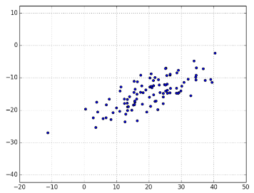

# 2.数学基础

## 线性代数

### 1.向量

向量是指可以加总（以生成新的向量），可以乘以标量（即数字），也可以生成新的向量的对象。
具体来说（对我们而言），向量是有限维空间的点。即使你本无意视你的数据为向量，将数值数据表示为向量也是非常好的处理方式。

比如，如果你有很多人的身高、体重、年龄数据，就可以把数据记为三维向量 (height,weight, age) 。
如果你教的一个班有四门考试，就可以把学生成绩记为四维向量 (exam1,exam2, exam3, exam4)
一个包含三个数字的列表对应一个三维空间的向量

1. 相加和相减都可以理解成是向量的分解与合成的过程
2. 向量的乘积

```text
1.向量的内积 即 向量的的数量积（内积、点积），他有两种定义，代数定义和几何定义
    代数定义：对应的元素相乘，再加和。如，[1, 2] * [3, 4] = 1*3+2*4=11
        a = np.array([1,2])
        b = np.array([2,1])
        print("a", a)
        print("a.shape", a.shape)
        print(a.dot(b))
        
    几何定义：记作a·b.若a、b不共线,则a·b=|a|·|b|·cos〈a,b〉；若a、b共线,则a·b=+-∣a∣∣b∣.
        
    回顾三角函数：
    sin(A+B)=sinAcosB+cosAsinB
    sin(A-B)=sinAcosB-cosAsinB
    cos(A+B)=cosAcosB-sinAsinB
    cos(A-B)=cosAcosB+sinAsinB
    
2.向量的外积 即 向量的向量积(实际意义不大)
    定义：两个向量a和b的向量积（外积、叉积）是一个向量,记作a×b.
        若a、b不共线,则a×b的模是：∣a×b∣=|a|·|b|·sin〈a,b〉, a×b的方向是：这两个向量所在平面垂直，且遵守右手定则;
        若a、b共线,则a×b=0.
```

### 2.矩阵

矩阵是一个二维的数据集合。我们将矩阵表示为列表的列表，每个内部列表的大小都一样，表示矩阵的一行。

比如：矩阵a = [[1,2,3], [4,5,6]]

则说明矩阵a具有len(a)行，len(a[0])列，这就是矩阵a形状shape，a具有2行3列，我们称之为2x3矩阵

```text
import numpy as np

# 创建一个二维数组
a = [
    [1,2,3],
    [4,5,6],
    [7,8,9]
]

# 创建一个矩阵
m = np.mat(a)
print(np.multiply(m, m))
#对应值相乘
# [[ 1  4  9]
#  [16 25 36]
#  [49 64 81]]

print(np.dot(m, m))
# 点积,理论上的矩阵相乘
# [[ 30  36  42]
#  [ 66  81  96]
#  [102 126 150]]

print(m @ m)
# 点积,理论上的矩阵相乘
# [[ 30  36  42]
#  [ 66  81  96]
#  [102 126 150]]

print(np.add(m, m))
# 矩阵相加
# [[ 2  4  6]
#  [ 8 10 12]
#  [14 16 18]]

print(m.shape)
# (3, 3)

print(np.tile(a, (1,2)))
# tile扩展， 2表示列方向扩展到1遍，1表示不扩展
# [[1 2 3 1 2 3]
#  [4 5 6 4 5 6]
#  [7 8 9 7 8 9]]
```

## 统计学

### 1.描述单个数据集

对于数据量小的单个数据集，数据本身就是很好的信息描述。但是对于一个数据量数十万甚至更大的数据集来说，获得它的特征就特别的困难

```text
import random

from matplotlib import pyplot

data = [(x + 1, random.randrange(100)) for x in range(100)]

x, y = zip(*data)

# 生成条形图
pyplot.bar(x ,y)
pyplot.title('测试')
pyplot.show()
```

#### 1.1.中心倾向

我们常常希望了解数据中心位置的一些概念。

一个常用的方法是使用均值（mean 或 average）;

或者也会用到中位数（median），它是指数据中间点的值（如果数据点的个数是奇数），或者中间两个点的平均值（如果数据点的个数是偶数）

还有分位数，它表示少于数据中特定百分比的一个值;

还有一个很少用到的众值，就是出现次数最多的值


> 1.均值

    y = [random.randrange(100) for i in range(100)]
    print("数据量", len(y))
    print("最大值", max(y))
    print("最小值", min(y))
    print("平均值", sum(y) / len(y))

> 2.中位值

    y = [random.randrange(100) for i in range(100)]
    y.sort()#递增排序
    def median(li): # 获得中位值
        l = len(li)
        if (l % 2 == 1) :#奇数
            return li[(l + 1) // 2]
        else:# 偶数
            return (li[l // 2] + li[l // 2]) / 2
    print(median(y))

> 3.分位值

    def quantile(x, p):
        p_index = int(p * len(x))
        return sorted(x)[p_index]
    quantile(num_friends, 0.10) # 15
    quantile(num_friends, 0.25) # 31
    quantile(num_friends, 0.75) # 75
    quantile(num_friends, 0.90) # 89


> 4.众值

    def maxCount(x):
        count = Counter(x)
        maxValue = max(count.values())
        return [x for x in count.items() if x[1] == maxValue]
    print("众值", maxCount(y)) #众值 [(29, 4), (89, 4)]

#### 1.2.离散度

离散度是数据的离散程度的一种度量。通常，如果它所统计的值接近零，则表示数据聚集在一起，离散程度很小，如果值很大（无论那意味着什么），则表示数据的离散度很大。

> 极差

一个简单的度量是极差（range），指最大元素与最小元素的差,极差恰好为零，意味着数据集中最大值和最小值相等，这种情形只有在 x 中的元素全部相同时才会发生，
意味着数据没有离散。相反，如果极差很大，说明最大元素比最小元素大很多，数据离散度很高。和中位数一样，极差也不真正依赖于整个数据集。
一个只包含 0 和 100 的数据集，和一个包含 0、1 以及很多个 50 的数据集，两者的极差相同。但看起来第一个数据集的离散度“应该”更高。

    data = [5, 6, 6, 5, 9, 0, 7, 2, 8, 7, 7, 9, 4, 5, 6, 1, 8, 6, 8, 5]
    print("极差", max(data) - min(data))

> 方差

在统计描述中，方差用来计算每一个变量（观察值）与总体均数之间的差异。为避免出现离均差总和为零，离均差平方和受样本含量的影响，统计学采用平均离均差平方和来描述变量的变异程度

公式：S^2= ∑(X-avg)^2/(n) ; x是变量，avg是数据的均值，n是数据的大小

（最重要）实际工作中，总体均数难以得到时，应用样本统计量代替总体参数，经校正后，样本方差计算公式

公式：S^2= ∑(X-avg)^2/(n-1) ; x是变量，avg是样本均值，n是样本大小

> 标准差（均方差）

    def variance(x):
        avg = sum(x) / len(x)  # 期望值
        sumValue = sum([(avg - i) ** 2 for i in x])
        return sumValue / len(x)

    def variance2(x):
        avg = sum(x) / len(x)  # 样本期望值
        sumValue = sum([(avg - i) ** 2 for i in x])
        return sumValue / (len(x) - 1)

    print("方差", variance(data))
    print("样本方差", variance2(data))

    print("标准差", math.sqrt(variance(data)))
    print("样本标准差", math.sqrt(variance2(data)))

### 2.相关系数

> 协方差

如果两个变量的变化趋势一致，也就是说如果其中一个大于自身的期望值时另外一个也大于自身的期望值，那么两个变量之间的协方差就是正值；
如果两个变量的变化趋势相反，即其中一个变量大于自身的期望值时另外一个却小于自身的期望值，那么两个变量之间的协方差就是负值。
可以通俗的理解为：两个变量在变化过程中是同方向变化？还是反方向变化？同向或反向程度如何？
你变大，同时我也变大，说明两个变量是同向变化的，这时协方差就是正的;
你变大，同时我变小，说明两个变量是反向变化的，这时协方差就是负的;
从数值来看，协方差的数值越大，两个变量同向程度也就越大。反之亦然。

```python
import numpy as np
import math

a = [5, 6, 6, 5, 9, 0, 7, 2, 8, 7, 7, 9, 4, 5, 6, 1, 8, 6, 8, 5]
b = [5, 6, 6, 5, 9, 0, 7, 2, 8, 7, 7, 9, 4, 5, 6, 1, 8, 6, 8, 5]

# 协方差
def covariance(x, y):
    if len(x) != len(y):
        raise Exception('两个列表的长度必须相同')
    n = len(x)
    avg_a = sum(x) / n #均值
    avg_b = sum(y) / n #均值
    mean_a = [round(i - avg_a, 5) for i in x] # 均差值,精确到小数点3位
    mean_b = [round(i - avg_b, 5) for i in y] # 均差值,精确到小数点3位
    return np.dot(mean_a, mean_b)/(n - 1) # dot 点乘，表示，对应索引的两个值相乘，最后在相加

print("协方差", covariance(a, b)) #6.115789473684211
```

> 相关系数

相关是更常受到重视的概念，它是由协方差除以两个变量的标准差。它的值去-1（完全反相关）和 1 （完全正相关）。
尤其需要注意的是，计算相关系数的时候，异常数据应该及时剔除掉，异常数据对结果的影响非常明显。

```python
import numpy as np
import math

a = [5, 6, 6, 5, 9, 0, 7, 2, 8, 7, 7, 9, 4, 5, 6, 1, 8, 6, 8, 5]
b = [5, 6, 6, 5, 9, 0, 7, 2, 8, 7, 7, 9, 4, 5, 6, 1, 8, 6, 8, 5]

# 协方差
def covariance(x, y):
    if len(x) != len(y):
        raise Exception('两个列表的长度必须相同')
    n = len(x)
    avg_a = sum(x) / n #均值
    avg_b = sum(y) / n #均值
    mean_a = [round(i - avg_a, 5) for i in x] # 均差值,精确到小数点3位
    mean_b = [round(i - avg_b, 5) for i in y] # 均差值,精确到小数点3位
    return np.dot(mean_a, mean_b)/(n - 1) # dot 点乘，表示，对应索引的两个值相乘，最后在相加

print("协方差", covariance(a, b))
# 标准差
def standard_deviation(x):
    avg = sum(x) / len(x)  # 样本期望值
    sumValue = sum([(avg - i) ** 2 for i in x])
    return math.sqrt(sumValue / (len(x) - 1))

# 相关系数
def correlation(x, y):
    stdev_x = standard_deviation(x) # 标准差
    stdev_y = standard_deviation(y) # 标准差
    if stdev_x > 0 and stdev_y > 0:
        return round(covariance(x, y) / stdev_x / stdev_y, 3)
    else:
        return 0  # 如果没有变动，相关系数为零

print(correlation(a, b))
```

> 使用numpy

```python
# 使用numpy计算,返回结果均为(2, 2)矩阵result[i][j]，表示第i个变量与第j个变量的协方差和相关系数。我们一般取result[1][1]即可。
x = np.vstack((a, b))
print("协方差", np.cov(x))
print("协方差", np.cov(a, b))
print("协方差", np.cov(a, b, bias=True))
print("相关系数", np.corrcoef(a, b))
print("相关系数", np.corrcoef(x))
```

### 3.辛普森悖论

指的是数据分析的时候，出现的数据异常的情况。一般是由于数据变量混杂，导致一些条件未考虑进行。

回避方式：为了避免辛普森悖论出现，就需要斟酌个别分组的权重，以一定的系数去消除以分组资料基数差异所造成的影响，同时必需了解该情境是否存在其他潜在要因而综合考虑。

## 概率论

### 1.不独立与独立

泛泛地讲，如果 A 发生意味着 B 发生（或者 A 发生意味着 B 发生），我们就称事件 A 与事件 B 为不相互独立（dependent）。
反之，A 与 B 就相互独立（independent）

### 2.条件概率
如果事件 A 与事件 B 独立，那么A和B同时发生的概率：P(A∩B)=P(A)*P(B)

如果两者不相互独立（并且 B 的概率不为零）,那么A关于B的条件概率式(也就是B发生的情况下A的概率)： P(A|B)=P(A∩B)/P(B)

如果 A 和 B 独立，则上式应该表示为： P(A|B)=P(A)

>例如：

1.假设生男孩和女孩的概率个1/2，那么事件A“两个孩子都是女孩”关于事件B“大孩子是女孩”的条件概率是多少？

    分析可知：P(A) = 1/2 * 1/2 = 1/4; P(B)= 1/2 * 1(第一个是女孩，第二个随便);
    当A发生的时B必然发生，所以：P(A∩B)=P(A)=1/4。
    所以：P(A|B)= P(A∩B)/P(B)=1/4 / 1/2 = 1/2。

2.事件A“两个孩子都是女孩”关于事件B“至少一个孩子是女孩”的条件概率是多少？

    分析可知：P(A) = 1/2 * 1/2 = 1/4; P(B)= 1 - 1/2*1/2 = 3/4(1-全是男孩的概率);
    当A发生的时B必然发生，所以：P(A∩B)=P(A)=1/4。
    所以：P(A|B)= P(A∩B)/P(B)=1/4 / 3/4 = 1/3。

### 3.贝叶斯定理

贝叶斯定理是条件概率的某种逆运算。假设我们需要计算事件 A 基于已发生的事件 B 的条件概率，
但我们已知的条件仅仅是事件 B 基于已发生的事件 A 的条件概率。
两次利用条件概率的定义，可以得到下式：P(A|B) = P(A, B)/P(B) = P(B|A)P(A)/P(B)

### 4.随机变量

随机变量指这样一种变量，其可能的取值有一种联合概率分布。

### 5.连续分布

掷硬币对应的是离散分布（discrete distribution）——对离散的结果赋予正概率。
我们常常希望对连续结果的分布进行建模。（对于我们的研究目的来说，这些结果最好都是实数， 但实际中并不总是这样的）。
例如，均匀分布（uniform distribution）函数对 0 到 1 之间的所有值都赋予相同的权重（weight）。

因为 0 和 1 之间有无数个数字，因而对每个点而言，赋予的权重几乎是零。
因此，我们用带概率密度函数（probability density function，pdf）的连续分布来表示概率，
一个变量位于某个区间的概率等于概率密度函数在这个区间上的积分。

### 6.正态分布

正态分布是分布之王！它是典型的钟型曲线形态分布函数，可以完全由两个参数决定：
均值 μ（mu）和标准差 σ （sigma）。均值描述钟型曲线的中心，标准差描述曲线有多“宽”。

```python
import math
from matplotlib import pyplot

# 均值 μ（mu）和标准差 σ （sigma）
def normal_pdf(x, mu = 0, sigma = 1):
    return 1 / (math.sqrt(2 * math.pi) * sigma) * math.exp(
        -( (x - mu) ** 2 ) / (2 * sigma ** 2)
    )

xs = [x / 10 for x in range(-50, 50)]

pyplot.plot(xs, [normal_pdf(x, mu=0,sigma=1) for x in xs],'-',label='mu=0,sigma=1')
pyplot.plot(xs, [normal_pdf(x, mu=0,sigma=2) for x in xs],'--',label='mu=0,sigma=2')
pyplot.plot(xs, [normal_pdf(x, mu=0,sigma=0.5) for x in xs],':',label='mu=0,sigma=0.5')
pyplot.plot(xs, [normal_pdf(x, mu=-1,sigma=1) for x in xs],'-.',label='mu=-1,sigma=1')

pyplot.legend()
pyplot.title("多个正态分布的概率密度函数")
pyplot.show()

如果 μ=0 并且 σ =1，这个分布称为标准正态分布。
如果 Z 是服从标准正态分布的随机变量，则有如下转换式：
X= σZ+μ
其中 X 也是正态分布，但均值是 μ，标准差是 σ 。

相反，如果 X 是均值为 μ 标准差为 σ 的正态分布，那么：
Z=(X-μ)/ σ
是标准正态分布的随机变量。

累积分
def normal_cdf(x, mu=0,sigma=1):
    return (1 + math.erf((x - mu) / math.sqrt(2) / sigma)) / 2
# 我们再绘出一系列概率累积分布函数（如图 6-3）：
xs = [x / 10.0 for x in range(-50, 50)]
plt.plot(xs,[normal_cdf(x,sigma=1) for x in xs],'-',label='mu=0,sigma=1')
plt.plot(xs,[normal_cdf(x,sigma=2) for x in xs],'--',label='mu=0,sigma=2')
plt.plot(xs,[normal_cdf(x,sigma=0.5) for x in xs],':',label='mu=0,sigma=0.5')
plt.plot(xs,[normal_cdf(x,mu=-1) for x in xs],'-.',label='mu=-1,sigma=1')
plt.legend(loc=4) # 底部右边
plt.title("多个正态分布的累积分布函数")
plt.show()

我们有时会需要对 normal_cdf 取逆，从而可以求出特定的概率的相应值。不存在计算逆函数的简便方法，
但由于 normal_cdf 连续且严格递增，因而我们可以使用二分查找（https://en.wikipedia.org/wiki/Binary_search_algorithm）的方法：

def inverse_normal_cdf(p, mu=0, sigma=1, tolerance=0.00001):
"""find approximate inverse using binary search"""
# 如果非标准型，先调整单位使之服从标准型
if mu != 0 or sigma != 1:
    return mu + sigma * inverse_normal_cdf(p, tolerance=tolerance)
low_z, low_p = -10.0, 0 # normal_cdf(-10)是（非常接近）0
hi_z, hi_p = 10.0, 1 # normal_cdf(10)是（非常接近）1
while hi_z - low_z > tolerance:
    mid_z = (low_z + hi_z) / 2 # 考虑中点
    mid_p = normal_cdf(mid_z) # 和cdf在那里的值
    if mid_p < p:
        # midpoint仍然太低，搜索比它大的值
        low_z, low_p = mid_z, mid_p
    elif mid_p > p:
        # midpoint仍然太高，搜索比它小的值
        hi_z, hi_p = mid_z, mid_p
    else:
        break
return mid_z
这个函数反复分割区间，直到分割到一个足够接近于期望概率的精细的 Z 值。
```

## 梯度下降

### 1.梯度下降

梯度下降是迭代法的一种,可以用于求解最小二乘问题(线性和非线性都可以)。
在求解机器学习算法的模型参数，即无约束优化问题时，梯度下降（Gradient Descent）是最常采用的方法之一，另一种常用的方法是最小二乘法。
在求解损失函数的最小值时，可以通过梯度下降法来一步步的迭代求解，得到最小化的损失函数和模型参数值。
反过来，如果我们需要求解损失函数的最大值，这时就需要用梯度上升法来迭代了。
在机器学习中，基于基本的梯度下降法发展了两种梯度下降方法，分别为随机梯度下降法和批量梯度下降法。

### 2.求解过程

顾名思义，梯度下降法的计算过程就是沿梯度下降的方向求解极小值（也可以沿梯度上升方向求解极大值）。

比如：求函数 f(x) = x * x    x平方的最小值。
利用梯度下降的方法解题步骤如下：

1、求梯度：（其实就是f(x)的一阶导数） t=2x

2、向梯度相反的方向移动，比如 x -> x - y*t
    其中y为步长。如果步长足够小，则可以保证每一次迭代都在减小，但可能导致收敛太慢，如果步长太大，则不能保证每一次迭代都减少，也不能保证收敛。

3、循环迭代步骤2，直到 x 的值变化到使得 f(x) 在两次迭代之间的差值足够小，比如0.00000001，也就是说，直到两次迭代计算出来的 f(x) 基本没有变化，
    则说明此时  已经达到局部最小值了。
    
4、此时，输出x，这个x就是使得函数f(x)最小时的 x 的取值 。

### 3.缺点

1. 靠近极小值时收敛速度减慢。
2. 直线搜索时可能会产生一些问题。
3. 可能会“之字形”地下降

### 4.程序实现

如果 f 是单变量函数，那么它在 x 点的导数衡量了当 x 发生变化时， f(x) 变化了多少。
通过差商来求近似导数：导数就是在点 (x, f (x)) 的切线的斜率，而差商就是通过点 (x, f (x)) 和点 (x+h, f (x+h)) 的割线的斜率。
当 h 越来越小，割线与切线就越来越接近

```python
from functools import partial
import inspect

from matplotlib import pyplot as plt

# 求差商
def difference_quotient(f, x, h):
    if inspect.isfunction(f) :
        return (f(x + h) - f(x)) / h
    else:
        return None

# 函数 f(x) = x * x
def square(x):
    return x * x

# 我们已知f(x)的导数
def derivative(x):
    return 2 * x

derivative_estimate = partial(difference_quotient, square, h=0.000001)

x = range(-10,10)
plt.title("精确的导数值与估计值")
plt.plot(x, [y for y in map(derivative_estimate, x)], 'b+', label='差商值') # 用 + 表示
plt.plot(x, [y for y in map(derivative, x)], 'rx', label='导数值') # 用 x 表示
plt.legend(loc=9)
plt.show()   

通过生产的plot可知，差商与导数值，拟合度高，当 h 值越小， 两者的拟合度越高。

当 f 是一个多变量函数时，它有多个偏导数，每个偏导数表示仅有一个输入变量发生微小变化时函数 f 的变化。
我们把导数看成是其第 i 个变量的函数，其他变量保持不变，以此来计算它第 i 个偏导数：

def partial_difference_quotient(f, v, i, h):
    """compute the ith partial difference quotient of f at v"""
    w = [v_j + (h if j == i else 0) # 只对v的第i个元素增加h
        for j, v_j in enumerate(v)]
    return (f(w) - f(v)) / h

再以同样的方法估算它的梯度函数：

def estimate_gradient(f, v, h=0.00001):
    return [partial_difference_quotient(f, v, i, h)
        for i, _ in enumerate(v)]    
```

## 数据工作基础

### 1.初步分析数据

> 1.一维数据

最简单的情形是，你得到的一个数据集合仅仅是一维数据集。比如，它们可以是每个用户在你的网站上平均每天花费的时间，
每个数据科学教程视频的观看次数，或者是你的数据科学图书馆中每本数据科学书的页数。

比如：
```json
user_time = {
        'user_1' : 10,
        'user_2' : 5,
        'user_3' : 7,
        ......
        }
```

- 步骤一：计算一些总结性统计数据。比如数据集的大小、最小值、最大值、平均值、标准差等等
- 步骤二：如果数据量较大，可以使用图表的形式展示

> 2.多维数据

对于多维数据，你可能想了解各个维度之间是如何相关的。一个简单的方法是考察相关矩阵（correlation matrix），
矩阵中第 i 行第 j 列的元素表示第 i 维与第 j 维数据的相关性

```python
# 1. 这个是常见的计算相关系数的方法
import numpy
import math
import random
import matplotlib.pyplot as plt

# 协方差
def covariance(x, y):
    if len(x) != len(y):
        raise Exception('两个列表的长度必须相同')
    n = len(x)
    avg_a = sum(x) / n #均值
    avg_b = sum(y) / n #均值
    mean_a = [round(i - avg_a, 5) for i in x] # 均差值,精确到小数点3位
    mean_b = [round(i - avg_b, 5) for i in y] # 均差值,精确到小数点3位
    return numpy.dot(mean_a, mean_b)/(n - 1) # dot 点乘，表示，对应索引的两个值相乘，最后在相加

# 标准差
def standard_deviation(x):
    avg = sum(x) / len(x)  # 样本期望值
    sumValue = sum([(avg - i) ** 2 for i in x])
    return math.sqrt(sumValue / (len(x) - 1))

# 相关系数
def correlation(x, y):
    stdev_x = standard_deviation(x)
    stdev_y = standard_deviation(y)
    if stdev_x > 0 and stdev_y > 0:
        return covariance(x, y) / stdev_x / stdev_y
    else:
        return 0 # 如果没有变动，相关系数为零

def get_row(A, i):
    return A[i] # A[i]是第i行

def get_column(A, j):
    return [A_i[j] # 第A_i行的第j个元素
        for A_i in A] # 对每个A_i行

def make_matrix(num_rows, num_cols, entry_fn):
    return [[entry_fn(i, j) # 根据i创建一个列表
        for j in range(num_cols)] # [entry_fn(i, 0), ... ]
        for i in range(num_rows)] # 为每一个i创建一个列表

def correlation_matrix(data):
    _, num_columns = numpy.shape(data)
    def matrix_entry(i, j):
        return correlation(get_column(data, i), get_column(data, j))
    return make_matrix(num_columns, num_columns, matrix_entry)

# 2. 一个更为直观的方法（如果维度不太多）是做散点图矩阵（图 10-4），以展示配对散点图。
# 通过命令 plt.subplots() 可以生成子图。我们给出了行数和列数，它返回一个 figure 对
# 象（我们不会用到它）和一个 axes 对象的二维数组（每个都会绘出）
data =[
    [
        random.randrange(10) for _ in range(4)
    ] for _ in range(10)
]

_, num_columns = numpy.shape(data)
fig, ax = plt.subplots(num_columns, num_columns)

for i in range(num_columns):
    for j in range(num_columns):
        if i != j:# x轴上column_j对y轴上column_i的散点
            ax[i][j].scatter(get_column(data, j), get_column(data, i))
        else:# 只有当 i == j时显示序列名
            ax[i][j].annotate("series " + str(i), (0.5, 0.5), xycoords='axes fraction', ha="center", va="center")
        # 除了图的左侧和下方之外，隐藏图的标记
        if i < num_columns - 1:
            ax[i][j].xaxis.set_visible(False)
        if j > 0:
            ax[i][j].yaxis.set_visible(False)
# 修复右下方和左上方的图标记
# 因为它们只有文本，是错误的
ax[-1][-1].set_xlim(ax[0][-1].get_xlim())
ax[0][0].set_ylim(ax[0][1].get_ylim())
plt.show()
```

通过这些散点图你会看出，如果生成的离散图基本上拟合在一起，则说明相关程度很高;
大部分数据点拟合,则说明正相关程度很高

### 2.数据清洗与修正

真实世界的数据是有很多问题的。在使用数据之前，你通常需要对它们进行一定的预处理。
比如：一个列表表示人类的年龄，我们首先需要确定元素都必须是数字，在定义好年龄的范围[0~125]。能让我们的数据更加接近真实。
当我们发现这些有问题的数据的时候，一般来说，你有三个选择：删除它们；溯源并修复不良数据或缺失数据；什么都不做，自求多福吧。

### 3.数据处理

值得是，将数据转换为方便自己使用的类型、格式。

### 4.数据调整

许多技术对数据单位（scale）敏感。比如，假设你有一个包括数百名用户的身高和体重的数据集，并且需要创建体型大小的聚类（cluster）。
直观上讲，我们用聚类表示相近的点，这意味着我们需要某种点距离的概念。我们知道有欧几里得距离函数 distance ，所以自然地，
一种方法是将数据对 (height, weight) 视为二维空间中的点

1.案例

```text
观测对象 身高（英寸） 身高（厘米） 体重（磅）
A       63          160         150
B       67          170.2       160
C       70          177.8       171

如果我们用英寸作为身高的单位，那么 B 最近的邻居是 A
a_to_b = distance([63, 150], [67, 160]) # 10.77
a_to_c = distance([63, 150], [70, 171]) # 22.14
b_to_c = distance([67, 160], [70, 171]) # 11.40

如果用厘米作为单位，那么 B 最近的邻居变成了 C：
a_to_b = distance([160, 150], [170.2, 160]) # 14.28
a_to_c = distance([160, 150], [177.8, 171]) # 27.53
b_to_c = distance([170.2, 160], [177.8, 171]) # 13.37
```

2.变差系数

```text
变差系数（Cv）=标准差（σ）/平均值（x）
 
# 变差系数
def biancha(x):
    avg = sum(x) / len(x)
    sumValue = sum([(avg - i) ** 2 for i in x])
    standard_deviation_value = math.sqrt(sumValue / (len(x) - 1))
    return standard_deviation_value / avg
```

### 5.降维

有时候，数据的“真实”（或有用的）维度与我们掌握的数据维度并不相符.
降维多用于数据集的维数很高的情形。不适用于低维数据集。



数据的大部分变差看起来像是沿着单个维度分布的，既不与 x 轴对应，也不与 y 轴对应。
当这种情形发生时，我们可以使用一种叫作主成分分析算法（principal component analysis，PCA）
从数据中提取出一个或多个维度，以捕获数据中尽可能多的变差。

机器学习领域中所谓的降维就是指采用某种映射方法，将原高维空间中的数据点映射到低维度的空间中。
降维的本质是学习一个映射函数 f : x->y，其中x是原始数据点的表达，目前最多使用向量表达形式。 
y是数据点映射后的低维向量表达，通常y的维度小于x的维度（当然提高维度也是可以的）。
f可能是显式的或隐式的、线性的或非线性的。
目前大部分降维算法处理向量表达的数据，也有一些降维算法处理高阶张量表达的数据。
之所以使用降维后的数据表示是因为在原始的高维空间中，包含有冗余信息以及噪音信息，在实际应用例如图像识别中造成了误差，降低了准确率；
而通过降维,我们希望减少 冗余信息 所造成的误差,提高识别（或其他应用）的精度。又或者希望通过降维算法来寻找数据内部的本质结构特征。
在很多算法中，降维算法成为了数据预处理的一部分，如PCA。事实上，有一些算法如果没有降维预处理，其实是很难得到很好的效果的。

1.主成分分析算法（PCA）

PCA是最常用的线性降维方法，它的目标是通过某种线性投影，将高维的数据映射到低维的空间中表示，并期望在所投影的维度上数据的方差最大，
以此使用较少的数据维度，同时保留住较多的原数据点的特性。
通俗的理解，如果把所有的点都映射到一起，那么几乎所有的信息（如点和点之间的距离关系）都丢失了，而如果映射后方差尽可能的大，
那么数据点则会分散开来，以此来保留更多的信息。可以证明，PCA是丢失原始数据信息最少的一种线性降维方式。
（实际上就是最接近原始数据，但是PCA并不试图去探索数据内在结构）

