# 3.神经网络

- 初学必看，帮助对神经网络有宏观的认识[从一个简单的神经网络模型开始](https://mp.weixin.qq.com/s/KSm1EDSsnhfT4Ht3YAYICg)


## 1.简介

【必读】神经网络模型并不是通用模型，不同的问题需要设计不同的神经网络模型，千万不要想着一个模型打天下

神经网络，全称人工神经网络（Artificial Neural Network，即ANN ）。它从信息处理角度对人脑神经元网络进行抽象， 建立某种简单模型，按不同的连接方式组成不同的网络。
在工程与学术界也常直接简称为神经网络或类神经网络。

神经网络是一种运算模型，由大量的节点（或称神经元）之间相互联接构成。每个节点代表一种特定的输出函数，称为激励函数（activation function）。
每两个节点间的连接都代表一个对于通过该连接信号的加权值，称之为权重，这相当于人工神经网络的记忆。
网络的输出则依网络的连接方式，权重值和激励函数的不同而不同。而网络自身通常都是对自然界某种算法或者函数的逼近，也可能是对一种逻辑策略的表达。

最近十多年来，人工神经网络的研究工作不断深入，已经取得了很大的进展，其在模式识别、智能机器人、自动控制、预测估计、生物、医学、经济等领域已成功地解决了许多现代计算机难以解决的实际问题，表现出了良好的智能特性。

当数据量越来越大的今天，深度学习的效果越来越明显。

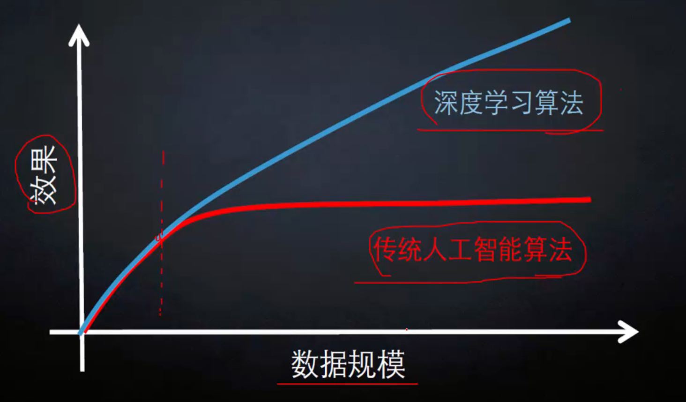

比如，无人驾驶，image transfer（图像合成），图像分类，自然语法识别

### 1.1.起源与发展
- 神经网络的研究起源于20世纪40年代，最早由沃伦·麦卡洛克（Warren McCulloch）和沃尔特·皮茨（Walter Pitts）提出了神经元的数学模型，标志着神经网络研究的开端。
- 20世纪50年代末，弗兰克·罗森布拉特（Frank Rosenblatt）提出了感知机模型，这是一种简单的神经网络，能够进行简单的模式识别。
- 20世纪80年代，随着反向传播算法的提出，神经网络迎来了新的发展高潮，能够处理更复杂的问题。
- 21世纪以来，随着计算能力的提升和数据量的爆发式增长，深度学习作为神经网络的一个重要分支，取得了巨大的成功，在图像识别、语音识别、自然语言处理等领域取得了突破性的进展。

### 1.2.基本组成
- **神经元**：是神经网络的基本处理单元，类似于生物神经元。每个神经元接收多个输入信号，对这些信号进行加权求和，并通过一个激活函数处理，产生一个输出信号。
- **层**：由多个神经元组成，神经网络通常包含多个层，如输入层、隐藏层和输出层。输入层负责接收外部数据，输出层给出最终的计算结果，隐藏层则在输入和输出之间进行复杂的特征提取和信息处理。
- **连接权重**：神经元之间的连接带有权重，权重决定了一个神经元的输出对另一个神经元输入的影响程度。在神经网络的训练过程中，权重会不断调整，以优化网络的性能。

### 1.3.工作原理
- **训练阶段**：首先，将大量的标注数据输入到神经网络中。网络通过前向传播过程，根据当前的权重计算出输出结果，并将输出结果与真实标签进行比较，计算出误差。然后，通过反向传播算法，将误差从输出层反向传播到输入层，沿途根据误差来调整各个连接的权重，使得误差逐渐减小。这个过程会反复进行，直到网络的性能达到满意的水平。
- **预测阶段**：在训练好神经网络后，将待预测的数据输入到网络中，经过前向传播计算，网络会输出预测结果。

### 1.4.应用领域
- **图像识别**：用于人脸识别、物体检测、图像分类等，如安防监控中的人脸识别系统、自动驾驶中的交通标志识别。
- **语音识别**：将语音信号转换为文字，应用于语音助手、语音输入法等，如苹果的Siri、百度语音输入法。
- **自然语言处理**：用于机器翻译、文本分类、情感分析等，如谷歌翻译、社交媒体上的舆情分析。
- **医疗领域**：辅助疾病诊断、医学影像分析等，如通过分析X光片、CT图像来检测疾病。
- **金融领域**：用于风险评估、股票预测、欺诈检测等。

### 1.5.神经网络类型
- **前馈神经网络**：数据只能从输入层向前传播到输出层，没有反馈连接，是最基本的神经网络类型。
- **循环神经网络（RNN）**：具有反馈连接，能够处理序列数据，如文本、语音等，在自然语言处理和时间序列预测等领域有广泛应用。
- **卷积神经网络（CNN）**：专门用于处理具有网格结构数据的神经网络，如图像、音频，通过卷积层、池化层等操作，能够自动提取数据的特征，在图像识别、目标检测等领域表现出色。
- **生成对抗网络（GAN）**：由生成器和判别器组成，通过对抗训练的方式，能够生成逼真的图像、文本等数据，在图像生成、艺术创作等领域有独特的应用。

新兴神经网络类型：大模型通常使用的是基于人工神经网络（ANN）发展而来的技术架构。
- 脉冲神经网络（Spiking Neural Network，SNN）：SNN 是一种第三代神经网络，它模拟生物神经元的脉冲发放行为进行信息处理。 
  - SNN 中的神经元接收输入脉冲信号，当输入信号的累积达到一定阈值时，神经元会产生一个输出脉冲，然后进入不应期，等待下一次的输入信号积累。
  - 应用领域：图像识别与处理、语音识别与处理、机器人控制、神经科学研究等。
- 人工神经网络（Artificial Neural Network，ANN）ANN 是一种模仿生物神经网络结构和功能的数学模型或计算模型。
  - 由大量的人工神经元相互连接组成，神经元之间通过权重来传递信息，通过调整权重来学习和适应输入数据中的模式和规律，以实现对数据的分类、预测、聚类等任务。
  - 应用领域：广泛应用于图像识别、语音识别、自然语言处理、金融预测、医疗诊断、智能控制等众多领域。

## 2.案例。图像分类

### 2.1.图像分类：计算机视觉核心任务

图片由像素点组成，比如一张300x100的图片，就是有 300x100个像素点，每个像素点都是代表一种颜色，所以一张图片会被计算机识别成三维数组， 比如300x100x3。

其中每个像素点都是一个三维向量， 比如RGB三个颜色通道。
在 RGB 颜色模式中，每个颜色通道都可以用 0 到 255 之间的数值来表示其强度。通常用十六进制来表示这些数值，0 对应十六进制的 00，255 对应十六进制的 FF。
所以，一个完整的 RGB 颜色值需要用六个十六进制数字来表示，分别对应 R、G、B 三个通道的值，格式为 RRGGBB。
例如，纯红色表示为 FF0000，纯绿色表示为 00FF00，纯蓝色表示为 0000FF，白色为 FFFFFF，黑色为 000000 等。

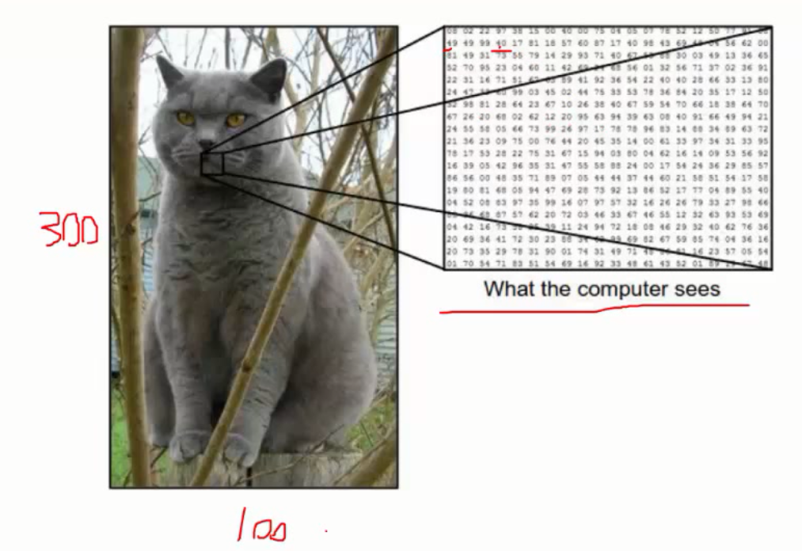

实际中，照片的拍摄角度，光照亮度，动作，部分遮蔽，背景混入等都会影响结果

而我们的处理过程还是沿用传统机器学习的方式：

1. 手机数据并给定标签
2. 训练一个分类器
3. 测试，评估

### 2.1.k-近邻

对于未知类型的数据集中的点。
1. 计算已知数据集中的点与未知点的距离
2. 按照距离排序
3. 选出与未知点距离最新的K个点
4. 确定当前K个点中各个分别出现的概率
5. 返回K个点中出现概率最大的类别，作为未知点的预测分类。

【这里只是使用k-近邻举例，与神经网络无关】其实K-近邻无法用于视觉分类的算法。

概述

KNN算法本身简单有效，他是一种lazy-learning算法。分类器不需要使用训练集进行训练，训练时间复杂度为0。

但是KNN的计算时间复杂度与训练集中的数据量成正比，也就是说，当训练集中文档的数据量是N的时候，KNN的计算时间复杂度为o(n)。

### 2.3.数据集样例：CIFAR-10

CIFAR-10 是一个包含60000张图片的数据集（其中五万张图片被划分为训练集，剩下的一万张图片属于测试集。）。

其中每张照片为32*32的彩色照片，每个像素点包括RGB三个数值，数值范围  0 ~ 255。

所有照片分属10个不同的类别，分别是 'airplane', 'automobile', 'bird', 'cat', 'deer', 'dog', 'frog', 'horse', 'ship', 'truck'

官网：[http://www.cs.toronto.edu/~kriz/cifar.html](http://www.cs.toronto.edu/~kriz/cifar.html)

1. 如何计算

k-近邻。使用CIFAR-10数据集进行分类。

因为CIFAR-10单个数据是32*32像素的图片，所以我们将位置图片的像素点，与训练集中所有数据进行减法。

比如将两张图片比作矩阵A[32][32],B[32][32]。我们进行矩阵的减法。C[32][32] = A[32][32]-B[32][32]。

在求C[32][32]中所有点的累加和。


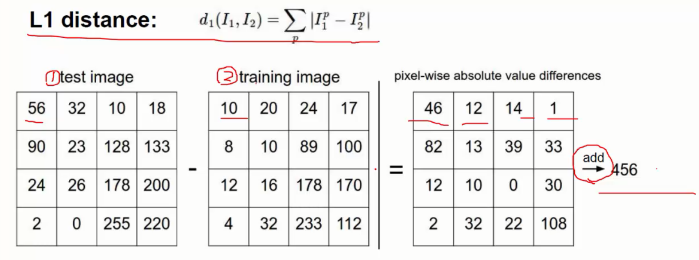

### 2.4.交叉验证

以CIFAR-10数据集为例子，我们可以知道，训练集为data_batch_1~5，测试数据集为test_batch，每个文件数据量大小为10000。

交叉验证是指，测试集与训练集轮流交叉使用，可以提高结果的准确度

|训练集                             |测试集|
|----------------------------------|------|
|data_batch_1 ~ data_batch_5   |test_batch|
|1，2，3，4，test                  | 5|
|1，2，3，5，test                  | 4|
|1，2，4，5，test                  | 3|

### 2.5.神经网络

1.得分函数

比如：一张图片是[32*32*3],已经有10个种类模型，现在有一个得分函数，可以计算该图片在10个种类模型中各自的得分。

f(x, w) = wx (+b)， b是损失函数


x是[32*32*3]的图片，我们把他降维到[3072 * 1],10个种类模型的在一个矩阵中[10 * 3072],
最终得要结果为[10 * 1]的矩阵，得分高的是该图片的分类。


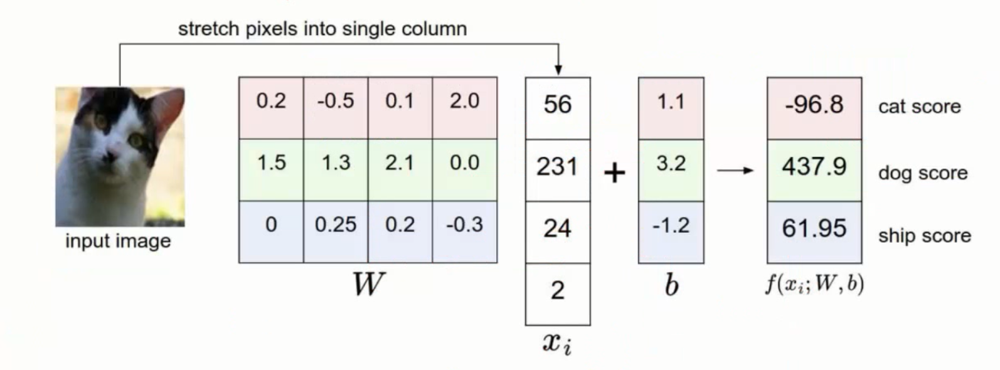

2.损失函数

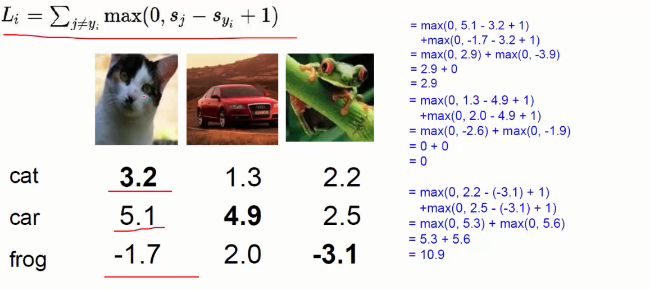

多个有大量样本的数据，损失函数计算各个样本的均值

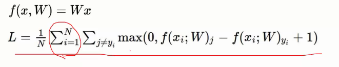

并且要消除W带来的影响，需要将正则化惩罚项

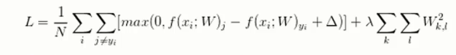

神经网路算法最大的问题使，获得的结果容易过拟合，比如 入=0.001 的时候。

一般我们认为，神经网路里面的神经元越多，与能表达复杂的数据模型，但是过拟合的现象就越明显

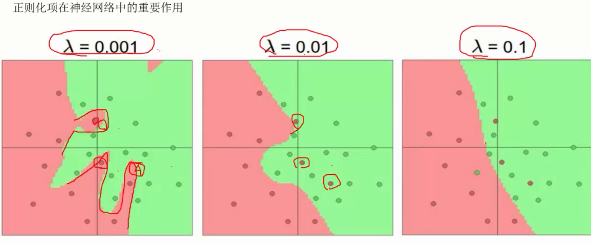

js版的神经网路demo:[https://cs.stanford.edu/people/karpathy/convnetjs/demo/classify2d.html](https://cs.stanford.edu/people/karpathy/convnetjs/demo/classify2d.html)

### 2.6.神经网路处理流程

1.数据预处理

数据的压缩，并且数据归一化

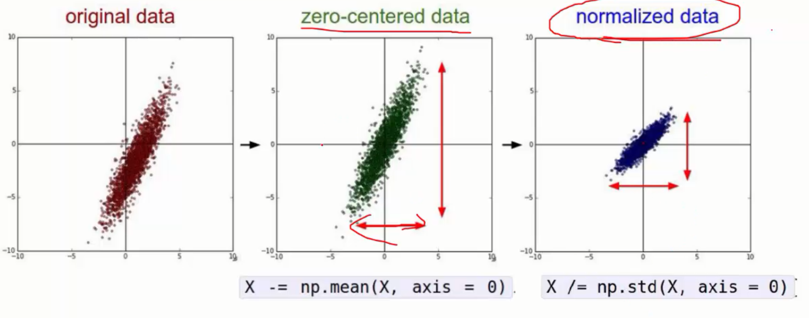

2.权重初始化

全部是随机值初始化

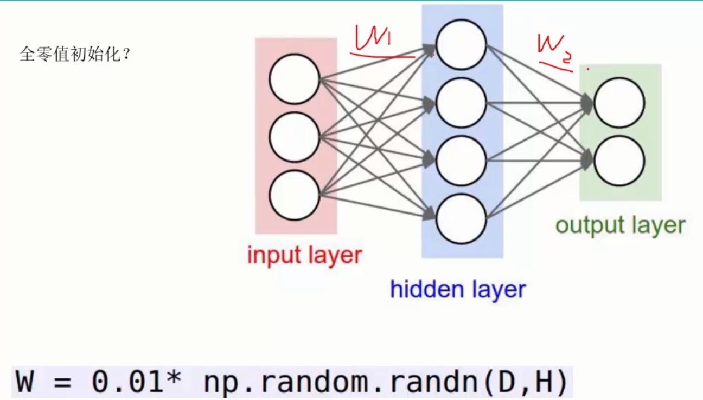

## 3.神经网络入门案例

以下是使用Keras（基于TensorFlow后端）实现前馈神经网络、循环神经网络（RNN）、卷积神经网络（CNN）和生成对抗网络（GAN）的入门学习案例。

### 1. 前馈神经网络（Feed - Forward Neural Network）
```python
import tensorflow as tf
from tensorflow import keras
from tensorflow.keras.datasets import mnist
from tensorflow.keras.models import Sequential
from tensorflow.keras.layers import Dense, Flatten

# 加载MNIST数据集
(x_train, y_train), (x_test, y_test) = mnist.load_data()

# 数据预处理
x_train = x_train / 255.0
x_test = x_test / 255.0

# 构建前馈神经网络模型
model = Sequential([
    Flatten(input_shape=(28, 28)),
    Dense(128, activation='relu'),
    Dense(10, activation='softmax')
])

# 编译模型
model.compile(optimizer='adam',
              loss='sparse_categorical_crossentropy',
              metrics=['accuracy'])

# 训练模型
model.fit(x_train, y_train, epochs=5)

# 评估模型
test_loss, test_acc = model.evaluate(x_test, y_test)
print(f"Test accuracy: {test_acc}")
```

### 2. 循环神经网络（Recurrent Neural Network）
```python
import numpy as np
import tensorflow as tf
from tensorflow import keras
from tensorflow.keras.models import Sequential
from tensorflow.keras.layers import SimpleRNN, Dense

# 生成简单的序列数据
data = np.array([[0.1, 0.2], [0.3, 0.4], [0.5, 0.6], [0.7, 0.8]])
target = np.array([[0.9], [1.0], [1.1], [1.2]])

# 调整数据形状以适应RNN输入 [样本数, 时间步长, 特征数]
data = np.expand_dims(data, axis=1)

# 构建RNN模型
model = Sequential([
    SimpleRNN(16, input_shape=(1, 2)),
    Dense(1)
])

# 编译模型
model.compile(optimizer='adam', loss='mse')

# 训练模型
model.fit(data, target, epochs=100, verbose=1)

```

### 3. 卷积神经网络（Convolutional Neural Network）
```python
import tensorflow as tf
from tensorflow import keras
from tensorflow.keras.datasets import mnist
from tensorflow.keras.models import Sequential
from tensorflow.keras.layers import Conv2D, MaxPooling2D, Flatten, Dense

# 加载MNIST数据集
(x_train, y_train), (x_test, y_test) = mnist.load_data()

# 数据预处理
x_train = x_train.reshape(-1, 28, 28, 1).astype('float32') / 255.0
x_test = x_test.reshape(-1, 28, 28, 1).astype('float32') / 255.0

# 构建CNN模型
model = Sequential([
    Conv2D(10, kernel_size=(5, 5), activation='relu', input_shape=(28, 28, 1)),
    MaxPooling2D(pool_size=(2, 2)),
    Conv2D(20, kernel_size=(5, 5), activation='relu'),
    MaxPooling2D(pool_size=(2, 2)),
    Flatten(),
    Dense(50, activation='relu'),
    Dense(10, activation='softmax')
])

# 编译模型
model.compile(optimizer='adam',
              loss='sparse_categorical_crossentropy',
              metrics=['accuracy'])

# 训练模型
model.fit(x_train, y_train, epochs=5)

# 评估模型
test_loss, test_acc = model.evaluate(x_test, y_test)
print(f"Test accuracy: {test_acc}")

```

### 4. 生成对抗网络（Generative Adversarial Network）
```python
import tensorflow as tf
from tensorflow import keras
from tensorflow.keras.datasets import mnist
from tensorflow.keras.layers import Dense, Flatten, Reshape
from tensorflow.keras.models import Sequential
import numpy as np

# 加载MNIST数据集
(x_train, _), (_, _) = mnist.load_data()

# 数据预处理
x_train = x_train.reshape(-1, 784).astype('float32') / 255.0

# 定义生成器
generator = Sequential([
    Dense(256, input_dim=100, activation='relu'),
    Dense(784, activation='sigmoid'),
    Reshape((28, 28))
])

# 定义判别器
discriminator = Sequential([
    Flatten(input_shape=(28, 28)),
    Dense(128, activation='relu'),
    Dense(1, activation='sigmoid')
])

# 编译判别器
discriminator.compile(optimizer='adam', loss='binary_crossentropy')

# 组合生成器和判别器
discriminator.trainable = False
gan_input = keras.Input(shape=(100,))
x = generator(gan_input)
gan_output = discriminator(x)
gan = keras.Model(gan_input, gan_output)
gan.compile(optimizer='adam', loss='binary_crossentropy')

# 训练GAN
batch_size = 64
epochs = 5
for epoch in range(epochs):
    for _ in range(len(x_train) // batch_size):
        # 训练判别器
        noise = np.random.normal(0, 1, size=[batch_size, 100])
        generated_images = generator.predict(noise)
        real_images = x_train[np.random.randint(0, x_train.shape[0], size=batch_size)]
        x = np.concatenate([real_images, generated_images])
        y_dis = np.zeros(2 * batch_size)
        y_dis[:batch_size] = 1
        discriminator.trainable = True
        discriminator.train_on_batch(x, y_dis)

        # 训练生成器
        noise = np.random.normal(0, 1, size=[batch_size, 100])
        y_gen = np.ones(batch_size)
        discriminator.trainable = False
        gan.train_on_batch(noise, y_gen)

    print(f'Epoch {epoch + 1} completed')

```

## 4.卷积神经网络 CNN

- [CNN结构、训练与优化一文全解](https://cloud.tencent.com/developer/article/2348481)
- [CNN卷积神经网络原理](https://cloud.tencent.com/developer/article/2104639)
- [理解卷积神经网络中的四种卷积](https://cloud.tencent.com/developer/article/1625088)

卷积神经网络（Convolutional Neural Network，简称 CNN）是一类专门为处理具有网格结构数据（如图像、音频等）而设计的深度学习模型。
在计算机视觉、自然语言处理等领域取得了巨大成功。

### 4.1.起源与发展
- 1980 年，福岛邦彦提出了神经认知机，它是卷积神经网络的雏形。神经认知机具有卷积层和池化层的概念，能够对图像进行一定程度的特征提取和模式识别。
- 1998 年，杨立昆等人提出了 LeNet - 5 网络，这是第一个真正意义上的卷积神经网络，成功应用于手写数字识别任务，为 CNN 的发展奠定了基础。
- 2012 年，AlexNet 在 ImageNet 图像分类竞赛中取得了巨大成功，它的出现引发了深度学习的热潮，使得卷积神经网络在学术界和工业界得到了广泛关注和应用。
  此后，一系列更强大的 CNN 架构如 VGG、GoogLeNet、ResNet 等相继提出，不断推动着计算机视觉领域的发展。

### 4.2.工作原理
- **特征提取**：输入数据（如图像）首先经过卷积层，通过不同的卷积核提取出各种特征，形成特征图。激活函数层为特征图引入非线性，增加模型的表达能力。
  池化层对特征图进行下采样，减少数据量。这个过程可以重复多次，通过多层卷积和池化操作，逐步提取出更高级、更抽象的特征。
- **分类或回归**：经过多次卷积和池化操作后，将得到的特征图展平成一维向量，输入到全连接层中。全连接层根据输入的特征向量进行分类或回归计算，输出最终的结果。

### 4.3.优势
- **自动特征提取**：CNN 能够自动从输入数据中提取特征，无需手动设计特征，大大减少了人工干预和特征工程的工作量。
- **参数共享**：卷积层的参数共享特性使得模型的参数数量大幅减少，降低了过拟合的风险，同时也提高了计算效率。
- **对平移、旋转和缩放具有一定的不变性**：由于卷积和池化操作的特性，CNN 对输入数据的平移、旋转和缩放具有一定的不变性，能够更好地处理不同姿态和尺度的输入数据。

### 4.4.应用领域
- **图像分类**：对图像进行分类，判断图像所属的类别，如在安防监控中对不同类型的物体进行分类识别。
- **目标检测**：在图像中检测出目标物体的位置和类别，如自动驾驶中的行人、车辆检测。
- **语义分割**：将图像中的每个像素分配到不同的类别中，实现对图像的精细化分割，如医学影像分析中的器官分割。
- **人脸识别**：识别图像或视频中的人脸身份，广泛应用于门禁系统、安防监控等领域。

### 4.5.基本结构与组件
#### 卷积层（Convolutional Layer）
- **原理**：卷积层是 CNN 的核心组件，它通过卷积核（也称为滤波器）在输入数据上滑动，进行卷积操作，从而提取输入数据的特征。
  卷积核是一个小的矩阵，它在滑动过程中与输入数据的局部区域进行元素相乘并求和，得到一个输出值。通过不同的卷积核，可以提取出不同类型的特征，如边缘、纹理等。
- **特点**：卷积操作具有参数共享和局部连接的特性，大大减少了模型的参数数量，降低了计算复杂度，同时也提高了模型的泛化能力。

#### 激活函数层
- **作用**：在卷积层之后，通常会添加激活函数层，用于引入非线性因素。常见的激活函数有 ReLU（Rectified Linear Unit）、Sigmoid、Tanh 等。
  ReLU 函数由于其计算简单、收敛速度快等优点，在 CNN 中得到了广泛应用。

#### 池化层（Pooling Layer）
- **原理**：池化层主要用于对特征图进行下采样，减少数据的维度，降低计算量，同时增强模型的鲁棒性。常见的池化操作如下：
    - 最大池化（Max Pooling）在每个池化窗口中选择最大值作为输出
    - 平均池化（Average Pooling）平均池化则是计算池化窗口内所有元素的平均值作为输出。

#### 全连接层（Fully Connected Layer）
- **作用**：全连接层通常位于 CNN 的末尾，用于将前面卷积层和池化层提取的特征进行整合，并进行分类或回归等任务。在全连接层中，每个神经元与上一层的所有神经元都有连接。

#### 代码案例

```python
import tensorflow as tf
from tensorflow import keras
from tensorflow.keras.datasets import mnist
from tensorflow.keras.models import Sequential
from tensorflow.keras.layers import Conv2D, MaxPooling2D, Flatten, Dense

# 1. 加载MNIST数据集
(x_train, y_train), (x_test, y_test) = mnist.load_data()

# 2. 数据预处理
# 调整数据形状以适应CNN输入 [样本数, 高度, 宽度, 通道数]
x_train = x_train.reshape(-1, 28, 28, 1).astype('float32')
x_test = x_test.reshape(-1, 28, 28, 1).astype('float32')

# 归一化处理，将像素值缩放到0 - 1之间
x_train /= 255
x_test /= 255

# 3. 构建CNN模型
model = Sequential([
    # 第一个卷积层，使用32个3x3的卷积核，激活函数为ReLU
    Conv2D(32, kernel_size=(3, 3), activation='relu', input_shape=(28, 28, 1)),
    # 最大池化层，池化窗口大小为2x2
    MaxPooling2D(pool_size=(2, 2)),
    # 第二个卷积层，使用64个3x3的卷积核，激活函数为ReLU
    Conv2D(64, kernel_size=(3, 3), activation='relu'),
    # 最大池化层，池化窗口大小为2x2
    MaxPooling2D(pool_size=(2, 2)),
    # 将多维的特征图展平为一维向量
    Flatten(),
    # 全连接层，包含128个神经元，激活函数为ReLU
    Dense(128, activation='relu'),
    # 输出层，包含10个神经元，对应0 - 9的10个数字类别，激活函数为softmax
    Dense(10, activation='softmax')
])

# 4. 编译模型
model.compile(optimizer='adam',
              loss='sparse_categorical_crossentropy',
              metrics=['accuracy'])

# 5. 训练模型
model.fit(x_train, y_train, epochs=5, batch_size=64)

# 6. 评估模型
test_loss, test_acc = model.evaluate(x_test, y_test)
print(f"Test accuracy: {test_acc}")
```

### 4.6.计算过程【数学讲解】

下面以一个简单的手写数字识别场景为例，用具体的矩阵数据，详细讲解卷积神经网络（CNN）的计算过程，这里主要涉及卷积层、激活层、池化层和全连接层。

#### 4.6.1.输入数据
假设我们有一张 5x5 的灰度手写数字图像，图像数据用矩阵表示如下：
```text
[
    [0 1 1 0 0]
    [0 1 1 0 0]
    [0 1 1 0 0]
    [0 0 0 0 0]
    [0 0 0 0 0]
]
```

这是一个非常简单的图像，看起来类似数字“1”的简化版本。在实际的 CNN 中，输入图像通常会有多个通道（如彩色图像有 RGB 三个通道），这里为了简化，只考虑单通道的灰度图像。

#### 4.6.2.卷积层
##### 卷积核（滤波器）
我们使用一个 3x3 的卷积核，其矩阵表示如下：
```text
[
    [1 0 1]
    [0 1 0]
    [1 0 1]
]
```
这个卷积核可以用于检测图像中的垂直边缘特征。

##### 卷积操作
卷积操作是将卷积核在输入图像上滑动，每次与图像的局部区域进行元素相乘并求和，得到一个输出值。具体计算过程如下：

**1.第一次滑动**：卷积核与输入图像的左上角 3x3 区域重合，对应元素相乘并求和：
```text
(1x0 + 0x1 + 1x1) + (0x0 + 1x1 + 0x1) + (1x0 + 0x1 + 1x1)
=(0 + 0 + 1) + (0 + 1 + 0) + (0 + 0 + 1)
=3
```

**2.第二次滑动**：卷积核向右移动一步，与新的 3x3 区域重合，再次进行元素相乘并求和：
```text
(1x1 + 0x1 + 1x0) + (0x1 + 1x1 + 0x0) + (1x1 + 0x1 + 1x0)
=(1 + 0 + 0) + (0 + 1 + 0) + (1 + 0 + 0)
=3
```

**3.以此类推**，卷积核继续在输入图像上滑动，直到覆盖整个图像。最终得到一个 3x3 的特征图：
```text
[
    [3 3 2]
    [2 2 1]
    [1 1 1]
]
```

这里的步长（卷积核每次滑动的距离）为 1，且没有进行填充（即在输入图像周围添加额外的像素）。

#### 4.6.3.激活层
在卷积层之后，通常会添加激活函数来引入非线性。这里我们使用 ReLU（Rectified Linear Unit）激活函数，其公式为 (f(x) = max(0, x))。
将特征图中的每个元素应用 ReLU 激活函数：
```text
[
    max(0, 3) max(0, 3) max(0, 2)
    max(0, 2) max(0, 2) max(0, 1)
    max(0, 1) max(0, 1) max(0, 1)
]
= 
[
    [3 3 2]
    [2 2 1]
    [1 1 1]
]
```

由于特征图中的元素都大于等于 0，所以经过 ReLU 激活函数后，特征图保持不变。但在实际应用中，ReLU 可以将负数元素置为 0，从而增加模型的非线性表达能力。

#### 4.6.4.池化层
##### 最大池化
使用 2x2 的最大池化窗口，步长为 2。最大池化的作用是对特征图进行下采样，减少数据的维度，同时保留重要的特征信息。
1. **第一次池化**：池化窗口覆盖特征图的左上角 2x2 区域，取其中的最大值：(max(3, 3, 2, 2) = 3)
2. **第二次池化**：池化窗口向右移动 2 步，覆盖新的 2x2 区域，取最大值：(max(2, 1) = 3)
   【注意】这里是右移2步，移动后是1*2的区域，也就是右上角的两个

最终得到一个 2x2 的池化后特征图：
```text
[
    [3 2]
    [1 1]
]
```

#### 4.6.5.全连接层
##### 展平操作
在将池化后的特征图输入到全连接层之前，需要将其展平为一维向量。将 2x2 的池化后特征图展平得到：` [ 3 2 1 1 ] `


##### 全连接计算
假设全连接层有 3 个神经元，每个神经元与展平后的向量的每个元素都有连接，连接的权重矩阵如下：
```text
[
    0.1  0.2  0.3  0.4
    0.5  0.6  0.7  0.8
    0.9  1.0  1.1  1.2
]
```

每个神经元的计算是将展平后的向量与对应的权重向量进行元素相乘并求和，再加上一个偏置值（为了方便计算这里假设偏置值都为 0）。

**1.第一个神经元的输出**：
```text
3x0.1 + 2x0.2 + 1x0.3 + 1x0.4=0.3+0.4+0.3+0.4=1.4
```

**2.第二个神经元的输出**：
```text
3x0.5 + 2x0.6 + 1x0.7 + 1x0.8 = 1.5 + 1.2 + 0.7 + 0.8=4.2
```

**3. 第三个神经元的输出**：
```text
3x0.9 + 2x1.0 + 1x1.1 + 1x1.2 = 2.7 + 2.0 + 1.1 + 1.2 = 7.0
```
最终得到全连接层的输出向量：[1.4, 4.2, 7.0]

#### 4.6.6.输出层
如果这是一个手写数字识别任务，输出层通常会有 10 个神经元，对应 0 - 9 的 10 个数字类别。

可以使用 softmax 激活函数将输出向量转换为概率分布，表示输入图像属于每个类别的概率。但为了简化，这里就不详细展开 softmax 的计算过程了。

通过以上步骤，我们详细展示了一个简单的卷积神经网络从输入图像到最终输出的计算过程，包括卷积层的特征提取、激活层的非线性变换、池化层的下采样以及全连接层的分类计算。

#### 4.6.7.代码实现
```python
import numpy as np

# 输入数据。5x5 的二维数组。这里模拟的数字1
data = np.array([
    [0, 1, 1, 0, 0],
    [0, 1, 1, 0, 0],
    [0, 1, 1, 0, 0],
    [0, 0, 0, 0, 0],
    [0, 0, 0, 0, 0]
])

# 3x3 卷积核
kernel = np.array([
    [1, 0, 1],
    [0, 1, 0],
    [1, 0, 1]
])

k_raw = kernel.shape[0]
k_col = kernel.shape[1]
print("Kernel size:", k_col, k_raw)


# 卷积计算操作
def convolve(input, kernel):
    # 输出的结果
    output = np.zeros(kernel.shape)
    # 第一层卷积计算
    for i in range(len(output)):
        for j in range(len(output[0])):
            output[i][j] = (input[i:i + k_raw, j:j + k_col] * kernel).sum()
    return output


res1 = convolve(data, kernel)
print("第一层:卷积后的特征图:", res1)


# 激活层（ReLU）
def relu(x):
    return np.maximum(0, x)


res1_relu = relu(res1)
print("ReLU激活后的特征图:", res1_relu)


# 池化层（最大池化）
def max_pooling(input_data, pool_size=2, step=2):
    output = np.zeros((pool_size, pool_size))
    for i in range(pool_size):
        for j in range(pool_size):
            patch = input_data[i * step:i * step + pool_size, j * step:j * step + pool_size]
            output[i, j] = np.max(patch)
    return output


res_1_maxpool = max_pooling(res1_relu)
print("最大池化后的特征图:", res_1_maxpool)

# 展平操作【二维转一维】
res_1_flatten = res_1_maxpool.flatten()
print("展平后的特征向量:", res_1_flatten)

# 全连接层权重矩阵
weights = np.array([
    [0.1, 0.2, 0.3, 0.4],
    [0.5, 0.6, 0.7, 0.8],
    [0.9, 1.0, 1.1, 1.2]
])


# 全连接层计算
def fully_connected(input_data, weights):
    return np.dot(weights, input_data)


# 全连接层输出
res_1_dense = fully_connected(res_1_flatten, weights)
print("全连接层输出向量:", res_1_dense)

# 走这个输出的函数为数字1通过卷积神经网络计算后的特性，如果后续使用另一个数字1的图片，可以直接使用训练后的res_1_dense作为模型进行对比。
```


### 4.7.重要概念
通过上述计算过程，可以知道其中有几个关键的因素。
1. 卷积核（Kernel）：用于提取图像特征的权重矩阵。内部的值是如何确定的？
2. 权重矩阵（Weights）：在全连接层中，权重矩阵是如何初始化的？

#### 4.7.1.卷积核

卷积核内部的值确定方式主要分为初始化和训练调整两个阶段

卷积核内部值的确定分两个阶段：
1. **初始化**：常见方式有随机初始化（如均匀分布、正态分布随机取值），可避免对称性问题；也有特定模式初始化，像边缘检测、高斯滤波器的特定模式，用于特定任务预处理或特征提取。
2. **训练调整**：先定义损失函数衡量预测与真实标签差异，再用反向传播算法计算损失函数相对卷积核权重的梯度，最后由优化器（如 SGD、Adam）根据梯度更新权重，使损失减小。

训练调整过程主要涉及以下
```python
# 编译模型
# 指定优化器为adam，它是一种基于梯度下降的优化算法，具有自适应学习率。
# 损失函数为sparse_categorical_crossentropy，适用于多分类问题，其中标签是整数。
# 评估指标为accuracy，即正确分类的样本数占总样本数的比例。
model.compile(optimizer='adam',
              loss='sparse_categorical_crossentropy',
              metrics=['accuracy'])
```

1. 定义损失函数。损失函数用于衡量模型的预测结果与真实标签之间的差异。对于图像分类任务，常用的损失函数是交叉熵损失函数；
   对于图像生成任务，可能会使用均方误差损失函数或对抗损失函数等。例如，在一个基于卷积神经网络的手写数字识别任务中，交叉熵损失函数可以衡量模型对数字分类的准确性。
2. 反向传播算法。该算法的核心是计算损失函数相对于每个卷积核权重的梯度，即确定每个权重对损失函数的影响程度。通过链式法则，从输出层开始，逐步将梯度反向传播到每一层的卷积核上。
   例如，在一个多层卷积神经网络中，先计算输出层的误差，然后根据误差计算输出层卷积核的梯度，接着将误差传递到前一层卷积层，计算该层卷积核的梯度。
3. 优化器更新权重。计算得到的梯度来更新卷积核的值，目标是使损失函数逐渐减小。常见的优化器有随机梯度下降（SGD）、Adagrad、Adadelta、Adam 等。

通过不断重复训练过程，卷积核内部的值会逐渐收敛到一个较优的状态，使得模型在训练数据和测试数据上都能取得较好的性能

#### 4.7.2.权重矩阵

权重矩阵如何卷积核一样，分为初始化与训练两个阶段，也使用同样的损失函数、反向传播算法和优化器进行更新。

## 5.Keras

Keras是基于tensorflow的深度学习框架，是基于TensorFlow的高级API，通常直接调用一些封装好的函数就可以实现某些功能。

Keras有两种类型的模型。
1. 序列模型（Sequential):单输入单输出，一条路通到底，层与层之间只有相邻关系，没有跨层连接。这种模型编译速度快，操作也比较简单，通常用于研究和学习，序列模型是函数式模型的一种特殊情况。
2. 函数式模型（Model）：多输入多输出，层与层之间任意连接。这种模型编译速度慢，但是灵活性高，可以构建更复杂的网络结构，应用更为广泛。

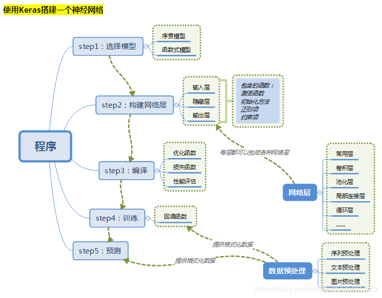