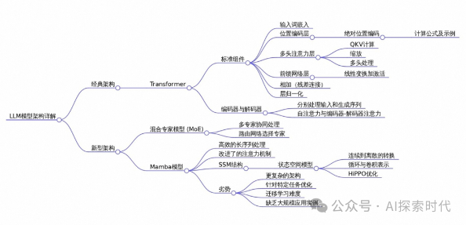
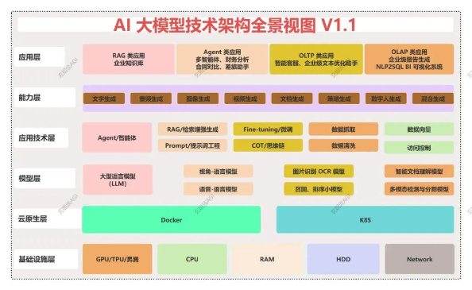

# 4.大模型

## 1.概述

大模型（Large Model）指的是拥有数十亿甚至更多参数的深度学习模型，这类模型在自然语言处理、图像识别、语音识别等领域展现出强大的能力。
它们通常通过大规模数据集进行训练，能够执行复杂的任务，如文本生成、机器翻译、智能问答等。

### 1.1.主流大模型

国外
1. OpenAI  GPT-5：支持多模态输入，拥有数万亿参数，强化了隐私与安全性，可应用于内容创作、智能客服、代码生成、数据分析等场景。
2. Meta    LLaMA 3：有更高效的训练机制，引入自适应推理能力，有完善的开源社区支持，可用于教育、医疗、社交媒体分析、语言翻译等领域。
3. Google  Gemini：深度融合了Transformer与新型神经网络架构，有强大的知识检索能力，支持多人协作模式，适用于智能搜索、知识图谱构建、企业智能助理等场景。
4. Anthropic Claude 3：更注重安全性和伦理性，加强了可解释性，模型轻量化，适用于个人助理、风险评估、合规审查等场景。
5. Mistral 7B：参数较小但性能强大，优化了推理速度和计算效率，适合在资源受限的环境中使用，且开源，允许广泛的研究和商业应用。
6. X.AI    Grok-2：具备一定的语言理解和处理能力，在相关测试中也有一定表现，可用于多种自然语言处理任务。

国内
1. 文心一言：由百度公司开发，具有强大的自然语言处理能力，数据来源广泛，能够理解并回答各种领域的问题，还可以进行文本生成、情感分析等多种功能。
2. 腾讯混元：全链路自研的通用大语言模型，具备强大的中文创作能力、复杂语境下的逻辑推理能力以及可靠的任务执行能力，采用混合专家模型结构，已扩展至万亿参数规模。
3. 通义千问：阿里云开发的专注于自然语言理解与生成的大模型，提供智能问答、文本摘要等服务，拥有强大的语义理解能力，能够准确捕捉用户意图并给出精准回答。
4. 讯飞星火：科大讯飞开发的大模型，其优势在于强大的语音识别和语音合成能力，能够实现智能问答、情感分析等功能，并且在教育、金融、医疗等领域有广泛的应用。
5. 智谱清言：由清华大学开发，采用先进的深度学习技术，可处理各种语言问题，具有高效的数据处理能力，能提供高质量的语言处理结果，适应不同的领域和应用场景。
6. 360智脑：在语言理解、知识问答、文本生成等方面有一定的表现，不断进行技术优化和升级，为用户提供智能交互等服务。
7. 豆包：基于字节跳动自研的豆包大模型（原名 “云雀”）开发的 AI 工具

### 1.2.架构

从本质上来说，所谓的神经网络就是一个模拟人类大脑的数学模型；而为了解决不同的问题，技术专家们也设计了多种不同的神经网络模型，
比如RNN，CNN以及Transformer等模型，以及基于这些模型的变种。

不同的神经网络模型擅长解决不同领域的具体问题；比如CNN——卷积神经网络就比较适合处理图像任务；Transformer擅长处理自然语言问题。

而Transformer 架构是当前大模型的主流架构，它是基于人工神经网络（ANN）发展而来的技术架构，ANN 的一种创新架构。

受限于目前的技术，在处理具体任务时，不同的网络架构也可以嵌套使用。所以，大模型的核心是层次堆叠；因此，为了实现这种效果就有了多种神经网络的大模型架构。

[大模型常用架构以及技术难点](https://mp.weixin.qq.com/s/z_00RltivZy0SWNWqSlw2Q)
1. Transformer‍：Transformer是目前大模型的主流架构，由Vaswani等人于2017年提出。它使用了注意力机制替代了传统的RNN和LSTM，能够更好的捕捉长距离依赖关系。
2. BERT。是一种双向Transformer架构，擅长处理自然语言理解认为。它通过遮盖语言模型，和下一句预测进行训练。
3. GPT。是一种基于Transformer的自回归模型，专注于文本生成任务，与BERT不同，GPT是单向的，即只使用过去的上下文来预测当前的单词。
4. T5。是一种统一的文本到文本的模型架构，可以将所有任务都转换为文本生成任务；例如翻译任务中的输入是原文，输出是译文；文本分类任务中的输入是句子，输出是类别标签。
5. DistilBERT。是BERT的精简版，通过蒸馏技术减小模型规模，同时保留了大部分性能

不同架构的优缺点对比
- BERT vs. GPT：
  - BERT 适合理解任务，如文本分类、问答系统；GPT 适合生成任务，如文本生成、对话系统。
  - BERT 的双向编码使其在理解上下文时更强，而 GPT 在生成流畅自然的文本时更有优势。
- Transformer vs. RNN/LSTM：Transformer 可以并行处理，提高了训练效率，且更好地捕捉长距离依赖，但在处理超长序列时计算复杂度较高。
  RNN/LSTM 则天然适合处理序列数据，但容易出现梯度消失问题。
- T5 vs. BERT/GPT：T5 的统一框架使其在多任务学习中表现出色，但在专门的理解或生成任务中，可能不如专门设计的 BERT 或 GPT。

以下为大型整体架构，可以看出LLM只占据其中一部分

1. Agent（智能体）技术。利用大模型的推理能力对任务进行规划拆解，并使用外部的工具完成一件复杂的任务。 
2. RAG（检索增强生成）技术。它利用检索到的相关信息来增强生成模型的效能，确保所生成内容的准确性与相关性。
3. 大模型微调（Fine-tuning）通过对模型进行细致调整，使模型在相关任务上的性能可以得到显著提升，实现更精准和高效的处理。
4. 提示词工程（Prompt Engineering）。专注于设计高效的提示语，以优化模型的输出结果。通过精心设计的提示词，可以引导模型生成更加符合预期的内容，从而提升生成文本的质量。
5. 思维链（Chain-of-Thought）技术。模拟人类的思考过程，以增强模型的决策和推理能力。通过逐步推理和决策，该技术使得模型能够更有效地处理复杂问题，并做出更加合理的判断。
6. 数据工程技术。涵盖了数据抓取、清洗、构建向量库、实施访问控制等数据处理的全流程，这些环节确保了数据的质量和安全。
   这些基础步骤对于模型的训练和推理至关重要，它们有助于增强模型的性能和信赖度。

### 1.3.神经网络的实现流程

从技术的实现角度来说，目前市面上有两大技术框架；一个是谷歌公司开发的Tensorflow框架，以及Meta公司开发的PyTorch框架。

1. 明确任务目标。即你想设计一个具备什么功能的神经网络模型
2. 构建模型。即使用什么架构，以及具体的神经网络结构，就是神经网络的具体实现
3. 数据准备。收集任务目标所需要的训练数据集和测试数据集等模型训练
4. 验证与测试使用等

神经网络的实现非常复杂，不但要设计神经网络的输入输出，还要设计神经网络有哪些层，每层的功能实现是什么样的；
并且，由于神经网络主要以向量格式为主，因此还需要对训练数据进行处理，比如构建词汇表，分词，向量化等操作。

而一个神经网络的好坏，一是看神经网络模型的设计；二就是训练数据的质量；因此，要想训练一个神经网络就需要收集大量的高质量的训练数据。
而数据收集到之后还不能直接使用，还需要经过清洗，格式化等操作。

## DeepSeek

国产开源大模型。

- [DeepSeek使用教程【使用chat的教程】](https://mp.weixin.qq.com/s/1Nx1eJ_ay44cYI5C5li_YA)
- [DeepSeek接入WPS](https://mp.weixin.qq.com/s/im2DK4zKggqeAnwRDlRLUA)
- [DeepSeek本地化部署【入门】](https://mp.weixin.qq.com/s/D7LFDHepv6W0ECBbJc2zkQ)
- [Deepseek本地部署详细指南【详细】](https://mp.weixin.qq.com/s/SPEvYTmTBxhoEkJqm1yPmw)
- [DeepSeek本地部署+投喂数据训练AI教程](https://mp.weixin.qq.com/s/kbwmCmyr-oWQOx-FTxzbKw)

## 工具

1. Ollama。帮助用户本地运行大模型的工具。官网[https://ollama.com/](https://ollama.com/)，可以像管理docker镜像一样管理部署本地大模型。
2. chatbox。可以对接主流的chat类大模型，桌面客户端工具。官网[https://chatboxai.app](https://chatboxai.app)
3. AnythingLLM。与chatbox一样。
4. Page Assist。浏览器插件，本地 AI 模型的 Web UI。

