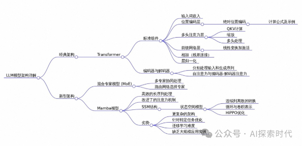
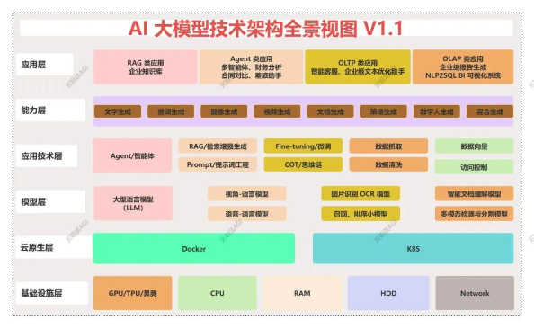
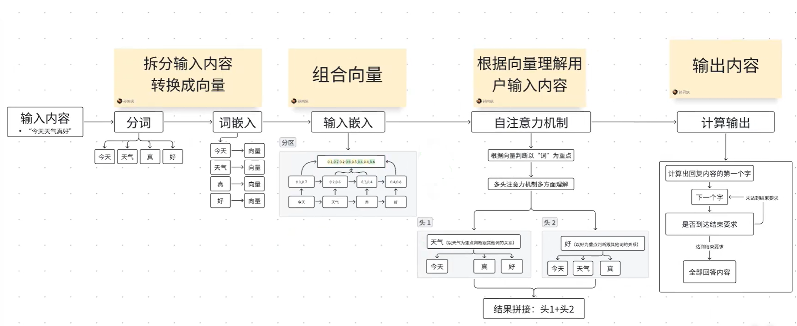
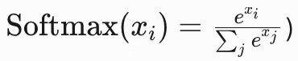
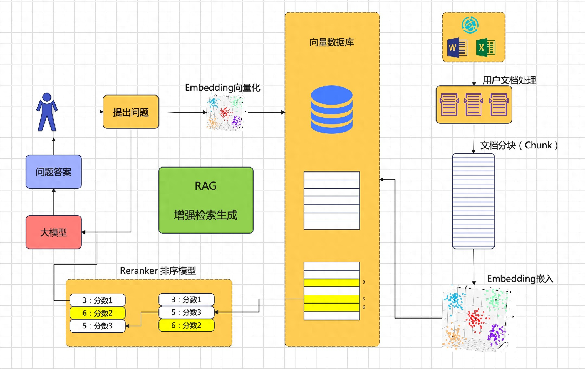
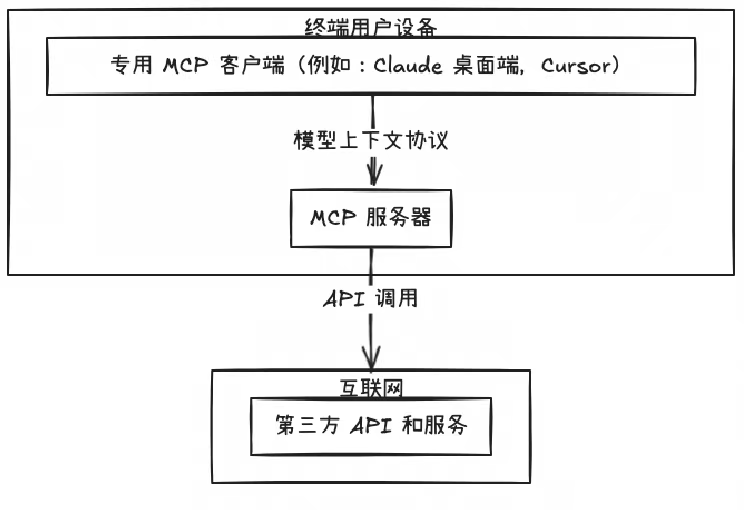

# 4.大模型

1. 免费大模型使用：[https://platform.aitools.cfd/](https://platform.aitools.cfd/)
免费使用各种大模型，不用注册不用填写信息。适合开发使用。
2. AI社区。魔搭：[https://www.modelscope.cn/home](https://www.modelscope.cn/home)

## 概述

大模型（Large Model）指的是拥有数十亿甚至更多参数的深度学习模型，这类模型在自然语言处理、图像识别、语音识别等领域展现出强大的能力。
它们通常通过大规模数据集进行训练，能够执行复杂的任务，如文本生成、机器翻译、智能问答等。

### 1.1.主流大模型

国外
1. OpenAI  GPT-5：支持多模态输入，拥有数万亿参数，强化了隐私与安全性，可应用于内容创作、智能客服、代码生成、数据分析等场景。
2. Meta    LLaMA 3：有更高效的训练机制，引入自适应推理能力，有完善的开源社区支持，可用于教育、医疗、社交媒体分析、语言翻译等领域。
3. Google  Gemini：深度融合了Transformer与新型神经网络架构，有强大的知识检索能力，支持多人协作模式，适用于智能搜索、知识图谱构建、企业智能助理等场景。
4. Anthropic Claude 3：更注重安全性和伦理性，加强了可解释性，模型轻量化，适用于个人助理、风险评估、合规审查等场景。
5. Mistral 7B：参数较小但性能强大，优化了推理速度和计算效率，适合在资源受限的环境中使用，且开源，允许广泛的研究和商业应用。
6. X.AI    Grok-2：具备一定的语言理解和处理能力，在相关测试中也有一定表现，可用于多种自然语言处理任务。

国内
1. 文心一言：由百度公司开发，具有强大的自然语言处理能力，数据来源广泛，能够理解并回答各种领域的问题，还可以进行文本生成、情感分析等多种功能。
2. 腾讯混元：全链路自研的通用大模型，具备强大的中文创作能力、复杂语境下的逻辑推理能力以及可靠的任务执行能力，采用混合专家模型结构，已扩展至万亿参数规模。
3. 通义千问：阿里云开发的专注于自然语言理解与生成的大模型，提供智能问答、文本摘要等服务，拥有强大的语义理解能力，能够准确捕捉用户意图并给出精准回答。
4. 讯飞星火：科大讯飞开发的大模型，其优势在于强大的语音识别和语音合成能力，能够实现智能问答、情感分析等功能，并且在教育、金融、医疗等领域有广泛的应用。
5. 智谱清言：由清华大学开发，采用先进的深度学习技术，可处理各种语言问题，具有高效的数据处理能力，能提供高质量的语言处理结果，适应不同的领域和应用场景。
6. 360智脑：在语言理解、知识问答、文本生成等方面有一定的表现，不断进行技术优化和升级，为用户提供智能交互等服务。
7. 豆包：基于字节跳动自研的豆包大模型（原名 "云雀"）开发的 AI 工具

### 1.2.架构

从本质上来说，所谓的神经网络就是一个模拟人类大脑的数学模型；而为了解决不同的问题，技术专家们也设计了多种不同的神经网络模型，
比如RNN，CNN以及Transformer等模型，以及基于这些模型的变种。

不同的神经网络模型擅长解决不同领域的具体问题；比如CNN——卷积神经网络就比较适合处理图像任务；Transformer擅长处理自然语言问题。

而Transformer 架构是当前大模型的主流架构，它是基于人工神经网络（ANN）发展而来的技术架构，ANN 的一种创新架构。

受限于目前的技术，在处理具体任务时，不同的网络架构也可以嵌套使用。所以，大模型的核心是层次堆叠；因此，为了实现这种效果就有了多种神经网络的大模型架构。



[大模型常用架构以及技术难点](https://mp.weixin.qq.com/s/z_00RltivZy0SWNWqSlw2Q)

1. Transformer‍：Transformer是目前大模型的主流架构，由Vaswani等人于2017年提出。它使用了注意力机制替代了传统的RNN和LSTM，能够更好的捕捉长距离依赖关系。
2. BERT。是一种双向Transformer架构，擅长处理自然语言理解认为。它通过遮盖语言模型，和下一句预测进行训练。
3. GPT。是一种基于Transformer的自回归模型，专注于文本生成任务，与BERT不同，GPT是单向的，即只使用过去的上下文来预测当前的单词。
4. T5。是一种统一的文本到文本的模型架构，可以将所有任务都转换为文本生成任务；例如翻译任务中的输入是原文，输出是译文；文本分类任务中的输入是句子，输出是类别标签。
5. DistilBERT。是BERT的精简版，通过蒸馏技术减小模型规模，同时保留了大部分性能

不同架构的优缺点对比

- BERT vs. GPT：
  - BERT 适合理解任务，如文本分类、问答系统；GPT 适合生成任务，如文本生成、对话系统。
  - BERT 的双向编码使其在理解上下文时更强，而 GPT 在生成流畅自然的文本时更有优势。
- Transformer vs. RNN/LSTM：Transformer 可以并行处理，提高了训练效率，且更好地捕捉长距离依赖，但在处理超长序列时计算复杂度较高。
  RNN/LSTM 则天然适合处理序列数据，但容易出现梯度消失问题。
- T5 vs. BERT/GPT：T5 的统一框架使其在多任务学习中表现出色，但在专门的理解或生成任务中，可能不如专门设计的 BERT 或 GPT。

以下为大型整体架构，可以看出LLM只占据其中一部分


1. Agent（智能体）技术。利用大模型的推理能力对任务进行规划拆解，并使用外部的工具完成一件复杂的任务。
2. RAG（检索增强生成）技术。它利用检索到的相关信息来增强生成模型的效能，确保所生成内容的准确性与相关性。
3. 大模型微调（Fine-tuning）通过对模型进行细致调整，使模型在相关任务上的性能可以得到显著提升，实现更精准和高效的处理。
4. 提示词工程（Prompt Engineering）。专注于设计高效的提示语，以优化模型的输出结果。通过精心设计的提示词，可以引导模型生成更加符合预期的内容，从而提升生成文本的质量。
5. 思维链（Chain-of-Thought）技术。模拟人类的思考过程，以增强模型的决策和推理能力。通过逐步推理和决策，该技术使得模型能够更有效地处理复杂问题，并做出更加合理的判断。
6. 数据工程技术。涵盖了数据抓取、清洗、构建向量库、实施访问控制等数据处理的全流程，这些环节确保了数据的质量和安全。
   这些基础步骤对于模型的训练和推理至关重要，它们有助于增强模型的性能和信赖度。

### 1.3.神经网络的实现流程

从技术的实现角度来说，目前市面上有两大技术框架；一个是谷歌公司开发的Tensorflow框架，以及Meta公司开发的PyTorch框架。

1. 明确任务目标。即你想设计一个具备什么功能的神经网络模型
2. 构建模型。即使用什么架构，以及具体的神经网络结构，就是神经网络的具体实现
3. 数据准备。收集任务目标所需要的训练数据集和测试数据集等模型训练
4. 验证与测试使用等

神经网络的实现非常复杂，不但要设计神经网络的输入输出，还要设计神经网络有哪些层，每层的功能实现是什么样的；
并且，由于神经网络主要以向量格式为主，因此还需要对训练数据进行处理，比如构建词汇表，分词，向量化等操作。

而一个神经网络的好坏，一是看神经网络模型的设计；二就是训练数据的质量；因此，要想训练一个神经网络就需要收集大量的高质量的训练数据。
而数据收集到之后还不能直接使用，还需要经过清洗，格式化等操作。

## Transformer

[神经网络算法 —— 一文搞懂Transformer](https://developer.aliyun.com/article/1462200)

### 1.概述
Transformer模型是一种基于自注意力机制的深度学习模型，最初被提出用于自然语言处理任务，尤其是机器翻译。由于其出色的性能和高效的并行计算能力，Transformer已成为许多NLP任务的首选模型。
1. 核心思想：是利用自注意力机制来捕捉序列中的依赖关系。与传统的循环神经网络（RNN）或卷积神经网络（CNN）不同，Transformer可以完全并行地处理输入序列，从而大大提高了计算效率。
2. 模型结构：Transformer由编码器和解码器两部分组成。编码器负责理解输入序列，而解码器则根据编码器的输出来生成目标序列。这种结构特别适合于序列到序列（Seq2Seq）的任务，如机器翻译、文本摘要等。
3. 自注意力机制：自注意力机制允许模型在处理一个词时关注输入序列中的其他词。通过计算词与词之间的相关性，模型可以动态地捕捉序列中的依赖关系，从而更好地理解上下文信息。
4. 多头注意力：Transformer引入了多头注意力的概念，即同时计算多个自注意力头，每个头可以关注序列的不同部分。这增加了模型的表达能力，使其能够同时捕捉多种不同的依赖关系。
5. 位置编码：由于Transformer不依赖于序列的顺序（即不考虑词的位置信息），因此需要显式地引入位置编码来捕捉序列中的位置信息。这通常是通过向输入嵌入添加位置嵌入来实现的。
6. 应用广泛：除了机器翻译外，Transformer还被广泛应用于其他NLP任务，如文本分类、情感分析、问答系统、语音识别等。此外，Transformer的变体（如BERT、GPT等）也在各种语言理解任务中取得了显著成果。

Transformer模型以其强大的表达能力和高效的并行计算能力，在自然语言处理领域取得了巨大的成功。它已经成为现代NLP研究的重要基石之一，并持续推动着该领域的发展。

### 2.模型结构

基本工作流程：


Transformer模型主要由编码器和解码器两部分构成，每一部分都有其特定的结构和功能。以下是Transformer模型结构的详细概述：
1. 输入部分
   - 输入层：原始文本输入首先会经过令牌化（Tokenization）处理，转换为模型可以理解的数字序列。
   - 嵌入层：将每个令牌（Token）转换为固定维度的向量表示，也称为词嵌入（Word Embedding）。
   - 位置编码层：由于Transformer模型不依赖序列顺序，所以需要加入位置编码来保留序列中的位置信息。位置编码与词嵌入相加，作为编码器的输入。
   - 目标文本嵌入层（在解码器中使用）：将目标文本中的词汇数字表示转换为向量表示。
2. 编码器（Encoder）
   - 编码器层：编码器由多个相同的层堆叠而成。每个编码器层包含两个主要子层：一个多头自注意力机制层和一个全连接前馈神经网络层。每个子层之间都采用了残差连接和层规范化。
3. 解码器（Decoder）
   - 解码器层：每个解码器层由三个子层连接结构组成：第一个子层是一个带掩码的多头自注意力子层，第二个子层是一个多头注意力子层（编码器到解码器），第三个子层是一个前馈全连接层。每个子层后都接有一个规范化层和一个残差连接。
   - 掩蔽自注意力：在解码器的自注意力中，使用了掩蔽（Masked）自注意力机制，以确保每个位置只能考虑该位置之前的所有位置。这保留了自回归属性，使得预测仅依赖于已生成的输出词元。
4. 输出部分
   - 线性层：将解码器输出的向量转换为最终的输出维度。
   - Softmax层：将线性层的输出转换为概率分布，以便进行最终的预测。
5. 整体架构
   - 标准的Transformer结构通常包含6个编码器和6个解码器，但也可以根据具体任务进行调整。
   - 编码器的输出会被传递到解码器中，作为编码器-解码器注意力层的键（Key）和值（Value）。
   - 解码器的最终输出会经过一个线性层，转换为与任务相关的预测结果，如在机器翻译任务中，输出为目标语言的翻译文本。

### 3.自注意力机制

自注意力机制是Transformer模型中的关键部分，它通过计算输入序列中元素间的相关性，帮助模型捕捉和理解数据中的依赖关系。

1. 核心思想：
   - 自注意力机制的核心是让模型在处理输入时，能够聚焦于关键的信息区域。它通过计算输入序列中每个元素与其他元素的相关性，来动态调整对每个元素的关注度。
2. 工作原理：
   - 对于输入序列中的每个元素（如文本中的一个词），自注意力机制会计算它与序列中其他所有元素的相关性得分。
   - 这些得分反映了元素之间的依赖关系，高得分意味着两个元素之间有较强的相关性。
   - 随后，利用softmax函数对这些得分进行归一化，得到注意力权重。
   - 最后，使用这些权重对输入序列进行加权求和，为每个元素生成一个新的上下文表示，这个表示融合了与该元素相关的所有其他元素的信息。
3. 优点：
   - 自注意力机制能够捕捉输入序列中的长距离依赖关系，这是传统RNN和CNN模型难以做到的。
   - 它允许模型并行处理输入序列，大大提高了计算效率。
   - 自注意力机制的输出包含了丰富的上下文信息，有助于模型更好地理解输入数据。
4. 实现方式：
   - 在Transformer模型中，自注意力机制通常通过多头注意力（Multi-Head Attention）来实现。这意味着模型会同时计算多个自注意力头，每个头可以关注输入序列的不同部分，从而捕捉更丰富的信息。
   - 此外，为了防止自注意力计算中的梯度消失或爆炸问题，通常会使用缩放点积注意力（Scaled Dot-Product Attention）来计算相关性得分。

以下为案例。 输入被分词后，生成多个token，每个token 由三个向量组成：Q 是查询向量、K 是线索向量、V 是答案向量。
- 输入：小明吃完冰淇淋，结果
- 输出：肚子疼

推理的过程: 
1. 当前 token 的 Q 与所有token的 K 计算权重。 
2. 每个 token 的 V加权相加得到一个 token预测值 
3. 选择 N 个与预测值最接近的 token, 掷骰子选择

第一步： 将输入分词并向量化

| token | Q（查询）        | K（键）         | V（值）        | 语义解释         |
|-------|--------------|--------------|-------------|--------------|
| 小明    | [0.2, 0.3 ]  | [0.5, -0.1 ] | [0.1, 0.4]  | 人物主体         |
| 吃完    | [-0.4, 0.6 ] | [0.3, 0.8 ]  | [-0.2, 0.5] | 动作（吃完）       |
| 冰淇淋   | [0.7, -0.5 ] | [-0.6, 0.9 ] | [0.9, -0.3] | 食物（冷饮，可能致腹泻） |
| 结果    | [0.8, 0.2 ]  | [0.2, -0.7 ] | [0.4, 0.1]  | 结果（需关联原因）    |

第二步：接着开始推理（实际中采用多头注意力，会选择多个Q计算权重，这里只是模拟其中一种情况）
1. 使用最后一个 token 的 Q（“结果”的 Q 向量）Q_current = [0.8, 0.2]
2. 计算 Q_current 与所有 K 的点积（相似度）点积公式：Q·K = q₁*k₁ + q₂*k₂

| token | K向量         | 点积计算                                  | 结果    |
|-------|-------------|---------------------------------------|-------|
| 小明    | [0.5, -0.1] | 0.8 * 0.5 + 0.2*(-0.1) = 0.4 - 0.02   | 0.38  |
| 吃完    | [0.3, 0.8]  | 0.8 * 0.3 + 0.2 * 0.8 = 0.24 + 0.16   | 0.40  |
| 冰淇淋   | [-0.6, 0.9] | 0.8*(-0.6) + 0.2 * 0.9 = -0.48 + 0.18 | -0.30 |
| 结果    | [0.2, -0.7] | 0.8 * 0.2 + 0.2*(-0.7) = 0.16 - 0.14  | 0.02  |

第三步：Softmax 归一化得到注意力权重（将点积结果输入 Softmax 函数）



| token | 点积   | 指数值（e^x）       | 权重                |
|-------|------|----------------|-------------------|
| 小明    | 0.38 | e^0.38 ≈ 1.46  | 1.46 / 2.74 ≈0.53 |
| 吃完    | 0.4  | e^0.40 ≈ 1.49  | 1.49 / 2.74 ≈0.54 |
| 冰淇淋   | -0.3 | e^-0.30 ≈ 0.74 | 0.74 / 2.74 ≈0.27 |
| 结果    | 0.02 | e^0.02 ≈ 1.02  | 1.02 / 2.74 ≈0.37 |

第四步：加权求和 V 向量生成上下文向量，将权重与对应 V 向量相乘后相加：

| token | 权重   | V向量         | 加权 V 向量                            |
|-------|------|-------------|------------------------------------|
| 小明    | 0.53 | [0.1, 0.4]  | 0.53*[0.1, 0.4] ≈ [0.053, 0.212]   |
| 吃完    | 0.54 | [-0.2, 0.5] | 0.54*[-0.2, 0.5] ≈ [-0.108, 0.27]  |
| 冰淇淋   | 0.27 | [0.9, -0.3] | 0.27*[0.9, -0.3] ≈ [0.243, -0.081] |
| 结果    | 0.37 | [0.4, 0.1]  | 0.37*[0.4, 0.1] ≈ [0.148, 0.037]   |

第五步：最终上下文向量：[0.053−0.108+0.243+0.148,0.212+0.27−0.081+0.037]=[0.336,0.438]

第六步：每个 token 的 V加权相加得到一个 token预测值

| 候选词 | 嵌入向量        | 相似度（点积）                                            | 概率           |
|-----|-------------|----------------------------------------------------|--------------|
| 肚子疼 | [0.3, 0.5]  | 0.336 * 0.3 + 0.438 * 0.5 ≈ 0.101 + 0.219 =0.320   | 最大概率（例如 65%） |
| 头疼  | [0.2, 0.1]  | 0.336 * 0.2 + 0.438 * 0.1 ≈ 0.067 + 0.044 =0.111   | 次之（例如 20%）   |
| 开心  | [-0.5, 0.8] | 0.336*(-0.5) + 0.438 * 0.8 ≈ -0.168 + 0.350 =0.182 | 较低（例如 15%）   |

第七步：掷骰子选择。大模型会在概率最大的几个token中随机挑选一个作为最终输出。
预测的下一个token是不确定的, 是因为有一个掷骰子的操作，最终模型大概率选择最高概率的 “肚子疼” 作为下一个 token。 

## DeepSeek

国产开源大模型。

R1 为深度思索模型。V2 为快速响应模型。

- [DeepSeek使用教程【使用chat的教程】](https://mp.weixin.qq.com/s/1Nx1eJ_ay44cYI5C5li_YA)
- [DeepSeek接入WPS](https://mp.weixin.qq.com/s/im2DK4zKggqeAnwRDlRLUA)
- [DeepSeek本地化部署【入门】](https://mp.weixin.qq.com/s/D7LFDHepv6W0ECBbJc2zkQ)
- [Deepseek本地部署详细指南【详细】](https://mp.weixin.qq.com/s/SPEvYTmTBxhoEkJqm1yPmw)
- [DeepSeek本地部署+投喂数据训练AI教程【环境变量】](https://mp.weixin.qq.com/s/kbwmCmyr-oWQOx-FTxzbKw)
- [DeepSeek R1本地训练全流程实操指南](https://mp.weixin.qq.com/s/PfR3QhVC3xrQC0I8xH7R8A)

## 工具

### 1.常见工具

- 模型管理工具。统一管理各种模型，并对外暴露与OpenAI兼容的API。推荐Ollama，更适合本地化部署大模型。

1. Ollama。帮助用户本地运行大模型的工具。官网[https://ollama.com/](https://ollama.com/)，可以像管理docker镜像一样管理部署本地大模型。
2. Xinference。开源的模型管理工具，支持多种大模型的部署和调用。官网[https://xorbits.cn/](https://xorbits.cn/)
3. LM Studio。提供可视化界面的管理工具。 https://lmstudio.ai/

- 客户端工具。

1. chatbox。可以对接主流的chat类大模型，桌面客户端工具。官网[https://chatboxai.app](https://chatboxai.app)
2. AnythingLLM。与chatbox一样。
3. Page Assist。浏览器插件，本地 AI 模型的 Web UI。
4. OpenWebUI。chat工具。
5. AingDesk。开源的桌面AI助手，支持多种大模型。与chatbox类似。官网：[https://www.aingdesk.com](https://www.aingdesk.com)

- 高级工具【支持语言、向量、重排序、图片、视频、语言等多模态模型编排】

1. MaxKB。基于本地大模型构建的知识库，支持多种数据源和格式，可以快速搭建自己的知识问答系统。
2. Dify。开源的模型编排工具，支持多种大模型的集成和调用。官网[https://dify.ai/](https://dify.ai/)

### 2.ollama

Ollama是一个广泛使用的开源应用程序，可以在本地部署和操作大型语言模型，现在已成为最流行的的个人电脑跑大模型的方案。
其提供了丰富的参数，帮助我们构建自己的模型。

ollama基础命令

```shell
1. 下载并运行模型
ollama run deepseek-r1:1.5b
ollama run deepseek-r1:7b
ollama run deepseek-r1:8b
ollama run deepseek-r1:14b

2. 查询本地所有模型
ollama list 

Available Commands:
  serve       Start ollama
  create      Create a model from a Modelfile
  show        Show information for a model
  run         Run a model
  stop        Stop a running model
  pull        Pull a model from a registry
  push        Push a model to a registry
  list        List models
  ps          List running models
  cp          Copy a model
  rm          Remove a model
```

### 3.OpenWebUI

OpenWebUI是一个开源的、基于web的用户界面，用于与大型语言模型（LLM）进行交互。它提供了一个直观的图形用户界面，使得用户可以轻松地输入文本并获取模型的响应。

包含大模型聊天，上传图片，RAG等多种功能且方便与ollama集成。

### 4.ComfyUI

除了文生文大模型，文生图模型也是非常热点的领域。ComfyUI是现在最流行的diffusion模型应用，因其丰富的插件生态和高度定制化节点闻名，常用于文生图、文生视频等领域。

[ComfyUI：搭积木一样构建专属于自己的AIGC工作流（保姆级教程）](https://mp.weixin.qq.com/s/sr4Cpd6UAyCf75Jm2D8YTQ)

### 5.Triton

Triton是NVIDIA开发的一个高性能推理服务器框架，旨在为各种深度学习模型提供高效的部署和管理能力。

### 6.xinference

适合企业使用，但是坑比较多，各种模型的依赖需要自行下载。

```shell
设置xinference的虚拟环境
	python3 -m venv /data/pythonVenv/xinference

激活环境
	source /data/pythonVenv/xinference/bin/activate

安装 Xinference
	pip install xinference

安装 llamacpp:
	CPU 版本：			pip install llama-cpp-python
	CUDA 版本：		CMAKE_ARGS="-DLLAMA_CUBLAS=on" pip install llama-cpp-python
	Apple M芯片：	CMAKE_ARGS="-DLLAMA_METAL=on" pip install llama-cpp-python

启动服务在虚拟环境中执行
	普通启动
	xinference
	设置模型下载地址、允许远程访问 、端口
	XINFERENCE_MODEL_SRC=modelscope  xinference-local --host 0.0.0.0 --port 9997  \
	  > /data/llm/xinference/log.log 2>&1 &

查看服务
	ps -ef | grep xinference
	tail -200f /data/llm/xinference/log.log

退出虚拟环境
	deactivate

依赖库
   pip install protobuf
   pip install tiktoken
```

### 7.API网关

阿里巴巴的Higress，支持无缝切换各种大模型。相比于其他API网关，支持token级别的限流。

[大模型无缝切换，QwQ-32B和DeepSeek-R1 全都要](https://mp.weixin.qq.com/s/Njs1gPVIEh7F8Bh5jsjrOQ)

## 大模型应用

- [国内可用的8款AI视频工具](https://zhuanlan.zhihu.com/p/695426124)
- [别让老板知道！DeepSeek还能这样用在运维场景](https://mp.weixin.qq.com/s/OrQDpwu5PsVwlOXG9m4q6g)
- [万字长文讲透 RAG在实际落地场景中的优化](https://mp.weixin.qq.com/s/OybfApfw95KSfzuUvPd28A)
- [不需要AI和数学知识背景，这篇文章带你学会大模型应用开发](https://mp.weixin.qq.com/s/kcGfK7ANUB2tbERjXAvbLw)

模型开发的方向有很多，由简到难如下
1. 提示词 Prompt：采用更具贴合大模型的提问方式
2. 增强检索  RAG：构建向量支持库，是一种结合了传统搜索引擎和现代语言模型的技术方法。
3. 智能体  AI Agent:技术是一种让大模型能够执行复杂任务的技术，通过将一个大模型拆解为多个小模块，每个模块负责一个特定的子任务。
4. 微调  Fine tuning:提高数据质量
5. 监督微调:人工标注后提升数据质量
6. 增量预训练：训练特定领域模型。
7. 预训练：放大的泛数据，用于通用模型训练。

### 1.RAG

RAG（Retrieval Augmented Generation）是一种结合了传统搜索引擎和现代语言模型的技术方法。用于构建公司内部知识库。

在传统的搜索引擎中，用户输入一个查询词后，系统会从大量的文档或网页中检索出与该查询词最相关的内容，然后将这些内容展示给用户。
而在 RAG 方法中，首先使用传统的搜索引擎技术来查找与用户问题相关的大量文本数据，然后利用大型语言模型对这些数据进行理解和生成回答。
这种方法的好处在于可以充分利用大型语言模型的强大能力来处理和理解复杂的自然语言问题，同时又能通过搜索引擎快速定位到相关信息源。

作用：解决LLM的"幻觉"问题、知识更新滞后及私域数据利用难题

对于大部分公司而言，RAG是有必要搭建的。[尊敬的 IT 部门，请停止尝试构建自己的 RAG](https://mp.weixin.qq.com/s/ICXd4SqjfcN40-cJkfFk4Q)

主要技术：向量模式(Embedding model)、重排序模型(reranker)、向量数据库、LLM。

流程图：


核心流程：
1. 数据生成：私域数据->Embedding model->向量化数据->向量数据库。
2. 数据查询：用户问题->Embedding model->问题向量化->查询向量数据库->结果重排序(reranker)
   ->生成大模型提示词prompt->大模型处理LLM->回答问题。

难度:
- 文档与知识库预处理复杂度（试试从SharePoint、Google Drive和网站抓取数据）
- 文档格式与PDF乱码（或导入epub文件试试）
- 生产环境准确率暴跌（测试完美，实际用户一用就崩！）
- 幻觉！
- 响应质量保障
- 现有系统集成
- 变更数据捕获（比如网站内容更新后，RAG如何同步？）
- 合规与审计要求
- 安全漏洞与数据泄露（内部系统能达到SOC-2 Type 2认证吗？）

生成，调整RAG的温度。作用：不改变事实，只改变说话和表达方式。
- 低温（如0.2）：作家变成严谨的学霸。
- 高温（如1.2）：作家变成灵感爆棚的浪漫主义诗人。

### 2.Agent

- [大模型必知的5种agent模式](https://mp.weixin.qq.com/s/yb38QQzdxdKHXd5ohh652A)
- [AI Agent（智能体）产业链全解](https://mp.weixin.qq.com/s/4iPY9tHwAMUxQ62toIFwAw)

完成一系列复杂任务，涉及到LLM之外的异构系统。

Agent的模式
1. Reflection pattern  反思模式：大模型回答问题后，将问题和答案重新提交给大模型，让他反思下答案，用于提高问题的准确性。
2. Tool use pattern 工具使用模式：大模型收到请求后判断需要调用外部工具，调用工具后，将结果处理后返回客户端。
3. ReAct Pattern      ReAct模式：结合推理大模型和生成大模型，推理大模型负责分析请求并生成对应的策略或计划，调用工具后，生成大模型负责解释结果和生成结果。
4. Planning Pattern     规划模式：请求先经过计划器（推理模型），完成问题分析和任务拆分，再将子任务分给给ReAct Agent。计划器监督子任务完成进度，并将结果返回给客户端。
5. Multi-agent pattern 多智能体模式：这种模式通过多个代理协同工作，可以更高效地处理复杂任务，确保任务的有序执行和结果的及时反馈。

适用场景，这些模式并未单独使用，而是提供了一种使用的方式。
- 反思模式 和 工具模式 属于 Agent的基础。
- ReAct Pattern是对前者的简单应用，具备简单的代理能力。
- 规划模式是ReAct的扩展，具备了完成一定复杂工作的基础能力。
- 多智能体模式。是实现一系列负责工作，多个规划模型相关协调完成工作。

其中多智能体模式中典型的代表是Manus。将Multi-agen比作一个开发部门，其中多个Planning分别担任经理、产品、开发、测试、运维等角色。
经理分析需求后，拆分任务、分配任务给各个Planning，完成需求后，再由经理提交结果给客户端。

### 3.教程

- [DeepSeek R1打造私有化AI助手:从本地模型部署到UI界面集成指南](https://www.toutiao.com/article/7465172091680178729/)
- [DeepSeek R1打造本地RAG知识库的AI助手：Dify深度讲解](https://www.toutiao.com/article/7466019738850820620/)
- [Deepseek R1打造本地化RAG知识库:安装部署使用详细教程](https://www.toutiao.com/article/7465606532487496218/)
- [DeepSeek R1打造本地RAG知识库的AI助手：Dify深度讲解](https://www.toutiao.com/article/7466019738850820620/)
- [DeepSeek R1打造本地RAG知识库(三)：向量(Embed)模型怎么选](https://www.toutiao.com/article/7466611406461305359/)
- [DeepSeek打造本地RAG知识库(四)：Xinference本地模型加载](https://www.toutiao.com/article/7467365230134215220/)
- [DeepSeek打造本地RAG知识库(五):FastGPT + Xinference超详细教程](https://www.toutiao.com/article/7468101908247478799/)
- [DeepSeek打造本地RAG知识库(六):FastGPT + Xinference肿瘤医生](https://www.toutiao.com/article/7468646420583121460/)
- [DeepSeek打造本地RAG知识库(七):网友问题答疑及知识分享](https://www.toutiao.com/article/7469251500506661387/)
- [DeepSeek打造本地RAG知识库(八):AnythingLLM+Xinference的搭建和分享方法](https://www.toutiao.com/article/7470539741553885711/)
- [打造本地RAG知识库(九):肿瘤医生搭建和分享Dify+Xinference](https://www.toutiao.com/article/7471512262130369058/)
- [Kimi Api打造本地RAG知识库(11):肿瘤医生Dify + Kimi + Xinference](https://www.toutiao.com/article/7472395326620582454/)
- [DeepSeek R1打造本地RAG知识库(12):Dify镜像拉取失败及离线安装](https://www.toutiao.com/article/7474046400292995638/)
- [DeepSeekR1本地RAG知识库(13):Embedding模型讲解(小白也能懂)](https://www.toutiao.com/article/7474440695978197538/)
- [DeepSeekR1本地RAG知识库(14):Reranker模型讲解(小白也能懂)](https://www.toutiao.com/article/7475737908507427347/)
- [DeepSeek本地RAG知识库(15):RAG十大误区和提高准确率(小白能懂)](https://www.toutiao.com/article/7477032336559882764/)
- [DeepSeek本地RAG知识库(16):RAG温度设置分析和讲解(小白能懂)](https://www.toutiao.com/article/7477573110078915113/)
- [DeepSeek本地RAG知识库(17):向量数据库原理讲解(小白也能懂)](https://www.toutiao.com/article/7478684442739999244/)
- [DeepSeek本地RAG知识库(18):数据结构化清洗详细讲解(小白也能懂)](https://www.toutiao.com/article/7479593828375331391/)
- [DeepSeek本地RAG知识库(19):数据结构化2讲解及python工具制作](https://www.toutiao.com/article/7480327060620902931/)
- [DeepSeek本地RAG知识库(20):数据结构化3工作流自动清洗规章制度](https://www.toutiao.com/article/7481657587423920659/)
- [DeepSeek本地RAG知识库(21):数据结构化4法律法规结构化+知识图谱](https://www.toutiao.com/article/7482565818854687271)
- [DeepSeek本地RAG知识库(22):数据结构化5 知识图谱制作和使用](https://www.toutiao.com/article/7484042789718589991/)
- [DeepSeek本地RAG知识库(23):数据结构化6 知识图谱集成到Dify教程](https://www.toutiao.com/article/7485003883257856524/)
- [DeepSeek本地RAG知识库(24):RAG六大挑战巧遇知识图谱混合检索](https://www.toutiao.com/article/7486116143229420051/)
- [DeepSeek本地RAG知识库(25):RAG多轮记忆能力 问答追踪/意图/重构](https://www.toutiao.com/article/7487423840272892431/)
- [DeepSeek本地RAG知识库(28):数据分段策略/标准/父子/问答](https://www.toutiao.com/article/7491695243973296690/)
- [DeepSeek本地RAG知识库(29):MCP讲解和菜谱数据库增强实例](https://www.toutiao.com/article/7494044480333513250/)
- []()
- []()
- []()

## 大模型开发

### 1. LangGraph
- 定位：基于知识图谱的大模型应用框架，结合语言模型（LLM）与知识图谱（KG）的优势。
- 核心功能：
   - 支持多模态数据（文本、图像、结构化数据）的融合处理。
   - 通过知识图谱增强模型的逻辑推理和事实准确性。
   - 提供可视化图谱构建与查询工具。
- 适用场景：
   - 垂直领域问答（如金融、医疗）：需要精确事实支持的场景。
   - 复杂逻辑推理：如法律条款解析、科学研究辅助。
   - 多源数据整合：整合分散的结构化/非结构化数据。

### 2. LangChain
- 定位：模块化的LLM应用开发框架，支持链式调用和自定义流程。
- 核心功能：
   - 连接不同LLM（如GPT、Claude、开源模型）。
   - 提供工具集成（API调用、数据库查询等）。
   - 支持内存管理（对话历史、上下文保存）。
- 适用场景：
   - 智能客服/聊天机器人：支持多轮对话与外部工具调用。
   - 数据分析管道：结合LLM与数据库查询的自动化分析。
   - 工作流自动化：如生成报告、代码解释等重复性任务。

### 3. LlamaIndex
- 定位：专注于文档处理的开源框架，优化Llama等模型的检索与生成能力。
- 核心功能：
   - 文档分割、索引构建与检索增强生成（RAG）。
   - 支持向量数据库（如Pinecone、Milvus）。
   - 提供自定义查询模板与缓存机制。
- 适用场景：
   - 企业知识库问答：基于内部文档的智能问答。
   - 学术文献分析：快速总结论文、生成研究报告。
   - 法律合同审查：提取关键条款并辅助分析。

### 4. Spring AI
- 定位：基于Spring框架的企业级AI开发工具，整合机器学习与深度学习库。
- 核心功能：
   - 模型训练与部署：支持主流框架（TensorFlow、PyTorch）。
   - 微服务架构：轻松集成AI功能到现有系统。
   - 监控与日志：模型性能跟踪与异常检测。
- 适用场景：
   - 企业级AI应用：如风控模型、推荐系统。
   - 传统系统AI升级：快速将AI能力嵌入遗留系统。
   - 分布式部署：高并发场景下的模型服务化。

### 5.总结对比
| 工具        | 核心优势                  | 典型场景                     |
|-------------|---------------------------|------------------------------|
| LangGraph | 知识图谱增强推理          | 垂直领域问答、复杂逻辑分析   |
| LangChain | 模块化流程与工具集成      | 聊天机器人、数据分析管道     |
| LlamaIndex| 文档处理与RAG优化         | 企业知识库、文献分析         |
| Spring AI | 企业级部署与微服务支持    | 模型训练、传统系统AI升级     |

根据需求选择：
- 需知识图谱 → LangGraph
- 需快速构建LLM应用 → LangChain
- 需文档处理 → LlamaIndex
- 需企业级部署 → Spring AI

## 提示词

- DeepSeek 提示词样例：[https://api-docs.deepseek.com/zh-cn/prompt-library/](https://api-docs.deepseek.com/zh-cn/prompt-library/)
- [DeepSeek 官方提示词完整版](https://mp.weixin.qq.com/s/Llwpw2nnbinZRUvb2QJbng)
- [搞IT的还不会大模型Prompt，是不是要失业了](https://mp.weixin.qq.com/s/pXjt3e27_5Ge2Zu__u2rqg)

提示词（Prompt）是用户输入给大模型的文本指令，用于引导模型生成符合预期的输出。它是连接用户意图与模型能力的桥梁，决定了模型能否准确理解任务目标。
例如，"写一篇关于人工智能未来趋势的文章" 就是一个提示词。并非指某种技术，而是一种对提问内容的优化。

提示词工程则是通过优化输入内容，使模型更高效地响应需求的技术，包括结构化提问、提供示例、限定输出格式等方法。

### 1.基础

1. 基础原则

- 明确具体：避免模糊表述，例如 "写一篇关于环保的文章" 改为 "写一篇 1000 字的环保演讲稿，需包含垃圾分类案例和数据支持"。
- 提供背景：补充任务相关信息，如 "以教育行业为例，分析 AI 对教师工作的影响"。
- 使用关键词：突出核心需求，如 "生成梵高风格的星空图，要求冷色调和动态笔触"。
- 多维度提问：复杂任务可拆解为多个问题，如先 "总结论文核心观点"，再 "分析研究局限性"。

常用提示词结构：

1. RTF框架。RTF(Role-Task-Format)框架是一个非常简单通用的Prompt提示框架，我们和任意大模型对话场景下都可以使用该规范进行改进输出。
   - R-Role(角色)：指定大模型担当固定角色(程序员、数据分析师、讲解员、记者等等)
   - T-Task(任务): 任务，告诉大模型需要为我们做的事情
   - F-Format(格式)：大模型最终结果的返回格式(比如：表格、Markdown、英文等等)
2. ICIO 框架（任务 + 背景 + 输入 + 输出）：
   - 任务：翻译英文邮件
   - 背景：邮件内容涉及技术合作细节
   - 输入：（粘贴邮件原文）
   - 输出：中文商务邮件格式
3. CRISPE 框架（角色 + 背景 + 任务 + 风格 + 示例）：
   - 角色：英语老师
   - 背景：教初中生语法
   - 任务：用简单例子解释虚拟语气
   - 风格：口语化，带表情符号
   - 示例：（提供类似问题的回答模板）
4. BROKE 框架（背景 + 角色 + 目标 + 关键结果 + 改进）：
   - 背景：公司需推广新产品
   - 角色：市场营销专家
   - 目标：设计社交媒体推广方案
   - 关键结果：包含3个平台策略、预算分配表
   - 改进：根据用户反馈调整文案风格

进阶技巧

1. 示例引导（少样本提示）：
   - 问题：如何提升学习效率？
   - 示例1：每天制定学习计划，分时段专注任务。
   - 示例2：使用番茄钟法，25分钟学习+5分钟休息。
   - 请根据以上方法，给出3条新建议。
2. 角色扮演： 你现在是一位心理咨询师，用户因工作压力大寻求建议。请用共情语气提供3条可操作的缓解方法。
3. 输出格式限定： 用Markdown表格总结2024年AI大模型的核心技术趋势，包括技术名称、特点、应用场景。

### 2.数据结构

```json
{
  "messages": [
    {
      "content": "You are a helpful assistant",
      "role": "system"
    },
    {
      "content": "Hi",
      "role": "user"
    }
  ],
  "temperature": 1,
  "tools": null,
}
```

1. Temperature（温度） 控制生成文本随机性和多样性的关键参数。它通过调整模型输出的概率分布，直接影响生成内容的“保守”或“冒险”程度.
   - 常见设置: 代码生成/数学解题0；数据抽取/分析1；通用对话1.3；翻译1.3；创意类写作/诗歌创作1.5。
2. tools 工具支持。function call的支持，用于大模型与外部工具之间交互。
3. 角色和信息
   - system 系统设定
   - user 用户回复
   - assistant 模型回答
   - tool 是配合function call工作的角色, 可以调用外部工具

## 向量存储

### 1.Embedding模型

[一文说清楚人工智能的嵌入（Embedding）是什么](https://mp.weixin.qq.com/s/Ibh7iYwmI-faHomO5ZXGSw)

Embedding的本质是将离散的、高维的原始数据（如文本、图像、视频、用户行为等）映射为低维稠密的连续向量，
使向量空间中的距离或相似度能够反映原始数据的语义、结构或关联关系。

Embedding模型的作用：将数据向量化，方便向量数据库进行相似度计算。Embedding本身就是神经网络模型的输出数据格式，可以有效地编码信息。

在RAG应用中，向量模型的作用
1. 本地数据向量化。把本地知识库中的文本数据，如文档、资料等，通过 Embedding 模型转化成向量，然后存储到向量数据库中。
2. 用户输入向量化。当用户提出问题时，同样使用 Embedding 模型把问题转化为向量，然后在向量数据库中查找与这个问题向量最相似的本地数据向量。

维度的区别
- 低维：小于100，语义区分能力弱。例如对手机或者水果的苹果，认为是一个。
- 高维：大于100。区分能力强，对于快跑和慢跑能区分出区别。相对的，使用的资源也很多。

常见的嵌入模型

| 特性         | BGE-large-zh-v1.5 | Jina-embeddings-v2 | Nomic-embed-text-v1.5 |
| ------------ | ---------------- | ------------------ | --------------------- |
| 向量维度     | 1024             | 768                | 768                   |
| 最大文本长度 | 512tokens        | 8192tokens         | 2048tokens            |
| 推荐距离方法 | 余弦相似度      | 点积（需归一化）   | 余弦相似度            |
| 训练数据量   | 50亿中文token    | 1.2万亿多语言token | 2亿英文文档           |
| 多语言支持   | 中文优先         | 支持100+语言       | 英语专用              |
| 模型体积     | 1.2GB            | 890MB              | 420MB                 |
| 推理内存需求 | 3GB              | 2.5GB              | 1.8GB                 |
| 温度参数     | 不支持           | 支持动态温度调节   | 固定温度0.8           |
| 领域适配能力 | 法律/金融专用版   | 通用领域           | 科技论文优化          |

向量化原理：Embedding 模型通过神经网络、矩阵分解、图卷积等技术，将离散 / 高维数据映射为低维向量。
1. 静态词嵌入（如 Word2Vec、GloVe）。通过神经网络或矩阵分解，捕捉词语在上下文中的共现关系，使语义相近的词在向量空间中距离相近。
2. 动态上下文嵌入（如 BERT、GPT）考虑词语在不同语境中的语义变化，通过深层神经网络生成动态向量。

向量类型：分为两种，由于他们的数据特点，导致他们对应的搜索算法也有所不同。
1. 稠密向量
   - 数据结构：向量中绝大部分的值不为0，低维向量(384、768、1024等)。
   - 适用场景：适用机器学习模型，语义搜索、跨模态检索、长文本理解，也就是Embedding模型生成语义相关的向量数据。
   - 生成方式：深度学习模型（如 BERT、ResNet）
   - 计算开销：高（需模型推理）
   - Milvus 索引支持：IVF_FLAT, HNSW, DISKANN 等
2. 稀疏向量
   - 数据结构：向量中绝大部分的值为0，只保留数据的关键特征，高维向量（10万+）。
   - 适用场景：适用词袋模型或BM25算法。短文本搜索、精确术语匹配、日志分析
   - 生成方式：词频统计方法（如 TF-IDF、BM25、BGE-M3、SPLADE）
   - 计算开销：低（直接统计计算）
   - Milvus 索引支持：SPARSE_INVERTED_INDEX

稠密向量搜索和稀疏向量搜索并不是非此即彼的关系，在某些场景下可以使用混合搜索的方式，也就是同时使用稠密向量和稀疏向量进行搜索。
1. 长文本、语义理解：纯稠密向量，法律文档语义检索
2. 短文本、精确关键词匹配：纯稀疏向量，商品型号搜索
3. 复杂需求、混合意图：混合搜索，电商搜索（"性价比 5G 手机"）
4. 资源有限、延迟敏感，稀疏向量，日志实时分析

### 2.向量数据库

向量数据库(例如 Milvus)，专为向量数据管理、存储和检索而设计，通过向量间的相似性（如余弦相似度、欧氏距离）实现快速检索和匹配。
并通过整合嵌入(embedding )和重排(reranking)模型，可以轻松地将原始文本转换为可搜索的向量，对结果进行重排，从而获得更准确的结果。
目前很多大数据数据库、传统数据库也正在增加向量的功能支持。

主要功能
1. 向量存储：存储高维向量数据（如 NLP 中的词向量、CV 中的图像特征）。
2. 相似性搜索：通过近似最近邻（ANN）算法（如 LSH、HNSW、IVF）快速找到相似向量。
3. 向量运算：支持点积、距离计算等操作，用于特征匹配和排序。

与传统数据库比较：
1. 向量数据库存储非结构化数据
2. 支持高效相似性搜索，适用于推荐系统、图像检索等场景
3. 底层存储依赖高维索引算法（如 KD 树、ANN）

应用场景
- 推荐系统：用户行为向量与物品向量的匹配（如抖音推荐视频）。
- 语义搜索：根据文本/语音的语义向量检索相关内容（如搜索引擎优化）。
- 图像/视频检索：通过视觉特征向量快速定位相似图片（如电商商品图搜索）。
- AI对话系统：基于上下文向量匹配历史对话或知识库（如ChatGPT的检索增强）。

技术优势
- 高效处理高维数据：传统方法在高维空间中检索效率极低，向量数据库通过优化索引技术解决这一问题。
- 扩展性：支持分布式部署，应对大规模数据量（如百万级向量库）。
- 灵活性：兼容多种向量格式（如PyTorch、TensorFlow生成的向量）。

向量数据库。构建 RAG（检索增强生成）系统时，向量数据库的选择需考虑数据规模、查询性能、集成能力、成本等因素。
1. 优先推荐：Milvus（开源 + 高性能）或 Pinecone（云服务 + 易用性）。【Milvus】重点是国产。
2. 企业级需求：考虑 Weaviate（多模态）或 RedisVector（与 Redis 生态整合）。
3. 研究场景：FAISS 或 DensePhrases。
4. Elasticsearch。从 7.8.0版本‌ 开始支持向量数据存储。spring ai默认使用ES。适合小规模的知识库构建。

[大模型下向量数据对比和选型](https://mp.weixin.qq.com/s/P4Vf_KFJ5_d3Y_FXUdm-9w)

| 维度     | ES                 | Milvus               | Pinecone           |
| -------- | ------------------ | -------------------- | ------------------ |
| 数据规模 | 中小规模（<1亿）   | 大规模（亿级）       | 中大规模（千万级） |
| 查询延迟 | 较高（需硬件优化） | 低（分布式优化）     | 低（云端优化）     |
| 混合检索 | 原生支持           | 需额外集成           | 支持               |
| 部署成本 | 低（复用ES集群）   | 中（需自建或云服务） | 高（云端付费）     |

### 3.Milvus

官网[https://milvus.io/zh](https://milvus.io/zh)
- 可视化界面:[https://github.com/zilliztech/attu](https://github.com/zilliztech/attu)
- [milvus(一) | milvus是什么](https://mp.weixin.qq.com/s/gdowlcSWOHjKcizhuNNtHA)
- [milvus(二) | 单机Standalone安装](https://mp.weixin.qq.com/s/LI3cDZNOU4uB5O4RqFwY9w)
- [milvus(三) | 使用](https://mp.weixin.qq.com/s/3v5R-2iv7eZRPIHfA51Qlw)

#### 3.1.介绍
Milvus 是一个为 GenAI 应用程序构建的开源向量数据库。专为处理大规模向量数据设计，并在性能损失最小的情况下扩展到数十亿个向量。
它主要用于存储、索引和管理由深度神经网络和其他机器学习模型生成的嵌入向量，适用于图像、视频、音频和文本等非结构化数据的特征表示。

Milvus中采用二维的表结构维护数据，核心概念
1. collections。存储向量及其相关元数据，类似传统数据库中的表。
2. schema。相当于collections的数据结构，包括字段、类型等。
3. index。索引，单独对collections设置，跟schema没有关系。

分布式一致性采用 Paxos 算法的变种 来保证元数据的一致性，同时结合 Raft 协议 实现数据分片的分布式共识
1. Root Coord：全局元数据管理，使用 Multi-Paxos 保证元数据变更的一致性。
2. Data Coord：数据分片（Segment）的生命周期管理，基于 Raft 协议 维护分片状态。
3. Query Coord：查询调度与负载均衡，依赖 Raft 协议 同步查询计划。
4. Index Coord：索引构建管理，通过 Raft 协议 协调索引任务。


1. 采用 Multi-Paxos 确保元数据的强一致性。Root Coord 是集群的核心共识组件，负责维护全局元数据（如集合、分区、索引的元信息）。
2. 采用 Raft实现数据副本的一致性。
   - 数据分片管理：Data Node 之间通过 Raft 协议维护 Segment 的多副本一致性。 
   - 查询计划同步：Query Node 基于 Raft 协议同步查询计划，确保查询结果的一致性。
   - 简化选举机制：Raft 通过心跳机制和随机超时时间快速选举领导者，减少脑裂风险。

#### 3.2.使用案例

```python
from pymilvus import MilvusClient, DataType, model

# pip install -U pymilvus
client = MilvusClient(
    uri="http://192.168.3.99:19530",
    token="root:Milvus",
    db_name="default"
)

# Schema 定义了 Collections 的数据结构,不使用自增id
schema = MilvusClient.create_schema(auto_id=False, enable_dynamic_field=True)

# 向Schema添加字段：my_id 主键id， int64，my_vector 向量类型， my_varchar 向量的明文
schema.add_field(field_name="my_id", datatype=DataType.INT64, is_primary=True)
schema.add_field(field_name="my_vector", datatype=DataType.FLOAT_VECTOR, dim=768)  # 向量维度768
schema.add_field(field_name="my_varchar", datatype=DataType.VARCHAR, max_length=512)

# 开始创建索引
index_params = client.prepare_index_params()

# 添加索引: my_id 为 主键索引。 my_vector 设置向量的计算方式为：COSINE 余弦相似度
index_params.add_index(field_name="my_id", index_type="STL_SORT")
index_params.add_index(field_name="my_vector", index_type="AUTOINDEX", metric_type="COSINE")

# 创建collection
if client.has_collection("customized_demo"):
    client.drop_collection(collection_name="customized_demo")

client.create_collection(
    collection_name="customized_demo",
    schema=schema,
    index_params=index_params,
)

client.describe_collection("customized_demo")
res = client.describe_collection("customized_demo")
print("数据结构", res)

# 加载默认Embedding模型：需要安装pip install "pymilvus[model]"
embedding_fn = model.DefaultEmbeddingFunction()

# 定义一个文本的列表
docs = [
    "Artificial intelligence was founded as an academic discipline in 1956.",
    "Alan Turing was the first person to conduct substantial research in AI.",
    "Born in Maida Vale, London, Turing was raised in southern England.",
]

# 把文本编码为Embedding
vectors = embedding_fn.encode_documents(docs)
print("嵌入后的向量维度:", embedding_fn.dim, vectors[0].shape)  # 维度数量: 768 (768,)

# 生成需要插入的数据格式
data = [
    {"my_id": i, "my_vector": vectors[i], "my_varchar": docs[i]}
    for i in range(len(vectors))
]
print("数据 ：", len(data), "条, 所有字段: ", data[0].keys())
print("向量维度:", len(data[0]["my_vector"]))

# 输出：
# 嵌入后的向量维度: 768 (768,)
# 数据 ：3 条, 所有字段:  dict_keys(['id', 'vector', 'text', 'subject'])
# 向量维度: 768

res = client.insert(
    collection_name="customized_demo",
    data=data
)
print("插入数据结果：", res)
# 插入数据结果： {'insert_count': 3, 'ids': [0, 1, 2]}

res = client.get_load_state(
    collection_name="customized_demo",
)
print(res)

# 将查询文本转为embedding 
query_vectors = embedding_fn.encode_queries(["Alan Turing"])
print("查询向量维度:", len(query_vectors[0]))

res = client.search(
    collection_name="customized_demo",  # 目标 collection
    data=query_vectors,  # 查询文本的向量
    limit=2,  # 返回的实体数
    output_fields=["my_id", "my_vector", "my_varchar"],  # 指定返回的字段
)
print("search结果：", res)
'''
search结果：data: [
    "[
        {'id': 2, 'distance': 0.5859944820404053, 'entity': {'id': 2, 'text': 'Born in Maida Vale, London, Turing was raised in southern England.', 'subject': 'history'}}, 
        {'id': 1, 'distance': 0.5118255019187927, 'entity': {'id': 1, 'text': 'Alan Turing was the first person to conduct substantial research in AI.', 'subject': 'history'}}
    ]"
] 
'''
```

#### 3.3.相似度搜索算法-索引类型

##### 3.3.1.索引类型
Milvus 通过索引类型 指定 向量字段的近似近邻搜索算法。通过优化索引的类型，实现索引加速搜索。
通过丰富的算法库支持不同场景下的向量检索需求，从精确匹配到近似匹配，从高召回率到极致压缩。
实际应用中，需根据数据规模、查询性能、内存限制和精度要求选择合适的算法，并通过调优参数进一步平衡性能和召回率。

[https://milvus.io/docs/zh/index-explained.md](https://milvus.io/docs/zh/index-explained.md)

索引类型由三个核心部分组成，即数据结构、量化和精炼器。量化和精炼器是可选的，但由于收益大于成本的显著平衡而被广泛使用。
1. 数据结构：
   1. IVF（倒排文件索引）：也就是粗筛
      - 实现原理：将空间划分为多个单元，以单位的中心点表示这个单元。查询时先找到距离中心点最近的K个单元，然后再向单元内搜索相似向量。也就是预先计算。
      - IVF_FLAT：单元内存储原始向量。 
      - IVF_SQ8：单元内存储向量的 8 位量化表示，节省空间但牺牲部分精度。
      - 适用场景：适合需要快速吞吐量的大规模数据集。
   2. HNSW（基于图）：也就是精筛
      - 实现原理：构建多层图结构，底层包含所有向量，高层是稀疏连接的导航层。查询时从高层开始快速定位到近似区域，再逐层下降到低层进行精细搜索。
      - 适用场景：适用于高维空间和要求低延迟查询的场景。
2. 量化：量化通过更粗略的表示来减少内存占用和计算成本：
   - 标量量化（IVF_SQ8）将每个向量维度压缩为单字节（8 位），与 32 位浮点数相比，内存使用量减少了 75%，同时保持了合理的精度。
   - 乘积量化（IVF_PQ）将向量分割成子向量，并使用基于编码本的聚类进行编码。这可以实现更高的压缩率（例如 4-32 倍），但代价是召回率略有降低，因此适用于内存受限的环境。
3. 精炼器：量化本身就是有损的。为了保持召回率，量化始终会产生比所需数量更多的前 K 个候选结果，这使得精炼器可以使用更高的精度从这些候选结果中进一步选择前 K 个结果，从而提高召回率。

性能权衡：从构建时间、每秒查询次数（QPS）和召回率等三个方面进行评估：
1. 就QPS 而言，基于图形的索引类型通常优于IVF 变体。 
2. IVF 变体尤其适用于topK 较大的情况（例如，超过 2,000 个）。 
3. 与SQ相比，PQ通常能在相似的压缩率下提供更好的召回率，但后者的性能更快。 
4. 将硬盘用于部分索引（如DiskANN）有助于管理大型数据集，但也会带来潜在的 IOPS 瓶颈。

除此之外，还有其他的索引
1. 向量索引：
    - FLAT (强制索引)，全表参与计算进行搜索，只有在collection数据量很低时可以使用。
    - GPU索引：以上的索引都提供了GPU的计算支持。
2. 标量索引：非向量使用，例如STL_SORT、INVERTED（倒排索引）等

##### 3.3.2.适用场景索引推荐

| 索引类型         | 适用场景                                  | 优势                                  | RAG 场景适配建议                          |
|------------------|-------------------------------------------|---------------------------------------|------------------------------------------|
| HNSW         | 高维向量（100-1000 维）、中等数据规模      | 检索速度极快（毫秒级）、精度高        | 适用于实时问答、短文本检索（如对话历史匹配）|
| IVF_FLAT     | 大规模数据（百万级以上）、召回率优先       | 存储效率高、支持动态数据插入          | 适用于文档库检索（如知识库、长文本分段存储）|
| IVF_SQ8      | 超大规模数据、存储成本敏感                | 量化压缩向量（8bit 存储），节省空间    | 适用于冷数据存储或低成本部署              |
| PQ           | 超大规模数据、近似检索可接受              | 乘积量化压缩，极致空间效率            | 非核心场景的兜底方案（慎用，可能影响精度）|

##### 3.3.3.最佳实践

HNSW系列：[https://milvus.io/docs/zh/hnsw.md](https://milvus.io/docs/zh/hnsw.md)
- M（图中每个节点的最大连接数）：包括出边和入边。该参数直接影响索引构建和搜索。
  - 范围：8~200，默认 16
  - 影响：M 越大，图结构越复杂，检索精度越高，但构建速度和内存占用增加。
  - RAG 建议：对话场景取 M=32~64（兼顾速度与精度），文档检索可取 M=64~128（高精度优先）。
- efConstruction（构建时的邻居数）：
  - 范围：100~400，默认 100
  - 影响：控制索引构建质量，值越大索引更准确，但构建时间延长。
  - RAG 建议：与 M 成比例（如 M=64 时 efConstruction=200~300）。

IVF系列：[https://milvus.io/docs/zh/ivf-flat.md](https://milvus.io/docs/zh/ivf-flat.md)
- nlist（聚类簇数）：建立索引时生成的簇数。每个簇由一个中心点代表，存储一个向量列表。增大可提升查询速度，但会增加索引构建时间。
  - 经验公式：nlist ≈ 数据量^(0.5~0.7)（如 100 万数据取 nlist=1024，1 亿数据取 nlist=8192）
  - 注意：nlist 过大会增加内存消耗，建议通过 `utility.calculate_best_nlist` 自动计算。
- nprobe（查询时探测的簇数）：数值越大，搜索的簇数越多，搜索范围越大，召回率越高，但代价是查询延迟增加。
  - 查询参数，非索引参数！取值范围：1~nlist
  - 影响：nprobe 越大，检索精度越高（接近暴力搜索），但延迟增加。
  - RAG 最佳实践：设置为 nlist 的 1~5%（如 nlist=4096 时 nprobe=32~64）。

索引创建示例
```python
from pymilvus import IndexType, MetricType

# 创建 HNSW 索引（适合 768/1536 维的嵌入向量）
collection.create_index(
    field_name="vector",
    index_params={
        "index_type": IndexType.HNSW,
        "metric_type": MetricType.L2,  # 或 IP 用于余弦相似度
        "params": {"M": 64, "efConstruction": 200}  # 基础参数
    }
)

# 创建 IVF_FLAT 索引（适合亿级数据）
collection.create_index(
    field_name="vector",
    index_params={
        "index_type": IndexType.IVF_FLAT,
        "metric_type": MetricType.L2,
        "params": {"nlist": 4096}  # 聚类中心数，通常为 2^12~2^15
    }
)
```

#### 3.4.相似度计算-距离计算算法

通过度量实现向量之间相似的计算，选择合适的度量有助于提升分类和聚类性能。
[https://milvus.io/docs/zh/metric.md](https://milvus.io/docs/zh/metric.md)

- L2：欧氏距离，计算向量空间中两点的直线距离，衡量绝对差异。L2越小，特征越相似（如用户行为特征聚类）。   
  - 适用场景：数值型稠密数据，如图像特征（CNN 输出的 embedding）、传感器数据（像素值、坐标点），需关注数值绝对差异。
- IP：内积，衡量向量在方向上的相关性，同时受向量长度影响。向量越长，内积值越大；若向量已归一化，等价于 Cosine 相似度。
  - 适用场景：推荐系统中用户-物品
- COSINE：余弦相似度，衡量向量夹角余弦值，忽略长度，仅关注方向相似性。夹角越小，越相似。
  - 高维稀疏数据：如文本（TF-IDF、BERT 向量）、基因序列等，向量长度常由特征数量决定，方向更关键。
  - 语义 / 风格匹配：自然语言处理（NLP）中的句子相似性、图像风格检索（如 CNN 特征归一化后）。
  - 推荐系统（归一化向量）：用户 / 物品 embedding 经归一化后，Cosine 更稳定（如 YouTube 推荐架构）。
- HAMMING：汉明距离，适用于二进制向量（如哈希编码）
- JACCARD：杰卡德相似度，适用于集合相似度（如文档相似度），只能应用于有限样本集。
- BM25：专门用于稀疏向量的全文检索

最佳实践
1. 若向量含义侧重 "方向"（如文本语义匹配），需先归一化，再用 Cosine/IP。
2. 若向量包含 "绝对数值" 信息（如图像像素/视觉特征检索）：L2。
3. 推荐系统（未归一化 embedding）：IP
4. Milvus 中 IVF 类索引（如 IVF-Flat、IVF-SQ8）对 L2 和 Cosine 支持更优，IP 需确保向量归一化后使用。

以下重点为余弦相似度：
- [余弦相似度（Cosine Similarity）的简单理解](https://mp.weixin.qq.com/s/rYUG5Qc8XGaXdwgJMk1I3Q)
- [范数(Norm)的通俗理解](https://mp.weixin.qq.com/s/ONeL__G_q9nPrJDF5oN9Tw)

余弦相似度：余弦相似度是向量之间角度的余弦值，它是向量的点积除以它们长度的乘积。

公式：两个向量A和B的余弦相似度= AB / |A||B|。
- 向量的长度通常是欧几里得范数（L2范数）
```python
def calc_cos_sim(a, b):
    """
    计算两个特征向量的点积，然后除以两个向量的范数乘积。
    结果是两个向量的余弦相似度，范围在[-1, 1]之间，值越大表示两个向量越相似。-1为完全不相似，1为完全相似。
    """
    return np.dot(a, b) / (np.linalg.norm(a) * np.linalg.norm(b))

假设A=(1,2,3), B=(4,5,6)，这里使用3个维度计算，实际中向量维度可达1024。
1. AB点积=1*4 + 2*5 + 3*6=4+10+18=32
2. 计算长度乘积：(1^2 + 2^2 + 3^2)开方 = 14的开方，(4^2 + 5^2 + 6^2)开方 = 77的开方
余弦相似度：32 / (14 * 77)开方=0.9746。
```

#### 3.5.高性能集群搭建

[Milvus多租户实践](https://mp.weixin.qq.com/s/YpQ1TkJx9H6tawzvqstHCw)

AI爆火的时候，技术架构搭建的时候图简单，就选了一些门槛足够低的入门级数据库，结果等到产品落地、数据量飞涨的时候，用户几天之内从五千涨到十万，服务器崩完，数据库崩，扩容了一礼拜。

由于不同用户的业务模式不同，因此每个用户都需要在底层向量检索引擎中拥有独立的 collection，用于隔离业务数据，自定义数据模型，以及适配不同的 embedding 模型
大多用户的数据体量并不大，而且业务的繁忙时段不同，因此，多租户共用一个集群，一个 collection 一个租户的方案无疑非常适合这个场景。

然而，这个模式随着业务的扩展和客户量的快速增长遇到了问题，尤其是当租户数量攀升至万级以上时，单集群内支持大规模 collection 管理就成了系统性能与运维的最大瓶颈：
传统的元数据、RPC 调度和资源分配机制在如此规模下难以承受，查询与加载延迟也会显著提高。

Milvus 从 v2.5.3 起陆续引入了包括容量上限提升、调度策略优化、内存管理改进等多项核心优化；到 v2.5.8 版本，我们将单集群支持的 collection 数量从数千扩展至十万级。


性能问题
1. 后台索引构建任务堆积。Milvus 采用shared和分区实现高可用和高性能。其物理存储采用segment存储数据（默认2GB）。 
    Milvus 后台会针对每个 segment 触发多个索引构建任务。在超大规模 collection 集群中，随着数据的持续写入，
    segment 数量会达到百万级（例如，若系统中有 10k 个 collection，每个 collection 有 100 个 partition，则 segment 数量至少会有 10k * 100 个），
    因而使得系统触发的索引构建任务会达到数百万个，导致任务积压率持续升高，查询性能衰减，任务调度成为系统瓶颈点之一。
2. 操作延迟急剧上升：向量搜索是非常消费计算资源的，collection 数量突破 5k 后，关键操作的延迟显著上升，创建 collection 操作从百毫秒上升至几秒，
   批量插入延迟从几十毫秒上升至几秒，并且操作的延迟还会随着 collection 数量的增加而不断上升，严重影响系统可用性。
3. 重启恢复慢：百万级 segment 会使得系统的 kv 元数据量达到数百万，系统冷启动或者故障恢复时需 30+ 分钟才能完成元数据加载，加上消息流订阅及数据加载等，系统完整恢复需要耗时几小时以上，严重制约系统的故障恢复速度和可用性。

架构设计优化：
1. 扩展集群节点。milvus的架构设计采用DataNode和QueryNode实现读写分离。
   我们可以横向扩展 QueryNode、DataNode 数量，利用并行计算提升吞吐量。同时DataNode和QueryNode分别部署在不同的节点，方式混合使用相互影响性能。
2. 冷热数据分离。【定期删除过期文档 或 使用TTL(自动删除)】
   - 高频数据（近期数据）存储在 SSD 或内存中，使用 HNSW 等高召回率索引。
   - 低频数据（历史数据）迁移至 HDD，使用 IVF_PQ 等压缩索引节省空间。
3. 缓存策略
   1. 一级缓存。提前开发部分数据的mmap，加速查询效率。
   2. 二级缓存。将高频访问数据，加载但本地缓存中，采用本地内存向量存储，实现压力分散。
4. 硬件优化。
   - GPU 加速：部署 Milvus 时启用 GPU（需安装 `pymilvus-gpu` 版本），加速 HNSW 索引构建和查询（尤其适合高维数据）。
   - 内存分配：确保 Milvus 服务内存足够容纳索引数据（HNSW 索引需将图结构加载到内存，建议单节点内存为数据量的 10~20%）。

查询性能优化
1. 选择合适的索引策略。考虑是否使用量化。
    - 千万级选择：HNSW。参数调优建议：M=16~64, efConstruction=200~500
    - 亿级以上选择：IVF_PQ。参数调优建议：nlist=4096~32768, m=8~64
2. 选择合适的相似度计算算法。
3. 数据分区。建议按照业务维度拆分。
    - 时间分区：按文档/对话的创建时间（如 `month=2025-05`），适合处理时序数据（如日志、聊天记录）。
    - 类别分区：按文档类型（如 `type=faq`/`type=policy`）或用户 ID 分区，缩小检索范围。
    - 哈希分区：对高基数字段（如用户 ID）做哈希分片，均匀分布数据。
4. 查询条件优化。
   - efSearch（HNSW 索引）：控制查询时的搜索宽度，增大可提升召回率但降低速度。
   - topk：减少单次查询返回的结果数，避免大量数据传输。
   - nprobe（IVF 索引）：根据数据规模调整，通常为 nlist 的 1-5%。
   - 过滤条件优化。过滤条件与向量检索结合。在 `search` 中添加 SQL 风格的过滤条件，先通过元数据过滤无效数据，再做向量检索。

### 4.RAG专属优化

本质就是提升本地向量的数据质量，平衡召回率、精度与实时性，尤其适用于文档问答、智能客服等需要高频向量检索的场景。
建议从小规模数据开始测试，逐步调整参数并监控性能，最终找到适合业务的最优配置。

1. 选择合适的索引和相似度计算指标。
    - 选择IVF 或者 HNSW。考虑是否量化 和 压缩。
    - 选择合适的算法。
2. 根据业务数据的特征 索引参数调优。
    - IVF：调整分簇数 和 查询时探查的簇数。
    - HNSW：调整节点之间最大连接数 和 相邻节点数量。
3. 数据分区。建议按照业务维度拆分。
    - 时间分区：按文档/对话的创建时间（如 `month=2025-05`），适合处理时序数据（如日志、聊天记录）。
    - 类别分区：按文档类型（如 `type=faq`/`type=policy`）或用户 ID 分区，缩小检索范围。
    - 哈希分区：对高基数字段（如用户 ID）做哈希分片，均匀分布数据。
4. 查询优化：提升实时检索效率
    - 过滤条件与向量检索结合。在 `search` 中添加 SQL 风格的过滤条件，先通过元数据过滤无效数据，再做向量检索。
5. 重排序（Re-rank）：对 Milvus 返回的 top-k 结果，结合 BM25、语义匹配模型二次排序，弥补向量索引的召回偏差。
6. 硬件优化。启用GPU加速（主要是构建GPU支持的索引类型，包括GPU_IVF 或者 GPU_HNSW ）


总结：优化流程图解

数据接入 → 预处理（归一化、分区标识）→ 创建索引（根据规模选 HNSW/IVF）→
索引参数调优（M/efConstruction/nlist）→ 存储（内存/磁盘平衡）→
查询优化（nprobe+过滤条件）→ 结果后处理（重排序）→ RAG 生成


### 5.重排序模型Reranker

作用：将从向量数据库中检索到的候选文档（如100条）按照与问题的相关度重新排序，把最匹配的结果提升到Top位置。
也就是相关性排序。可以设置本次只响应top3~5个结果。

排序关键维度：
1. 语言相关性。例如：# 用户问题："糖尿病患者的饮食禁忌有哪些？"
    - 候选文档1：详细列举12种糖尿病饮食禁忌（相关度高）
    - 候选文档2：讲解胰岛素注射方法（相关度低）
2. 时效性权重。例如：文档A：2023年《中国糖尿病防治指南》（权重+20%）    文档B：2010年某医院内部资料（权重-30%）
3. 多样性控制。例如：避免返回3篇都讲"糖分控制"的文章，保留1篇"运动管理"的补充内容。

典型排序算法演进
1. 传统方法：BM25 是一种用来评价搜索词和文档之间相关性的算法，它是一种基于概率检索模型提出的算法。特别是在处理长文档和短查询时表现出色，
   它根据查询词在文档中的出现频率、文档的长度等因素来计算文档与查询的相关性得分。
2. 深度语义模型：Cross-Encoder。（交叉编码器）是一种用于计算文本对之间相关性得分的模型架构，在信息检索、自然语言推理、问答系统等多个自然语言处理任务中都有广泛应用。
   Cross - Encoder 直接将文本对作为输入，通过一个编码器统一处理，能够更有效地捕捉文本对之间的交互信息，从而得到更准确的相关性得分。
3. 最新进展：Col-BERT。Col-BERT是一种用于高效信息检索的模型，它结合了基于表示和基于交互的检索方法的优点。
   与传统的基于词袋模型或基于表示的检索方法不同，Col-BERT 在细粒度的词级别上对查询和文档进行交互，从而能够更准确地捕捉语义相关性。

主流模型选型

| 模型          | 特点                     | 性能优势                     |
|-------------------|------------------------------|----------------------------------|
| BGE ReRanker      | 支持多语言                   | 多语言场景、高精度需求           |
| Jina Reranker     | 8k上下文支持                 | 长文本排序、低延迟场景           |
| BCE-Reranker      | 网易有道开源，中英跨语言优化 | 中英混合场景、高召回率需求       |

## 模型微调与训练

- [大模型训练、推理、微调；从原理到技术细节](https://mp.weixin.qq.com/s/f2q2MaRqvQrQTOWcVEP72g)
- [用Unsloth微调一个老中医大模型](https://mp.weixin.qq.com/s/ObFgCKNrye9W7MZc9b-glg)
- [大模型微调知识与实践分享](https://mp.weixin.qq.com/s/s_RQnp89fsEvx3hMQ5tRqQ

粗略地说，大模型训练有四个主要阶段:预训练、有监督微调、奖励建模、强化学习。

预训练消耗的时间占据了整个训练pipeline的99%，其他三个阶段是微调阶段，更多地遵循少量 GPU 和数小时或数天的路线。
预训练对于算力和数据的要求非常高，对于普通开发者来说基本上不用考虑了。

对于开发者来说，如果你有几块GPU显卡，那么就可以尝试微调了。不过在微调之前，我们要弄明白为什么要微调，大模型为什么不能直接用?

### 1.为什么要微调

大模型的预训练的目标很简单:文字接龙，通过前面的词语预测下一个字也就是预测token序列的下一个token。

预训练基于大规模无监督数据集训练，得到的大模型可以保存很多知识，但是可能无法充分利用这些知识来回答问题。经网络上

可以简单理解 预训练是学霸，不过只会死记硬背，脑袋里记忆了很多知识，但是不会灵活应用这些知识。一般预训练的数据格式如下所示:

```json
[
    {"text":"中国的首都是北京"},
    {"text":"初学者如何对大模型进行微调"}
]
```

如果将"中国的首都是"输入大模型，大模型做文字接龙，可以很轻松的补全"北京"作为回答。
但是如果问题的形式是"中国的首都是哪个城市?"这种疑问句形式的时候，虽然只进行了预训练的大模型大概率也能回答这个简单问题，比如采用Few-shot prompt等方法。

但这种形式的问题如果内容更复杂一些，大模型可能无法很好的作答(尽管预训练语料中可能包含了问题的答案)。
这时我们就需要指令微调来挖掘大模型的潜力。让大模型不仅仅满足于文字接龙，而是要真正具备逻辑推理、文案总结等能力。

### 2.选择预训练模型

以Meta的Llama系列为例子，其规模从70亿到700亿参数不等。
Llama2 系列模型提供了多种参数大小一7B、13B和70B等--以及预训练和微调的变体。
Llama3 系列模型提供了 8B和 708 的规模，以及 400B 的模型正在训练中。

模型名称
1. Meta-Llama-3-8B，不包含Instruct关键词，说明它只有预训练，未经过指令微调。 
2. Meta-Llama-3-8B-Instruct，包含Instruct关键词，经过预训练、指令微调。

### 3.如何微调

对于初学者来说，我们不需要指令微调来挖掘大语言模型的潜力，虽然这个时候的指令微调相比预训练资源消耗小很多，
但是对于初学者来说还是很困难的，在微调过程中会碰到灾难性遗忘、复读机等问题。

我建议初学者做微调是在指令微调模型的基础加入特定领域的数据，比如法律文档、医疗诊断等领域，模型需要调整其参数以更好地理解和执行这些特定任务的要求，
微调允许大语言模型在特定任务的数据集上进一步学习，从而提高其在该领域的准确性和表现。

比如我在Qwen1.5-7B-Chat的基础上(Qwen1.5-7B-Chat是一个预训练、指令微调后的大模型)，准备训练数据集45366条，测试数据集5032条，
再微调大模型来实现商品评论情感分析，准确率高达91.70%，具体实现方法如下:


微调大模型来实现商品评论情感分析
学习微调最好的办法就是自己亲身实践一遍。在去年的时候微调大模型还是一件比较困难的事情。微调工具链不太成熟，碰到了问题只能一个接一个去提issue，费时费力效果还一般。
不过随着大厂在大模型领域真金白银的投入，适合大模型微调的工具链组件快速发展，从初学者入门的角度出发。我推荐使用LLaMA-Factory统一微调框架，
它能够支持数百种大模型的微调，并且集成了大量训练加速算法，比很多大模型repo主页训练方法还要快。下面我们来看一看如何使用它。

```shell
1.依赖下载
git clone https://github.com/hiyouga/LLaMA-Factory.git
conda create -n llama_factory python=3.10
conda activate llama_factory
cd LLaMA-Factory
pip install -e .[metrics]

2.大模型下载
这里以Baichuan2-13B-Chat为例。

#模型下载
from modelscope import snapshot_download
model dir = snapshot_download('baichuan-inc/Baichuan2-13B-Chat')

默认模型会下载到~/.cache/modelscope/hub中，如果需要修改下载目录，可以手动指定环境变量:MODELSCOPE_CACHE，
modelscope会将模型和数据集下载到该环境变量指定的目录中，比如更改默认位置:
export MODELSCOPE_CACHE=/home/test/models

3.数据集构建
(1)使用开源数据集：llama factory中的 data文件夹提供了大量整理好的开源数据集
(2)构建自己的数据集：比如按照 alpaca 格式准备数据集，包括instruction,input,output,history4条内容，其中instruction、input 为输入，output为输出标注，数据文件存储格式一般为json。
[
    {
        "instruction":"用户指令(必埴)",
        "input":"用户输入(选埴)",
        "output":"模型回答(必埴)",
        "system":"系统提示词(选埴)"
        "history": [
            ["第一轮指令(选填)", "第一轮回答(选埴)"],
            ["第二轮指令(选埴)", "第二轮回答(选埴)"]
        ]    
    }
]

例子如下:
[
    {
        "instruction":"判断该文章是观点类还是新闻类",
        "input":"报纸报道称政府已宣布决定在该地区部署更多武装部队",
        "output":"该文章被归类为新闻关"
    },
    {
        "instruction":"电子邮件信息的三个最重要的组成部分是什么?",
        "input":"",
        "output":"电子邮件信息的三个最重要的组成部分是主题行、邮件正文和签名"
    },
]
(3)引入自己的数据集构建自己的数据集后，需更新 data/dataset info.json文件，并将数据集放置data文件夹。比如我构建了一个数据集test.json，需更新data/dataset info.json 文件，并将test.json放置于data文件夹。
{
    "test":{
        "file_name": "test.json",
    }
    "alpaca_en_demo":{
        "file_name":"alpaca_en_demo.json"
    }
}

4.微调
建议初学者采用web可视化页面微调，启动命令如下:
CUDA_VISIBLE_DEVICES=0 llamafactory-cli webui

其中:CUDA_VISIBLE_DEVICES 指定使用哪块显卡

启动后，微调就更简单了。

llamafactory集成了多种微调算法，比如
- ·Lora
- .OLora
- ·LORA+
- .Mixture-of-Depths
- ·Galore
等等微调算法，在这里我不想深究它们的具体原理。我建议初学者首先使用Lora微调的方式，选择对应的模型名称、模型路径和数据集即可。

5.推理：由于采用的是Lora微调，我们需要将原有大模型的权重与自己训练出来的权重合并。
llamafactory也内置了推理模块，只需调整对应的适配器即可进行微调。
```

## MCP

- 官网:[https://modelcontextprotocol.io/introduction](https://modelcontextprotocol.io/introduction)
- mcp市场:[https://mcp.so/zh](https://mcp.so/zh)
- [Spring AI 实现 MCP Server](https://blog.csdn.net/renpeng301/article/details/146773158)
- [快速上手：开发第一个MCP Server](https://mp.weixin.qq.com/s/7TaBJykV6gTxl2g5vEZGWA)


MCP是一项专为LLM工具化操作设计的轻量化标准协议，其核心目标是构建LLM与异构软件系统间的通用指令交互框架。
主要是每个模型自己的function call接口都不一样，对接繁琐。而MCP提供了一套标准的对接格式。

例如："当我明天早上7点起床时，提前20分钟开启咖啡机，并将客厅温度调整到22度。"。AI助手通过MCP Server与智能家居系统通信，安排这些任务。

两种通讯方式
- STDIO：本地调用，执行命令实现。 
- SSE：远程调用，使用http协议。




### 快速入门
使用python快速搭建MCP 
```shell
# 初始化项目
uv init hello-mcp-server

# 创建Python虚拟环境
cd hello-mcp-server
uv venv

# 激活虚拟环境
.venv\Scripts\activate

# 安装依赖
uv add mcp[cli]
```

mcp server:hello_mcp_server.py
```python
from mcp.server.fastmcp import FastMCP
from pydantic import Field

# Initialize FastMCP arxiv
mcp = FastMCP("hello-mcp-server", log_level="ERROR")

# 注册工具的装饰器，可以很方便的把一个函数注册为工具
@mcp.tool()
async def query_logistics(order_id: str = Field(description="订单号")) -> str:
    """
    查询物流信息。当用户需要根据订单号查询物流信息时，调用此工具
    Args:
        order_id: 订单号
    Returns:
        物流信息的字符串描述
    """
    # 统一的物流信息数据
    tracking_info = [
        {"time": "2024-01-20 10:00:00", "status": "包裹已揽收", "location": "深圳转运中心"},
        {"time": "2024-01-20 15:30:00", "status": "运输中", "location": "深圳市"},
        {"time": "2024-01-21 09:00:00", "status": "到达目的地", "location": "北京市"},
        {"time": "2024-01-21 14:00:00", "status": "派送中", "location": "北京市朝阳区"},
        {"time": "2024-01-21 16:30:00", "status": "已签收", "location": "北京市朝阳区三里屯"}
    ]

    # 格式化物流信息
    result = f"物流单号：{order_id}\n\n物流轨迹：\n"
    for item in tracking_info:
        result += f"[{item['time']}] {item['status']} - {item['location']}\n"

    return result
```

server调试，启动MCP Inspector，通过浏览器打开http://localhost:5173，可以在页面调试。
```shell
mcp dev hello_mcp_server.py
```

mcp client:hello_mcp_client.py。客户端调用命令启动mcp server，并执行调用程序。
```python
from mcp.server.fastmcp import FastMCP
from pydantic import Field

from mcp.client.stdio import stdio_client
from mcp import ClientSession, StdioServerParameters, types
import asyncio

# Client会使用这里的配置来启动本地MCP Server
server_params = StdioServerParameters(
    command="uv",
    args=[
        "--directory",
        "D:\\workspace\\hello-mcp-server",
        "run",
        "--with",
        "mcp",
        "mcp",
        "run",
        "hello_mcp_server.py"
    ],
    env=None
)
async def main():
    async with stdio_client(server_params) as (read, write):
        async with ClientSession(read, write, sampling_callback=None) as session:
            await session.initialize()
            print('\n正在调用工具...')
            result = await session.call_tool("query_logistics", {"order_id": "12345"})
            print(result.content)

asyncio.run(main())
```

其他客户端：vscode cline、Claude Desktop、Cursor

## 智能体Agent

### 1.概览
能够完成一系列复制任务的大模型，称为智能体。包含:大模型, 任务规划, 上下文记忆, 工具调用，它是大模型能力的拓展. 其实只要对API进行简单的封装。
```python
# 1.定义工具
from langchain.chat_models import openai
from pymilvus.orm import db

tools = [{
    "type": "function",
    "function": {
        "name": "query_order",
        "parameters": {"order_id": "string"}
    }
}]
# 2.初始化对话
messages = [
    {"role": "system", "content": "你是一个电商客服, 可查询订单状态。"},
    {"role": "user", "content": "订单123456的状态是什么？"}
]
# 3.调用API
response = openai.chat.completions.create(
    model="gpt-4o",
    messages=messages,
    tools=tools,
    tool_choice="auto"
)
# 4.执行工具
tool_call = response.choices[0].message.tool_calls[0]
if tool_call.function.name == "query_order":
    # 查询数据库
    order_status = db.query(tool_call.function.arguments["order_id"])
    messages.append({
        "role": "tool",
        "content": order_status,
        "tool_call_id": tool_call.id
    })

# 5.生成最终回复
final_response = openai.chat.completions.create(
    model="gpt-4o",
    messages=messages
)

print(final_response.choices[0].message.content)
# 输出: "订单123456已发货, 预计明天送达。
```

### 2.A2A

A2A本质是对 MCP协议的拓展, 按字面意思就是 Agent to Agent，智能体与智能体之间通信的标准化协议

https://github.com/google/A2A?tab=readme-ov-file#agent2agent-a2a-protocol

在这套协议下, 一个智能体要引入其它的智能体的能力, 也变得可插拔了.


## 模型"幻觉"

即使模型在训练过程中接触了海量知识，但它并不能完美记住所有信息，也难以精准把握自身知识的边界。
这就导致在面对晦涩主题的问题时，模型可能会编造出看似合理但实际上错误的内容，这就是所谓的"幻觉"。

模型"幻觉"的原因是

1. 数据层面：数据存在偏差、不完整，或包含噪声、错误信息，影响模型学习和生成。
2. 模型架构与训练层面：模型复杂度不当，存在过拟合或泛化能力不足问题，训练优化参数设置不合理，使模型收敛效果不佳。
3. 语义理解与推理层面：自然语言语义模糊、多义，模型难以准确理解意图，且推理能力有限，处理复杂任务易出错。
4. 交互与应用层面：用户输入模糊、不完整，模型对长序列或复杂上下文理解有局限，易产生与需求或上下文不符的内容。

如何减少"幻觉"。（只能减少无法解决）

1. 数据处理：清洗校验数据，进行数据增强与平衡，引入外部知识源。 也就是为什么要构建RAG【难度最小】
2. 提示词设计：确保提示清晰明确，提供上下文，用示例引导。【难度适中】
3. 模型优化：选合适架构，优化训练策略，进行模型融合集成。 【难度较大】
4. 应用策略：验证筛选结果，多轮交互修正，必要时人工审核干预。【难度最大】

## 大模型安全问题

### 安全问题

AI基础设施存在哪些安全风险？比如：

1. 个人开发者在docker中部署ollama测试模型，却发现GPU算力一直被占有？
   - Ollama默认开放11434端口，提供restful api执行核心功能。这些接口普遍没有鉴权，对攻击者提供了便利。
2. 创业公司因ComfyUI插件漏洞导致其未发布的模型泄漏被窃取？
   - ComfyUI插件生态丰富，但插件审核不严，导致恶意插件泛滥。
3. 工程师通宵定位推理服务卡顿问题，最终发现是Triton漏洞导致服务器被挖矿？

导致的现象

1. 模型删除。通过删除接口删除模型。
2. 模型窃取。ollama支持自定义镜像源，自建一个镜像服务器，通过查看已安装模型，再通过上传接口即可获得私有模型文件。
3. 算力窃取。通过查看已安装模型，之后用对话接口请求对话，窃取了目标机器的算力。
4. 模型投毒。通过下载接口下载有毒的模型，接着通过删除接口删除正常模型，再通过模型复制接口接口迁移有毒模型到正常模型路径，通过有毒模型污染使用者的对话。

### 安全评估

- 源码：[https://github.com/Tencent/AI-Infra-Guard](https://github.com/Tencent/AI-Infra-Guard)
- 介绍：[https://baijiahao.baidu.com/s?id=1825495012772175404](https://baijiahao.baidu.com/s?id=1825495012772175404)

AI-Infra-Guard，是腾讯开源的高效 AI 基础设施安全评估工具！它支持 28 种主流 AI 框架的指纹识别，覆盖 200 多个安全漏洞数据库，
提供 WebUI 和命令行两种操作界面，帮助开发者和运维团队快速检测和修复 AI 系统中的安全风险。无论是本地扫描、指定目标扫描，
还是结合 AI 分析功能进行深入评估，AI-Infra-Guard 都能轻松应对。
