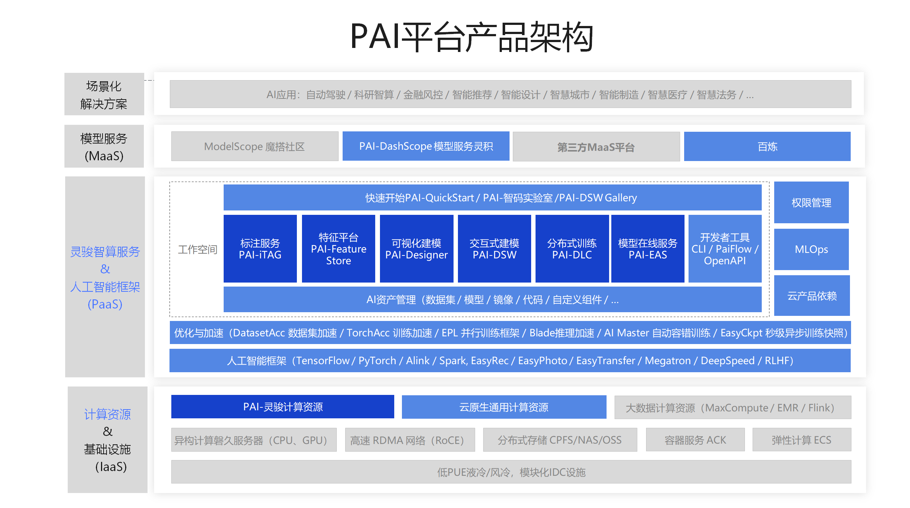
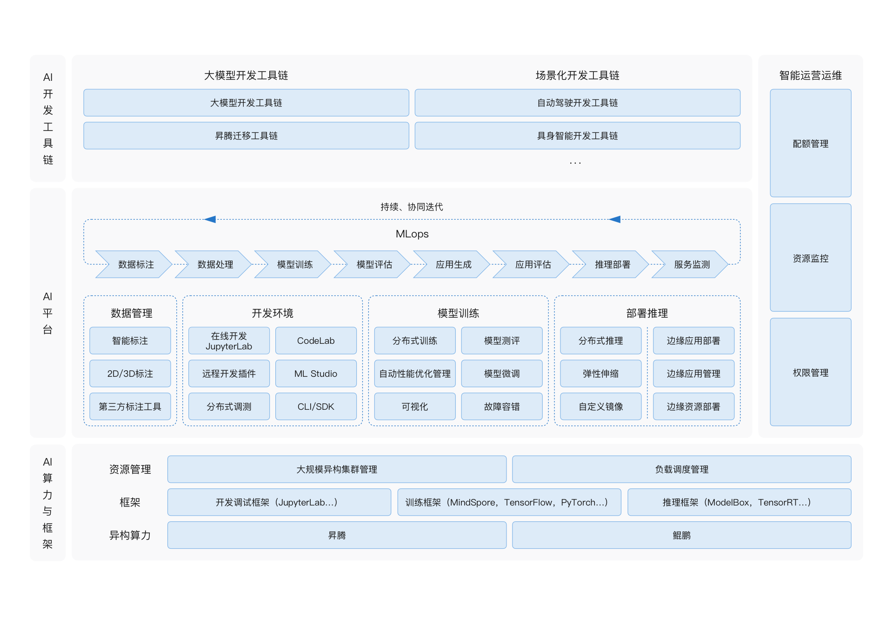
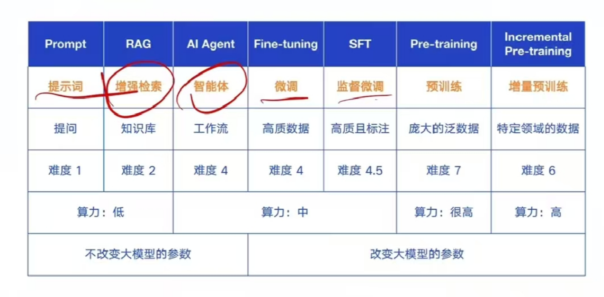

# 5.构建企业级大模型应用

## 介绍

公司进行大模型私有化部署并构建自有AI工具，需从技术、数据、团队、安全等多维度系统规划。

私有化部署大模型是重资产、长周期工程，需以“业务价值驱动”为核心，优先解决高痛点场景，同时建立弹性架构以适应技术迭代。
建议初期通过开源模型+云厂商私有化方案降低门槛，逐步积累数据和团队能力后再向自研深度演进。

私有化大模型部署的优势与挑战
1. 优势
   - 数据隐私与安全：私有化部署确保数据在本地处理，避免数据上传到云端可能带来的隐私泄露风险。适用于处理敏感数据的行业，如金融、医疗、政务等。
   - 实时响应与低延迟：本地部署模型减少网络传输时间，提高响应速度。适用于需要实时处理大量数据的场景，如自动驾驶、智能制造等。
   - 成本控制与灵活性：私有化部署可以降低长期运营成本，避免云服务的持续费用。企业可以根据自身需求灵活调整模型部署方案，实现资源的最优配置。
   - 自主掌控与定制：企业可以完全掌控模型的使用和管理，确保符合内部标准和法规要求。可以根据业务需求对模型进行定制和优化，提高模型的适用性和准确性。
2. 挑战
   - 硬件资源要求：大型语言模型对硬件资源要求较高，需要高性能的服务器和存储设备。解决方案包括采用分布式计算、GPU加速等技术提高计算效率；优化模型结构，降低资源消耗。
   - 模型更新与维护：私有化部署需要企业自行负责模型的更新和维护。解决方案包括建立专业的技术团队，负责模型的持续更新和优化；与模型提供商建立合作关系，获取技术支持和培训。
   - 技术门槛与人才短缺：私有化部署涉及复杂的技术实现和运维管理，对人才要求较高。解决方案包括加强人才培养和引进，提高团队的技术水平；
      与高校、科研机构等建立合作关系，共同推进技术研发和应用。


### 2.算力租用

GPU的价格很贵，每次训练都需要大量的GPU资源。可以考虑租用公有云算力，按时计费，成本更低。

1. [https://gpuez.com/](https://gpuez.com/) 每小时1~3元。

## 1.基础设施搭建

### 1.1. 硬件选型

- 训练端：需高算力GPU/TPU集群（如NVIDIA A100/H100、AMD MI300），支持分布式训练（如Horovod框架）。
- 推理端：可选用性价比更高的GPU（例如推理专用的如NVIDIA T4）或国产化芯片（如昇腾910）。

根据模型规模选择GPU配置：训练需要的资源大于推理，可以训练结束后复用资源。
- 1B-8B 参数模型：RTX 3090/4090（24GB显存）或 两张 RTX 3060（12GB显存）；适合本地开发和测试，轻量级应用的场景。
- 13B-32B参数模型：A100/H100（40GB+显存）或 量化使用RTX 4090等；适合长文本理解生成、高级别文本翻译、高级别文本分析、专业领域的知识图谱构建等需要较高精度的任务。
- 65B-80B参数模型：两张A100/H100（80GB显存）。
- 671B参数模型:8块A100/H100 GPU + 512GB内存 + 高速NVMe存储。
- 如果没有强大的GPU，还可以考虑云端部署或CPU量化（使用GGUF格式）。

评估大模型训练所需硬件，需要综合考虑模型参数规模、计算复杂度、数据规模等因素。
OpenAI在论文《Training compute-optimal large language models》中提出一个估算大模型训练所需计算量的公式。


```shell
C=rT=6×N×D

- C:表示训练Transformer模型所需的总计算量（以浮点运算次数，即 FLOPs 为单位）。
- r:表示训练集群中所有硬件的总吞吐（以浮点运算次数，即 FLOPs 为单位）。
- T:表示训练所需要的时间，单位秒
- 6：常量
- N:表示模型的参数数量。
- D:表示训练数据的 token 数量。（也就是数据集的大小）

以LLama-a为例计算训练需要的时间： N=65B参数模型、1.5万亿个Transformer数据集、2048 张A100显卡（约150TFLOPs ~ 150*10^12 FLOPs）。
C=rT=6×N×D
T=C/r=6×N×D/r=6 * 65*10^9 * 1.5*10^12 / (2048 * 150 * 10^12)
T= 468 * 10^9 / 307,200 = 1.56 * 10^6秒=18天
```

### 1.2.算力管理

1. 采用Kubernetes + GPU Operator构建算力中台，将 GPU/CPU 资源抽象为统一资源池，通过标签（Label）区分训练 / 推理节点
2. 集成Ray Serve或TensorFlow Serving实现推理服务动态扩缩容，根据 QPS 自动增减 Pod 实例。

阿里云PAI-DSW 算力管理：采用云原生架构 和 智能化调度，通过 弹性资源池、实时监控 和 成本优化工具，帮助开发者在保障性能的同时降低 50% 以上的算力成本。
1. 底层架构：通过 k8s 的 资源配额 和 节点选择器 实现 GPU/CPU 资源的统一调度。
2. PAI-DLC：无缝提交分布式训练任务，支持单机 / 多机多卡训练。
3. PAI-EAS：一键部署模型至在线推理服务，支持自动扩缩容和灰度发布。

### 1.3.GPU Operator

- [Kubernetes中NVIDIA GPU Operator基本指南](https://baijiahao.baidu.com/s?id=1805287207732470380)
- [gpu-operator是如何发现显卡的](https://blog.csdn.net/liyachong138/article/details/145759199)
- [kubevirt源码分析之谁分配了gpu_device](https://blog.csdn.net/liyachong138/article/details/145978346)
- [GPU 虚拟化技术MIG简介和安装使用教程](https://cloud.tencent.com.cn/developer/article/2344877)

#### 1.3.1.介绍

GPU Operator由各个厂商提供：英特尔 Operator(专注集显)、AMD GPU Operator 和 NVIDIA GPU Operator。
但是，NVIDIA GPU Operator 是最受欢迎的Operator之一。它提供了一个全面的解决方案，可以简化 Kubernetes 环境中 GPU 的部署、管理和优化。

GPU Operator的作用：
1. 自动安装和维护 GPU 驱动程序。这种自动化确保驱动程序始终是最新的并正确配置，使 AI/ML 工作负载能够平稳高效地运行。
2. 支持GPU并发设置。通过并行处理，GPU 可以显着加快训练和推理速度，管理更大、更复杂的数据集，并提供实时响应。
   - vGPU (虚拟 GPU):  vGPU 使单个物理 GPU 能够在多台虚拟机 (VM) 之间共享，每台 VM 都有自己的专用 GPU 资源，最大限度地提高资源利用率和灵活性。
   - MIG (多实例 GPU): MIG 在硬件级别将单个 GPU 分区为多个隔离的实例，每个实例都有自己的专用内存和计算资源，从而提高工作负载隔离和效率。
      只有NVIDIA 的 A100 及更高版本支持(H100、H200、B100、B200)
   - GPU 时间切片: 在多个任务之间切片 GPU 时间，确保 GPU 资源在不同工作负载之间公平高效地分配。
3. 支持 GPUDirect RDMA 和 GPUDirect 存储。
   - GPUDirect RDMA (远程直接内存访问): 促进不同节点上的 GPU 之间的直接通信，绕过 CPU 并减少延迟，这对高性能计算应用程序至关重要。
   - GPUDirect 存储: 允许 GPU 与存储设备之间直接传输数据，显着加快数据密集型应用程序的数据访问和处理速度。
4. 支持 GDR Copy:GPUDirect RDMA (GDR) Copy是一个基于 GPUDirect RDMA 技术的低延迟 GPU 内存复制库，允许 CPU 直接映射和访问 GPU 内存。
   它提高了内存复制操作的效率，减少了开销并提高了整体性能。
5. 沙箱工作负载: 使应用程序能够在利用虚拟机 (VM) 或具有安全限制的容器的隔离环境中运行。这有助于增强安全性、更好的资源管理和模型的可重复性。

#### 1.3.2.实现原理

<p style="color: red">Kubernetes + GPU Operator 如何实现GPU的算力调度？</p>

总结:标签选择 + 资源配额 + GPU虚拟化技术（MIG/时间片）
1. 资源隔离：通过k8s标签 和 GPU虚拟化技术， 训练/推理任务物理隔离，避免资源争抢。
2. 弹性调度：通过k8s的调度策略，根据负载动态调整 GPU 分配策略（MIG/时间片）。
3. 优先级保障：确保高优先级推理任务低延迟响应。
4. 成本优化：通过 GPU虚拟化技术（MIG/时间片），细粒度切割资源，提升GPU利用率（从 30% 提升至 80%+）。

其核心调度原理基于 Kubernetes 原生调度机制 和 GPU 资源管理扩展能力。
1. GPU Operator自动部署 GPU 驱动，并暴露可以管理的GPU资源（vGPU或者是MIG等）
2. 由K8S将GPU作为一种资源进行统一调度管理，通过标签实现训练和推理不同GPU资源的隔离。
    - 训练节点：kubectl label node gpu-node-1 workload-type=training
    - 推理节点：kubectl label node gpu-node-2 workload-type=inference
3. k8s调度策略。资源请求与限制，在 Pod Spec 中明确请求 GPU/CPU 资源，并指定节点选择约束。调度过程
    - 过滤阶段：调度器筛选出workload-type=training的资源，判断剩余GPU资源是否满足Pod要求，通过GPU Operator上报的GPU资源可用性（vGPU或者MIG分区状态）
    - 评分阶段: 资源碎片率（优先选择碎片更少的节点）、GPU 负载均衡（通过自定义调度插件实现）、拓扑感知（如 NVLink 高速互联的 GPU 优先分配）
    - 绑定阶段: 将 Pod 绑定到最优节点，通过 kubelet 调用 GPU Operator 的容器运行时接口，确保 GPU 设备正确挂载。
    ```yaml
    apiVersion: v1
    kind: Pod
    metadata:
      name: training-pod
    spec:
      containers:
      - name: trainer
        image: nvcr.io/nvidia/tensorflow:22.07-tf2-py3
        resources:
          limits:
            nvidia.com/gpu: 4  # 申请 4 块 GPU
            cpu: "16"          # 申请 16 核 CPU
          requests:
            nvidia.com/gpu: 4
            cpu: "16"
      nodeSelector:
        workload-type: training  # 绑定到训练节点
    ```
<p style="color: red">GPU 资源细粒度管理？</p>

案例1：多实例 GPU（MIG）支持：单块 A100 GPU 可分割为多个 MIG 实例（如 7 个 5GB 实例）
1. GPU Operator 配置 MIG 策略：使用命令进行配置： sudo nvidia-smi -i 0 --mig 3。
   - -i: 本地的GPU的序号
   - --mig:创建实例的数量
2. Pod 通过资源请求指定 MIG 实例类型：
    ```yaml
    resources:
      limits:
        nvidia.com/mig-1g.5gb: 2  # 申请 2 个 5GB MIG 实例
    ```
  
案例2：时间片共享，多个推理任务共享同一GPU。
1. 使用 Kubernetes 的 Extended Resources 定义虚拟 GPU 单位。
2. 结合 GPU Operator 的 time-slicing 配置： # 在 nvidia-device-plugin 配置中
    ```yaml
    args:
      - --time-slicing=my-gpu=4  # 将 1 块物理 GPU 虚拟化为 4 个时间片
   ```
3. Pod 请求虚拟 GPU 资源：    
    ```yaml
    resources:
      limits:
        nvidia.com/gpu: 1  # 实际占用 1 个时间片（物理 GPU 的 1/4 算力）
   ```

案例3：优化调度器策略，设置训练任务亲和，同一批训练任务尽量分散在不同节点
```yaml
affinity:
  nodeAffinity:
    requiredDuringSchedulingIgnoredDuringExecution:
      nodeSelectorTerms:
      - matchExpressions:
        - key: workload-type
          operator: In
          values: [training]
  podAffinity:  # 同一批训练任务尽量分散在不同节点
    requiredDuringSchedulingIgnoredDuringExecution:
    - labelSelector:
        matchExpressions:
        - key: app
          operator: In
          values: [distributed-training]
      topologyKey: kubernetes.io/hostname
```

#### 1.3.3.安装使用

GPU Operator GPU厂商提供的 Kubernetes Operator，用于自动化管理 GPU 相关组件（如驱动、容器运行时、设备插件等）。并非 Kubernetes 原生的内置组件需要单独安装

通过 Helm Chart 署到 Kubernetes 集群中，安装过程会自动安装和管理以下组件：
- NVIDIA 驱动程序
- CUDA Toolkit
- NVIDIA Container Runtime
- Kubernetes 设备插件（Device Plugin）
- 节点特性发现（Node Feature Discovery, NFD）
- MIG（多实例 GPU）管理

简化安装：使用 Rancher UI 集成，通过 Rancher 的 Helm Catalog 直接部署 GPU Operator，适合可视化操作。

环境准备
- Kubernetes 集群：版本 ≥ 1.19（推荐 ≥ 1.22）。
- 容器运行时：支持 Containerd 或 CRI-O。
- 节点要求：所有 GPU 节点需运行相同操作系统和内核版本，且 GPU 型号符合 [NVIDIA 支持矩阵](https://docs.nvidia.com/datacenter/cloud-native/gpu-operator/latest/platform-support.html)。
- 工具依赖：需安装 kubectl 和 helm（≥3.0）。

安装：通过 Helm 安装（推荐）
```shell
# 添加 NVIDIA Helm 仓库
helm repo add nvidia https://helm.ngc.nvidia.com/nvidia
helm repo update

# 创建命名空间并安装
kubectl create namespace gpu-operator
helm install gpu-operator nvidia/gpu-operator -n gpu-operator -f values.yaml
```

高级配置：通过 values.yaml 文件自定义参数，例如启用 MIG 或禁用自动驱动安装：
```yaml
driver:
  enabled: true   # 自动安装驱动（若节点未预装）
mig:
  enabled: true    # 启用 MIG 支持
toolkit:
  version: v1.14.0 # 指定容器工具包版本
```

离线安装，若集群无外网访问，需使用离线镜像和配置文件：
1. 上传离线包：将预构建的驱动镜像和 Helm Chart 上传至私有仓库。
2. 配置本地仓库：创建 local-repo-config ConfigMap，包含离线源信息。
3. 修改 Helm 参数：指定离线镜像地址和版本：
```yaml
driver:
 repository: private-registry/nvidia/driver
 version: 535.104.12-centos7  # 匹配节点内核版本
```

验证安装
```shell
检查 Pod 状态：    kubectl get pods -n gpu-operator  # 所有组件应为 Running
查看节点 GPU 资源： kubectl describe node <node-name> | grep nvidia.com/gpu  # 显示 GPU 数量
测试 GPU 容器：    kubectl run gpu-test --image=nvidia/cuda:12.2.0-base-ubi8 --limits=nvidia.com/gpu:1 --command -- sleep infinity
```

关键注意事项
1. 驱动版本匹配。驱动镜像版本需与节点内核版本完全一致（包括小版本），例如，Ubuntu 22.04 内核 5.15.0-1043 需对应驱动版本 535-5.15.0-1043。
2. MIG 配置：启用 MIG 需 GPU 型号支持（如 A100、H100）。 通过标签指定节点切分策略：
3. 预装驱动的处理：若节点已手动安装驱动，需禁用 GPU Operator 的驱动安装：
4. 升级与回滚：升级时需检查版本兼容性，例如从 v23.9.0 升级到 v24.6.0 需启用 `upgradeCRD: true`。

### 1.4.其他资源

数据存储：
- 采用分布式存储系统（如Ceph、MinIO）存储海量训练数据，支持高吞吐读写。
- 敏感数据需配置加密存储（AES-256）和容灾备份（如异地多活）。 

网络架构：
- 内部网络需保障低延迟（如万兆/InfiniBand网卡），支持GPU间高速通信（NVLink）。
- 划分安全隔离区（DMZ），部署API网关，控制内外网流量。

## 2.数据体系构建
1. 数据采集：
   - 梳理内部数据资产，明确可用于训练的数据源（如业务系统日志、文档、API数据）。
   - 遵循《数据安全法》《个人信息保护法》，对用户隐私数据进行脱敏（如差分隐私、联邦学习）。
2. 数据预处理：
   - 清洗：去重、填补缺失值、格式统一（如JSON/CSV标准化）。
   - 标注：针对NLP/多模态任务，搭建标注平台（如自研或采购Label-Studio），组织标注团队或外包。
   - 版本管理：使用DVC、Git-LFS管理数据版本，确保可追溯。
3. 领域数据增强
   - 构建行业专属知识库：如金融领域的财报、医疗领域的病历摘要，通过爬取公开数据（需合规）+ 内部数据融合。
   - 生成式数据 augmentation：利用小样本生成工具（如GPT-4生成模拟对话）扩充训练集。

## 3.模型选型

### 3.1.选型
私有化部署的模型通常有两类：开源模型和商业化私有部署模型。
1. 开源模型：
   - DeepSeek：中文优化较好，可本地部署，支持1.5b~70b 蒸馏版本模型，以及671b的满血版模型。
   - LLaMA 3：支持8B/70B，通用能力强
   - Qwen 2：通义千问，阿里巴巴出品，支持多种参数规模
   - BAIchuan 3：百川，优秀的中文能力，适合企业应用
   - Mistral 7B/Mixtral 8x22B：更高效的推理和推理成本优化
   - Gemma：Google，轻量级，可与Google生态结合
2. 商业化私有部署模型：
   - GPT-4 Turbo（Azure OpenAI私有部署）
   - Claude 3（Anthropic）
   - 文心一言/通义千问API专属部署等。

除此之后还有很多其他类型的模型
1. 语言类模型：DeepSeek R1、LLaMA 3、Qwen 2.5等。
2. 嵌入模型：
3. 重排序模型：
4. 多模态模型(图片、视频、音频等)： LLaVA、GPT-NeoX、StableLM等。

### 3.2.模型仓库

1. Hugging Face。相当于模型届的GitHub，几乎全部的模型都会上传到Hugging。
   - 官网：[https://huggingface.co/](https://huggingface.co/)
   - huggingface镜像加速[https://hf-mirror.com/](https://hf-mirror.com/)
2. vLLM。vLLM自行维护的仓库，相对模型较少写。

### 3.3.模型部署（模型下载）

模型下载工具：非常底层的工具，通常作为上面模型管理工具的底层依赖。
1. Hugging Face Transformers：Hugging Face是机器学习和人工智能领域的开源模型集散地，提供了丰富的开源模型资源。
   其推出的名为Transformers的Python库，能极大简化在本地部署和运行大型语言模型的流程。
2. Llama.cpp：专注于为开发者提供底层的高性能推理能力，核心是用 C/C++ 实现的高效 LLM 推理框架，强调在多种硬件（包括 CPU、GPU 和边缘设备）上的灵活部署。
   支持量化技术以压缩模型大小，适合需要深度定制化或资源受限的环境。
3. vLLM：用于大语言模型的高吞吐量和内存高效的推理和服务引擎，兼容 OpenAI API。

Hugging Face transformers。
```python
from transformers import AutoTokenizer, AutoModelForCausalLM

tokenizer = AutoTokenizer.from_pretrained("deepseek-ai/DeepSeek-R1-Distill-Qwen-7B")
model = AutoModelForCausalLM.from_pretrained("deepseek-ai/DeepSeek-R1-Distill-Qwen-7B")
```

vLLM
```shell
# 安装:       pip install vllm
# 下载并运行:  vllm serve "deepseek-ai/DeepSeek-R1-Distill-Qwen-7B"
# 调用模型:
curl -X POST "http://localhost:8000/v1/chat/completions" \
	-H "Content-Type: application/json" \
	--data '{
		"model": "deepseek-ai/DeepSeek-R1-Distill-Qwen-7B",
		"messages": [
			{
				"role": "user",
				"content": "What is the capital of France?"
			}
		]
	}'
```

### 3.4.模型管理（大模型运行基座）

模型下载工具采用非常底层的方式实现，使用并不友好。所以对其进行封装获得了模型管理工具。
1. Ollama，基于 llama.cpp 构建，定位为简化本地大模型部署的“上层工具”，提供开箱即用的体验。
   - 只支持 语言 和 嵌入模型部署与管理，提供命令行管理工具
   - Ollama默认开放11434端口，接口部分兼容OpenAI API。
   - 适合本地学习尝鲜。
2. LocalAI：官网[https://localai.io/](https://localai.io/)
   - 专门为本地部署设计的工具，支持多种类型的AI模型，支持多种硬件环境。提供用户界面，兼容 OpenAI API。
   - 缺点：为了在本地运行大模型，需要较高的计算能力。相对于成熟的云服务平台，LocalAI的用户社区和技术支持可能不够健全。
3. xInference：官网[https://inference.readthedocs.io](https://inference.readthedocs.io)
   - 是国内推出的本地部署工具，提供优化的模型推理功能，支持多种AI模型和硬件环境，提供用户界面。
   - 它优化了推理过程，在有限资源下可达到更快的处理速度，兼容 OpenAI API。
   - 缺点：硬件兼容性差，需要自行安装各类依赖。

### 3.5.模型统一接口【可选】

通常企业部署大模型后，为了集成到业务系统，需要大模型暴露HTTP API，但是各个模型的接口可能有些不同，为了方便为模型暴露统一的接口：
1. One API。统一不同模型的接口，兼容 OpenAI API。

### 3.6.商业AI平台

商业AI平台也就是 MLOps 或者 AiOps，目前只能采购，平台实现模型训练、验证、部署自动化等一站式AI功能。

1.[阿里云PAI-DSW](https://www.aliyun.com/activity/bigdata/pai/dsw)。人工智能平台PAI是阿里云专为开发者打造的一站式机器学习平台，
其主要由可视化建模（Designer）、交互式建模（DSW）、分布式训练（DLC）、模型在线服务（EAS）等核心功能模块组成，
为您提供数据标注、模型开发、模型训练、模型部署的AI全链路研发服务，具有支持多种开源框架、多项AI优化能力、灵活易用的优势。



2.华为ModelArts。是华为云提供的一站式AI开发平台，提供海量数据预处理及半自动化标注、大规模分布式训练、自动化模型生成及端-边-云模型按需部署能力，
帮助用户快速创建和部署模型，管理全周期AI工作流。包括数据处理、算法开发、模型训练、模型部署都可以在ModelArts上完成。
从技术上看，ModelArts底层支持各种异构计算资源，开发者可以根据需要灵活选择使用，而不需要关心底层的技术。
同时，ModelArts支持Tensorflow、PyTorch、MindSpore等主流开源的AI开发框架，也支持开发者使用自研的算法框架，匹配您的使用习惯。



3.其他：阿里云百炼、星环 Sophon LLMOps、 火山引擎 HiAgent、AWS SageMaker私有化

### 3.7.开源AI平台(工具)

聊天客户端工具
1. LM Studio。桌面应用程序，可以用于模型管理和使用，提供用户界面。 https://lmstudio.ai/
2. chatbox。 可以对接主流的chat类大模型，桌面客户端工具。官网[https://chatboxai.app](https://chatboxai.app)
3. AnythingLLM。与chatbox一样。
4. Page Assist。浏览器插件，本地 AI 模型的 Web UI。
5. OpenWebUI。chat工具。
6. AingDesk。开源的桌面AI助手，支持多种大模型。与chatbox类似。官网：[https://www.aingdesk.com](https://www.aingdesk.com)

模型编排工具 【支持语言、向量、重排序、图片、视频、语言等多模态模型编排】
1. Dify。开源的模型编排工具，结合了AI工作流程、RAG管道、代理功能、模型管理和可观测性功能。官网[https://dify.ai/](https://dify.ai/)
2. MaxKB。基于本地大模型构建的知识库，支持多种数据源和格式，，支持AI Agent任务编排。
3. n8n：这是一个工作流自动化平台，提供代码的灵活性和无代码的速度。 
4. 其他：LangChain、AutoGen、Haystack。 

领域工具
1. Dia：由Nari Labs创建的1.6B参数文本转语音模型。Dia能够生成高度逼真的对话，并支持情感和音调控制，还可以产生非语言交流，如大笑、咳嗽等。 
2. OneDiff：一个开箱即用的Diffusion模型加速库，提供PyTorch代码编译工具和强大的优化GPU内核，适用于流行的UI/库如HF扩散器和ComfyUI 
3. Cherry-Studio：一个支持多平台的AI客户端，致力于让更多人享受到AI带来的便利
4. cursor 和 trae（字节产品）。基于vsCode的智能开发工具。

万能小工具（目前看来主要是类似于自动的案件精灵和浏览器爬虫）
1. jmanus[源码](https://github.com/alibaba/spring-ai-alibaba/tree/main/spring-ai-alibaba-jmanus)
2. OpenManus[https://github.com/mannaandpoem/OpenManus](https://github.com/mannaandpoem/OpenManus)

## 4.模型评估

模型评估是大模型全生命周期管理的核心环节，需从功能指标、效率指标、安全指标、业务对齐指标等多维度构建体系。

### 4.1.功能指标（任务适配性）

| 任务类型       | 核心评估标准                                                                 | 典型工具/数据集                          |
|------------------|-----------------------------------------------------------------------------|---------------------------------------------|
| 文本生成      | 流畅度（Perplexity）、相关性（Embedding Cosine）、多样性（N-gram重复率）          | GPT-4 Score、Hugging Face Evaluate（BLEU/ROUGE） |
| 知识问答      | 事实准确性（Factuality）、答案覆盖率（Coverage）、拒答合理性（Refusal Rate）       | TruthfulQA、Google TriviaQA                   |
| 代码生成      | 编译通过率（Compile Rate）、逻辑正确性（Unit Test Pass）、性能优化度（Runtime）     | HumanEval、CodeBLEU                           |
| 多模态理解    | 图文对齐度（Image-Text Matching）、视频时序理解（Temporal Consistency）            | MSCOCO Captioning、Flickr30K                  |
| 推理决策      | 逻辑链条完整性（Chain-of-Thought Accuracy）、多步推理错误率（Step Error Rate）     | GSM8K、ARL Math Reasoning                     |

### 4.2.效率指标（工程落地性）

推理性能：
- 延迟：端到端响应时间（如 95% 分位值＜500ms）
- 吞吐量：每秒处理 token 数（如 A100-80GB 部署 70B 模型≥200token/s）
- 工具：NVIDIA Perf SDK、vLLM Benchmark、TensorRT-LLM Profiler

资源消耗：
- 显存占用（如 4bit 量化后 70B 模型显存＜32GB）
- 能耗（如每千 token 功耗＜0.5 度电）
- 工具：DeepSpeed Memory Profiler、MLC LLM Runtime Monitor

### 4.3.安全与合规指标（企业级刚需）
数据安全：
- 训练数据隐私泄露风险（如 Text 水印检测率＞95%）
- 推理数据隔离性（如多租户显存隔离度 100%）
- 工具：Aequitas（公平性检测）、IBM AI Fairness 360

内容安全：
- 敏感内容生成概率（如仇恨言论生成率＜0.01%）
- 合规内容覆盖率（如金融话术合规性检测通过率＞99%）
- 工具：Content Moderation API（微软 / Google）、阿里云百炼安全检测

### 4.4.功能指标
业务对齐指标（商业化价值）
- ROI 导向指标：
- 客服场景：问题解决率提升（如从 60%→85%）、人工转接率下降（如从 40%→15%）
- 营销场景：CTR 提升（如广告生成模型使点击率提升 20%）

用户体验指标：
- NPS 评分（如智能助手 NPS＞70）、会话渗透率（用户主动调用频率周增＞15%）
- 工具：Mixpanel（用户行为分析）、Amplitude（转化漏斗跟踪）

### 4.5.全场景评估工具链

开源工具链
- 基础能力评估：
    - Hugging Face Evaluate：集成100+指标（BLEU/ROUGE/Perplexity），支持自定义metric，适配LLM轻量化评估。
    - OpenAI Evals：基于GPT-4的自动化评估框架，可生成对抗性测试用例（如逻辑谬误检测）。
- 多轮对话评估：
    - DollyEval：针对指令遵循能力的评估套件，包含1000+多步推理测试样本。
    - MT-Bench：多语言大模型评估基准，覆盖8种语言的复杂查询（如法律文书生成）。
- 模型对比分析：
    - LM-Sys VISION：可视化大模型性能差异（如推理速度vs.准确率权衡曲线），支持70+模型横向对比。


企业级评估平台
- 火山引擎大模型评估服务：
    - 内置金融/政务等行业评估模板，支持自定义评估流程（如A/B测试→专家评审→灰度发布）。
    - 提供“评估-调优”闭环：自动生成提示词优化建议（如将“请分析”改为“请用SWOT模型分析”可提升回答结构化率30%）。
    - 案例：某银行使用该平台优化客服模型，事实性错误率从18%降至5%，通过等保2.0测评。
- 阿里云PAI-EAS评估中心：
    - 支持多模型并行评估（如同时测试LLaMA-70B和通义千问），自动生成性能对比报告。
    - 集成数据血缘追踪，确保评估数据可审计（如标注人员、修改记录全留痕）。
    - 案例：某车企用其评估智能座舱对话模型，对话流畅度提升40%，通过ISO 21434汽车功能安全认证。
- AWS SageMaker Model Monitor：
    - 实时监控模型漂移（如输入数据分布变化预警），支持自定义阈值（如文本熵值波动＞15%触发报警）。
    - 自动生成合规报告，满足FDA、GDPR等监管要求。

其他
- 医疗领域：
    - MedQA：医学问答评估基准，包含USMLE考试真题，评估模型诊断建议准确性（如疾病鉴别诊断正确率＞90%）。
    - BioASQ：生物医学领域信息检索评估工具，检测模型对专业文献的理解深度。
- 代码领域：
    - CodeT5-eval：代码生成评估套件，支持单元测试自动运行（如生成Python代码的测试用例通过率＞85%）。
    - SonarQube：代码质量检测工具，评估生成代码的可维护性（如圈复杂度＜15、代码重复率＜5%）。
- 多模态领域：
    - MME（多模态评估引擎）：评估图文生成一致性（如文本“夕阳下的沙滩”生成图片的场景匹配度＞95%），支持CLIP分数实时计算。

## 5.模型开发

模型开发的方向有很多，由简到难如下
1. 提示词 Prompt：采用更具贴合大模型的提问方式，设定如何回答问题，降低胡乱回答的概率。
2. 增强检索  RAG：构建向量支持库
3. 智能体  AI Agent:工作流的应用
4. 微调  Fine tuning:提高数据质量。微调的本质是通过讲解数据的思路和原理，让模型更好的回答问题，并不学习新的知识。
5. 监督微调:人工标注后提升数据质量。
6. 增量预训练：训练特定领域模型。本质是学习新的知识点，模拟大模型训练的过程，将数据添加到模型中，主要是记住答案。
7. 预训练：放大的泛数据，用于通用模型训练。



### 5.1.开发工具

- 训练框架：PyTorch/TensorFlow + DeepSpeed/FairScale（支持大模型分布式训练）。
- 模型应用。openAI API文档：https://platform.openai.com/docs/api-reference/introduction
  1. spring ai： 技术文档:[https://java2ai.com/](https://java2ai.com/)
  2. LangChain4J： 技术文档:[https://docs.langchain4j.dev/](https://docs.langchain4j.dev/)
     代码案例：[https://github.com/langchain4j/langchain4j-examples](https://github.com/langchain4j/langchain4j-examples)
  3. LangGraph： 技术文档:[]()


### 5.2.量化模型【可选】

目的：降低显存需求，如果GPU显存有限，可以对模型进行4-bit或8-bit量化。大部分模型下载仓库都提供了多种量化后的模型。
1. GPTQ量化：适用于8-bit、4-bit量化。
2. GGUF量化：适用于CPU部署。使用llama.cpp或Ollama部署量化GGUF格式模型。

### 5.3.提示词
看上篇文章

### 5.4.增强检索
看上篇文章

### 5.5.智能体
看上篇文章

### 5.6.微调

1. 开源模型微调：
   - 选择基础模型：如LLaMA 2、ChatGLM-4、DeepSeek、qwen等，降低训练成本。
   - 微调方向：
      - 指令微调（SFT）：基于业务场景设计prompt集合（如客服问答、代码生成）。
      - 奖励模型（RM）：通过业务指标（如回答准确率、用户满意度）训练排序模型。
      - 强化学习（RLHF）：接入业务系统反馈，持续优化模型对齐度。
2. 自研模型路径：
   - 适用于对模型有深度定制需求（如特殊模态、极低延迟），需具备算法团队（博士级研究员+工程化能力），预算需千万级以上。

### 5.7.增量预训练

### 5.8.预训练

## 6.模型测试

[AI Test：AI 测试平台落地实践](https://mp.weixin.qq.com/s/lRu1Bhz2QSbIyaRJRtuOVg?click_id=14)

## 7.安全与合规
1. 数据安全
   - 传输加密：API调用采用HTTPS，敏感数据字段加密（如AES-GCM）。
   - 访问控制：基于RBAC（角色权限控制）限制模型调用权限，集成LDAP/AD实现单点登录（SSO）。
   - 审计日志：记录所有模型输入输出、操作日志，保存至少6个月，满足等保2.0要求。
2. 合规性建设
   - 算法备案：根据《生成式人工智能服务管理暂行办法》，完成算法安全评估和备案。
   - 内容安全：部署内容审核模块（如敏感词过滤、违规图像识别），防止生成有害输出。
   - 知识产权：确保使用的开源模型、数据来源合法，避免版权纠纷（如CC协议、商业授权）。

## 8.团队与组织保障
1. 人才架构
   - AI工程师：负责模型训练、调优、部署（需熟悉大模型训练流程）。
   - 数据工程师：构建数据管道、处理ETL任务、维护数据仓库。
   - 运维工程师：管理算力集群、容器化部署、监控系统稳定性。
   - 产品经理：拆解业务需求，设计AI工具交互逻辑（需懂NLP/多模态技术边界）。
2. 外部合作：与高校/AI厂商（如智谱AI、科大讯飞）建立联合实验室，弥补技术短板。
3. 培训与文化
   - 开展内部AI通识培训，帮助业务部门理解工具能力边界（如“大模型不能做什么”）。
   - 建立“AI沙盒”环境，允许员工低成本测试创意场景，激发创新应用。

## 9.成本管理
1. 预算规划
   - 一次性投入：硬件（服务器/存储）占比50%+，软件授权（如商业大模型API）、团队招聘占30%，数据标注/治理占20%。
   - 持续性支出：电力成本（GPU集群月均电费可达数十万元）、模型迭代人力、安全审计费用。
2. 价值量化
   - 设定关键指标：如客服效率提升百分比、文档处理耗时缩短、研发代码生成率等。
   - 分阶段验证：先在单一场景（如内部知识库查询）试点，验证ROI后再横向推广。

## 10.长期迭代机制
1. 监控与反馈闭环：
    - 部署Prometheus+Grafana监控推理服务性能（如QPS、延迟、错误率）。
    - 收集用户反馈（如NPS评分），定期更新训练数据（每季度/半年），触发模型再训练。
2. 技术演进跟踪：
    - 关注大模型技术趋势（如MoE混合专家模型、高效微调技术LoRA/QLoRA），定期评估是否升级基础模型。
    - 探索边缘计算场景（如在工厂设备端部署轻量化模型），拓展应用边界。

实施路线图建议

| 阶段         | 时间周期 | 核心任务                                                                 |
|--------------|----------|--------------------------------------------------------------------------|
| POC验证  | 1-3个月  | 选择1-2个高频场景（如合同审阅、内部问答），用开源模型快速搭建Demo验证效果。 |
| 系统搭建 | 3-6个月  | 完成算力集群、数据中台、MLOps平台建设，完成模型第一轮微调与安全合规测试。 |
| 全量部署 | 6-12个月 | 分部门上线AI工具，建立运营团队，完善监控与反馈机制，启动第二期模型优化。   |


## 11.AI编程量化

- [让AI编程的价值可追踪、可量化--「AI编程效能量化系统」](https://mp.weixin.qq.com/s/A8TqyFNcSnbM11_3xSR24A)
- [硬核实战：如何搭建 AI 研发效能指标体系？AI 研发效能如何量化？从 0 到 1 搭建“AI 出码率”核心指标体系与实践（内附实践源码）](https://zhuanlan.zhihu.com/p/1967888699577590102)

原则：只有最终提交到 Git 平台的代码，才被视为有效代码的衡量标准。

核心指标：AI 出码率（AI Adoption Rate）= AI 采纳行数 / Commit 的代码总行数 * 100%；
- AI 采纳行数： 统计周期内，AI 生成的代码中与最终 Git Commit 提交的代码逐行匹配的代码行数。
- Commit 的代码总行数： 统计周期内，用户 Git 提交记录中的有效代码总行数。

其他辅助指标
1. 代码量统计信息： 反映用户实际代码产出。 
2. 会话交互信息： 通过会话数、会话采纳率、轮次等，评估 AI 对话的效率。 
3. 使用时长信息： 记录工具实际使用时间，评估工具粘性和用户习惯养成。 
4. Tab 补全相关数据： 观测 Tab 补全功能在整体出码率中的贡献占比。
