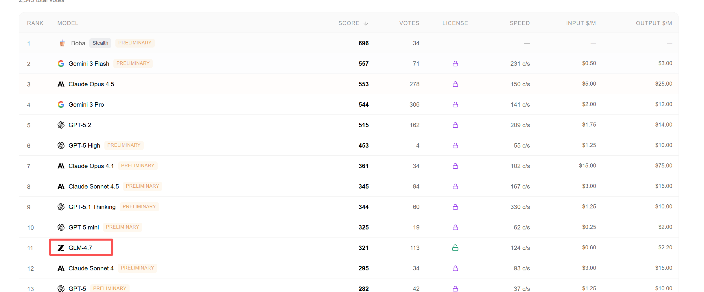
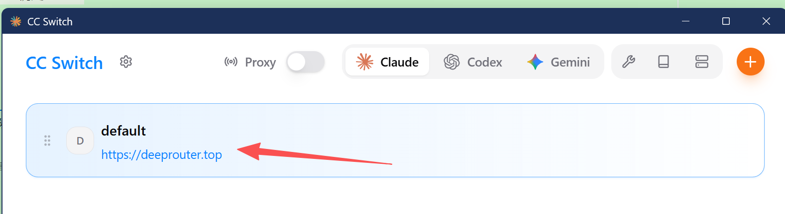
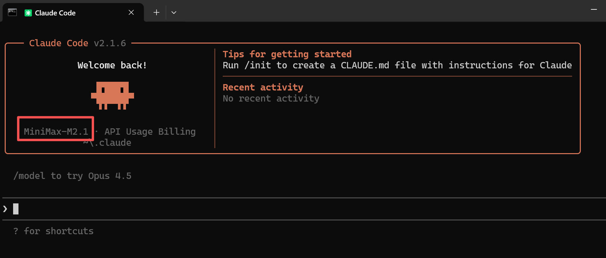

# 6.AI编程

## 介绍
AI编程两大核心支柱的角色 大模型 与 智能体。

1. 大模型 (Large Model)。在AI编程中的角色是大脑。提供强大的自然语言理解与生成能力，是知识、代码生成和逻辑推理的源泉。但它通常“只会说，不会做”。
2. Agent (智能体)。是行动的“身体”与“协调中枢”。具备自主规划、决策、调用工具（API、搜索引擎、代码解释器）和执行的能力。它围绕大模型进行任务拆解和调度，以完成复杂目标

工作流程：
1. 接收任务：你向AI编程助手（通常是一个Agent）提出需求，例如“创建一个用户登录的RESTful API”。 
2. 规划与调用：Agent理解需求后，会利用其内置的大模型“大脑” 进行思考，规划实现步骤（如：需要生成用户模型、验证逻辑、JWT token处理等），
   并可能调用代码生成、文件读写等工具。
3. 执行与迭代：Agent协调各个步骤，生成代码文件，甚至运行测试。如果出错，它会再次调用大模型分析错误并修复，形成一个自主的“思考-行动”闭环。

## 模型

### 1.排名

AI编程能力通常体现在这几个方面：
1. 复杂推理与规划：处理多步骤任务、进行架构设计。 
2. 长上下文理解：能处理整个代码库或多个文件，保持连贯性。 
3. 代理工作流：能自主或半自主地规划并执行任务，例如从设计到生成代码。 
4. 生产就绪输出：生成的代码质量高、稳定，可直接用于生产环境。

这些能力常通过 SWE-Bench（评估模型解决真实GitHub软件工程问题的能力）等基准测试来衡量
- [AI Coding之SWE-bench](https://docker.blog.csdn.net/article/details/154170459)
- swebench官网[https://www.swebench.com/](https://www.swebench.com/)

swebench官网提供了一份模型排名


因为AI编程技术迭代非常快，所有出现一个整体排名的网站：[https://llm-stats.com/](https://llm-stats.com/)

是一个名为“AI Leaderboards 2026”的网站，其核心功能是提供各类人工智能（AI）模型的排行榜，供用户进行比较。
网站页面顶端清晰地列出了 “竞技场排名”，并说明这是汇聚了所有子竞技场的综合性能表现。这表明它可能通过多种任务或测试集，对不同的AI模型进行横向评估和排名。


我们基本可以看到：榜单前10基本就是Gemini、Claude、GPT等，这些都是商业模型。
国产的模型上榜的

### 2.国产模型

1. 智普：[https://open.bigmodel.cn/](https://open.bigmodel.cn/)
2. minimax： [https://www.minimaxi.com/](https://www.minimaxi.com/)
3. 模型代理，国内的大模型代理服务上，可以直接使用Claude code 和 codeX，价格还便宜不少。
   - [https://deeprouter.top/](https://deeprouter.top/)
   - [https://www.packyapi.com/](https://www.packyapi.com/)
   - [https://www.aigocode.com/](https://www.aigocode.com/)
   - [https://www.dmxapi.cn/](https://www.dmxapi.cn/)
   - [https://cubence.com/](https://cubence.com/)



## 工具
工具提供的就是agent的载体。

### 1.AI集成环境（也就是IDE）

Cursor
1. 官网：[https://cursor.com/cn](https://cursor.com/cn)
2. 基于VS Code深度定制，AI能力（聊天、编辑、补全）无缝融入编辑器
3. 多模型支持（GPT-4、Claude等），可切换
4. 提供免费Hobby计划，有次数限制
5. 难题：限制地区使用，需要使用破解版，模型也需要修改。

TRAE
1. 官网：[https://trae.cn](https://trae.cn)
2. 提供国内与国际两个版本，支持的模型也有所不同。
3. 提供免费的支持。支持多种国产模型进行切换。

### 2.智能体

Claude Code
1. 官网：[https://claude.ai](https://claude.ai)
2. 纯命令行交互，通过自然语言指挥AI完成任务。
3. 通过npm命令本地安装，支持模型切换。
4. 难题：限制地区使用，需要使用破解版，模型也需要修改。

Codex
1. 官网：[https://openai.com/blog/openai-codex](https://openai.com/blog/openai-codex)
2. 同时提供CLI、IDE扩展及云端环境。
3. 生态整合好（GitHub审查、Slack等）；执行任务目的性强、连贯；对重度用户，性价比可能更高。
4. 难题：限制地区使用，需要使用破解版，模型也需要修改。

OpenCode
1. 官网：[https://opencode.ai](https://opencode.ai)
2. Claude Code的开源替代方案，模型与交互与Claude Code一致。
3. 纯命令行交互，通过自然语言指挥AI完成任务。


秘钥切换工具。cc-switch，是一个便捷的工具，可以快速切换 Claude Code 的 API 配置。
1. 安装教程： https://github.com/farion1231/cc-switch/blob/main/README_ZH.md




工作流工具：
1. ClaudeCode Workflow Studio：开源的专为 Claude Code 设计的可视化工作流编辑器。 导出工作流程文件，可以直接导入到Claude Code中。

### 3.如何使用

[【强烈推荐】最强AI编程工具Claude Code保姆级新手教程！无门槛国内使用教程！效率飞起摆脱地域限制！](https://www.bilibili.com/video/BV19RtjzoEb9)

## Claude Code使用案例

### 1.Claude Code最佳实践

```shell
1. 安装npm：           需要Node.js 18+
2. 安装Claude Code：   npm install -g @anthropic-ai/claude-code
3. 验证：claude --version
4. 切换国产模型：
# Stpe1: 编辑或创建 Claude Code 的配置文件
# MacOS & Linux 为 `~/.claude/settings.json`
# Windows 为`用户目录/.claude/settings.json`
# `MINIMAX_API_KEY` 需替换为您的 MiniMax API Key
# 环境变量 `ANTHROPIC_AUTH_TOKEN` 和 `ANTHROPIC_BASE_URL` 优先级高于配置文件
{
  "env": {
    "ANTHROPIC_BASE_URL": "https://api.minimaxi.com/anthropic",
    "ANTHROPIC_AUTH_TOKEN": "MINIMAX_API_KEY",
    "API_TIMEOUT_MS": "3000000",
    "CLAUDE_CODE_DISABLE_NONESSENTIAL_TRAFFIC": 1,
    "ANTHROPIC_MODEL": "MiniMax-M2.1",
    "ANTHROPIC_SMALL_FAST_MODEL": "MiniMax-M2.1",
    "ANTHROPIC_DEFAULT_SONNET_MODEL": "MiniMax-M2.1",
    "ANTHROPIC_DEFAULT_OPUS_MODEL": "MiniMax-M2.1",
    "ANTHROPIC_DEFAULT_HAIKU_MODEL": "MiniMax-M2.1"
  }
}
# Step2: 编辑或新增 `.claude.json` 文件
# MacOS & Linux 为 `~/.claude.json`
# Windows 为`用户目录/.claude.json`
# 新增 `hasCompletedOnboarding` 参数
{
  "hasCompletedOnboarding": true
}

5.使用使用：命令窗口输入claude，看到如下截图就说明安装成功，模型已经切换过去了。
```




### 2.集成IDE

[终端里用 Claude Code 太难受？我把它接进 TRAE，真香!](https://zhuanlan.zhihu.com/p/1948479831177171398)

Claude Code 官方已经提供了VSCode 和 idea 的插件，可以方便的使用可视化界面的方式进行开发，效果与trae相似，不用在cli里面复制代码了。  


