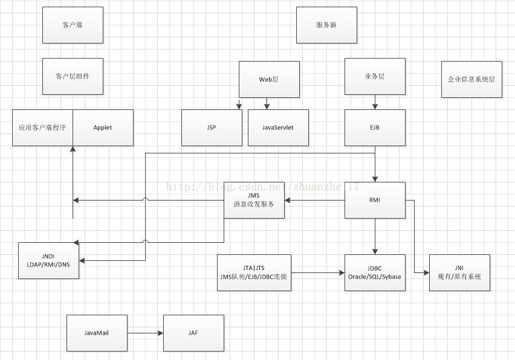

# 1.J2EE规范

## 什么是J2EE?

在企业级应用中,都有一些通用企业需求模块,如数据库连接,邮件服务,事务处理等.既然很多企业级应用都需要这些模块,
一些大公司便开发了自己的通用模块服务,即中间件.这样一来,就避免了重复开发,开发周期长和代码可靠性差等问题.但是,
各公司的中间件不兼容的问题就出现了,用户无法将它们组装在一起为自己服务.于是,"标准"就应运而生了.
J2EE就是基于Java技术的一系列标准.
J2EE是Java2平台企业版(Java 2Platform Enterprise Edition),核心是一组技术规范与指南,其中所包含的各类组件,
服务架构和技术层次,都有共同的标准及规格,让各种依云J2EE架构的不同平台之间,存在良好的兼容性.

## J2EE的13种规范是什么?
### 1.JDBC(JavaDatabase Connectivity)	

推荐指数:*****

JDBC是以统一方式访问数据库的API.
它提供了独立于平台的数据库访问,也就是说,有了JDBC API,我们就不必为访问Oracle数据库专门写一个程序,为访问Sybase
数据库又专门写一个程序等等,只需要用JDBC API写一个程序就够了,它可以向相应数据库发送SQL调用.JDBC是Java应用程序
与各种不同数据库之间进行对话的方法的机制.简单地说,它做了三件事:与数据库建立连接--发送操作数据库的语句--处理结果.

### 2.JNDI(JavaName and Directory Interface)	

推荐指数:**

JNDI是一组在Java应用中访问命名和目录服务的API.
(命名服务将名称和对象联系起来,我们即可用名称访问对象.JNDI允许把名称同Java对象或资源关联起来,建立逻辑关联,而不必知道
对象或资源的物理ID.)JNDI为开发人员提供了查找和访问各种命名和目录服务的通用,统一的接口,可访问的目录及服务如下表:
利用JNDI的命名与服务功能可满足企业级API对命名与服务的访问,诸如EJB,JMS,JDBC 2.0以及IIOP上的RMI通过JNDI来使用CORBA的命名服务.
JNDI和JDBC类似,都是构建在抽象层上.因为:它提供了标准的独立于命名系统的API,这些API构建在命名系统之上.这一层有助于将应用
与实际数据源分离,因此不管是访问的LDAP,RMI还是DNS.也就是说,JNDI独立于目录服务的具体实现,只要有目录的服务提供接口或驱动,
就可以使用目录.

### 3.EJB(EnterpriseJavaBean)	

推荐指数:***

J2EE将业务逻辑从客户端软件中抽取出来，封装在一个组件中。这个组件运行在一个独立的服务器上，客户端软件通过网络调用组件
提供的服务以实现业务逻辑，而客户端软件的功能只是负责发送调用请求和显示处理结果。在J2EE中，这个运行在一个独立的服务器上，
并封装了业务逻辑的组件就是EJB组件。其实就是把原来放到客户端实现的代码放到服务器端，并依靠RMI进行通信。

### 4.RMI(Remote MethodInvoke)	

推荐指数:**

是一组用户开发分布式应用程序的API.
这一协议调用远程对象上的方法使用了序列化的方式在客户端和服务器之间传递数据,使得原先的程序在同一操作系统的方法调用,
变成了不同操作系统之间程序的方法调用,即RMI机制实现了程序组件在不同操作系统之间的通信.它是一种被EJB使用的更底层的协议.
RMI/JNI: RMI可利用标准Java本机方法接口与现有的和原有的系统相连接
RMI/JDBC: RMI利用标准JDBC包与现有的关系数据库连接
这就实现了与非Java语言的现有服务器进行通信.

### 5.JavaIDL/CORBA(Common Object Request BrokerArchitecture)	

推荐指数:*

Java接口定义语言/公用对象请求代理程序体系结构
在JavaIDL的支持下，开发人员可以将Java和CORBA集成在一起。他们可以创建Java对象并使之可在CORBA ORB中展开,或者他们还可以
创建Java类并作为和其它ORB一起展开的CORBA对象的客户。后一种方法提供了另外一种途径，通过它Java可以被用于将新的应用和旧
的系统相集成。CORBA是面向对象标准的第一步，有了这个标准，软件的实现与工作环境对用户和开发者不再重要，可以把精力更多
地放在本地系统的实现与优化上。

### 6.JSP(Java Server Pages)	

推荐指数:*****

JSP页面=HTML+Java,其根本是一个简化的Servlet设计.
服务器在页面被客户端请求后,对这些Java代码进行处理,然后将执行结果连同原HTML代码生成的新HTML页面返回给客户端浏览器.

### 7.Java Servlet	

推荐指数:*****

Servlet是一种小型的Java程序,扩展了Web服务器的功能,作为一种服务器的应用,当被请求时开始执行.Servlet提供的功能大多和JSP类似,
不过,JSP通常是大多数的HTML代码中嵌入少量的Java代码,而Servlet全部由Java写成并生成HTML.

### 8.XML	

推荐指数:*****

XML是一个用来定义其它标记语言的语言,可用作数据共享。XML的发展和Java是相互独立的。不过，它和Java具有的相同目标就是跨平台。
通过将Java与XML结合，我们可以得到一个完全与平台无关的解决方案。

### 9.JMS(JavaMessage Service)		

推荐指数:*****

它是一种与厂商无关的API,用来访问消息收发系统消息.它类似于JDBC.JDBC是可以用来访问不同关系数据库的API,而JMS则提供同样与
厂商无关的访问消息收发服务的方法,这样就可以通过消息收发服务实现从一个JMS客户机向另一个JMS客户机发送消息,所需要的是
厂商支持JMS.换句话说,JMS是Java平台上有关面向消息中间件的技术规范.

### 10.JTA(JavaTransaction API)		

推荐指数:***

定义了一种标准API,应用程序由此可以访问各种事务监控.它允许应用程序执行分布式事务处理--在两个或多个网络计算机资源上访问
并且更新数据.JTA和JTS为J2EE 平台提供了分布式事务服务.
JTA事务比JDBC事务更强大,一个JTA事务可以有多个参与者,而一个JDBC事务则被限定在一个单一的数据库连接.

### 11.JTS(JavaTransaction Service)		

推荐指数:*

JTS是CORBA OTS事务监控器的一个基本实现。JTS指定了一个事务管理器的实现（Transaction Manager），这个管理器在一个高级别上
支持JTA规范，并且在一个低级别上实现了OMGOTS规范的Java映射。一个JTS事务管理器为应用服务器、资源管理器、standalone应用和
通信资源管理器提供事务服务。

### 12.JavaMail		

推荐指数:*****

用于访问邮件服务器的API,提供了一套邮件服务器的抽象类.

### 13.JAF(JavaBeansActivation Framework)	

推荐指数:*

JAF是一个专用的数据处理框架,它用于封装数据,并为应用程序提供访问和操作数据的接口.也就是说,JAF让Java程序知道怎么对一个
数据源进行查看,编辑,打印等.JavaMail利用JAF来处理MIME编码的邮件附件.

