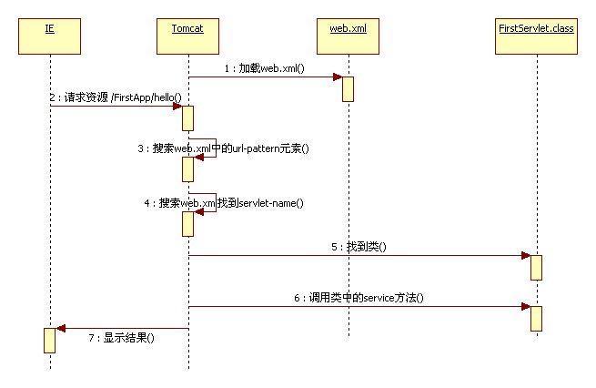
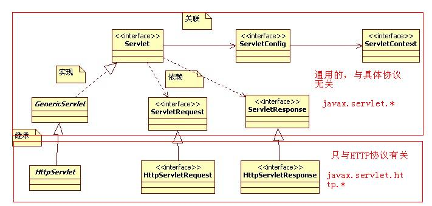

# 2.Servlet

运行原理



继承关系




## 1.servlet基础
```text
一、Servlet概述
	1、Servlet是SUN公司制定的一套开发动态网页的技术。
	2、JavaEE相关的类，包名一般都是以javax开头
		
二、编写第一个Servlet案例应用
		1、建立一个标准的JavaWeb应用目录
			FirstApp:
				WEB-INF:
					classes：
					lib:
					web.xml
					
		2、进入classes目录，建立一个文本文件（所有的Servlet类都必须间接或直接实现javax.servlet.Servlet接口）
			package cn.itcast.servlet;

			import java.io.*;
			import javax.servlet.*;

			public class FirstServlet extends GenericServlet{
				public void service(ServletRequest req, ServletResponse res) 
					throws ServletException, java.io.IOException{
					
					OutputStream out = res.getOutputStream();
					out.write("Hello Servlet".getBytes());
					out.close();
				}

			}
			
		3、进入classes目录，对FirstServlet进行编译：
			前提：把servlet-api.jar加入到你的构建路径中.set classpath=%classpath%;C:\apache-tomcat-6.0.35\lib\servlet-api.jar
			执行：javac -d . FirsetServlet.java
		
		4、修改web.xml，对FirsetServlet进行url地址映射，配置如下：
			<?xml version="1.0" encoding="ISO-8859-1"?>
			<web-app xmlns="http://java.sun.com/xml/ns/javaee"
			   xmlns:xsi="http://www.w3.org/2001/XMLSchema-instance"
			   xsi:schemaLocation="http://java.sun.com/xml/ns/javaee http://java.sun.com/xml/ns/javaee/web-app_2_5.xsd"
			   version="2.5"> 
				<servlet>
					<servlet-name>FirstServlet</servlet-name>
					<servlet-class>cn.itcast.servlet.FirstServlet</servlet-class>
						  
				</servlet>
				<servlet-mapping>
					<servlet-name>FirstServlet</servlet-name>
					<url-pattern>/hello</url-pattern>
				</servlet-mapping>
			</web-app>
		5、把你的应用部署到Tomcat中。
		6、访问地址：http://localhost:8080/FirstApp/hello就可以看到写的Servlet类的输出结果了。
		
四、Servlet的生命周期
			容器最终要调用service方法为客户进行服务
			1、Servlet接口中的常用方法：
					public void init(ServletConfig config)：初始化。Servlet类被实例化后就执行，且执行一次。由容器进行调用
					public void destroy()：销毁Servlet对象。由容器进行调用
			在内存中一个Servlet只有一个实例。针对不同的用户请求，容器采用多线程的机制调用service方法的。
			
			Servlet实例对象和初始化方法，默认情况下，只有第一次访问时才执行，且只执行一次。
			
			希望在应用被Tomcat加载完毕后（此时还没有任何人访问），就实例化并完成初始化Servlet的工作？
			<servlet>      
				<servlet-name>FirstServlet</servlet-name>
				<servlet-class>cn.itcast.servlet.FirstServlet</servlet-class>
				<load-on-startup>2</load-on-startup>
			</servlet>
			
五、Servlet的孩子们（模板方法设计模式）
		如果设计与HTTP协议有关的Servlet，一般选择集成javax.servlet.http.HttpServlet.
		不要覆盖其中的service(ServletRequest req,ServletResponse resp)方法，而应该覆盖掉，doXXX方法。
		doXXX就是根据你的请求方式来的。
		
		
		HttpServlet中的service方法是典型的模板方法设计模式的具体应用。
		
六、Servlet配置
		1、一个Servlet可以被映射到多个URL地址上
		2、URL地址映射还支持通配符*
			方式一：以*开头，以扩展名结尾。比如 <url-pattern>*.do</url-pattern>
			方式二：以/前缀开头，以*结尾。 比如<url-pattern>/action/*</url-pattern>
		3、多个Servlet使用通配符时，有可能有多
					以"/"开头（方式二）要比"*"开头（方式一）优先级高
					都以"/"开头，还是有多个匹配，找最匹配的
		4、如果一个Servlet的映射为一个"/",就称之为默认的Servlet，它负责处理没有映射路径的URL请求的响应。
			个配置的Servlet，到底执行哪一个？
			原则：优先级
					绝对匹配
					
七、Servlet中的线程安全问题
	因为Servlet是一个单例的，所以，在Servlet中定义变量，除非特殊要求，尽量使用局部变量。
	如果有需要实例变量时，应做同步处理，且同步代码块尽量包围少的代码。
	
	解决并发出现的问题，可以采用以下方式：
		(1).使用Java同步机制对多线程同步，但是运行效率低
		(2).使用SingleThreadModel接口,但是已经过时了
		(3).合理决定在Servlet中定义的变量的作用域，目前最好的解决方法。

	
八、Servlet的配置对象：
	1.ServletConfig：（容器来创建）
		作用：代表了Servlet配置中的参数信息。
		比如在web.xml中的参数配置如下：
			<servlet>
				<servlet-name>ServletDemo2</servlet-name>
				<servlet-class>cn.itcast.servlet.ServletDemo2</servlet-class>
				<init-param>
					<param-name>aaa</param-name>
					<param-value>bbb</param-value>
				</init-param>
				<init-param><!-- encoding=UTF-8 指定servlet的编码-->
					<param-name>encoding</param-name>
					<param-value>UTF-8</param-value>
				</init-param>
			  </servlet>
		
	2.servlet第一次创建的时候，执行这个方法
	private ServletConfig config;
	@Override
	public void init(ServletConfig config) throws ServletException {
		this.config = config;
		//1.获得所有的参数
		Enumeration<String> e = config.getInitParameterNames();
		while(e.hasMoreElements()){
			String name = e.nextElement();
			System.err.println(name + "=" + config.getInitParameter(name));
		}
	}
	
九、ServletContext详解
	
	1、在应用被服务器加载时就创建ServletContext对象的实例。每一个JavaWeb应用都有唯一的一个ServletContext对象
		它就代表着当前的应用。也称之为application。
		
	2、如何得到ServletContext对象：
		(1).ServletConfig.getServletContext();
		(2).tomcat7以上：req.getServletContext();
			tomcat7以下：req.getSession().getServletContext();
		(3).this.getServletContext();
		
	3、有什么用？
		(1).ServletContext对象是一个域对象（域对象就是说其内部维护了一个Map<String,Object>）
			    Object getAttribute(String name):根据名称获取绑定的对象
				Enumeration getAttributeNames() :获取ServletContext域中的所有名称
				void removeAttribute(String name):根据名称移除对象
				void setAttribute(String name,Object value):添加或修改对象。
		
		(2).实现多个Servlet之间的数据共享
		
		(3).获取WEB应用的初始化参数（应用的全局参数）
			在web.xml的根元素下配置一下信息：
			<context-param>
				<param-name>encoding</param-name>
				<param-value>UTF-8</param-value>
			</context-param>
			这些参数就属于整个应用的全局参数，使用ServletContext来读取。
		
		(4).读取资源文件的三种方式：
			
			a.利用ServletContext.getRealPath(),特点：读取WebRoot下的文件。只能在Web环境下用
			
			b.利用ResourceBundle读取配置文件,特点：可以用在非web环境下。但是只能读取类路径中的properties文件
			
			c.利用类加载器读取配置文件（专业）,特点：可以用在非web环境下。可以读取src路径下的任何文件。
				InputStream in=ServletDemo.getClass().getClassLoader().getResourceAsStream("/com/zx/db.properties");	
					

	Tips:更改MyEclipse生成的Servlet的模板（8.5）
	1、关闭你的MyEclipse
	2、找到MyEclipse的安装目录C:\Program Files\Genuitec
	3、搜索*wizard*(com.genuitec.eclipse.wizards_8.5.0.me201003052220.jar)
	4、打开，找到templates\Servlet.java,这个文件就是MyEclipse生成Servlet的模板代码
	5、弄出来，做好备份，开始修改。


十、HttpServletResponse详解
	1.输出中文数据：
		(1).字节流：
			out.write("中文".getBytes("UTF-8"));有乱码
			解决办法：
				方式一：更改浏览器的查看编码（不可取）
				
				通知浏览器，使用的码表
				方式二：response.setHeader("Content-Type", "text/html;charset=UTF-8");
				方式三：response.getOutputStream().write("<meta http-equiv='Content-Type' content='text/html;charset=UTF-8'>".getBytes("UTF-8"));
				*方式四：response.setContentType("text/html;charset=UTF-8");//方式二、三、四都是一样的
				
		(2).字符流：
			Servlet中的字符流默认查ISO-8859-1（SUN的Servlet规范要求的）4
			如何更改这个默认的编码呢？response.setCharacterEncoding("UTF-8");
			
			//不要忘记通知浏览器的编码
			response.setCharacterEncoding("UTF-8");
			response.setHeader("Content-Type", "text/html;charset=UTF-8");
			PrintWriter out = response.getWriter();
			out.write(s);//默认查的是ISO-8859-1码表（SUN的Servlet规范要求的）
			
			
			在字符流输出中文数据时：response.setContentType("text/html;charset=UTF-8");
					有两个作用：通知字符流以UTF-8编码输出
								通知客户端以UTF-8解码显示
		
		(3).一般以这样的方法处理编码问题，写到一个filter中。
			//请求中的编码以UTF-8，解析请求参数，但是只对POST请求方式有效
			request.setCharacterEncoding("UTF-8");
			
			//响应中的编码为UTF-8，用来通知浏览器。
			response.setCharacterEncoding("UTF-8");
			response.setContentType("text/html;charset=UTF-8");	
				
	2.控制页面不要缓存
		response.setHeader("Expires", "-1");
		response.setHeader("Cache-Control", "no-cache");
		response.setHeader("pragma", "no-cache");
		
	3.控制缓存时间
		//访问该页面后1小时清除缓存
		response.setDateHeader("Refresh", System.currentTimeMillis() + 60*60*1000);
	
	4.定时刷新
		response.setIntHeader("Refresh", 1);
		
	5.HttpServletResponse细节:
		字节流和字符流不能同时使用，互斥的。
		通过字符流或字节流输出的数据并不是直接打给浏览器的。而是把数据写到response对象的缓存中的。
		服务器从缓存中取出数据，按照HTTP协议的响应格式输出给浏览器。
		如果你调用的response的输出流没有主动关闭，服务器会替你关的。
	
	6.动态生成随机验证码图片
		public static void createImg(HttpServletResponse response){
			try {
				//1.在内存中创建一副图:BufferedImage
				BufferedImage img = new BufferedImage(WIDTH, HEIGHT, BufferedImage.TYPE_INT_RGB);
				
				//2.得到这个图的画笔:Graphics
				Graphics g = img.getGraphics();
				
				//3.画边框
				g.setColor(Color.BLUE);//Color.BLUE是Color这个类中预先定义好的实例,这个颜色是画笔拿蓝色的区画下面的东西
				g.drawRect(0, 0, WIDTH, HEIGHT);
				
				//4.填充背景
				g.setColor(Color.YELLOW);//换个颜色填充
				g.fillRect(1, 1, WIDTH-2, HEIGHT-2);//在内部填充颜色，防止填充盖住边框
				
				//5.画干扰线
				g.setColor(Color.GRAY);//换个颜色画线
				for (int i = 0; i < 20; i++) {
					Random r = new Random();
					g.drawLine(r.nextInt(WIDTH), r.nextInt(HEIGHT), r.nextInt(WIDTH),r.nextInt(HEIGHT));
				}
				
				//6.写随机数字
				g.setColor(Color.RED);//换个颜色写字
				g.setFont(new Font("宋体", Font.BOLD|Font.ITALIC, 20));//设置字体
				int x = 20;
				for (int i = 0; i < 4; i++) {
					Random r = new Random();
					g.drawString("" + r.nextInt(10), x, 20);
					x += 20;
				}
				
				//7.输出到页面上
				ImageIO.write(img, "jpg", response.getOutputStream());
			} catch (IOException e) {
				e.printStackTrace();
			}
		}
		//页面上
		
	    <script type="text/javascript">
	    	function img(){
	    		document.getElementById("img").src = "img?time=" + new Date().getTime();
	    	}
	    </script>
	    
	8.请求重定性
	  	response.sendRedirect("demo.jsp");
		
		//上面的实现原理：设置头信息，响应状态吗302/307，以及加载页面
		response.setStatus(302|307);
		response.setHeader("Location", "demo.jsp");  
		
十一、HttpServletRequest详解
	代表着客户端的请求。要客户的信息只要找这个对象即可，该对象由容器创建。
	学习关键：时刻记住HTTP协议的请求部分的具体内容。
	
	1.常用简单方法
		getRequestURL方法	返回客户端发出请求时的完整URL。
		getRequestURI方法	返回请求行中的资源名部分。
		getQueryString方法	返回请求行中的参数部分。
		getRemoteAddr方法	返回发出请求的客户机的IP地址
		getRemoteHost方法	返回发出请求的客户机的完整主机名
		getRemotePort方法	返回客户机所使用的网络端口号
		getLocalAddr方法		返回WEB服务器的IP地址。
		getLocalName方法		返回WEB服务器的主机名
		getMethod			得到客户机请求方式
		 
		String contextPath = request.getContextPath();// /Account_v1.0
		String servletPath = request.getServletPath();//  /user.do
		StringBuffer requestURL = request.getRequestURL();//  http://localhost:8080/Account_v1.0/user.do
		String requestURI = request.getRequestURI();//  /Account_v1.0/user.do

	2.获取请求消息头
		getHead(name)方法 
		getHeaders(String name)方法 
		getHeaderNames方法 
		
	3.获取请求参数（内省）获得客户机请求参数(客户端提交的数据)
		getParameter(name)方法
		getParameterValues（String name）方法
		getParameterNames方法 
		getParameterMap方法  //做框架用，非常实用
		
	4.常用表单数据的获取
		表单输入域类型：
			radio checkbox,即使表单中有对应名称输入域，如果一个不选择，则什么数据不会带给服务器。（注意空指针异常）
			如果选择了其中的一个或多个，则把他们的value的取值提交给服务器。
			如果选择了其中的一个或多个，他们又没有value取值，则提交给服务器的值是on.
			
		请求参数的编码：
			浏览器当前使用什么编码，就以什么编码提交请求参数。
			<meta http-equiv="content-type" content="text/html; charset=UTF-8">
			
			request.setCharacterEncoding(编码):通知程序，客户端提交的数据使用的编码。但是只对POST请求方式有效
			
			如果是get请求提交数据，编码就是ISO-8859-1
			
		Tips：目前采用POST提交方式。
		
	5.域对象：
		ServletRequest也是一个域对象（内部维护了一个Map<String,Object>）
			Object getAttribute(Stirng name):
			void setAttribute(String name,Object value):
			void removeAttribute(String name):
		
	6.请求转发和重定向
		请求转发借助于RequestDispatcher
		如何得到RequestDispatcher对象：
			方式一：ServletContext.getRequestDispatcher(目标资源的URI);
			方式二：ServletRequest.getRequestDispatcher(目标资源的URI);
			区别：
				方式一中的目标资源的URI必须以"/"开头，否则报错，此"/"就表示的是当前应用（绝对路径表示法）
				方式二中的目标资源的URI如果以"/"开头，就表示的是当前应用（绝对路径表示法）。如果不以"/"开头，就表示相对路径。
				
		
	（了解原则）7.转发和重定向细节（实际开发中知道一个原则）
		1、请求转发：由源组件转发到目标组件时，容器会清空源组件输出的数据。因此，用户只会看到目标组件输出的页面结果。
					但是，响应头信息是不清空的。
		编码原则：不要在转发前后向页面输出数据，也不要关闭输出流。（做无用功）
	（了解原则）8.包含：（动态包含）
		由源组件包含到目标组件时，容器会清空目标组件的头。因此，源组件设置的头才有效。
					但是，响应体信息是不清空的。
		编码原则：不要在目标组件中设置响应头。（做无用功）
		
十二、会话概述
	1、会话过程就好比打电话。
	2、学习会话要解决的问题是什么？
		会话过程中的数据保存。
	
十三、Cookie和HttpSession简介
		Cookie是客户端技术
		HttpSession是服务器端技术
		
十四、Cookie详细介绍
		javax.servlet.http.Cookie
		1、Cookie是什么？
			一个小信息，由服务器写给浏览器的。由浏览器来保存。
			客户端保存的Cookie信息，可以再次带给服务器。
		2、Cookie的属性：
			name：必须的
			value:必须的
			comment:可选的。注释
			path：可选的。
					写Cookie的程序的访问路径是：http://localhost:8080/day07/servlet/CookieDemo1
							其中：localhost就是域名；/day07/servlet就是当前Cookie的path
							
							
					访问的地址的URI.startWith(cookie的路径),为true就带
					
					比如IE存的cookie的路径是/day07
					现在访问的地址是：http://localhost:8080/day07/servlet/CookieDemo1  带
					现在访问的地址是：http://localhost:8080/day07/CookieDemo1          带
					
					比如IE存的cookie的路径是/day07/servlet/
					现在访问的地址是：http://localhost:8080/day07/servlet/CookieDemo1  带
					现在访问的地址是：http://localhost:8080/day07/CookieDemo1          不带
					
					如果一个Cookie的路径设置成了/day07，意味着什么？当前应用下的所有资源浏览器都会带着它给服务器。
					
			domain：可选的。该Cookie所属的网站域名。（itcast.cn）默认值。
			maximum age：可选的。不设置就是会话过程（存在浏览器的内存中）。单位是秒
							如果是0，说明要删除。
			version：可选的。
			
		3、如何向客户端写Cookie：HttpServletResponse.addCookie(javax.servlet.http.Cookie)
			（就是写了一个响应消息头：Set-Cookie:cookie的信息）
			特点：一个浏览器针对一个网站最多存20个Cookie；最多存300个Cookie，每个Cookie的长度不能超过4KB。（稀缺）
		
		4、服务器如何得到客户端传来的Cookie。HttpServletRequest.getCookies()
		
		5、如何区分Cookie：通过名称不行。
			domain+path+name来区分的。
			localhost/day07/servlet/lastAccessTime
十五、Cookie案例：
		5.1记住用户最后一次的访问时间
		
		5.2记住用户登录时的用户名
		5.3电商网站：记住用户商品的历史浏览记录
		
十六、各种URL地址的写法
		相对路径
		绝对路径：（建议的）
		绝对路径怎么写？什么时候需要加上应用名称"/day07"?
		原则：地址是不是给服务器用的，如果是,"/"就代表着当前应用。如果是给客户端用的绝对路径要加上应用名称。
		
		
		<link href=path/>                                要加/day07
		<script src=path/>								要加/day07
											要加/day07
		<a href=path/>									要加/day07
		RequestDispatcher.include(path)					不要加，"/"就代表着当前应用
		RequestDispatcher.forward(path)					不要加，"/"就代表着当前应用
		HttpServletResponse.sendRedirect(path)			要加/day07
		ServletContext.getRealPath(path)				不要加，"/"就代表着当前应用

```


## 2.request和response
```text
内容：
* response
* request
* 编码
* 路径

------------------

服务器处理请求的流程：
  服务器每次收到请求时，都会为这个请求开辟一个新的线程。
  服务器会把客户端的请求数据封装到request对象中，request就是请求数据的载体！（袋子）
  服务器还会创建response对象，这个对象与客户端连接在一起，它可以用来向客户端发送响应。（手机）

------------------


response：其类型为HttpServletResponse
  ServletResponse-->与协议无关的类型
  HttpServletResponse-->与http协议相关的类型

　　回忆一下http协议！http协议中响应的内容包含哪些东西呢？
　　* 状态码：200表示成功、302表示重定向、404表示客户端错（访问的资源不存在）、500表示服务器端错
　　　　> sendError(int sc) --> 发送错误状态码，例如404、500
　　　　> sendError(int sc, String msg) --> 也是发送错误状态码，还可以带一个错误信息！  response.sendError(404, "您要访问的资源真实的存在，就不给你看！");
　　　　> setStatus(int sc) --> 发送成功的状态码，可以用来发送302！可以用来发302，也可以发200，但不发默认为200。
　　　　案例：
　　　　> 发送404
　　* 响应头：Content-Type、Refresh、Location等等
　　　　头就是一个键值对！可能会存在一个头（一个名称，一个值），也可能会存在一个头（一个名称，多个值！）
　　　　> *****setHeader(String name, String value)：适用于单值的响应头，例如：response.setHeader("aaa", "AAA");
　　　　> addHeader(String name, String value)：适用于多值的响应头
		response.addHeader("aaa", "A");
		response.addHeader("aaa", "AA");
		response.addHeader("aaa", "AAA");
　　　　> setIntHeader(String name, int value)：适用于单值的int类型的响应头
	`	response.setIntHeader("Content-Length", 888);resopnse.setHeader("Content-Length", "888");
　　　　> addIntHeader(String name, int value)：适用于多值的int类型的响应头
　　　　> setDateHeader(String name, long value)：适用于单值的毫秒类型的响应头
		response.setDateHeader("expires", 1000 * 60 * 60 * 24);
　　　　> addDateHeader(String name, long value)：适用于多值的毫秒类型的响应头
　　　　案例：
　　　　> 发送302，设置Location头，完成重定向！
　　　　> 定时刷新：设置Refresh头，你可以把它理解成，定时重定向！
　　　　> 禁用浏览器缓存：Cache-Control、pragma、expires
　　　　> <meta>标签可以代替响应头：<meta http-equiv="Content-Type" content="text/html; charset=UTF-8">
　　* 响应体：通常是html、也可以是图片！
　　　　> response的两个流：
　　　　　　<> ServletOutputStream，用来向客户端发送字节数据。ServletOutputStream out = resopnse.getOutputStream();
　　　　　　<> PrintWriter，用来向客户端发送字符数据！需要设置编码。PrintWriter writer = response.getWriter();
　　　　　　<> 两个流不能同时使用！
　　　　案例：
　　　　> 使用PrintWriter发送字符数据
　　　　> 使用ServletOutputStream发送字节数据（图片）
　　* 重定向：设置302，设置Location！其中变化的只有Location，所以java提供了一个快捷方法，完成重定向！
　　　> sendRedirect(String location)方法

------------------

request --> 封装了客户端所有的请求数据！
请求行
请求头
空行
请求体（GET没体）

　　回忆一下http协议！请求协议中的数据都可以通过request对象来获取！
　　* 获取常用信息
　　　　> 获取客户端IP，案例：封IP。request.getRemoteAddr()
　　　　> 请求方式，request.getMethod()，可能是POST也可能是GET
　　* 获取HTTP请求头
　　　　> *****String getHeader(String name)，适用于单值头
　　　　> int getIntHeader(String name)，适用于单值int类型的请求头
　　　　> long getDateHeader(String name)，适用于单值毫秒类型的请求头
　　　　> Enumeration<String> getHeaders(String name)，适用于多值请求头

　　　案例：
　　　　> 通过User-Agent识别用户浏览器类型
　　　　> 防盗链：如果请求不是通过本站的超链接发出的，发送错误状态码404。Referer这个请求头，表示请求的来源！


　　* 获取请求URL
	http://localhost:8080/day10_2/AServlet?username=xxx&password=yyy
　　　　> String getScheme()：获取协议，http
　　　　> String getServerName()：获取服务器名，localhost
　　　　> String getServerPort()：获取服务器端口，8080
　　　　> *****String getContextPath()：获取项目名，/day10_2
　　　　> String getServletPath()：获取Servlet路径，/AServlet
　　　　> String getQueryString()：获取参数部分，即问号后面的部分。username=xxx&password=yyy
　　　　> String getRequestURI()：获取请求URI，等于项目名+Servlet路径。/day10_2/AServlet
　　　　> String getRequestURL()：获取请求URL，等于不包含参数的整个请求路径。http://localhost:8080/day10_2/AServlet

　　* 获取请求参数：请求参数是由客户端发送给服务器的！有可能是在请求体中（POST），也可能是在URL之后（GET）
　　　　请求参数：有一个参数一个值的，还有一个参数多个值！
　　　　> *****String getParameter(String name)：获取指定名称的请求参数值，适用于单值请求参数
　　　　> String[] getParameterValues(String name)：获取指定名称的请求参数值，适用于多值请求参数
　　　　> Enumeration<String> getParameterNames()：获取所有请求参数名称
　　　　> *****Map<String,String[]> getParameterMap()：获取所有请求参数，其中key为参数名，value为参数值。
　　　　案例：超链接参数
　　　　案例：表单数据

　　* 请求转发和请求包含（一个请求跨多个Servlet就是请求转发或包含！）
　　　　转发：留头不留体！！！
　　　　包含：留头又留体！！！都留！

　　　　RequestDispatcher rd = request.getRequestDispatcher("/MyServlet");  使用request获取RequestDispatcher对象，方法的参数是被转发或包含的Servlet的Servlet路径
　　　　请求转发：*****rd.forward(request,response);
　　　　请求包含：rd.include(request,response);

　　　　有时一个请求需要多个Servlet协作才能完成，所以需要在一个Servlet跳到另一个Servlet！
　　　　> 一个请求跨多个Servlet，需要使用转发和包含。
　　　　> 请求转发：由下一个Servlet完成响应体！当前Servlet可以设置响应头！（留头不留体）
　　　　> 请求包含：由两个Servlet共同未完成响应体！（都留）
　　　　> 无论是请求转发还是请求包含，都在一个请求范围内！使用同一个request和response！
　　* request域
　　　　Servlet中三大域对象：request、session、application，都有如下三个方法：
　　　　> void setAttribute(String name, Object value)
　　　　> Object getAttribute(String name)
	> void removeAttribute(String name);
　　　　> 同一请求范围内使用request.setAttribute()、request.getAttribute()来传值！前一个Servlet调用setAttribute()保存值，后一个Servlet调用getAttribute()获取值。

　　* 请求转发和重定向的区别
　　　　> 请求转发是一个请求一次响应，而重定向是两次请求两次响应
　　　　> 请求转发地址栏不变化，而重定向会显示后一个请求的地址
　　　　> 请求转发只能转发到本项目其他Servlet，而重定向不只能重定向到本项目的其他Servlet，还能定向到其他项目
　　　　> 请求转发是服务器端行为，只需给出转发的Servlet路径(/BServlet)，而重定向需要给出requestURI(/day10_2/BServlet)，即包含项目名！
　　　　> 请求转发和重定向效率是转发高！因为是一个请求！
　　　　　　<> 需要地址栏发生变化，那么必须使用重定向！
　　　　　　<> 需要在下一个Servlet中获取request域中的数据，必须要使用转发！
　　
------------------

编码（字符）
　　常见字符编码：iso-8859-1(不支持中文)、gb2312、gbk、gb18030(系统默认编码，中国的国标码)、utf-8(万国码，支持全世界的编码，所以我们使用这个)

1. 响应编码
　　* 当使用response.getWriter()来向客户端发送字符数据时，如果在之前没有设置编码，那么默认使用iso，因为iso不支持中文，一定乱码
　　* 在使用response.getWriter()之前可以使用response.setCharaceterEncoding()来设置字符流的编码为gbk或utf-8，当然我们通常会选择utf-8。这样使用response.getWriter()发送的字符就是使用utf-8编码的。但还是会出现乱码！因为浏览器并不知道服务器发送过来的是什么编码的数据！这时浏览器会使用gbk来解码，所以乱码！
　　* 在使用response.getWriter()之前可以使用response.setHeader("Content-type","text/html;charset=utf-8")来设置响应头，通知浏览器服务器这边使用的是utf-8编码，而且在调用setHeader()后，还会自动执行setCharacterEncding()方法。这样浏览器会使用utf-8解码，所以就不会乱码了！
　　* setHeader("Content-Type", "text/html;charset=utf-8")的快捷方法是：setContentType("text/html;charset=utf-8)。
2. 请求编码
　　* 客户端发送给服务器的请求参数是什么编码：
　　　　客户端首先要打开一个页面，然后在页面中提交表单或点击超链接！在请求这个页面时，服务器响应的编码是什么，那么客户端发送请求时的编码就是什么。
　　* 服务器端默认使用什么编码来解码参数：
　　　　服务器端默认使用ISO-8859-1来解码！所以这一定会出现乱码的！因为iso不支持中文！
　　* 请求编码处理分为两种：GET和POST：GET请求参数不在请求体中，而POST请求参数在请求体中，所以它们的处理方式是不同的！
　　* GET请求编码处理：
　　　　> String username = new String(request.getParameter("iso-8859-1"), "utf-8");
　　　　> 在server.xml中配置URIEncoding=utf-8
　　* POST请求编码处理：
　　　　> String username = new String(request.getParameter("iso-8859-1"), "utf-8");
　　　　> 在获取参数之前调用request.setCharacterEncoding("utf-8");

3. URL编码
　　表单的类型：Content-Type: application/x-www-form-urlencoded，就是把中文转换成%后面跟随两位的16进制。
　　为什么要用它：在客户端和服务器之间传递中文时需要把它转换成网络适合的方式。

　　* 它不是字符编码！
　　* 它是用来在客户端与服务器之间传递参数用的一种方式！
　　* URL编码需要先指定一种字符编码，把字符串解码后，得到byte[]，然后把小于0的字节+256，再转换成16进制。前面再添加一个%。
　　* POST请求默认就使用URL编码！tomcat会自动使用URL解码！
　　* URL编码：String username = URLEncoder.encode(username, "utf-8");
　　* URL解码：String username = URLDecoder.decode(username, "utf-8");

　　最后我们需要把链接中的中文参数，使用url来编码！今天不行，因为html中不能给出java代码，但后面学了jsp就可以了。

------------------

路径
　　* web.xml中<url-pattern>路径，（叫它Servlet路径！）
　　　　> 要么以“*”开关，要么为“/”开头
　　* 转发和包含路径
　　　　> *****以“/”开头：相对当前项目路径，例如：http://localhost:8080/项目名/　request.getRequestdispacher("/BServlet").for...();
　　　　> 不以“/”开头：相对当前Servlet路径。 request.getRequestdispacher("/BServlet").for...();，假如当前Servlet是：http://localhost:8080/项目名/servlet/AServlet，　就是http://localhost:8080/项目名/servlet/BServlet
　　* 重定向路径（客户端路径）
　　　　> 以“/”开头：相对当前主机，例如：http://localhost:8080/，　所以需要自己手动添加项目名，例如；response.sendRedirect("/day10_1/Bservlet");
　　* 页面中超链接和表单路径
　　　　> 与重定向相同，都是客户端路径！需要添加项目名
	> <form action="/day10_1/AServlet">
	> <a href="/day10_/AServlet">
	> <a href="AServlet">，如果不以“/”开头，那么相对当前页面所在路径。如果是http://localhost:8080/day10_1/html/form.html。　即：http://localhost:8080/day10_1/html/ASevlet
	> *****建立使用以“/”开头的路径，即绝对路径！
　　* ServletContext获取资源路径
　　　　> 相对当前项目目录，即当然index.jsp所在目录
　　* ClassLoader获取资源路径
　　　　> 相对classes目录
　　* Class获取资源路径
　　　　> 以“/”开头相对classes目录
　　　　> 不以“/”开头相对当前.class文件所在目录。


--------------------

<url-pattern>没有太多要求，它必须以“/”开头，它是在定义Servlet路径<url-pattern>


服务器端路径，不需要项目名
转发和包含：Servlet路径！

浏览器使用的都需要使用项目名，它们被称之为客户端路径！！！
重定向：需要项目和Servlet路径！
超链接：项目名和Servlet路径
表单：项目名和Servlet路径

--------------------------

<a href="http://localhost:8080/day10_4/b.html"></a>  完整绝对路径，不用解释
<a href="/day10_4/b.html"></a>  绝对路径，相对http://localhost:8080
<a href="b.html"></a>  相对路径，相对当前文件所在目录。http://locahost:8080/day10_4/xx/b.html

```

## 3.cookie和session

```text
一、cookie
	响应信息：响应头！
	1头多值
	Set-Cookie: JSESSIONID=E56F26B941C1C210D1504578FA7BF946; Path=/day11_2/; HttpOnly
	----------------------
	请求信息：请求头
	1头单值
	Cookie: JSESSIONID=E56F26B941C1C210D1504578FA7BF946
	
二、HttpSession概述及原理探讨
	得到HttpSession对象：
		HttpServletRequest.getSession():根据特殊Cookie（JSESSIONID=HttpSession对象的id,由服务器生成，唯一的）的取值，
			在服务器的内存中根据id查找这个HttpSession对象，找到了，取出来继续服务；没有找到，创建一个新的HttpSession对象。
		HttpServletRequest.getSession(boolean b):如果b为true，与上面方法功能完全一致。如果为false，只查询。
		
三、HttpSession案例：
	完成用户的一次性登录（随机验证码验证）
	简单购物原理案例
	防止表单的重复提交（Base64编码）
		Base64编码原理：把3个字节转换为4个字节
							1010 1100    0101 1111     1010 0101
			转成4个字节   0010 1011    0000    0101   0011 1110   0010 0101
					转成4个字节后，每一个字节表示的最大和最小数：00111111 ~  00000000
										63~0共64个整数，所以称之为Base64，它其实是一个码表，每个数字对应一个可见字符
			
		java.util.UUID:通用的唯一标识符
		
四、客户端禁用Cookie后的会话数据保存问题
		客户端禁用Cookie对http://localhost访问的无效
		
		url---->url;JSESSIONID=123:URL重写.必须对网站中的所有URL地址都重写。
		HttpServletResponse.encodeURL(url)：是一个智能方法。判断用户是否禁用了Cookie，没有禁用，则不重写；禁用了就重写。
		
		
		网站主页：为了更好访问本网站，请不要禁用您的Cookie。
		
五、HttpSession对象的状态及转换（序列化）
	1、如何更改内存中HttpSession对象的超时时间。
		修改web.xml
		  <session-config>
		<session-timeout>1</session-timeout><!--自然整数，单位是分钟-->
	  </session-config>
	  
注意：
	(1)关于session，session的创建是在客户端访问这个站点的时候被创建，这个session有一个id,id被保存到一个
	临时的cookie中，返回到客户端，	这就是服务器能识别客户端的依据，而当客户端关闭的时候，这个cookie被销毁，
	造成客户端再次访问的时候，获得不了这个id,只能创建新的session。
	
	(2)如果客户端屏蔽所有的session，和Cookies，那这个站点可能无法正常使用。
	
	(3)session的生命周期因服务器不同而不同，tomcat默认是30min,修改需要去tomcat/config/web.xml中,
	   它的生命周期不会因为客户端的关闭而被销毁，而我们每次对网站的操作时，都会对session进行更新，这是
	   一种session生命周期延续的技术，在tomcat 5.0以后的版本中出现
	
	(4)一切非正常的关闭服务器，都会造成session的销毁，而正常的方法(只有一种 stop service)关闭后
		服务器端当前的session都会被服务器序列化，保存在，tomcat/work/项目名      中，
		这些数据会在服务器开启时反序列化，到服务器中。	  
```


## 4.Servlet3.0注解
```text
一、Servlet3.0的新规范
	1、要求：
		jdk6.0+
		Tomcat7.0+
	2、利用注解替代了web.xml配置文件
		@WebServlet：配置Servlet的
		@WebInitParam:配置Servlet、Filter的初始化参数
		@WebFilter：配置过滤器
		@WebListener：注册监听器
		@MultipartConfig//证明客户端提交的表单数据是由多部分组成的
二、
	1.web.xml		
		<web-app version="3.0" xmlns="http://java.sun.com/xml/ns/javaee"
			xmlns:xsi="http://www.w3.org/2001/XMLSchema-instance"
			xsi:schemaLocation="http://java.sun.com/xml/ns/javaee                       
			http://java.sun.com/xml/ns/javaee/web-app_3_0.xsd" 
			metadata-complete="false">		
	metadata-complete属性是是否加载使用注解配置的web组件，false是加载，true不加载。默认加载
	
三、servlet
	使用@WebServlet将一个继承于javax.servlet.http.HttpServlet的类定义为Servlet组件。
	@WebServlet有很多的属性：
		(1).value：　　　        	Servlet的访问URL。
		(2).urlPatterns：　　   	Servlet的访问URL。
		(3).initParams：       		Servlet的init参数。
		(4).name：　　　　      	Servlet的名称,作为项目中的唯一标识。
		(5).loadOnStartup:		加载优先级，0和1已经被tomcat占用
		(5).asyncSupported：    	声明Servlet是否支持异步操作模式，默认是false。很烂，效率低，不建议使用
		(6).description：　　    	Servlet的描述。没有意义的参数。
		(7).displayName：       	Servlet的显示名称，没有意义的参数。
		
	(1).Servlet的访问URL是Servlet的必选属性，可以选择使用urlPatterns或者value定义。但是大多使用value
		如：@WebServlet(name="UserServlet",value="/user")。
		也支持定义多个URL访问：
		如：@WebServlet(name="UserServlet",urlPatterns={"/user1","/user2"})
			或者@WebServlet(name="UserServlet",value={"/user1","/user2"})
	
	(3).initParams需要初始化的参数
		initParams = {//需要初始化的参数
			@WebInitParam(name = "encoding", value = "UTF-8"),
			@WebInitParam(name = "path", value = "D://")
		}
		
	(4).name = "UserServlet",//作为项目中的唯一标识
			
四、@WebFilter
	@WebFilter有很多的属性：
		(1).value：　　　        	访问URL。
		(2).urlPatterns：　　   	访问URL。
		(3).initParams：       		init参数。
		(4).filterName：　　　　作为项目中的唯一标识 	   
		(5).servletNames:		指定需要过滤的servletName{},
		(5).asyncSupported：    	是否支持异步操作模式，默认是false。很烂，效率低，不建议使用
		(6).description：　　    	描述。没有意义的参数。
		
	(1).访问URL是Servlet的必选属性，可以选择使用urlPatterns或者value定义。但是大多使用value
		如：@WebServlet(name="UserServlet",value="/user")。
		也支持定义多个URL访问：
		如：@WebServlet(name="UserServlet",urlPatterns={"/user1","/user2"})
			或者@WebServlet(name="UserServlet",value={"/user1","/user2"})
	
	(3).initParams需要初始化的参数
		initParams = {//需要初始化的参数
			@WebInitParam(name = "encoding", value = "UTF-8"),
			@WebInitParam(name = "path", value = "D://")
		}
		
	(4).name = "UserServlet",//作为项目中的唯一标识

五、@WebListener
	属性只有一个value,作为名称使用

六、@MultipartConfig

```


## 5.ServletSecurity
```text
应用开发人员创建Web应用，他给、销售或其他方式转入应用给部署人员，部署人员覆盖安装到运行时环境。应用开发人员与部署人员沟通部署
系统的安全需求。该信息可以通过应用部署描述符声明传达，或者通过在应用代码中使用注解。本质描述了Servlet容器安全机制、接口、部署
描述符和基于注解机制用于传达应用安全需求。

一.介绍	
	web应用包含的资源可以被多个用户访问。这些资源常常不受保护的遍历，开放网络如Internet。在这样的环境，大量的web应用将有安全需求。
	尽管质量保障和实现细节可能会有所不同，但servlet容器有满足这些需求的机制和基础设施，共用如下一些特性：
	■ 身份认证：表示通信实体彼此证明他们具体身份的行为是被授权访问的。
	■ 资源访问控制：表示和资源的交互是受限于集合的用户或为了强制完整性、保密性、或可用性约束的程序。
	■ 数据完整性：表示用来证明信息在传输过程中没有被第三方修改。
	■ 保密或数据隐私：表示用来保证信息只对以授权访问的用户可用
二.声明式安全
	声明式安全是指以在应用外部的形式表达应用的安全模型需求，包括角色、访问控制和认证需求。部署描述符是web应用中的声明式安全
	的主要手段。部署人员映射应用的逻辑安全需求到特定于运行时环境的安全策略的表示。在运行时，servlet容器使用安全策略表示来
	实施认证和授权。
	安全模型适用于web应用的静态内容部分和客户端请求到的应用内的servlet和过滤器。
	安全模型不适用于当servlet使用RequestDispatcher调用静态内容或使用forward或include到的servlet。

三.编程式安全
	但仅仅声明式安全是不足以表达应用的安全模型时，编程式安全被用于意识到安全的应用。
	编程式安全包括以下HttpServletRequest接口的方法：
		■ authenticate
			authenticate方法允许应用由容器发起在一个不受约束的请求上下文内的来访者请求认证。
		■ login
			login方法允许应用执行用户名和密码收集（作为一种Form-Based Login的替代）。
		■ logout
			logout方法提供用于应用重置来访者的请求身份。
		■ getRemoteUser
			getRemoteUser方法由容器返回与该请求相关的远程用户（即来访者）的名字。
		■ isUserInRole
			isUserInRole方法确定是否与该请求相关的远程用户（即来访者）在一个特定的安全角色中。
		■ getUserPrincipal
			getUserPrincipal方法确定远程用户（即来访者）的Principal名称并返回一个与远程用户相关的
			java.security.Principal对象。调用getUserPrincipal返回的Principal的getName方法返回远程用户的名字。
		这些API允许Servlet基于获得的信息做一些业务逻辑决策。
		
		如果没有用户通过身份认证，
		getRemoteUser方法返回null，
		isUserInRole方法总返回false，
		getUserPrincipal方法总返回null。
		isUserInRole方法需要一个字符串用户的角色名称参数。
		应该在部署描述符中声明一个security-role-ref元素，其有一个role-name子元素，包含了传递到方法的角色名称。
		security-role-ref元素可能包含一个role-link子元素，其值是用户可能会被映射到的安全角色名称。
		当决定返回调用值时，容器使用security-role-ref映射到的security-role。
		
		例如，映射安全角色应用“FOO”到role-name为"manager"的安全角色的语法是：
			<security-role-ref>  
			  <role-name>FOO</role-name>  
			  <role-link>manager</role-link>  
			</security-role-ref>   
		
		在这种情况下，如果属于“manager”安全角色的用户调用了servlet，则调用isUserInRole("FOO") API的结果是true。
		如果匹配security-role元素的security-role-ref元素没有声明，容器默认必须参照security-role元素列表去检查
		role-name元素参数。isUserInRole方法参考该列表以确定调用者是否映射到一个安全角色。
		开发人员必须注意，使用默认机制可能限制了在应用中改变角色名称不必重新编译发起调用的servlet的灵活性。

四.编程式访问控制注解
	1. @ServletSecurity注解
		@ServletSecurity提供了用于定义访问控制约束的另一种机制，相当于那些通过在便携式部署描述符中声明式或通过
		ServletRegistration接口的setServletSecurity方法编程式表示。Servlet容器必须支持在实现javax.servlet.Servlet 
		接口的类（和它的子类）上使用@ServletSecurity注解。
		(1).源码
			package javax.servlet.annotation;  
			@Inherited  
			@Documented  
			@Target(value=TYPE)  
			@Retention(value=RUNTIME)  
			public @interface ServletSecurity {  
			  HttpConstraint value();  
			  HttpMethodConstraint[] httpMethodConstraints();  
			}  
		
		元素						描述													默认值
		value		HttpConstraint定义了应用到没有在httpMethodConstraints 		@HttpConstraint
					返回的数组中表示的所有HTTP方法的保护。

httpMethodConstraints	HTTP方法的特定限制数组											{}
	
	2.@HttpConstraint
		@HttpConstraint注解用在@ServletSecurity中表示应用到所有HTTP协议方法的安全约束，
		且HTTP协议方法对应的@HttpMethodConstraint没有出现在@ServletSecurity注解中。
		(1).源码
			package javax.servlet.annotation;  
			@Documented  
			@Retention(value=RUNTIME)  
			public @interface HttpConstraint {  
			  ServletSecurity.EmptyRoleSemantic value();  
			  java.lang.String[] rolesAllowed();  
			  ServletSecurity.TransportGuarantee transportGuarantee();  
			}  
			
		元素								描述												默认值
		value				当rolesAllowed返回一个空数组，（只）应用的默认授权语义。 		PERMIT
		rolesAllowed		包含授权角色的数组											{}
		transportGuarantee	在连接的请求到达时必须满足的数据保护需求						NONE
		
	3.@HttpMethodConstraint
		@HttpMethodConstraint注解用在@ServletSecurity注解中表示在特定HTTP协议消息上的安全约束。
		(1).源码
		package javax.servlet.annotation;  
		@Documented  
		@Retention(value=RUNTIME)  
		public @interface HttpMethodConstraint {  
		  ServletSecurity.EmptyRoleSemantic value();  
		  java.lang.String[] rolesAllowed();  
		  ServletSecurity.TransportGuarantee transportGuarantee();  
		}
		
		元素								描述												默认值
		value					HTTP协议方法名 											
		emptyRoleSemantic		当rolesAllowed返回一个空数组，（只）应用的默认授权语义		PERMIT		
		rolesAllowed			包含授权角色的数组										{}
		transportGuarantee		在连接的请求到达时必须满足的数据保护需求					NONE
		
	4.解释
		@ServletSecurity注解可以指定在(更准确地说，目标是) Servlet实现类上，且根据@Inherited元注解定义的规则，
		它的值是被子类继承的。至多只有一个@ServletSecurity注解实例可以出现在Servlet实现类上，且@ServletSecurity注解
		必须不指定在(更准确地说，目标是)Java方法上。

		当一个或多个@HttpMethodConstraint注解定义在@ServletSecurity注解中时，每一个@HttpMethodConstraint定义的
		security-constraint，其应用到@HttpMethodConstraint中标识的HTTP协议方法。围绕的@ServletSecurity注解定义了
		应用到所有HTTP协议方法的security-constraint，除了那些定义在@ServletSecurity中的@HttpMethodConstraint相关的HTTP协议方法。

		定义在便携式部署描述符中的security-constraint元素用于对所有出现在该约束中的url-pattern授权。

		当在便携式部署描述符中的一个security-constraint包含一个url-pattern，其精确匹配一个使用@ServletSecurity注解的模式映射
		到的类，该注解必须在由容器在该模式上强制实施的约束上没有效果。

		当为便携式部署描述符定义了metadata-complete=true时，@ServletSecurity注解不会应用到部署描述符中的任何url-pattern映射到
		（任何servlet映射到）的注解类。
		
		@ServletSecurity注解不应用到ServletRegistration使用ServletContext接口的addServlet(String, Servlet)方法创建的
		url-pattern，除非该Servlet是由ServletContext接口的createServlet方法构建的。
		
		除了上面列出的，当一个Servlet类注解了@ServletSecurity，该注解定义的安全约束应用到所有url-pattern映射到的所有Servlet
		映射到的类。
		
		当一个类没有加@ServletSecurity注解时，应用到从那个类映射到的Servlet的访问策略是由合适的security-constraint元素确定的，
		如果有，在相关的便携式部署描述符，或者由约束禁止任何这样的标签，则如果有，为目标servlet通过ServletRegistration接口的
		setServletSecurity方法编程式确定的。	


五、 示例
	1.用于所有HTTP方法，且无约束
	@ServletSecurity  
	public class Example1 extends HttpServlet {  
	}
	
	2.用于所有HTTP方法，无认证约束，需要加密传输
	@ServletSecurity(
		@HttpConstraint(
			transportGuarantee = TransportGuarantee.CONFIDENTIAL
		)
	)  
	public class Example2 extends HttpServlet {  
	}  

	3.用于所有HTTP方法，所有访问拒绝
	@ServletSecurity(
		@HttpConstraint(
		EmptyRoleSemantic.DENY
		)
	)  
	public class Example3 extends HttpServlet {  
	}  

	4.用于所有HTTP方法，认证约束需要成员身份在角色“R1”中
	@ServletSecurity(
		@HttpConstraint(
		rolesAllowed = "R1"
		)
	)  
	public class Example4 extends HttpServlet {  
	} 

	5.用于除GET和POST之外的所有HTTP方法，无约束；
	       对于GET和POST方法， 认证约束需要成员身份在角色“R1”中；
	       对于POST，需要加密传输
	@ServletSecurity((httpMethodConstraints = {  
        @HttpMethodConstraint(value = "GET", rolesAllowed = "R1"),  
        @HttpMethodConstraint(value = "POST", rolesAllowed = "R1",  
        transportGuarantee = TransportGuarantee.CONFIDENTIAL)  
    })  
	public class Example5 extends HttpServlet {  
	}

	6.用于除了GET之外的所有HTTP方法，认证约束需要成员身份在“R1”角色中；对于GET，无约束
	@ServletSecurity(
		value = @HttpConstraint(rolesAllowed = "R1"),  
        httpMethodConstraints = @HttpMethodConstraint("GET")
    )  
	public class Example6 extends HttpServlet {  
	}  
	
	7.用于除了TRACE之外的所有HTTP方法，认证约束需要成员身份在“R1”角色中；对于TRACE，拒绝所有访问
	@ServletSecurity(
		value = @HttpConstraint(rolesAllowed = "R1"),  
        httpMethodConstraints = @HttpMethodConstraint(
        value="TRACE",  
		emptyRoleSemantic = EmptyRoleSemantic.DENY
		)
	)  
	public class Example7 extends HttpServlet {  
	}  
```