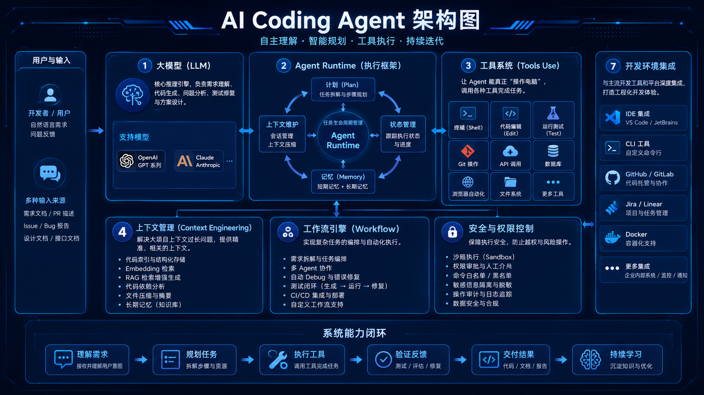
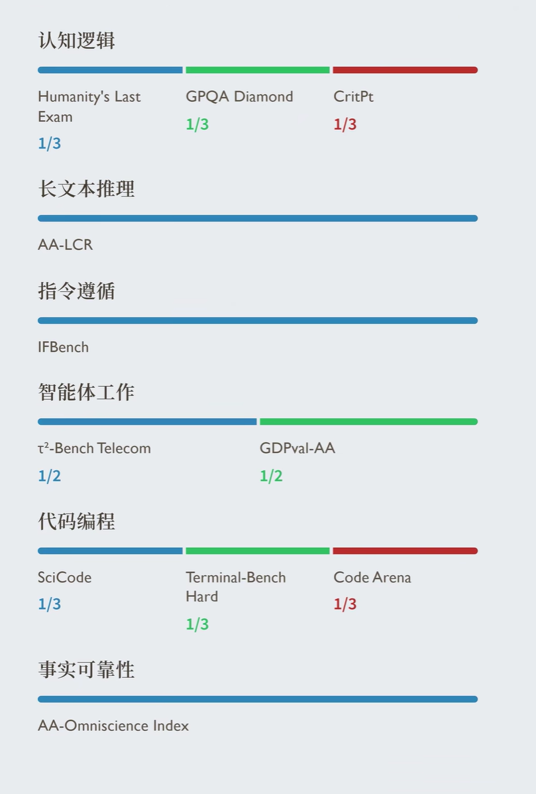
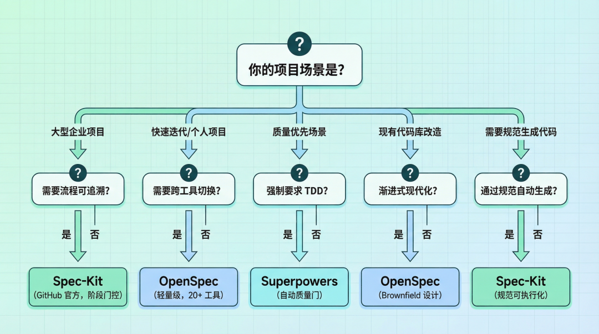
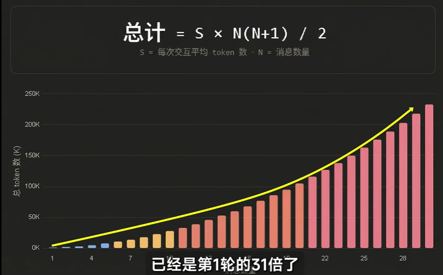

# 1.AI编程

## 介绍

### 1.AI 编程核心
AI编程两大核心支柱的角色 大模型 与 智能体。

1. 大模型 (Large Model)。在AI编程中的角色是大脑。提供强大的自然语言理解与生成能力，是知识、代码生成和逻辑推理的源泉。但它通常“只会说，不会做”。
2. Agent (智能体)。是行动的“身体”与“协调中枢”。具备自主规划、决策、调用工具（API、搜索引擎、代码解释器）和执行的能力。它围绕大模型进行任务拆解和调度，以完成复杂目标

工作流程：
1. 接收任务：你向AI编程助手（通常是一个Agent）提出需求，例如“创建一个用户登录的RESTful API”。 
2. 规划与调用：Agent理解需求后，会利用其内置的大模型“大脑” 进行思考，规划实现步骤（如：需要生成用户模型、验证逻辑、JWT token处理等），
   并可能调用代码生成、文件读写等工具。
3. 执行与迭代：Agent协调各个步骤，生成代码文件，甚至运行测试。如果出错，它会再次调用大模型分析错误并修复，形成一个自主的“思考-行动”闭环。

### 2.Ai Coding Agent架构



AI Coding Agent 的核心组成通常包括以下几个模块：

1. 大模型（LLM）：核心推理引擎，负责需求理解、代码生成、问题分析、测试修复与方案设计。常见模型包括：GPT、Anthropic Claude 等。
2. Agent Runtime（执行框架）：负责管理任务生命周期，包括上下文维护、步骤规划（Plan）、记忆（Memory）、状态管理与多轮推理。
3. 工具系统（Tools Use）：让 Agent 能真正“操作电脑”，例如调用终端、编辑代码、运行测试、执行 Git、访问 API、数据库或浏览器。例如：MCP、tool、sandbox、worktree
4. 上下文管理（Context Engineering）：负责代码索引、Embedding 检索、RAG、代码依赖分析、文件压缩与长期记忆，解决大项目上下文过长问题。
5. 开发环境集成：与 IDE、CLI、GitHub、Jira、Docker 等系统集成，实现真正的工程化开发体验。
6. 工作流引擎（Workflow）：实现需求拆解、任务编排、多 Agent 协作、自动 Debug、测试闭环与 CI/CD 集成。
7. 安全与权限控制：限制危险操作，提供沙箱执行、权限审批、命令白名单与敏感信息隔离。

### 3.大模型api数据结构

#### 3.1.大模型请求数据结构

```json
{
  "model": "gpt-4o",
  "messages": [
    {
      "role": "system",
      "content": "你是一个专业的AI助手，擅长用简洁明了的方式回答问题。"
    },
    {
      "role": "system",
      "content": "{# 某某某 skills、role的内容#}"
    },
    {
      "role": "user",
      "content": "请解释一下什么是大模型的 Harness 机制。"
    }
  ],
  "tools": [  // <-- 这里！MCP 工具在这里注册，不在 messages 里
    {
      "type": "function",
      "function": {
        "name": "get_weather",
        "description": "获取指定城市的天气",
        "parameters": {
          "type": "object",
          "properties": {
            "city": {"type": "string", "description": "城市名"}
          },
          "required": ["city"]
        }
      }
    }
  ],
  "temperature": 0.7,
  "max_tokens": 1000,
  "top_p": 1,
  "frequency_penalty": 0,
  "presence_penalty": 0,
  "stream": false,
  "response_format": {
    "type": "text"
  },
  "seed": 42
}

model 指定使用的模型，如 gpt-4o、gpt-4-turbo 或 gpt-3.5-turbo。
messages 对话历史数组。system 设定角色性格，user 是用户输入，assistant 是历史回复。
temperature 创造力控制（0-2）。越低越严谨（适合代码/数据），越高越发散（适合创意写作）。
max_tokens 限制回复的最大长度（注意：输入+输出总 token 数不能超过模型上限）。
stream 是否启用流式传输。设为 true 时，数据会像打字机一样逐字返回。
response_format 强制输出格式。若设为 {"type": "json_object"}，则强制模型回复合法的 JSON。
seed 随机种子。配合 temperature 使用，设定固定值可使回复结果尽量一致（可复现性）。
tools 工具、mcp注册机制。将本地所有的工具和mcp提交给大模型，让其判断调用哪个。
```

#### 3.2.核心消息结构

```json
[
  {
    "role": "system",
    "content": "你是一个助手，可以使用工具查询实时信息。"
  },
  {
    "role": "user",
    "content": "北京今天天气怎么样？"
  },
  {
    "role": "assistant",
    "content": null,
    "tool_calls": [
      {
        "id": "call_abc123",
        "type": "function",
        "function": {
          "name": "get_weather",
          "arguments": "{\"location\": \"北京\"}"
        }
      }
    ]
  },
  {
    "role": "tool",
    "tool_call_id": "call_abc123",
    "content": "{\"temperature\": \"15°C\", \"condition\": \"晴\"}"
  }
]
```

| Role      | 发送方  | 作用                                 |
|:----------|:-----|:-----------------------------------|
| system    | 开发者  | 设定模型的行为准则（Prompt Engineering 的核心）。 |
| user      | 用户   | 用户的输入、问题或指令。                       |
| assistant | 模型   | 模型的回复。在多轮对话中，你需要把它存下来发回去。          |
| tool      | 开发者  | (新增) 函数/工具的执行结果，喂回给模型以继续推理。        |

#### 3.3.⭐️为什么需要这些？

这正是 Harness（工程化） 的体现：
1.  Context Management（上下文管理）：通过交替发送 `user` 和 `assistant` 消息，维持对话状态。
    - 也就是：大模型想要实现对话就需要不断地把历史对话保存下来，下次对话的时候，一起重复提交过去。
    - 这就是为什么在一次会话中，多轮次的对话，token的消耗成指数上涨，因为每次对话都把历史对话都重复提交给模型。
2.  Tool Integration（工具集成）：通过 `assistant` (发起调用) -> `tool` (返回结果) 的闭环，让大模型不仅能“说”，还能“做”。
3. role、skills本质是什么：都是提示词功能，将消息放入到system中，传入模型中，让模型能够理解并生成相应的内容。
4. MCP本质是什么：就是某种规范化通讯协议的tool。

### 4.专业名词
1. LLM。
   - message：用户输入或模型输出的消息。也就是人机交互的对话内容，历史对话内容会来回传输。
   - 上下文：也就是memory，大模型保存历史对话，大模型会不断的回顾历史对话，以帮助其更好的理解任务并生成高质量的代码。
     - 上下文大小取决于大模型，通常有100k~200k tokens。
     - 大模型在上下文达到75%以上的时候，就会产生“上下文焦虑”，任务会敷衍完成，遗忘历史信息等，无法高质量完成任务。
     - 上下文压缩：压缩历史对话，保存关键信息，减少无用信息，提高处理效率，能保存更久的历史。
   - Tool: 工具功能，提供外部工具调用，例如文件阅读、编辑、终端、预览、联网等。
   - MCP:在AI编程中用于调用外部服务，如文件操作、数据库操作等，通常需要自定义。本质也是一种Tool
   - agent：ai agent，也称为自主代理，是能够独立完成任务的AI系统。
2. 提示词工程。
   - rule：用于限制agent的行为，例如不允许agent访问某些敏感信息，或者不允许agent进行某些操作。
   - Skill: 给agent上下文技能列表，按需也就是给自己装技能，把新能力直接塞进脑子里。
3. AI集成工具。
   - CUE（Context Understanding Engine）：上下文理解引擎，能理解上下文，能生成高质量的代码。使用tag按键接受cue的内容。
   - 工作模式: 
     - Plan 模式（规划模式）：特点：先规划，再逐步实现。
     - YOLO（You Only Live Once）：直接干、一步到位生成代码。不同的工具名字不同，例如trae叫做build
   - hook：钩子，用于在agent执行过程中，拦截并执行某些操作，例如日志记录、性能监控、权限控制等。
   - subagent: 子代理，节省token，基于父子agent，plan调度，，subagent在另外一个session中运行,汇报给主agent结果。（减少无用信息，提高处理效率）
   - agent team：启动多个claude code实例，分别完成不同的任务。agent之间共享上下文、可以相互协调完成功能。
4. 自动化
   - OpenClaw：是一款本地优先、可自托管、开源的 AI 自主代理（Agent）执行引擎，核心是让 AI 从 “只会聊天” 变成 “能动手干活” 的数字助理。
       官网：[https://docs.openclaw.ai/](https://docs.openclaw.ai/)
   - Hermes。本质上是一套包裹在大模型外部的“全链路工程化控制系统”。是真正实现agent的工程化、规模化、产业化。一次性解决沙箱、长会话、权限、恢复、追踪等问题。

### 5.Anthropic
在ai coding领域不能不提到Anthropic公司及其主线产品claude系列产品。
1. 2026年最新动向：Claude Design 的发布标志着 Anthropic 从对话助手向专业工具领域扩展
2. 模型升级：Opus 4.7 重新夺回编码能力榜首，强化 Agent 场景表现
3. 生态布局：从个人工具 → 企业级 → 行业垂直解决方案，覆盖全场景

#### 5.1.产品总览图

```text
┌─────────────────────────────────────────────────────────┐
│                    Claude 生态体系                        │
├─────────────────────────────────────────────────────────┤
│  ┌─────────────┐  ┌─────────────┐  ┌─────────────┐     │
│  │ Claude.ai   │  │ Claude Code │  │Claude Cowork│     │
│  │  (对话助手)  │  │  (编码工具)  │  │  (协作平台)  │     │
│  └─────────────┘  └─────────────┘  └─────────────┘     │
│  ┌─────────────┐                                        │
│  │Claude Design│  ← 2026.4.17 全新发布                   │
│  │  (设计工具)  │                                        │
│  └─────────────┘                                        │
├─────────────────────────────────────────────────────────┤
│  模型层: Opus 4.7 / Sonnet 4.6 / Haiku 4.5 / Mythos     │
├─────────────────────────────────────────────────────────┤
│  API层: Platform / Console / 云集成 (AWS/GCP/Azure)    │
├─────────────────────────────────────────────────────────┤
│  集成层: Chrome / Slack / Excel / PPT / Word           │
└─────────────────────────────────────────────────────────┘
```

#### 5.2.模型
核心 AI 模型系列。目前断档第一

| 模型 | 定位 | 特点 |
|------|------|------|
| Claude Opus 4.7 (最新旗舰) | 最强旗舰模型 | 复杂分析、深度研究、高难度编码（64.3% SWE-bench） |
| Claude Sonnet 4.6 | 多功能模型 | 日常工作任务，平衡性能与成本 |
| Claude Haiku 4.5 | 轻量快速模型 | 快速回答、搜索场景、低延迟 |
| Claude Mythos (预览版) | 实验性模型 | 内部更强模型，限量开放测试 |

#### 5.3.核心产品与应用

产品核心：优秀的提示词。

第一：Claude.ai (网页/桌面/移动)

| 平台       | 说明                                      |
|----------|-----------------------------------------|
| 网页版  | claude.ai 直接访问                          |
| 桌面应用 | macOS / Windows 原生 App                  |
| 移动应用 | iOS (App Store) / Android (Google Play) |

第二：Claude Code (编码工具)

| 版本                             | 说明               |
|--------------------------------|------------------|
| Claude Code                | 面向个人开发者的 AI 编码助手 |
| Claude Code for Enterprise | 企业版，支持中央管理、权限控制  |
| Claude Code Security       | 代码安全扫描与防护        |

第三：Claude Cowork (协作平台)
- 与本地文件和云应用深度集成
- 任务自动化和工作流程管理

第四：Claude Design

| 信息       | 内容                               |
|----------|----------------------------------|
| 发布时间 | 2026年4月17日                       |
| 定位   | 对话驱动的 AI 设计工具                    |
| 能力   | 生成交互原型、PPT/Landing Page、动画       |
| 特点   | 基于 HTML 输出，内置 Starter Components |
| 目标用户 | 创始人、产品经理（非设计师）                   |
| 状态   | Research Preview                 |

第五：浏览器扩展与应用集成

| 集成产品                      | 功能         |
|---------------------------|------------|
| Claude for Chrome     | 浏览器内直接对话   |
| Claude for Slack      | 团队通讯集成     |
| Claude for Excel      | 电子表格 AI 辅助 |
| Claude for PowerPoint | 演示文稿 AI 生成 |
| Claude for Word       | 文档处理 AI 辅助 |

## 代码理解与检索

### 1.介绍

让AI能够理解代码，而不是简单的字符串匹配。

常见的方案包括
1. RAG：把代码库变成可被语义检索的知识库。主要应用：cursor、trae等开发工具的辅助编程。
2. 符号索引：通过LSP解析AST，提取函数、类、变量定义及其调用关系，存入符号表。例如open code默认开启。
3. 文本匹配：通过grep/read等工具提取代码中的符号定义/引用。例如claude code。

现代AI编程工具已从单轮补全进化到多步Agent。
Claude Code、Cursor Composer、Windsurf Cascade等模型都能自主规划、跨文件编辑、运行终端命令、执行测试并迭代。
Claude Code在第三方基准测试中拿下多文件重构、Bug修复、测试生成、代码解释、综合Agent任务五个维度第一，其终端优先的工作流对老手高效但对新入行者有门槛。

### 2.技术实现
1. 索引构建：把代码变成可检索的结构
   - 分块（Chunking） 是第一步。代码文件动辄上千行，而Embedding模型有上下文长度限制，必须切分。最佳实践是基于AST按函数/类边界切分，保证语义完整性；行数切分（如35-65行随机）作为兜底，但容易切断函数。
   - 向量嵌入（Embedding） 将每个代码块映射为高维向量，支持语义相似度检索。
     - Cursor使用OpenAI的嵌入模型 + Turbopuffer向量数据库；
     - GitHub Copilot在2025年自研并部署了专门针对代码和文档优化的嵌入模型，在多基准评测上相对提升37.6%，C#代码接受率提升110.7%；
     - Qodo自研了Qodo-Embed-1（1.5B参数，在CoIR基准上超越7B竞品）。
   - 符号索引。通过tree-sitter或LSP解析AST，提取函数、类、变量定义及其调用关系，存入符号表。tree-sitter是GitHub开源的增量解析器，支持容错解析（代码写一半也能解析），适合编辑器实时场景；LSP则基于编译器实现，能做跨文件引用解析和类型推断，更"懂语义"但更重。
   - 代码知识图谱。更进一步的演进。LocAgent等研究将代码库解析为有向异构图，节点是文件/类/函数，边是import、invoke、inherit关系，Agent可通过多跳推理定位代码，文件级定位准确率达92.7%。Augment Code和Qodo走的就是"向量索引 + 代码图"混合路线。
2. 检索召回：从问题到相关代码
   - 混合检索（Hybrid Retrieval） 是当前主流。纯向量检索在找精确符号（如错误码、API端点）时不如grep快且准，因此Augment Code采用"grep精确匹配 + codebase-retrieval语义搜索"双引擎并行，由系统智能路由决定用哪个。Cursor则更激进地走纯向量路线，所有查询统一走语义搜索，哲学是"简单够用"。
   - 增量索引。解决"代码改了索引还是旧的"痛点。Cursor用Merkle树数据结构检测文件变化，结合SHA-256内容哈希指纹，只对变化部分局部更新；在5万文件项目中，修改单文件的增量索引可在0.15秒内完成。Augment Code则做到秒级实时更新和分支感知，切换分支时索引跟着切换。
3. 上下文组装与LLM推理
   - 检索到的片段需要组装成模型可理解的上下文。典型结构是：系统提示词 + 用户请求 + 检索到的代码片段/依赖关系/架构说明 + 工具定义（edit_file、run_tests等）。
     - Cursor通过`@Codebase`、`@Files`、`@Git Changes`、`@Docs`等引用机制让用户显式控制上下文范围；
     - GitHub Copilot在Ask模式下用`#codebase`把整个工作区纳入上下文。
   - 选择性检索。是一个值得关注的研究方向。ICML 2025的论文发现80%的情况下检索并未提升代码生成质量，反而增加延迟。Repoformer通过微调模型判断"是否需要检索"，在保持质量的同时把推理速度提高了70%。这说明"无脑RAG"并非最优。

### 3.主流工具技术对比

| 工具                 | 检索机制                                                     | 上下文窗口                  | 索引特点                                                                                             | 代码理解模型                                  | 优势场景                                 |
|--------------------|----------------------------------------------------------|------------------------|--------------------------------------------------------------------------------------------------|-----------------------------------------|--------------------------------------|
| Claude Code        | Agent探索式检索（grep/Read循环）                                  | 全项目扫描                  | 终端优先，靠Explore subagent动态发现代码，无预建索引                                                               | Claude原生                                | 多文件重构、Bug修复、测试生成，Agent任务质量最强         |
| Codex（OpenAI）      | Agent 探索式检索（grep/glob/Read 循环）+ `@`提及 + `#Codebase` 语义检索 | 依模型而定，支持 `/compact` 压缩 | 无预建向量索引，靠 `AGENTS.md` + Memory 系统 + Subagent；云端沙盒预装代码库                                           | GPT-5.2-Codex / Codex-1（o3 微调）/ o4-mini | 终端优先、沙箱隔离安全、开源 Rust 可审计、多智能体并行、长任务异步 |
| OpenCode           | LSP 感知 + Agent 探索式检索（explore/scout subagent 只读分析）        | 依所选模型而定                | 开源客户端-服务器架构，无固定预建索引，靠 LSP 自动加载语言服务器提供补全与诊断；通过 `@` 模糊搜索文件、scout 子代理克隆依赖仓库做交叉引用；支持 RAG 知识库与 MCP 扩展 | 内置多种模型                                  | 终端优先、隐私优先、模型自由、可远程驱动的开源 Agent        |
| Cursor             | 纯向量语义搜索 + `@`引用                                          | 200K token             | Merkle树增量同步、Turbopuffer向量库、本地分块+云端嵌入                                                             | Claude/GPT可选                            | IDE内补全与多文件编辑，TS补全全场最佳                |
| Trae（字节跳动）         | `#Workspace`/`#Folder` 语义检索 + CUE 智能预测                   | 依模型而定                  | 10 万级文件、1.5 亿行代码索引能力（字节内部验证）；≤5000 文件项目自动构建索引，>5000 手动触发；支持忽略文件配置保护敏感数据                          | 内置多种模型                                  | 国产 AI 原生 IDE，中文需求理解强，大文件项目索引稳定       |
| CodeBuddy（腾讯云）     | `@Codebase`/`#Codebase` 语义检索 + 工程理解智能体 Plus 跨文件依赖图谱      | 200K token             | 跨文件依赖图谱构建、项目快照持久记忆、增量索引；国内首家支持 MCP 协议，可接 CNB/TCA 等外部工具扩展检索；支持企业 RAG 知识库                          | 内置多种模型                                  | 国产生态集成、微信/腾讯云知识库、私有化部署、200+ 语言补全     |
| GitHub Copilot     | 自研代码嵌入模型语义检索                                             | 依模型而定                  | 新嵌入模型使检索质量+37.6%、吞吐2倍、索引体积缩8倍                                                                    | GPT/Claude多模型可切换                        | 日常补全、Chat/Agent/Edit/Ask多模式          |
| Cline              | 依赖所接入模型的工具调用                                             | 依模型而定                  | 开源可审计，工具调用实时可见，可配MCP扩展检索能力                                                                       | Claude/GPT/Gemini/本地模型任选                | 成本可控、模型灵活、透明度高                       |
| Windsurf (Cascade) | 流感知上下文 + 代码库扫描                                           | 上下文窗口指示器可监控            | Cascade持续监控工作区/终端/编辑动作，保持与开发流同步                                                                  | SWE-1.5自研模型（默认免费）                       | 自主多步重构、终端双向集成                        |
| Augment Code       | grep + 向量混合检索 + 跨仓库代码图                                   | 200K token             | 实时秒级更新、分支感知、2GB索引压缩到250MB、Context Lineage索引commit历史                                              | 自研模型                                    | 10万+文件企业级单体库、跨服务依赖分析                 |

### 4.代码检索对比

常见方案如下：
1. RAG：把代码库变成可被语义检索的知识库。主要应用：cursor、trae等开发工具的辅助编程。
2. 正则匹配：根据正则表达式模式，从文本中提取出符合条件的代码片段。主流AI Agent的任务过程中使用
3. LSP(语言服务器协议)：是一种用于在不同编辑器或 IDE 中实现代码智能感知和自动完成的协议，可以实现代码分析、补全、定义跳转等功能。

案例1：claude code
1. 使用Glob、Grep、Read 这种实时工具，而不是rag语义检索。在新版本中升级使用ripgrep。 
 在代码搜索场景里，“确定性”和“新鲜度”往往比语义召回更重要； 并且搜索的过程也是Ai对项目熟悉的过程

案例2：cursor/Trae 的文件检索分为“传统文本检索”和“AI 语义检索”两个层面
1. 基础文本检索层：Ripgrep。
2. AI 语义检索层：Tree-sitter + 向量检索。
   - 使用 Tree-sitter 按语法边界把代码切成块（不是AST），可以保证切出来的代码块是完整的逻辑单元，不会把一个函数从中间劈开，从而大幅提升 AI 阅读代码的准确率
   - 向量化与索引：Embedding 模型 + 本地向量数据库。Trae后台扫描项目后，将 Tree-sitter 切好的代码块，通过嵌入模型转化为高维向量，并存入本地的向量数据库（如基于 SQLite 的向量扩展或 LanceDB 等轻量级方案）。

差异对比：
1. Claude Code：默认将代码视为纯文本，通过grep或者Ripgrep进行字符串匹配来查找函数定义，过程中模型无法理解代码。
   其LSP功能默认关闭：开启后token消耗大，LSP服务器占用资源多，且即使开启claude模型因训练时大量使用grep产生“肌肉记忆”而习惯性不使用LSP。
2. OpenCode：将LSP作为第一方基础设施内置，支持30多种语言服务器，开箱即用。但其存在严重的“孤儿进程”问题，退出后语言服务器进程不会自动关闭，会持续累积占用内存等bug。
3. Cursor：采用最复杂的工程方案，在后台通过`tree-sitter`和向量数据库建立语义索引，实现基于语义的代码搜索（准确率比关键词搜索高约12.5%）。
    同时，它通过“影子工作区”机制，让AI在不可见的窗口中自动获得LSP的诊断反馈，实现了“生成→诊断→修正”的闭环，对用户完全透明。

折射的产品哲学：
- OpenCode：主张“显式工具化”，让AI能主动感知和调用LSP等工具。
- Cursor：追求“对用户透明”，让AI自动获得反馈，用户无需关注细节。
- Claude Code：态度保守，将LSP视为高级用户的可选增强功能，而非核心能力。

给用户的建议：
- 追求代码理解准确性，Cursor的向量索引是护城河。
- 看重AI的主动感知能力，OpenCode的LSP集成更成熟，但需注意进程管理。
- 使用Claude Code时，若开启LSP，务必在`CLAUDE.md`中明确指示“优先使用LSP工具而不是`grep`”，否则可能无效。

### 5.代码向量化

#### 5.1.分块策略

决定嵌入质量的上限。常见的分开策略如下：

| 策略                 | 实现方式                                                | 优点                          | 缺点                      |
|--------------------|-----------------------------------------------------|-----------------------------|-------------------------|
| 字符/行数切割            | 按固定 token 数（如 500）切片                                | 实现最简单                       | 把函数从中间切断，丢失作用域、签名等上下文   |
| 递归字符分割             | 按 `\n\n`→`\n`→`. ` 递归切分                             | 优先在自然边界断开                   | 不懂代码语法，仍可能切坏结构          |
| Tree-sitter AST 分块 | 解析语法树，按 function/class/method 节点切分，子树过大再向下拆、过小与兄弟合并 | 保留语义完整性，NDCG@10 从 0.67→0.89 | 需为每种语言维护 grammar 和节点白名单 |
| LSP 符号索引           | 用 Language Server 获取精确符号定义/引用                       | 类型信息最准                      | 需启动语言服务器，重量级            |
| 代码图谱               | 在 AST 基础上提取 import、调用、继承关系建图                        | 支持跨文件关联检索、图遍历召回             | 构建和维护成本高                |

Tree-sitter 之所以成为多数工具的实施标准，是因为它"统一接口 + 多语言 + 增量解析"——一套框架换 grammar 就能解析新语言，毫秒级完成。
Cursor、Continue、Claude-context、ctx-sys 都用它做 AST 分块。

#### 5.2.嵌入模型选型

| 模型                            | 类型     | 维度        | 代码检索表现                   | 适用场景           |
|-------------------------------|--------|-----------|--------------------------|----------------|
| OpenAI text-embedding-3-small | 云端 API | 1536（可截断） | 通用、性价比高                  | 成本敏感、云端方案      |
| OpenAI text-embedding-3-large | 云端 API | 3072      | 高精度                      | 追求检索质量         |
| Voyage voyage-code-3          | 云端 API | 1024      | MTEB 代码任务 71.2，商业 API 最优 | 代码库检索首选        |
| BAAI/bge-m3                   | 本地开源   | 1024      | 中文+多语言强                  | 本地/隐私/离线部署     |
| nomic-embed-text              | 本地开源   | 768       | 轻量快速                     | Ollama 生态、本地优先 |
| CodeBERT / GraphCodeBERT      | 本地开源   | 768       | 代码语义专精                   | 代码理解专项任务       |
| GitHub Copilot 自研模型           | 云端     | —         | 检索质量 +37.6%、索引体积 8x 缩小   | Copilot 专属     |

实测数据上，OpenAI large（28 分）与 bge-m3（24 分）差距约 3 倍，而成本相差 10 倍——本地 bge-m3 在开发测试阶段基本够用。
OpenAI 3.x 系列支持 Matryoshka 截断，可按需降维省存储。

#### 5.3.向量存储与检索
- 本地优先：Continue.dev 用 LanceDB（嵌入式向量库），ctx-sys 用 SQLite + FTS5，数据不出机器
- 服务端大规模：Cursor 自研 Turbopuffer，对象存储（S3/GCS）打底 + SSD/RAM 分层缓存，每 TB 成本从 3600 美元降到 70 美元，p99 延迟控制在 50ms
- 检索算法：HNSW 近似最近邻是主流；进阶工具用 RRF（Reciprocal Rank Fusion）融合向量+关键词+图遍历结果

#### 5.4. 增量更新
- Merkle 树：Cursor 的招牌，叶子节点是文件内容哈希，非叶子是子节点哈希的哈希，对比根哈希即可定位变更文件，每 10 分钟同步一次只上传变动部分
- 内容指纹：对每个文件算 SHA-256，哈希不变就跳过重索引，单文件修改后毫秒级更新
- chunk 缓存：以 chunk 哈希为 key 缓存嵌入向量，相同代码块跨用户复用

#### 5.5. 隐私与安全
Cursor 采用路径分段加密（客户端持密钥）、只传向量不传代码原文、Git commit SHA 参与密钥派生；Continue/ctx-sys 这类本地方案则从根本上避免代码外传。

### 6.选型逻辑解读

1. Cursor：作为商业云端产品，核心诉求是"大规模代码库的低成本检索 + 隐私合规"。
   - AST 分块保证嵌入质量，Turbopuffer 把存储成本压到传统向量库的 1/50，Merkle 树解决增量同步带宽问题，路径加密+不传原文满足企业安全要求。
   - 代价是必须联网、向量有理论可逆风险。
2. GitHub Copilot：背靠 GitHub 生态，2025 年推出自研嵌入模型，重点优化"检索质量、吞吐、索引体积"三个指标，让 VS Code 内存占用更低、响应更快。
   - semantic_search tool 深度集成在插件里，自动触发索引，对用户透明。
3. Continue.dev：开源定位决定了"本地优先 + 模型自由"。
   - 用 LanceDB 做嵌入式向量存储，嵌入模型在 config.yaml 里随意切换（Ollama 本地 / OpenAI / Voyage），适合隐私敏感场景和想自主可控的开发者。
4. Sourcegraph Cody：从代码搜索引擎起家，天然有"代码图谱"基因。它不只用向量，而是把符号定义、引用、调用关系建成图，检索时向量召回+图遍历+关键词三路融合，在跨仓库、大型遗留系统理解上优势明显。
5. ctx-sys / Claude-context 等本地工具：面向 MCP 生态的轻量方案，Tree-sitter AST + SQLite + 本地嵌入模型，用 RRF 融合向量/FTS5/图遍历，定位是给任意 AI 助手提供"代码大脑"。

选型建议
- 商业云端产品（Cursor、Copilot）：服务端嵌入 + 自研/优化模型 + 大规模向量库 + Merkle 增量，换取低成本、低延迟、强检索质量，代价是需联网和一定的数据上传。
- 开源本地工具（Continue、ctx-sys）：LanceDB/SQLite + 可配置嵌入 + 本地 AST 分块，换取隐私和可控性，适合内网、敏感项目
- 代码理解深度场景（Sourcegraph）：代码图谱 + 符号索引 + 混合检索，换取跨文件、跨仓库的语义关联能力，适合大型企业级代码库

实际选型时
- 分块策略选 Tree-sitter AST 几乎没有争议；
- 嵌入模型在"云端 voyage-code-3 / OpenAI 3-large"和"本地 bge-m3"之间按隐私和成本取舍；
- 存储则按团队规模在"本地 LanceDB"和"服务端 Turbopuffer/Qdrant"之间选择。

## Memory

记忆机制：分层存储与上下文注入，实现从"记住"进化到"理解"。

Memory实现，本质都是一条"写入触发 → 存储分层 → 检索召回 → 上下文注入"的流水线，差异在于:
1. 存储介质（Markdown 文件 vs 向量库 vs 键值 DB）
2. 记忆层级（会话级/项目级/用户级/企业级）
3. 写入时机（人工手写 vs Agent 自动沉淀 vs 定时提炼）。

### 1.分层设计

大部分AI工具都采用了分层设计的原则。

例如Claude Code，通常分为会话级、项目级（如`CLAUDE.md`、`AGENTS.md`）、用户级和企业级规则。项目级文件可随Git共享，用户级跨项目生效。

例如Cursor等工具采用四层设计：L1~L4分层模式。（目前最为主流，技术方案最多）
- L1 工作记忆——当前对话上下文，随会话结束消失，所有Agent的默认能力
- L2 长期记忆——持久化知识库，跨会话跨任务可用，Mem0的核心能力
- L3 情景记忆——记住上次怎么做的，任务轨迹+成功失败经验+用户偏好，claude-mem的核心场景
- L4 自演化记忆——Agent自主发现冲突、合并重复、遗忘过时信息，MemOS的核心能力

常见方案对比：
- Mem0，L1+L2，向量RAG检索，最成熟的通用长期记忆
- claude-mem，L1+L2+L3，混合检索，Claude Code用户首选
- MemOS，全四层，图结构+向量，唯一支持自演化的记忆OS

选型建议：用Claude Code直接选claude-mem，需要自演化选MemOS，需要图结构选nocturne_memory，其他场景选Mem0

### 2.写入与召回

写入与召回：从纯人工手写规则，演进为Agent自动提取沉淀（如Codex的两阶段管道、CodeBuddy的夜间定时提炼）。但当前召回多为关键词匹配，语义向量检索尚未全面普及。

常见方案：
1. Claude Code/Codex依赖本地Markdown+状态库；
2. CodeBuddy采用最细的六层分层及跨端同步；
3. Augment则通过索引Commit历史（Context Lineage）记忆架构演变。

演进趋势:
- 当前工具正从“纯向量RAG”向“向量+符号图+历史语义”的混合范式演进；
- 记忆系统正从“工具附属文件”向“独立的记忆中间件层”发展。
- 未来的竞争焦点在于跨会话连续性、跨工具记忆可迁移性，以及在隐私、成本与检索精度之间的极致平衡。

### 3.主流工具实现对比

| 工具               | 规则文件（人工）                                             | 自动记忆（Agent 生成）                                                                                  | 存储介质                            | 检索方式                                                           | 记忆层级                                     | 写入触发                                                 |
|------------------|------------------------------------------------------|-------------------------------------------------------------------------------------------------|---------------------------------|----------------------------------------------------------------|------------------------------------------|------------------------------------------------------|
| Claude Code      | CLAUDE.md（项目/用户/企业三层）                                | Auto Memory（MEMORY.md + topic 文件）+ Auto Dream 后台整合 + KAIROS 未发布常驻守护                             | 本地 Markdown 文件 + JSONL 转录       | 启动全量注入 CLAUDE.md + Auto Memory 关键词匹配（非语义）+ `/dream` 异步整合       | 会话级 / 项目级 / 用户级 / 企业级（Managed Policy）    | `#` 快速写入、`/memory` 编辑、Agent 自动笔记、空闲时 Auto Dream 整合   |
| Codex（OpenAI）    | AGENTS.md（全局 `~/.codex/` + 项目级 + 子目录就近覆盖）            | `~/.codex/memories/` 目录（summaries/durable/recent/evidence 四类）+ 两阶段提取管道（Phase 1 提取 / Phase 2 整合） | 本地 Markdown + State DB（Rust 实现） | 片段分类过滤（排除 AGENTS.md 指令本身）+ Selection Diff 增量更新 + Watermark 防重复 | 会话级 / 项目级 / 用户级                          | Agent 自动判断"什么值得记"+ 对话结束后归纳存档 + 子目录就近覆盖优先级            |
| Cursor           | `.cursorrules`（已逐步被 Project Rules 取代）+ User Rules 全局 | 官方原生 Memory 仍在演进，社区通过 MCP-Pinecone 等外接实现 RAG 记忆                                                 | Markdown 规则文件 + 外接向量库（社区方案）     | 规则启动注入 + MCP 工具按需读写向量库                                         | 项目级 / 用户级                                | 人工编辑规则 + MCP 工具 Agent 调用写入                           |
| Windsurf         | Rules 配置                                             | Cascade Memory（专用标签页管理，可编辑标题/内容/标签）                                                             | 内置记忆存储（非用户可见文件）                 | 记忆标签页搜索 + 流感知上下文自动召回                                           | 会话级 / 项目级                                | 自动生成开关可控 + 用户显式请求创建                                  |
| Cline            | `.clinerules/` 目录 + 条件触发规则                           | Memory Bank（6 文件结构：projectContext/techContext/sessionContext/progress/decisionRationale 等）      | 本地 Markdown 文件 + MCP Server     | MCP 工具读写 + 启动加载 Memory Bank 全量                                 | 会话级 / 项目级                                | 人工维护 Memory Bank + Agent 按 SOP 写入 + Checkpoints 状态恢复 |
| CodeBuddy（腾讯）    | SOUL.md（AI 行为准则）+ CODEBUDDY.md（全局配置）+ USER.md（用户画像）  | MEMORY.md（永久记忆，每晚自动提炼）+ daily-memories/（按天临时记忆）+ .memories/（碎片记忆，每条一个 .mdc 文件）                  | 本地文件系统 + 可选腾讯云 COS 跨端同步         | 分层加载（L0 必读 / L1 按需 / L2 跳过）+ 碎片记忆自动注入 + 子 Agent 架构 v2          | 6 层（SOUL/USER/CODEBUDDY/MEMORY/daily/碎片） | 即时写入策略 + 定时任务每晚提炼 + .learnings/ 错误追踪自我改进             |
| Trae（字节）         | 项目规则配置                                               | CUE 智能预测（前瞻式补全积累上下文）                                                                            | 内置索引 + 10 万级文件索引库               | `#Workspace`/`#Folder` 语义检索 + CUE 预测                           | 项目级 / 用户级                                | 自动索引 + 用户显式 `#` 引用                                   |
| Augment Code     | 项目配置                                                 | Context Lineage（索引 commit 历史与架构决策演变）                                                            | 向量库 + 代码图 + commit 历史索引         | grep + 向量混合 + 图遍历 + 历史回溯                                       | 项目级 / 仓库级                                | 增量索引秒级更新 + commit 自动入库                               |
| 腾讯云 Memory（基础设施） | Strategy 配置（Persona/Episodic）                        | Event → Record 自动抽取（LLM 提取高密度知识）                                                                | 云端结构化存储                         | 快速召回（300ms）+ Agentic Search 多跳推理                               | 短期 Event / 长期 Record / Scene 情境          | 对话达阈值自动抽取 + 多 Agent 共享复用                             |
| 腾讯混元 Hy-Memory   | 分层配置                                                 | 短期/中期/长期三层自动沉淀                                                                                  | 外部记忆存储（100 万 token 容量）          | 向量检索 + 语义匹配（95% 准确率）+ 自动压缩遗忘                                   | 短期 / 中期 / 长期                             | 记忆自动压缩 + 过时信息自动清理                                    |

差异化设计解读
1. Claude Code：四层本地文件记忆，源码泄露揭示其朴素。
    - CC记忆系统比外界想象的更基础——Auto Memory 上限仅 200 行索引，检索只能靠精确关键词匹配（问"端口冲突"但笔记写的是"docker-compose 映射"就找不到），所有记忆不离开本地。
    - 四层分别是：CLAUDE.md（用户手写规则，启动注入 System Prompt）、Auto Memory（Agent 会话中自己记笔记，存 `~/.claude/projects/<project>/memory/`）、Auto Dream（空闲时后台整合零散记忆）、KAIROS（未发布的常驻守护模式）。
    - 记忆类型分 user/feedback/project/reference 四类，并明确列出 5 类不该保存的内容（即使客户要求也先追问"什么让你意外"）。
2. Codex：Rust 重写的两阶段记忆管道。
   - Codex 已从 TypeScript 完全重写为 Rust，核心在 `codex-rs/core/src/`。
   - 记忆生命周期分五阶段：定义边界（`contextual_user_message.rs` 过滤掉 AGENTS.md 指令本身不进入记忆）→ 产生（Phase 1/Phase 2 管道提取整合）→ 存储（`project_doc.rs` + `memories/storage.rs` + State DB）→ 使用（Prompt 构建器按片段分类组装）→ 维护（Selection Diff 增量更新 + Watermark 防重复 + 文件清理遗忘）。
   - AGENTS.md 查找遵循"全局 → 项目根 → 子目录 → 当前工作目录"就近原则，`AGENTS.override.md` 优先级最高可覆盖。
3. CodeBuddy：六层分层 + 跨端同步 + 自我改进。
   - CodeBuddy 的分层最细：L1 SOUL.md（AI 行为准则，极低频）、L2 USER.md（用户画像）、L3 CODEBUDDY.md（全局配置）、L4 MEMORY.md（永久记忆，每晚自动提炼）、L5 daily-memories/（按天临时记忆，超 7 天归档）、L6 .memories/（碎片记忆，每条一个 .mdc 文件，系统托管）。
   - 更具特色的是 `.learnings/` 错误追踪自我改进系统，以及基于腾讯云 COS 的跨端记忆共享——本地 IDE AI 与云端 AI 可双向同步记忆文件并按会话块去重合并，还能通过 mailbox 机制异步通信。
   - 子 Agent 架构 v2 解决了早期记忆写入遗漏的痛点。
4. Cline：Memory Bank + .clinerules 的开源社区范式
   - Cline 作为开源工具，其 Memory Bank 方案成为社区广泛复用的模板：6 个核心 Markdown 文件分别承载项目上下文、技术栈、当前会话状态、进度追踪、技术决策与理由、活跃上下文。
   - 配合 `.clinerules/` 目录的条件触发规则（按文件类型/路径/语义描述匹配），实现"不同目录自动切换 AI 人格"。
   - Memory Bank 通过 MCP Server 提供持久化工具，Checkpoints 机制支持状态回滚。这套方案被 Cursor、Roo Code、Kilo Code 等工具借鉴。

### 4.当前局限与演进方向
1. 检索仍是关键词匹配为主。Claude Code 泄露源码证实其 Auto Memory 只能精确关键词匹配，问"端口冲突"找不到写"docker-compose 映射"的笔记。语义向量检索（如 MCP-Pinecone、Hy-Memory）是补全方向，但多数工具尚未原生集成。
2. 记忆不跨工具迁移。Claude Code 的记忆存在 `~/.claude/`，Codex 的存在 `~/.codex/`，切换工具即从零开始。`AGENTS.md` 作为通用文件名被提出，但实际各工具仍优先读自家格式。
3. 写入时机难平衡。记太少会失忆，记太多会污染上下文、增加成本。Claude Code 限定 CLAUDE.md 建议 200 行内（超后遵守率下降），Codex 用片段分类过滤"什么不值得记"，CodeBuddy 用定时提炼把临时记忆压缩成永久记忆——三种思路各有取舍。
4. 向"记忆即基础设施"演进。腾讯云 Memory、混元 Hy-Memory 把记忆抽成独立中间件层，支持多 Agent 共享、时序回溯、画像 + 事件双策略，向"用户长期记忆应成为稳定数据基础层而非平台附属品"的方向走。端云协同在效果、隐私、时延、成本四维间做平衡，是下一个阶段的竞争焦点。
   整体看，Memory 正从"附属于某个工具的规则文件"向"独立的记忆中间件层"演进，谁能在跨会话连续性、跨工具可迁移性、隐私可控性之间取得更优平衡，谁就掌握 Agent 时代的"用户信任层"。

## 工具

例如：Claude Code 通过 7 大核心内置工具，实现了在终端中“读写代码-查资料-跑测试”的完整开发闭环：
1. Bash：执行终端命令（如 Git 操作、运行测试、探索目录），赋予 Agent 直接操作系统的能力。
2. FileEditor (StrReplace)：精准读取、创建文件，或通过字符串替换进行精准代码修改，防止幻觉破坏代码。
3. WebSearch：由模型自动生成关键词，联网搜索最新资讯或解决方案。
4. WebFetch：抓取指定 URL 的网页内容并转为 Markdown，用于查阅在线文档或报错信息。
5. Task：委派拥有独立上下文窗口的子 Agent 执行耗时任务，将最终结果返回给主 Agent，避免主上下文溢出。
6. TodoWrite：作为工作记忆，规划和记录多步骤任务的进度，确保长任务逻辑连贯。
7. NotebookEdit：专门针对 Jupyter Notebook 进行单元格级别的增删改查。
8. cc原生支持 MCP 协议，当内置工具不够时，可按需接入数据库查询、GitHub 管理等无限的外部工具。

### 1.WebSearch
主流 AI 编程工具的 web_search 能力并非单一实现，而是沿"内置工具 + MCP 服务器 + 搜索 API 后端"三种路径演化。
Cursor、Claude Code、Windsurf、Codex、Trae 等工具各有取舍，但底层都依赖一套通用的检索-提取-注入流水线。

| 工具             | 触发方式                                                                                                         | 搜索后端                                                                               | 抓取与清洗                                               | 安全/权限                                                                 | MCP 扩展                                             |
|----------------|--------------------------------------------------------------------------------------------------------------|------------------------------------------------------------------------------------|-----------------------------------------------------|-----------------------------------------------------------------------|----------------------------------------------------|
| Cursor         | `@Web` 指令、`@Docs` 引用 URL、设置中 "Always search the web" 全局开关；Ask/Agent 模式自主调用，Manual 模式需手动                      | 官方未公开具体引擎，默认走搜索引擎                                                                  | 抓取网页内容作为额外上下文；`@Docs` 可读取在线文档站点                     | 通过 `@` 显式控制上下文范围                                                      | 支持 MCP Server 连接内部文档系统（Confluence、Notion）          |
| Claude Code    | LLM 自主判断是否调用 WebSearchTool；用户可通过 SKILL.md 的 `allowed-tools: WebSearch` 授权                                    | WebSearchTool 使用 Tavily/SerpAPI；Anthropic API 内置 `web_search_20250305` 工具无需第三方 Key | WebFetchTool 做 HTML→Markdown 转换、内容截断、预批准主机检查        | URL 验证、域名黑名单、敏感信息检测、权限规则、MCP 工具优先、请求限流、多级缓存                           | 可接 Firecrawl MCP Server、Tavily MCP、七牛云搜索 API 等     |
| Codex（OpenAI）  | 配置 `~/.codex/config.toml` 中 `[features] web_search_request = true`；CLI 标志 `--search "query"`；终端中直接用内置 Web 搜索 | 默认 Bing Search API（国内连接不稳定，常被建议关闭）                                                 | 沙箱内抓取，需配合 `network_access = true`                   | 沙箱隔离（macOS Seatbelt / Linux bubblewrap）；Auto/Read Only/Full Auto 三级审批 | 支持 MCP Server 接入第三方工具                              |
| Trae（字节跳动）     | `#Web` 后输入问题触发联网搜索；直接粘贴 URL 让 AI 从该网站检索；`#Doc` 添加文档集（URL 或上传文件，最多 1000 个文件/50MB）                             | 官方内置全网搜索                                                                           | `#Doc` 从入口 URL 自动抓取同站点同级/子路径最多三次跳转页面；支持多网站同时检索      | 仅支持公开可访问的技术文档类网站                                                      | 内置 MCP 市场（GitHub、PostgreSQL、Puppeteer、Firecrawl 等） |
| CodeBuddy（腾讯云） | 通过 MCP 协议接入搜索能力；集成腾讯生态知识库（微信、腾讯云）                                                                            | 国内首家支持 MCP 协议，可接 CNB、TCA、Jenkins、SonarQube 等                                       | 47 个主流 MCP Server（工蜂、TAPD、iwiki、TKE 等）；4 大类 44 种知识库 | 等保 2.0 三级认证、TLS1.3+国密 SM4 双重加密、私有化离线部署                                | 国内首个支持 MCP 的代码助手，插件市场可扩展                           |
| OpenCode       | 通过 MCP Server 接入；`@` 模糊搜索文件 + explore/scout 子代理                                                              | 支持 Tavily、Firecrawl 等第三方 MCP                                                       | 依赖 MCP Server 实现                                    | 隐私优先，不存储代码或上下文数据                                                      | 完全依赖 MCP 扩展搜索能力                                    |

可接入的搜索服务：

| 搜索 API                           | 特点                                | 免费额度            | 适用场景                     |
|----------------------------------|-----------------------------------|-----------------|--------------------------|
| Tavily                           | 搜索质量最好，专为 AI 优化，返回结构化结果           | 每月 1,000 次      | Claude Code 默认后端、个人开发者首选 |
| Firecrawl                        | 功能最全（搜索+提取+爬取），默认推荐               | 注册送 500 积分      | 需要完整爬取能力的场景              |
| Exa                              | 支持按类别过滤（公司、研究论文、新闻、人物、PDF）        | 见官网             | 精准搜索、学术内容                |
| Parallel                         | 多种搜索模式                            | 见官网             | 灵活搜索需求                   |
| Brave Search API                 | 隐私友好，独立索引                         | 绑定信用卡或免费额度      | 注重隐私的搜索                  |
| SerpAPI                          | 封装 Google/Bing 等主流搜索引擎结果          | 有限免费            | 需要通用搜索引擎结果               |
| Bing Search API                  | Codex CLI 默认后端                    | 有限免费            | Codex 默认（国内不稳定）          |
| 七牛云百度搜索 API                      | 国内可用，支持 time_filter 和 site_filter | 新用户有免费额度        | 国内场景、中文内容                |
| Anthropic 内置 web_search_20250305 | 2026 年 4 月 GA，无需第三方 Key，一个参数启用    | 依 Claude API 计费 | Claude API 用户最简接入        |

## 模型

### 1.排名

AI编程能力通常体现在这几个方面：
1. 复杂推理与规划：处理多步骤任务、进行架构设计。 
2. 长上下文理解：能处理整个代码库或多个文件，保持连贯性。 
3. 代理工作流：能自主或半自主地规划并执行任务，例如从设计到生成代码。 
4. 生产就绪输出：生成的代码质量高、稳定，可直接用于生产环境。

这些能力常通过 SWE-Bench（评估模型解决真实GitHub软件工程问题的能力）等基准测试来衡量
- [AI Coding之SWE-bench](https://docker.blog.csdn.net/article/details/154170459)
- swebench官网[https://www.swebench.com/](https://www.swebench.com/)
  swebench官网提供了一份模型排名
  

因为AI编程技术迭代非常快，所有出现一个整体排名的网站：[https://llm-stats.com/](https://llm-stats.com/)

是一个名为“AI Leaderboards 2026”的网站，其核心功能是提供各类人工智能（AI）模型的排行榜，供用户进行比较。
网站页面顶端清晰地列出了 “竞技场排名”，并说明这是汇聚了所有子竞技场的综合性能表现。这表明它可能通过多种任务或测试集，对不同的AI模型进行横向评估和排名。


我们基本可以看到：榜单前10基本就是Gemini、Claude、GPT等，这些都是商业模型。


模型评估指标
- https://artificialanalysis.ai/methodology/intelligence-benchmarking
- https://x.com/ml_angelopoulos/status/2048888792438939707?s=46



### 2.国产模型

1. 智普：[https://open.bigmodel.cn/](https://open.bigmodel.cn/)
2. minimax： [https://www.minimaxi.com/](https://www.minimaxi.com/)
3. 模型代理，国内的大模型代理服务上，可以直接使用Claude code 和 codeX，价格还便宜不少。
   - [https://deeprouter.top/](https://deeprouter.top/)
   - [https://www.packyapi.com/](https://www.packyapi.com/)
   - [https://www.aigocode.com/](https://www.aigocode.com/)
   - [https://www.dmxapi.cn/](https://www.dmxapi.cn/)
   - [https://cubence.com/](https://cubence.com/)


### 3.免费模型对比

| 模型         | 推理能力   | 速度       | 成本 | 推荐用途           |
| ------------ | ---------- | ---------- | ---- | ------------------ |
| Grok-code    | ⭐⭐⭐⭐⭐ | ⭐⭐⭐     | 免费 | 复杂任务、架构设计 |
| GLM-4.7      | ⭐⭐⭐⭐   | ⭐⭐⭐⭐   | 免费 | 代码理解、文档写作 |
| Big Pickle   | ⭐⭐⭐     | ⭐⭐⭐⭐⭐ | 免费 | 快速探索、简单任务 |
| MiniMax M2.1 | ⭐⭐⭐     | ⭐⭐⭐⭐⭐ | 免费 | 快速响应任务       |

## 开发环境集成

开发环境集成本质是提供agent的载体。

例如：claude code 与 cursor 两者的定位不同。
1. Cursor 是“AI 编程助手”，人在驾驶，AI 是导航。
2. Claude Code 是“AI 工程代理”。AI 在驾驶，人是监督员。Claude Code 适合复杂任务、架构设计、代码理解、文档写作等，需要更大的权限去执行更多的操作。

### 1.AI集成环境（也就是IDE）

1. Cursor
   1. 官网：[https://cursor.com/cn](https://cursor.com/cn)
   2. 基于VS Code深度定制，AI能力（聊天、编辑、补全）无缝融入编辑器
   3. 多模型支持（GPT-4、Claude等），可切换
   4. 提供免费Hobby计划，有次数限制
   5. 难题：限制地区使用，需要使用破解版，模型也需要修改。
2. Trae
   1. 官网：[https://trae.cn](https://trae.cn)
   2. 提供国内与国际两个版本，支持的模型也有所不同。
   3. 提供免费的支持。支持多种国产模型进行切换。
3. 其他国内国外的一大堆。CodeBuddy、Qoder
4. 低代码工具。replit、loveble

### 2.智能体

以cli、插件等形式提供智能体。

1. Claude Code。目前行业第一的ai智能体。实现了从"Vibe Coding"到"Context Coding"的编程范式重大转变。
   1. 官网：[https://claude.ai](https://claude.ai)
   2. 纯命令行交互，通过自然语言指挥AI完成任务。
   3. 通过npm命令本地安装，本身并不算开源的，只支持自家的模型。（国产有兼容API的模型）
   4. 难题：限制地区使用，需要使用破解版，模型也需要修改。
   5. 工作流设计：ClaudeCode Workflow Studio：开源的专为 Claude Code 设计的可视化工作流编辑器。 导出工作流程文件，可以直接导入到Claude Code中。
2. Codex
   1. 官网：[https://openai.com/blog/openai-codex](https://openai.com/blog/openai-codex)
   2. 同时提供CLI、IDE扩展及云端环境。
   3. 生态整合好（GitHub审查、Slack等）；执行任务目的性强、连贯；对重度用户，性价比可能更高。
   4. 难题：限制地区使用，需要使用破解版，模型也需要修改。
3. OpenCode
   1. 官网：[https://opencode.ai](https://opencode.ai)
   2. Claude Code的开源替代方案，模型与交互与Claude Code一致。
   3. 完全开源，支持多种模型切换（可以免费使用GLM4.7、minimax2.1等）
   4. 纯命令行交互，通过自然语言指挥AI完成任务。
   5. 提供三种使用方式：终端界面（TUI）、桌面应用和 IDE 扩展，为开发者提供灵活高效的编程体验。
4. 其他
   1. Kilo Code。一个基于Claude Code的开源替代方案，零门槛，无地域限制，不用搭梯子，国内友好，模型灵活，CLI各形态完善。
   2. Copilot CLI。一个基于GitHub Copilot的AI Agent工具。
   3. Pi Agent。Pi Agent（简称 Pi）是一个极简、可高度定制的开源 AI 编码智能体 / Agent 框架，
      由 Mario Zechner（libGDX 作者）于 2024 年推出，现在是热门开源项目 OpenClaw 的核心引擎。
   4. DeepSeek TUI。开源的单独为DeepSeek定制的命令行工具。


### 3.对比

综合对比

| 维度            | Claude Code           | open Code    | Cursor            | Trae               |
|---------------|-----------------------|--------------|-------------------|--------------------|
| 产品定位          | AI 原生编程代理 + 多角色/多任务协调 | AI 代码助手平台    | AI 代码补全与交互式编辑器    | AI 编码助手 / IDE 集成   |
| 核心理念          | 任务驱动 + 多 Agent 协作     | 开放式代码生成与协作   | 交互式编码体验           | 高效即时开发辅助           |
| 多 Agent / 子代理 | ✅ 原生支持                | ❌ 通常不支持      | ❌ 不支持             | ❌ 不支持              |
| 流程控制能力        | 强（阶段化流程、可持续执行）        | 中（关注生成与协作过程） | 中（即时交互）           | 中（对话式与上下文辅助）       |
| 对话式能力         | 强（规划 + 执行 + 校验）       | 中等（主要聚焦代码任务） | 弱–中（以编辑体验为主）      | 中等（对话 + 编码增强）      |
| 自动化执行         | 强（可自动推进任务读写与反馈闭环）     | 中等           | 弱                 | 弱–中                |
| 技能/插件体系       | Skills / Sub-Agent    | 插件/扩展可能      | 插件支持（编辑增强）        | 插件/命令/Prompt 配置    |
| 测试与验证支持       | 可内嵌（TDD/自动校验）         | 取决集成工具       | 基础                | 基础                 |
| 上下文记忆能力       | 高（多角色隔离上下文）           | 中等           | 中等                | 中等                 |
| 本地环境集成        | 有（取决IDE/客户端支持）        | 有（可集成编辑器）    | 强（深度编辑器集成）        | 强（IDE/Editor 主动辅助） |
| 交互模式          | 任务驱动对话 + 多步工作流        | 问答 + 代码生成    | Code 重写/补全 + 编辑交互 | 问答辅助 + 编辑增强        |
| 错误定位/调试能力     | 强（可规划调用技能如调试）         | 中等           | 中等                | 中等                 |
| 上手难度          | 中–较高（Agent 思维）        | 中等           | 低–中               | 低                  |
| 适合项目规模        | 中–大型、复杂多模块            | 小–中等         | 小–中等              | 小–中等               |
| 适合人群          | 高级开发者/自动化工程团队         | 普通开发者 + 协作团队 | 前端/后端开发者          | 普通开发者/学习者          |
| 典型优势          | 自动化/多代理架构/流程可控        | 开放协作与代码生成灵活  | 编辑体验流畅 + 实时补全     | 轻量 + 交互式辅助         |
| 典型劣势          | 配置复杂、学习成本高            | 取决实现深度与生态    | 功能聚焦较窄            | 自动化流程能力弱           |

核心能力

| 能力类别      | Claude Code | openCODE | Cursor | Trae |
|-----------|-------------|----------|--------|------|
| 语义理解能力    | ⭐⭐⭐⭐        | ⭐⭐⭐      | ⭐⭐⭐    | ⭐⭐⭐  |
| 代码生成质量    | ⭐⭐⭐⭐        | ⭐⭐⭐      | ⭐⭐     | ⭐⭐⭐  |
| 流程化开发支持   | ⭐⭐⭐⭐        | ⭐⭐       | ⭐      | ⭐    |
| 多角色协作     | ⭐⭐⭐⭐        | ⭐⭐       | ⭐      | ⭐    |
| 实时编辑增强    | ⭐⭐⭐         | ⭐⭐⭐      | ⭐⭐⭐⭐   | ⭐⭐⭐  |
| 错误定位/规避   | ⭐⭐⭐⭐        | ⭐⭐⭐      | ⭐⭐     | ⭐⭐   |
| 自动化测试支持   | ⭐⭐⭐★        | ⭐⭐       | ⭐      | ⭐    |
| 集成 IDE 能力 | ⭐⭐⭐         | ⭐⭐⭐      | ⭐⭐⭐⭐   | ⭐⭐⭐  |
| 代码补全强度    | ⭐⭐⭐⭐        | ⭐⭐⭐      | ⭐⭐⭐⭐   | ⭐⭐⭐  |

## 工作流

AI Coding主流的工作流包括：Spec-Kit/OpenSpec、Superpowers/gstack、Dynamic Workflows（claude）。

agents.md规范：[https://agents.md/](https://agents.md/)

### 1.对比

[AI 编程工作流选型：Spec-Kit、OpenSpec、Superpowers 深度对比](https://cloud.tencent.com/developer/article/2649106)



核心
1. Spec-Kit：规范可执行，生成代码。目前很多工具自带spec例如Claude Code、Codex、OpenCode、Trae等。
2. OpenSpec：规范轻量化，灵活迭代。
3. Superpowers：技能自动触发，强制质量。

### 2.OpenSpec

- 官网:[https://openspec.dev/](https://openspec.dev/)
- 源码：[https://github.com/Fission-AI/OpenSpec](https://github.com/Fission-AI/OpenSpec)
- [OpenSpec 中文版版本](https://github.com/OpenLoaf/OpenSpec-Chinese)

OpenSpec 是一个 AI 原生的规范驱动开发（Spec-Driven Development）系统。它的核心思路是：在写代码之前，先让 AI 和人达成"要构建什么"的共识。

它通过三个机制让 AI 编码变得可控：
1. 文件化需求。需求不再是聊天记录中的几句话，而是存在项目里的 Markdown 文件。这些文件有明确的结构和格式，AI 可以读取和更新。
2. Delta Spec 机制。改需求时不用重写整个规范文件，只需要描述"什么在变化"——新增、修改、删除或重命名需求。这让规范演进变得清晰可追溯。
3. 三层验证。从格式到语义到业务逻辑，OpenSpec 在多个层面验证规范的正确性，确保 AI 理解的和你想表达的是同一回事。

- [OpenSpec 深度解析：最佳实践四步法，让 AI 编码从"黑盒"变"白盒"的规范引擎](https://cloud.tencent.com/developer/article/2649108)
- [企业级 Codex + OpenSpec + Superpowers 落地方案（一）](https://mp.weixin.qq.com/s/HR00TQDoR3rBuu71jJw93g)
- [Codex + OpenSpec + Superpowers 企业级落地方案二](https://mp.weixin.qq.com/s/A6E1aUeqOyR8VYu8S-oRSA)
- [深入解析 OpenSpec：AI 编程的必备框架](https://mp.weixin.qq.com/s/bgLwoX2jJW2WP3qiB_7Bdg)

### 3.Dynamic Workflows

Anthropic 于 2026 年 5 月随 Claude Opus 4.8 发布的 Dynamic Workflows，被形容为 Claude Code 历史上最大的架构升级之一。

Dynamic Workflows 的本质是 把"怎么组织工作"这件事从人的提示词工程/模板文件交给了模型本身——你说目标，Claude 写编排脚本，脚本调度一堆子 Agent 并行干活、对抗验证、断点续跑。
人机协作的新层级：人管"要什么"，AI 管"怎么拆、怎么排、怎么验证"。但代价是 Token 消耗可能爆炸，所以要用对场景，别拿航天母舰去买菜。

> Anthropic 推出的 Dynamic Workflows 引发行业争议（被指与 Sisyphus Labs 的 OMO 工具功能相似），但本质是 Coding Agent 赛道的核心趋势：让 AI 自主编写编排脚本，调度多 Agent 并行完成复杂任务，OpenAI Codex、开源工具 OMO 均已布局同类能力。
> 它不是服务端固定引擎，而是 Claude 根据任务临时生成的 JavaScript 脚本，在本机后台独立运行，主对话可同步处理其他事务，仅接收最终结果。

#### 3.1.解决什么痛点

传统 Claude Code 的致命瓶颈：所有东西都挤在同一个对话上下文里。

| 问题               | 后果         |
|------------------|------------|
| 大规模任务（500+ 文件迁移） | 直接爆上下文     |
| 只能线性执行           | 无法并行，慢到不可用 |
| 对话越长             | 推理质量衰减     |
| 中断 = 重头再来        | 无法断点续跑     |

典型案例：Bun 项目作者 Jarred Sumner 要把 ~75 万行 Zig 迁移到 Rust，单对话根本扛不住——Dynamic Workflows 让他 11 天完成迁移，99.8% 测试通过。

#### 3.2.架构是怎么变的

> 一句话：编排计划从 Claude 的 Context 移入 JavaScript 脚本。

| 维度     | 传统对话模式         | Dynamic Workflows         |
|--------|----------------|---------------------------|
| 谁决定下一步 | Claude 逐轮猜/推   | JS 脚本预编排                  |
| 中间结果存哪 | 上下文窗口（占 Token） | 脚本变量（不占 Claude 的 Context） |
| 并行     | ❌ 无            | ✅ 最多 16 个并发 Agent         |
| 规模上限   | 上下文窗口大小        | 单次最多 1000 个 Agent         |
| 中断恢复   | 重启整个对话         | 断点续跑 + 缓存复用               |
| 可复用    | 不可复用           | 可保存为 `/<name>` 命令复用       |

#### 3.3.执行流程

```
用户描述目标
  → Claude 生成 JS 编排脚本
    → Runtime 后台执行脚本
      ├── 并行启动子 Agent（探索/执行/验证）
      ├── 汇总中间结果（存脚本变量，不污染上下文）
      ├── 对抗性验证（独立 Agent 尝试推翻结论）
      └── 收敛迭代 → 最终答案回主会话
```
关键体验：主对话全程保持响应，你可以继续聊别的，不用干等。

#### 3.4.使用案例

触发方式：

| 方式           | 用法                                                               |
|--------------|------------------------------------------------------------------|
| 关键词触发        | 提示词里带 `workflow`，如 `Run a workflow to audit every API endpoint…` |
| Ultracode 模式 | `/effort ultracode`，每个重要任务自动判断是否走工作流（⚠️ 成本不可控）                   |
| 内置命令         | `/deep-research` — 多角度 Web 搜索 → 抓源码 → 交叉验证 → 三票制 → 引用报告          |

质量控制，对抗性验证：
> 不是 Agent A 发现 bug 就直接报给你，而是再派 Agent B 和 Agent C 扮演"反驳者"，试图证明 A 的结论是错的。只有扛住 ≥2 个反驳者的验证，结论才递交给用户。
> 误报率显著降低，结论可信度比"单 Agent 自说自话"高得多。

工作流限制

| 约束         | 数值/说明                         |
|------------|-------------------------------|
| 并发 Agent   | 最多 16 个（低核机器更少）               |
| 单次总 Agent  | 最多 1000 个（防失控循环）              |
| 脚本权限       | 不能直接访问文件系统或 Shell（只读协调者角色）    |
| 子 Agent 权限 | 固定 `acceptEdits`              |
| 续跑         | 仅同一会话内有效，退出重开 = 从头跑           |
| 计划门槛       | Pro 需手动开，Enterprise 默认关（管理员开） |

#### 3.5.使用场景

| 机制                | 什么时候用                       |
|-------------------|-----------------------------|
| Subagents（子代理）    | 任务明确、单一、可重复（代码审查、测试生成）      |
| Agent Teams       | 多专家需共享状态协作构建同一产物（前后端并行）     |
| Dynamic Workflows | 任务边界不确定 + 规模超大（全库审计、几十万行迁移） |

决策树：单次对话装得下吗？ → 能，别用工作流；不能 → 边界确定用 Teams，边界不确定用 Workflows。

【核心】成本警告：成本可能是传统方式完成的5~10倍。

## 最佳实践

### 1.规则与技能

- 全局: 代码风格、命名规范、最佳实践（skill）
- 项目: 代码结构、模块划分、依赖关系
- 团队: 代码审查、提交规范

### 2.上下文

上下文超出阈值后大模型会遗忘历史记录，容易出现大模型降智、幻觉等问题。

现在的AI工具都提供了上下文使用率 和 上下文压缩的能力，尽可能帮我们不会遗忘历史。


### 3.新项目开发流程

需求描述 : 用户管理系统

技术栈 : Spring Boot + Vue.js + MySQL

1. 需求分析与设计：
   - 结构化需求文档，将其转为ai可以分析的格式。 
   - 选择ai工具 以及 添加必要的skills（代码风格、命名规范、代码结构、模块划分、依赖关系、代码审查、性能优化等）
   - 通过ai工具生成数据模型与API接口定义，完成技术方案设计。
2. 代码生成与实现：
3. 测试与部署：
4. 代码审查与优化
    - 基于《前端代码审核报告》经验
    - 规范检查（命名、注释、结构）
    - 安全隐患识别（硬编码、输入验证）
5. 性能优化建议 :
    - 数据库查询优化
    - 前端渲染性能
    - 缓存策略设计

### 4.复杂项目开发流程

完整开发流程：需求分析 → 技术方案 → 任务拆解 → 编码实现 → 单元测试 → 调试 → 回归验证 → Git 提交 → 版本回滚 → 文档沉淀

```shell
总体原则【必须记住】
✅ 1. 永远不要直接让 Claude 改代码
先让它：
1. 分析需求
2. 分析当前项目结构
3. 给技术方案
4. 再开始改代码
否则复杂项目一定会崩。

2. 每次对话只做一件事。
错误方式：“帮我分析需求 + 改代码 + 写测试 + 修bug”
正确方式：
    第一轮：需求分析
    第二轮：技术方案设计
    第三轮：任务拆解
    第四轮：实现某一个任务
    第五轮：写测试
```

完整流程：
```shell
阶段 1：需求分析（必须做）
🎯 目标
让 Claude 帮你：
1. 梳理业务规则
2. 找出边界条件
3. 识别风险点
4. 输出结构化需求文档

推荐 Prompt

你现在是一个资深Spring Boot架构师。

请分析当前项目：
1. 分层架构
2. 核心模块职责
3. 主要业务流程
4. 技术栈
5. 关键依赖
6. 是否存在架构风险

输出项目结构分析报告。


阶段 2：让 Claude 先理解你的项目：复杂项目必须先让它理解结构。

操作步骤
在 Claude Code 中：/init

然后让它：

请分析当前项目结构：
1. 分层架构
2. 核心模块
3. 主要业务流程
4. 关键依赖
5. 技术栈


为什么必须这样做？否则它会：
重复写已有逻辑
打破现有架构
写出风格完全不同的代码
引入循环依赖

阶段 3：技术方案设计

推荐 Prompt

基于当前项目结构和刚才的需求分析：
请设计技术实现方案，包括：
1. 是否新增模块
2. 是否新增实体类
3. 是否新增DTO
4. 是否涉及数据库修改
5. 是否影响接口
6. 是否涉及事务
7. 是否涉及缓存
8. 是否涉及并发
9. 性能影响分析
10. 向下兼容性分析

输出详细设计文档。


阶段 4：任务拆解（非常重要）

不要一次性写代码。

推荐 Prompt
请将该方案拆解成最小可执行任务单元。

要求：
1. 每个任务可以单独开发
2. 每个任务可以单独测试
3. 标明修改文件
4. 标明影响范围

阶段 5：逐任务开发
开发方式（正确）
现在实现任务1。
请：
1. 给出修改点
2. 给出完整代码
3. 标注修改部分
4. 解释实现逻辑


阶段 6：单元测试（必须做）
推荐 Prompt
请为刚才实现的功能编写完整的JUnit5单元测试：

要求：
1. 正常流程测试
2. 边界测试
3. 异常测试
4. Mock数据库/缓存/远程调用
5. 覆盖率尽量>80%

工具建议
1. JUnit5
2. Mockito
3. TestContainers（数据库相关）


阶段 7：调试与Bug分析

如果出现 Bug，不要直接贴报错让它修。

正确做法
出现以下错误：

【错误日志】

请：
1. 分析根本原因
2. 推导调用链
3. 给出排查步骤
4. 再给出修改方案


阶段 8：Git 提交规范
推荐流程
1. git status
2. git diff
3. 让Claude生成commit message
4. git commit
生成规范 commit message
请为本次修改生成规范的commit message，使用Conventional Commits规范。

例：

feat(order): add order timeout auto cancel feature
fix(user): resolve null pointer in login service


阶段 9：代码Review模式

请作为代码审查专家进行Review：

1. 是否符合SOLID原则
2. 是否存在重复代码
3. 是否可能空指针
4. 是否线程安全
5. 是否存在事务问题
6. 是否存在性能瓶颈
7. 是否违反Spring最佳实践


阶段 10：回滚策略

复杂项目必须考虑回滚。
```

### 5.如何减少token使用

[真正帮你省token的11个Claude Code技巧！每天在用-哔哩哔哩](https://b23.tv/tq0oQhc) 

因为ai coding的时候，每次会话都会把历史对话都带进去，token的消耗会随着迭代次数呈指数增长。



模型选择
1. 按任务选模型，不高射炮打蚊子
   - 例如：日常改Bug、写业务代码用Sonnet；复杂架构推理、疑难问题再用Opus；简单格式/批量操作选Haiku，按任务匹配降低基础成本。
2. 长任务交子Agent，主会话留精简结果
   - claude code或者opencode可以安装插件。测试、日志处理等输出量大的任务交给子代理，主会话只收摘要，避免上下文被撑大，降低整体计费。

上下文管理
1. 一任务一对话，勤用/clear
    - 不同任务不混在同一对话，完成即/clear清空上下文，避免旧内容反复占用Token，新会话比长会话更省费。
2. 手动压缩上下文，别等自动触发
    - 上下文用到60%就用/compact手动压缩。最优解：执行命令时告诉模型保留核心任务信息，不要记录临时任务和异常处理等信息。
    - 自动压缩触发晚，容易造成模型焦虑，易浪费大量无效Token。

指令优化
1. 创建.claudeignore，屏蔽无用文件
    - 独立于.gitignore，专门屏蔽node_modules、package-lock、大日志/资源文件，禁止Claude读取无价值内容，直接砍掉大量冗余消耗。
2. 用/init生成并精简claude.md
    - 运行/init自动生成项目规范文件，控制在200行内，只留核心规则，不塞冗余步骤，利用缓存大幅降低重复消耗。
3. 精准引用。例如：文件、函数、skills、agent等。
    - 用@指定具体文件+函数，比如「检查@D://project/auth.js的verifyUser方法」，不要轻易发送「帮我找整个项目的Bug」，减少无效扫描。
4. 指令精准具体，拒绝模糊提问
    - 不说「修复登录错误」，要讲清错误信息、复现步骤、预期结果，减少AI猜意图的Token浪费，避免返工。

使用习惯
1. 发现跑偏立即打断/回退
    - 输出方向错误时，马上按Esc停止或用/rewind回退，避免坏循环持续产生无价值Token。
2. 合并指令，少发消息
    - 把「总结→提问题→给方案」合并成一条发送；
    - 纠错时编辑原消息重生成，不发新消息，降低多次交互成本。
3. 断开闲置MCP服务
   - 用/mcp查看已连服务，不用的及时断开；MCP工具会持续占用上下文，能用CLI替代就不用MCP，减少隐形消耗。
4. 先使用plan。再使用build。通过不断的plan将技术方案商定好，再使用build进行代码生成。这样可以避免边写代码边调整需求，导致代码质量下降。同样减少token的使用。
   - 例如：trae中有/plan 和 /spec 两种模式。spec是plan的升级版本，适合复杂任务设计与执行。
     - plan：先制定计划， 不要立即执行任何编辑操作。
     - spec：在执行任何实质性更改之前，必须先编写详细的规格文件。spec.md（详细的功能规格说明）、tasks.md（任务分解文档）、checklist.md（检查清单）等。
        用户确认信息没有问题后，再执行写入操作。

外部工具
1. RTK。通过重写钩子，每个命令自动压缩。目前还只支持claude code。
   - 官网：[https://www.rtk-ai.app/](https://www.rtk-ai.app/)
   - github：[https://github.com/rtk-ai/rtk](https://github.com/rtk-ai/rtk)
2. OpenWolf：文件读取层，为工作空间内的内个文件生成一个内容和大小的标签，节省模型扫描的内容。
3. Caveman：砍输出废话，消除解释、注释、空行等。
4. RTK：压缩命令输出。
5. Router：智能路由模型，不同任务选择不同模型。
6. Token-efficient：优化Prompt，省20-30%。

黄金组合RTK+Caveman可省85%，按需选用更高效。

## 思考

### 1.研发效能
[3年、1万人，快手技术团队首次系统披露AI研发范式升级历程](https://mp.weixin.qq.com/s/Ejxpxn_MrJ1PDf-K38MpEg)

文章核心：
1. “用 AI 开发工具 ≠ 个人提效 ≠ 组织提效”： 原因：
   - 1）codeing本身只占工作的一小部分（大约30%）。
   - 2）需求产出的速度也很有限。任务交付数量、速度并不会提升。
   - 3）投入很大，但企业整体的研发效率提升不明显：虽然通过调研很容易能收到大量的个人效率提升反馈，但个人提效无法传导到组织提效。
   - 4）效能平台开始割裂：传统 DevOps 平台仍承担研发主流程，没有演进到下一代 AI 研发平台。新生的 AI 编程工具，只取代了传统 IDE，又无法与老平台协同演进。
2. 效能平台演进要跟上。


### 2.AI Native

[当整个团队开始 0 人工Coding：一份万字AI Native研发实战手册](https://mp.weixin.qq.com/s/Tq0sW8uorXh0kfcNF3blXg)

### 3.Claude Design提示词

来自Claude Design泄露的内部提示词总结：

一、角色定位与分工原则

| 经验                  | 说明                     |
|---------------------|------------------------|
| AI = 专家，你 = 经理      | AI 是资深设计师，用户是提需求的经理    |
| 能力边界清晰              | AI 负责执行，用户负责决策和需求澄清    |
| 输出形式灵活              | 不限于单一形式，PPT、原型、动画、文档均可 |

二、反"AI 味"设计原则：禁止的典型 AI 设计痕迹：

| ❌ 禁止                    | ✅ 正确做法       |
|-------------------------|--------------|
| 滥用渐变                    | 简洁配色         |
| 滥用 emoji                | 仅在品牌明确要求时使用  |
| 圆角 + 左边框强调色容器           | 差异化设计        |
| 用 SVG 勉强画图              | 使用占位符代替低质量实现 |
| 过度使用 Inter/Roboto/Arial | 选择更独特的字体方案   |

> 核心原则：占位符优于低质量实现

三、工程化提示词设计：五大隐藏系统：

```markdown
1. Starter Components（基础组件库）
    - 提供设备边框、舞台、动画引擎等基础组件
    - 避免 AI 从零开始，降低生成成本
    - 确保输出质量一致性

2. 版本锁定机制
    // 示例结构
    - react@18.3.1 + 完整性哈希
    - Babel 版本固定 + CDN 锁定 → 确保渲染一致性，避免环境差异导致的问题

3. Tweaks 参数面板
    - 内置可调整参数面板
    - 支持实时修改颜色、字体等
    - 改动自动持久化 → 降低反复生成成本

4. 双阶段验证
    - 第一阶段：done → 检查控制台错误
    - 第二阶段：fork_verifier_agent → iframe 截图审查布局 → 确保输出既无技术错误，又有视觉质量

5. 上下文压缩（snip 工具）
    - 标记可清理的旧上下文
    - 防止 token 溢出
    - 保持对话效率
```

四、高质量输出的设计流程

```
┌─────────────────────────────────────────────────────┐
│                 Claude Design 工作流                  │
├─────────────────────────────────────────────────────┤
│                                                     │
│  1️⃣ 获取上下文                                       │
│      ↓                                              │
│  2️⃣ 先问 10+ 问题明确需求                             │
│      ↓                                              │
│  3️⃣ 生成 3+ 变体（保守 → 创意）                       │
│      ↓                                              │
│  4️⃣ 双阶段验证（错误检查 + 布局审查）                  │
│      ↓                                              │
│  5️⃣ Tweaks 机制微调                                 │
│      ↓                                              │
│  6️⃣ 导出（PDF/PPTX/HTML/Canva）                      │
│                                                     │
└─────────────────────────────────────────────────────┘
```
