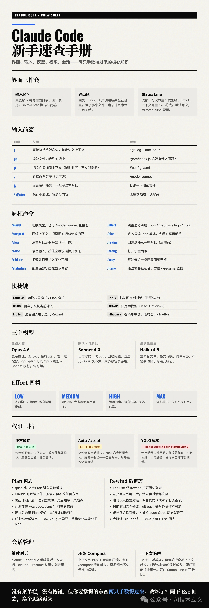
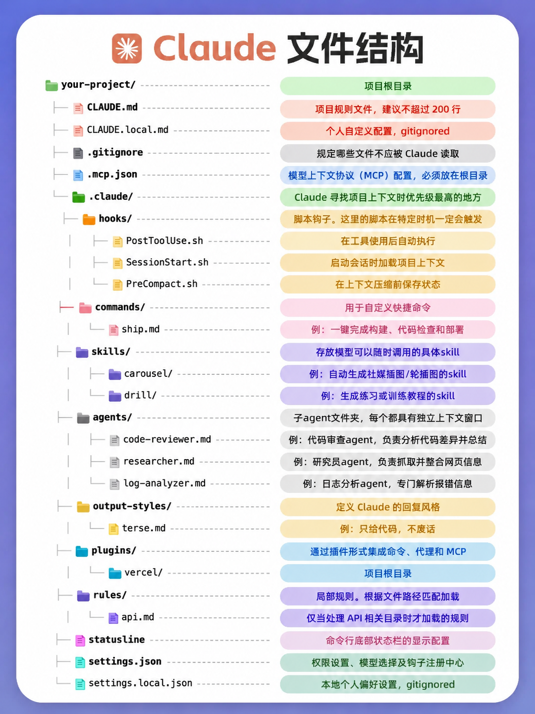
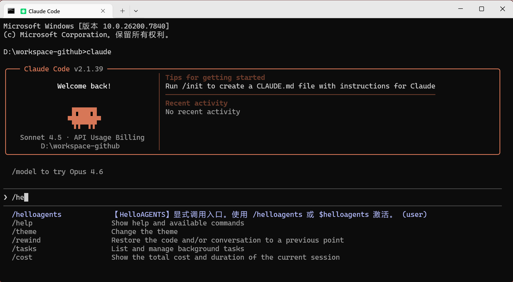
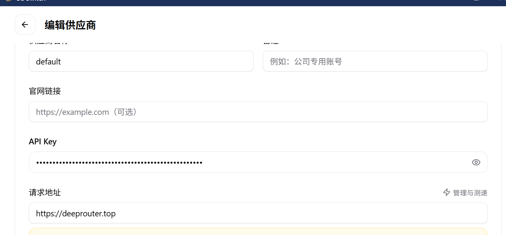

# 2.1.Claude Code

- 官网：[https://claude.ai](https://claude.ai)
- Claude Code 实战课程（中文）[https://cholf5.com/claude-code-in-action/](https://cholf5.com/claude-code-in-action/)
- 官方最佳实践：[https://code.claude.com/docs/zh-CN/best-practices](https://code.claude.com/docs/zh-CN/best-practices)
- [claude code 基础入门](https://mp.weixin.qq.com/s/EwMoxI4nWfgTHO574K7qsQ)
- [Claude Code 终极指南：31 个让开发者效率起飞的实战技巧](https://mp.weixin.qq.com/s/8WDDgebQqwjX_cEq7WL4VQ)
- [【强烈推荐】最强AI编程工具Claude Code保姆级新手教程！无门槛国内使用教程！效率飞起摆脱地域限制！](https://www.bilibili.com/video/BV19RtjzoEb9)
- [Claude Code完全教程【视频文档】](https://my.feishu.cn/wiki/Takxwov60iO5OOkOmpEcpOGynac)
- [Claude Code 最强配置指南：12 插件 + 20 技能 + 3 省 Token 神器，让你的 AI 编程效率翻 10 倍](https://mp.weixin.qq.com/s/EWplLDdiv9RYxPwXuxbr5g)

codex
- [Codex全解【视频文档】](https://my.feishu.cn/wiki/OCY5wzbGhiLDr8kMulkcLLuSnQd)


## 0.快速入门

命令



文件结构



## 1.安装&卸载

Claude限制地区使用，即使使用梯子，也容易被检测出来封号，所以建议跳过官方强制认证检测，并且使用自定义模型。

使用国产模型MiniMax为案例：
```shell
1、安装npm：           需要Node.js 18+
2、安装Claude Code：   npm install -g @anthropic-ai/claude-code
3、验证：claude --version
4、切换国产模型：
# Stpe1: 编辑或创建 Claude Code 的配置文件
# MacOS & Linux 为 `~/.claude/settings.json`
# Windows 为`用户目录/.claude/settings.json`
# `MINIMAX_API_KEY` 需替换为您的 MiniMax API Key
# 环境变量 `ANTHROPIC_AUTH_TOKEN` 和 `ANTHROPIC_BASE_URL` 优先级高于配置文件
## CLAUDE_CODE_DISABLE_NONESSENTIAL_TRAFFIC=1跳过地区限制。primaryApiKey本义为开启开发模式，可以用来阻住强制登录。
{
  "env": {
    "ANTHROPIC_BASE_URL": "https://api.deepseek.com/anthropic",
    "ANTHROPIC_AUTH_TOKEN": "sk-3d1b41e2a4714b2fb6c0e48f1c91afc8",
    "ANTHROPIC_MODEL": "deepseek-v4-flash",
    "ANTHROPIC_SMALL_FAST_MODEL": "deepseek-v4-flash",
    "ANTHROPIC_DEFAULT_HAIKU_MODEL": "deepseek-v4-flash",
    "ANTHROPIC_DEFAULT_SONNET_MODEL": "deepseek-v4-flash",
    "ANTHROPIC_DEFAULT_OPUS_MODEL": "deepseek-v4-flash",
    "CLAUDE_CODE_SUBAGENT_MODEL": "deepseek-v4-flash",
    "API_TIMEOUT_MS": "600000",
    "CLAUDE_CODE_DISABLE_NONESSENTIAL_TRAFFIC": "1" 
  },
  "permissions": {
    "allow": [],
    "deny": []
  },
  "model": "deepseek-v4-flash",
  "hooks": {
    "PreToolUse": [
      {
        "matcher": "Bash",
        "hooks": [
          {
            "type": "command",
            "command": "rtk hook claude"
          }
        ]
      }
    ]
  },
  "theme": "dark",
  "primaryApiKey": "test"
}
# Step2: 编辑或新增 `.claude.json` 文件
# MacOS & Linux 为 `~/.claude.json`
# Windows 为`用户目录/.claude.json`
# 新增 `hasCompletedOnboarding` 参数。用于跳过地区的限制【不一定有效】
{
  "hasCompletedOnboarding": true
}

5、使用使用：命令窗口输入claude，看到如下截图就说明安装成功，模型已经切换过去了。
6、更新。
  查看版本并更新：claude update status
  使用npm更新：npm update -g @anthropic-ai/claude-code
  自动更新：在 ~/.claude/settings.json（全局）或项目 .claude/settings.json 中添加：
    "update": {
      "autoInstall": true,
      "checkFrequency": "daily",
      "includePrereleases": false
    }
  

彻底卸载：
1、npm uninstall -g @anthropic-ai/claude-code
2、卸载不使用的依赖：npm root -g
3、进入该目录，手动删除相关目录
    rm -rf <global_node_modules>/@anthropic-ai
    rm -rf <global_node_modules>/claude*
4、删除配置文件
	rm -rf ~/.claude
	rm -rf ~.claude*.*
	rm -rf ~/.config/claude
	rm -rf ~/.cache/claude
5、强制清理缓存
	npm cache clean --force
6、修改环境变量。删除 claude 和 anthropic 相关的关键词。
	~/.bashrc
	~/.zshrc
	~/.bash_profile
	~/.profile
```


## 2.代替产品

claude code 和 其模型在国内很难使用，所以使用一些平行代替产品。
1. open code。对标claude code的第一选择。
2. free-claude-code。基于网络代理，自动转发请求到自定义的模型。https://github.com/Alishahryar1/free-claude-code

## 3.Slash 命令

### 3.1.基础命令

| 命令                | 说明（用途与行为）                                      |
|-------------------|------------------------------------------------|
| `/init`           | 初始化项目：生成 `CLAUDE.md` 项目指南文件（帮助 Claude 理解项目上下文） |
| `/help`           | 显示所有可用命令及帮助信息（包括自定义命令）                         |
| `/clear`          | 清空当前会话上下文，重置对话历史                               |
| `/compact`        | 压缩对话内容以节约 Token，可附加说明聚焦重点任务                    |
| `/config`         | 打开设置界面或显示当前设置项                                 |
| `/cost`           | 显示当前 Token 使用统计和成本信息                           |
| `/doctor`         | 检查 Claude Code 环境和安装状态是否健康                     |
| `/memory`         | 编辑项目记忆文件（`CLAUDE.md` 内容）                       |
| `/model`          | 切换使用的 AI 模型（例如 Sonnet / Opus 等）                |
| `/permissions`    | 查看或更新 Claude Code 权限设置                         |
| `/login`          | 切换当前 Anthropic/Claude 帐户（登录）                   |
| `/logout`         | 注销当前登录帐户                                       |
| `/mcp`            | 管理 Model Context Protocol（MCP）连接和身份验证          |
| `/add-dir`        | 向当前会话添加额外的工作目录以扩展上下文                           |
| `/agents`         | 管理子代理（Subagents）—— 创建/编辑/列出子代理配置               |
| `/bug`            | 报告 Bug（将当前对话或问题发送至 Anthropic 反馈通道）             |
| `/pr_comments`    | 查看代码仓库 Pull Request 的评论                        |
| `/review`         | 请求 Claude 对代码进行审查（如代码风格/质量检查）                  |
| `/status`         | 显示账号状态、版本、模型和其他状态信息                            |
| `/terminal-setup` | 安装或配置终端快捷键（如 Shift+Enter 换行）                   |
| `/vim`            | 切换到类 Vim 模式进行插入/命令模式编辑（如果终端支持）                 |
| `/voice`          | 原生终端语音输入                                       |
| `/context`        | 显示当前会话上下文（包括内存、环境变量、占用比例等）                     |

使用技巧

| 命令类别        | 示例 Slash 命令                                    |
|-------------|------------------------------------------------|
| 项目初始化 & 上下文 | `/init`, `/memory`, `/add-dir`                 |
| 会话控制        | `/clear`, `/compact`, `/status`, `/help`       |
| 账户与配置       | `/login`, `/logout`, `/config`, `/permissions` |
| 开发支持        | `/review`, `/pr_comments`                      |
| Agent 管理    | `/agents`                                      |
| 工具联动        | `/mcp`, `/bug`                                 |

### 3.2.自定义命令

Slash Command（斜杠命令）的核心本质其实是： 把一段“固定 Prompt / 工作流 / 模板”封装成 /xxx 命令。

命令位置

```text
project/
├── .claude/
│   └── commands/
│   │   ├── review.md
│   │   ├── fixbug.md
│   │   └── optimize.md
    ├── skills/
    ├── rules/
    ├── memory/
    └── workflows/
```

以review为例，

```markdown
---
name: review
description: 对当前代码进行全面 Code Review
allowed_tools: ["Bash", "Read", "Grep"]
---

请对当前代码进行全面 Code Review：

要求：
- 检查 bug
- 检查安全问题
- 检查性能问题
- 检查可维护性
- 给出优化建议

输出格式：
1. 问题
2. 原因
3. 修复建议
4. 修改后的代码
```

## 4.核心功能

### 4.1.项目记忆：CLAUDE.md 文件的强大作用

- **核心功能**：作为项目的"第二大脑"，存储关键知识和偏好
- **初始化方式**：使用 `/init` 命令快速创建
- **分层文档架构**：
  ```
  ~/.claude/CLAUDE.md                 # 全局用户偏好配置
  ~/projects/
  ├── CLAUDE.md                       # 组织或团队标准规范
  └── finance-tracker/
      ├── CLAUDE.md                   # 项目专属知识库
      ├── backend/CLAUDE.md          # 后端开发模式
      └── frontend/CLAUDE.md         # 前端开发模式
  ```
- **维护方法**：可直接编辑文件，或使用 `#` 命令进行更新

### 4.2.上下文管理：压缩、清空与重置

- **核心问题**：上下文窗口容量有限，需要主动进行管理
- **重要命令**：
    - `/clear`：清空当前上下文，开启全新对话
    - `/resume`：恢复之前的中断对话
    - `/compact`：智能压缩上下文，可指定保留的关键内容
- **使用建议**：
    - 每个功能模块完成后及时清空上下文
    - 每进行 20-30 轮对话后考虑执行压缩
    - 避免因上下文过载导致系统自动压缩而丢失重要信息

### 4.3.子代理系统：实现复杂任务的规模化处理

- **基本理念**：为特定任务配置专门的 AI 助手
- **典型子代理配置**：
  ```
  主 Claude（协调者）
  ├── 代码审查子代理（质量管控专家）
  ├── 测试工程师子代理（测试流程专家）
  └── 文档编写子代理（技术文档专家）
  ```
- **主要优势**：各子代理拥有独立对话历史和上下文环境
- **配置指令**：通过 `/agents` 命令进行设置和管理

### 4.4.Git 工作流：分支管理、工作树与检查点

- **分支策略**：采用四步安全工作流程
    1. 从 main 分支创建功能分支（实现变更隔离）
    2. 在功能分支中进行开发和测试
    3. 更新相关文档资料
    4. 确认无误后合并提交更改
- **Git 工作树**：支持真正的并行开发模式
  ```bash
  # 创建独立工作树
  git worktree add ../project-feature -b feature/new-feature

  # 启动独立的 Claude 实例
  cd ../project-feature
  claude --dangerously-skip-permissions
  ```
- **检查点机制**：使用 `/rewind` 命令实现"时光机"式回滚
- **智能提交**：自动生成规范化的提交信息

### 4.5.权限控制

- default：默认模式，所有操作都会弹确认，非常麻烦    
- acceptEdits：自动接受文件编辑，敏感操作仍需确认     
- auto：智能模式，用分类器自动判断放行/阻止
- dontAsk：静默模式，只在 deny 列表时拒绝
- bypassPermissions：完全跳过权限检查（慎用）            
- plan：只读模式，所有写操作前先弹确认

```text
修改配置
1. 通过/config中的 permissionMode 选项。
2. 编辑 settings.json（持久化）：全局（~/.claude/settings.json）或项目级（.claude/settings.json）：
  {
    "permissions": {
      "defaultMode": "auto"
    }
  }
  
3. CLI 启动参数（本次会话有效）：claude --permission-mode auto
```

## 5.高级应用

### 5.1.自动化工作流构建

- **自定义斜杠命令**：将常用开发流程封装到 `.claude/commands/` 目录中
- **MCP 服务器集成**：连接外部服务和 API（如 Jira、Slack、数据库）
  ```bash
  # 示例：添加 Brave 搜索 MCP 服务器
  claude mcp add brave-search -s project -- npx @modelcontextprotocol/server-brave-search
  ```
- **Skills 技能包**：创建可复用的指令和代码集合，支持智能自动触发

### 5.2 Hooks 机制：实现开发流程自动化

- **Hook 类型概览**：
    - PreToolUse：在工具执行前触发
    - PostToolUse：在工具执行成功后触发
    - Notification：在发送通知时触发
    - Stop：在任务完成时触发
    - Sub-agent Stop：在子代理任务完成时触发
- **配置方式**：使用 `/hooks` 命令进行设置和管理

### 5.3 构建全面测试策略

- **测试体系建设**：涵盖从单元测试到端到端测试的完整链条
- **智能代码分析**：Claude Code 先深入分析代码库，理解项目特殊需求
- **基础设施自动化**：自动安装并配置所需的测试工具
- **业务逻辑聚焦**：编写能够真实反映业务逻辑的测试用例

### 5.4 配置生产级 CI/CD 流程

- **PR 检查机制**：运行完整测试套件、类型检查、代码格式化和安全审计
- **主分支合并**：自动部署到预发布环境并执行冒烟测试
- **版本发布**：实现零停机生产部署，并进行部署后的健康状态检查

### 5.5 数据驱动的性能优化

- **系统化诊断方法**：基于实际性能数据制定优化策略，而非套用通用方案
- **全面性能审计**：分析包体积、数据库查询效率、前端性能瓶颈等关键指标
- **量化改进效果**：提供优化前后的对比数据，验证改进成果

### 5.6.checkpoint

cc提供的checkpoint功能，你可以在对话中保存当前的上下文，然后在需要的时候恢复。
当你需要回滚到之前的某个状态时，只需要使用 `/rewind` 命令，就可以恢复到之前的上下文。

注意:cc只能回滚上下文，不能回滚执行的bash、文件修改等。我们使用的ai集成工具（cursor、trae等）都是自己实现diff功能，从而实现修改的回滚。

### 5.7.SubAgent

子代理拥有独立的上下文和记忆，可以专注于特定的任务或领域。
你可以创建一个子代理，让它专门负责处理代码检查。
这样，当你需要进行代码检查时，就可以直接与这个子代理进行对话，而不需要担心它会受到其他上下文的干扰。
创建子代理的方法和创建 Agent Skills 类似。
你需要在~/.claude/agents文件夹下，创建一个code-quality-improver.md文件。
然后，在code-quality-improver.md文件中，写上以下内容：

```markdown
---
name: code-quality-improver
description: Reviews code for quality and best practices
tools: Read, Glob, Grep
model: sonnet
---

You are a code quality improver. When invoked, analyze the code and provide
specific, actionable feedback on quality, security, and best practices.
```

- name：子代理的名称，这个名称需要全局唯一。
- description：子代理的描述，描述这个子代理的功能和作用。
- tools：子代理可以使用的工具，这些工具是 Claude Code 提供的内置工具，比如 Read、Glob、Grep 等等。
- model：子代理使用的模型。我这里使用的是 sonnet 模型。如果你没有 claude-sonnet 模型的访问权限，随便填写一个模型名称就可以了，Claude Code 会自动降级到你有访问权限的模型。

重启claude 以使配置生效。

使用子代理，在命令窗口输入：使用 subagent review 代码

Claude Code 会自动触发 code-quality-improver 子代理，来 review 代码的质量。

## 6.工作流

### 6.1./goal

/goal 是 Claude Code 内置的 的一个命令 。

它的核心行为：
- 设置一个条件表达式作为目标
- 阻塞会话停止——在你明确完成目标或条件满足之前，Claude Code 不会退出
- 自动清除——条件满足后钩子自动失效

实现原理 ：/goal 的实现依赖 Claude Code 的 Hook 机制（session-scoped Stop hook（会话级停止钩子））：
1. Stop Hook — 这是钩子的一种类型，当用户尝试停止/退出会话时触发
2. Condition 条件 — /goal 接收一个描述性条件（如 "run the tests" 或中文的 "实现登录功能"）
3. 阻塞循环 — 条件未满足时，每次收到用户消息都会检查条件，直到满足才允许会话结束
4. Auto-clear — 条件满足后自动清除，无需手动取消

omc ultragoal
1. /goal 自身不持久化——会话结束后状态丢失。
2. omc ultragoal 是 OMC 插件在它之上封装的持久层：

omc ultragoal create-goals --brief "迁移到新架构"
- → 生成 .claude/ultragoal/ 目录下的计划文件和分类账
- → 按 story 分解目标（G001, G002...） 
- → 支持跨会话恢复 
- → 最终交付需要经过 ai-slop-cleaner + verification + code-review 三重 gate

### 6.2.deep research

Deep Research（深度研究）是主流AI工具推出的多步智能体研究工作流。它将复杂问题拆解为子任务，自主进行多轮联网检索、阅读与交叉验证，最终生成带引用链的结构化报告。
其本质是“自主研究员”，以“规划-执行-反思”闭环为核心，根本区别于传统的单轮RAG（检索增强生成）。

其通用实现链路分为五个阶段：
1. 规划：主动追问澄清意图，将大问题分解为结构化子目标序列。
2. 查询演化：根据子目标动态生成针对性的多组搜索关键词，而非直搜原文。
3. 迭代检索与反思：多轮搜索并抓取正文，若发现信息缺口或证据矛盾，则生成新查询补全，形成自我驱动的闭环。
4. 证据评估：多源交叉比对，基于来源权威性、时间衰减与交叉验证度进行可信度加权。
5. 报告综合：对证据去重、逻辑组织，生成含图表与精确引用的结构化长报告。

主流产品对比：
- OpenAI DR：基于o3定制版，追问式规划，自主浏览，报告极其详尽但耗时较长。
- Gemini DR：先生成计划供用户确认，接入Google全家桶，可生成原生图表。
- Perplexity DR：Search as Code架构，多模型协同，可执行数千次检索，速度极快。
- Anthropic Claude Research：Agent 自主规划，可执行复杂任务。
- 开源方案：包括Open Deep Research / Spring AI Alibaba DR。支持本地模型与自定义搜索API，强调隐私与高度定制。

当前局限：Deep Research仍面临幻觉风险、无法穿透学术付费墙、单次任务耗时且算力成本极高，以及处理私人数据时的隐私安全挑战。

实现原理：底层也是使用dynamic workflows。在其上封装多种tool use。

### 6.3.Dynamic Workflows

Anthropic 于 2026 年 5 月随 Claude Opus 4.8 发布的 Dynamic Workflows，被形容为 Claude Code 历史上最大的架构升级之一。

Dynamic Workflows 的本质是 把"怎么组织工作"这件事从人的提示词工程/模板文件交给了模型本身——你说目标，Claude 写编排脚本，脚本调度一堆子 Agent 并行干活、对抗验证、断点续跑。
人机协作的新层级：人管"要什么"，AI 管"怎么拆、怎么排、怎么验证"。但代价是 Token 消耗可能爆炸，所以要用对场景，别拿航天母舰去买菜。

> Anthropic 推出的 Dynamic Workflows 引发行业争议（被指与 Sisyphus Labs 的 OMO 工具功能相似），但本质是 Coding Agent 赛道的核心趋势：让 AI 自主编写编排脚本，调度多 Agent 并行完成复杂任务，OpenAI Codex、开源工具 OMO 均已布局同类能力。
> 它不是服务端固定引擎，而是 Claude 根据任务临时生成的 JavaScript 脚本，在本机后台独立运行，主对话可同步处理其他事务，仅接收最终结果。

#### 6.3.1.解决什么痛点

传统 Claude Code 的致命瓶颈：所有东西都挤在同一个对话上下文里。

| 问题               | 后果         |
|------------------|------------|
| 大规模任务（500+ 文件迁移） | 直接爆上下文     |
| 只能线性执行           | 无法并行，慢到不可用 |
| 对话越长             | 推理质量衰减     |
| 中断 = 重头再来        | 无法断点续跑     |

典型案例：Bun 项目作者 Jarred Sumner 要把 ~75 万行 Zig 迁移到 Rust，单对话根本扛不住——Dynamic Workflows 让他 11 天完成迁移，99.8% 测试通过。

#### 6.3.2.架构是怎么变的

> 一句话：编排计划从 Claude 的 Context 移入 JavaScript 脚本。

| 维度     | 传统对话模式         | Dynamic Workflows         |
|--------|----------------|---------------------------|
| 谁决定下一步 | Claude 逐轮猜/推   | JS 脚本预编排                  |
| 中间结果存哪 | 上下文窗口（占 Token） | 脚本变量（不占 Claude 的 Context） |
| 并行     | ❌ 无            | ✅ 最多 16 个并发 Agent         |
| 规模上限   | 上下文窗口大小        | 单次最多 1000 个 Agent         |
| 中断恢复   | 重启整个对话         | 断点续跑 + 缓存复用               |
| 可复用    | 不可复用           | 可保存为 `/<name>` 命令复用       |

#### 6.3.3.执行流程

```
用户描述目标
  → Claude 生成 JS 编排脚本
    → Runtime 后台执行脚本
      ├── 并行启动子 Agent（探索/执行/验证）
      ├── 汇总中间结果（存脚本变量，不污染上下文）
      ├── 对抗性验证（独立 Agent 尝试推翻结论）
      └── 收敛迭代 → 最终答案回主会话
```
关键体验：主对话全程保持响应，你可以继续聊别的，不用干等。

#### 6.3.4.使用案例

触发方式：

| 方式           | 用法                                                               |
|--------------|------------------------------------------------------------------|
| 关键词触发        | 提示词里带 `workflow`，如 `Run a workflow to audit every API endpoint…` |
| Ultracode 模式 | `/effort ultracode`，每个重要任务自动判断是否走工作流（⚠️ 成本不可控）                   |
| 内置命令         | `/deep-research` — 多角度 Web 搜索 → 抓源码 → 交叉验证 → 三票制 → 引用报告          |

质量控制，对抗性验证：
> 不是 Agent A 发现 bug 就直接报给你，而是再派 Agent B 和 Agent C 扮演"反驳者"，试图证明 A 的结论是错的。只有扛住 ≥2 个反驳者的验证，结论才递交给用户。
> 误报率显著降低，结论可信度比"单 Agent 自说自话"高得多。

工作流限制

| 约束         | 数值/说明                         |
|------------|-------------------------------|
| 并发 Agent   | 最多 16 个（低核机器更少）               |
| 单次总 Agent  | 最多 1000 个（防失控循环）              |
| 脚本权限       | 不能直接访问文件系统或 Shell（只读协调者角色）    |
| 子 Agent 权限 | 固定 `acceptEdits`              |
| 续跑         | 仅同一会话内有效，退出重开 = 从头跑           |
| 计划门槛       | Pro 需手动开，Enterprise 默认关（管理员开） |

#### 6.3.5.使用场景

| 机制                | 什么时候用                       |
|-------------------|-----------------------------|
| Subagents（子代理）    | 任务明确、单一、可重复（代码审查、测试生成）      |
| Agent Teams       | 多专家需共享状态协作构建同一产物（前后端并行）     |
| Dynamic Workflows | 任务边界不确定 + 规模超大（全库审计、几十万行迁移） |

决策树：单次对话装得下吗？ → 能，别用工作流；不能 → 边界确定用 Teams，边界不确定用 Workflows。

【核心】成本警告：成本可能是传统方式完成的5~10倍。

## 7.插件

### 7.1.插件市场
- 插件市场：https://code.claude.com/docs/en/plugins   里面有很多实用的插件，比如 Figma 插件、Playwright 插件、GitHub 插件等等。
- 如何创建插件，可以参考官方文档：https://code.claude.com/docs/en/plugins

分类

| 组件             | 触发方式      | 常驻成本    |
|----------------|-----------|---------|
| skills         | 大模型按需触发   | 0       |
| slash commands | 自定义斜杠命令   | 轻量      |
| hooks          | 每次会话结束后触发 | 消耗token |
| mcp            | 大模型按需触发   | 消费词素    |

Claude Code 支持两种添加自定义技能、agent和钩子的方式：
1. 独立配置（Standalone .claude/ directory）：适用于个人工作流程、特定项目的自定义设置、快速试验。
2. 插件（Plugin 包含.claude-plugin/plugin.json 的目录）：适用于需要与他人共享、向社区分发、版本化发布、可跨项目复用。

### 7.2.Oh My Claude Code
- [Oh My Claude Code 完整上手攻略](https://mp.weixin.qq.com/s/qeQBslbHA5P1jzxYwnpTYA)
- 开源：[github.com/Yeachan-Heo/oh-my-claudecode](github.com/Yeachan-Heo/oh-my-claudecode)


Oh My Claude Code 是一套构建在 Claude Code 之上的插件和智能体集合。
它融合了多个开源项目的思路（oh-my-opencode、claude-hud、Superpowers、everything-claude-code），
把原本偏单点交互的 Claude Code，扩展成一个可用的多智能体编排系统，用来处理更复杂的任务。

简单来说，它提供了三样东西：
- 多种执行模式，用来适配不同规模和复杂度的任务
- 一组分工明确的专业智能体，覆盖常见开发角色
- 尽量减少配置和学习成本，让你可以直接上手使用

核心能力：
- 5 种执行模式：Autopilot、Ultrapilot（3–5 倍并行）、Swarm、Pipeline、Ecomode
- 32 个专业智能体：从架构设计、编码实现到数据分析
- 自动模型路由：简单任务用 Haiku，常规工作用 Sonnet，复杂推理交给 Opus
- 自然语言控制：不需要记命令，直接描述你要做什么

### 7.3.官方插件

[Claude Code 10 个必装插件](https://mp.weixin.qq.com/s/n_3S4qC8OR6CIUCQJiNsYw)


| 顺序 | 插件名称                               | 预估安装命令                                                                           | 核心作用                            | 适用场景/注意                                     |
|----|------------------------------------|----------------------------------------------------------------------------------|---------------------------------|---------------------------------------------|
| 1  | **LSP系列** (如 `typescript-lsp`)     | `claude plugin install official:typescript-lsp` (或 `pyright-lsp`)                | 提供类型检查、错误诊断，解决“写得对不对”           | 按主力语言选装，是所有插件的基础                            |
| 2  | `feature-dev`                      | `claude plugin install official:feature-dev`                                     | 将功能开发拆分为7阶段流水线                  | 适合新功能开发；改bug/一次性脚本不建议用（过重）                  |
| 3  | `code-review`                      | `claude plugin install official:code-review`                                     | 结构化代码审查，过滤低置信度建议                | 仅输出高/中优先级问题，配合 feature-dev 使用               |
| 4  | `context7`                         | `claude plugin install community:context7` (或 `official`)                        | 拉取指定库的最新版本文档                    | 对 Next.js/LangChain 等迭代快的库刚需                |
| 5  | `commit-commands`                  | `claude plugin install official:commit-commands`                                 | 自动生成符合“约定式提交”规范的 commit message | 统一团队提交风格，方便生成 changelog                     |
| 6  | `pr-review-toolkit`                | `claude plugin install official:pr-review-toolkit`                               | PR级代码审查，分块处理大 PR                | 替代单函数级审查，适合大变更合并                            |
| 7  | `github`                           | `claude plugin install official:github`                                          | 让 Claude 直接读取 issue/PR/CI 日志    | 后端可搭配 `sentry` / `vercel` 等同类插件             |
| 8  | `document-skills`                  | `claude plugin install official:document-skills`                                 | 支持 docx/pdf/pptx/xlsx 的生成与解析    | 处理合同/简历/报告，按需触发不占上下文                        |
| 9  | 输出风格插件 (如 `learning-output-style`) | `claude plugin install official:learning-output-style`                           | 附带代码解释/Socratic 式追问             | 新人/陌生领域适用；赶进度场景不建议（token 消耗大增）              |
| 10 | `knowledge-work-plugins`           | *(通常为克隆仓库或指定路径安装)* <br>`claude plugin install anthropics/knowledge-work-plugins` | 含销售/市场/法务等14个角色型插件              | 适合产品/市场方向技术人，写文案/邮件/总结更高效                   |
| 11 | `security-guidance`                | `/plugin install security-guidance`                                              | 安全检测                            | 后台盯着文件变化，一旦发现可疑模式（命令注入、XSS、SQL 注入这类），立刻弹出警告 |

### 7.4.第三方插件

- openai/codex-plugin-cc。在 Claude Code 里直接调用 OpenAI Codex 做评审
- addyosmani/agent-skills。Google Chrome 团队工程师 Addy Osmani 出品。7 个斜杠命令，涵盖开发全生命周期：DEFINE → PLAN → BUILD → VERIFY → REVIEW → SHIP。
    - /spec 先写规格再写代码，规格写清楚了，代码反而快。
    - /plan 把需求拆成小任务。
    - /build 每次只做一个切片。
    - /ship 从代码到上线一口气跑完。
- claude-hud。专为 Claude Code 设计的 终端状态栏仪表盘 。无需额外窗口、不依赖 tmux、不消耗token，原生集成更稳定。
    - 开源地址：[https://github.com/jarrodwatts/claude-hud](https://github.com/jarrodwatts/claude-hud)
- cc-wf-studio。VS Code 插件，提供了一个可视化的工作流编辑器，让你可以在 VS Code 里直接创建、编辑、运行、调试 Claude Code 的工作流。
- ccstatusline。‌是一款为 Claude Code CLI 打造的高度可定制状态栏工具，可在终端底部实时显示模型信息、Token 用量、Git 分支等关键指标，
  - 项目地址：https://github.com/sirmalloc/ccstatusline
  - 中文版：https://github.com/huangguang1999/ccstatusline-zh
- 汉化插件：
  - [https://github.com/taekchef/claude-code-zh-cn](https://github.com/taekchef/claude-code-zh-cn)
  - [https://github.com/joshchaotang/claude-code-i18n](https://github.com/joshchaotang/claude-code-i18n)

#### 7.5.Hello Agents
1. 官网：[https://github.com/hellowind777/helloagents](https://github.com/hellowind777/helloagents)
2. 是一个 结构化的智能体（Agent）工作流系统/框架，用于让 AI 编程工具按阶段推进任务，而不是随意输出。
   它通过 “路由 + 多阶段 + 验收闸门” 的方式，让 AI 跟随明确流程完成评估 → 实现 → 验证等步骤，从而提高自动化任务的可控性和质量。
   它与一般的“技能库”不同，更像是一个 完整的工作流编排系统，把生成、测试、验收等串起来，避免 AI 提前结束或乱写代码。
3. 如何使用：直接与Ai CLI集成，目前支持Codex CLI、Claude Code、Gemini CLI、Grok CLI、Qwen CLI等。
   将对应的目录复制到Ai CLI的插件根目录下，就可以在ai cli中使用。



## 8.桌面

claude code提供了桌面端的客户端，可以在Windows、macOS、Linux上运行。与cli功能没有关联。

[Claude 桌面版使用第三方API，保姆级教程](https://mp.weixin.qq.com/s/T_OCadqfKNAQU0zp4Zo-TA)

## 10.项目

[4个超强项目，让你的 Claude Code 如虎添翼](https://mp.weixin.qq.com/s/mxkNxjQ7YjuKhHhVOODOFQ)
- Everything Claude Code:
  - 作用：这不是一个"配置模板集合"，这是一整套经过 10 个月高强度日常使用打磨的Claude Code 操作系统
  - 48 可以直接用于生产环境的 Agent；
  - 183 个 Skill：涵盖从代码审查、安全扫描到品牌营销、视频创作的方方面面；
  - 79 个命令：覆盖你能想到的所有开发工作流。
  - 源码：[https://github.com/affaan-m/ECC](https://github.com/affaan-m/ECC)
  - 官网：[https://ecc.tools/](https://ecc.tools/)
- Waza: 
  - 作用：工程师技能包，8个打磨到位的精品技能。
  - 源码：[GitHub](https://github.com/tw93/waza)
- Ars Contexta: 
  - 作用：第二大脑知识管理	跨会话记忆，解决AI"失忆"问题。
  - 源码：[GitHub](https://github.com/agenticnotetaking/arscontexta)
- GacUI CLAUDE.md: 
  - 作用：工作流路由器，通过命令行切换Claude Code 的工作流。
  - 源码：[GitHub](https://github.com/vczh-libraries/GacUI/blob/master/CLAUDE.md)
- context-mode: 
  - 作用：自动上下文管理工具。它用 SQLite 加 FTS5 加 BM25 搜索引擎追踪所有文件编辑、Git 操作、任务状态和用户决策。
  - 源码：[GitHub](https://github.com/mksglu/context-mode)
- claude-context: 
  - 作用：使用 BM25 加稠密向量的混合检索，将整个项目代码都向量化，方便使用自然语言检索整个项目代码。
  - 源码：[GitHub](https://github.com/zilliztech/claude-context)

## 11.最佳实践

### 11.1. 实战技巧
- [Claude Code 35个实战技巧：每条都有具体命令](https://mp.weixin.qq.com/s/PvKa2ZvfQUCRdWIMJ7UvHA)
- [使用 ClaudeCode 的五个段位](https://mp.weixin.qq.com/s/XEpI34u0QjvKkMVdtVTNtg)

### 11.2.源码分析

- [深度拆解 Claude Code：12 个可复用的 Agentic Harness 设计模式](https://mp.weixin.qq.com/s/eUbRoyKxOjiAPuXZi8DPsQ)
- [Claude Code 源码深度架构分析](https://mp.weixin.qq.com/s/GjZ-tFBVwfJwK11F1lP5TQ)
- [来自Claude Code源码的12种Harness设计模式](https://mp.weixin.qq.com/s/RiH3aN_ogpUNAApqLT-1Nw)

### 11.3.秘钥切换工具
cc-switch，是一个便捷的工具，可以快速切换 Claude Code 的 API 配置。
1. 安装教程： https://github.com/farion1231/cc-switch/blob/main/README_ZH.md




echobird。功能更加贴近普通用户使用。
1. 官网： [https://echobird.ai/](https://echobird.ai/)


### 11.4.集成IDE
[终端里用 Claude Code 太难受？我把它接进 TRAE，真香!](https://zhuanlan.zhihu.com/p/1948479831177171398)

Claude Code 官方已经提供了VSCode 和 idea 的插件，可以方便的使用可视化界面的方式进行开发，效果与trae相似，不用在cli里面复制代码了。  