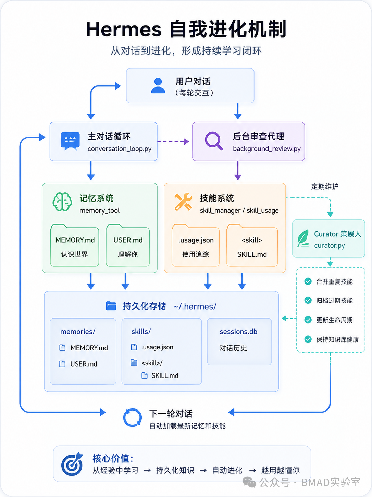

# 7.AI项目

## AI项目开源社区
1. AI Agent / Coding Agent 社区
   - LangChain：最流行的 LLM 应用开发框架之一，支持 Agent、RAG、Tool Calling、多智能体等能力。开源地址：[https://github.com/langchain-ai/langchain](https://github.com/langchain-ai/langchain)
   - OpenManus：面向通用 AI Agent 的开源框架，支持任务执行、工具调用与复杂工作流。开源地址：[https://github.com/FoundationAgents/OpenManus](https://github.com/FoundationAgents/OpenManus)
   - AutoGen：微软开源的多智能体协作框架，支持任务规划、自动对话、代码生成与调试。开源地址：[https://github.com/microsoft/autogen](https://github.com/microsoft/autogen)
   - OpenHands：原 OpenDevin 项目，目标是实现类似 Claude Code 的 AI 软件工程 Agent。开源地址：[https://github.com/All-Hands-AI/OpenHands](https://github.com/All-Hands-AI/OpenHands)
   - CrewAI：强调多 Agent 分工协作的 AI 框架，适合自动化业务流程场景。开源地址：[https://github.com/crewAIInc/crewAI](https://github.com/crewAIInc/crewAI)
2. 大模型 / 模型社区
   - Hugging Face：全球最大的开源 AI 模型社区，提供模型、数据集与在线 Demo。官网：[https://huggingface.co](https://huggingface.co)
   - ModelScope（魔搭社区）：阿里推出的中文 AI 模型社区，聚焦国产模型与 AI 应用。官网：[https://modelscope.cn](https://modelscope.cn)
   - Ollama：本地运行大模型的热门项目，支持 DeepSeek、Qwen、Llama 等模型。开源地址：[https://github.com/ollama/ollama](https://github.com/ollama/ollama)
   - OpenCSG：国产开源 AI 模型与数据集社区，支持模型共享与协作。官网：[https://opencsg.com](https://opencsg.com)
3. AI 推理 / Infra 社区
   - vLLM：高性能大模型推理框架，支持 OpenAI API 兼容与大规模并发推理。开源地址：[https://github.com/vllm-project/vllm](https://github.com/vllm-project/vllm)
   - llama.cpp：轻量级本地大模型推理框架，支持 CPU/GPU 部署。开源地址：[https://github.com/ggerganov/llama.cpp](https://github.com/ggerganov/llama.cpp)
   - TensorRT-LLM：NVIDIA 推出的 LLM 推理加速框架，适合企业级 GPU 推理部署。开源地址：[https://github.com/NVIDIA/TensorRT-LLM](https://github.com/NVIDIA/TensorRT-LLM)
   - SGLang：面向 AI Agent 与长上下文场景的高性能推理框架。开源地址：[https://github.com/sgl-project/sglang](https://github.com/sgl-project/sglang)
4. AI 开发工具 / WebUI 社区
   - Open WebUI：最流行的本地大模型 Web 管理界面之一，支持 Ollama/OpenAI API。开源地址：[https://github.com/open-webui/open-webui](https://github.com/open-webui/open-webui)
   - LibreChat：支持多模型聚合的 AI Chat 平台，可接入 OpenAI、Claude、Gemini 等。开源地址：[https://github.com/danny-avila/LibreChat](https://github.com/danny-avila/LibreChat)
   - Flowise：可视化 AI Workflow 编排平台，支持 LangChain Agent 拖拽开发。开源地址：[https://github.com/FlowiseAI/Flowise](https://github.com/FlowiseAI/Flowise)
   - Dify：企业级 AI 应用开发平台，支持 Agent、RAG 与工作流编排。开源地址：[https://github.com/langgenius/dify](https://github.com/langgenius/dify)
   - N8N：可视化工作流编排平台，支持多模型聚合。开源地址：[https://github.com/n8n-io/n8n](https://github.com/n8n-io/n8n)
   - Skywork / 天工大模型：昆仑万维开源的 Skywork-13B 系列大模型及配套数据集，支持商用，中文能力突出，在 GitHub 和 Hugging Face 均有仓库。开源地址：[https://github.com/SkyworkAI/Skywork](https://github.com/SkyworkAI/Skywork)
   - PaddlePaddle（飞桨）：百度开源的深度学习框架，国内最早开源的独立研发深度学习平台之一，配套大量模型库和工具套件。开源地址：[https://github.com/PaddlePaddle/Paddle](https://github.com/PaddlePaddle/Paddle)
   - MindSpore（昇思）：华为开源的全场景深度学习训练/推理框架，支持端、边、云多场景，在 GitHub 和 Gitee 均有仓库。开源地址：[https://github.com/mindspore-ai](https://github.com/mindspore-ai)
5. AI 论文 / 学术社区
   - arXiv：全球最大的 AI 论文发布平台，很多前沿 AI 技术首先发布于此。官网：[https://arxiv.org](https://arxiv.org)
   - Papers With Code：结合论文与开源代码的平台，支持 SOTA Benchmark 查询。官网：[https://paperswithcode.com](https://paperswithcode.com)
   - OpenReview：机器学习顶会（ICLR、NeurIPS 等）论文评审平台。官网：[https://openreview.net](https://openreview.net)
6. AI 开源综合社区
   - Hugging Face Spaces：AI Demo 与应用分享社区，支持在线运行 AI 应用。官网：[https://huggingface.co/spaces](https://huggingface.co/spaces)
   - 一飞开源：民间Ai开源社区：[https://code.exmay.com/](https://code.exmay.com/)
7. AI 技术讨论社区
   - Reddit Machine Learning：全球 AI 技术讨论最活跃的论坛之一。社区地址：[https://www.reddit.com/r/MachineLearning/](https://www.reddit.com/r/MachineLearning/)
   - Hacker News：开源、AI、创业领域最重要的技术社区之一。社区地址：[https://news.ycombinator.com](https://news.ycombinator.com)
   - Discord AI Communities：大量 AI 开源项目会通过 Discord 维护开发者社区与实时讨论。官网：[https://discord.com](https://discord.com)
   - OpenI 启智社区：国家级新一代人工智能开源开放平台，提供一站式 AI 开发协作平台、代码托管、数据集管理以及 GPU/NPU 普惠算力，托管大量 AI 开源项目。[https://openi.pcl.ac.cn](https://openi.pcl.ac.cn)；项目开源指南与代码托管平台见：[https://openi.org.cn](https://openi.org.cn) 与 [https://git.openi.org.cn](https://git.openi.org.cn)

## 平台

智谱
- Zread AI 是智谱AI 推出的一款开源项目阅读工具,支持中文,可将 GitHub 项目一键转化为清晰的用户手册。可以用于分析源码和系统架构。
  - 官网：[https://zread.ai/](https://zread.ai/)
- ocr工具。官网：[https://ocr.z.ai/](https://ocr.z.ai/)
- 图像工具。官网：[https://image.z.ai/](https://image.z.ai/)
- 语音工具。官网：[https://audio.z.ai/](https://audio.z.ai/)

## 自动化工具

- OpenClaw：是一款本地优先、可自托管、开源的 AI 自主代理（Agent）执行引擎，核心是让 AI 从 “只会聊天” 变成 “能动手干活” 的数字助理。
  官网：[https://docs.openclaw.ai/](https://docs.openclaw.ai/)
- Hermes。本质上是一套包裹在大模型外部的“全链路工程化控制系统”。是真正实现agent的工程化、规模化、产业化。一次性解决沙箱、长会话、权限、恢复、追踪等问题。

### OpenClaw

- OpenClaw Zero Token 是基于 OpenClaw 的一个分支版本。通过浏览器自动化技术，模拟你在网页端的登录状态，直接调用各平台的 Web 接口，完全绕过了付费 API 机制。
  目前支持 ChatGPT、Claude、Gemini 等 12 个 AI 平台。最有意思的是 AskOnce 功能，一次提问同时发给多个模型，然后你可以对比各家回复，选最好的那个用。
  https://github.com/linuxhsj/openclaw-zero-token
- 国内各大厂都在集成openClaw，例如百度、阿里、腾讯等。

### Hermes

- 官网：[https://hermes-agent.org/](https://hermes-agent.org/)
- 中文文档：[https://hermesagent.org.cn](https://hermesagent.org.cn)

Hermes是一层“控制 + 组织 + 评估”模型行为的工程框架

它解决的核心问题是： 模型本身不稳定，但系统必须稳定

hermes-hud：是给Hermes增加一块仪表盘，把平时藏在里面的状态拆开来给你看。
[https://github.com/joeynyc/hermes-hud](https://github.com/joeynyc/hermes-hud)

### 对比
二者同属开源本地 AI 智能体，但OpenClaw 是 “靠人喂技能的可控管家”，Hermes 是 “自己会长大的自主助手”，设计理念与使用逻辑完全不同。

一、核心定位（本质分野）
- OpenClaw：网关型可控 AI 智能体，定位是多平台消息中枢、AI 执行管家，主打连接、路由、严格管控，像按规则办事的专职管家。
- Hermes：自进化型 AI 智能体，定位是任务执行引擎，主打自主学习、自我优化，像会成长的智能学徒。

二、关键能力差异
1. 技能生成逻辑
   - OpenClaw：人工投喂 / 预定义，能力全靠插件、手动配置，不主动生成新技能。
   - Hermes：运行时自动生成，完成任务后自动复盘、提炼技能并持久化，越用越强。
2. 记忆与成长
   - OpenClaw：无持久自进化记忆，用完即止，能力不随使用时长提升。
   - Hermes：跨会话持久记忆，持续沉淀用户习惯与任务经验，自适应适配用户 workflow。
3. 架构侧重
   - OpenClaw：网关优先，中心化调度，强稳定性、确定性，适合标准化流程。
   - Hermes：学习优先，自主运行闭环，适配复杂 / 未知任务，弱化人工配置。

三、适用场景
- OpenClaw：轻量自动化、代码生成、多聊天平台整合，新手友好、个人 / 小型场景易用。
- Hermes：通用复杂任务、长期自适应工作流，需要 AI 自主进化的场景更适配。

### 自我进化能力

设计哲学。
1. OpenClaw 的设计理念是 “安全、稳定、合规优先”，像一个严格按照标准流程办事的“合规执行官”。其自我进化机制更侧重于在受控和安全的前提下，通过修改规则文件和安装技能来扩展能力。
2. Hermes 的设计理念是 “学习、进化、灵活优先”，像一个能从经验中不断总结、越用越强的“学习型骨干”。其自我进化机制的核心是构建了一个从任务执行到经验沉淀，再到模型内化的完整数据闭环，旨在实现真正的自主学习和能力提升。

详细对比分析
1. 核心理念
   - OpenClaw：安全、稳定、合规优先。其设计目标是成为行为可预测、可追溯的“合规执行官”。
   - Hermes：学习、进化、灵活优先。其设计目标是成为能从经验中自主总结、越用越强的“学习型骨干”。

2. 自我进化核心机制
   - OpenClaw：基于文件系统的可修改与扩展。
     - 核心机制：允许直接读写定义行为、人设、记忆的Markdown文件来更新自身。AGENTS.md（行为规则）、SOUL.md（人设）、MEMORY.md（长期记忆）。
     - 技能获取：通过ClawHub市场发现和安装新技能。
     - 更新方式：通过系统指令应用变更，形成“用户反馈 → 修改文件 → 重新加载 → 行为改变”的循环。
   - Hermes：基于内外双轮驱动的闭环学习。
     - 外驱演进（动态技能生成）：任务完成后，由“后台审查Agent”自动从交互轨迹中提取经验，抽象为结构化、可复用的技能文件。
     - 内驱演进（模型权重训练）：引入基于GRPO等强化学习算法的训练闭环，利用高质量任务数据对基座模型进行微调，从根本上提升能力上限。
     - 记忆系统：采用智能的、分层级的记忆机制。

3. 技能系统
   - OpenClaw：采用“标准手册”式。技能主要由人工编写或从社区获取，强调标准化和可控性，更新需经过审核流程。
   - Hermes：采用“经验沉淀”式。技能由Agent在任务执行中自动总结、迭代生成，并可通过进化算法自动优化，强调从成功路径中提炼方法。

4. 记忆系统
   - OpenClaw：采用工作区文件级记忆。记忆存储在可编辑的Markdown等文件中，结构相对简单直接。
   - Hermes：采用三层智能记忆。包含持久记忆文件、高效的会话检索（基于SQLite和FTS5）以及外部插件，能对记忆进行抽象和提炼。

5. 安全模型
   - OpenClaw：采用“默认拒绝”策略，设有多层防护，操作极为谨慎，适合不允许出错的严肃场景。
   - Hermes：采用“智能审批”策略，在灵活高效与安全之间寻求平衡，例如对高风险操作进行二次确认。

6. 适用场景
   - OpenClaw：适用于金融、审计、风控、流程化任务等对安全性、合规性要求极高的场景。
   - Hermes：适用于创新、分析、创作、重复性任务优化等需要快速迭代和强适应性的场景。

7. 技术栈与生态
   - OpenClaw：前端（TypeScript）友好，工程化成熟度较高。
   - Hermes：AI研究（Python）友好，支持更多模型提供商，在多平台网关集成上更灵活。

## 记忆

使用AI每次开新会话，一切从零开始。你得重新解释项目架构、重新描述那个 Bug、重新说明你的代码偏好。所以记忆是非常重要的

1. agentmemory。长期存储共享记忆。
   - 原理：它在后台运行一个记忆服务器，自动捕获你每次工具调用、每次对话、每次代码修改，压缩成可搜索的结构化记忆，下次新会话开始时自动注入相关上下文。
   - 它有四层记忆架构，模仿人脑的工作方式。工作记忆存原始观察，情景记忆存会话摘要，语义记忆提取事实和模式，程序记忆记录工作流和决策习惯。
   - 而且记忆会随时间衰减，频繁访问的会被强化，过时的自动淘汰。
   - 支持：Claudecode、open code等16+款AI工具。
   - 开源：[https://github.com/rohitg00/agentmemory](https://github.com/rohitg00/agentmemory)

## 浏览器
- Web Access。通过 CDP 协议直连你日常使用的 Chrome 浏览器，你在各个网站上已经登录的账号，AI 可以直接用，不需要重新走登录流程。https://github.com/eze-is/web-access
- Lightpanda 是一个完全从零构建的开源无头浏览器，用 Zig 语言写的，专门为AI设计的浏览器，没有复杂的渲染层，性能极快。https://github.com/lightpanda-io/browser
- bb-browser。你的浏览器就是 API。通过 Chrome 扩展加 CLI 加 MCP Server 的组合，让你已登录的真实浏览器直接变成 AI Agent 的操作接口。https://github.com/epiral/bb-browser

爬虫类
- Playwright。微软的浏览器自动化工具，结合skills实现浏览器操作。
- CloakBrowser。基于 Chromium 做改动，通过源码修改浏览器指纹，避免被检测到。

## 设计

1. Claude Design。 美国 anthrophic 公司的 AI 设计工具。
2. Open Design。 Claude Design 的开源替代品。
   - 官网：[https://open-design.ai/](https://open-design.ai/)
   - 开源地址：[https://github.com/nexu-io/open-design](https://github.com/nexu-io/open-design)

## 金融

- 金融行业 AI Agent 模板。anthropics 官网开源的金融服务 Agent 模板库。
  - 这套模板里面包含 10 个预构建的 Agent，投行、股研、私募、财富管理、基金运营、合规这些场景全覆盖。
  - 开源地址：[https://github.com/anthropics/financial-services](https://github.com/anthropics/financial-services)

## MaaS

## 企业级Agent

- Snail AI。Snail AI 是一个灵活、可扩展的企业级 AI 智能体平台。基于 Spring Boot 4 和 Spring AI 构建，提供多模型管理、智能体编排、RAG 知识库、长期记忆、技能管理等核心能力。拥有完善的后台管理界面和 OpenAPI 接口，支持快速接入和二次开发。
  - 官网：[https://snailai.opensnail.com/](https://snailai.opensnail.com/)
  - 开源：[https://gitee.com/aizuda/snail-ai](https://gitee.com/aizuda/snail-ai)
- AiToEarn。是一个完整的内容营销流水线，围绕创作到赚钱的全链路。核心流程做以下4件事。
  - Monetize 是内容变现，内置了一个内容交易市场，商家发布推广任务，创作者接单完成推广，按 CPS、CPE、CPM 三种模式结算。
  - Publish 是多平台一键分发，国内支持抖音、小红书、快手、B 站、微信视频号，海外支持 TikTok、YouTube、Facebook、啥的总共 13 个平台。
  - Engage 是自动化互动运营，通过浏览器插件实现自动点赞收藏关注，AI 智能回复评论，还能识别"求链接""怎么购买"这类高转化信号。
  - 开源：[https://github.com/yikart/AiToEarn](https://github.com/yikart/AiToEarn)
- Multica。你的下一批员工，不是人类。 开源的 Managed Agents 平台。 将编码 Agent 变成真正的队友——分配任务、跟踪进度、积累技能。
  - 开源：[https://github.com/multica-ai/multica](https://github.com/multica-ai/multica)
  - 官网：[https://www.multica.ai/](https://www.multica.ai/)

## 工具
- Next AI Draw.io。AI绘图工具。
  - 开源地址：https://github.com/DayuanJiang/next-ai-draw-io  
  - 在线工具：https://next-ai-drawio.jiang.jp/。
- GMSSH。AI驱动的SSH工具。[https://www.gm.cn/?ref=gmssh](https://www.gm.cn/?ref=gmssh)
- 沙箱。sandbox，常见的沙箱环境使用虚拟机或者docker等方式实现。
  - 开源方案。cubeSandbox。走的是 microVM 路线，还结合 KVM + RustVMM，“既隔离又高性能”。单实例占用约5MB资源。
- tmux 是一个终端复用器（terminal multiplexer），让你可以在一个终端里开多个“窗口/面板”，运行多个程序，而且可以断开（detach）后让这些程序在后台继续运行，再重新连接（attach）回来。
  - 可以在多个窗口中详细查看不同的subagent或者多agent中的执行情况。
- OpenWiki。你复制任何内容，AI 自动采集，帮你整理成一个私人知识库，还能告诉你最近在关注什么。
  - 开源地址：[https://github.com/OpenWikiProject/OpenWiki](https://github.com/OpenWikiProject/OpenWiki)
- claude-tap。追踪本地agent执行。通过代理的方式，把 Claude Code、Codex等模型的执行过程进行转发，实现模型请求过程的实时检查，可以查看模型调用过程使用的参数、返回值、调用顺序等。
  - 开源：[https://github.com/liaohch3/claude-tap](https://github.com/liaohch3/claude-tap)

## 娱乐
- AI-Writer小说生成，采用自研网文大模型实现。[开源项目：AI-Writer 小说 AI 生成器](https://mp.weixin.qq.com/s/yYHH9k4mT-pDvcRAOFSCGw)。
  开源地址：[https://github.com/BlinkDL/AI-Writer](https://github.com/BlinkDL/AI-Writer)

## 框架

1. InsForge 是一个面向 AI 编程 Agent 的开源后端平台。它的定位和 Supabase 或 Firebase 不完全一样。Supabase 是给人用的，InsForge 是给 Agent 用的。工程师面对的是一个控制台， Agent 面对的是一个 MCP Server。
   - InsForge 给 Agent 暴露的是后端的「上下文」：Schema 结构、表关系、RLS 权限配置、已投运的函数、日志运行状态。
   - Agent 把这些信息吃透，开始实现创建数据库、配认证、搞 S3 存储、写 Edge Function 等操作。
   - 开源：[https://github.com/InsForge/InsForge](https://github.com/InsForge/InsForge)

## 项目实战

### 灵感获取流程
1. 灵感收集：关注科技前沿
   - 阵地： 只盯着 Twitter 和 YouTube。关注 OpenAI、Anthropic、Google 那帮 CEO 和一线研究员。
   - 神器： 用 GPTAtlas 浏览器插件。看视频不用从头刷到尾，直接出摘要、抓核心逻辑。
   - 过滤： 远离那些虚头巴脑、形而上学的宣发文。我推荐 AI Valley，这里的内容够硬，只谈技术和产品，不谈情怀。
2. 产品方案：让最强“左右脑”互搏
   - 别纠结用 GPT-5 还是 Gemini，成年人全都要。
   - 我会让 ChatGPT  和 Gemini  针对同一个需求对线。一个出逻辑方案，一个出用户路径。
   - 跳过原型： 方案定了，直接丢给 Figma Make 或者 Gemini AI Studio 生成前端。
   - 避坑指南： 记住了，生成的代码如果有 Mock 数据，一定让 AI 单独写数据表，别硬编码（Hardcode）在代码里。
3. 全栈开发：Claude Code 才是真正的神
   - 虽然周围有人吹 Codex，但我实测下来，Claude Code 在终端的丝滑程度是断层领先的。
   - 主力： 终端跑 Claude Code。
   - 辅助： IDE 用 Cursor。我会一边开着 Claude 写代码，一边在 Cursor 里看目录结构、切分支、改 Bug。Cursor 的 Agent 模式确实省去了很多写 Prompt 的力气。
4. 代码审查：别让本地依赖骗了你
   - 本地跑通不代表真的稳。
   - 我会把 GitHub 连上 CodeRabbit 和 DeepWiki。它们不仅能查错，还能从架构设计、性能优化层面给你提建议。这种“云端架构师”的诊断，比你肉眼找 Bug 强一百倍。
5. 知识沉淀：你的第二大脑
   - 学习搭子： NotebookLM。我建了几个项目库，把所有调研资料、PDF 往里一扔，它就是最懂这个项目的 AI 助手。
   - 任务分发： 个人项目用 Notion，多人协作上 Linear。Linear 和 GitHub 集成后，任务分发简直是艺术。

### 全自动制作知识讲解视频

视频基于HTML、通过TTS生成语音。播放页面内容，同时播放语音。
- Skill 开源地址：https://github.com/ConardLi/garden-skills/
