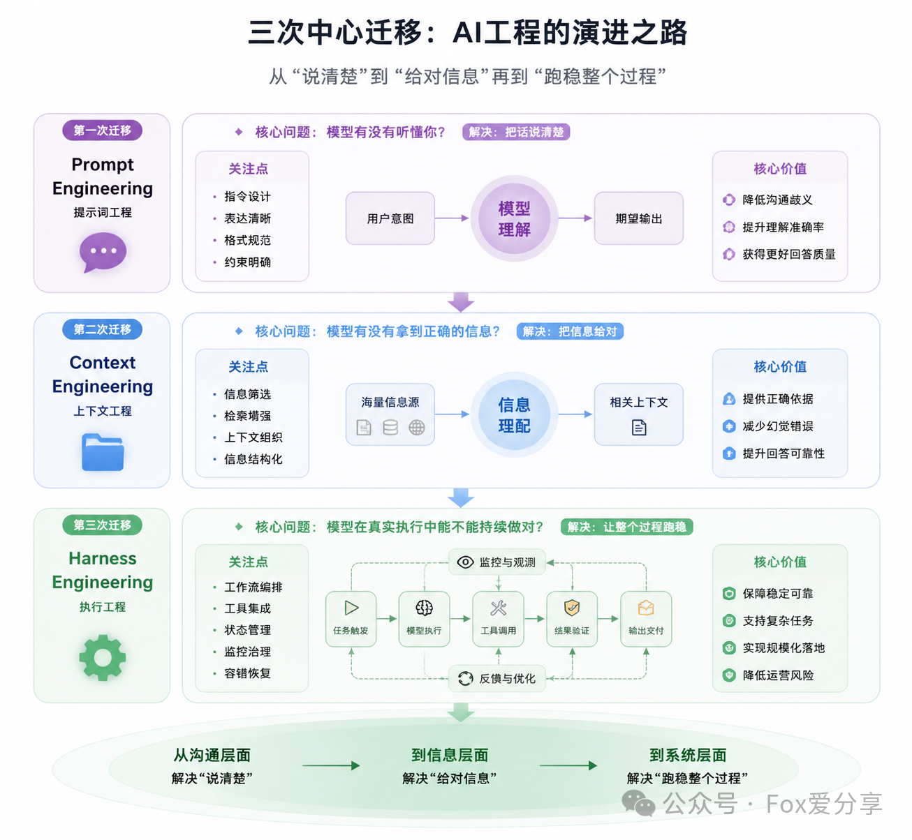
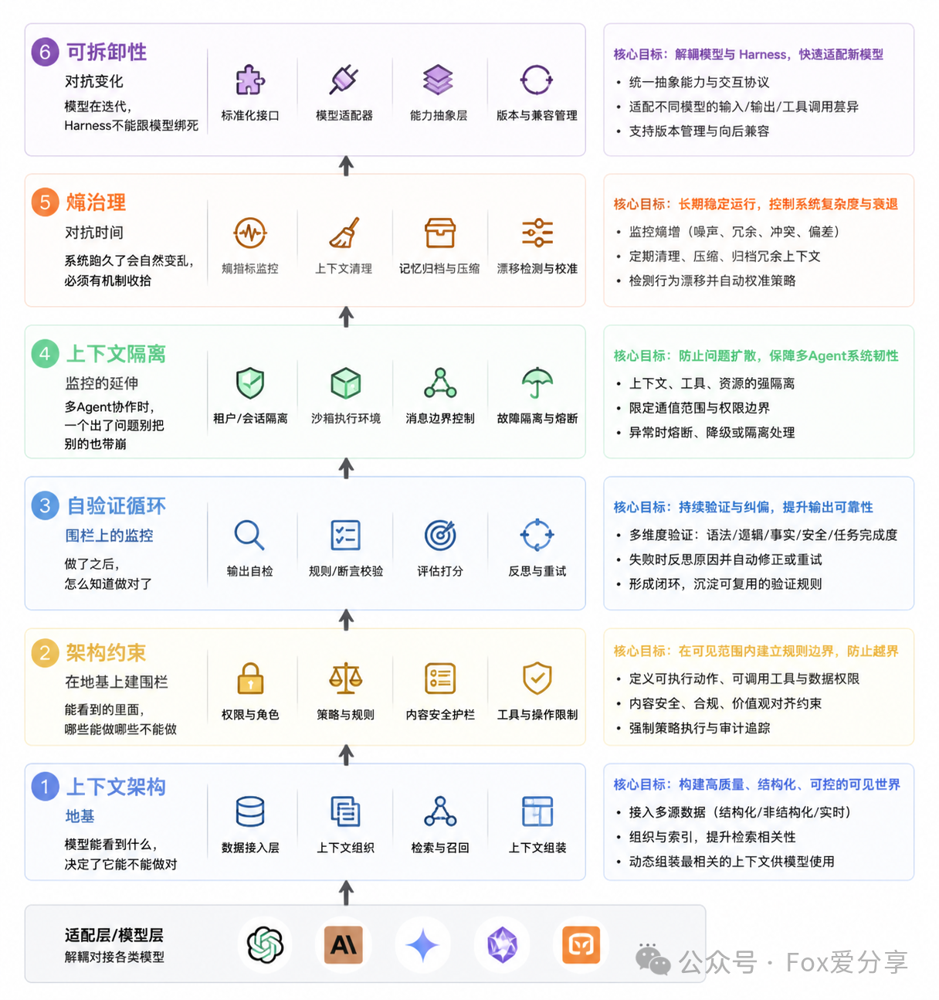

# 9.软件工程

## AI工程



### 核心迁移
从2023~2026年。AI工程的重心经历了三次根本性迁移：
1. Prompt Engineering（提示词工程）：核心是“把话说清楚”，通过设计提示词激发模型已有能力，解决“模型有没有听懂你”的问题。其天花板是无法弥补模型缺失的知识或管理复杂动态信息。
2. Context Engineering（上下文工程）：核心是“把信息给对”，确保模型在合适时机获得正确的信息（如通过RAG、Agent Skills），解决“模型有没有拿到正确的信息”的问题。
    其边界在于无法保证信息给对后，模型能稳定执行。
3. Harness Engineering（驾驭工程）：核心是“让整个过程跑稳”，通过一套工程化系统对Agent的整个运行生命周期进行持续观测、纠偏和验收，解决“模型在真实执行中能不能持续做对”的难题。
    这是当前阶段的关键。

### Harness Engineering
- 定义与价值：Harness 被比喻为“缰绳”，是驾驭Agent执行过程的系统性工程。
   其价值在于，不更换模型，仅优化Harness就能带来性能的显著提升（如LangChain案例中提升13.7个百分点）。
- 完整公式： `Agent != Model + Harness` ，更加完整的表述应该是 `Agent = f(Model, Harness, Human-in-the-Loop)`。
   强调模型、Harness（静态规则）与人的动态驾驭三者协同，缺一不可。
- 六大工程支柱：一个成熟的Harness系统应包含以下六个由内至外的层次：
  1. 上下文架构：精准设计进入模型上下文的信息，采用“渐进式披露”、分层记忆等策略，避免信息过载。
  2. 架构约束：用代码（如Linter、权限体系）而非提示词来强制执行规则，实现“失效保护”。
  3. 自验证循环：建立独立于生成过程的验收机制（如规划-生成-评估分离），防止模型“自我感觉良好”，确保输出质量。
  4. 上下文隔离：通过进程隔离、接口化通信等方式，防止多Agent协作时错误扩散造成级联故障。
  5. 熵治理：通过自动化机制（如Ralph Loop拆分长任务、轨迹编译固化重复任务）对抗系统运行日久后必然出现的混乱与衰退。
  6. 可拆卸性：通过依赖注入、标准化协议（如MCP）等方式，使Harness与特定模型解耦，能够快速适配新的模型。



### Harness实际案例
Harness Engineering并非理论，而是正在产生巨大价值的工程实践：
- LangChain：仅通过优化Harness（如添加循环检测、推理三明治等中间件），在不换模型的情况下大幅提升基准测试成绩。
- OpenAI：团队通过设计完善的运行环境与约束，让Agent主导开发了百万行代码的项目，人类角色转变为“环境设计师”。
- Anthropic：采用“规划-生成-评估”三Agent架构，实现了长时间、高质量的任务执行（如构建数字音频工作站），并处理了“上下文焦虑”和“自评失真”等具体问题。

### 人的角色
随着Harness的成熟，程序员的角色正在从代码执行者转变为系统控盘者。人的核心工作变为：
- 设计Agent的运行环境（架构、约束、验证规则）。
- 在关键时刻进行干预（如架构污染、目标漂移、系统性异常时）。
- 不能放弃技术判断，但工作重心从写业务逻辑代码，转向编写定义规则的AGENTS.md、验证脚本和Lint规则。

## 软件工程

### 一、工具定位与选型

Claude Code 虽强，但在真实工程场景中常面临三大边界挑战：权限边界（易误操作）、上下文边界（长对话导致幻觉）和协作边界（缺乏团队流程）。

为解决这些问题，需要引入 Agent Harness（代理线束） 工具，从纪律、上下文、角色和编排四个维度补齐短板。

1. 流程辅助（规范驱动，保障质量）
    - 【最轻量】Superpowers: 全流程约束，TDD 风格，防止 Agent 乱改代码、跳过测试。开源地址：https://github.com/obra/superpowers
    - get-shit-done（GSD）: 长任务上下文隔离，解决“上下文腐烂”。问题。开源地址：https://github.com/gsd-build/get-shit-done
    - flow-kit。GitHub出品。通过集成slash command实现需求管理、提问、设计、任务、开发、测试、review、沉淀等一系列流程管理。
    - 【⭐️】openSpec: 提供代码规范、测试用例等，确保代码质量。侧重于先定方案，再执行。（中间大模型会多次跟用户沟通设计细节）https://github.com/Fission-AI/OpenSpec
2. 多角色Agent(保障方向)
    - Oh-My系列: omc(oh my claude code)等，引入开发多种角色。
    - Everything Claude Code。 13 个专家级 Agent、40+ 个按需加载的 Skill、32 个快捷命令，以及一套持续学习系统。
    - gstack: 引入 PM、QA、安全等虚拟角色视角，弥补决策盲区。开源地址：https://github.com/garrytan/gstack
3. 编排Agent(保障长期执行任务不跑偏)
    - Archon: 将知识库、任务、看板集成到流水线中。开源地址：https://github.com/coleam00/Archon
    - Routines: 自动执行重复性任务，如代码格式化、测试执行等。开源地址：https://github.com/coleam00/Routines

[我融合了superpowers、OpenSpec、spec-kit、GSD、gstack、claude-task-master写一套可控Ai开发规范流程](https://mp.weixin.qq.com/s/6NSD1WoKRXTHR0exWBKXtg)


#### 介绍
四套工具分别解决工程化的四个不同层面，非同质化竞争，而是按需组合。

| 工具              | 核心价值                   | 解决的关键短板                       | 推荐场景                     |
|-----------------|------------------------|-------------------------------|--------------------------|
| Superpowers | 纪律 (Discipline)    | 防止 Agent 乱改代码、跳过测试。提供严格的质量门控。 | 担心 Agent 失控，需强制代码规范。     |
| GSD         | 上下文 (Context)      | 解决长任务中的“上下文腐烂”。通过隔离机制保持清晰。    | 长期跑复杂任务，常遇上下文爆炸。         |
| gstack      | 角色 (Role)          | 引入 PM、QA、安全等虚拟角色视角，弥补决策盲区。    | 缺乏多角度（产品、测试）协同审查。        |
| Archon      | 编排 (Orchestration) | 将知识库、任务、看板集成到流水线中。            | 需将 Agent 融入完整 DevOps 流程。 |


四个工具在需求→设计→执行→验证的核心流程上高度重叠（约70%），但是同时各有独特优势，侧重不同方面。

#### 工具全景对比

| 维度         | oh-my-claudecode (OMC)       | Superpowers      | GSD (Get Shit Done)     | gstack                   |
|------------|------------------------------|------------------|-------------------------|--------------------------|
| GitHub | Yeachan-Heo/oh-my-claudecode | obra/superpowers | gsd-build/get-shit-done | garrytan/gstack          |
| Stars  | 11K+                         | 104K+            | 50K+                    | 68K+                     |
| 核心定位   | 多智能体编排系统                     | AI开发方法论/技能框架     | 规范驱动开发系统                | AI软件工厂/角色化团队             |
| 设计哲学   | 零学习曲线，自然语言驱动                 | 文档驱动，先想后做        | 轻量级，专注交付                | 角色分工，全生命周期               |
| 驱动方式   | 多Agent编排                     | 文档驱动             | Spec规范驱动                | 角色模拟驱动                   |
| 智能体数量  | 32个专业Agent                   | ~15个Skills       | 5个Agent（规划/执行/验证/调试/研究） | 23个角色命令                  |
| 安装方式   | Plugin市场                     | Plugin市场         | `npx get-shit-done-cc`  | `git clone + ./setup`    |
| 依赖     | tmux（Team模式）                 | 无额外依赖            | 无额外依赖                   | Bun/Node.js + Playwright |
| 适用规模   | 团队协作                         | 中大项目             | 个人/小团队快速交付              | 独立开发者/初创团队               |
| 模型要求   | 推荐Opus/Sonnet                | 中等模型即可           | 中等模型即可                  | 推荐Opus/Sonnet            |

```text
                    OMC    Superpowers    GSD    gstack
需求澄清             ✅      ✅           ✅      ✅
架构设计             ✅      ✅           ✅      ✅
任务拆解             ✅      ✅           ✅      ✅
代码执行             ✅      ✅           ✅      ✅
代码审查             ✅      ✅           ✅      ✅
测试验证             ✅      ✅           ✅      ✅
Git集成              ✅      ✅           ✅      ✅
多Agent并行          ✅      ❌           ✅      ❌
浏览器QA测试         ❌      ❌           ❌      ✅
安全审计             ❌      ❌           ❌      ✅
部署/发布管理        ❌      ❌           ❌      ✅
智能模型路由         ✅      ❌           ❌      ❌
上下文工程           ❌      ❌           ✅      ❌
```

#### 选型策略
- 个人/小项目：首选 Superpowers（保质量）。
- 复杂/长期项目：Superpowers + GSD（防腐 + 纪律）。
- 企业级流程：Archon（需配合成熟 DevOps）。

### 二、集成难度与性能开销评估

#### 1. 集成难度对比
| 工具              | 集成方式       | 配置复杂度 | 关键依赖                           |
|-----------------|------------|-------|--------------------------------|
| Superpowers | 插件/技能导入    | ⭐☆☆☆☆ | 极低，安装即可用。                      |
| GSD         | CLI 安装器    | ⭐⭐☆☆☆ | 需维护 `PROJECT.md` 等规范文件。        |
| gstack      | 外部 CLI/Bun | ⭐⭐⭐☆☆ | 依赖 Bun 环境，配置稍繁琐。               |
| Archon      | 外部系统对接     | ⭐⭐⭐⭐☆ | 需配置 Jira/Linear API Key，属基建改造。 |

#### 2. 性能开销（Token 与效率）
| 工具              | Token 开销 | 执行效率  | 开销来源解析                     |
|-----------------|----------|-------|----------------------------|
| Superpowers | 中        | ⭐⭐⭐⭐⭐ | 开销在 TDD 循环（测试+修复），长期省钱。    |
| GSD         | 中高       | ⭐⭐⭐⭐☆ | 开销在阶段隔离，重启 Agent 以保持上下文干净。 |
| gstack      | 高        | ⭐⭐⭐☆☆ | 开销在多角色模拟（CEO/PM/QA 评审）。    |
| Archon      | 视配置而定    | ⭐⭐☆☆☆ | 开销在外部系统轮询和流水线调度。           |

#### 【⭐️】3.同时安装的风险评估

| 风险          | 严重程度 | 说明                                                         |
|-------------|------|------------------------------------------------------------|
| 上下文污染   | 🔴 高 | 4套工具同时注入CLAUDE.md/SKILL.md，上下文窗口被大量方法论指令占据，留给实际代码的空间大幅减少   |
| 指令冲突    | 🔴 高 | 不同工具对同一流程有不同要求（如Superpowers要求先文档后编码，GSD要求先Spec后执行），AI会无所适从 |
| 技能触发混乱  | 🟡 中 | 多套Skills同时注册，AI可能触发错误的工作流，或同时触发多个冲突流程                      |
| Token浪费 | 🟡 中 | 每次对话都要加载4套工具的系统提示，额外消耗大量Token                              |
| 调试困难    | 🟡 中 | 出问题时难以判断是哪个工具导致的                                           |

### 三、实战组合案例与最佳实践

#### 案例：全栈项目“AI 每日简报”
目标：开发 React + Supabase 应用（用户认证、RSS 抓取、AI 总结）。

| 阶段        | 工具组合            | 操作 SOP                                      | 效果                           |
|-----------|-----------------|---------------------------------------------|------------------------------|
| 1. 定义 | Gstack      | 使用 `/office-hours` 确定 MVP 范围，禁止写代码。     | 产出 `product_spec.md`，防止方向跑偏。 |
| 2. 拆解 | GSD         | 运行 `/gsd-new-project`，生成 `REQUIREMENTS.md`。 | 建立“唯一真相源”，防止上下文混乱。           |
| 3. 编码 | Superpowers | 调用 `/executing-plans`，强制 TDD 开发。            | 代码返工率从 60% 降至 10%。           |
| 4. 发布 | Archon      | 关联 Jira Ticket，PR 合并后自动关单。                  | 流程自动化，减少人工同步成本。              |

#### 推荐组合模式1
 轻量级（个人首选）：Gstack + Superpowers
- Superpowers  开发方法论（需求澄清→计划→执行→审查→验证）  文档驱动，防止AI乱写代码，适合中大项目 
- gstack  工程管理（CEO审查→架构评审→代码审查→QA测试→发布→回顾）  角色化分工，浏览器QA和安全审计是独有能力 

互补点：
- Superpowers 管"怎么写代码"（开发纪律）
- gstack 管"怎么交付产品"（工程流程）
- Superpowers 的 TDD + gstack 的 `/qa` 浏览器测试 = 完整测试闭环
- Superpowers 的代码审查 + gstack 的 `/review` + `/cso` 安全审计 = 完整质量保障

#### 推荐组合模式2 — 仅安装 GSD

适合场景：个人项目、快速迭代、讨厌繁琐流程

理由：GSD 是最轻量的选择，专注"把事做完"，上下文工程解决AI遗忘问题，不会过度干预开发流程

```powershell
npx get-shit-done-cc@latest
```

#### 推荐组合模式3 — 仅安装 OMC

适合场景：团队协作、需要多Agent并行、使用tmux

理由：OMC 的多Agent编排能力最强，智能模型路由可节省30-50% Token

```powershell
# 需要tmux支持
# 安装后通过自然语言触发，零学习曲线
```

#### 不推荐同时安装的组合

| 组合                               | 原因                                       |
|----------------------------------|------------------------------------------|
| OMC + GSD                        | 🔴 两者都是多Agent编排系统，功能高度重叠，指令会严重冲突         |
| Superpowers + GSD                | 🟡 开发流程重叠度70%+，但Spec驱动 vs 文档驱动理念不同，AI会混乱 |
| OMC + Superpowers + GSD + gstack | 🔴 四套同时安装=上下文灾难，AI基本无法正常工作               |

### 四、在 OpenCode 与 Trae 中的配置指南

#### 1. OpenCode（原生兼容）
OpenCode 基于 Claude Code 生态，支持插件化。

- Superpowers（强烈推荐）：本质就是一套skill，安装非常轻量
  ```bash
  git clone https://github.com/obra/superpowers.git ~/.config/opencode/superpowers
  ```

- GSD：
  ```bash
  npx get-shit-done-cc@latest --opencode --local
  ```

- gstack/Archon：建议外部运行。在系统终端运行 Bun 命令生成文档，再让 OpenCode 读取文档编码。

#### 2. Trae（文件夹挂载）
Trae 通过读取项目目录下的规则文件工作。

- Superpowers：将 `superpowers/skills/` 复制到项目的 `.trae/skills/` 目录下。
- GSD：在 Trae 集成终端运行 `npx get-shit-done-cc@latest --claude --local`。
- gstack/Archon：外部协作。在 Trae 外运行，仅将输出的 Markdown 文档放入项目文件夹供 Agent 参考。

## Superpowers

- [Superpowers AI 编程完全教程](https://mp.weixin.qq.com/s/GNyheGHtwhy0nUy5YmGsCg?click_id=29)
- [Superpowers使用教程](https://mp.weixin.qq.com/s/NjPe-OXzL0ZviLdlEWC-BA)

### 1.介绍
Superpowers 不是让 AI 更“聪明”，而是让它更“守规矩”——用软件工程的纪律，把 AI 变成真正可靠的结对程序员。

| 维度   | 说明                                                            |
|------|---------------------------------------------------------------|
| 本质   | 一个开源 AI 编程技能框架（GitHub: `obra/superpowers`），由 Jesse Vincent 创建 |
| 定位   | 一套软件开发工作流系统，将软件工程最佳实践编码为 AI 可执行的结构化流程                         |
| 目标   | 把 AI 从“会写代码的打字机”升级为“遵守工程纪律的专业软件工程师”                           |
| 适用工具 | Claude Code、Cursor、Codex、OpenCode、Gemini CLI 等主流 AI 编程工具      |

解决的核心痛点

| 传统 AI 编程的问题     | Superpowers 的解决方案           |
|-----------------|-----------------------------|
| 一上来就写代码         | 先澄清需求、确认设计，禁止提前编码           |
| 忽略测试或事后补测试      | 强制 TDD：没有失败测试，不写生产代码        |
| 声称完成但无法验证       | 证据驱动：必须提供测试通过/运行结果的可视化证明    |
| 直接修改主分支，风险高     | Git Worktree 隔离：每个功能在独立环境开发 |
| 长对话上下文混乱、遗忘早期决策 | 子代理驱动：每个任务从干净上下文启动          |
| 风格不稳定、返工频繁      | 标准化流程：20+ 技能强制统一工程规范        |

四大核心设计理念
1. 流程优于提示（Process over Prompt）  
   不依赖更强模型或更优提示词，而是用可强制执行的工程流程约束 AI 行为。
2. 测试驱动开发（TDD）  
   严格遵循 RED → GREEN → REFACTOR 循环。
3. 证据胜于声明（Evidence over Claims）  
   任何“任务完成”必须有可验证证据（截图、日志、输出），否则视为未完成。
4. 降低复杂度（Reduce Complexity）  
   遵循 YAGNI、DRY、KISS 原则，拒绝过度设计。

优点
- ✅ 显著降低返工率：流程强制规范，减少“写出来但跑不起来”的情况  
- ✅ 适合复杂项目：子代理 + Worktree 支持长期、多模块开发  
- ✅ 团队协作友好：统一工程标准，新人也能产出老手级代码  
- ✅ 可扩展性强：支持自定义 SKILL.md，适配团队特定流程

### 2.技能全景分类

| 类别   | 核心技能                             | 触发时机    | 关键作用                                               |
|------|----------------------------------|---------|----------------------------------------------------|
| 元技能  | `using-superpowers`              | 对话开始    | 强制检查适用技能                                           |
| 元技能  | `writing-skills`                 | 创建自定义技能 | 创建新 Skill 的最佳实践，执行任务完成后触发                          |
| 设计规划 | `brainstorming`                  | 新功能前    | 头脑风暴，采用9步梳理需求                                      |
| 设计规划 | `writing-plans`                  | 设计确认后   | 拆解为 2–5 分钟细粒度任务                                    |
| 开发执行 | `subagent-driven-development`    | 执行计划    | 每个任务分配独立子 Agent + 两阶段审查                            |
| 开发执行 | `dispatching-parallel-agents`    | 执行计划    | 并发子 Agent 工作流                                      |
| 开发执行 | `executing-plans`                | 执行计划    | 批量执行，带人工检查点                                        |
| 开发执行 | `using-git-worktrees`            | 功能开发    | 创建隔离环境                                             |
| 开发执行 | `test-driven-development`        | 实现功能    | 强制 TDD 循环，严格的 RED-GREEN-REFACTOR 循环                |
| 审查调试 | `systematic-debugging`           | 遇到 Bug  | 4 阶段根因分析                                           |
| 审查调试 | `verification-before-completion` | 声称完成    | 强制验证并出示证据                                          |
| 审查调试 | `requesting-code-review`         | 提交前     | 生成审查清单                                             |
| 审查调试 | `receiving-code-review`          | 提交前     | 响应审查反馈                                             |
| 收尾   | `finishing-a-development-branch` | 任务完成    | 验证所有测试通过 → 呈现 4 个选项（合并 / PR / 保留 / 丢弃）→ 执行 → 清理工作区 |

### 3.完整流程

基本工作流

```text
1. Brainstorming（头脑风暴）:
   ↓ 通过问答澄清需求
   ↓ 分块展示设计方案并等待确认
   ↓ 人工确认最终设计

2. Git Worktree（环境隔离）
   ↓ 创建独立的 Git 工作树

3. Writing Plans（任务拆解）
   ↓ 将任务拆分为 2–5 分钟的小步骤

4. Subagent Development（子智能体开发）
   ↓ 每个任务启动独立子智能体
   ↓ 两阶段审查：规范合规 + 代码质量

5. TDD（测试驱动开发）
   ↓ 按 RED–GREEN–REFACTOR 循环实现

6. Code Review（代码审查）
   ↓ 对实现进行最终质量检查

7. Finish Branch（完成）
```

工作流拆解

```text
1. Brainstorming（头脑风暴）:这是Superpowers工作流中的第一步，它要求先完成设计，在进入实施阶段，期间AI会通过苏格拉底式提问来精炼你的需求。
例如：
    对于头脑风暴阶段，当然也可以手动触发该技能；
    /superpowers:brainstorming 帮我实现某某个功能；
    AI: "这个登录功能需要支持哪些认证方式？"
    User: "用户名密码+手机号验证码"
    AI: "Token使用什么方式？"
    结束对话后，会输出一个详细的设计文档

2. Git Worktree（环境隔离）：superpower使用git worktree来隔离开发环境，而不是依赖传统的切换分支进行操作
    git worktree add ../login-worktree -b feature/auth
    cd ../login-worktree

3. Writing Plans（任务拆解）:设计通过后，writing-plans Skill 激活。它会将工作拆分为 2-5 分钟的微任务，每个任务包含
    # Task 1: 创建 User 模型和数据库迁移 (2 分钟)
    - 定义 User 模型（email, password_hash, created_at）
    - 创建数据库迁移文件
    - 运行迁移并验证表结构
    
    验证步骤：
    - [ ] 数据库中存在 users 表
    - [ ] 表包含所有必需字段
    
执行阶段：进入当前阶段后，确实是否使用subagent-driven-development Skill 为每个任务分配一个全新的子 Agent：
1、分派实现者子 Agent（全新上下文，无污染）
2、实现者按照 TDD 流程完成任务
3、分派规格审查子 Agent — 确认代码符合计划规格
4、分派质量审查子 Agent — 检查代码质量
5、标记任务完成进入
6、下一个任务
```

### 4.实现原理与关键机制
1. 技能文件（SKILL.md）
   - 每个技能是一个独立目录，核心是 `SKILL.md`
   - 定义三要素：名称、触发条件、执行步骤 + 禁止行为
   - 示例：`brainstorming` 技能禁止在设计确认前编码
2. 强制触发机制
   - 优先级：用户指令 > 技能规范 > 默认系统提示
   - 规则：只要 1% 可能适用某技能，就必须调用
3. 子代理驱动开发（v4.0 核心创新）
   - 每个任务由独立子代理执行，上下文干净，避免历史污染
   - 特别适合长周期、多步骤的复杂功能开发
4. Git Worktree 隔离
   - 自动创建独立工作目录：`git worktree add ../feature-x`
   - 主分支始终干净，失败实验可直接丢弃
5. 技能调用链（Composable Skills）
    ```
    需求输入 → brainstorming → writing-plans → using-git-worktrees 
    → subagent-driven-development → TDD ↔ debugging 
    → verification → code-review → finishing-branch
    ```
   
## gstack

GStack 是 Y Combinator 总裁 Garry Tan 开源的 Claude Code 技能套件，截至 2026 年 5 月已获得超过 90,000 GitHub 星标。
它的核心思想是将软件工程的最佳实践编码成可重复的自动化工作流，通过 25+ 个斜杠命令让 AI 扮演不同的专业角色（CEO、工程经理、QA、安全官等），
一个人就能完成从产品构思到生产上线的全流程开发。

### 1.核心概念
GStack 不是一个独立的 AI 工具，而是一组结构化的 Claude Code 配置文件。它解决了单代理 AI 编程的核心痛点：**角色混淆**。
传统 AI 既写代码又审查代码，既做产品又做测试，结果往往是"样样通，样样松"。

GStack 通过明确的角色分工和链式工作流，让 AI 在不同阶段切换不同的"大脑"：
- 思考阶段：产品经理/CEO 视角
- 规划阶段：工程经理/设计师视角
- 构建阶段：全栈工程师视角
- 审查阶段：资深工程师/安全官视角
- 测试阶段：QA 工程师视角
- 发布阶段：发布工程师视角

### 2.适用场景
✅ **最适合**：
- 技术型创始人/独立开发者（0→1 产品开发）
- 10 人以内的小型技术团队
- 需要快速验证产品想法的创业者
- 希望提升 AI 编程质量的资深工程师

❌ **不适合**：
- 已有成熟工程流程的大型团队
- 只需要修复小 bug 或做简单功能修改的场景
- 完全不懂编程的纯产品人员

### 3.安装

全局安装，在终端执行以下命令：

```bash
git clone --single-branch --depth 1 https://github.com/garrytan/gstack.git ~/.claude/skills/gstack
cd ~/.claude/skills/gstack && ./setup
```

安装脚本会自动完成：
- 将 GStack 技能信息添加到你的全局 `CLAUDE.md` 文件
- 安装所有依赖（包括 Playwright 和 Chromium 浏览器）
- 创建符号链接让 Claude Code 能发现所有技能

项目级安装（团队共享）：如果你希望团队成员克隆仓库后自动获得 GStack，可以将其安装到项目目录：

```bash
# 先完成全局安装
cp -Rf ~/.claude/skills/gstack .claude/skills/gstack
rm -rf .claude/skills/gstack/.git
cd .claude/skills/gstack && ./setup
```

然后在项目的 `CLAUDE.md` 文件中添加 GStack 配置段，这样团队成员打开项目时会自动加载所有技能。

验证安装
```
/help gstack
```

如果 Claude 列出了所有可用的 GStack 斜杠命令，说明安装成功。你也可以尝试输入 `/qa` 或 `/review` 来测试特定技能。

### 4.核心技能详解

GStack 包含 25+ 个技能，新手只需掌握以下 8 个最常用的命令即可覆盖 90% 的开发场景：

思考与规划阶段

| 命令                    | 角色         | 功能                             |
|-----------------------|------------|--------------------------------|
| `/office-hours`       | 产品顾问       | 通过 6 个追问式问题帮你理清需求，定义清楚"到底要做什么" |
| `/plan-ceo-review`    | 创始人/CEO    | 从用户视角重新审视产品，砍掉非必要功能，聚焦 MVP     |
| `/plan-eng-review`    | 工程经理/技术负责人 | 确定架构、数据流、状态转换、边界条件和测试矩阵，生成架构图  |
| `/plan-design-review` | UI/UX 设计师  | 审查设计方案，指出常见的 UI 问题和用户体验缺陷      |
 
实施与质量阶段

| 命令         | 角色             | 功能                                         |
|------------|----------------|--------------------------------------------|
| `/review`  | 偏执的资深工程师       | 查找能通过 CI 但会在生产环境爆炸的 bug（N+1 查询、竞态条件、安全漏洞等） |
| `/qa`      | QA 工程师 + 修复工程师 | 自动打开真实浏览器进行端到端测试，发现问题并自动修复                 |
| `/qa-only` | QA 工程师         | 只生成测试报告，不修改代码                              |

发布与复盘阶段

| 命令       | 角色    | 功能                             |
|----------|-------|--------------------------------|
| `/ship`  | 发布工程师 | 同步主分支、运行测试、解决代码审查问题、推送分支并创建 PR |
| `/retro` | 工程经理  | 分析提交历史和本地元数据，生成数据驱动的工程复盘报告     |

其他重要技能
- `/cso`：安全官，基于 OWASP Top 10 和 STRIDE 模型进行安全审计
- `/investigate`：根因排查专家，打开浏览器分析真实的 DOM 结构和控制台错误
- `/browse`：浏览器代理，让 AI 能够访问网页、截图和交互
- `/autoplan`：自动规划 + 执行 + 发布一条龙服务

### 5.使用流程

工作流示例：为现有博客系统添加评论功能。
```text
步骤 1：需求澄清
/office-hours
我想在我的 Next.js 博客系统中添加评论功能。用户可以匿名评论，管理员可以在后台审核和删除评论。

GStack 会通过一系列问题帮你明确需求边界：
- 评论需要支持 Markdown 吗？
- 是否需要回复功能？
- 评论审核是自动还是手动？
- 如何处理垃圾评论？

步骤 2：产品战略评审
/plan-ceo-review
请帮我把这个评论功能精简到 MVP 版本，只保留最核心的功能。

GStack 会从产品价值角度帮你砍掉非必要功能，比如：
- 第一版不支持回复功能
- 只支持纯文本评论
- 不需要垃圾评论检测
- 管理员通过简单的后台页面审核

步骤 3：技术架构评审
/plan-eng-review
请为这个 MVP 评论功能设计技术架构，包括数据库表结构、API 接口和前端组件。

GStack 会生成：
- 数据库表结构（comments 表）
- API 接口设计（GET /api/comments, POST /api/comments 等）
- 组件架构图
- 数据流图
- 边界条件和失败模式分析

步骤 4：代码开发
让 Claude Code 根据架构文档编写代码。这一步可以结合 Superpowers 插件来提升代码质量和规范性。

步骤 5：代码审查
/review
请审查我刚刚写的评论功能代码，重点关注：
1. SQL 注入风险
2. XSS 攻击漏洞
3. 权限校验
4. 异常处理

GStack 会进行结构性审计，找出那些普通 CI 检查无法发现的深层问题。

步骤 6：端到端测试
/qa
请在本地开发环境测试评论功能：
1. 访问博客文章页面
2. 提交一条评论
3. 登录管理员后台
4. 审核并发布评论
5. 验证评论在文章页面显示
6. 测试删除评论功能

GStack 会自动打开 Chromium 浏览器，模拟真实用户操作，截图并记录每一步的结果。如果发现问题，它会自动修复代码并重新测试。

步骤 7：发布上线
/ship
请将评论功能发布到生产环境。

GStack 会自动完成：
- 同步主分支最新代码
- 运行所有测试
- 解决代码审查中的问题
- 推送分支到远程仓库
- 创建一个格式化的 Pull Request

步骤 8：工程复盘
/retro
请复盘这次评论功能的开发过程，分析我的效率和质量问题。

GStack 会生成一份数据驱动的复盘报告，包括：
- 总开发时间
- 代码行数
- 测试覆盖率
- 发现的 bug 数量和类型
- 改进建议
```

### 6.高级用法

#### 6.1.与 Superpowers 搭配使用
GStack 和 Superpowers 是 Claude Code 的黄金搭档，两者互补不冲突：
- **Superpowers**：管流程、管质量，自动触发开发流程（头脑风暴→任务拆分→TDD→代码审查）
- **GStack**：管方向、管交付，手动触发关键节点的审查和验证

推荐搭配方案：
1. 需求梳理：需求梳理容易忽略细节。
   1. Superpowers `brainstorming`：头脑风暴梳理需求。
   2. → GStack `/autoplan` ：从不同的角色角度调毛病，相当于审查需求。
2. 任务拆分：拆分任务时容易只解决表面问题，忽略底层架构。
   1. Superpowers `writing-plans`：把大需求拆分为小需求 
   2. → GStack `/plan-eng-review`：工程视角检测架构。
3. 代码开发：
   1. Superpowers `subagent-driven-development`
4. 质量保证：
   1. Superpowers `tdd` ：单元测试。
   2. → GStack `/review` ：代码审查。
   3. → GStack `/qa`：开启QA真实场景测试一遍。
5. 排查：
   1. Superpowers `systematic-debugging`:处理代码问题
   2. GStack。`/investigate`：根因排查专家，打开浏览器分析真实的 DOM 结构和控制台错误。
6. 发布上线：
    1. GStack `/ship` → Supe：自动同步主干、推代码、创建 PR。
    2. → Superpowers `finishing-a-development-branch`：验收与合并开发分支，清理工作区。

#### 6.2. 定制技能
每个 GStack 技能都是一个 `SKILL.md` 文件，你可以轻松定制：

```bash
# 找到技能目录
cd ~/.claude/skills/gstack/<skill-name>/

# 编辑技能文件
vim SKILL.md

# 重新运行 setup 使更改生效
cd ~/.claude/skills/gstack && ./setup
```

社区建议 fork GStack 仓库后进行定制，这样可以方便地拉取上游更新。

#### 6.3. 团队模式
GStack 支持团队共享配置：
1. 将 GStack 安装到项目的 `.claude/skills` 目录
2. 将 `.claude/skills/gstack` 提交到 Git 仓库（排除 `.git` 目录）
3. 在项目的 `CLAUDE.md` 文件中添加 GStack 配置段

这样团队成员克隆仓库后，打开 Claude Code 会自动加载所有 GStack 技能，确保整个团队使用统一的开发流程。

### 7.常见问题与最佳实践

常见问题
- **Q：GStack 的 Token 消耗大吗？**  
- A：比原生 Claude Code 高，因为每个技能的角色提示词会占用上下文窗口。但如果你的时间比 Token 费用更有价值，这通常是划算的。

- **Q：GStack 和 Superpowers 可以同时使用吗？**  
- A：可以，而且非常推荐。两者互补，Superpowers 擅长流程纪律和 TDD 保障，GStack 擅长产品思维和多角色审查。

- **Q：Windows 系统可以使用 GStack 吗？**  
- A：可以，但需要额外安装 Node.js，并且部分功能可能不如 macOS/Linux 稳定。

最佳实践
- **不要滥用技能**：如果只是修复小 bug，原生 Claude Code 就够了。GStack 的价值在"完整流程"中最大化。
- **保持上下文清晰**：每个技能只做一件事，不要在一个命令中混合多个任务。
- **先审查再测试**：先运行 `/review` 修复代码中的结构性问题，再运行 `/qa` 进行端到端测试，这样可以节省大量时间。
- **定期复盘**：每周运行一次 `/retro`，分析你的开发效率和质量问题，持续改进。
- **定制适合自己的流程**：GStack 提供了一套标准流程，但你可以根据自己的习惯和项目特点进行调整。


## 最佳实践

### 1.如何约束模型行为

例如：即使我们安装了 Superpowers，模型任然可能会不执行某些技能。通常手段如下：
1. 基础绑定。Superpowers以插件的方式安装到claude code等工具中，默认会强制将system提示中的技能调用链绑定到模型中。
2. 通过关键词触发。Superpowers 是事件驱动的。你不需要告诉 AI 每一步怎么做，只需要用对“触发词”，它就会自动强制进入预设的规范流水线。
   - 例如：帮我规划这个功能（触发brainstorming）、我们来调试这个问题（触发systematic-debugging）等。
3. 强制触发机制。通过Slash Commands 强制执行。
   - /superpowers:brainstorming（强行让它闭嘴去想需求）
   - /superpowers:write-plan（强行让它去拆解任务）
   - /superpowers:tdd（强行让它去写测试）


### 2.复杂项目开发

[Claude Code 并行开发完全指南：Subagents + Agent Teams + Git Worktree + 工作流编排实战](https://mp.weixin.qq.com/s/g8wc2ULicc0djeOkRN5WvA)

总结：用 Subagents 定规矩，Agent Teams 打并行，Git Worktree 做隔离，Routines 搞自动化，这才是现代 AI 编程的工程化终极形态。

当项目复杂度上升，单个 Claude 实例会面临三个致命崩溃节点：
1. 上下文爆满（失忆）：项目文件超出上下文窗口，AI 检索质量下降，同一个 Bug 反复修不好。
2. 任务被迫串行（排队）：想让它一边写新功能一边补测试？做不到，只能干等前一个任务跑完。
3. 多模块无法兼顾：在前后端和数据库之间来回切换，导致决策断断续续，难以形成连贯的架构。

破局思路：让多个工作单元并行跑，彼此隔离但又可以通信。

四大杀器横向对比：

| 方案               | 核心作用                         | 最佳适用场景            | 上手难度 |
|------------------|------------------------------|-------------------|------|
| Subagents    | 同项目内定义多角色（如 reviewer、tester） | 一个人管多个工种，轻量级分工    | ★    |
| Agent Teams  | 多 Agent 真正同时并行工作             | 需要“多头脑”同时独立思考与探索  | ★★★  |
| Git Worktree | 分支级别的物理隔离                    | 长时重构、不兼容改动并行、多人协作 | ★★   |
| 工作流编排        | 串联、调度和控制各单元的执行顺序             | 复杂项目的全局统筹、自动化定时任务 | ★★   |


核心机制
1. Subagents：用 Markdown 打造你的“专属工种”
   * 本质：通过编写简单的 Markdown 文件（定义角色、职责、输出格式），让同一个 Claude 实例在不同场景下切换不同的“职业人格”。
   * 配置路径：支持全局配置（`~/.claude/agents/`）或项目级配置（`.claude/agents/`，推荐，可随 Git 团队共享）。
   * 调用方式：在对话中直接使用 `@code-reviewer` 或 `@test-writer` 呼叫特定角色。
   * 局限性：本质是单实例伪并行，只是角色分工更清晰，无法真正同时处理两个独立任务。
2. Agent Teams：真正的“多窗口”并发大脑（重点）
   * 本质：通过底层容器（tmux）创建完全独立的多个 AI Agent，每个 Agent 有独立的终端会话和思维逻辑，实现真并行。
   * 启用方式：设置环境变量 `CLAUDE_CODE_EXPERIMENTAL_AGENT_TEAMS=1` 或使用 `tmux` 模式。
   * 协同优势：非常适合架构师（Architect）统筹，前端（Frontend-dev）和后端（Backend-dev）同时开工的场景。架构师的结论自动对前后端可见，减少沟通成本。
   * 视觉体验：如果在 macOS 的 iTerm2 下开启 `tmux -CC` 控制模式，可以获得原生的分屏显示体验，同时围观所有 Agent 的干活实况。
3. Git Worktree：文件系统的“硬隔离”防线
   * 本质：在同一个 Git 仓库中创建多个物理文件夹，分别指向不同的分支，共享 `.git` 对象库但文件系统完全隔离。
   * 适用场景：当 Feature A 和 Refactor B 的改动严重冲突，或者你需要保持主分支绝对干净去处理紧急 Bug 时。
   * 工作流：为每个 Worktree 单独开启一个 Claude Code 会话，两边并行开发，互不干扰，最后合并回主分支。
4. 工作流编排与自动化（进阶玩法）例如：Routines 和 Archon
   * Plan 模式先行：动手前先用内置的 `/plan` 命令让 AI 生成拆解步骤和方案，确认无误后再分配任务，极大减少返工。
   * 写入 CLAUDE.md：将团队角色配置和多 Agent 协作规范直接固化到项目的 `CLAUDE.md` 文件中，实现“一次配置，全员共享”。
   * Routines 定时触发（2026最新特性）：将“Prompt + 仓库 + 触发条件”打包成云端定时任务（支持 Cron 表达式、API 或 GitHub 事件触发）。典型场景：设定每天早上 8 点自动跑代码审查，醒来直接看结果，实现“睡前布置，早上收货”的无人值守闭环。


注意事项
1. Subagent 记忆不共享：不同角色之间的对话历史是独立的，跨角色传递信息需要您在主会话中手动中转。
2. Agent Teams 上下文竞争：多个 Agent 同时输出大量内容会迅速挤爆上下文窗口。对策：务必在角色指令中明确限制单次的输出长度。
3. Worktree 合并冲突：虽然隔离性好，但合并前一定要确保主分支没有未提交的改动，否则会被 Git 保护机制拒绝。
4. Routines 当前限制：该功能处于研究预览阶段，且目前仅支持 Claude 官方模型（不支持第三方 API 路由如 OpenRouter）。