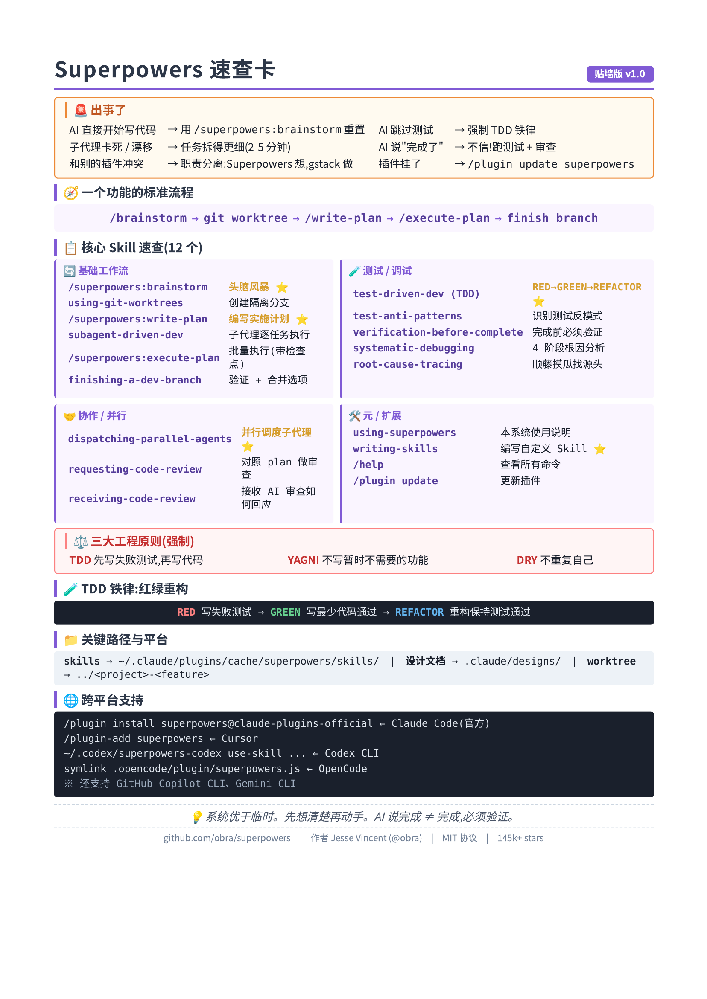
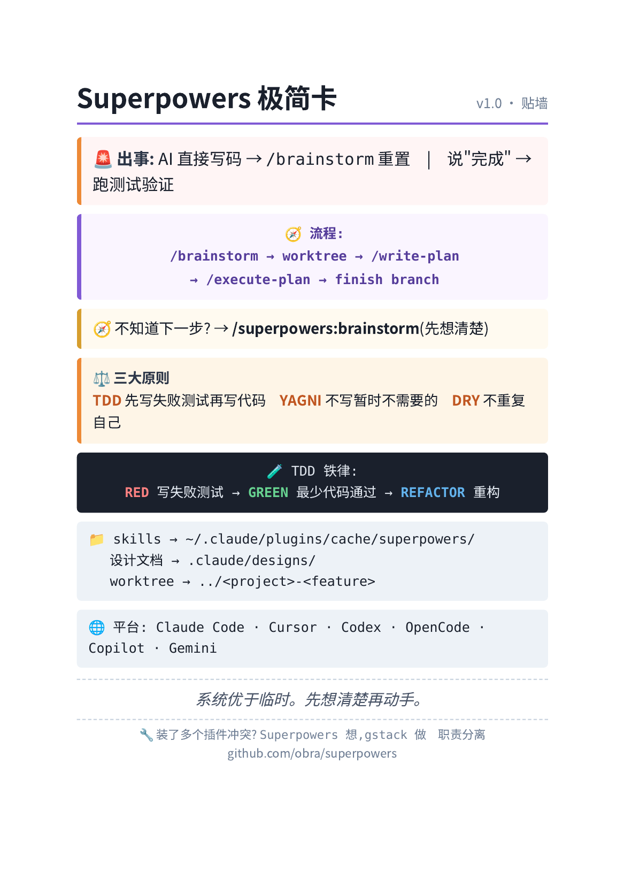

# 2.1.Superpowers

Superpowers 入门到精通:AI 编码的"工程操作系统"完全指南

> 一份从零开始的实战教程,目标:30 分钟跑通,半天入门,一周精通。





## 目录

- [第 0 章:在开始之前——你需要知道 Superpowers 到底是什么](#第-0-章在开始之前你需要知道-superpowers-到底是什么)
- [第 1 章:环境准备(10 分钟跑通)](#第-1-章环境准备10-分钟跑通)
- [第 2 章:第一次握手——`/brainstorm`(20 分钟)](#第-2-章第一次握手brainstorm20-分钟)
- [第 3 章:5 步工作流全景——Superpowers 的核心骨架](#第-3-章5-步工作流全景superpowers-的核心骨架)
- [第 4 章:技能库全解——12 个核心 Skill](#第-4-章技能库全解12-个核心-skill)
- [第 5 章:TDD 铁律——红绿重构实战](#第-5-章tdd-铁律红绿重构实战)
- [第 6 章:子代理驱动开发——大规模任务的并行化](#第-6-章子代理驱动开发大规模任务的并行化)
- [第 7 章:跨平台安装——Codex / Cursor / OpenCode](#第-7-章跨平台安装codex--cursor--opencode)
- [第 8 章:进阶玩法——写你自己的 Skill](#第-8-章进阶玩法写你自己的-skill)
- [第 9 章:对比 gstack——两个项目怎么选](#第-9-章对比-gstack两个项目怎么选)
- [第 10 章:常见争议与陷阱](#第-10-章常见争议与陷阱)
- [第 11 章:精通路径与学习资源](#第-11-章精通路径与学习资源)
- [附录:初始化检查清单](#附录初始化检查清单)

---

## 第 0 章:在开始之前——你需要知道 Superpowers 到底是什么

### 0.1 一句话定义

**Superpowers = 一套 Claude Code 插件,把"软件工程方法论"封装成可自动触发的 Skill,让你的 AI 编码代理像训练有素的工程师一样工作。**

它**不是**:
- ❌ 新的 AI 模型
- ❌ 一组命令清单(虽然有 `/superpowers:*` 命令)
- ❌ 强调"角色扮演"的项目

它是:
- ✅ **核心是一组 `SKILL.md`**(用户感知层都是 Markdown 方法论)
- ✅ 但**不是纯 Markdown 项目**——为了让 Claude Code 之外的平台(Codex、Cursor、OpenCode 等)也用上,它带了一套跨平台适配层:`lib/skills-core.js`(Node 核心库)、`.opencode/plugins/superpowers.js`(系统提示注入)、`.codex/superpowers-codex`(Shell bootstrap CLI)、`hooks/`(如 `find-polluter.sh`)、`agents/code-reviewer.md`(独立角色定义)、`tests/e2e/`(真实的 Go + Svelte 端到端测试项目)
- ✅ 强调**自动触发**(基于上下文,而非手动命令)
- ✅ 内置 **TDD、YAGNI、DRY** 三大工程原则
- ✅ MIT 开源,GitHub:<https://github.com/obra/superpowers>(145k+ stars)

### 0.2 谁搞出来的?

作者是 **Jesse Vincent (@obra)**,资深开源贡献者,曾参与 Perl、PostgreSQL、Kubernetes 等核心项目维护。

**和 gstack 的关键区别**:

| | Superpowers | gstack |
|---|---|---|
| 驱动方式 | **技能驱动**(Skills) | **角色驱动**(Roles) |
| 触发方式 | **自动触发**(上下文感知) | **手动命令**(`/plan-ceo-review` 等) |
| 平台支持 | Claude Code、Codex、Cursor、OpenCode、Copilot、Gemini | 主要 Claude Code |
| 核心哲学 | Systematic over ad-hoc(系统优于临时) | Think → Plan → Build |
| 比喻 | "AI 工程师培训手册" | "AI 虚拟工程团队" |

**一句话区分**:
- Superpowers 让 AI **更像一个训练有素的工程师**(能力内嵌)
- gstack 让 AI **看起来像一个组织良好的团队**(流程外显)

### 0.3 核心 5 步工作流

任何任务都按这个顺序走:

```
brainstorm(头脑风暴)
  ↓ 设计文档确认
using-git-worktrees(隔离分支)
  ↓
writing-plans(编写计划)
  ↓
subagent-driven-development(子代理执行)
  ↓ TDD 铁律
finishing-a-development-branch(收尾交付)
```

### 0.4 三大工程原则

1. **TDD**(Test-Driven Development):先写失败测试 → 写最小代码 → 重构
2. **YAGNI**(You Aren't Gonna Need It):不写暂时不需要的功能
3. **DRY**(Don't Repeat Yourself):不重复自己

### 0.5 适合谁?不适合谁?

| ✅ 适合 | ❌ 不适合 |
|---|---|
| 想让 AI 严格遵循工程流程的人 | 只想快速写个脚本的人(过度工程) |
| 中大型项目、重构、复杂功能 | 一次性 demo / 临时原型 |
| 团队需要统一编码规范 | 一个人 + 小项目 |
| 跨平台用户(Codex/Cursor 用户) | 不愿意被流程约束的人 |

### 0.6 你需要准备什么

| 项目 | 要求 |
|---|---|
| Claude Code | Pro/Max 订阅或 API Key |
| 或者 | Cursor / Codex / OpenCode 任一 |
| Git | 已装 |
| 项目 | 任意 Git 仓库 |

---

## 第 1 章:环境准备(10 分钟跑通)

### 1.1 装 Claude Code(若未装)

```bash
# macOS / Linux / WSL
curl -fsSL https://claude.ai/install.sh | sh

claude --version
```

### 1.2 通过官方插件市场安装(推荐)

在 Claude Code 里输入:

```
/plugin marketplace add obra/superpowers-marketplace
/plugin install superpowers@superpowers-marketplace
```

或者更简单的一行:

```
/plugin install superpowers@claude-plugins-official
```

### 1.3 验证安装

重启 Claude Code,输入:

```
/help
```

你应该看到这三个命令:

```
/superpowers:brainstorm   - 交互式设计细化
/superpowers:write-plan   - 创建实施计划
/superpowers:execute-plan - 批量执行计划
```

如果看到了,✅ 安装成功。

### 1.4 手动安装(备选)

如果插件市场有问题:

```bash
# 1. 克隆仓库
git clone https://github.com/obra/superpowers.git ~/.claude/plugins/cache/superpowers

# 2. Claude Code 会自动发现本地插件
# 重启 claude 即可
```

### 1.5 更新

```
/plugin update superpowers
```

---

## 第 2 章:第一次握手——`/brainstorm`(20 分钟)

### 2.1 不要直接说"帮我写代码"

Superpowers 最反直觉的地方:**它不让 AI 直接写代码**。

你输入:
```
帮我做一个用户登录功能
```

它会**先停下来反问**你,而不会直接动手。这就是 `brainstorm` skill 在起作用。

### 2.2 brainstorm 在做什么

它扮演一个**苏格拉底式的导师**,通过结构化提问帮你想清楚:

- 这是给谁用的?
- 解决什么痛点?
- 现有的替代方案是什么?为什么不够好?
- 验收标准是什么?
- 边界在哪里(MVP / 完整版)?
- 有哪些风险?

### 2.3 实战演练

**输入**:
```
/superpowers:brainstorm 我想做一个命令行工具,把 Markdown 文件转成带样式的 PDF
```

**AI 会问**(示例,实际取决于你的输入):

```
1. 目标用户是谁?(技术写作者?博客作者?普通用户?)
2. 用哪个 Markdown 引擎?(pandoc?markdown-it?marked?)
3. 需要哪些样式选项?(代码高亮?主题?字体?)
4. 平台支持?(macOS only / 跨平台?)
5. 性能要求?(单文件 / 批量?)
6. 验收标准?(转换时间?输出质量?)
```

每回答一个,它会**分块展示设计**,而不是一次性输出大段方案。等你确认后才进入下一步。

### 2.4 输出:设计文档

确认完所有问题后,brainstorm 会把设计保存为文档(通常在 `.claude/designs/` 或项目根目录),里面包含:

- 目标用户
- 功能列表(MVP / 后续)
- 技术选型
- 数据模型
- 接口设计
- 验收标准

**关键**:这份文档是后续所有步骤的"事实来源",不要急着写代码,先确认它对。

---

## 第 3 章:5 步工作流全景——Superpowers 的核心骨架

### 完整流程图

```
┌──────────────────────────────────────────────────┐
│  1. /superpowers:brainstorm                     │
│     头脑风暴 + 设计文档                          │
│     ↓ (设计确认)                                │
│  2. using-git-worktrees                         │
│     创建隔离分支(worktree)                       │
│     ↓                                           │
│  3. /superpowers:write-plan                     │
│     把工作拆成 2-5 分钟的小任务                  │
│     ↓ (计划批准)                                │
│  4. subagent-driven-development                 │
│     (或 /superpowers:execute-plan)              │
│     每个任务分配新子代理,两阶段审查             │
│     ↓ (期间强制 TDD)                            │
│  5. finishing-a-development-branch              │
│     验证测试 + 合并 / PR / 保留 / 丢弃          │
└──────────────────────────────────────────────────┘
```

### 3.1 Step 1: brainstorming(已完成)

见第 2 章。核心:**先想清楚再动手**。

### 3.2 Step 2: using-git-worktrees

**目的**:不污染主分支,在隔离环境工作。

```bash
git worktree add ../myproject-feature feature/login
cd ../myproject-feature
```

**为什么用 worktree 而不是普通分支?**
- ✅ 可以同时跑多个分支(并行任务)
- ✅ 主分支始终保持可发布状态
- ✅ 不会因为某次实验搞坏主分支

**AI 做的事**:
1. 创建 worktree
2. 跑项目设置(`npm install` 等)
3. 验证测试基线干净
4. 后续所有工作都在这里进行

### 3.3 Step 3: writing-plans

**输入**:`/superpowers:write-plan`

**输出**:`plans/<feature-name>.md`,包含:

````markdown
# Task 1: 创建用户模型
- 文件: src/models/user.ts
- 验证: typecheck 通过 + 测试通过
- 预计耗时: 3 分钟
- 完整代码:
  ```typescript
  export interface User { ... }
  ```

# Task 2: 实现密码哈希
- 文件: src/utils/hash.ts
- 验证: 单测覆盖 100%
- ...

# Task 3: ...
````

**关键设计**:
- 每个任务 **2~5 分钟可完成**(防漂移)
- 每个任务包含**精确文件路径**
- 每个任务给出**完整代码**(不是伪代码)
- 每个任务有**验证步骤**(如何知道完成了)

**为什么要这么细?**
- 子代理是 fresh context(见第 6 章),它们没"印象",必须给精确指令
- 细粒度任务 = 可验证 + 可回滚 + 可并行

### 3.4 Step 4: subagent-driven-development

**输入**:`/superpowers:execute-plan`(批量)或 `subagent-driven-development`(逐个)

**核心机制**:
- 主代理分配任务给**全新子代理**(每个任务一个)
- 子代理有 fresh context(不带历史包袱)
- 每个任务结束后,**两阶段审查**:
    1. **规范合规性**(代码符合 plan 吗?)
    2. **代码质量**(有没有反模式?)
- 关键问题会**阻塞进度**

### 3.5 Step 5: finishing-a-development-branch

**输入**:`/finishing-a-development-branch` 或 AI 自动调用

**做的事**:
1. 跑全部测试,确保通过
2. 提供选项:
    - **Merge**:合并到主分支
    - **PR**:创建 Pull Request
    - **Keep**:保留 worktree 不动
    - **Discard**:丢弃(worktree 删除)
3. 清理 worktree

---

## 第 4 章:技能库全解——12 个核心 Skill

Superpowers 的核心资产是它的 **Skill 库**。下面是分类详解。

### 4.1 基础工作流(必学)

| Skill | 作用 | 何时用 |
|---|---|---|
| **brainstorming** | 苏格拉底式提问 + 设计文档 | 任何新功能 / 改动的起点 |
| **using-git-worktrees** | 创建隔离工作区 | 设计批准后,写代码前 |
| **writing-plans** | 任务拆解成 2-5 分钟步骤 | 设计批准后 |
| **subagent-driven-development** | 子代理逐任务执行 | 有 plan 后 |
| **executing-plans** | 批量执行 plan(带检查点) | 想保留更多控制时 |
| **test-driven-development** | 强制 TDD 铁律 | 实施任何功能时 |
| **requesting-code-review** | 对照 plan 做审查 | 每个任务完成后 |
| **finishing-a-development-branch** | 验证 + 合并选项 | 所有任务完成后 |

### 4.2 测试技能

| Skill | 作用 |
|---|---|
| **test-driven-development** | RED → GREEN → REFACTOR 循环 |
| **test-anti-patterns** | 识别和避免测试反模式(假测试、脆弱测试等) |
| **verification-before-completion** | 完成前必须验证(不轻信"完成了") |

### 4.3 调试技能

| Skill | 作用 |
|---|---|
| **systematic-debugging** | 4 阶段根本原因分析(假设 → 验证 → 修复 → 回归) |
| **root-cause-tracing** | 顺藤摸瓜找上游源头 |

### 4.4 协作技能

| Skill | 作用 |
|---|---|
| **dispatching-parallel-agents** | 同时调度多个子代理 |
| **receiving-code-review** | 接收 AI 给你的代码审查时如何回应 |
| **writing-skills** | 创建自定义 Skill(元技能) |

### 4.5 元技能

| Skill | 作用 |
|---|---|
| **using-superpowers** | Superpowers 本身的使用说明 |
| **writing-skills** | 编写自己的 Skill(最佳实践) |

### 4.6 项目的真实结构(不只是 Skill)

```
superpowers/
├── .claude-plugin/        # Claude Code 插件元数据
│   ├── plugin.json
│   └── marketplace.json
├── .codex/                # OpenAI Codex 适配层
│   ├── INSTALL.md
│   └── superpowers-codex  # Shell bootstrap CLI(find-skills/use-skill/bootstrap)
├── .cursor-plugin/        # Cursor 插件定义
│   └── plugin.json
├── .opencode/             # OpenCode 适配层
│   └── plugins/
│       └── superpowers.js # JS:系统提示注入 + 技能目录注册
├── agents/                # Agent 角色定义
│   └── code-reviewer.md
├── hooks/                 # Hook 脚本(如 find-polluter.sh)
├── lib/                   # 跨平台共享逻辑
│   └── skills-core.js     # Codex/OpenCode 共用的 Node 核心库
├── docs/
├── tests/                 # 测试基础设施
│   ├── e2e/               # 真实 Go + Svelte 项目跑端到端验证
│   └── skill-tests/       # 技能触发测试(防止"朴素提示"无法触发)
└── skills/                # ⭐ 14 个核心 skill,用户感知层
    ├── brainstorming/
    │   ├── SKILL.md       # 主入口,Markdown 格式
    │   ├── checklist.md   # 检查清单(可选)
    │   └── examples/      # 示例(可选)
    ├── test-driven-development/
    │   └── SKILL.md       # 包含 DOT/Graphviz 决策流程图
    └── ...
```

**关键认知**:
- 用户**主要打交道**的是 `skills/*/SKILL.md`(方法论层)
- 但要让这套方法论**真的能跑**在 6 个平台上,必须靠 `.codex/`、`.opencode/`、`lib/skills-core.js` 这些**适配层**
- 想验证 skill 写得好不好,`tests/` 提供了**测试驱动的开发流程**——skill 本身也有"测试",这是 Superpowers 元层面的 TDD

`SKILL.md` 的标准结构:

```markdown
---
name: brainstorming
description: 在做任何事之前,先和用户澄清意图
---

# 你必须做的事

1. 永远不要跳过这一步,除非用户明确说"跳过 brainstorm"
2. 通过提问细化模糊的想法
3. 每次只展示一个设计块,等用户确认
4. 把最终设计保存为文档

# 决策框架

- 如果用户给出了具体需求,先确认范围(MVP?)
- 如果用户没明确,问:谁会用?解决什么痛点?
- 探索至少 2 个替代方案

# 输出格式

设计文档必须包含:
- 目标用户
- 核心功能(MVP)
- 后续功能(可选)
- 技术选型 + 理由
- 数据模型
- 验收标准

# 不要做的事

- 不要直接跳到写代码
- 不要一次展示所有内容
- 不要假设用户已经想清楚了
```

---

## 第 5 章:TDD 铁律——红绿重构实战

Superpowers 最核心的"硬约束"之一:**TDD 必须严格遵循**。

### 5.1 三步循环

```
RED    - 写一个失败的测试
GREEN  - 写最少的代码让它通过
REFACTOR - 重构代码,保持测试通过
```

### 5.2 实战:为"用户密码哈希"写代码

#### Step 1: RED

```typescript
// test/hash.test.ts
import { hashPassword } from '../src/utils/hash';

describe('hashPassword', () => {
  it('应该返回不同的哈希值即使密码相同(因为 salt)', () => {
    const h1 = hashPassword('secret');
    const h2 = hashPassword('secret');
    expect(h1).not.toBe(h2);  // ← 故意失败
  });
});
```

跑测试:`npm test` → **失败**(因为 `hash` 函数还没写)。

#### Step 2: GREEN

写**最少**代码让它通过:

```typescript
// src/utils/hash.ts
import bcrypt from 'bcrypt';

export function hashPassword(password: string): string {
  return bcrypt.hashSync(password, 10);
}
```

跑测试 → **通过**。✅

#### Step 3: REFACTOR

看代码有没有可改进的地方(命名、可读性、重复),改完后跑测试确保仍然通过。

### 5.3 TDD 反模式(必须避免)

| 反模式 | 为什么坏 | 怎么修 |
|---|---|---|
| **测试 mock 到测的是 mock 而不是代码** | 测试永远绿但代码是坏的 | 写集成测试,关键路径不 mock |
| **一个测试断言太多东西** | 失败时不知道哪里坏了 | 一个测试一个行为 |
| **测试依赖顺序** | 并行跑或单独跑会挂 | 每个测试独立 setup |
| **为了覆盖率写假测试** | 100% 覆盖但 0% 信心 | 测真实行为 |
| **先写实现再补测试** | 违反 TDD | 强制先写失败测试 |

### 5.4 TDD 的真实价值

不要以为 TDD 是"为了写测试"。它真正的价值:

1. **设计先行**:写测试时,你在想"这个函数怎么用",而不是"这个函数怎么实现"
2. **回归保护**:以后改东西,测试告诉你有没有破坏
3. **文档作用**:测试就是"这个函数应该做什么"的活文档
4. **重构信心**:有测试罩着,你敢大刀阔斧改

---

## 第 6 章:子代理驱动开发——大规模任务的并行化

### 6.1 什么是子代理?

子代理(subagent)是 Claude Code 启动的**全新 agent 实例**,它:
- 有**独立的 context**(不知道主代理的历史对话)
- 只能访问你给的工具和文件
- 完成后**返回结果**,主代理继续

### 6.2 为什么用子代理?

主代理的问题:
- 上下文会越来越长,开始"漂移"
- 太多任务挤在一个对话里,容易遗漏
- 失败重试成本高

子代理的好处:
- ✅ Fresh context,每次都是干净起点
- ✅ 任务边界清晰,失败容易重试
- ✅ 可以并行(节省时间)
- ✅ 审查机制独立

### 6.3 两阶段审查

每个子代理完成任务后,会有**两个审查代理**接力:

**Phase 1: 规范合规性审查**
- 代码和 plan 完全一致吗?
- 所有验收标准都满足了吗?
- 测试都通过了吗?

**Phase 2: 代码质量审查**
- 有没有反模式?
- 命名、抽象、可维护性?
- 有没有"看起来工作但很脆弱"的代码?

**关键问题会阻塞进度**(必须先解决),次要问题只是建议。

### 6.4 实战:并行开发 3 个功能

假设 plan 里有 3 个独立任务:

```markdown
# Task 1: 用户注册 API
# Task 2: 用户登录 API
# Task 3: 用户登出 API
```

可以这样调度:

```
/dispatching-parallel-agents 启动 3 个子代理并行执行 Task 1/2/3
```

每个子代理:
1. 读 plan 里对应任务
2. 用 TDD 实现
3. 跑测试
4. 提交

主代理:
1. 收集 3 个子代理结果
2. 整合
3. 整体跑回归
4. 进入收尾

**时间节省**:3 倍(如果 API 是瓶颈)。

---

## 第 7 章:跨平台安装——Codex / Cursor / OpenCode

Superpowers 最大的优势之一:**多平台通用**。

### 7.1 Codex CLI

**快速安装**(在 Codex 里输入):
```
Fetch and follow instructions from https://raw.githubusercontent.com/obra/superpowers/refs/heads/main/.codex/INSTALL.md
```

**手动安装**:
```bash
mkdir -p ~/.codex/superpowers
git clone https://github.com/obra/superpowers.git ~/.codex/superpowers

# 创建符号链接让 Codex 发现
mkdir -p ~/.agents/skills
ln -s ~/.codex/superpowers/skills ~/.agents/skills/superpowers
```

**使用**:
```bash
~/.codex/superpowers/.codex/superpowers-codex find-skills
~/.codex/superpowers/.codex/superpowers-codex use-skill superpowers:brainstorming
```

### 7.2 Cursor

在 Cursor 的 Agent 聊天里:
```
/plugin-add superpowers
```

### 7.3 OpenCode

告诉 OpenCode:
```
Clone https://github.com/obra/superpowers to ~/.config/opencode/superpowers, 
then create directory ~/.config/opencode/plugin, 
then symlink ~/.config/opencode/superpowers/.opencode/plugin/superpowers.js 
to ~/.config/opencode/plugin/superpowers.js, then restart opencode.
```

或者手动:
```bash
git clone https://github.com/obra/superpowers.git ~/.config/opencode/superpowers
mkdir -p ~/.config/opencode/plugin
ln -sf ~/.config/opencode/superpowers/.opencode/plugin/superpowers.js ~/.config/opencode/plugin/superpowers.js
```

### 7.4 GitHub Copilot CLI

支持方式类似 Codex,通过 `~/.agents/skills/` 暴露 skill。

### 7.5 Gemini CLI

同样通过 skill 目录机制集成。

---

## 第 8 章:进阶玩法——写你自己的 Skill

### 8.1 为什么要写自己的 Skill?

默认 Skill 是通用最佳实践。但你的团队可能有特定规范:

- 特定框架的使用规范
- 特定命名约定
- 特定部署流程
- 特定安全审查要求

### 8.2 一个 Skill 的最小结构

```
skills/
└── my-team-conventions/
    └── SKILL.md
```

### 8.3 SKILL.md 模板

```markdown
---
name: my-team-conventions
description: 团队特定规范,任何修改 .ts/.tsx 文件时自动触发
---

# 角色

你是一个 [前端 / 后端 / 全栈] 工程师,严格遵循本团队的编码规范。

# 强制规范

## 文件结构
- 组件放 `src/components/`
- 工具函数放 `src/utils/`
- 类型定义放 `src/types/`

## 命名
- 组件: PascalCase
- 函数: camelCase
- 常量: UPPER_SNAKE_CASE
- 私有函数: 以下划线开头

## 测试
- 每个组件必须有 `*.test.tsx`
- 测试覆盖率不低于 80%
- E2E 测试用 Playwright

## 代码审查必查项
- 没有 TODO 注释留在代码里
- 没有 console.log
- 没有注释掉的代码
- 错误处理必须显式

# 不要做的事

- 不要用 any(除非加注释解释)
- 不要写超过 50 行的函数
- 不要在循环里 await
```

### 8.4 自动触发的秘密

Skill 能"自动触发"靠的是 `description` 字段。Claude Code 会基于**当前任务的语义**匹配 description,决定是否加载。

**写好 description 的技巧**:
- ✅ 明确**触发场景**:"任何修改 .ts/.tsx 文件时"
- ✅ 包含**关键词**:用户提到"测试"、"重构"、"性能"时
- ❌ 别太宽泛:"任何时候都用" → 会一直加载,污染 context

### 8.5 测试你的 Skill

写完后,试试触发场景:
```
重构 src/components/Button.tsx,加上 size 属性
```

如果 AI 自动开始按你的规范工作,说明 description 写得对。

---

## 第 9 章:对比 gstack——两个项目怎么选

你可能已经装了 gstack(我之前也写过它的教程)。两个项目能不能一起用?怎么选?

### 9.1 核心差异

| 维度 | Superpowers | gstack |
|---|---|---|
| **核心思想** | AI 应该按方法论工作 | AI 应该是虚拟团队 |
| **触发方式** | 自动(上下文感知) | 手动(显式命令) |
| **平台** | 6 个(Claude/Codex/Cursor 等) | 主要 Claude Code |
| **架构** | Markdown skills + JS/Shell 跨平台适配层 | TypeScript daemon + Markdown skills |
| **强项** | 流程纪律、TDD、子代理 | 角色视角、浏览器测试 |
| **弱项** | 没有真实浏览器测试 | 流程不够自动 |

### 9.2 选 Superpowers 如果...

- ✅ 你更在意**执行质量**(复杂后端 / 重构 / 大型项目)
- ✅ 你希望 AI **自动遵循流程**,不用每次提醒
- ✅ 你跨平台(用 Codex 或 Cursor)
- ✅ 你想做 TDD 严格的工程实践

### 9.3 选 gstack 如果...

- ✅ 你更在意**团队式决策**(产品 / 架构 / 设计多视角)
- ✅ 你做 **Web 应用**,需要真实浏览器测试
- ✅ 你喜欢显式管理每个步骤
- ✅ 你常做独立项目 / 创业

### 9.4 组合使用(进阶)

两个不是互斥的。最强组合:

```
Superpowers 负责:  想清楚、做扎实(执行层)
  - brainstorming
  - writing-plans
  - TDD
  - 子代理
  - code review

gstack 负责:  验真、交付(操作层)
  - /plan-ceo-review (高层决策)
  - /review (代码审查的另一个视角)
  - /qa (真实浏览器测试)
  - /ship (发布)
```

**典型场景**:
1. `/superpowers:brainstorm` 想清楚需求
2. `/superpowers:write-plan` 拆任务
3. 子代理执行 + TDD
4. `/review` (gstack) 做独立视角审查
5. `/qa` (gstack) 做浏览器测试
6. `/ship` (gstack) 发布

如果你做的是复杂 Web 产品,这套组合非常厉害。

---

## 第 10 章:常见争议与陷阱

### 10.1 "太重了,我只是想写个小脚本"

确实,Superpowers 不适合 1 小时搞定的 demo。流程成本 > 收益。

**判断标准**:
- 任务 < 30 分钟 → 直接写
- 任务 30 分钟 ~ 2 小时 → brainstorm + 直接写
- 任务 > 2 小时 → 走完整 5 步

### 10.2 "AI 太严格了,我只是想... "

TDD 强制有时代价很大(UI 设计、探索性编程)。

**解法**:在 brainstorm 时**明确说**"这是一个实验性任务,不需要严格 TDD"。AI 会按你的意图调整。

### 10.3 "子代理失败了,怎么 debug"

子代理失败常见原因:
1. Plan 不够细(给不出精确指令)
2. 任务拆得太大(超过 5 分钟)
3. 上下文依赖没传递

**调试方法**:
- 看子代理的返回(它会说明卡在哪)
- 调整 plan 重新分配
- 或者 fallback 到 `executing-plans`(批量执行而非子代理)

### 10.4 "和别的插件冲突"

装多个 skills 框架时,可能一个 skill 被两个项目都定义了。

**解决**:用**职责分离**原则:
- Superpowers 管"思考和流程"
- gstack 管"操作和验证"
- 别让两边都覆盖同一阶段

### 10.5 "AI 一直在反问我,我不耐烦"

Brainstorm 阶段 AI 会问很多问题。如果觉得太多:
- 用 `/superpowers:brainstorm` 时输入更完整的初始需求
- 或者在 brainstorm 过程中说"其他方面按默认即可"
- AI 会尊重你的边界

### 10.6 心理陷阱:别把"完成"当"工作"

Superpowers 强调 **verification-before-completion**:
- ❌ "我觉得差不多了" → 不是完成
- ✅ "测试全过 + 审查通过 + 用户验收" → 完成

AI 倾向于说"完成了"。你的工作是**不信,验证**。

---

## 第 11 章:精通路径与学习资源

### 11.1 学习路线图

```
Day 1 (2 小时)
├─ 装环境,跑 /superpowers:brainstorm 一次
├─ 读 brainstorming 和 writing-plans 的 SKILL.md
└─ 完成一个真实小任务的 5 步流程

Week 1 (每天 30 分钟)
├─ 每天用一个新 skill
├─ 写一个自定义 skill
└─ 尝试 dispatching-parallel-agents

Week 2 (每天 1 小时)
├─ 跨平台测试(Codex / Cursor)
├─ 完整跑一个中等规模功能
├─ 和 gstack 组合使用
└─ 给团队做一次分享

Month 1
├─ 沉淀团队特定 skills
├─ 集成到 CI / PR 流程
└─ 总结内部最佳实践
```

### 11.2 推荐阅读(按优先级)

1. **官方仓库**:<https://github.com/obra/superpowers>(必读)
2. **掘金:Claude Superpowers 结构化工作流插件**(中文实战)
3. **CSDN:从 claude skills 到 superpowers 项目**(源码分析)
4. **CSDN:Superpowers 与 gstack 深度解析**(对比)
5. **No Priors 播客 obra 那期**(英文访谈)
6. **官方博客**:superpowers.work(若有)

### 11.3 三个里程碑(完成 = 算精通)

- [ ] **L1**:完成一个真实功能,严格走完 5 步,记录每个步骤的耗时和卡点
- [ ] **L2**:写 3 个自定义 skill,被至少 2 个同事采用,处理 1 次跨平台问题
- [ ] **L3**:把 Superpowers 集成到 CI,PR 自动触发 brainstorming 和 TDD 检查

---

## 附录:初始化检查清单

```markdown
## Superpowers 启动清单

### 环境
- [ ] Claude Code 已装且登录(或 Cursor/Codex/OpenCode)
- [ ] 插件市场已添加
- [ ] superpowers 已安装
- [ ] /help 能看到 3 个 /superpowers:* 命令

### 第一次跑通
- [ ] /superpowers:brainstorm 跑过一次真实需求
- [ ] 产出了设计文档
- [ ] 走过 git worktrees
- [ ] 走过 write-plan
- [ ] 子代理完成过至少 1 个任务
- [ ] finishing-a-development-branch 跑过

### 进阶
- [ ] 写过至少 1 个自定义 skill
- [ ] 至少用过 1 次 dispatching-parallel-agents
- [ ] 试过 TDD 严格流程
- [ ] 跨平台测试过(Codex / Cursor)
- [ ] 和 gstack 组合使用过(可选)

### 心法
- [ ] 记住:"先想清楚,再动手"
- [ ] 记住:"AI 说完成 ≠ 完成"
- [ ] 记住:"2-5 分钟拆任务,别让 AI 漂"
```

---

## 写在最后

Superpowers 是工具,但它背后是一种**工程哲学**:

> **Systematic over ad-hoc.** 系统优于临时。

它的价值不在"提高速度",而在**提高可预期性**。

- 当你下班前让 AI 跑一个重构,明天回来它不会"忘了自己在干嘛"
- 当你让 AI 写支付代码,它不会跳过"先写测试"
- 当你让 5 个 AI 同时干活,它们不会互相污染 context

不要把它当"加速器",把它当"工程纪律的执行者"。

去用起来,改起来,写你自己的 skill 库。

——

**版本**:基于 Superpowers 2026 年 3 月发布版本撰写。
**反馈**:发现错漏或想补充实战案例,直接改这份文档就行。