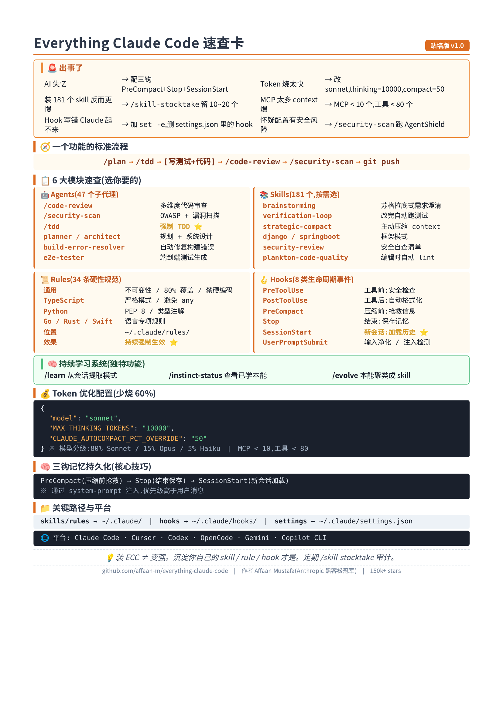
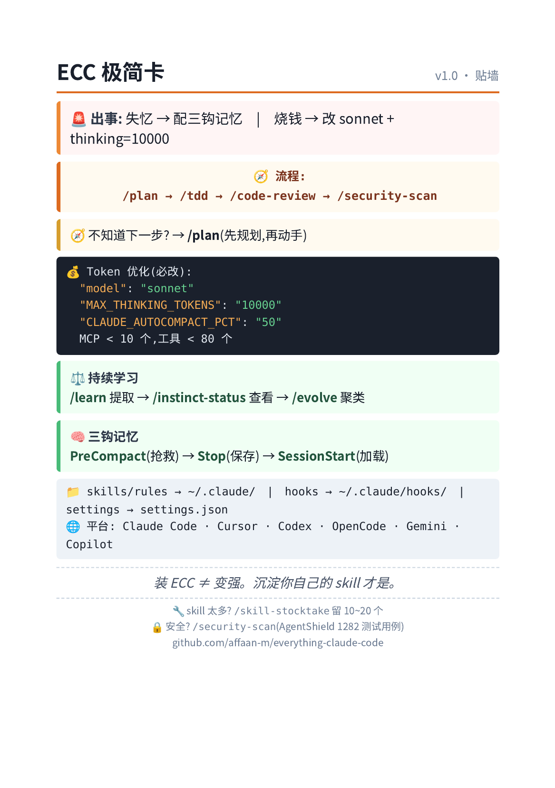

# 2.3.everything claude code


Everything Claude Code 入门到精通:Anthropic 黑客松冠军的实战配置完全指南

> 一份从零开始的实战教程,目标:30 分钟跑通,半天入门,一周精通。





## 目录

- [第 0 章:在开始之前——ECC 是什么,和其他框架有什么不同](#第-0-章在开始之前ecc-是什么和其他框架有什么不同)
- [第 1 章:环境准备(10 分钟跑通)](#第-1-章环境准备10-分钟跑通)
- [第 2 章:6 大模块全景](#第-2-章6-大模块全景)
- [第 3 章:核心 13 个子代理——你身边的"虚拟专家团队"](#第-3-章核心-13-个子代理你身边的虚拟专家团队)
- [第 4 章:181 个 Skill——选你要的,别装全](#第-4-章181-个-skill选你要的别装全)
- [第 5 章:79 个命令——高频工作流速查](#第-5-章79-个命令高频工作流速查)
- [第 6 章:34 条 Rules——给 AI 立规矩](#第-6-章34-条-rules给-ai-立规矩)
- [第 7 章:8 类 Hooks——跨会话记忆 + 安全防御](#第-7-章8-类-hooks跨会话记忆--安全防御)
- [第 8 章:三钩组合——跨会话记忆持久化](#第-8-章三钩组合跨会话记忆持久化)
- [第 9 章:AgentShield——AI 代理配置安全扫描器](#第-9-章agentshieldai-代理配置安全扫描器)
- [第 10 章:Token 优化——少烧 60% 钱](#第-10-章token-优化少烧-60-钱)
- [第 11 章:跨平台安装——Cursor / Codex / OpenCode](#第-11-章跨平台安装cursor--codex--opencode)
- [第 12 章:对比 gstack / superpowers——三个项目怎么选](#第-12-章对比-gstack--superpowers三个项目怎么选)
- [第 13 章:常见陷阱与争议](#第-13-章常见陷阱与争议)
- [第 14 章:精通路径与学习资源](#第-14-章精通路径与学习资源)
- [附录:初始化检查清单](#附录初始化检查清单)

---

## 第 0 章:在开始之前——ECC 是什么,和其他框架有什么不同

### 0.1 一句话定义

**Everything Claude Code(ECC)= 一套"生产级 Claude Code 配置全家桶",由 181 个 Skill、47 个 Agent、34 条 Rule、8 类 Hook、79 个 Command 组成,经过 10 个月高强度生产验证。**

它**不是**:
- ❌ 新的 AI 模型
- ❌ 一个独立工具
- ❌ 单一方法论(像 superpowers 那样)
- ❌ 角色扮演框架(像 gstack 那样)

它是:
- ✅ **配置集合**——拿来就能用的 .md + 脚本
- ✅ **生产验证**——来自真实产品 10 个月高强度使用
- ✅ **跨平台**——支持 Claude Code、Cursor、Codex、OpenCode、Gemini CLI
- ✅ MIT 开源,GitHub:<https://github.com/affaan-m/everything-claude-code>(150k+ stars)

### 0.2 谁搞出来的?

**Affaan Mustafa(@affaan-m)**
- 加州大学圣地亚哥分校 + 华盛顿大学
- 前 pmx.trade 创始工程师
- 凭借和搭档用 Claude Code 做的项目 **Zenith**,在 **Anthropic x Forum Ventures 黑客松** 纽约站夺冠
- GitHub 4,600+ 粉丝,170+ 贡献者
- 同期还维护了 AgentShield(370 stars,AI 代理安全扫描)

### 0.3 ECC 最大的不同

如果说:
- **Superpowers** 是"AI 工程师培训手册"——方法论
- **gstack** 是"AI 虚拟工程团队"——组织结构
- **ECC** 就是"AI 工程百宝箱"——**一个真实工程师 10 个月实战沉淀的所有最佳实践**

它最大的特点是:**规模大、覆盖广、经过生产验证**。其他框架更偏"理论框架",ECC 更偏"实战资产"。

### 0.4 6 大模块速览

| 模块 | 数量 | 作用 |
|---|---|---|
| **Skills** | 181 | 工作流、领域知识、框架模式 |
| **Agents** | 47 | 专业子代理(代码审查、安全扫描、TDD 等) |
| **Rules** | 34 | 编码规范、最佳实践(通用 + 9 种语言) |
| **Hooks** | 8 类 | 生命周期自动化(格式化、记忆、安全检查) |
| **Commands** | 79 | 斜杠快捷命令(逐步迁移到 Skills) |
| **MCP** | 多套 | 外部服务集成(GitHub、Supabase、Vercel 等) |

### 0.5 ECC 解决的核心痛点

1. **上下文窗口爆炸**:MCP 工具描述占满 context → 给出量化阈值
2. **Token 成本失控**:默认用 Opus 太贵 → 给出模型分级策略
3. **会话信息丢失**:新会话失忆 → 跨会话记忆持久化
4. **重复劳动**:每次审查/测试/修构建都要重新解释 → 固化为可调用流程
5. **AI 代理安全风险**:恶意 hook、注入攻击 → AgentShield 扫描

### 0.6 适合谁?不适合谁?

| ✅ 适合 | ❌ 不适合 |
|---|---|
| Claude Code 重度用户 | 刚接触 AI 编程,只想要"补全"的人 |
| 想把零散经验沉淀成可复用资产的人 | 简单小项目 / demo |
| 维护大型项目、任务链长的人 | 不愿投入配置成本的人 |
| 关注 AI 代理安全风险的人 | 觉得装个插件就要"立竿见影"的人 |
| 想学习别人配置的人 | — |

---

## 第 1 章:环境准备(10 分钟跑通)

### 1.1 装 Claude Code(若未装)

```bash
curl -fsSL https://claude.ai/install.sh | sh
claude --version
```

### 1.2 方式 A:插件市场安装(推荐)

在 Claude Code 里输入:

```
/plugin marketplace add affaan-m/everything-claude-code
/plugin install everything-claude-code@everything-claude-code
```

### 1.3 方式 B:手动 git 安装(必须有这一步!)

**重要**:ECC 的 Rules 必须**手动复制**,插件市场不会自动装:

```bash
# 克隆仓库
git clone https://github.com/affaan-m/everything-claude-code.git
cd everything-claude-code

# 安装通用规则
cp -r rules/common/* ~/.claude/rules/

# 按你的语言栈选择性安装
cp -r rules/typescript/* ~/.claude/rules/   # TS/JS
cp -r rules/python/* ~/.claude/rules/        # Python
cp -r rules/golang/* ~/.claude/rules/        # Go
cp -r rules/swift/* ~/.claude/rules/         # Swift
# ... 等
```

### 1.4 方式 C:全量安装脚本

```bash
# macOS / Linux
git clone https://github.com/affaan-m/everything-claude-code.git
cd everything-claude-code
npm install
./install.sh --profile full

# Windows
git clone https://github.com/affaan-m/everything-claude-code.git
cd everything-claude-code
npm install
.\install.ps1 --profile full
```

### 1.5 验证

重启 Claude Code,试试这些命令:

```
/plan 给项目加上用户认证
/tdd
/code-review
/security-scan
/learn
```

能正常调用,说明 ✅ 装好了。

---

## 第 2 章:6 大模块全景

ECC 的精髓是"**模块化协同**"。先建立一个心智模型:

```
┌──────────────────────────────────────────────────────────┐
│                  用户输入(自然语言)                       │
└─────────────────────┬────────────────────────────────────┘
                      ▼
        ┌─────────────────────────────┐
        │   Hooks(8 类生命周期事件)     │  ← 在工具调用前后自动触发
        │   - PreToolUse               │
        │   - PostToolUse              │
        │   - PreCompact / Stop        │
        │   - SessionStart / ...       │
        └─────────────┬───────────────┘
                      ▼
        ┌─────────────────────────────┐
        │   Skills(181 个工作流)        │  ← 上下文感知,自动加载
        │   - tdd-workflow             │
        │   - verification-loop        │
        │   - strategic-compact        │
        │   - django-patterns          │
        │   - security-review          │
        └─────────────┬───────────────┘
                      ▼
        ┌─────────────────────────────┐
        │   Rules(34 条硬性规范)        │  ← 持续强制执行
        │   - 不可变性优先              │
        │   - 80% 测试覆盖底线          │
        │   - 禁止硬编码密钥            │
        └─────────────┬───────────────┘
                      ▼
        ┌─────────────────────────────┐
        │   Agents(47 个子代理)         │  ← 复杂任务派专家
        │   - code-reviewer            │
        │   - security-reviewer        │
        │   - tdd-guide                │
        │   - planner                  │
        └─────────────┬───────────────┘
                      ▼
        ┌─────────────────────────────┐
        │   Commands(79 个快捷入口)     │  ← 用户主动调用
        │   - /plan /tdd /code-review  │
        └─────────────┬───────────────┘
                      ▼
        ┌─────────────────────────────┐
        │   MCP Servers(外部能力)       │  ← GitHub / DB / 部署
        └─────────────────────────────┘
```

### 关键认知

- **Skills 是"怎么做事"**(自动触发)
- **Agents 是"谁来做"**(派给专家)
- **Rules 是"必须遵守"**(持续约束)
- **Hooks 是"什么时候自动跑"**(事件驱动)
- **Commands 是"快速调用"**(用户入口)
- **MCP 是"外部世界"**(能力扩展)

它们协同,而不是平行。

---

## 第 3 章:核心 13 个子代理——你身边的"虚拟专家团队"

ECC 早期有 13 个核心 agent,后来扩展到 47 个。下面是**最常用的 13 个**:

| Agent | 作用 | 何时用 |
|---|---|---|
| **planner** | 任务拆解 + 优先级 | 复杂功能开始前 |
| **architect** | 系统设计 + 技术选型 | 架构决策时 |
| **code-reviewer** | 多维度代码质量审查 | PR 合并前 |
| **security-reviewer** | OWASP + 漏洞扫描 | 涉及认证 / 支付 / PII |
| **tdd-guide** | 强制 TDD 流程 | 任何新功能 |
| **build-error-resolver** | 自动定位 + 修复构建错误 | CI 失败时 |
| **e2e-tester** | 端到端测试生成 | 前端功能完成 |
| **doc-updater** | 自动更新 API 文档 / README | 文档同步 |
| **refactor-cleaner** | 死代码清理 + 散落文件 | 项目维护期 |
| **db-migration** | Prisma / Drizzle / Django 迁移 | 数据库变更 |
| **deploy-helper** | CI/CD 流水线部署 | 发布前 |
| **language-typescript** | TypeScript 深度专家 | TS 专项 |
| **language-python** | Python 深度专家 | Python 专项 |

### 实战:用 code-reviewer 审查你的代码

```
/code-review
```

AI 会自动:
1. 收集最近 git diff
2. 对照 plan / spec
3. 启动 code-reviewer 子代理
4. 输出结构化报告(致命 / 重要 / 次要)

### 实战:用 security-reviewer 跑安全审计

```
/security-scan
```

会检查:
- 硬编码 API Key / Token
- SQL 注入风险
- 认证 / 授权漏洞
- 加密算法是否安全
- 依赖是否有已知漏洞

---

## 第 4 章:181 个 Skill——选你要的,别装全

**重要忠告**:不要试图全部使用。181 个 skill 太多了,你的 context 会被污染。

### 4.1 按需分类

#### 测试类(必装)
- `tdd-workflow` — RED-GREEN-REFACTOR 完整流程
- `verification-loop` — 修改后自动跑测试 / lint / 类型检查
- `test-coverage` — 检查覆盖率,目标 80%+
- `testing-anti-patterns` — 识别测试反模式

#### 策略 / 流程类(必装)
- `brainstorming` — 苏格拉底式需求澄清
- `strategic-compact` — 主动在逻辑断点压缩 context
- `multi-plan` — 多模型协同规划
- `multi-execute` — 并行子任务

#### 后端框架(按需)
- `django-patterns` / `django-security` / `django-tdd`
- `springboot-patterns` / `springboot-security` / `springboot-tdd`
- `laravel-patterns` / `nestjs-patterns`
- `golang-patterns` / `golang-testing`
- `rust-patterns`

#### 前端(按需)
- `frontend-patterns` — React/Next.js 最佳实践
- `responsive-design` — 响应式设计
- `css-architecture` — CSS 架构

#### 安全 / 质量(必装)
- `security-review` — 自查清单
- `security-scan` — 集成 AgentShield
- `plankton-code-quality` — 编辑时自动 lint

#### 运维(按需)
- `docker-patterns` — Dockerfile 优化
- `deployment-patterns` — CI/CD 流水线
- `database-migrations` — 迁移模式
- `pm2` — PM2 服务管理

#### 内容 / 业务(2025+ 新增)
- `article-writing` — 无 AI 腔的长文写作
- `content-engine` — 多平台内容生成
- `market-research` — 带来源引用的市场调研
- `investor-materials` — 商业计划书 / 财务模型

### 4.2 实战:用 skill-stocktake 审计你的 skills

```
/skill-stocktake
```

这会列出你装了哪些 skill、最近用过哪些、哪些是死代码。

### 4.3 实战:用 /learn 让 AI 从你身上学

```
/learn
```

ECC 有个独特功能:从当前会话提取模式,保存为**"本能"(instinct)**。下次再遇到类似场景,自动应用。

```
/instinct-status    # 查看已学习的本能
/evolve             # 把相关本能聚类成正式 skill
```

例如:
- 你常用 `pnpm` → ECC 学到
- 你命名用 `kebab-case` → 学到
- 你错误处理用 try-catch → 学到

用得越久,ECC 越懂你。

---

## 第 5 章:79 个命令——高频工作流速查

下面是你会**天天用**的命令:

### 5.1 规划 / 设计

| 命令 | 作用 |
|---|---|
| `/plan <需求>` | 启动 planner,生成详细实施计划 |
| `/multi-plan <需求>` | 多模型协同规划 |
| `/design <系统>` | 系统设计 + 技术选型 |

### 5.2 实施

| 命令 | 作用 |
|---|---|
| `/tdd <功能>` | 强制 TDD 流程开发 |
| `/execute-plan` | 执行已写好的 plan |
| `/multi-execute` | 并行执行多个子任务 |
| `/multi-backend` / `/multi-frontend` | 多代理前后端协同 |
| `/refactor-clean` | 死代码清理 |

### 5.3 质量

| 命令 | 作用 |
|---|---|
| `/code-review` | 代码审查 |
| `/security-scan` | 安全审计(AgentShield) |
| `/test-coverage` | 覆盖率检查 |
| `/e2e <URL>` | 端到端测试 |

### 5.4 文档 / 维护

| 命令 | 作用 |
|---|---|
| `/update-docs` | 同步 API 文档 / README |
| `/learn` | 从会话提取模式 |
| `/instinct-status` | 查看本能 |
| `/evolve` | 本能聚类为 skill |

### 5.5 配置

| 命令 | 作用 |
|---|---|
| `/setup-pm` | 配置默认包管理器 |
| `/skill-stocktake` | 审计已装 skill |
| `/checkpoints` | 文件级撤销点管理 |
| `/cost` | 查看当前会话 token 消耗 |

---

## 第 6 章:34 条 Rules——给 AI 立规矩

Rules 是 ECC 最被低估的部分。**它们会持续起作用**,不像 skill 只在特定场景。

### 6.1 通用 Rules(`rules/common/`)

#### 代码风格
- 不可变性优先(创建新对象,而不是修改)
- 单一职责(每个函数 / 文件只做一件事)
- 命名规范(变量、函数、类、常量)

#### Git 工作流
- 提交信息格式:`feat:` / `fix:` / `docs:` / `refactor:` 前缀
- PR 流程规范
- 禁止 force push 到主分支

#### 测试要求
- TDD 优先
- 80% 覆盖率底线
- 关键路径必须有 e2e 测试

#### 安全要求
- 强制性安全检查
- 禁止硬编码密钥
- 依赖审计

### 6.2 语言专项 Rules

每种语言有自己的规则集:

| 语言 | 关键规则 |
|---|---|
| **TypeScript** | 严格模式、避免 any、类型完备 |
| **Python** | PEP 8、类型注解、列表推导式使用场景 |
| **Go** | 错误处理、指针使用、并发模式 |
| **Rust** | 借用检查、生命周期、unsafe 使用 |
| **Swift** | 可选值处理、ARC、协议导向 |
| **PHP** | PSR 标准、命名空间、Composer |
| **Perl** | 严格引用、模块化 |
| **Java** | 异常处理、并发、Stream API |
| **Kotlin** | 协程、空安全、扩展函数 |
| **C++** | RAII、智能指针、模板元编程 |

### 6.3 Rules 的工作机制

Rules 加载到 context 后,**会作为"行为约束"持续影响 AI 的输出**。

例如,装了 `rules/common/security.md` 后,AI 写代码时**会主动避免**:
- 拼字符串拼 SQL
- 把 token 写到日志
- 用 `eval()` / `exec()` 解析不可信输入

不需要每次提醒。

### 6.4 自定义 Rules

```bash
# 项目根目录
mkdir -p .claude/rules
cat > .claude/rules/my-team.md << 'EOF'
# 我团队特有规范
- 所有 API 必须用 RESTful 风格
- 数据库迁移必须可回滚
- 错误信息不能含内部细节
- 提交前必须跑 npm run lint
EOF
```

---

## 第 7 章:8 类 Hooks——跨会话记忆 + 安全防御

ECC 的 Hooks 是在特定事件触发时**自动执行的脚本**。这是它最"工程化"的部分。

### 7.1 8 类 Hook 事件

| Hook | 触发时机 | 典型用途 |
|---|---|---|
| **PreToolUse** | 工具调用前 | 安全检查、权限验证、确认破坏性操作 |
| **PostToolUse** | 工具调用后 | 自动格式化、运行 linter、记录日志 |
| **UserPromptSubmit** | 用户提交消息时 | 输入净化、注入检测 |
| **Stop** | 会话自然结束 | 保存记忆、生成摘要 |
| **PreCompact** | 上下文压缩前 | 提取关键信息保存 |
| **Notification** | 任务完成通知 | 外部系统集成(Slack / 邮件) |
| **SessionStart** | 新会话开始 | 加载历史记忆 |
| **PermissionRequest** | AI 请求新权限时 | 审批 / 拒绝 |

### 7.2 实战:自动格式化 hook

`~/.claude/hooks/post-tool-use/auto-format.sh`:

```bash
#!/bin/bash
# 当 Edit / Write 工具修改了 .ts / .tsx / .js / .jsx 文件,自动 prettier 格式化

FILE_PATH="$CLAUDE_TOOL_INPUT_FILE_PATH"

if [[ "$FILE_PATH" =~ \.(ts|tsx|js|jsx)$ ]]; then
    npx prettier --write "$FILE_PATH" 2>/dev/null
    # 检查是否还有 console.log 残留
    if grep -n "console.log" "$FILE_PATH" > /dev/null; then
        echo "⚠️ 警告: 文件 $FILE_PATH 中发现 console.log 残留"
    fi
fi
```

### 7.3 实战:Pre-commit 安全检查

`~/.claude/hooks/pre-tool-use/secret-scan.sh`:

```bash
#!/bin/bash
# 在 git commit 前扫描是否含密钥

COMMAND="$CLAUDE_TOOL_INPUT_COMMAND"

if [[ "$COMMAND" =~ git\ commit ]]; then
    if git diff --cached | grep -E -i "(api[_-]?key|secret|password|token)\s*[:=]\s*['\"]" > /dev/null; then
        echo "❌ 阻止提交:检测到可能的硬编码密钥"
        echo "请使用环境变量或密钥管理服务"
        exit 1
    fi
fi
```

### 7.4 Hook 的安全价值

- **防止 AI 误删**:`PreToolUse` 拦 `rm -rf`
- **防止密钥泄露**:自动扫描 + 阻止
- **防止上下文污染**:战略性的 `PreCompact`
- **防止 agent 漂移**:每个 hook 强制检查当前状态

---

## 第 8 章:三钩组合——跨会话记忆持久化

ECC 中**最被低估的技术亮点**是 PreCompact + Stop + SessionStart 三个 hook 协同,实现跨会话记忆。

### 8.1 问题

Claude Code 默认情况下,新会话会"失忆"。你昨天聊到一半的任务、设计的架构、积累的上下文,今天开会话全没了。

### 8.2 解法:三钩协作

#### PreCompact 钩子(在压缩前)

```bash
#!/bin/bash
# 上下文压缩前抢救最重要的信息
SESSION_ID=$(date +%Y%m%d)
cat > ~/.claude/memory/${SESSION_ID}.md << 'EOF'
# 会话关键信息抢救
- 当前任务:实现用户认证
- 架构决定:用 JWT + bcrypt
- 待办:测试用例还没写
- 风险:数据库迁移可能影响现有用户
EOF
```

#### Stop 钩子(会话自然结束)

```bash
#!/bin/bash
# 完整摘要,包含决策上下文
SESSION_ID=$(date +%Y%m%d)
cat >> ~/.claude/memory/${SESSION_ID}.md << 'EOF'
# 完整决策记录
- 为什么选 JWT 而不是 session:支持多端
- 密码哈希 rounds=12:平衡安全与性能
- 后续任务:加 refresh token / 限流
EOF
```

#### SessionStart 钩子(新会话开始)

```bash
#!/bin/bash
# 加载历史记忆到 system prompt
if [ -f ~/.claude/memory/latest.md ]; then
    INJECTION=$(cat ~/.claude/memory/latest.md)
    # 通过 system prompt 注入(优先级高于用户消息)
    export CLAUDE_SYSTEM_PROMPT_SUPPLEMENT="$INJECTION"
fi
```

### 8.3 核心原理

```bash
claude --system-prompt "$(cat ~/.claude/memory.md)" "继续昨天的任务"
```

**系统提示的优先级 > 用户消息 > 工具结果**

这就是"记忆持久化"能工作的原因:不是 AI 真的"记得",而是每次启动时**强制注入**。

### 8.4 实战配置

在 `~/.claude/settings.json` 添加:

```json
{
  "hooks": {
    "PreCompact": ["~/.claude/hooks/pre-compact.sh"],
    "Stop": ["~/.claude/hooks/stop.sh"],
    "SessionStart": ["~/.claude/hooks/session-start.sh"]
  }
}
```

---

## 第 9 章:AgentShield——AI 代理配置安全扫描器

AgentShield 是 ECC 作者独立维护的安全项目,已被集成到 ECC 中。

### 9.1 解决什么问题?

AI 代理配置本身就有安全风险:
- Hook 脚本里藏着命令注入
- MCP 权限过宽
- 配置文件里有零宽字符注入
- 看似无害的 base64 字符串藏着恶意指令

### 9.2 怎么用

```
/security-scan
```

AgentShield 会检查你的整个 `~/.claude/` 配置,跑:
- **1282 个测试用例**
- **102 条静态分析规则**

### 9.3 能检测什么?

| 风险类型 | 示例 |
|---|---|
| 硬编码密钥 | API Key 写在 `.claude/settings.json` |
| Hook 注入 | `~/.claude/hooks/*.sh` 含 `eval $USER_INPUT` |
| MCP 权限过宽 | `claude mcp` 配置允许所有文件访问 |
| 零宽字符注入 | 隐藏的 `U+200B` / `U+202E` (双向覆盖) |
| Base64 载荷 | 配置里有可疑的 base64 字符串 |
| 已知 CVE | ECC 收录了真实 CVE 案例 |

### 9.4 收录的真实 CVE

- **CVE-2025-59536**:克隆恶意仓库即可触发 RCE
- **CVE-2026-21852**:API 密钥通过 MCP 泄露

### 9.5 单独使用 AgentShield

```bash
# 独立扫描工具
npx agentshield scan

# 扫描特定目录
npx agentshield scan ~/.claude/

# 生成报告
npx agentshield scan --format html > report.html
```

---

## 第 10 章:Token 优化——少烧 60% 钱

这是 ECC 最"实在"的部分——**教你怎么省钱**。

### 10.1 默认配置(贵)

```json
{
  "model": "opus",
  "env": {
    "MAX_THINKING_TOKENS": 32000,
    "CLAUDE_AUTOCOMPACT_PCT_OVERRIDE": 95
  }
}
```

按这个配置,一个中等规模项目一天烧 $500+ 很正常。

### 10.2 推荐配置(便宜 60%)

```json
{
  "model": "sonnet",
  "env": {
    "MAX_THINKING_TOKENS": 10000,
    "CLAUDE_AUTOCOMPACT_PCT_OVERRIDE": 50
  }
}
```

效果:
- 成本降低约 60%
- 80% 以上编程任务质量不下降
- 思考 token 降 70%
- 上下文更早压缩,长会话质量更好

### 10.3 模型分级使用

```bash
# 默认用 Sonnet
/model sonnet

# 复杂架构决策才用 Opus
/model opus

# 简单补全用 Haiku
/model haiku
```

**经验法则**:
- 80% 时间:Sonnet
- 15% 时间:Opus(架构、复杂调试)
- 5% 时间:Haiku(补全、简单问答)

### 10.4 MCP 数量管理

**经验阈值**(作者实测):
- 激活 MCP 服务器 < 10 个
- 总激活工具数 < 80 个

超过这个,context window 利用率显著退化。

```bash
# 看当前激活的 MCP
claude mcp list

# 禁用不用的 MCP(在 .claude/settings.json)
{
  "disabledMcpServers": [
    "old-project-mcp",
    "unused-firecrawl"
  ]
}
```

### 10.5 上下文管理技巧

| 技巧 | 说明 |
|---|---|
| **无关任务之间 `/clear`** | 重置 context,避免污染 |
| **逻辑断点手动 `/compact`** | 不等自动压缩,在断点手动压缩 |
| **用 `mgrep` 替代 `grep`** | 节省约 50% token(返回更精准) |
| **大文件用 `@file` 引用** | 而不是粘贴全文 |

```bash
# mgrep 替代
alias grep="mgrep"
```

### 10.6 监控成本

```bash
# 当前会话成本
/cost

# 累计成本(看 history)
cat ~/.claude/logs/cost-*.log
```

---

## 第 11 章:跨平台安装——Cursor / Codex / OpenCode

ECC 的另一个优势:**一套配置,多个工具**。

### 11.1 Cursor IDE

```bash
./install.sh --target cursor
```

特点:
- 适配 Cursor 的 15 种 hook 事件(比 Claude Code 还多)
- 使用 DRY 适配器模式,复用 Claude Code 的 hook 脚本
- 在 `.cursor/rules/` 加载 Rules

### 11.2 OpenCode

```bash
# OpenCode 完整支持
# 20+ 种事件类型
# 6 个原生自定义工具
# (run-tests, check-coverage, security-audit 等)

npm install ecc-universal
```

### 11.3 Codex CLI

通过 `persistent_instructions` 和沙箱权限实现功能对齐。

参考 `config.toml` 和 `AGENTS.md`,移植了 16 个核心 skill。

### 11.4 Gemini CLI / GitHub Copilot CLI

通过 skill 目录机制集成,自动发现 `~/.claude/skills/`。

---

## 第 12 章:对比 gstack / superpowers——三个项目怎么选

我之前写过 gstack 和 superpowers 的教程。现在三个项目都齐了,做个系统对比。

### 12.1 核心差异

| 维度 | ECC | Superpowers | gstack |
|---|---|---|---|
| **作者** | Affaan Mustafa(Anthropic 黑客松冠军) | Jesse Vincent | Garry Tan(YC CEO) |
| **驱动方式** | 模块化(6 大模块协同) | 技能驱动(自动触发) | 角色驱动(手动命令) |
| **规模** | 巨大(181 skills + 47 agents) | 中等(14 skills) | 中等(23 角色) |
| **平台** | 6 个(Claude/Cursor/Codex 等) | 6 个(Claude/Codex/Cursor 等) | 主要 Claude Code |
| **强项** | 覆盖广、生产验证、安全 | 流程纪律、TDD、子代理 | 角色视角、浏览器测试 |
| **弱项** | 复杂度高、上手成本大 | 没有真实浏览器测试 | 流程不够自动 |
| **适合** | 重度用户、企业级 | 流程控、工程派 | 决策者、创业 |

### 12.2 比喻

- **ECC** 是"**大厨的全套厨房**"——什么都有,但要会挑会用
- **Superpowers** 是"**米其林菜谱**"——流程严,但要照着做
- **gstack** 是"**专业服务团队**"——有人替你决策,但要指挥

### 12.3 选 ECC 如果...

- ✅ 你想**一站式**搞定,不想东拼西凑
- ✅ 你维护**大型项目**,需要完整覆盖
- ✅ 你关注**安全**,AgentShield 是杀手锏
- ✅ 你想学"真实生产"的最佳实践

### 12.4 选 Superpowers 如果...

- ✅ 你更在意**执行纪律**(TDD、子代理)
- ✅ 你喜欢"自动触发"少操心
- ✅ 你做的是**复杂后端 / 重构**

### 12.5 选 gstack 如果...

- ✅ 你在意**决策视角**(CEO、设计师、QA 多角度看)
- ✅ 你做**Web 产品**,需要真实浏览器测试
- ✅ 你**独立开发**,想模拟团队

### 12.6 组合使用(高级)

最强组合:

```
Superpowers 负责  决策 / 规划 / 审查(脑力活)
ECC 负责         配置 / 实践 / 工具链(日常工具)
gstack 负责      验证 / 交付 / 浏览器测试(操作活)
```

但对绝大多数人:**先从一个开始,熟练后再加第二个**。

### 12.7 我的真实建议

- **新手**:先装 Superpowers,理解"流程约束"的价值
- **进阶**:加 ECC 装常用 skill / agent,享受"全家桶"
- **Web 创业者**:加 gstack 用 `/qa` 做真实浏览器测试
- **企业 / 团队**:直接 ECC 起步,AgentShield 解决安全焦虑

---

## 第 13 章:常见陷阱与争议

### 13.1 "装了 181 个 skill 反而更慢"

**这是真的**。Skill 太多会污染 context,AI 每次决策都要"扫"一遍候选。

**解法**:
- 用 `/skill-stocktake` 审计
- 只保留 10~20 个真正用的
- 团队 / 项目用单独的 skill 子集

### 13.2 "本能(instinct)功能让我不放心"

`/learn` 会从你的会话里提取模式。但 LLM 的"模式识别"是黑盒,可能学错。

**解法**:
- 定期 `/instinct-status` 检查
- 错误的本能可以手动删除:`~/.claude/instincts/*.json`
- 关键业务规则用 Rules 而不是 Instinct(更可控)

### 13.3 "MCP 工具数量失控"

每个 MCP 都往 context 里塞工具描述。装 30 个 MCP = context 爆炸。

**解法**:
- 单项目 MCP 不超过 10 个
- 全局工具数不超过 80 个
- 在 `.claude/settings.json` 禁用不用的

### 13.4 "Hook 写错导致 Claude Code 起不来"

如果 hook 脚本有 bug,SessionStart 阶段会卡死。

**解法**:
- 写 hook 时加 `set -e` 防止错误传播
- 关键 hook 加日志
- 出问题时手动删除 `~/.claude/settings.json` 里的 hook 配置

### 13.5 "项目太大,反而不知道从哪开始"

181 个 skill + 47 个 agent,选择困难。

**解法**:
- **第一周**:只装 `/plan` / `/tdd` / `/code-review` 三个
- **第二周**:加 `/security-scan` / `/learn`
- **第三周**:根据项目语言加对应 patterns

### 13.6 心理陷阱:别把"装上 ECC"当"提升效率"

装 ECC ≠ 变强。
**真正变强的是**:你用 ECC 跑通几个项目后,沉淀下**你自己的** skill / rule / hook。

---

## 第 14 章:精通路径与学习资源

### 14.1 学习路线图

```
Day 1 (2 小时)
├─ 装环境,跑 /plan + /tdd 各一次
├─ 读 README 的"六大模块"说明
└─ 完成一个真实小任务

Week 1 (每天 30 分钟)
├─ 每天用 1~2 个新 skill
├─ 配置 Token 优化(省钱)
├─ 装 PreCompact/Stop/SessionStart 三钩
└─ 跑一次 AgentShield

Week 2 (每天 1 小时)
├─ 跨平台测试(Cursor / OpenCode)
├─ 写 1~2 个自定义 rule / skill
├─ 集成到 CI(自动跑 AgentShield)
└─ 跑 /learn 提取本能

Month 1
├─ 沉淀团队特定配置
├─ /evolve 把本能聚类成正式 skill
└─ 给团队做一次分享
```

### 14.2 推荐阅读(按优先级)

1. **官方仓库**:<https://github.com/affaan-m/everything-claude-code>(必读)
2. **The Shortform Guide**(精简指南,先读)
3. **The Longform Guide**(详细指南,Token 优化、并行化)
4. **The Security Guide**(安全专项)
5. **掘金:Everything Claude Code 与 Superpowers 选型**(中文)
6. **掘金:Claude Code 两大神级 Skill**(中文)

### 14.3 三个里程碑(完成 = 算精通)

- [ ] **L1**:用 `/plan` + `/tdd` + `/code-review` 跑通一个真实功能
- [ ] **L2**:配置三钩记忆持久化 + Token 优化,日成本降低 50%
- [ ] **L3**:写 3 个自定义 skill / rule,被团队采用,AgentShield 集成到 CI

---

## 附录:初始化检查清单

```markdown
## ECC 启动清单

### 环境
- [ ] Claude Code 已装且登录
- [ ] 插件市场已添加
- [ ] 插件已安装
- [ ] Rules 已手动复制到 ~/.claude/rules/
- [ ] 至少装 1 个语言专项 rules

### Token 优化
- [ ] model 改成 sonnet
- [ ] MAX_THINKING_TOKENS 改成 10000
- [ ] CLAUDE_AUTOCOMPACT_PCT_OVERRIDE 改成 50
- [ ] MCP 服务器数 < 10
- [ ] 激活工具数 < 80

### 第一次跑通
- [ ] /plan 跑过真实需求
- [ ] /tdd 跑过一个测试
- [ ] /code-review 审查过代码
- [ ] /security-scan 跑过一次
- [ ] /learn 提取过一次本能

### 进阶(可选)
- [ ] 三钩记忆持久化配好
- [ ] AgentShield 集成到 CI
- [ ] 写过自定义 rule
- [ ] 跨平台测试过(Cursor/Codex)
- [ ] /evolve 聚类过本能

### 心法
- [ ] 记住:装 ECC ≠ 变强,沉淀自己的 skill 才是
- [ ] 记住:用 /skill-stocktake 定期审计
- [ ] 记住:本能可能学错,要定期检查
- [ ] 记住:hook 写错可能起不来,加 set -e
```

---

## 写在最后

如果说 Superpowers 教 AI "怎么思考",gstack 教 AI "怎么分工",那 **ECC 教 AI 的是"怎么在真实生产里活下来"**。

它不是理论框架,是一个**真实工程师 10 个月血泪教训的结晶**。

- 你会遇到 token 烧太狠 → 它告诉你阈值
- 你会遇到新会话失忆 → 它给你三钩记忆
- 你会遇到恶意 hook → 它给你 AgentShield
- 你会遇到 MCP 太多 context 爆 → 它告诉你 80 工具上限

**未来已来,但不是模型,是系统。**

去用起来,改起来,造你自己的 skill / rule / hook。

——

**版本**:基于 ECC v1.10.0(2026 年 4 月)撰写。
**反馈**:发现错漏或想补充实战案例,直接改这份文档就行。