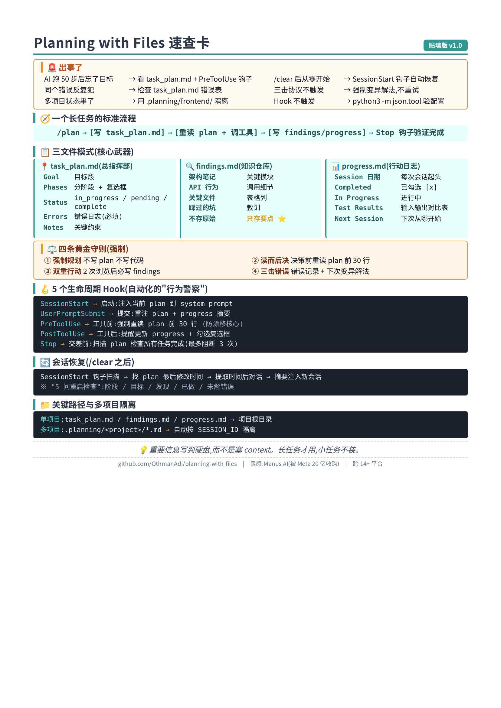

# 2.4.planning with file

Planning with Files 入门到精通:让 AI 拥有"持久记忆"的上下文工程指南

> 一份从零开始的实战教程,目标:30 分钟跑通,半天入门,一周精通。




## 目录

- [第 0 章:在开始之前——pwf 是什么,和其他框架有什么不同](#第-0-章在开始之前pwf-是什么和其他框架有什么不同)
- [第 1 章:为什么 AI 会"失忆"?理解上下文工程的根源](#第-1-章为什么-ai-会失忆理解上下文工程的根源)
- [第 2 章:环境准备(10 分钟跑通)](#第-2-章环境准备10-分钟跑通)
- [第 3 章:三文件模式——核心武器](#第-3-章三文件模式核心武器)
- [第 4 章:四条黄金守则——重塑 AI 行为](#第-4-章四条黄金守则重塑-ai-行为)
- [第 5 章:5 个生命周期 Hook——自动化的"行为警察"](#第-5-章5-个生命周期-hook自动化的行为警察)
- [第 6 章:实战演练——构建一个 Todo CLI](#第-6-章实战演练构建一个-todo-cli)
- [第 7 章:会话恢复——/clear 之后无缝接续](#第-7-章会话恢复clear-之后无缝接续)
- [第 8 章:进阶玩法——多项目并行 + 沙箱回滚](#第-8-章进阶玩法多项目并行--沙箱回滚)
- [第 9 章:对比 gstack / superpowers / ECC——四个项目怎么选](#第-9-章对比-gstack--superpowers--ecc四个项目怎么选)
- [第 10 章:常见陷阱与争议](#第-10-章常见陷阱与争议)
- [第 11 章:精通路径与学习资源](#第-11-章精通路径与学习资源)
- [附录:初始化检查清单 + 模板](#附录初始化检查清单--模板)

---

## 第 0 章:在开始之前——pwf 是什么,和其他框架有什么不同

### 0.1 一句话定义

**Planning with Files(pwf)= 一套 Manus 风格的三文件 Markdown 工作流 + 5 个生命周期 Hook,把 AI 的记忆外置到文件系统,解决长任务中的目标漂移、知识遗失、状态不可恢复三大痛点。**

它**不是**:
- ❌ 一套完整的"方法论框架"(像 superpowers)
- ❌ 角色扮演(像 gstack)
- ❌ 全家桶配置(像 ECC)

它是:
- ✅ **极简主义**——核心就 3 个文件 + 5 个 Hook
- ✅ **一个具体解法**——专注解决"AI 长任务失忆"这一个最痛的痛点
- ✅ **跨 14+ 平台**——Claude Code、Cursor、Codex、Gemini CLI、Copilot 等
- ✅ MIT 开源,GitHub:<https://github.com/OthmanAdi/planning-with-files>(7.5k+ stars,2026 年 2 月 v2.15 后开始爆火)

### 0.2 谁搞出来的?灵感从哪来?

**OthmanAdi**(@OthmanAdi)——GitHub 社区开发者。

**灵感来源**:**Manus AI**——一家在 8 个月内做到 1 亿美元收入的 AI 代理公司,被 **Meta 以 20 亿美元收购**。Manus 公开过他们的核心方法论:

> "**Markdown 是我磁盘上的'工作记忆'。** 由于我以迭代方式处理信息,并且我的活跃上下文有限,Markdown 文件充当了笔记、进度检查点和最终交付物的构建模块。"

pwf 就是这套价值 20 亿美元的工作流的开源复刻。

### 0.3 解决的具体问题

如果你用过 Claude Code 跑超过 10 步的复杂任务,大概率踩过这些坑:

| 问题 | 现象 | pwf 的解法 |
|---|---|---|
| 🌀 **目标漂移** | 50 轮对话后忘了原始目标 | `task_plan.md` + PreToolUse 钩子强制重读 |
| 🧠 **知识遗失** | 上下文塞满,关键信息被挤出窗口 | `findings.md` 双重行动法则蒸馏信息 |
| 💥 **状态不可恢复** | /clear 后从零开始 | `progress.md` + 会话恢复脚本 |
| 🔁 **重复踩坑** | 同一个错误反复试 | `task_plan.md` 错误日志强制"变异解法" |

### 0.4 跟其他三个框架的核心差异

| 维度 | pwf | gstack(蓝) | Superpowers(紫) | ECC(橙) |
|---|---|---|---|---|
| **核心思想** | 文件系统当外置记忆 | 角色视角 | 流程纪律 | 全家桶 |
| **规模** | 极简(3 文件+5 hook) | 中(23 角色) | 中(14 skill) | 大(181+47+34+8) |
| **聚焦** | 单一痛点:AI 失忆 | 决策视角 | 工程方法 | 全场景覆盖 |
| **灵感** | Manus AI 20 亿工作流 | YC CEO 实战 | obra 工程实践 | 黑客松冠军实战 |
| **学习成本** | 5 分钟 | 半天 | 半天 | 一周 |

**一句话区分**:
- pwf = "**AI 的笔记本**"
- gstack = "**AI 的团队**"
- Superpowers = "**AI 的教练**"
- ECC = "**AI 的工具箱**"

### 0.5 适合谁?不适合谁?

| ✅ 适合 | ❌ 不适合 |
|---|---|
| 跑长任务(> 10 步)经常失忆的人 | 5 分钟搞定的简单任务 |
| 多文件重构 / 跨模块开发 | 单文件修改 |
| 需要"断点续传"(中间中断) | 一次跑完不中断的任务 |
| 想给 AI 配个"外置大脑" | 只想要"补全"功能的人 |
| 多项目并行(支持 .planning/ 隔离) | 只跑一个项目 |

---

## 第 1 章:为什么 AI 会"失忆"?理解上下文工程的根源

### 1.1 一个关键比喻

把大模型的上下文窗口想成电脑的 **RAM(内存)**:
- ✅ 速度快
- ❌ 容量有限
- ❌ 断电即清零

把文件系统想成**硬盘**:
- ✅ 容量无限(相对)
- ✅ 持久化
- ❌ 读写慢一点

**核心洞察**:**重要的信息要写到硬盘上**,而不是塞进 RAM。

### 1.2 Transformer 的注意力衰减

大模型本质是 Transformer 架构。**注意力会随上下文增长而衰减**——这个数学性质决定了:
- 写在 prompt 开头的目标,50 轮对话后,权重可能已经稀释到几乎为零
- 越早期的信息,越容易"被忘记"

**pwf 的应对**:
- 关键信息写到磁盘(不占 context)
- 决策前重新读 plan(强制刷新注意力)
- 错误写进 plan(下个 session 不会再犯)

### 1.3 真实场景:pwf 解决前的痛

```python
# 你: 帮我重构成微服务架构
# Claude: 好的!我先看看现在的代码...
# (20 轮后,Claude 开始用一堆 import)
# Claude: 看起来现在的结构是 monorepo 风格,要不要...
# 你: 不是让你重构成 monorepo!是微服务!
# Claude: 抱歉,刚才误解了。让我重新...
```

**有 pwf 后**:
```python
# 你: 帮我重构成微服务架构
# Claude: 先创建 task_plan.md,记录目标:"从 monolith 重构成微服务"
# ... 50 轮后 ...
# Claude: (PreToolUse 钩子触发,自动重读 task_plan.md)
# Claude: (发现自己走偏,立即回到正轨)
```

---

## 第 2 章:环境准备(10 分钟跑通)

### 2.1 装 Claude Code(若未装)

```bash
curl -fsSL https://claude.ai/install.sh | sh
claude --version
```

需要 **Claude Code v2.1.0+**。

### 2.2 方式 A:插件市场(推荐)

```
/plugin marketplace add OthmanAdi/planning-with-files
/plugin install planning-with-files@planning-with-files
```

装完启动新会话,会看到 `[planning-with-files] Ready`。

### 2.3 方式 B:手动安装

```bash
# 克隆到 skills 目录
git clone https://github.com/OthmanAdi/planning-with-files.git ~/.claude/skills/planning-with-files

# Cursor 用户:把 .cursor 目录复制到项目根
git clone https://github.com/OthmanAdi/planning-with-files.git
cp -r planning-with-files/.cursor .cursor
```

### 2.4 方式 C:一行 npx(最简)

```bash
npx skills add OthmanAdi/planning-with-files --skill planning-with-files -g
```

支持 40+ 平台(Claude Code、Cursor、Codex、Gemini CLI 等)。

### 2.5 触发方式

**自动触发**:AI 检测到任务超过 5 步时自动激活。

**手动触发**:
```
/plan
# 或
/planning-with-files
# 或
/planning-with-files:start
```

---

## 第 3 章:三文件模式——核心武器

pwf 的核心极其简单:**3 个 Markdown 文件**,每个有自己的职责。

### 3.1 三文件职责分工

| 文件 | 类比 | 核心职责 |
|---|---|---|
| **task_plan.md** | 项目总指挥部 | 目标、分阶段清单、错误记录 |
| **findings.md** | 知识蒸馏仓库 | 调研结果、API 参考、技术选型推演 |
| **progress.md** | 行动黑匣子 | 操作日志、时间戳、测试输入输出对比 |

### 3.2 task_plan.md(项目总指挥部)

这是 AI 的"**北极星**"。

```markdown
# Task Plan: [功能/任务名]

## Goal
[一段话描述"完成"是什么样]

## Phases

### Phase 1: 需求调研
- [ ] 确认用户交互方式
- [ ] 调研现有方案
**Status:** in_progress

### Phase 2: 架构设计
- [ ] 设计数据模型
**Status:** pending

### Phase 3: 核心实现
**Status:** pending

### Phase 4: 测试验证
**Status:** pending

### Phase 5: 交付打包
**Status:** pending

## Current Status
**Active Phase:** Phase 1
**Last Updated:** 2026-03-18

## Errors & Blockers
<!-- 记录失败,避免重蹈覆辙 -->
- [2026-03-18] Import error in utils.py — missing requests dep

## Notes
- API 限流:100 req/min
- Auth token 存于 $API_TOKEN
```

**关键**:
- 用 `- [ ]` / `- [x]` Markdown 复选框
- 每个 phase 有 **Status**(in_progress / pending / complete)
- **Errors & Blockers** 区域强制记录失败
- **AI 每次决策前必须重读这个文件**

### 3.3 findings.md(知识蒸馏仓库)

搜索结果、API 文档、技术调研 → **蒸馏**为简洁要点。

```markdown
# Findings: [任务名]

## 架构笔记
- 入口: `src/main.py:run()`
- 配置: `config/settings.yaml`
- 数据库: PostgreSQL via SQLAlchemy ORM

## API 行为
- POST /api/v1/items 返回 201 + `{"id": "uuid", "status": "created"}`
- 限流头: `X-RateLimit-Remaining`, `X-RateLimit-Reset`
- 鉴权: Bearer token in Authorization header

## 关键文件
| 文件 | 用途 |
|---|---|
| src/models.py | SQLAlchemy models |
| src/api/client.py | HTTP client wrapper |
| tests/conftest.py | Pytest fixtures |

## 踩过的坑
- `session.commit()` 必须显式调用
- 所有 datetime 存 UTC,显示转 local
```

**关键**:
- 不存原始信息,只存**蒸馏后的要点**
- 防止海量搜索结果撑爆 context
- 也防止潜在的 prompt injection(从外部搜来的内容不进 context)

### 3.4 progress.md(行动黑匣子)

**最有价值的"保险"**。一旦会话崩溃或你中途离开,翻这个文件能立刻回答:

1. 我现在在哪个阶段?
2. 我的目标是什么?
3. 我已经发现了什么关键信息?
4. 我做了哪些操作?
5. 有没有尚未解决的错误?

```markdown
# Progress Log: [任务名]

## Session 2026-03-18

### Completed
- [x] 克隆仓库,确认 Python 3.11 环境
- [x] 阅读 `src/api/client.py` → 记录到 findings.md
- [x] 创建 `src/feature.py` 骨架

### In Progress
- [ ] 实现 `FeatureProcessor.process()` 方法

### Test Results
| 测试场景 | 输入 | 预期 | 实际 | 状态 |
|---|---|---|---|---|
| 基础流程 | valid input | 200 | 200 | ✅ |
| 空输入 | empty | ValueError | None | ❌ |

### Errors Encountered
- 14:23 — FileNotFoundError on data.json → 已修复(初始化空数组)
- 15:10 — OAuth token expired → 已加 refresh 逻辑

### Next Session Start
1. 修空输入的 edge case
2. 加 API round-trip 集成测试
```

---

## 第 4 章:四条黄金守则——重塑 AI 行为

光有文件还不够,真正让 AI 变"靠谱"的是内置在 SKILL.md 的**四条行为约束**。这些规则通过**系统提示词 + 外部 Hook 双重保障**。

### 4.1 守则一:强制优先规划

> **在没创建并填写 task_plan.md 之前,AI 绝对不能写一行代码。**

这条对抗的是大模型的"**即时服从**"本能——接到指令就冲动写代码,跳过最关键的逻辑拆解和风险评估。

**对比**:
- ❌ 没守则:接到需求立刻动手 → 跑偏
- ✅ 有守则:先写 task_plan.md 思考清楚 → 再动手

### 4.2 守则二:读而后决

> **做任何架构决策或技术选型之前,必须先重读 task_plan.md。**

Transformer 注意力会衰减。这条守则相当于**强制刷新一次注意力**。

**机制**:PreToolUse Hook 在每次工具调用前,自动把 task_plan.md 前 30 行注入到 stderr 提示 AI:

```
[planning-with-files] 当前目标(摘自 task_plan.md):
> 从 monolith 重构成微服务
> 当前阶段: Phase 2 - 架构设计
请确认这次操作是否还在这个目标内。
```

### 4.3 守则三:双重行动法则

> **每执行两次查看/搜索/浏览操作后,必须立刻将关键发现写入 findings.md。**

**为什么是两次?**
- 每次网页浏览消耗大量 token
- 放任不管,第三次搜索的结果会把第一次搜索的关键信息顶出 context
- 两次强制蒸馏,防止信息过载

**对比**:
- ❌ 没守则:搜 5 次后 context 爆掉,前面的信息全没
- ✅ 有守则:第 2 次浏览后立刻写进 findings.md(不占 context)

### 4.4 守则四:三击错误防范协议

> **任何错误必须显式记录,且下一次尝试必须采用本质上不同的解决路径。**

**普通 AI 遇 Bug 的反应**:
```
盲目改一行 → 重试 → 还是失败 → 继续盲目改 → ...
```

**有协议后**:
1. 在 `progress.md` 错误日志**打时间戳**记录异常
2. 在 `task_plan.md` 错误表**登记根本原因**
3. 下次**必须变异解决方案**(从根本上换思路),不是小修小补

**例子**:
- 错误 1:`list` 命令报 `FileNotFoundError`
- ❌ 错误做法:加 try-except 吞掉
- ✅ 正确做法:重构数据加载函数,加"文件不存在则初始化空数组"的前置判断

---

## 第 5 章:5 个生命周期 Hook——自动化的"行为警察"

如果仅靠 prompt 约束,AI 依然可能在深度重构中"越狱"。**真正的强制执行来自 Hook**。

### 5.1 5 类 Hook 触发时机

| Hook | 触发时机 | 作用 |
|---|---|---|
| **SessionStart** | 会话启动 | 注入当前 plan 到 system prompt |
| **UserPromptSubmit** | 用户提交新指令 | 静默重注 plan + progress 摘要 |
| **PreToolUse** | AI 调工具前 | 强制重读 plan 前 30 行(防漂移核心) |
| **PostToolUse** | AI 调工具后 | 提醒更新 progress.md + 勾选复选框 |
| **Stop** | AI 想"交差"时 | 扫描 plan 检查所有任务是否完成 |

### 5.2 PreToolUse(最精妙)

**触发时机**:AI 调 Write / Edit / Bash / Read / Glob / Grep 等**任何可能改变系统状态的工具**之前。

**执行逻辑**:截取 `task_plan.md` 前 30 行,通过 stderr 以非阻塞方式"耳语"给模型:

```
[plan reminder] 你的当前目标:
> 从 monolith 重构成微服务
> Phase 2 - 架构设计
记住,不要偏离。
```

**关键点**:
- 它**不阻止**工具调用(决策始终为 allow)
- 只是在执行前**强制刷新一次目标记忆**
- 这是对抗"目标漂移"的最有效手段

### 5.3 Stop 钩子(最后一道关卡)

当 AI 认为任务完成想"交差"时,Stop 钩子会跑 `check-complete.sh`:

```bash
# 伪代码
for phase in task_plan.md; do
    if status != "complete"; then
        echo "❌ Phase X 未完成,继续工作"
        return BLOCK
    fi
done
```

**安全保险**:最多阻断 3 次(loop_limit),避免死循环。

### 5.4 Hook 配置示例(Claude Code)

`~/.claude/hooks.json`:

```json
{
  "hooks": {
    "PreToolUse": [
      {
        "matcher": ".*",
        "hooks": [
          {
            "type": "command",
            "command": "python3 -c \"from pathlib import Path; p=Path('task_plan.md'); print(p.read_text()[:1500]) if p.exists() else None\""
          }
        ]
      }
    ],
    "Stop": [
      {
        "matcher": ".*",
        "hooks": [
          {
            "type": "command",
            "command": "python3 -c \"exec(open(str(__import__('pathlib').Path.home()/'.claude/skills/planning-with-files/hooks/stop_check.py')).read())\""
          }
        ]
      }
    ]
  }
}
```

---

## 第 6 章:实战演练——构建一个 Todo CLI

理论讲完,来看一个完整的工作流案例。

### Step 1:启动并生成蓝图

```
/plan 用 Python 构建一个命令行的 Todo 待办事项应用,支持增删改查
```

AI 立即生成三个文件,task_plan.md 拆解为五个阶段:

```markdown
### Phase 1: 需求调研
- [ ] 确定 CLI 参数结构
- [ ] 调研存储方案
**Status:** in_progress

### Phase 2: 架构设计
- [ ] 设计数据模型
**Status:** pending

### Phase 3: 核心实现
**Status:** pending

### Phase 4: 测试验证
**Status:** pending

### Phase 5: 交付打包
**Status:** pending
```

### Step 2:调研阶段(双重行动法则生效)

AI 查阅 Python `argparse` 和 `sys.argv` 文档,完成两次浏览后,立即在 findings.md 蒸馏:

```markdown
## CLI 框架
- 放弃 sys.argv,采用 argparse
- 原因:支持子命令(如 `python todo.py add "Buy milk"`),自动生成帮助文档

## 数据存储
- 采用 JSON 文件持久化(data.json)
- 理由:零依赖、易调试、满足当前规模需求
```

随后将 Phase 1 标记为 `[x]`,并在 progress.md 记录:

```
[14:23] 完成架构调研,确定使用 argparse + JSON
```

### Step 3:编码与错误处理(三击协议生效)

AI 编写核心逻辑后执行测试:

```bash
python todo.py list
```

报错:
```
FileNotFoundError: [Errno 2] No such file or directory: 'data.json'
```

**没规划约束的 AI**:
- 随机加 try-except,继续重试

**有协议约束的 AI**:
1. 在 `progress.md` 错误日志打时间戳
2. 在 `task_plan.md` 错误表分析根本原因
3. **变异解决方案**:重构底层数据加载函数,加前置判断

```python
# 修复后的代码
def load_data():
    if not os.path.exists('data.json'):
        return []
    with open('data.json') as f:
        return json.load(f)
```

### Step 4:测试记录

`progress.md` 自动积累:

| 测试场景 | 输入 | 预期 | 实际 | 状态 |
|---|---|---|---|---|
| 初始列表 | `python todo.py list` | 提示"列表为空" | FileNotFoundError | ❌ |
| 修复后重试 | `python todo.py list` | 提示"列表为空" | 正确输出 | ✅ |
| 添加任务 | `python todo.py add "Buy milk"` | 写入 JSON | 成功 | ✅ |

### Step 5:完成交付

Phase 5 完成后,Stop 钩子自动检查所有复选框 → 通过 → 允许退出。

**总耗时**:原本 60+ 轮对话,现在 35 轮,且中途打断可恢复。

---

## 第 7 章:会话恢复——/clear 之后无缝接续

pwf 最神奇的功能之一:**/clear 之后,AI 能 5 秒内"想起来"刚才在干嘛**。

### 7.1 触发恢复

```bash
/clear    # 或上下文用尽自动压缩
```

### 7.2 自动恢复流程

新会话启动时,SessionStart 钩子会:

1. 扫描 `~/.claude/projects/` 找上次会话数据
2. 定位三个 markdown 文件**最后修改时间**
3. 提取**该时间点之后**的对话
4. 以**不超过 100 行的摘要**重新注入新会话
5. AI 读完后说:"我看到你刚才在做 X,目前 Y 阶段,下一步 Z"

### 7.3 "5 问重启检查"

AI 重启后会自动回答:

```
1. 我在哪个阶段?  → 读 task_plan.md
2. 我的目标是什么? → 读 Goal 段
3. 我发现了什么?   → 读 findings.md
4. 我做了什么?     → 读 progress.md
5. 有未解决的错误? → 检查 Errors 区块
```

5 秒内无缝接续。

### 7.4 关闭自动压缩,最大化 context

为了在 `/clear` 前用满 context:

`~/.claude/settings.json`:

```json
{
  "autoCompact": false
}
```

这样能保留更多对话细节,恢复时摘要更准确。

### 7.5 实战:跨天接续

**Day 1 晚上**:
- AI 实现了 Todo CLI 核心功能
- 还有 3 个 edge case 没修
- 你关电脑下班

**Day 2 早上**:
- 打开 Claude Code,自动恢复
- "我看到你昨天在做 Todo CLI,当前 Phase 4 - 测试验证,有 3 个 edge case 待修。要继续吗?"
- 你:"继续"
- AI: 读取 progress.md,接续昨天的修复工作

**完美。**

---

## 第 8 章:进阶玩法——多项目并行 + 沙箱回滚

### 8.1 多项目并行:.planning/ 隔离

当多个项目要同时开发,共享根目录的三个文件会**状态冲突**。pwf 用 `.planning/` 解决:

```
project-root/
├── .planning/
│   ├── frontend/
│   │   ├── task_plan.md
│   │   ├── findings.md
│   │   └── progress.md
│   └── backend-api/
│       ├── task_plan.md
│       ├── findings.md
│       └── progress.md
└── index.md        # 标记哪个项目是 active
```

### 8.2 优先级级联解析

pwf 按以下优先级决定当前活跃项目:

1. **环境变量** `$MANUS_PROJECT`(最高,适合 CI/CD)
2. `.planning/.active.override.$SESSION_ID`(会话级隔离)
3. `.planning/index.md` 中的 `active:` 字段(默认)

**妙处在第 2 级**:提取当前终端的 SESSION_ID,两个终端窗口的 AI 实例天然映射到独立沙箱,不会互相干扰。

### 8.3 自然语言切换

在 Cursor / Claude Code 里直接说:

```
"switch to backend-api"
"set default frontend"
```

AI 自动在 `.planning/` 网络中切换上下文。

### 8.4 沙箱 + 检查点回滚

高危重构场景,结合 **ClaudeBox** 把工作流移入轻量级虚拟机:

```python
# 重构前创建快照
await box.snapshot("pre-refactor")

# 执行重构
result = await run_refactor()

# 失败?秒级回滚
if "error" in result:
    await box.restore("pre-refactor")
```

让 Markdown 文件升华为**底层计算状态的版本控制锚点**。

---

## 第 9 章:对比 gstack / superpowers / ECC——四个项目怎么选

四个项目我都写过教程了。做个四向对比。

### 9.1 核心差异

| 维度 | pwf(青) | gstack(蓝) | Superpowers(紫) | ECC(橙) |
|---|---|---|---|---|
| **作者** | OthmanAdi | Garry Tan(YC CEO) | Jesse Vincent | Affaan Mustafa(黑客松冠军) |
| **核心思想** | 文件系统当外置记忆 | 角色视角 | 流程纪律 | 全家桶 |
| **规模** | 极简(3 文件+5 hook) | 中(23 角色) | 中(14 skill) | 大(181+47+34+8) |
| **灵感** | Manus 20 亿工作流 | 创业团队 | 工程实践 | 10 月生产 |
| **强项** | 长任务不漂移 | 决策视角 | TDD 流程 | 全面覆盖 |
| **弱项** | 不管工程纪律 | 流程弱 | 跨工具少 | 配置重 |
| **适合** | 长任务 / 多项目 | Web 创业 | 后端工程 | 重度用户 |

### 9.2 比喻

- **pwf** 是"**AI 的笔记本**"——只解决记忆问题
- **gstack** 是"**AI 的团队**"——分工合作
- **Superpowers** 是"**AI 的教练**"——按规矩办事
- **ECC** 是"**AI 的工具箱**"——什么都有

### 9.3 选 pwf 如果...

- ✅ 你跑**长任务(> 10 步)** 经常失忆
- ✅ 你做**多文件重构** / 跨模块开发
- ✅ 你想**断点续传**(今天做一半明天接着做)
- ✅ 你同时维护**多个项目**
- ✅ 你喜欢**极简主义**——一个痛点一个解法

### 9.4 不要选 pwf 如果...

- ❌ 你只跑 5 分钟搞定的小脚本
- ❌ 你已经用着 superpowers / gstack / ECC,不想多装
- ❌ 你不想维护文件系统(懒)

### 9.5 组合使用(强烈推荐)

**pwf 不和任何框架冲突**,因为它只管"记忆"这一层:

```
Superpowers  →  流程纪律(怎么做事)
  +
pwf          →  持久化记忆(不忘记)
  +
gstack       →  真实浏览器测试(怎么验证)
  +
ECC          →  工具全家桶(怎么配置)
```

**最常见组合**:**pwf + Superpowers**——纪律 + 记忆,几乎所有长任务都能搞定。

### 9.6 我的真实建议

按**长任务 vs 短任务**分:

| 任务类型 | 推荐 |
|---|---|
| < 30 分钟 | 直接用 Claude Code 默认 |
| 30 分钟 ~ 2 小时 | pwf(防漂移) |
| 2 小时 ~ 1 天 | pwf + Superpowers |
| > 1 天 / 复杂多模块 | pwf + Superpowers + gstack(浏览器测试) |
| 企业团队 / 标准化 | pwf + ECC(全套配置) |

---

## 第 10 章:常见陷阱与争议

### 10.1 "装上没感觉"

pwf 是"**预防性**"工具——它解决的问题是"如果失忆会怎样",而不是"现在立刻变快"。

**正解**:
- 跑 5 个以上步骤的任务时才有感觉
- 单文件修改不需要

### 10.2 "三文件反而增加负担"

确实,小任务写三文件是 over-engineering。

**正解**:
- 只在 `> 5 步`的任务启用
- 单文件修改直接 `claude "改这个"`

### 10.3 "Claude 跳过 PreToolUse Hook"

偶有发生,通常是因为 hook 命令出错。

**排查**:
```bash
# 验证 hooks.json 格式
python3 -m json.tool ~/.claude/hooks.json

# 验证 plugin 已装
claude /plugin list
```

### 10.4 "OpenCode 部分功能不支持"

session-catchup(自动恢复)在 OpenCode 有限制。

**解法**:新会话开始时手动读 `progress.md` 几秒钟。

### 10.5 "GitHub Copilot 编码乱码"

老版本(< v2.18.1)有这个 bug。

**解法**:
```powershell
$OutputEncoding = [System.Text.Encoding]::UTF8
```
或升级到 v2.18.1+。

### 10.6 "三重文件被别人改坏了"

如果多 AI agent 同时跑同一项目可能冲突。

**解法**:
- 单 agent 工作
- 多 agent 用 `.planning/frontend/` `.planning/backend/` 隔离

---

## 第 11 章:精通路径与学习资源

### 11.1 学习路线图

```
Day 1 (30 分钟)
├─ 装环境,跑 /plan 一次简单任务
├─ 读 task_plan.md / findings.md / progress.md 各 5 分钟
└─ 体验 5 步任务的执行流

Week 1 (每天 15 分钟)
├─ 每天一个真实任务,启用 pwf
├─ 故意 /clear 一次,体验恢复
├─ 故意偏离目标,看 PreToolUse 钩子是否能拉回
└─ 故意重犯错误,看三击协议是否触发

Week 2 (每天 30 分钟)
├─ 试多项目并行(.planning/ 隔离)
├─ 故意制造 50+ 步的长任务
├─ 体验两次会话恢复
└─ 尝试自定义 hooks(比如把 task_plan.md 同步到 Notion)

Month 1
├─ 沉淀自己的 task_plan.md 模板
├─ 把 pwf 集成到 CI(自动检查 plan 是否完成)
└─ 和 Superpowers 组合使用
```

### 11.2 推荐阅读(按优先级)

1. **官方仓库**:<https://github.com/OthmanAdi/planning-with-files>(必读)
2. **掘金:planning-with-files 完全指南**(中文深度)
3. **Manus AI 公开方法论**:<https://manus.im/blog/Context-Engineering-for-AI-Agents>
4. **三文件模板**:项目 `docs/templates.md`

### 11.3 三个里程碑(完成 = 算精通)

- [ ] **L1**:用 `/plan` 跑完一个 10+ 步的真实任务,跑通三文件
- [ ] **L2**:故意 `/clear` 一次,验证 5 秒内恢复上下文
- [ ] **L3**:多项目并行(`.planning/frontend` + `.planning/backend`),配置 SESSION_ID 隔离

---

## 附录:初始化检查清单 + 模板

### 初始化检查清单

```markdown
## pwf 启动清单

### 环境
- [ ] Claude Code v2.1+ 已装
- [ ] 插件市场已添加
- [ ] 插件已安装
- [ ] /plan 命令能正常触发

### 第一次跑通
- [ ] /plan 跑过一个 5 步任务
- [ ] task_plan.md 自动生成
- [ ] findings.md 自动创建
- [ ] progress.md 自动创建
- [ ] PreToolUse 钩子触发过

### 进阶
- [ ] /clear 后能 5 秒恢复
- [ ] 故意犯错,看三击协议
- [ ] 多项目 .planning/ 隔离配置
- [ ] 和 Superpowers / gstack 组合用

### 心法
- [ ] 记住:长任务才用,小任务不装
- [ ] 记住:三文件不是负担,是保险
- [ ] 记住:PreToolUse 是核心防线
```

### 三文件模板

**task_plan.md**:

```markdown
# Task Plan: [功能/任务名]

## Goal
[一段话描述"完成"是什么样]

## Phases

### Phase 1: [阶段名]
- [ ] [具体子任务]
- [ ] [具体子任务]
**Status:** pending

### Phase 2: [阶段名]
**Status:** pending

## Current Status
**Active Phase:** Phase 1
**Last Updated:** [日期]

## Errors & Blockers
<!-- 记录失败,避免重蹈覆辙 -->

## Notes
- [关键约束]
```

**findings.md**:

```markdown
# Findings: [任务名]

## 架构笔记
- [关键发现]

## API 行为
- [API 细节]

## 关键文件
| 文件 | 用途 |
|---|---|
| [path] | [purpose] |

## 踩过的坑
- [教训]
```

**progress.md**:

```markdown
# Progress Log: [任务名]

## Session [日期]

### Completed
- [x] [已完成]

### In Progress
- [ ] [进行中]

### Test Results
| 场景 | 输入 | 预期 | 实际 | 状态 |
|---|---|---|---|---|

### Errors Encountered
- [时间] [错误] → [修复]

### Next Session Start
1. [下一步 1]
2. [下一步 2]
```

---

## 写在最后

pwf 不是炫技的项目,它是 **Manus AI 价值 20 亿美元工作流的开源复刻**。

它的价值不在于"功能多",而在于**"一招鲜"**——把 AI 记忆从易失性 RAM 转移到持久化硬盘。

你不需要它做所有事,**只需要它在长任务里不让你崩溃**。

- 30 步对话不再漂移
- 中断后 5 秒恢复
- 错误不再重复犯

**去用起来,让你的 AI 拥有"持久记忆"。**

——

**版本**:基于 planning-with-files v2.18.1+(2026 年 2 月)撰写。
**反馈**:发现错漏或想补充实战案例,直接改这份文档就行。