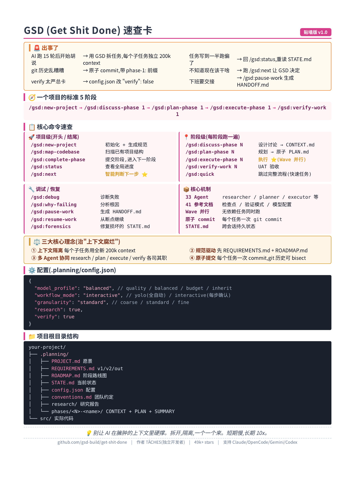

# 2.5.GSD

GSD(Get Shit Done)入门到精通:Claude Code 最强上下文工程框架完全指南

> 一份从零开始的实战教程,目标:30 分钟跑通,半天入门,一周精通。




## 目录

- [第 0 章:在开始之前——GSD 是什么,和其他框架有什么不同](#第-0-章在开始之前gsd-是什么和其他框架有什么不同)
- [第 1 章:为什么需要 GSD?理解"上下文腐烂"](#第-1-章为什么需要-gsd理解上下文腐烂)
- [第 2 章:环境准备(10 分钟跑通)](#第-2-章环境准备10-分钟跑通)
- [第 3 章:完整 5 阶段工作流](#第-3-章完整-5-阶段工作流)
- [第 4 章:核心机制——多 Agent + Wave 并行 + 原子提交](#第-4-章核心机制多-agent--wave-并行--原子提交)
- [第 5 章:配置文件精讲——模型 / 模式 / 粒度](#第-5-章配置文件精讲模型--模式--粒度)
- [第 6 章:实战演练——从零搭一个产品](#第-6-章实战演练从零搭一个产品)
- [第 7 章:已有项目——map-codebase 接入](#第-7-章已有项目map-codebase-接入)
- [第 8 章:高级用法——断点续传 + 暂停交接](#第-8-章高级用法断点续传--暂停交接)
- [第 9 章:对比其他 4 个框架——五个项目怎么选](#第-9-章对比其他-4-个框架五个项目怎么选)
- [第 10 章:常见陷阱与争议](#第-10-章常见陷阱与争议)
- [第 11 章:精通路径与学习资源](#第-11-章精通路径与学习资源)
- [附录:初始化检查清单 + 模板](#附录初始化检查清单--模板)

---

## 第 0 章:在开始之前——GSD 是什么,和其他框架有什么不同

### 0.1 一句话定义

**GSD(Get Shit Done)= 一套轻量级元提示 + 上下文工程 + 规范驱动开发框架,通过"每个子任务用全新 200k 上下文"解决 AI 长任务的"上下文腐烂"问题,让 Claude Code / OpenCode / Gemini CLI 稳定产出可靠代码。**

它**不是**:
- ❌ 新模型 / 新 IDE
- ❌ 简单的 prompt 集合
- ❌ 角色扮演框架

它是:
- ✅ **33 个专业化 Agent** + **41 个参考文档** 的元提示系统
- ✅ **规范驱动**(spec-driven)——先出 REQUIREMENTS.md + ROADMAP.md,再执行
- ✅ **多 Agent 并行** + 上下文隔离(每个子任务独立 200k context)
- ✅ **原子提交** + **自动验证**
- ✅ MIT 开源,GitHub:<https://github.com/gsd-build/get-shit-done>(49k+ stars,2026 年 4 月冲 5 万 star)

### 0.2 谁搞出来的?灵感从哪来?

作者 **TÂCHES(glittercowboy)**——一个独立开发者,自述:

> "我是一个独立开发者,我不写代码,Claude Code 写。GSD 就是我用来驱动 Claude Code 给我干活的系统。"

被 **Amazon、Google、Shopify、Webflow** 的工程师公开使用并推荐。

### 0.3 GSD 解决的最核心问题:"上下文腐烂(Context Rot)"

数据说话(作者实测):
- 传统方式:**第 15 轮对话后**,Claude 对初始需求的记忆准确率**下降 60%+**
- 传统方式:代码质量**衰减曲线**——前几个任务高质量,后面断崖式下跌
- GSD:**上下文保持率从 40% 提升到 95%+**
- GSD:代码质量标准差**降低 72%**
- GSD:平均每个任务**人工干预减少 85%**

### 0.4 跟其他四个框架的核心差异

| 维度 | GSD(红) | pwf(青) | gstack(蓝) | Superpowers(紫) | ECC(橙) |
|---|---|---|---|---|---|
| **核心思想** | 上下文隔离 + 多 Agent | 文件系统当外置记忆 | 角色视角 | 流程纪律 | 全家桶 |
| **规模** | 中(33 agent + 41 文档) | 极简(3 文件+5 hook) | 中(23 角色) | 中(14 skill) | 大(181+47+34+8) |
| **聚焦** | 上下文腐烂 | AI 失忆 | 决策视角 | 工程方法 | 全场景 |
| **学习成本** | 半小时(有 33 文档) | 5 分钟 | 半天 | 半天 | 一周 |
| **适合** | 中大型项目 / 原型快速 | 长任务多项目 | Web 创业 | 后端工程 | 重度用户 |

**一句话区分**:
- **GSD** = "**AI 的项目经理**"——把大活拆碎,每个子任务独立执行
- **pwf** = "**AI 的笔记本**"——不忘记
- **gstack** = "**AI 的团队**"——分工
- **Superpowers** = "**AI 的教练**"——按规矩
- **ECC** = "**AI 的工具箱**"——啥都有

### 0.5 适合谁?不适合谁?

| ✅ 适合 | ❌ 不适合 |
|---|---|
| 中大型项目、原型快速验证 | 单文件小修改 |
| 厌倦了 AI "聊着聊着就发疯" | 不想花 5 分钟写需求 |
| 想让 AI 跑完整项目(从需求到部署) | 只要"补全"的人 |
| 需要并行(建模型 + API 同时跑) | 任务 < 5 步 |
| 看重 git 历史的整洁(原子提交) | 拒绝规范化流程的人 |

---

## 第 1 章:为什么需要 GSD?理解"上下文腐烂"

### 1.1 上下文腐烂:一个真实痛点

你让 Claude Code 帮你写一个 Web 应用,过程是这样的:

```
你: 帮我搭一个 Next.js + Supabase 的 SaaS
Claude: 好的!我开始创建项目...
(10 轮对话,Claude 质量很高)
你: 加上用户认证
Claude: 用 NextAuth.js + Supabase Auth...
(又 20 轮)
你: 加 Stripe 支付
Claude: 嗯,Stripe webhook 集成到 supabase...
(30 轮,开始出问题了)
你: 把首页改一下
Claude: (开始胡说,变量名混乱,逻辑跟前面冲突)
```

**为什么?**

### 1.2 技术根源

虽然 Claude 有 200k tokens 的上下文窗口,但**有效注意力机制在长序列中会衰减**:
- 写在 prompt 开头的目标,50 轮后,权重可能稀释到几乎为零
- Transformer 的注意力是 O(n²) 复杂度,信息一多就顾此失彼
- 海量历史对话、需求变更、临时补丁 = 上下文污染

### 1.3 GSD 的解法:上下文隔离

**核心洞察**:把大任务拆成 N 个小任务,每个小任务在一个**全新的、独立的 200k context 窗口**里跑。

```
┌──────────────────────────────────────────────────┐
│  你的主对话窗口(30-40% 使用率)                     │
│  只负责协调,不参与实际编码                            │
└──────────────────┬───────────────────────────────┘
                   │ 路由任务
       ┌───────────┼───────────┬───────────┐
       ▼           ▼           ▼           ▼
   ┌─────┐    ┌─────┐    ┌─────┐    ┌─────┐
   │Task1│    │Task2│    │Task3│    │Task4│
   │新ctx│    │新ctx│    │新ctx│    │新ctx│
   │200k │    │200k │    │200k │    │200k │
   └─────┘    └─────┘    └─────┘    └─────┘
       │           │           │           │
       └───────────┴───────────┴───────────┘
                  │
                  ▼
            原子 commit
```

**结果**:
- 主窗口永远干净(只装协调信息)
- 每个 task 在巅峰状态跑(不会"越干越累")
- 任务之间互不污染

### 1.4 不只是"拆任务"

GSD 的拆任务不是简单切分,它包含:
- **Wave 并行**:有依赖的排顺序,无依赖的同时跑
- **原子 commit**:每个任务结束,自动 commit,git 历史可 bisect
- **自动验证**:verify-work 阶段问"能用吗?数据对吗?"
- **自动修复**:失败自动派 debug Agent,生成修复计划

---

## 第 2 章:环境准备(10 分钟跑通)

### 2.1 装 Claude Code(若未装)

```bash
curl -fsSL https://claude.ai/install.sh | sh
claude --version
```

### 2.2 一行安装 GSD

```bash
npx get-shit-done-cc@latest
```

安装程序会让你选:
1. **Runtime**:Claude Code / OpenCode / Gemini CLI / 全部
2. **位置**:全局(`~/.claude/`) / 仅当前项目

### 2.3 重要:GSD 建议开启 --dangerously-skip-permissions

**原因**:GSD 的设计理念是"**自动化执行**",如果你每 5 秒点一次权限确认,体验极差。

```bash
# 启动 Claude Code 时
claude --dangerously-skip-permissions

# 或者在 settings.json 加 allow rules(更安全)
```

`~/.claude/settings.json`:

```json
{
  "permissions": {
    "allow": [
      "Bash(git *)",
      "Bash(npm *)",
      "Bash(node *)",
      "Bash(npx *)"
    ]
  }
}
```

### 2.4 验证安装

在 Claude Code 里输入:

```
/gsd:help
```

能看到所有 GSD 命令,说明 ✅ 装好了。

### 2.5 装上它,觉得太"仪式感"怎么办?

有快速模式:

```
/gsd:quick   # 跳过完整流程,直接干活
/gsd:next    # 让 GSD 判断你现在该干啥
```

---

## 第 3 章:完整 5 阶段工作流

GSD 的核心是**5 个阶段的工作流**。按顺序走完,你就有了一个完整的产品。

### 整体流程图

```
┌─────────────────────────────────────────────────┐
│  Phase 0: 项目初始化(/gsd:new-project)           │
│  → 提问澄清需求                                  │
│  → 4 个并行研究员调研(技术栈/可行性/架构/陷阱)    │
│  → 生成 REQUIREMENTS.md + ROADMAP.md            │
└─────────────────┬───────────────────────────────┘
                  ▼
┌─────────────────────────────────────────────────┐
│  Phase 1: 阶段讨论(/gsd:discuss-phase 1)        │
│  → 视觉/API/内容/任务组织等设计决策               │
│  → 输出 CONTEXT.md                               │
└─────────────────┬───────────────────────────────┘
                  ▼
┌─────────────────────────────────────────────────┐
│  Phase 2: 规划(/gsd:plan-phase 1)               │
│  → 研究具体实现方案                               │
│  → 拆 2-3 个原子任务(XML 格式)                   │
│  → Plan Checker 验证 → 不通过就重做               │
└─────────────────┬───────────────────────────────┘
                  ▼
┌─────────────────────────────────────────────────┐
│  Phase 3: 执行(/gsd:execute-phase 1)            │
│  → 任务按 Wave 分组(并行/串行)                   │
│  → 每个任务独立 200k context                      │
│  → 完成一个 → 原子 commit                         │
└─────────────────┬───────────────────────────────┘
                  ▼
┌─────────────────────────────────────────────────┐
│  Phase 4: 验证(/gsd:verify-work 1)              │
│  → 提取可测试交付物                               │
│  → 问"能用吗?数据对吗?"                          │
│  → 失败 → debug Agent → 修复 plan                 │
└─────────────────────────────────────────────────┘
```

### 3.1 Phase 0:项目初始化

**命令**:
```
/gsd:new-project 我想做一个 Next.js + Supabase 的个人记账 SaaS
```

**AI 做的事**:
1. **提问阶段**——问到你把想法讲清楚(目标、约束、技术偏好、边界)
2. **并行研究**——4 个研究员同时查:技术栈 / 功能可行性 / 架构模式 / 潜在陷阱
3. **需求提取**——分 v1(必做)/ v2(后续)/ out-of-scope(不考虑)
4. **路线图**——生成与需求对应的阶段,每个阶段明确可交付

**产出文件**(项目根目录):
- `.planning/PROJECT.md` —— 项目愿景
- `.planning/REQUIREMENTS.md` —— 需求(v1/v2/out)
- `.planning/ROADMAP.md` —— 阶段化路线图
- `.planning/STATE.md` —— 当前状态(决策/阻塞/位置)
- `.planning/research/` —— 4 个研究员的报告

### 3.2 Phase 1:阶段讨论

**命令**:
```
/gsd:discuss-phase 1
```

**AI 做的事**:分析当前阶段(比如阶段 1 是"用户认证"),识别关键决策点:

- **视觉密集型**:UI 布局、交互、空状态
- **API/CLI 密集型**:响应格式、错误处理、详细程度
- **内容密集型**:结构、语气、深度、流程
- **任务组织**:命名约定、依赖管理

**产出**:`.planning/phases/01-user-auth/CONTEXT.md`

> 📌 这一步最关键:**聊得越细,最终交付越贴近你**。

### 3.3 Phase 2:规划(原子化任务)

**命令**:
```
/gsd:plan-phase 1
```

**AI 做的事**:
1. 研究员调研具体实现
2. 规划师生成 2-3 个原子任务
3. **Plan Checker** 验证(覆盖完整性、依赖正确、验收标准明确)
4. 不通过 → 重做,直到通过

**产出**:`.planning/phases/01-user-auth/PLAN.md`

一个原子任务长这样(XML 格式):

```xml
<task type="auto">
  <name>创建登录接口</name>
  <files>src/app/api/auth/login/route.ts</files>
  <action>
    用 jose 库做 JWT(别用 jsonwebtoken,有 CommonJS 兼容问题)。
    验证用户凭据。成功后返回 httpOnly cookie。
  </action>
  <verify>curl 请求登录接口返回 200 + Set-Cookie</verify>
  <done>有效凭据返回 cookie,无效凭据返回 401</done>
</task>
```

**关键**:
- `files` 精确到文件路径
- `action` 写清楚怎么干(避免 AI 自由发挥)
- `verify` 写清楚怎么验证
- `done` 写清楚"完成"的定义

### 3.4 Phase 3:执行(Wave 并行 + 原子提交)

**命令**:
```
/gsd:execute-phase 1
```

**AI 做的事**:
1. 把计划按依赖关系**分 Wave**
2. 同 Wave 内的任务**并行执行**(每个独立 200k context)
3. 完成一个 → 自动 `git commit -m "feat(phase-1): add user model"`
4. 所有 Wave 跑完 → 阶段完成

**实际执行图**:
```
Wave 1(并行)         Wave 2(并行)      Wave 3
─────────────────    ──────────────    ─────
- 用户模型            - 订单 API        - 结账 UI
- 产品模型            - 购物车
                      (依赖 Wave 1)
```

**对比传统做法**:
- 传统: 200 轮对话(质量越来越差)
- GSD: 45 轮对话(每个任务都新鲜)

### 3.5 Phase 4:验证(UAT 用户验收)

**命令**:
```
/gsd:verify-work 1
```

**AI 做的事**:
1. 提取本阶段所有可测试交付物
2. 一步步问:能用吗?数据对吗?符合预期吗?
3. 失败 → 自动派 debug Agent → 诊断根因 → 生成修复 plan
4. 修完 → 重跑 verify

**通过后**:`/gsd:complete-phase` → 提交,进入下一阶段。

---

## 第 4 章:核心机制——多 Agent + Wave 并行 + 原子提交

### 4.1 33 个专业化 Agent

GSD 不是让一个 AI 从头干到尾,而是分工:

| Agent | 职责 |
|---|---|
| **researcher** | 调研技术栈 / 功能 / 架构 / 陷阱 |
| **planner** | 把目标拆成原子计划 |
| **plan-checker** | 验证计划的完整性和一致性 |
| **executor** | 在独立 context 里执行代码 |
| **verifier** | 检查代码库是否符合目标 |
| **debugger** | 诊断失败的根本原因 |
| **discuss-agent** | 引导设计讨论 |
| **...** | 还有 26 个细分角色 |

每个 agent 有:
- 明确的工具集(Read、Bash、WebSearch 等)
- 严格的输入输出格式
- 单一职责原则

### 4.2 Wave 并行执行机制

GSD 自动分析任务依赖,分 Wave:

```markdown
## Phase 1: 用户认证

### Wave 1(并行)
- [ ] T1: 用户数据模型
- [ ] T2: 密码哈希工具函数

### Wave 2(并行,依赖 Wave 1)
- [ ] T3: 注册 API 端点
- [ ] T4: 登录 API 端点

### Wave 3(依赖 Wave 2)
- [ ] T5: 登录页面 UI
```

**好处**:
- 真正并行(不是顺序执行)
- Wave 内任务不依赖,可以在多个 Claude 实例上跑
- 节省时间(大项目 40-60% 提速)

### 4.3 原子提交策略

每个任务结束,自动 commit:

```bash
git commit -m "abc123f feat(phase-1): add user registration plan
- User model with bcrypt
- Email + password validation
- Tests passing
- Refs: phase-1/plan-01"
```

**好处**:
- `git bisect` 精确找到引入 bug 的 commit
- 单个任务回滚不影响整体
- 审计追踪:每个 commit 都能看到"为什么"

### 4.4 状态管理:STATE.md

GSD 维护 `.planning/STATE.md` 记录:
- 当前阶段
- 已完成 / 进行中 / 待办
- 关键决策
- 阻塞项

**这是"真相来源"**,跨会话持续保存。

---

## 第 5 章:配置文件精讲——模型 / 模式 / 粒度

GSD 的配置非常灵活。改 `.planning/config.json` 即可。

### 5.1 模型配置(quality / balanced / budget / inherit)

| 配置 | 规划 | 执行 | 成本 | 适合 |
|---|---|---|---|---|
| **quality** | Opus | Opus | 最高 | 生产关键项目 |
| **balanced**(默认) | Opus | Sonnet | 中 | 大多数场景 |
| **budget** | Sonnet | Sonnet/Haiku | 低 | 探索性项目 |
| **inherit** | 跟随运行时 | 跟随运行时 | 跟随 | 不确定时用 |

```json
{
  "model_profile": "balanced"
}
```

### 5.2 工作流模式(yolo / interactive)

| 模式 | 行为 | 适合 |
|---|---|---|
| **yolo** | 全自动,跳过所有确认 | 经验丰富的用户,自动化执行 |
| **interactive**(默认) | 每个关键步骤确认 | 新手,复杂项目 |

```json
{
  "workflow_mode": "interactive"
}
```

### 5.3 粒度级别(coarse / standard / fine)

| 粒度 | 行为 | 适合 |
|---|---|---|
| **coarse** | 大阶段,任务粗 | 快速原型 |
| **standard** | 标准粒度 | 平衡 |
| **fine** | 细粒度,精确控制 | 大型复杂项目 |

```json
{
  "granularity": "standard"
}
```

### 5.4 高级选项

```json
{
  "research": true,          // 是否启用并行研究
  "verify": true,            // 是否启用 verify 阶段
  "plan_chunked": false,     // 大计划分块(防 context 溢出)
  "cross_ai_timeout": 300    // agent 超时(秒)
}
```

### 5.5 实战推荐配置

| 场景 | model_profile | workflow_mode | granularity |
|---|---|---|---|
| 快速原型 | budget | yolo | coarse |
| 个人项目 | balanced | interactive | standard |
| 团队项目 | balanced | interactive | fine |
| 生产关键 | quality | interactive | fine |

---

## 第 6 章:实战演练——从零搭一个产品

### 场景:Next.js + Supabase 个人记账 SaaS

#### Step 1:初始化项目

```
/gsd:new-project 我想做一个 Next.js + Supabase 的个人记账 SaaS,支持多账户、分类、预算、月度报表。要求响应快、移动端友好。
```

AI 提问:
- 目标用户?(个人 / 小团队?)
- 货币?(单币种 / 多币种?)
- 离线支持?(PWA?)
- 数据导入?(CSV / 银行 API?)
- ... (约 10 个问题)

**回答完后**:
- 4 个研究员并行查:Next.js 14 / Supabase Auth / 预算算法 / 报表可视化
- 生成 REQUIREMENTS.md(v1/v2/out)
- 生成 ROADMAP.md(5 个阶段:用户/账户/交易/预算/报表)

#### Step 2:讨论阶段 1(用户认证)

```
/gsd:discuss-phase 1
```

AI 问:
- 登录方式?(邮箱密码 / OAuth / Magic Link)
- 密码策略?(复杂度要求?)
- 会话时长?(7 天 / 30 天)
- 多设备登录限制?
- ...

**回答完后**:CONTEXT.md 生成。

#### Step 3:规划阶段 1

```
/gsd:plan-phase 1
```

AI 输出 PLAN.md,3 个原子任务:

```xml
<task type="auto">
  <name>创建用户表 + Supabase 迁移</name>
  <files>supabase/migrations/001_create_users.sql</files>
  <action>
    在 Supabase 创建 users 表(uuid, email, password_hash, created_at)
    用 Supabase Auth 钩子同步
  </action>
  <verify>supabase db reset 后,users 表存在,字段正确</verify>
</task>

<task type="auto">
  <name>实现密码哈希工具</name>
  <files>src/lib/auth/hash.ts, src/lib/auth/hash.test.ts</files>
  <action>用 bcrypt(rounds=12)实现 hashPassword 和 verifyPassword</action>
  <verify>单元测试 100% 覆盖</verify>
</task>

<task type="auto">
  <name>实现注册 / 登录 API</name>
  <files>src/app/api/auth/[register|login]/route.ts</files>
  <action>用 jose 做 JWT,返回 httpOnly cookie</action>
  <verify>curl 测试 200/401 正确</verify>
</task>
```

#### Step 4:执行阶段 1

```
/gsd:execute-phase 1
```

AI 内部执行:
- **Wave 1**(并行):用户表迁移 + 密码哈希
- **Wave 2**(并行,依赖 Wave 1):注册 API + 登录 API
- 每个任务独立 200k context
- 每个完成 → 原子 commit

完成后:
```
✓ 3/3 tasks complete
✓ 4 atomic commits
✓ Tests passing
✓ Phase 1 ready for verification
```

#### Step 5:验证阶段 1

```
/gsd:verify-work 1
```

AI 问:
- 能用新邮箱注册吗?
- 重复邮箱注册会失败吗?
- 错误密码会返回 401 吗?
- Cookie 设置正确吗?

你回答(是/否 + 描述):
- ✅ 能注册
- ❌ 重复邮箱没拦截(返回 500 而不是 409)

AI 自动派 debug Agent → 发现 Supabase Auth 钩子没生效 → 生成修复 plan → 重跑 execute。

**最终**:所有验证通过,提交,进入阶段 2。

**总耗时**:原本要 2 天的用户认证,现在 2 小时。

---

## 第 7 章:已有项目——map-codebase 接入

### 7.1 痛点

你已经在跑一个老项目,想加新功能。但 GSD 不知道你的项目结构、命名约定、已有架构。

### 7.2 解法:map-codebase

```
/gsd:map-codebase
```

**AI 做的事**:
1. 扫描整个项目结构
2. 识别技术栈、命名约定、目录结构
3. 加载 `conventions.md`(团队规范)
4. 后续新功能无缝集成

### 7.3 推荐流程

```
# 第一次
/gsd:map-codebase
# 等 1-2 分钟

/gsd:new-project 给现有项目加用户认证
# 这次 GSD 已经知道你的项目结构

/gsd:discuss-phase 1
/gsd:plan-phase 1
/gsd:execute-phase 1
/gsd:verify-work 1
```

### 7.4 conventions.md 怎么写

`.planning/conventions.md` 示例:

```markdown
# 项目约定

## 命名
- 文件:kebab-case
- 组件:PascalCase
- 私有函数:_camelCase

## 目录
- components/ — React 组件
- lib/ — 工具函数
- types/ — TypeScript 类型

## 测试
- 单元测试:*.test.ts
- 覆盖率要求:80%+

## Git
- 分支:feature/* 或 fix/*
- commit 格式:feat: / fix: / refactor:
```

---

## 第 8 章:高级用法——断点续传 + 暂停交接

### 8.1 暂停工作:生成交接文档

```bash
/gsd:pause-work
```

**AI 做的事**:
1. 生成 `.planning/HANDOFF.md`
2. 记录:当前阶段、已完成、下一步、阻塞项
3. 记录:关键决策、上下文

适合:下班、休假、转交同事。

### 8.2 恢复工作

```bash
/gsd:resume-work
```

**AI 做的事**:
1. 读取 HANDOFF.md
2. 显示"你之前做到哪了"
3. 继续从断点执行

### 8.3 /gsd:next:智能判断下一步

```bash
/gsd:next
```

**AI 自动判断**你现在该做什么:
- 还在初始化?→ 跑 /gsd:new-project
- 阶段未讨论?→ 跑 /gsd:discuss-phase
- 计划未做?→ 跑 /gsd:plan-phase
- 计划未执行?→ 跑 /gsd:execute-phase
- 工作未验证?→ 跑 /gsd:verify-work

**适合**:不知道"我现在该干嘛"的时候。

### 8.4 /gsd:status:全局状态

```bash
/gsd:status
```

显示:
- 项目名 + 愿景
- 阶段进度(已完成 / 进行中 / 待办)
- 关键决策
- 阻塞项
- 下一步推荐

---

## 第 9 章:对比其他 4 个框架——五个项目怎么选

四个都写了教程,加 GSD 现在五个。做个**五向对比**。

### 9.1 核心差异

| 维度 | GSD(红) | pwf(青) | gstack(蓝) | Superpowers(紫) | ECC(橙) |
|---|---|---|---|---|---|
| **作者** | TÂCHES(独立开发者) | OthmanAdi | Garry Tan(YC) | Jesse Vincent | Affaan Mustafa |
| **核心思想** | 上下文隔离 + 多 Agent | 文件外置记忆 | 角色视角 | 流程纪律 | 全家桶 |
| **规模** | 中(33 agent + 41 文档) | 极简 | 中(23 角色) | 中(14 skill) | 大(181+47+34+8) |
| **聚焦** | 上下文腐烂 | AI 失忆 | 决策视角 | 工程方法 | 全场景 |
| **学习成本** | 半小时 | 5 分钟 | 半天 | 半天 | 一周 |
| **灵感** | 独立开发者实战 | Manus 20 亿 | YC 创业 | obra 工程 | 黑客松冠军 |

### 9.2 比喻

- **GSD** 是"**AI 的项目经理**"——拆任务、并行执行、自动验收
- **pwf** 是"**AI 的笔记本**"——不忘记
- **gstack** 是"**AI 的团队**"——分工
- **Superpowers** 是"**AI 的教练**"——按规矩
- **ECC** 是"**AI 的工具箱**"——啥都有

### 9.3 选 GSD 如果...

- ✅ 你**痛恨 AI 聊着聊着就发疯**
- ✅ 你想让 AI **跑完整项目**(从需求到部署)
- ✅ 你需要**并行**(建模型 + API 同时跑)
- ✅ 你看重 **git 历史的整洁**(原子提交)
- ✅ 你做 **SaaS / Web 产品**

### 9.4 不要选 GSD 如果...

- ❌ 你只写**单文件小修改**
- ❌ 你**拒绝规范化**("别让我写需求")
- ❌ 你已经用着 Superpowers / ECC,觉得够用

### 9.5 组合使用(强烈推荐)

**GSD 不和任何框架冲突**,而且搭配**双倍爽**:

```
GSD 负责           想清楚、拆任务、自动执行
  +
pwf 负责           持久化记忆(任务之间不丢上下文)
  +
Superpowers 负责    流程纪律(TDD、code review)
```

**最常见组合**:**GSD + pwf**——一个拆任务,一个存记忆。

### 9.6 我的真实建议

按**任务规模和风格**:

| 任务类型 | 推荐 |
|---|---|
| 单文件修改 / 5 分钟任务 | 直接用 Claude Code 默认 |
| 中等原型(2-8 小时) | **GSD 单独** |
| 长任务(1-3 天) | **GSD + pwf** |
| 大型产品(> 1 周) | **GSD + pwf + Superpowers** |
| 团队协作 + 标准化 | **GSD + ECC** |

---

## 第 10 章:常见陷阱与争议

### 10.1 "太仪式感了"

第一次用 GSD 要被问十几个问题,不少人嫌烦。

**正解**:
- 第一次认真回答(10 分钟)
- 后续 `.planning/PROJECT.md` 已经有了,GSD 直接复用
- 紧急时用 `/gsd:quick` 跳过

### 10.2 "yolo 模式太危险"

`--dangerously-skip-permissions` 让 AI 能跑任何 bash 命令。

**正解**:
- 别在生产环境用 yolo
- 加 `permissions.allow` 白名单(只允许 git/npm/node/npx)
- 在 Docker / 沙箱里跑

### 10.3 "并行让 git 历史乱"

原子 commit 看着很多,但**结构化**得很。

**正解**:
- 用 `git log --oneline --graph` 看
- 配合 `phase-1:` 前缀,一眼分清阶段
- 真的乱?`git rebase -i HEAD~20` 整理

### 10.4 "Wave 并行没真正并行"

默认是单 Claude 实例依次跑 Wave 内任务。

**正解**:
- 真要并行,跑多个 Claude Code 实例(用 worktree)
- GSD 自动通过 git 同步

### 10.5 "verify 太严格"

有时候 AI 跑完后,verify 还会问一堆"如果...怎么办"。

**正解**:
- 直接回答"通过"或描述具体问题
- 不想 verify?`config.json` 里 `"verify": false`

### 10.6 心理陷阱:"装 GSD 后我没变快"

GSD 装上第一周,你可能**感觉更慢**——因为要先写需求、讨论、规划。

**正解**:
- 短期看,流程成本 > 收益
- **长期看**(项目 > 1 周),回报 10x+
- 把它想成"先投资,后收益"

---

## 第 11 章:精通路径与学习资源

### 11.1 学习路线图

```
Day 1 (30 分钟)
├─ 装环境,跑 /gsd:help
├─ 读官方 README 的 "Quick Start"
└─ 跑 /gsd:new-project 完成一个 demo 想法

Week 1 (每天 30 分钟)
├─ 真实项目跑完整 5 阶段
├─ 尝试 yolo 模式(在安全项目里)
├─ 故意用 /gsd:pause-work 中断,/gsd:resume-work 恢复
└─ 写自己的 conventions.md

Week 2 (每天 1 小时)
├─ 已有项目用 /gsd:map-codebase 接入
├─ 调 model_profile / granularity 看效果差异
├─ 和 pwf 组合使用
└─ 沉淀 .planning/ 模板

Month 1
├─ 团队推广 GSD
├─ 把 GSD 集成到 CI(自动跑 /gsd:verify-work)
├─ 写团队 internal best practices
└─ 总结适合你团队的配置
```

### 11.2 推荐阅读(按优先级)

1. **官方仓库**:<https://github.com/gsd-build/get-shit-done>(必读)
2. **官方文档**:仓库内 41 个参考文档
3. **CSDN:GSD 革命性 AI 开发框架**(中文深度)
4. **CSDN:Get Shit Done 实战教程**(中文 5 步)
5. **今日头条:GSD 解决上下文腐烂问题**(中文解读)
6. **Reddit r/ClaudeAI** 的 GSD 讨论串(英文)

### 11.3 三个里程碑(完成 = 算精通)

- [ ] **L1**:用 GSD 跑通一个 5 阶段的真实项目,每个阶段有原子 commit
- [ ] **L2**:用 `/gsd:pause-work` 中断,`/gsd:resume-work` 恢复,验证 HANDOFF.md 流程
- [ ] **L3**:和 pwf / Superpowers 组合使用,跑出"无法跑偏"的工作流

---

## 附录:初始化检查清单 + 模板

### 初始化检查清单

```markdown
## GSD 启动清单

### 环境
- [ ] Claude Code v2.1+ 已装
- [ ] npx get-shit-done-cc@latest 跑过
- [ ] /gsd:help 能看到所有命令
- [ ] Claude Code 启动加了 --dangerously-skip-permissions
      或 settings.json 加了 allow rules

### 第一次跑通
- [ ] /gsd:new-project 跑过一个真实想法
- [ ] 回答完所有澄清问题
- [ ] REQUIREMENTS.md / ROADMAP.md / STATE.md 自动生成
- [ ] 跑完 /gsd:discuss-phase 1
- [ ] 跑完 /gsd:plan-phase 1(看到 PLAN.md)
- [ ] 跑完 /gsd:execute-phase 1(看到 atomic commits)
- [ ] 跑完 /gsd:verify-work 1(通过)

### 进阶
- [ ] /gsd:map-codebase 分析老项目
- [ ] 写 .planning/conventions.md
- [ ] /gsd:pause-work 中断,/gsd:resume-work 恢复
- [ ] 调 model_profile / granularity
- [ ] 和 pwf 组合用

### 心法
- [ ] 记住:短期看更慢,长期看 10x 快
- [ ] 记住:yolo 模式别在生产用
- [ ] 记住:Wave 并行需要 git 同步
- [ ] 记住:每个阶段完成 /gsd:complete-phase
```

### 配置文件模板

`.planning/config.json`:

```json
{
  "model_profile": "balanced",
  "workflow_mode": "interactive",
  "granularity": "standard",
  "research": true,
  "verify": true,
  "plan_chunked": false,
  "cross_ai_timeout": 300
}
```

### 项目根目录结构

```
your-project/
├── .planning/
│   ├── PROJECT.md           # 愿景
│   ├── REQUIREMENTS.md      # v1/v2/out
│   ├── ROADMAP.md           # 阶段路线图
│   ├── STATE.md             # 当前状态
│   ├── config.json          # 配置
│   ├── conventions.md       # 团队约定
│   ├── research/            # 研究报告
│   │   ├── stack.md
│   │   ├── features.md
│   │   ├── architecture.md
│   │   └── pitfalls.md
│   └── phases/
│       ├── 01-user-auth/
│       │   ├── CONTEXT.md
│       │   ├── PLAN.md
│       │   └── SUMMARY.md
│       ├── 02-accounts/
│       └── ...
├── src/                     # 实际代码
├── tests/
├── package.json
└── README.md
```

### 单个原子任务模板(PLAN.md 内)

```xml
<task type="auto">
  <name>[清晰的任务名]</name>
  <files>[精确文件路径,多个用逗号分隔]</files>
  <action>
    [怎么做,包括具体技术选型、库、避免的坑]
  </action>
  <verify>
    [怎么验证成功:跑什么命令 / 看什么输出]
  </verify>
  <done>
    [完成的定义:能做什么,不能做什么]
  </done>
</task>
```

---

## 写在最后

GSD 不是一个"AI 写代码工具"——它是一个**让 AI 在长任务里不发疯的工程纪律**。

它的价值不是某个 skill,某个 hook,某个角色,而是**"每个子任务用全新 200k context + 原子 commit + 多 Agent 协同"这一整套方法论**。

如果你厌倦了:
- AI 聊到 30 轮开始胡说
- 任务跑到一半漂了
- 一个 PR 改 50 个文件,不知道哪个 commit 引入的 bug
- 想并行但串行浪费时间

那 GSD 是为你准备的。

**不要再让 AI 在一个臃肿的上下文里硬撑了。**

**拆开,隔离,一个一个来。**

去用起来,跑完你下一个中型项目,感受"发疯的 AI"变成"靠谱的工程伙伴"。

——

**版本**:基于 GSD v1.20.5(2026 年 4 月)撰写。
**反馈**:发现错漏或想补充实战案例,直接改这份文档就行。