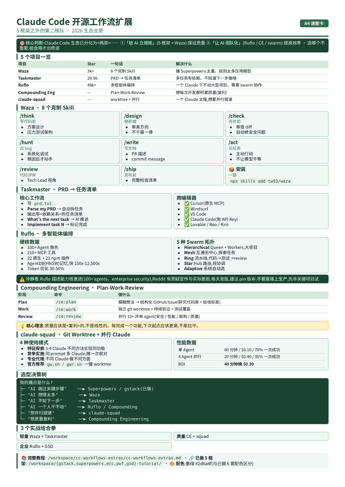

# 9.1.workflow


Claude Code 开源工作流扩展集
> 配色:墨绿色 `#2d6a4f`(主)+ `#1b4332`(深)+ `#95d5b2`(浅)
> 主题:Claude Code 生态里**第二梯队**的开源工作流项目
> 范围:5 框架已覆盖的(gstack / Superpowers / ECC / planning-with-files / GSD)之外的同类项目



## 0. 为什么还要再做这一份?

之前做的 5 框架,本质都是"**Skill 合集**"——给你一个"大而全"的工程纪律仓库。但生态里还有另一类项目,它们**只做一个点,但做到极致**:

| 类型 | 代表 | 一句话定位 |
|---|---|---|
| **Skill 合集**(已做) | Superpowers、gstack、ECC | 给 AI 装一整套工程纪律 |
| **工程习惯工具包**(本节) | Waza | 8 个克制 Skill,把"该有的习惯"做到位 |
| **任务分解器** | Claude Taskmaster | PRD → 任务清单,管理"下一步做什么" |
| **多智能体编排** | Ruflo / Claude-Flow | 把"一个 Claude"变成"一个团队" |
| **Plan-Work-Review** | Compounding Engineering | 计划-执行-评审 三步法,每次开发都积累质量 |
| **并行执行** | claude-code-swarm | Git worktree + 多 Claude 并行 |

加上之前 `cc-workflows/` 教程里提过的 Skills / Plugins / Hooks / MCP,这就构成了一幅**完整的 Claude Code 生态地图**。

---

## 1. Waza — 8 个克制 Skill,只做"该有的习惯"

**仓库**:[tw93/waza](https://github.com/tw93/waza) · **作者**:tw93(妙言、Pake 作者)· **Star**:3k+ · **类型**:纯 Markdown Skill 集

### 1.1 一句话定位

> "Waza"(日语"技"):把 AI 该有的工程习惯封装成 8 个 Skill,**不堆功能,只做克制**。

Waza 解决的是另一个问题:Superpowers、gstack 之类**规则太多反而压垮模型**。Waza 反着来——**每个 Skill 只定目标和约束,剩下的交给模型自己发挥**。

### 1.2 8 个 Skill

| Skill | 触发时机 | 做什么 |
|---|---|---|
| `/think` | 写代码之前 | 方案设计 + 压力测试架构 |
| `/design` | 做前端界面 | 产出有审美方向的 UI,不千篇一律 |
| `/check` | 任务完成后、合并前 | 审查 diff,自动修安全问题,验证通过才算完 |
| `/hunt` | 任何 bug 或异常 | 系统化调试,确认根因后才动手修 |
| `/write` | 写 PR / 文档时 | 写技术文档、PR 描述、commit message |
| `/act` | 跑长任务时 | 主动行动,不让模型干等 |
| `/review` | 代码评审 | 像 Tech Lead 一样看代码 |
| `/ship` | 准备发布 | 完整的发布检查清单 |

### 1.3 安装

```bash
# 安装 Waza(目前通过 skill 子命令)
npx skills add tw93/waza
```

### 1.4 怎么用?—— 60 秒上手

```bash
# 在 Claude Code 里
> /think 帮我设计一个 OAuth2 登录系统
> Waza 会反问:用户量?是否需要多端?Token 过期策略?SSO?

> /design 重新设计我的 SaaS 着陆页
> Waza 会先问:目标用户?品牌调性?参考网站?然后给出有审美方向的方案

> /hunt 这个 API 偶尔返回 500
> Waza 会强制你先复现 + 收集日志 + 假设验证,不允许瞎改
```

### 1.5 灵魂问题

> **Waza vs Superpowers 怎么选?**
>
> Superpowers 是"**给 AI 立规矩**"(很多 Skill,很重);Waza 是"**给 AI 留空间**"(8 个 Skill,克制)。
>
> 如果你觉得自己 AI 经常"想得不够"——用 Superpowers;
> 如果你觉得自己 AI 经常"想得太多"——用 Waza。
>
> 我的建议:**先装 Waza**,因为它轻。学完发现不够用,再上 Superpowers。

---

## 2. Claude Taskmaster — PRD → 任务清单

**仓库**:[eyaltoledano/claude-task-master](https://github.com/eyaltoledano/claude-task-master) · **作者**:eyaltoledano · **Star**:20.9k · **类型**:AI 任务管理 CLI

### 2.1 一句话定位

> "把 PRD 喂进去,吐出一份带依赖关系的任务清单;然后告诉 AI '做下一个',它会自己推进。"

它解决的问题:**Claude Code 容易"做一步算一步"**,没有全局视角。Taskmaster 充当"项目经理",强制 AI 按任务清单推进。

### 2.2 核心工作流

```bash
# 1. 初始化
npx task-master-ai init

# 2. 写一份 PRD(放 .taskmaster/docs/prd.txt)
cat > .taskmaster/docs/prd.txt <<'EOF'
# 用户认证系统
- 邮箱 + 密码注册
- OAuth2(Google / GitHub)
- JWT token + refresh token
- 邮件验证
- 找回密码
EOF

# 3. 解析 PRD → 任务
> Parse my PRD at .taskmaster/docs/prd.txt
# Taskmaster 会输出:
# Task 1: 数据库 schema 设计(依赖:无)
# Task 2: 用户注册 API(依赖:1)
# Task 3: 邮件验证流程(依赖:2)
# Task 4: OAuth2 集成(依赖:1)
# Task 5: JWT 中间件(依赖:2,4)
# ...

# 4. 推进
> What's the next task I should work on?
# → "Task 1: 数据库 schema 设计"

> Implement task 1
# AI 写完后,标记完成,自动跳到 Task 2
```

### 2.3 跨编辑器支持

- ✅ Cursor(原生 MCP)
- ✅ Windsurf
- ✅ VS Code(原生 MCP)
- ✅ Claude Code(用 claude-code/sonnet,免 API Key)
- ✅ Lovable、Roo、Kiro

### 2.4 灵魂问题

> **Taskmaster vs planning-with-files 怎么选?**
>
> **planning-with-files**: 通用规划哲学,任何时候都能用
> **Taskmaster**: 强任务分解 + 依赖管理,适合多任务、长周期项目
>
> 简单项目用 PWF;复杂项目(5+ 任务、有依赖)用 Taskmaster。

---

## 3. Ruflo — Claude Code 多智能体编排

**仓库**:[ruvnet/ruflo](https://github.com/ruvnet/ruflo)(前身:claude-flow)· **作者**:ruv(Reuven Cohen)· **Star**:48k+ · **类型**:多智能体编排平台 · **协议**:MIT

### 3.1 一句话定位

> "把 Claude Code 从'一个能干活的助手'升级成'一个能协作、能记忆、会自进化的团队'。"

### 3.2 核心数据

| 指标 | 数值 |
|---|---|
| GitHub Stars | 48,500+ |
| Agent 角色 | 100+(coder / tester / reviewer / architect / security…) |
| MCP 工具 | 210+ |
| 插件 | 32 个原生 + 21 个 npm |
| LLM 支持 | Claude、GPT、Gemini、Cohere、Ollama |
| 记忆引擎 | AgentDB(HNSW 索引,比传统快 150x-12,500x)|
| Token 优化 | 30-50%(压缩 + 缓存) |

### 3.3 5 种 Swarm 拓扑

Ruflo 最大的亮点:不同任务用不同的"组织架构":

| 拓扑 | 结构 | 适合 |
|---|---|---|
| **Hierarchical** | Queen + Workers,层级管理 | 大型项目,中心化协调 |
| **Mesh** | 所有 Agent 互通,无中心 | 探索性任务,频繁交换信息 |
| **Ring** | 顺序传递,流水线 | pipeline 类:写代码→测试→review→文档 |
| **Star** | Hub 路由,Hub 不决策 | 轻量级协调,Agent 相对独立 |
| **Adaptive** | 系统自动选择 | 不想手动选 |

### 3.4 12 个自动触发器

Ruflo 内置 12 个**自动触发**的 worker,不需要你手动调用:

- `UltraLearn` — 新项目/大重构,自动深度学习
- `Optimize` — 检测到慢操作,自动性能优化
- `Audit` — 安全相关变更,自动审计
- `TestGaps` — 代码变更没测试,自动补
- `Security Scan` — 依赖变更,自动 CVE 扫描
- `Document` — 新函数/类,自动生成文档
- ……

> 例子:你改了 API 接口,`DeepDive` 自动分析影响范围,`TestGaps` 检查有没有测试,`Document` 更新文档。**全程不用动手**。

### 3.5 安装

```bash
# 一键安装(轻量)
claude mcp add ruflo -- npx ruflo@latest mcp start

# 完整安装(CLI + hooks + daemon)
npx ruflo@latest init wizard
```

### 3.6 ⚠️ 冷静看

- Ruflo 描述的能力**很激进**(100+ agents、enterprise security),实际企业落地需要**实际验证**
- Reddit 社区有开发者**质疑宣传与实际差距**
- 每天发版(1.4k+ releases)意味着你最好**固定 pin 版本**
- **不要因为 star 高就直接上生产**——先在非关键项目试

### 3.7 灵魂问题

> **Ruflo vs 直接用 Claude Code 子代理 怎么选?**
>
> Claude Code **原生的** sub-agents:够用,简单场景
> Ruflo:100+ 预制角色、自动触发器、记忆持久化、跨机器联邦
>
> 日常单文件改动 → 用原生 sub-agents 就够
> 大型 monorepo 重构 → 上 Ruflo,真的省事

---

## 4. Compounding Engineering — 计划-执行-评审三步法

**仓库**:[EveryInc/compounding-engineering-plugin](https://github.com/EveryInc/compounding-engineering-plugin) · **作者**:EveryInc · **类型**:Claude Code Plugin

### 4.1 一句话定位

> "让 AI 的**每一次开发都积累质量**,而不是制造技术债务。"

它的核心想法:**质量应该是复利**的,不是线性的。每完成一个功能,质量都应该提升,不是拉平。

### 4.2 三步工作流

#### Step 1:`/compounding-engineering:plan`

把模糊想法 → 结构化的 GitHub Issue
- 研究代码库,找相似模式
- 分析框架文档和最佳实践
- 制定**详细验收标准 + 实施计划**
- 生成符合现有模式的代码示例

> 输出:一个**研究充分**的 Issue,实施时直接照着做

#### Step 2:`/compounding-engineering:work`

执行计划 + 隔离环境
- 创建**独立的 git worktree**(干净开发)
- 把计划拆成可追踪的待办
- 系统执行 + **持续验证**(每改一次就测)
- 测试覆盖 + 无回归

> 输出:首次构建就正确,测试覆盖全面

#### Step 3:`/compounding-engineering:review`

并行 12+ 评审 agent
- 在**独立 worktree** 里深度分析
- 并行跑 12+ 评审 agent:
    - `security-sentinel`(安全哨兵)
    - `performance-oracle`(性能预言家)
    - `architecture-reviewer`(架构评审)
    - `code-quality-guard`(代码质量)
    - ……(还有 8+ 个)
- 给每个发现创建可追踪的 TODO

> 输出:符合质量标准的代码 + **记录学习**以备未来工作

### 4.3 安装

```bash
npx claude-plugins install @EveryInc/every-marketplace/compounding-engineering
```

### 4.4 灵魂问题

> **Compounding Engineering 跟 GSD 啥区别?**
>
> GSD:**Spec 驱动开发**,把 Spec 翻译成可执行技术上下文
> CE:**质量复利**,每次开发都让下次的起点更高
>
> 想要"流程顺畅"用 GSD;想要"质量积累"用 CE。

---

## 5. claude-code-swarm — Git Worktree + 并行 Claude

**仓库**:[smtg-ai/claude-squad](https://github.com/smtg-ai/claude-squad) · **类型**:并行 AI 终端管理 · **作者**:smtg-ai

### 5.1 一句话定位

> "用 Git worktree 给每个 AI 代理一个**独立工作区**,互不干扰,自动并行。"

它解决的核心问题:**一个 Claude 一次只能干一件事,效率低**。多开几个 Claude 又会互相覆盖文件。

### 5.2 核心思想:Git Worktree

```bash
# 一个 git 仓库可以签出多个工作树
git worktree add ../project-feature-a -b feature-a
git worktree add ../project-feature-b -b feature-b
git worktree add ../project-bugfix -b bugfix-123

# 每个 worktree 是独立的工作副本,共享 .git 历史
```

这样可以:
- 每个 Claude 在**独立 worktree** 工作
- 文件互不覆盖
- 共享 git 历史(可以 diff、merge)
- 处理完用 `git worktree remove` 清理

### 5.3 4 个使用模式

#### 模式 1:特征探索
> 同时跑 3-4 个 Claude,**用不同方法实现同一功能**:
```bash
deploy_parallel_agents "payment-processing" 4 \
  "Implement payment processing with different approaches: 
   Stripe, PayPal, crypto, bank transfer"
# 等所有 agent 完成,挑最好的
```

#### 模式 2:竞争性实施
> 同一个 prompt 跑多个,赌"至少一个一次就对":
```bash
deploy_parallel_agents "user-dashboard" 3 \
  "Create responsive dashboard with charts, tables, real-time updates"
# ROI: 节省 40 分钟,多花 $0.30
```

#### 模式 3:专业代理
> 不同 agent 做不同方面:
```bash
git worktree add ../auth-frontend -b auth/frontend
git worktree add ../auth-backend -b auth/backend
git worktree add ../auth-tests -b auth/tests
cd ../auth-frontend && claude -p "Build React auth UI" &
cd ../auth-backend && claude -p "Implement JWT API" &
cd ../auth-tests && claude -p "Write auth tests" &
```

#### 模式 4:Anthropic 官方推荐方式
Anthropic 工程师用 `gw.sh` / `gwr.sh` 自动创建 worktree + VS Code 集成。

### 5.4 性能数据

| 指标 | 单 Agent | 4 Agent 并行 |
|---|---|---|
| 开发时间 | 60 分钟 | 20 分钟 |
| 成本 | $0.10 | $0.40 |
| 一次成功率 | ~70% | ~95% |
| **ROI** | — | **40 分钟换 $0.30** |

### 5.5 类似工具

- **[CCManager](https://github.com/kbwo/ccmanager)**(TUI 工具) — 管理多个 Claude 会话
- **[Uzi CLI](https://github.com/devflowinc/uzi)** — 自动化 worktree + 代理编排
- **claude-squad** — 跨 Claude Code / Aider / Codex / OpenCode / Amp 多 AI 管理

### 5.6 灵魂问题

> **要不要上 worktree?**
>
> **上**:多人协作大型项目、长时跑大型重构、想用"竞争性实施"提质
> **不上**:个人小项目、临时改 bug、不想管 git 分支
>
> 入门建议:从**模式 3(专业代理)**开始,体验到好处再上模式 1。

---

## 6. 选型决策树

```
我在做 Claude Code,要不要"工作流框架"?
│
├─ 我的痛点是什么?
│  │
│  ├─ "AI 总跳过关键步骤" ──▶ Superpowers / gstack(已做)
│  │
│  ├─ "AI 想得太多反而压垮" ──▶ Waza ✨
│  │
│  ├─ "AI 不知道下一步做啥" ──▶ Taskmaster ✨
│  │
│  ├─ "AI 一个人干不动大型项目" ──▶ Ruflo / Compounding Engineering ✨
│  │
│  ├─ "想要并行提速" ──▶ claude-code-swarm ✨
│  │
│  ├─ "想边做边沉淀质量" ──▶ Compounding Engineering ✨
│  │
│  └─ "我就是想规划好再动手" ──▶ planning-with-files / GSD(已做)
│
└─ 我的项目多大?
   │
   ├─ 单文件 / 小项目 ──▶ Waza(轻)
   │
   ├─ 中型项目(5-20 文件) ──▶ Taskmaster / Compounding
   │
   └─ 大型 monorepo / 团队协作 ──▶ Ruflo + claude-code-swarm
```

✨ = 本教程介绍的项目

---

## 7. 实战组合拳

### 组合 1:Waza + Taskmaster(轻量高效)

```
接需求 → Taskmaster 拆任务 → /think 方案设计 → 实施 → /check 验证
```

适合:中型项目、独立开发者、想保持轻量

### 组合 2:Compounding + swarm(质量复利)

```
新功能 → /ce:plan 出 issue → /ce:work 在 worktree 实施 
     → /ce:review 12+ agent 评审 → 合并 → 下一轮(质量复利)
```

适合:大型项目、团队、对质量要求高

### 组合 3:Ruflo + GSD(企业级)

```
需求 → GSD 转 Spec → Ruflo 拆 swarm 角色 
   → 自动触发器推进 → 自学习记忆 → 持续优化
```

适合:企业 monorepo、长期项目、需要可观测

---

## 8. 速查表

| 项目 | Star | 一句话 | 适合 |
|---|---|---|---|
| **Waza** | 3k+ | 8 个克制 Skill | 嫌 Superpowers 太重的 |
| **Taskmaster** | 20.9k | PRD → 任务清单 | 多任务有依赖的项目 |
| **Ruflo** | 48k+ | 多智能体编排 | 大型 monorepo |
| **Compounding Eng** | - | Plan-Work-Review | 想质量复利 |
| **claude-squad** | - | 并行 Claude 管理 | 想多开 Claude 提速 |

---

## 9. 参考资源

- [Waza 官方仓库](https://github.com/tw93/waza)
- [Claude Taskmaster 官方仓库](https://github.com/eyaltoledano/claude-task-master)
- [Ruflo 官方仓库](https://github.com/ruvnet/ruflo)
- [Compounding Engineering 官方仓库](https://github.com/EveryInc/compounding-engineering-plugin)
- [claude-squad 官方仓库](https://github.com/smtg-ai/claude-squad)
- [Anthropic 工程师 worktree 工作流](https://www.pulsemcp.com/posts/how-to-use-claude-code-to-wield-coding-agent-clusters)
- [CC 生态 17 个开源项目](https://blog.csdn.net/weixin_42616808/article/details/150706512)

---

> **一句话总结**:Claude Code 生态已经分化为**两类**——
>
> 1. **"给 AI 立规矩"**(5 框架 + Waza)— 保证质量
> 2. **"让 AI 团队化"**(Ruflo / Compounding / swarm)— 提高效率
>
> 选哪个不重要,**组合用**才出奇迹。

