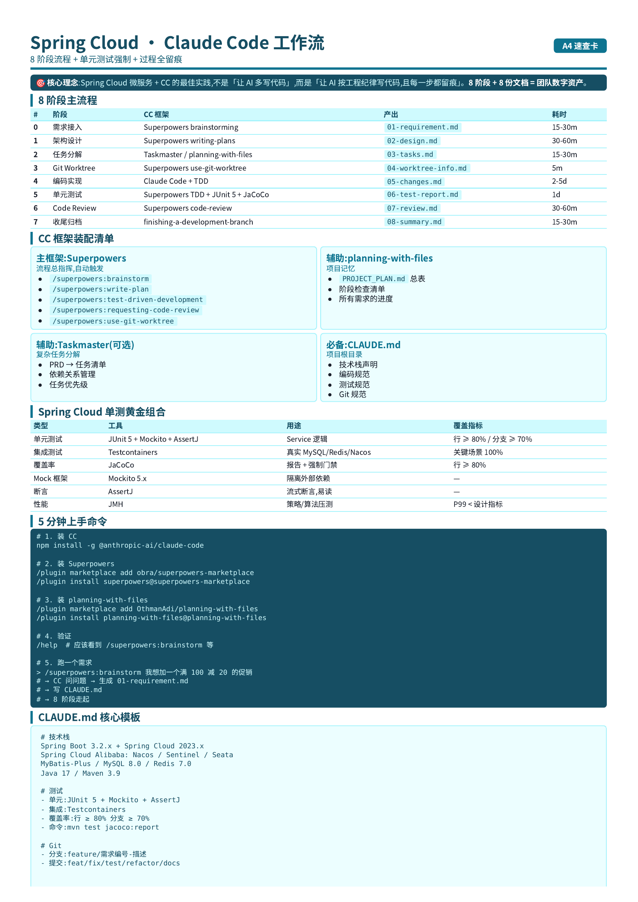
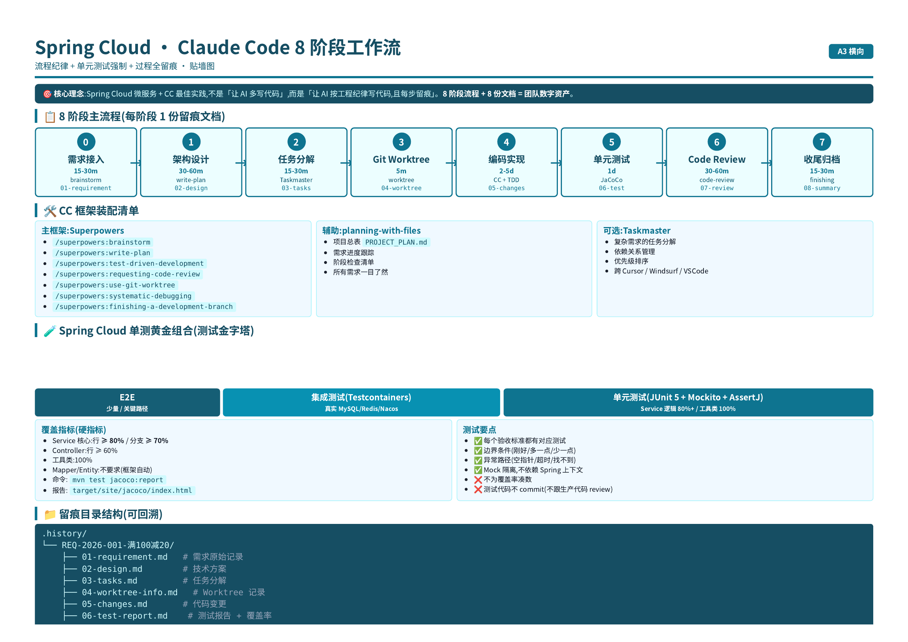
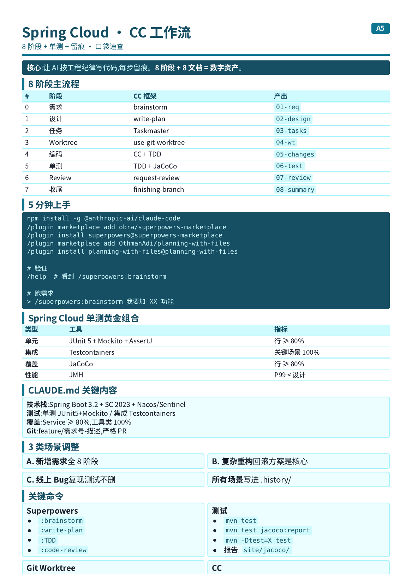
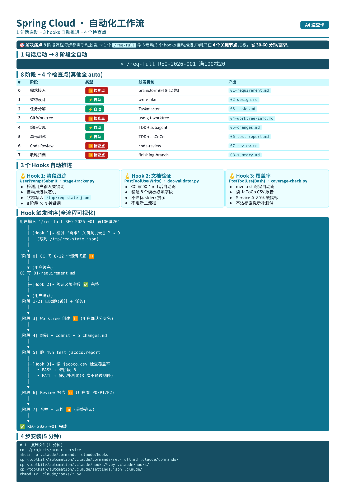

# 99.2.案例：JAVA开发全流程

Spring Cloud 微服务 · Claude Code 工作流手册
> 主题:**用 CC 框架 + 单元测试,系统化搞定新需求,且每个工作过程都留痕可回溯**
> 
> 适用:Spring Cloud / Spring Boot / Spring Cloud Alibaba 微服务
> 
> 覆盖:新增需求 / 复杂重构 / 线上 Bug 三类典型场景


Spring Cloud 微服务 + Claude Code 的最佳实践,不是"让 AI 多写代码",而是"让 AI 按工程纪律写代码,且每一步都留痕"。**

**8 阶段流程 + 8 份留痕文档 = 团队的数字资产。**

速查资源
- [Superpowers 官方](https://github.com/obra/superpowers)
- [planning-with-files 官方](https://github.com/OthmanAdi/planning-with-files)
- [Spring Boot Testing Best Practices](https://docs.spring.io/spring-boot/docs/current/reference/htmlsingle/#features.testing)
- [Testcontainers 官方](https://www.testcontainers.org/)
- [JaCoCo Maven Plugin](https://www.jacoco.org/jacoco/trunk/doc/maven.html)

## README

### 速记卡

完整速记卡


横版速记卡


简要速记卡


### 这份手册解决什么问题?

**典型痛点**(你大概率都遇到过):
- 新需求来了,CC 上来就写代码,写到一半发现理解偏了 → 返工
- 单测写不写看心情,覆盖率上不去,Leader 不让合并
- 改完一个 Bug,过两天又有人提相同 Bug,发现"原来改的位置不对"
- 团队里有人离职,他做的那块业务没人敢动 —— **因为没记录当时为什么这么做**
- 需求方问"这个功能是哪天上的 / 谁做的 / 怎么做的",查 Git 也查不到

**这套流程的设计目标**:
1. **流程纪律**:每个新需求都按 8 阶段走,不掉链子
2. **过程留痕**:每阶段产出 1 份标准化文档,自动归档
3. **单元测试强制**:TDD 不是口号,覆盖率有硬指标
4. **可回溯**:半年后翻 `.history/需求编号/` 能完整还原"那天我们怎么做的、为什么这么做"

## 1. 整体架构:8 阶段 + 4 角色 + 1 个流程总线

### 1.1.8个阶段(主流程)

```text
┌──────────────────────────────────────────────────────────────────┐
│  需求接入 → 架构设计 → 任务分解 → Git Worktree → 编码实现        │
│      ↓         ↓          ↓            ↓             ↓          │
│    01-doc    02-doc     03-doc      04-doc        05-doc        │
│                                                                  │
│  → 单元测试 → 代码审查 → 收尾归档                                 │
│      ↓         ↓          ↓                                        │
│    06-doc    07-doc    08-doc                                    │
└──────────────────────────────────────────────────────────────────┘
```

每个 `xx-doc` 都是**留痕文档**,8 份 = 一次完整需求交付。

### 1.2.4个角色(CC 框架映射)

| 角色        | 负责什么                 | 用什么 CC 框架                            |
|-----------|----------------------|--------------------------------------|
| **需求分析师** | 把模糊需求转成清晰验收标准        | Superpowers `brainstorming`          |
| **架构师**   | 设计接口、库表、上下游影响        | Superpowers `writing-plans` + 你的脑    |
| **开发工程师** | 写代码 + 单测             | Claude Code + Superpowers `TDD`      |
| **代码审查员** | 多维度 review(安全/性能/风格) | Superpowers `requesting-code-review` |

### 1.3.1个流程总线:Project Plan

整个项目的所有需求,统一进 `PROJECT_PLAN.md`:

```markdown
# 项目计划

## 进行中
- [REQ-2026-001] 满 100 减 20 促销
  - 阶段:单元测试(Stage 6/8)
  - Worktree: ../order-service-promo
  - 负责人: @张三
  - 文档: .history/REQ-2026-001/

## 待启动
- [REQ-2026-002] 优惠券核销接口
  - 预估:3 天
  - 依赖:REQ-2026-001

## 已完成
- [REQ-2026-000] 项目初始化
```

> 这就是 "**planning-with-files**" 的项目级应用。

## 2. CC 框架选型(本手册的"装配清单")

| 框架                      | 角色    | 用法                                                   |
|-------------------------|-------|------------------------------------------------------|
| **Superpowers**         | 流程总指挥 | 自动触发 brainstorming / TDD / review,7 步流程 + 15+ skills |
| **planning-with-files** | 项目记忆  | PROJECT_PLAN.md + 阶段检查清单                             |
| **Claude Taskmaster**   | 任务分解  | 复杂需求的 2 级分解(可选)                                      |
| **CLAUDE.md**           | 项目上下文 | 写项目规则、技术栈、约定                                         |

### 2.1 安装(5 分钟)

```bash
# 1. 装 Claude Code
npm install -g @anthropic-ai/claude-code

# 2. 装 Superpowers(主框架)
/plugin marketplace add obra/superpowers-marketplace
/plugin install superpowers@superpowers-marketplace

# 3. 装 planning-with-files
/plugin marketplace add OthmanAdi/planning-with-files
/plugin install planning-with-files@planning-with-files

# 4. (可选)装 Taskmaster
npx task-master-ai init

# 5. 验证
claude --version
/help
# 应该看到 /superpowers:brainstorming 等命令
```

### 2.2 必备的 CLAUDE.md(项目根目录)

我们可以自己使用claude的/init命令来初始化一个项目上下文文件CLAUDE.md，然后添加自己的规范进去。

```markdown
# CLAUDE.md — Spring Cloud 微服务项目规则

## 技术栈
- Spring Boot 3.2.x + Spring Cloud 2023.x
- Spring Cloud Alibaba: Nacos(注册/配置)+ Sentinel(限流) + Seata(分布式事务,可选)
- MyBatis-Plus 3.5.x(不强制,但团队习惯)
- MySQL 8.0 / Redis 7.0 / RocketMQ 5.x
- Java 17 / Maven 3.9

## 编码规范
- 强制使用 Lombok
- Controller/Service/Mapper/Entity/DTO/VO 分层清晰
- Service 层必须写单元测试,覆盖率 ≥ 80%
- 所有 public 方法必须加 JavaDoc
- 异常用 BusinessException + 统一 GlobalExceptionHandler

## 测试规范
- 单元测试:JUnit 5 + Mockito + AssertJ
- 集成测试:Testcontainers(MySQL / Redis / Nacos)
- 覆盖率:JaCoCo 报告,行 ≥ 80% 分支 ≥ 70%
- 测试命令: `mvn  test jacoco:report`

## Git 规范
- 分支:feature/需求编号-简短描述(如 feature/REQ-2026-001-promo)
- commit: feat/fix/test/refactor/docs 开头
- 不允许直接 commit 到 main,必须 PR + 1 人 review

## 工作流规则(本项目)
- 每个新需求必须按 8 阶段流程走
- 留痕文档存到 .history/需求编号/ 目录
- 详见 README.md 中的"工作流程"章节
```

## 3. 8 阶段流程详解(主菜)

### 阶段 0:需求接入 → 创建需求编号

**目的**:把口头/IM 群里的需求,变成可追溯的"需求记录"

**人工操作**:
1. 在 `PROJECT_PLAN.md` 新增一行:`[REQ-YYYY-NNN] 需求标题`
2. 创建目录 `mkdir -p .history/REQ-YYYY-NNN/`
3. 复制本手册的模板,创建文件 `01-requirement.md`

**CC 动作**:
```bash
# 让 CC 帮你规范化需求
> /superpowers:brainstorming 我想加一个"满 100 减 20"的促销功能。

请参考需求模板：templates/01-requirement.md，在目录 .history/REQ-YYYY-NNN/ 下创建 01-requirement.md 文件。
```

Superpowers 会自动问:
- 减 20 是"满 100 才减",还是"满 100 减,超过部分累计"?
- 是单次订单计算,还是跨订单?
- 是否需要防刷?同一用户一天能用几次?
- 退单怎么算?
- 有没有 A/B 测试需求?
- 上线策略:灰度?全量?

**CC 输出**:把这些问题问完,生成 `01-requirement.md`

**留痕文档**:`.history/REQ-YYYY-NNN/01-requirement.md` — 见 `templates/01-requirement.md`

**耗时**:15-30 分钟

### 阶段 1:架构设计 → 02-design.md

**目的**:把需求转成可执行的技术方案

**CC 动作**:
```bash
> 基于 .history/REQ-YYYY-NNN/01-requirement.md,设计技术方案。
请参考需求模板：templates/02-design.md，在目录 .history/REQ-YYYY-NNN/ 下创建 02-design.md 文件。
> 重点关注:
>   1. 涉及的微服务(订单?商品?营销?账户?)
>   2. 数据库表变更(新增 promo_rule?alter order?加索引?)
>   3. 接口设计(前端?内部 RPC?外部回调?)
>   4. 上下游影响(对账?统计?BI?)
>   5. 性能预估(QPS 多少?需不需要缓存?需不需要限流?)
>   6. 风险评估(分布式事务?幂等?并发?)
```

**CC 输出**:`02-design.md`,含:
- 涉及的微服务清单
- 接口定义(OpenAPI / Feign Client)
- 数据库 DDL
- 缓存设计
- 消息流(如涉及)
- 风险点 + 缓解方案
**留痕文档**:`.history/REQ-YYYY-NNN/02-design.md` — 见 `templates/02-design.md`

**耗时**:30-60 分钟

**关键检查点**:
- [ ] 涉及的微服务都列出了吗?
- [ ] 接口是否走 OpenFeign?是否走 Gateway?
- [ ] 分布式事务场景识别了吗?
- [ ] 性能瓶颈识别了吗?

### 阶段 2:任务分解 → 03-tasks.md

**目的**:把设计拆成可执行的小任务(2-5 分钟一件)

**CC 动作**:
```bash
# 选项 A:用 Taskmaster(复杂需求)
> 基于 02-design.md 拆任务,设置依赖关系和优先级
请参考需求模板：templates/03-tasks.md，在目录 .history/REQ-YYYY-NNN/ 下创建 03-tasks.md 文件。

# 选项 B:用 Superpowers writing-plans(标准)
> /superpowers:writing-plans 基于 02-design.md 拆任务
请参考需求模板：templates/03-tasks.md，在目录 .history/REQ-YYYY-NNN/ 下创建 03-tasks.md 文件。
```

**CC 输出**:`03-tasks.md`,任务示例:

```markdown
## 任务清单

### Phase 1:数据层(预计 2h)
- [ ] T1.1 在 `promo_db` 创建 `promo_rule` 表(主键、规则类型、生效时间、状态)
- [ ] T1.2 创建 `PromoRule` Entity / Mapper / Service 基础 CRUD
- [ ] T1.3 写 `PromoRuleServiceTest`,覆盖率 100%

### Phase 2:规则引擎(预计 3h)
- [ ] T2.1 设计 `PromotionStrategy` 接口
- [ ] T2.2 实现 `FullReductionStrategy`(满 100 减 20)
- [ ] T2.3 实现策略工厂 `PromotionStrategyFactory`
- [ ] T2.4 写策略测试,覆盖边界(刚好 100 / 99.99 / 1000 / 0)
- [ ] T2.5 策略性能压测(单次 1000 调用 < 10ms)

### Phase 3:订单集成(预计 4h)
- [ ] T3.1 订单服务注入 `PromotionService`(Feign Client)
- [ ] T3.2 订单创建时调用促销计算
- [ ] T3.3 订单服务写测试
- [ ] T3.4 集成测试:创建订单 → 应用促销 → 验证金额

### Phase 4:前端/接口(预计 2h)
- [ ] T4.1 暴露 `POST /api/orders` 包含 `promotionId` 字段
- [ ] T4.2 订单详情页展示促销减免金额
- [ ] T4.3 接口文档更新(knife4j)

### Phase 5:上线准备(预计 1h)
- [ ] T5.1 灰度方案(白名单 10 个用户)
- [ ] T5.2 监控告警(Prometheus 指标)
- [ ] T5.3 回滚方案
```

**耗时**:15-30 分钟

### 阶段 3:Git Worktree → 04-worktree-info.md

**目的**:隔离开发环境,避免污染主分支

**CC 动作**:
```bash
# Superpowers 自动
> /superpowers:using-git-worktrees
请参考需求模板：templates/04-worktree-info.md，在目录 .history/REQ-YYYY-NNN/ 下创建 04-worktree-info.md 文件。
# 或手动
git worktree add ../order-service-promo -b feature/REQ-2026-001-promo main
cd ../order-service-promo
claude  # 启动 CC
```

注意：原项目保存着最新的.history(包括当前需求中的文件)，worktree作为新的目录，跟原项目目录是分开的。
所以在当前窗口代码是看不到。

**CC 输出**:`04-worktree-info.md`,记录:
- Worktree 路径: ../order-service-promo
- 分支名:feature/REQ-2026-001-promo
- 基线 commit:main@abc123
- 创建时间:2026-08-01 10:00:00
- 关联需求编号:REQ-2026-001

**关键习惯**:
- ✅ 主分支保持清洁,所有 feature 都在 worktree
- ✅ 每个 worktree 独立跑 mvn,互不影响
- ✅ worktree 命名规范:`../<service>-<short-desc>`

### 阶段 4:编码实现 → 05-changes.md(自动留痕)

**目的**:写代码,且**所有变更自动留痕**

**CC 动作**:
```bash
# 进入 worktree 后
> 按 03-tasks.md 逐项实现
> /superpowers:test-driven-development (强制先写测试)
> /superpowers:subagent-driven-development (子代理并行)
> 用 planning-with-files 写任务进度
> 请参考需求模板：templates/05-changes.md，在目录 .history/REQ-YYYY-NNN/ 下创建 05-changes.md 文件。
```

**CC 输出**:
- 实际代码(Java / SQL / 配置)
- `05-changes.md`(自动生成)— 包含:
    - 修改文件清单
    - commit 历史
    - 关键 diff 说明
    - 临时决策记录("为什么用策略模式而不是 if-else")

**留痕机制**:
```bash
# 每个任务完成后自动 commit + 写文档
git add -A
git commit -m "feat(promo): T1.1 create promo_rule table"

# 写决策记录(可选,推荐)
echo "## 决策:为什么用策略模式
- if-else 难扩展,新增促销要改核心代码
- 策略模式符合开闭原则
- 性能损失 < 5%,可接受
- 测试更容易覆盖
" >> .history/REQ-2026-001/decisions.md
```

**耗时**:2-5 天(看复杂度)

**关键习惯**:
- ✅ 每个任务单独 commit(便于 review + 回滚)
- ✅ commit message 写清楚 "T1.1 / T1.2..."
- ✅ 关键决策(选 A 不选 B)写到 `decisions.md`
- ✅ 不用 `git commit --amend`(丢失原 commit 的留痕)

### 阶段 5:单元测试 → 06-test-report.md(强制)

**目的**:保证代码质量,且**测试本身可追溯**

**CC 动作**:
```bash
# Superpowers TDD
> /superpowers:test-driven-development
请参考需求模板：templates/06-test-report.md，在目录 .history/REQ-YYYY-NNN/ 下创建 06-test-report.md 文件。
# 让 CC 帮你补测试 / 写测试

# 跑测试 + 覆盖率
mvn  test jacoco:report

# 查看报告
open target/site/jacoco/index.html
```

**CC 输出**:
- 测试代码(JUnit 5 + Mockito)
- `06-test-report.md`,含:
    - 测试用例清单
    - 覆盖率报告(行 / 分支)
    - 测试执行结果
    - 没覆盖到的代码 + 原因说明

**Spring Cloud 单测黄金组合**:

```java
// 单元测试示例:Service 层 + Mockito
@ExtendWith(MockitoExtension.class)
class PromotionServiceTest {

    @InjectMocks
    private PromotionServiceImpl promotionService;

    @Mock
    private PromoRuleMapper promoRuleMapper;

    @Test
    @DisplayName("满 100 减 20:订单金额 100,应减免 20")
    void shouldDeduct20WhenOrderOver100() {
        // Given
        Order order = Order.builder().amount(new BigDecimal("100")).build();
        PromoRule rule = PromoRule.builder()
            .threshold(new BigDecimal("100"))
            .discount(new BigDecimal("20"))
            .build();
        when(promoRuleMapper.selectActiveByCode("FULL_100_20")).thenReturn(rule);

        // When
        BigDecimal finalAmount = promotionService.applyPromotion(order, "FULL_100_20");

        // Then
        assertThat(finalAmount).isEqualByComparingTo("80");
    }

    @Test
    @DisplayName("边界:订单金额 99.99,应不减免")
    void shouldNotDeductWhenOrderBelow100() {
        // ...
    }

    @Test
    @DisplayName("异常:规则不存在,应抛 BusinessException")
    void shouldThrowWhenRuleNotExist() {
        // ...
    }
}
```

**集成测试示例:Testcontainers**:

```java
// 集成测试:真实 MySQL + Redis
@SpringBootTest
@Testcontainers
class PromotionIntegrationTest {

    @Container
    static MySQLContainer<?> mysql = new MySQLContainer<>("mysql:8.0")
        .withDatabaseName("promo_db");

    @Container
    static GenericContainer<?> redis = new GenericContainer<>("redis:7-alpine")
        .withExposedPorts(6379);

    @Autowired
    private PromotionService promotionService;

    @DynamicPropertySource
    static void setProperties(DynamicPropertyRegistry registry) {
        registry.add("spring.datasource.url", mysql::getJdbcUrl);
        registry.add("spring.datasource.username", mysql::getUsername);
        registry.add("spring.datasource.password", mysql::getPassword);
        // ...
    }

    @Test
    void shouldApplyPromotionWithRealDatabase() {
        // ...
    }
}
```

**覆盖率硬指标**:
- ✅ Service 层:**行覆盖 ≥ 80%,分支 ≥ 70%**
- ✅ Controller 层:行覆盖 ≥ 60%(主要测路由 + 异常)
- ✅ Mapper/Entity:不强制(框架自动生成)
- ✅ 工具类:100%(纯函数好测)

**留痕文档**:`.history/REQ-YYYY-NNN/06-test-report.md` — 见 `templates/06-test-report.md`

**关键习惯**:
- ✅ 测试代码和生产代码同 PR(不分开)
- ✅ 关键场景必须有边界测试(刚好 / 多一点 / 少一点)
- ✅ 异常路径必须有测试(空指针 / 超时 / 找不到)
- ✅ Mock 不依赖 Spring 上下文(快)

### 阶段 6:代码审查 → 07-review.md

**目的**:多维度 review,质量把关

**CC 动作**:
```bash
# Superpowers 自动 review
> /superpowers:requesting-code-review
# CC 会按 4 维度 review:功能正确性 / 代码质量 / 安全 / 性能

请参考需求模板：templates/07-review.md，在目录 .history/REQ-YYYY-NNN/ 下创建 07-review.md 文件。
```

**CC 输出**:`07-review.md`,含:
- 审查维度清单
- 严重问题(P0 - 必修)
- 一般问题(P1 - 必改)
- 建议问题(P2 - 可选)
- 通过 / 不通过

**Spring Cloud 特别关注的审查项**:

```markdown
## P0 严重(必须改)
- [ ] 事务边界:@Transactional 范围是否正确?
- [ ] 幂等:重复请求会重复扣款吗?
- [ ] SQL 注入:MyBatis 用 #{} 不是 ${}
- [ ] 分布式锁:多节点并发场景有没有考虑?

## P1 一般(必改)
- [ ] Feign 调用:有 fallback 吗?有超时设置吗?
- [ ] 缓存:key 设计是否合理?TTL 设置?
- [ ] 日志:异常堆栈是否记录?
- [ ] 配置:敏感信息是否走 Nacos 而不是硬编码?

## P2 建议(可选)
- [ ] 命名:可读性
- [ ] 注释:JavaDoc 完整性
- [ ] 工具方法:是否可复用
```

**耗时**:30-60 分钟

### 阶段 7:收尾归档 → 08-summary.md

**目的**:合并 + 归档 + 知识沉淀

**CC 动作**:
```bash
# 1. 合并代码
cd main-repo
git merge --no-ff feature/REQ-2026-001-promo -m "Merge REQ-2026-001"
git worktree remove ../order-service-promo

# 2. 部署(如配置)
mvn  deploy -Pprod

# 3. 写收尾文档
> /superpowers:finishing-a-development-branch
请参考需求模板：templates/08-summary.md，在目录 .history/REQ-YYYY-NNN/ 下创建 08-summary.md 文件。
# CC 帮你生成 08-summary.md

# 4. 更新 PROJECT_PLAN.md
# 把 [REQ-2026-001] 移到"已完成"
```

**CC 输出**:`08-summary.md`,含:
- 需求完成总结
- 实际工时 vs 预估
- 关键决策回顾
- 踩过的坑(给后人留经验)
- 上线 Checklist

**最终目录结构**:

```
.history/
└── REQ-2026-001-满100减20促销/
    ├── 01-requirement.md       # 需求原始记录
    ├── 02-design.md            # 技术方案
    ├── 03-tasks.md             # 任务分解
    ├── 04-worktree-info.md     # Worktree 记录
    ├── 05-changes.md           # 代码变更总结
    ├── 06-test-report.md       # 测试报告 + 覆盖率
    ├── 07-review.md            # Code Review
    ├── 08-summary.md           # 收尾总结
    ├── decisions.md            # 关键决策(可选)
    └── screenshots/            # 关键截图(可选)
        ├── coverage.png
        └── review-comment.png
```

**耗时**:15-30 分钟

## 4. 三类典型场景(完整跑一遍)

### 场景 A:新增需求(上面例子)

完整流程按 8 阶段走,**总耗时约 1 周**(1 个中级需求)。

### 场景 B:复杂重构(无新功能)

| 阶段     | 调整                   |
|--------|----------------------|
| 0-1 需求 | 简化为"重构理由 + 重构范围"     |
| 2 设计   | 重头戏(架构兼容性 / 灰度 / 回滚) |
| 3 任务   | 拆更细(每步都影响生产)         |
| 4 编码   | 严格 TDD + 不破坏现有测试     |
| 5 测试   | **回归测试是重点**(全量跑测试)   |
| 6 审查   | 重点 review 兼容性        |
| 7 收尾   | 灰度上线 + 监控 + 回滚预案     |

**特别提示**:重构的 02-design.md 必须有**回滚方案**。

### 场景 C:线上 Bug

| 阶段         | 调整                           |
|------------|------------------------------|
| 0 需求       | 简化为"Bug 现象 + 复现步骤 + 影响范围"    |
| 1 设计       | 跳到根因分析                       |
| 2 任务       | 简化为"修复 + 回归"                 |
| 3 Worktree | `hotfix/REQ-2026-NNN-fix`    |
| 4 编码       | 小范围修改                        |
| 5 测试       | **复现用例转测试**(防回归)             |
| 6 审查       | 重点 review 根因 + 修复            |
| 7 收尾       | **复盘文档**(写进 .history,避免重复踩坑) |

## 5. 团队协作:把这些流程在团队里推起来

### 5.1 启动期(0-1 周)

- [ ] 团队培训:1 次分享会(2h,演示一个真实需求走完 8 阶段)
- [ ] 模板上线:把 `templates/` 放到团队 wiki
- [ ] CLAUDE.md:每个项目都加
- [ ] Superpowers + planning-with-files:全员装

### 5.2 试运行(1-2 周)

- [ ] 选 1 个"小需求"做试点
- [ ] 每天 standup 同步进度
- [ ] 收集痛点,迭代流程

### 5.3 推广期(2-4 周)

- [ ] 全部新需求按流程走
- [ ] Code Review 必须看 `.history/` 文档
- [ ] 周会回顾"上周流程跑得怎么样"

### 5.4 沉淀期(1 月+)

- [ ] 收集"踩坑"案例,写进团队 wiki
- [ ] 优化模板(去重、补漏)
- [ ] 统计指标:平均开发周期 / Bug 回归率 / 覆盖率

## 6. 常见问题

### Q1:小需求也要 8 阶段吗?

A:小需求可以**合并阶段**:
- 阶段 0-1 合并(15 分钟写完)
- 阶段 2 简化(只列主要任务)
- 阶段 3 必需
- 阶段 4-5 严格 TDD
- 阶段 6 简化为"自查清单"
- 阶段 7 必做(归档很关键)

### Q2:紧急 Bug 怎么办?

A:走**快速通道**:
- 阶段 0 合并(直接在群/IM 留痕)
- 阶段 3 立刻 Worktree
- 阶段 4-5 快速实现 + 测试
- 阶段 6 **事后补** review
- 阶段 7 必做(写"为什么 bug 会出现"的复盘)

### Q3:AI 写得不满意怎么办?

A:**不要"凑合"**:
- 让 CC 重做或换方案
- 必要时**切换到手动**(但用 CC 帮你搜资料 / 查文档)
- 永远不要"AI 写的就这样吧"——AI 是工具,质量你负责

### Q4:留痕文档会变成负担吗?

A:**前期是负担,后期是资产**:
- 前期 8 份文档看起来多,但每份就 5-15 分钟
- 半年后:新人接手靠它,事故复盘靠它,绩效回顾靠它
- **真正花时间的不是写文档,是"等出了问题想不起来"**

### Q5:覆盖率指标会不会太死板?

A:可以**按层分级**:
- Service 核心逻辑:≥ 80%(硬指标)
- Controller:≥ 60%(可协商)
- 工具类:100%
- 自动生成代码:不要求

### Q6:不用 Superpowers 能不能跑这套流程?

A:**能**,但要用其他工具补:
- brainstorming → 手动 + 清单
- TDD → 强行约定
- review → 手动 checklist

**推荐 Superpowers**,因为它把"流程"自动化了,省去你"我应该用哪个 skill"的纠结。

## 7.全流程自动化

目标：1 句话启动 8 阶段流程

方式：自定义命令，通过 3 个 hook 自动推进，中间只在 4 个关键节点让人工确认。




具体实现查看：automation 目录下的文件


### 📦 第 1 步:项目级claude

```bash
# 假设你的项目根目录是 /home/user/projects/order-service
cd /home/user/projects/order-service

# 1.1 创建 .claude 目录
mkdir -p .claude/commands .claude/hooks

# 1.2 复制本工具箱的 automation 文件
cp /path/to/spring-cloud-workflow/automation/.claude/commands/req-full.md .claude/commands/
cp /path/to/spring-cloud-workflow/automation/.claude/hooks/*.py .claude/hooks/
cp /path/to/spring-cloud-workflow/automation/.claude/spring-templates/*.md .claude/spring-templates/
cp /path/to/spring-cloud-workflow/automation/.claude/settings.json .claude/

# 1.3 给 hook 加执行权限
chmod +x .claude/hooks/*.py
```

验证:
```bash
ls -la .claude/
# 应该看到 commands/ hooks/ settings.json 三个东西
```

### ⚙️ 第 2 步:调整配置(2 分钟)

#### 2.1 编辑 `settings.json`

把 `$CLAUDE_PROJECT_DIR` 替换成**你的项目绝对路径**(环境变量有些 CC 版本不展开):

```json
{
  "hooks": {
    "UserPromptSubmit": [{
      "matcher": ".*",
      "hooks": [{
        "type": "command",
        "command": "python /home/user/projects/order-service/.claude/hooks/stage-tracker.py"
      }]
    }],
    "PostToolUse": [
      {
        "matcher": "Bash",
        "hooks": [{
          "type": "command",
          "command": "python /home/user/projects/order-service/.claude/hooks/coverage-check.py"
        }]
      }
    ]
  }
}
```

#### 2.2 检查 `CLAUDE.md` 是否存在

`/req-full` 依赖 `CLAUDE.md` 里的项目配置(技术栈、命名规范、Git 规范)。如果没有,先跑 `/init` 生成。

### 🧪 第 3 步:测试 hooks(1 分钟)

#### 3.1 测试 hook 1:阶段跟踪器

```bash
# 手动测试(应该无输出说明 OK)
echo '{"user_prompt":"我要做需求", "session_id":"test"}' | \
  python .claude/hooks/stage-tracker.py

# 应该看到:
{"continue": true, "hookSpecificOutput": {"additionalContext": "当前阶段: None/8, 需求: None"}}
```

#### 3.2 测试 hook 2:文档验证器

```bash
# 创建一个空 01-requirement.md,看会报什么
mkdir -p /tmp/test
echo '{}' > /tmp/test/01-requirement.md
echo '{"tool_name":"Write","tool_input":{"file_path":"/tmp/test/01-requirement.md","content":"# 标题\n需求编号: REQ-001\n"}}' | \
  python .claude/hooks/doc-validator.py

# 应该看到
⚠️ [01-requirement] 模板不完整,缺失字段:
   - 需求编号
   - 创建日期
   - 需求方
   - 负责人
   - ## 1. 背景
   - ## 2. 需求描述
   - ## 3. 验收标准
   - ## 4. 不做什么
   - ## 5. 风险与依赖

{"continue": true, "hookSpecificOutput": {"additionalContext": "模板标识：01-需求文档，缺失项：[需求编号、创建日期、需求方、负责人、## 1. 背景、## 2. 需求描述、## 3. 验收标准、## 4. 不做什么、## 5. 风险与依赖]，文档完整性：不完整"}}
```

#### 3.3 测试 hook 3:覆盖率检查

```bash
# 这个需要先有 JaCoCo 报告
# 跑完 mvn test 后跑:
echo '{"tool_name":"Bash","tool_input":{"command":"mvn test"},"tool_output":"BUILD SUCCESS"}' | \
  python .claude/hooks/coverage-check.py

# 应该看到
📊 覆盖率检查结果: PASS
   总包数: 4, 失败: 0
✅ 覆盖率达标,可以进入下一阶段
{
  "status": "PASS",
  "results": [
    {
      "package": "com.example.my_demo.controller",
      "line_pct": 68.2,
      "branch_pct": 50.0,
      "line_covered": 15,
      "line_total": 22
    },
    {
      "package": "com.example.my_demo.service.impl",
      "line_pct": 100.0,
      "branch_pct": 90.0,
      "line_covered": 32,
      "line_total": 32
    },
    {
      "package": "com.example.my_demo.exception",
      "line_pct": 82.6,
      "branch_pct": 100,
      "line_covered": 19,
      "line_total": 23
    },
    {
      "package": "com.example.my_demo.repository.impl",
      "line_pct": 89.7,
      "branch_pct": 90.0,
      "line_covered": 52,
      "line_total": 58
    }
  ],
  "failed": [],
  "summary": "总包数: 4, 失败: 0"
}
```

#### 3.4 在 CC 里实测

```bash
cd /home/user/projects/order-service
claude
```

在 CC 里:
```
> /help
# 应该看到 /req-full

> /req-full 测试一下
# 应该启动流程(因为没有 PROJECT_PLAN.md,会提示先创建)
```

### 🚀 第 4 步:第一次实战(1 分钟 + 跑流程)

#### 4.1 准备 PROJECT_PLAN.md

在项目根目录创建:

```markdown
# 项目计划

### 进行中
(空)

### 待启动
(空)

### 已完成
(空)
```

#### 4.2 启动 CC 并跑需求

```bash
claude
```

```
> /req-full REQ-2026-001 满100减20的促销功能
```

#### 4.3 观察自动化效果

你应该看到:

```
CC: 🚀 启动 8 阶段流程,需求 REQ-2026-001
    [阶段 0/8] 需求接入
    Q1: 减 20 是"满 100 才减"还是累计?
    ...
[Hook 1] 🔄 状态推进: 阶段 ? → 阶段 0
```

每回答 1 个问题,CC 推进一点。

当 CC 写 `01-requirement.md` 时:

```
[Hook 2] ✅ [01-requirement] 模板完整
```

阶段 0 完成后 CC 会停下等你确认需求 ⏸️。

**总计 4 次确认**(需求 / Worktree / Review / 收尾),其他全自动。


### 🐛 故障排查

#### Hook 不触发?

```bash
# 1. 检查 Python 路径
which python
# 应该是 /usr/bin/python 或类似

# 2. 检查 hook 权限
ls -la .claude/hooks/
# 应该 -rwxr-xr-x

# 3. 检查 settings.json 语法
python -m json.tool .claude/settings.json
# 应该正常输出格式化 JSON

# 4. 看 CC 日志
claude --debug 2>&1 | grep -i hook
```

#### 状态推进不对?

```bash
# 查看状态文件
cat /tmp/req-state.json

# 手动重置
rm /tmp/req-state.json
```

#### 覆盖率检查不准?

- JaCoCo 报告路径: `target/site/jacoco/jacoco.csv`
- 多模块项目:每个模块都有 `target/site/jacoco/jacoco.csv`
- 默认配置已支持(glob 递归找)


### 🎨 自定义(可选)

#### 修改检查点

`settings.json` 里的 `automation.checkpointStages` 决定哪几个阶段需要人工确认:

```json
"checkpointStages": [0, 3, 6, 7]
// 0 需求澄清  3 Worktree  6 Review  7 收尾
// 改 [0, 6] = 只在需求和 Review 停下,其他全自动
```

#### 修改覆盖率目标

`coverage-check.py` 里的 `COVERAGE_TARGETS`:

```python
COVERAGE_TARGETS = {
    "service": {"line": 80, "branch": 70},  # 改这里
    "controller": {"line": 60, "branch": 0},
    ...
}
```

#### 禁用某个 hook

注释掉 `settings.json` 里对应的 hook 数组即可。

### ✅ 安装完成

你现在可以:
- 1 句话启动 8 阶段流程
- 中间只在 4 个节点拍板
- 所有阶段都自动留痕
- 覆盖率不达标自动提醒

**下一步**:试着跑 `/req-full` 一个真实的小需求(预估 < 4h),感受自动化效果。
