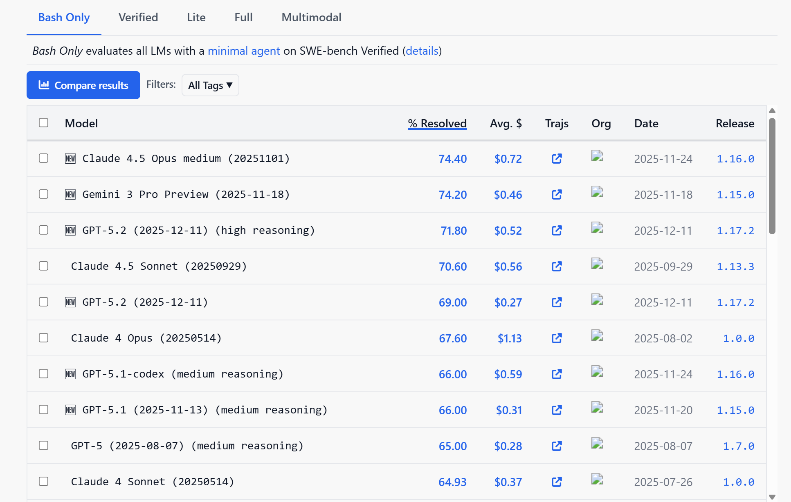
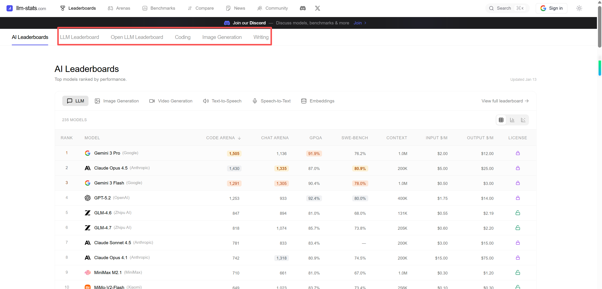
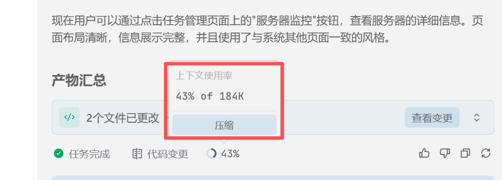
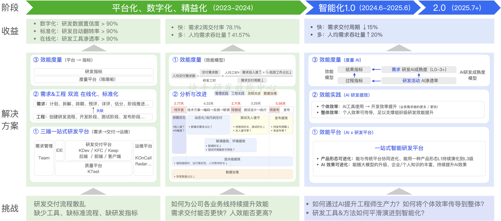

# 6.AI编程

## 介绍

### 1.AI 编程核心
AI编程两大核心支柱的角色 大模型 与 智能体。

1. 大模型 (Large Model)。在AI编程中的角色是大脑。提供强大的自然语言理解与生成能力，是知识、代码生成和逻辑推理的源泉。但它通常“只会说，不会做”。
2. Agent (智能体)。是行动的“身体”与“协调中枢”。具备自主规划、决策、调用工具（API、搜索引擎、代码解释器）和执行的能力。它围绕大模型进行任务拆解和调度，以完成复杂目标

工作流程：
1. 接收任务：你向AI编程助手（通常是一个Agent）提出需求，例如“创建一个用户登录的RESTful API”。 
2. 规划与调用：Agent理解需求后，会利用其内置的大模型“大脑” 进行思考，规划实现步骤（如：需要生成用户模型、验证逻辑、JWT token处理等），
   并可能调用代码生成、文件读写等工具。
3. 执行与迭代：Agent协调各个步骤，生成代码文件，甚至运行测试。如果出错，它会再次调用大模型分析错误并修复，形成一个自主的“思考-行动”闭环。

### 2.工作流程

AI Coding，本质是基于 RAG 的代码助手，流程整理为：两个阶段 + 七个核心步骤。

核心本质如下：
1. 离线构建知识库 —— 决定检索质量
2. 多路召回 + 智能组装 —— 决定答案相关度
3. LLM 只是最后一步 —— 真正关键在“检索与上下文”而非生成本身

简单理解就是：“搜索引擎 + 上下文拼装 + 大模型写作”的组合系统。

总流程如下：

```
离线阶段：
    代码解析 → 切块 → 嵌入生成 → 向量存储

在线阶段：
    用户输入
    → 查询嵌入
    → 向量检索 + 本地检索
    → 结果融合重排
    → 上下文组装（Token 控制）
    → LLM 推理生成
    → 后处理与反馈优化
```

#### 2.1.离线阶段（Index 构建阶段）

这一阶段的目标：把代码库变成可被语义检索的知识库。

> 1.代码解析与切块

对代码仓库进行结构化处理：
* 按类 / 函数 / 方法 / 模块切分
* 提取注释、DocString
* 解析 AST（可选）
* 保留文件路径与关键字

输出：语义代码块集合。

> 2.嵌入生成（Embedding）

对以下内容生成向量：
* 代码块
* 注释说明
* 文档（README / API 文档）
* 编码规范

目的：把文本/代码转为可计算的语义向量。

> 3.向量存储

将向量写入向量数据库：
* Turbopuffer
* Milvus
* Pinecone
* Weaviate 等

至此，代码库完成“可语义搜索化”。

#### 2.2.在线阶段（用户交互阶段）

这一阶段的目标：根据用户问题，从代码库中找相关信息并生成答案。

> 1.查询理解与嵌入

用户输入可能包括：
* 自然语言问题
* 当前编辑文件
* 光标位置上下文
* 最近修改文件

系统生成：
* Query Embedding（问题向量）
* Context Embedding（上下文向量）

> 2.多路检索（召回阶段）

语义 + 结构 双通道召回，提高准确率。

1.向量检索（语义召回）。在向量数据库中做最近邻搜索：
* 找语义最相近的代码块
* 文档说明
* 注释片段

2.本地结构检索（结构召回） 。客户端本地补充：
* 文件路径模糊匹配
* 类名/函数名匹配
* Git 最近修改
* 关键字搜索


> 3.结果融合与上下文组装

不是简单拼接，而是智能整理，最终生成：高质量 Prompt 上下文包

1.融合与重排
* 去重
* 权重排序（语义分 + 路径分）
* 时间权重
* 项目相关性

2.Token 控制
* 长文件截断
* 函数级优先
* 注释优先
* 防止超 Token

> 4.LLM 推理与响应

LLM 输入内容：
* 用户问题
* 检索到的代码
* 当前文件上下文
* 项目规范
* Prompt 模板

LLM 输出：
* 代码建议
* Bug 修复
* 架构说明
* 精准回答

> 4.后处理与反馈（可选但重要）

工程级系统常见步骤：
* 代码格式化
* 文件路径高亮
* 安全扫描
* 置信度评分
* 用户采纳学习（优化未来检索）

### 3.常见特性

- 工作模式: 
  - YOLO（You Only Live Once）：直接干、一步到位生成代码。不同的工具名字不同，例如trae叫做build
  - Plan 模式（规划模式）：特点：先规划，再逐步实现。
- 上下文：大模型保存历史对话，大模型会不断的回顾历史对话，以帮助其更好的理解任务并生成高质量的代码。 上下文大小取决于大模型，通常有100k~200k tokens。
- 上下文压缩：压缩历史对话，保存关键信息，减少无用信息，提高处理效率，能保存更久的历史。
- CUE（Context Understanding Engine）：上下文理解引擎，能理解上下文，能生成高质量的代码。使用tag按键接受cue的内容。
- MCP（Multi-Agent Coordination Protocol）:在AI编程中用于调用外部服务，如文件操作、数据库操作等，通常需要自定义。
- Tool: 工具功能，提供外部工具调用，例如文件阅读、编辑、终端、预览、联网等。
- Skill: 给agent上下文技能列表，按需也就是给自己装技能，把新能力直接塞进脑子里
- rule：用于限制agent的行为，例如不允许agent访问某些敏感信息，或者不允许agent进行某些操作。
- subagent: 子代理，节省token，基于父子agent，plan调度，，subagent在另外一个session中运行,汇报给主agent结果。（减少无用信息，提高处理效率）
- hook：钩子，用于在agent执行过程中，拦截并执行某些操作，例如日志记录、性能监控、权限控制等。
- agent team：启动多个claude code实例，分别完成不同的任务。
- OpenClaw：是一款本地优先、可自托管、开源的 AI 自主代理（Agent）执行引擎，核心是让 AI 从 “只会聊天” 变成 “能动手干活” 的数字助理。
    官网：[https://docs.openclaw.ai/](https://docs.openclaw.ai/)

| 维度      | YOLO | Plan   |
| ------- | ---- | ------ |
| 速度      | 快    | 中等     |
| 风险      | 高    | 低      |
| 适合项目    | 小/临时 | 中大型/长期 |
| 交互次数    | 少    | 多      |
| 代码质量稳定性 | 一般   | 高      |
| 适用场景    | 简单/快速 | 复杂/详细 |

## 模型

### 1.排名

AI编程能力通常体现在这几个方面：
1. 复杂推理与规划：处理多步骤任务、进行架构设计。 
2. 长上下文理解：能处理整个代码库或多个文件，保持连贯性。 
3. 代理工作流：能自主或半自主地规划并执行任务，例如从设计到生成代码。 
4. 生产就绪输出：生成的代码质量高、稳定，可直接用于生产环境。

这些能力常通过 SWE-Bench（评估模型解决真实GitHub软件工程问题的能力）等基准测试来衡量
- [AI Coding之SWE-bench](https://docker.blog.csdn.net/article/details/154170459)
- swebench官网[https://www.swebench.com/](https://www.swebench.com/)

swebench官网提供了一份模型排名



因为AI编程技术迭代非常快，所有出现一个整体排名的网站：[https://llm-stats.com/](https://llm-stats.com/)

是一个名为“AI Leaderboards 2026”的网站，其核心功能是提供各类人工智能（AI）模型的排行榜，供用户进行比较。
网站页面顶端清晰地列出了 “竞技场排名”，并说明这是汇聚了所有子竞技场的综合性能表现。这表明它可能通过多种任务或测试集，对不同的AI模型进行横向评估和排名。



我们基本可以看到：榜单前10基本就是Gemini、Claude、GPT等，这些都是商业模型。
国产的模型上榜的

### 2.国产模型

1. 智普：[https://open.bigmodel.cn/](https://open.bigmodel.cn/)
2. minimax： [https://www.minimaxi.com/](https://www.minimaxi.com/)
3. 模型代理，国内的大模型代理服务上，可以直接使用Claude code 和 codeX，价格还便宜不少。
   - [https://deeprouter.top/](https://deeprouter.top/)
   - [https://www.packyapi.com/](https://www.packyapi.com/)
   - [https://www.aigocode.com/](https://www.aigocode.com/)
   - [https://www.dmxapi.cn/](https://www.dmxapi.cn/)
   - [https://cubence.com/](https://cubence.com/)


### 3.免费模型对比

| 模型         | 推理能力   | 速度       | 成本 | 推荐用途           |
| ------------ | ---------- | ---------- | ---- | ------------------ |
| Grok-code    | ⭐⭐⭐⭐⭐ | ⭐⭐⭐     | 免费 | 复杂任务、架构设计 |
| GLM-4.7      | ⭐⭐⭐⭐   | ⭐⭐⭐⭐   | 免费 | 代码理解、文档写作 |
| Big Pickle   | ⭐⭐⭐     | ⭐⭐⭐⭐⭐ | 免费 | 快速探索、简单任务 |
| MiniMax M2.1 | ⭐⭐⭐     | ⭐⭐⭐⭐⭐ | 免费 | 快速响应任务       |

## 工具

工具的本质是提供agent的载体。

claude code 与 cursor 两者的定位不同。
1. Cursor 是“AI 编程助手”，人在驾驶，AI 是导航。
2. Claude Code 是“AI 工程代理”。AI 在驾驶，人是监督员。Claude Code 适合复杂任务、架构设计、代码理解、文档写作等，需要更大的权限去执行更多的操作。

### 1.AI集成环境（也就是IDE）

#### 1.1.Cursor
1. 官网：[https://cursor.com/cn](https://cursor.com/cn)
2. 基于VS Code深度定制，AI能力（聊天、编辑、补全）无缝融入编辑器
3. 多模型支持（GPT-4、Claude等），可切换
4. 提供免费Hobby计划，有次数限制
5. 难题：限制地区使用，需要使用破解版，模型也需要修改。

#### 1.2.TRAE
1. 官网：[https://trae.cn](https://trae.cn)
2. 提供国内与国际两个版本，支持的模型也有所不同。
3. 提供免费的支持。支持多种国产模型进行切换。

#### 1.3.对比

综合对比

| 维度                |  Claude Code         | open Code    |  Cursor         |  Trae              |
| ----------------- |------------------------|--------------|-------------------|----------------------|
|  产品定位           | AI 原生编程代理 + 多角色/多任务协调  | AI 代码助手平台    | AI 代码补全与交互式编辑器    | AI 编码助手 / IDE 集成     |
|  核心理念           | 任务驱动 + 多 Agent 协作      | 开放式代码生成与协作   | 交互式编码体验           | 高效即时开发辅助             |
|  多 Agent / 子代理  | ✅ 原生支持                 | ❌ 通常不支持      | ❌ 不支持             | ❌ 不支持                |
|  流程控制能力         | 强（阶段化流程、可持续执行）         | 中（关注生成与协作过程） | 中（即时交互）           | 中（对话式与上下文辅助）         |
|  对话式能力          | 强（规划 + 执行 + 校验）        | 中等（主要聚焦代码任务） | 弱–中（以编辑体验为主）      | 中等（对话 + 编码增强）        |
|  自动化执行          | 强（可自动推进任务读写与反馈闭环）      | 中等           | 弱                 | 弱–中                  |
|  技能/插件体系        | Skills / Sub-Agent     | 插件/扩展可能      | 插件支持（编辑增强）        | 插件/命令/Prompt 配置      |
|  测试与验证支持        | 可内嵌（TDD/自动校验）          | 取决集成工具       | 基础                | 基础                   |
|  上下文记忆能力        | 高（多角色隔离上下文）            | 中等           | 中等                | 中等                   |
|  本地环境集成         | 有（取决IDE/客户端支持）         | 有（可集成编辑器）    | 强（深度编辑器集成）        | 强（IDE/Editor 主动辅助）   |
|  交互模式           | 任务驱动对话 + 多步工作流         | 问答 + 代码生成    | Code 重写/补全 + 编辑交互 | 问答辅助 + 编辑增强          |
|  错误定位/调试能力      | 强（可规划调用技能如调试）          | 中等           | 中等                | 中等                   |
|  上手难度           | 中–较高（Agent 思维）         | 中等           | 低–中               | 低                    |
|  适合项目规模         | 中–大型、复杂多模块             | 小–中等         | 小–中等              | 小–中等                 |
|  适合人群           | 高级开发者/自动化工程团队          | 普通开发者 + 协作团队 | 前端/后端开发者          | 普通开发者/学习者            |
|  典型优势           | 自动化/多代理架构/流程可控         | 开放协作与代码生成灵活  | 编辑体验流畅 + 实时补全     | 轻量 + 交互式辅助           |
|  典型劣势           | 配置复杂、学习成本高             | 取决实现深度与生态    | 功能聚焦较窄            | 自动化流程能力弱             |

核心能力

| 能力类别          | Claude Code | openCODE | Cursor | Trae |
| ------------- | ----------- | -------- | ------ | ---- |
|  语义理解能力     | ⭐⭐⭐⭐        | ⭐⭐⭐      | ⭐⭐⭐    | ⭐⭐⭐  |
|  代码生成质量     | ⭐⭐⭐⭐        | ⭐⭐⭐      | ⭐⭐     | ⭐⭐⭐  |
|  流程化开发支持    | ⭐⭐⭐⭐        | ⭐⭐       | ⭐      | ⭐    |
|  多角色协作      | ⭐⭐⭐⭐        | ⭐⭐       | ⭐      | ⭐    |
|  实时编辑增强     | ⭐⭐⭐         | ⭐⭐⭐      | ⭐⭐⭐⭐   | ⭐⭐⭐  |
|  错误定位/规避    | ⭐⭐⭐⭐        | ⭐⭐⭐      | ⭐⭐     | ⭐⭐   |
|  自动化测试支持    | ⭐⭐⭐★        | ⭐⭐       | ⭐      | ⭐    |
|  集成 IDE 能力  | ⭐⭐⭐         | ⭐⭐⭐      | ⭐⭐⭐⭐   | ⭐⭐⭐  |
|  代码补全强度     | ⭐⭐⭐⭐        | ⭐⭐⭐      | ⭐⭐⭐⭐   | ⭐⭐⭐  |

### 2.智能体

#### 2.1.Claude Code
1. 官网：[https://claude.ai](https://claude.ai)
2. 纯命令行交互，通过自然语言指挥AI完成任务。
3. 通过npm命令本地安装，本身并不算开源的，只支持自家的模型。（国产有兼容API的模型）
4. 难题：限制地区使用，需要使用破解版，模型也需要修改。
5. 工作流设计：ClaudeCode Workflow Studio：开源的专为 Claude Code 设计的可视化工作流编辑器。 导出工作流程文件，可以直接导入到Claude Code中。

Claude Code 不仅仅是代码补全工具，更是真正的开发伙伴，实现了从"Vibe Coding"到"Context Coding"的编程范式重大转变。

#### 2.2.Codex
1. 官网：[https://openai.com/blog/openai-codex](https://openai.com/blog/openai-codex)
2. 同时提供CLI、IDE扩展及云端环境。
3. 生态整合好（GitHub审查、Slack等）；执行任务目的性强、连贯；对重度用户，性价比可能更高。
4. 难题：限制地区使用，需要使用破解版，模型也需要修改。

#### 2.3.OpenCode
1. 官网：[https://opencode.ai](https://opencode.ai)
2. Claude Code的开源替代方案，模型与交互与Claude Code一致。
3. 完全开源，支持多种模型切换（可以免费使用GLM4.7、minimax2.1等）
4. 纯命令行交互，通过自然语言指挥AI完成任务。
5. 提供三种使用方式：终端界面（TUI）、桌面应用和 IDE 扩展，为开发者提供灵活高效的编程体验。

## skills

### 1.介绍

Claude Skills是Anthropic推出的一套基于提示词的模块化能力扩展系统。

本质：是基于提示词的动态上下文注入与元工具架构。与传统观念不同，Skill并非让模型调用外部函数，而是将领域特定的指令、工作流和知识"展开"并"注入"到对话上下文中。

作用：
- 渐进式披露: 降低模型"降智"风险
- 工作流统一: 减少代码结构幻觉
- 架构完整性: 保证需求+功能逻辑性

### 2.skills技能集合
- skills官网：https://agentskills.io/home
- 官网案例：https://github.com/anthropics/skills
- skills市场： [https://clawhub.ai/](https://clawhub.ai/) 
  、 [https://skillsmp.com/](https://skillsmp.com/)
  、 [https://skillhub.tencent.com/](https://skillhub.tencent.com/)
- 开源优秀案例：https://github.com/ComposioHQ/awesome-claude-skills
- 开源优秀案例：https://github.com/techthird/skills/tree/main/skills/mysql-to-java-ddd

### 3.工具

官方工具：openskills：安装在claude根目录的就是全局skills，安装在项目根目录的就是项目级别的skills。
- 安装：npm i -g openskills    
- 初始化：openskills install anthropics/skills
- 同步在线的skills：openskills sync

Superpowers：本质是一个技能库框架，采用ai cli插件的方式安装。直接使用Claude Code缺少规划、缺少测试、缺少审查，产出质量时好时坏。
而Superpowers把优秀工程师的工作方式：需求讨论、设计评审、测试驱动、代码审查、编码成了一套自动触发的 Skill。。
开源地址：[https://github.com/obra/superpowers.git](https://github.com/obra/superpowers.git)


- skills manager。统一管理本地skills，然后再同步到不同的 AI 编程工具里。支持来自Git 仓库、本地文件夹、压缩包的skills。
  https://github.com/xingkongliang/skills-manager/

### 4.自定义

```text
1. 目录结构
my-skill/
  ├── SKILL.md              # 核心提示模板
  ├── scripts/              # 可执行Python/Bash脚本
  │   ├── validator.py
  │   └── processor.sh
  ├── references/          # 参考文档
  │   ├── terminology.md
  │   └── examples.md
  └── assets/              # 模板和静态资源    
      ├── template.docx    
      └── config.json
      
2.SKILL.md文件结构：       
---
name: my-skill
description: 清晰描述技能功能和触发场景
allowed-tools: "Read,Write,Bash"
---

# 技能详细指令

## 工作流程
1. 第一步说明
2. 第二步说明
3. 第三步说明

## 输出规范
- 格式要求
- 质量要求
- 示例输出
```

### 5.与MCP对比

1. MCP：决定干什么
2. skills：决定怎么干

### 6.企业落地skills难题

1. 安全挑战：恶意代码、已知漏洞、敏感信息外泄风险持续存在，缺乏有效的准入管控机制。
2. 权限挑战：谁可见、谁可用、谁可改、谁可发——职责边界模糊，越权访问难以防范。
3. 稳定性挑战：版本混乱、升级不可控、问题难以回滚，影响业务连续性。
4. 治理挑战：缺少审计日志、追溯链条不完整、缺乏合规证据链，无法通过监管审查。

解决方案：[Nacos 3.2 Skill Registry 正式版发布，让 AI 能力在企业更安全、可控落地](https://mp.weixin.qq.com/s/x3B9qzsqvwreBgilOZvo0w)。
核心：解决发布、审计（自动和手动）、灰度发版、权限控制、

## ClaudeCode使用教程

- [claude code 基础入门](https://mp.weixin.qq.com/s/EwMoxI4nWfgTHO574K7qsQ)
- [Claude Code 终极指南：31 个让开发者效率起飞的实战技巧](https://mp.weixin.qq.com/s/8WDDgebQqwjX_cEq7WL4VQ)
- [【强烈推荐】最强AI编程工具Claude Code保姆级新手教程！无门槛国内使用教程！效率飞起摆脱地域限制！](https://www.bilibili.com/video/BV19RtjzoEb9)

### 1.安装&卸载
使用国产模型MiniMax为案例：
```shell
1. 安装npm：           需要Node.js 18+
2. 安装Claude Code：   npm install -g @anthropic-ai/claude-code
3. 验证：claude --version
4. 切换国产模型：
# Stpe1: 编辑或创建 Claude Code 的配置文件
# MacOS & Linux 为 `~/.claude/settings.json`
# Windows 为`用户目录/.claude/settings.json`
# `MINIMAX_API_KEY` 需替换为您的 MiniMax API Key
# 环境变量 `ANTHROPIC_AUTH_TOKEN` 和 `ANTHROPIC_BASE_URL` 优先级高于配置文件
{
  "env": {
    "ANTHROPIC_BASE_URL": "https://api.minimaxi.com/anthropic",
    "ANTHROPIC_AUTH_TOKEN": "MINIMAX_API_KEY",
    "API_TIMEOUT_MS": "3000000",
    "CLAUDE_CODE_DISABLE_NONESSENTIAL_TRAFFIC": 1,
    "ANTHROPIC_MODEL": "MiniMax-M2.1",
    "ANTHROPIC_SMALL_FAST_MODEL": "MiniMax-M2.1",
    "ANTHROPIC_DEFAULT_SONNET_MODEL": "MiniMax-M2.1",
    "ANTHROPIC_DEFAULT_OPUS_MODEL": "MiniMax-M2.1",
    "ANTHROPIC_DEFAULT_HAIKU_MODEL": "MiniMax-M2.1"
  }
}
# Step2: 编辑或新增 `.claude.json` 文件
# MacOS & Linux 为 `~/.claude.json`
# Windows 为`用户目录/.claude.json`
# 新增 `hasCompletedOnboarding` 参数。用于跳过地区的限制【不一定有效】
{
  "hasCompletedOnboarding": true
}

5.使用使用：命令窗口输入claude，看到如下截图就说明安装成功，模型已经切换过去了。


彻底卸载：
1、npm uninstall -g @anthropic-ai/claude-code
2、卸载不使用的依赖：npm root -g
3、进入该目录，手动删除相关目录
    rm -rf <global_node_modules>/@anthropic-ai
    rm -rf <global_node_modules>/claude*
4、删除配置文件
	rm -rf ~/.claude
	rm -rf ~.claude*.*
	rm -rf ~/.config/claude
	rm -rf ~/.cache/claude
5、强制清理缓存
	npm cache clean --force
6、修改环境变量。删除 claude 和 anthropic 相关的关键词。
	~/.bashrc
	~/.zshrc
	~/.bash_profile
	~/.profile
```


### 2.交互模式

Claude Code 提供了三种不同的交互模式，以适应不同的开发场景：

| 模式          | 特点                 | 适用场景               |
| ------------- | -------------------- | ---------------------- |
|  Default 模式  | 提出修改建议并等待确认 | 日常开发任务           |
|  Auto 模式     | 直接执行文件修改     | 重复性高且风险较低的任务 |
|  Plan 模式     | 先制定完整计划再执行 | 新功能开发、复杂任务、重构 |

### 3.命令

| 命令                        |  说明（用途与行为）                                   |
|---------------------------|------------------------------------------------|
| `/init`                   | 初始化项目：生成 `CLAUDE.md` 项目指南文件（帮助 Claude 理解项目上下文） |
| `/help`                   | 显示所有可用命令及帮助信息（包括自定义命令）                         |
| `/clear`                  | 清空当前会话上下文，重置对话历史                               |
| `/compact [instructions]` | 压缩对话内容以节约 Token，可附加说明聚焦重点任务                    |
| `/config`                 | 打开设置界面或显示当前设置项                                 |
| `/cost`                   | 显示当前 Token 使用统计和成本信息                           |
| `/doctor`                 | 检查 Claude Code 环境和安装状态是否健康                     |
| `/memory`                 | 编辑项目记忆文件（`CLAUDE.md` 内容）                       |
| `/model`                  | 切换使用的 AI 模型（例如 Sonnet / Opus 等）                |
| `/permissions`            | 查看或更新 Claude Code 权限设置                         |
| `/login`                  | 切换当前 Anthropic/Claude 帐户（登录）                   |
| `/logout`                 | 注销当前登录帐户                                       |
| `/mcp`                    | 管理 Model Context Protocol（MCP）连接和身份验证          |
| `/add-dir`                | 向当前会话添加额外的工作目录以扩展上下文                           |
| `/agents`                 | 管理子代理（Subagents）—— 创建/编辑/列出子代理配置               |
| `/bug`                    | 报告 Bug（将当前对话或问题发送至 Anthropic 反馈通道）             |
| `/pr_comments`            | 查看代码仓库 Pull Request 的评论                        |
| `/review`                 | 请求 Claude 对代码进行审查（如代码风格/质量检查）                  |
| `/status`                 | 显示账号状态、版本、模型和其他状态信息                            |
| `/terminal-setup`         | 安装或配置终端快捷键（如 Shift+Enter 换行）                   |
| `/vim`                    | 切换到类 Vim 模式进行插入/命令模式编辑（如果终端支持）                 |

使用技巧

| 命令类别            | 示例 Slash 命令                                    |
| --------------- | ---------------------------------------------- |
|  项目初始化 & 上下文  | `/init`, `/memory`, `/add-dir`                 |
|  会话控制         | `/clear`, `/compact`, `/status`, `/help`       |
|  账户与配置        | `/login`, `/logout`, `/config`, `/permissions` |
|  开发支持         | `/review`, `/pr_comments`                      |
|  Agent 管理     | `/agents`                                      |
|  工具联动         | `/mcp`, `/bug`                                 |

### 4.核心功能

#### 4.1.项目记忆：CLAUDE.md 文件的强大作用

- **核心功能**：作为项目的"第二大脑"，存储关键知识和偏好
- **初始化方式**：使用 `/init` 命令快速创建
- **分层文档架构**：
  ```
  ~/.claude/CLAUDE.md                 # 全局用户偏好配置
  ~/projects/
  ├── CLAUDE.md                       # 组织或团队标准规范
  └── finance-tracker/
      ├── CLAUDE.md                   # 项目专属知识库
      ├── backend/CLAUDE.md          # 后端开发模式
      └── frontend/CLAUDE.md         # 前端开发模式
  ```
- **维护方法**：可直接编辑文件，或使用 `#` 命令进行更新

#### 4.2.上下文管理：压缩、清空与重置

- **核心问题**：上下文窗口容量有限，需要主动进行管理
- **重要命令**：
    - `/clear`：清空当前上下文，开启全新对话
    - `/resume`：恢复之前的中断对话
    - `/compact`：智能压缩上下文，可指定保留的关键内容
- **使用建议**：
    - 每个功能模块完成后及时清空上下文
    - 每进行 20-30 轮对话后考虑执行压缩
    - 避免因上下文过载导致系统自动压缩而丢失重要信息

#### 4.3.子代理系统：实现复杂任务的规模化处理

- **基本理念**：为特定任务配置专门的 AI 助手
- **典型子代理配置**：
  ```
  主 Claude（协调者）
  ├── 代码审查子代理（质量管控专家）
  ├── 测试工程师子代理（测试流程专家）
  └── 文档编写子代理（技术文档专家）
  ```
- **主要优势**：各子代理拥有独立对话历史和上下文环境
- **配置指令**：通过 `/agents` 命令进行设置和管理

#### 4.4.Git 工作流：分支管理、工作树与检查点

- **分支策略**：采用四步安全工作流程
    1. 从 main 分支创建功能分支（实现变更隔离）
    2. 在功能分支中进行开发和测试
    3. 更新相关文档资料
    4. 确认无误后合并提交更改
- **Git 工作树**：支持真正的并行开发模式
  ```bash
  # 创建独立工作树
  git worktree add ../project-feature -b feature/new-feature

  # 启动独立的 Claude 实例
  cd ../project-feature
  claude --dangerously-skip-permissions
  ```
- **检查点机制**：使用 `/rewind` 命令实现"时光机"式回滚
- **智能提交**：自动生成规范化的提交信息

### 5.高级应用

#### 5.1 自动化工作流构建

- **自定义斜杠命令**：将常用开发流程封装到 `.claude/commands/` 目录中
- **MCP 服务器集成**：连接外部服务和 API（如 Jira、Slack、数据库）
  ```bash
  # 示例：添加 Brave 搜索 MCP 服务器
  claude mcp add brave-search -s project -- npx @modelcontextprotocol/server-brave-search
  ```
- **Skills 技能包**：创建可复用的指令和代码集合，支持智能自动触发

#### 5.2 Hooks 机制：实现开发流程自动化

- **Hook 类型概览**：
    - PreToolUse：在工具执行前触发
    - PostToolUse：在工具执行成功后触发
    - Notification：在发送通知时触发
    - Stop：在任务完成时触发
    - Sub-agent Stop：在子代理任务完成时触发
- **配置方式**：使用 `/hooks` 命令进行设置和管理

#### 5.3 构建全面测试策略

- **测试体系建设**：涵盖从单元测试到端到端测试的完整链条
- **智能代码分析**：Claude Code 先深入分析代码库，理解项目特殊需求
- **基础设施自动化**：自动安装并配置所需的测试工具
- **业务逻辑聚焦**：编写能够真实反映业务逻辑的测试用例

#### 5.4 配置生产级 CI/CD 流程

- **PR 检查机制**：运行完整测试套件、类型检查、代码格式化和安全审计
- **主分支合并**：自动部署到预发布环境并执行冒烟测试
- **版本发布**：实现零停机生产部署，并进行部署后的健康状态检查

#### 5.5 数据驱动的性能优化

- **系统化诊断方法**：基于实际性能数据制定优化策略，而非套用通用方案
- **全面性能审计**：分析包体积、数据库查询效率、前端性能瓶颈等关键指标
- **量化改进效果**：提供优化前后的对比数据，验证改进成果

### 6.SubAgent

子代理拥有独立的上下文和记忆，可以专注于特定的任务或领域。
你可以创建一个子代理，让它专门负责处理代码检查。
这样，当你需要进行代码检查时，就可以直接与这个子代理进行对话，而不需要担心它会受到其他上下文的干扰。
创建子代理的方法和创建 Agent Skills 类似。
你需要在~/.claude/agents文件夹下，创建一个code-quality-improver.md文件。
然后，在code-quality-improver.md文件中，写上以下内容：

```markdown
---
name: code-quality-improver
description: Reviews code for quality and best practices
tools: Read, Glob, Grep
model: sonnet
---

You are a code quality improver. When invoked, analyze the code and provide
specific, actionable feedback on quality, security, and best practices.
```

- name：子代理的名称，这个名称需要全局唯一。
- description：子代理的描述，描述这个子代理的功能和作用。
- tools：子代理可以使用的工具，这些工具是 Claude Code 提供的内置工具，比如 Read、Glob、Grep 等等。
- model：子代理使用的模型。我这里使用的是 sonnet 模型。如果你没有 claude-sonnet 模型的访问权限，随便填写一个模型名称就可以了，Claude Code 会自动降级到你有访问权限的模型。

重启claude 以使配置生效。

使用子代理，在命令窗口输入：使用 subagent review 代码

Claude Code 会自动触发 code-quality-improver 子代理，来 review 代码的质量。

### 7.插件

Claude Code 支持两种添加自定义技能、代理和钩子的方式：
1. 独立配置（Standalone .claude/ directory）：适用于个人工作流程、特定项目的自定义设置、快速试验。
2. 插件（Plugin 包含.claude-plugin/plugin.json 的目录）：适用于需要与他人共享、向社区分发、版本化发布、可跨项目复用。

 
- 如何创建插件，可以参考官方文档：https://code.claude.com/docs/en/plugins
- 插件市场：https://code.claude.com/docs/en/plugins   里面有很多实用的插件，比如 Figma 插件、Playwright 插件、GitHub 插件等等。

### 8.秘钥切换工具

cc-switch，是一个便捷的工具，可以快速切换 Claude Code 的 API 配置。
1. 安装教程： https://github.com/farion1231/cc-switch/blob/main/README_ZH.md


### 9.集成IDE

[终端里用 Claude Code 太难受？我把它接进 TRAE，真香!](https://zhuanlan.zhihu.com/p/1948479831177171398)

Claude Code 官方已经提供了VSCode 和 idea 的插件，可以方便的使用可视化界面的方式进行开发，效果与trae相似，不用在cli里面复制代码了。  

## OpenCode使用教程

- [10分钟解决90%的问题：OpenCode终端AI助手疑难解答全攻略](https://blog.csdn.net/gitblog_00317/article/details/151203528)
- [opencode 完整使用指南：从 0 到生产级实战](https://mp.weixin.qq.com/s/FhlUebGlRSmjqdZKxAO8Qg)

### 1.安装

进入官网进行安装。[https://opencode.ai](https://opencode.ai)
目前opencode 提供 cli 和 desktop(支持使用cli命令) 两种方式。

### 2.常用命令

| 命令           | 说明                           |
|--------------|------------------------------|
| `/init`      | 初始化项目，分析项目结构并生成 AGENTS.md 文件 |
| `/models`    | 切换模型                         |
| `/new`       | 新建会话                         |
| `/session`   | 查看会话（Ctrl + D 删除）            |
| `/undo`      | 撤销更改                         |
| `/share`     | 分享会话                         |
| `/commands`  | 所有命令                         |
| `/connect`   | 添加 Provider 认证               |
| `/agents`    | 切换 Agent                     |
| `/compact`   | 压缩上下文（token 不够时用）            |
| `/share`     | 分享当前会话                       
| `/help`      | 帮助                           |
| `/exit`      | 退出 OpenCode                  |


init 命令用于初始化项目上下文：
1. 扫描项目结构
2. 分析技术栈
3. 识别关键文件
4. 生成 `AGENTS.md` 文件，提供项目上下文信息

其他命令
-  更新 ：`opencode upgrade`
-  执行命令 ：`! ls`
-  退出终端 ：`Ctrl + Z`
-  切换最近使用过的模型 ：`F2`
-  切换 Plan/Build 模式 ：`tab`
    -  Plan 模式 ：规划和设计阶段
    -  Build 模式 ：实现和执行阶段

### 2.模型分配策略

不同子智能体可配置不同模型，充分发挥各模型的特点：

| 智能体                     | 推荐模型          | 分配理由                   |
| -------------------------- | ----------------- | -------------------------- |
| Sisyphus (主协调器)        | grok-code         | 最强推理能力，负责整体规划 |
| Oracle (架构师)            | grok-code         | 深度分析能力，架构设计     |
| Librarian (研究员)         | grok-code         | 代码理解能力，文档搜索     |
| Explore (探索者)           | minimax-m2.1-free | 快速响应，代码库探索       |
| Frontend (前端工程师)      | glm-4.7-free      | 中文理解，前端开发         |
| Document Writer (文档撰写) | glm-4.7-free      | 写作能力，文档生成         |
| Multimodal (多模态分析师)  | grok-code         | 综合能力，多模态分析       |


自定义子智能体配置：修改 `~/.config/opencode/oh-my-opencode.json` 文件来自定义配置：

```json
{
  "agents": {
    "Sisyphus": { "model": "opencode/grok-code" },
    "oracle": { "model": "opencode/grok-code" },
    "librarian": { "model": "opencode/grok-code" },
    "explore": { "model": "opencode/minimax-m2.1-free" },
    "frontend": { "model": "opencode/glm-4.7-free" },
    "document_writer": { "model": "opencode/glm-4.7-free" },
    "multimodal": { "model": "opencode/grok-code" }
  }
}
```

## 插件

### 1.Oh My OpenCode

- 官网：[https://ohmyopenagent.com/zh](https://ohmyopenagent.com/zh)
- 源码：[https://github.com/code-yeongyu/oh-my-opencode](https://github.com/code-yeongyu/oh-my-opencode)
- [「开源宝藏组合」：opencode+oh-my-opencode](https://mp.weixin.qq.com/s/RZDL6UBIfTzICX8GwqSzYw)

#### 1.1.介绍

opencode目前最强形态是配合它的外挂插件oh-my-opencode。
这一步的目标：让 opencode 具备"可用、好用、可扩展"的基础体验。
一句话总结：oh-my-opencode 是经过 $24,000 token 验证的生产级配置，装上就能用。

oh-my-opencode 提供：
1. 预置 Agent 团队：Sisyphus（主编排）、Oracle（架构师）、Librarian（文档专家）等，各司其职
2. 订阅直接用：Claude Pro/Max、ChatGPT Plus/Pro、Gemini 订阅无需 API Key
3. LSP 重构工具：不只分析，还能重命名、跳转、代码操作
4. 后台并行 Agent：多个 Agent 同时干活，不用干等
5. Claude Code 兼容：现有的 .claude/ 配置直接迁移
6. 精选 MCP：Context7（官方文档）、grep.app（GitHub 代码搜索）内置


#### 1.2.对比
Oh My OpenCode与OpenCode + Oh My OpenCode 对比：

| 对比维度   | 传统 AI 编程工具     | OpenCode + Oh My OpenCode  |
| ---------- | -------------------- | -------------------------- |
| 模型使用   | 单模型处理所有任务   | 多专业子智能体分工协作     |
| 上下文处理 | 上下文增大时性能下降 | 子智能体分工减少上下文压力 |
| 任务完成   | 容易中断、留下 TODO  | 持续执行直到完成           |
| IDE 工具   | 无法利用 LSP 等功能  | 充分利用 IDE 级工具        |
| 并行能力   | 顺序执行             | 后台并行执行               |

#### 1.3.专业子智能体

| 智能体名称              | 角色         | 核心职责                         | 调用方式   |
| ----------------------- | ------------ | -------------------------------- | ---------- |
| Sisyphus                | 主协调器     | 整体任务规划、工作分派和结果整合 | 默认激活   |
| Oracle                  | 架构师       | 架构设计、代码审查、策略分析     | @oracle    |
| Librarian               | 研究员       | 文档检索、代码研究和实现示例     | @librarian |
| Explore                 | 探索者       | 快速代码库探索和模式匹配         | @explore   |
| Frontend UI/UX Engineer | 前端工程师   | 前端开发与 UI/UX 设计            | 自动调用   |
| Document Writer         | 文档撰写者   | 生成 README、API 文档及技术指南  | 自动调用   |
| Multimodal Looker       | 多模态分析师 | PDF、图像及图表分析              | 自动调用   |

#### 1.4.子智能体工作流程

整个过程为全自动化，用户只需输入任务描述，即可获得高质量的开发成果。

```
用户输入任务
    ↓
Sisyphus（主协调器）解析任务并制定执行计划
    ↓
Sisyphus 将任务分派给相应的专业子智能体
    ↓
子智能体在后台并行执行各自任务
    ↓
Sisyphus 汇总各子智能体的输出
    ↓
生成最终结果
```

#### 1.5.ultrawork 别名

`ultrawork`（简写为 `ulw`）是 Oh My OpenCode 的核心关键字，通过别名唤醒Oh My OpenCode，启动完整功能集：

| 功能                       | 说明                               |
| -------------------------- | ---------------------------------- |
| 并行执行                   | 多个子智能体同时处理任务           |
| 后台任务激活               | 在后台执行耗时任务                 |
| Todo Continuation Enforcer | 确保任务列表持续执行               |
| 专业子智能体自动委托       | 根据任务类型自动调用合适的子智能体 |
| 持续执行                   | 持续工作直至任务完成，不中断       |

 使用方法 ：在任务提示词中添加 `ultrawork` 或 `ulw`

```bash
"帮我分析这个项目的架构，ultrawork"
"重构这个模块，ulw"
```

#### 1.6.使用子智能体

```shell
1. 直接调用：使用 `@` 符号直接调用指定子智能体：
# 调用架构师
"@oracle 审核这个设计并提出架构方案"

# 调用研究员
"@librarian 说明这是如何实现的——为什么行为总在变化？"

# 调用探索者
"@explore 查询这个功能的策略"

2. 自动调用：某些子智能体会根据任务类型自动调用：
    Frontend UI/UX Engineer ：检测到前端开发相关任务时自动调用
    Document Writer ：检测到文档撰写相关任务时自动调用
    Multimodal Looker ：检测到 PDF、图像或图表分析任务时自动调用
    
3. 自动模型切换机制：用户无需手动指定模型，系统会根据所调用的子智能体，自动使用其对应配置的模型。工作流程示例：
    1. 用户输入任务，例如 "帮我分析架构，ultrawork"
    2. Sisyphus（主协调器）解析任务并制定执行计划
    3. Sisyphus 调用 @oracle（架构师）
    4. 系统自动切换至 @oracle 配置的模型（如 grok-code）
    5. @oracle 执行任务并返回结果
    6. Sisyphus 汇总各子智能体的输出，生成最终结果    
```

#### 1.7.Ralph Loop（持续工作模式）

Ralph Loop 是 Oh My OpenCode 的持续工作模式。启用后，系统会自动循环执行任务，直到完成为止，特别适用于需要多轮迭代完成的任务，如实现复杂功能、重构大型模块或持续调试项目。。

 使用方法 ：

```bash
# 启动 Ralph Loop
/ralph-loop "实现用户认证功能"

# 取消 Ralph Loop
/cancel-ralph
```

 配置示例 ：

```json
{
  "ralph_loop": {
    "enabled": true,
    "default_max_iterations": 100
  }
}
```

#### 1.8.后台并发控制

根据不同 LLM 提供商和模型的限制，动态调整任务的并行执行策略。

 配置示例 ：

```json
{
  "background_task": {
    "defaultConcurrency": 5,
    "providerConcurrency": {
      "anthropic": 3,
      "google": 5,
      "opencode": 5,
      "iflowcn": 8
    },
    "modelConcurrency": {
      "opencode/glm-4.7-free": 8,
      "google/gemini-3-flash": 5,
      "iflowcn/glm-4.6": 10
    }
  }
}
```

### 2.Oh My Claude Code
- [Oh My Claude Code 完整上手攻略](https://mp.weixin.qq.com/s/qeQBslbHA5P1jzxYwnpTYA)

### 3.HelloAGENTS
1. 官网：[https://github.com/hellowind777/helloagents](https://github.com/hellowind777/helloagents)
2. 是一个 结构化的智能体（Agent）工作流系统/框架，用于让 AI 编程工具按阶段推进任务，而不是随意输出。
   它通过 “路由 + 多阶段 + 验收闸门” 的方式，让 AI 跟随明确流程完成评估 → 实现 → 验证等步骤，从而提高自动化任务的可控性和质量。
   它与一般的“技能库”不同，更像是一个 完整的工作流编排系统，把生成、测试、验收等串起来，避免 AI 提前结束或乱写代码。
3. 如何使用：直接与Ai CLI集成，目前支持Codex CLI、Claude Code、Gemini CLI、Grok CLI、Qwen CLI等。将对应的目录复制到Ai CLI的插件根目录下，就可以在ai cli中使用。


### 7.插件

## 最佳实践

### 1.规则与技能

- 全局: 代码风格、命名规范、最佳实践（skill）
- 项目: 代码结构、模块划分、依赖关系
- 团队: 代码审查、提交规范

### 2.上下文

上下文超出阈值后大模型会遗忘历史记录，容易出现大模型降智、幻觉等问题。

现在的AI工具都提供了上下文使用率 和 上下文压缩的能力，尽可能帮我们不会遗忘历史。



### 3.新项目开发流程

需求描述 : 用户管理系统

技术栈 : Spring Boot + Vue.js + MySQL

1. 需求分析与设计：
   - 结构化需求文档，将其转为ai可以分析的格式。 
   - 选择ai工具 以及 添加必要的skills（代码风格、命名规范、代码结构、模块划分、依赖关系、代码审查、性能优化等）
   - 通过ai工具生成数据模型与API接口定义，完成技术方案设计。
2. 代码生成与实现：
3. 测试与部署：
4. 代码审查与优化
    - 基于《前端代码审核报告》经验
    - 规范检查（命名、注释、结构）
    - 安全隐患识别（硬编码、输入验证）
5. 性能优化建议 :
    - 数据库查询优化
    - 前端渲染性能
    - 缓存策略设计

### 4.复杂项目开发流程

完整开发流程：需求分析 → 技术方案 → 任务拆解 → 编码实现 → 单元测试 → 调试 → 回归验证 → Git 提交 → 版本回滚 → 文档沉淀

```shell
总体原则【必须记住】
✅ 1. 永远不要直接让 Claude 改代码
先让它：
1. 分析需求
2. 分析当前项目结构
3. 给技术方案
4. 再开始改代码
否则复杂项目一定会崩。

2. 每次对话只做一件事。
错误方式：“帮我分析需求 + 改代码 + 写测试 + 修bug”
正确方式：
    第一轮：需求分析
    第二轮：技术方案设计
    第三轮：任务拆解
    第四轮：实现某一个任务
    第五轮：写测试
```

完整流程：
```shell
阶段 1：需求分析（必须做）
🎯 目标
让 Claude 帮你：
1. 梳理业务规则
2. 找出边界条件
3. 识别风险点
4. 输出结构化需求文档

推荐 Prompt

你现在是一个资深Spring Boot架构师。

请分析当前项目：
1. 分层架构
2. 核心模块职责
3. 主要业务流程
4. 技术栈
5. 关键依赖
6. 是否存在架构风险

输出项目结构分析报告。


阶段 2：让 Claude 先理解你的项目：复杂项目必须先让它理解结构。

操作步骤
在 Claude Code 中：/init

然后让它：

请分析当前项目结构：
1. 分层架构
2. 核心模块
3. 主要业务流程
4. 关键依赖
5. 技术栈


为什么必须这样做？否则它会：
重复写已有逻辑
打破现有架构
写出风格完全不同的代码
引入循环依赖

阶段 3：技术方案设计

推荐 Prompt

基于当前项目结构和刚才的需求分析：
请设计技术实现方案，包括：
1. 是否新增模块
2. 是否新增实体类
3. 是否新增DTO
4. 是否涉及数据库修改
5. 是否影响接口
6. 是否涉及事务
7. 是否涉及缓存
8. 是否涉及并发
9. 性能影响分析
10. 向下兼容性分析

输出详细设计文档。


阶段 4：任务拆解（非常重要）

不要一次性写代码。

推荐 Prompt
请将该方案拆解成最小可执行任务单元。

要求：
1. 每个任务可以单独开发
2. 每个任务可以单独测试
3. 标明修改文件
4. 标明影响范围

阶段 5：逐任务开发
开发方式（正确）
现在实现任务1。
请：
1. 给出修改点
2. 给出完整代码
3. 标注修改部分
4. 解释实现逻辑


阶段 6：单元测试（必须做）
推荐 Prompt
请为刚才实现的功能编写完整的JUnit5单元测试：

要求：
1. 正常流程测试
2. 边界测试
3. 异常测试
4. Mock数据库/缓存/远程调用
5. 覆盖率尽量>80%

工具建议
1. JUnit5
2. Mockito
3. TestContainers（数据库相关）


阶段 7：调试与Bug分析

如果出现 Bug，不要直接贴报错让它修。

正确做法
出现以下错误：

【错误日志】

请：
1. 分析根本原因
2. 推导调用链
3. 给出排查步骤
4. 再给出修改方案


阶段 8：Git 提交规范
推荐流程
1. git status
2. git diff
3. 让Claude生成commit message
4. git commit
生成规范 commit message
请为本次修改生成规范的commit message，使用Conventional Commits规范。

例：

feat(order): add order timeout auto cancel feature
fix(user): resolve null pointer in login service


阶段 9：代码Review模式

请作为代码审查专家进行Review：

1. 是否符合SOLID原则
2. 是否存在重复代码
3. 是否可能空指针
4. 是否线程安全
5. 是否存在事务问题
6. 是否存在性能瓶颈
7. 是否违反Spring最佳实践


阶段 10：回滚策略

复杂项目必须考虑回滚。
```

## 思考

### 1.研发效能
[3年、1万人，快手技术团队首次系统披露AI研发范式升级历程](https://mp.weixin.qq.com/s/Ejxpxn_MrJ1PDf-K38MpEg)

文章核心：
1. “用 AI 开发工具 ≠ 个人提效 ≠ 组织提效”： 原因：
   - 1）codeing本身只占工作的一小部分（大约30%）。
   - 2）需求产出的速度也很有限。任务交付数量、速度并不会提升。
   - 3）投入很大，但企业整体的研发效率提升不明显：虽然通过调研很容易能收到大量的个人效率提升反馈，但个人提效无法传导到组织提效。
   - 4）效能平台开始割裂：传统 DevOps 平台仍承担研发主流程，没有演进到下一代 AI 研发平台。新生的 AI 编程工具，只取代了传统 IDE，又无法与老平台协同演进。
2. 效能平台演进要跟上。



### 2.AI Native

[当整个团队开始 0 人工Coding：一份万字AI Native研发实战手册](https://mp.weixin.qq.com/s/Tq0sW8uorXh0kfcNF3blXg)