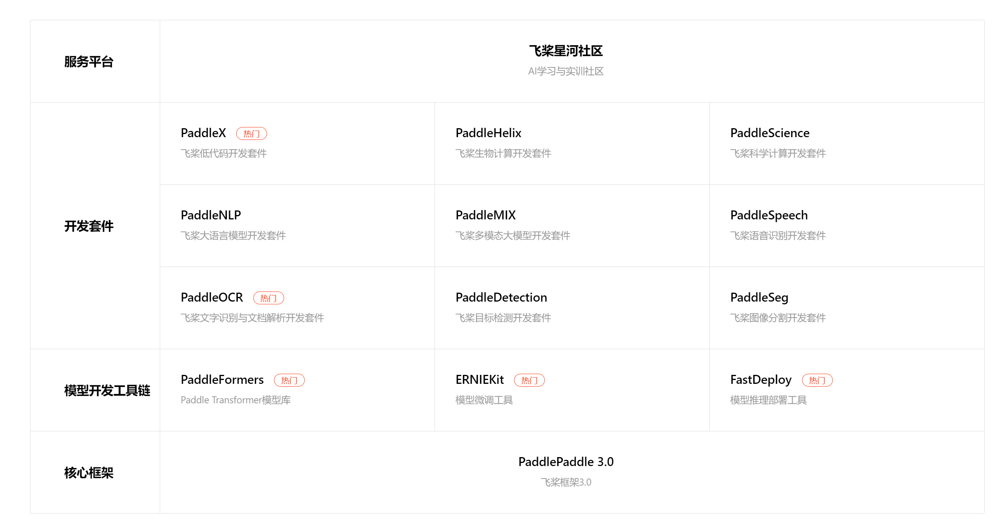

# 9.OCR

## 1.基础

OCR（光学字符识别，Optical Character Recognition）是一种将图像中的文字转换为可编辑文本的技术。
它广泛应用于文档数字化、信息提取和数据处理等领域。OCR 可以识别印刷文本、手写文本，甚至某些类型的字体和符号。
通用 OCR 产线用于解决文字识别任务，提取图片中的文字信息以文本形式输出。


OCR英文全称是Optical Character Recognition，中文叫做光学字符识别。目前主流开源的技术都是Python的，识别能力不高。
想要达到商业效果，需要使用商业的接口。
[文字识别（OCR）介绍与免费开源项目使用测评](https://zhuanlan.zhihu.com/p/658731447)

开源的本地OCR库
- PaddleOCR。PaddleOCR 是百度飞桨推出的开源 OCR 工具库，支持中英文、多语言文本检测与识别，效果很好，而且支持多种部署方式，并具有较高的准确性和速度。
- Tesseract。是一个开源的OCR引擎，支持多种语言的文字，其官方提供发说明文档也是英文的。提供了Java的本地库，Tess4j。
- cnocr。是一个基于PyTorch的开源OCR库，它提供了一系列功能强大的中文OCR模型和工具，可以用于图像中的文字检测、文字识别和文本方向检测等任务
- EasyOCR。是一个基于PyTorch的开源OCR库，可以进行多语言文本识别。
- mmocr。是一个开源的多模态OCR工具包，用于处理多模态（如图像、文本、语音等）的光学字符识别任务。

## 2.PaddleOCR

- 官网：[https://www.paddlepaddle.org.cn/](https://www.paddlepaddle.org.cn/)
- OCR源码：[https://github.com/PaddlePaddle/PaddleOCR](https://github.com/PaddlePaddle/PaddleOCR)
- OCR-V5使用教程：[https://www.paddleocr.ai/latest/version3.x/pipeline_usage/OCR.html](https://www.paddleocr.ai/latest/version3.x/pipeline_usage/OCR.html)

### 1.简介
Paddle是百度开源的深度开源框架，包括了ORC、NLP等多种常见工具。


PaddleOCR 将文档和图像转换为结构化、AI友好的数据（如JSON和Markdown），精度达到行业领先水平——为全球从独立开发者，初创企业和大型企业的AI应用提供强力支撑。
凭借50,000+星标和MinerU、RAGFlow、OmniParser等头部项目的深度集成，PaddleOCR已成为AI时代开发者构建智能文档等应用的首选解决方案。

PaddleOCR 3.0 核心能力
1. PP-OCRv5 — 全场景文字识别：单模型支持五种文字类型（简中、繁中、英文、日文及拼音），精度提升13个百分点。解决多语言混合文档的识别难题。
2. PP-StructureV3 — 复杂文档解析：将复杂PDF和文档图像智能转换为保留原始结构的Markdown文件和JSON文件，在公开评测中领先众多商业方案。完美保持文档版式和层次结构。
3. PP-ChatOCRv4 — 智能信息抽取：原生集成ERNIE 4.5，从海量文档中精准提取关键信息，精度较上一代提升15个百分点。让文档"听懂"您的问题并给出准确答案。

PaddleOCR 3.0除了提供优秀的模型库外，还提供好学易用的工具，覆盖模型训练、推理和服务化部署，方便开发者快速落地AI应用。

### 2.安装

```shell
1. 安装Paddle。分为CPU、GPU等多种型号，需要到官网首页查看下载命令
python -m pip install paddlepaddle==3.2.0 -i https://www.paddlepaddle.org.cn/packages/stable/cpu/

2. 安装PaddleOCR
python -m pip install paddleocr

也可以指定安装部分功能：
python -m pip install "paddleocr[all]"
doc-parser	文档解析，可用于提取文档中的表格、公式、印章、图片等版面元素，包含 PP-StructureV3 等模型方案
ie	信息抽取，可用于从文档中提取关键信息，如姓名、日期、地址、金额等，包含 PP-ChatOCRv4 等模型方案
trans	文档翻译，可用于将文档从一种语言翻译为另一种语言，包含 PP-DocTranslation 等模型方案
all	完整功能

3. 命令行方式推理
运行 PP-OCRv5 推理
paddleocr ocr -i https://paddle-model-ecology.bj.bcebos.com/paddlex/imgs/demo_image/general_ocr_002.png --use_doc_orientation_classify False --use_doc_unwarping False --use_textline_orientation False 

运行 PP-StructureV3 推理
paddleocr pp_structurev3 -i https://paddle-model-ecology.bj.bcebos.com/paddlex/imgs/demo_image/pp_structure_v3_demo.png --use_doc_orientation_classify False --use_doc_unwarping False

运行 PP-ChatOCRv4 推理前，需要先获得千帆API Key
paddleocr pp_chatocrv4_doc -i https://paddle-model-ecology.bj.bcebos.com/paddlex/imgs/demo_image/vehicle_certificate-1.png -k 驾驶室准乘人数 --qianfan_api_key your_api_key --use_doc_orientation_classify False --use_doc_unwarping False

4. 编程方式推理

from paddleocr import PaddleOCR

# 初始化 PaddleOCR 实例
ocr = PaddleOCR(
    use_doc_orientation_classify=False,
    use_doc_unwarping=False,
    use_textline_orientation=False,
    text_detection_model_name="PP-OCRv5_server_det",
    text_detection_model_dir="E:\\software\\paddlex\\official_models\\PP-OCRv5_server_det",
    text_recognition_model_name="PP-OCRv5_server_rec",
    text_recognition_model_dir="E:\\software\\paddlex\\official_models\\PP-OCRv5_server_rec",
    device="CPU",
    # ocr_version="PP-OCRv4" # 通过 ocr_version 参数来使用 PP-OCR 其他版本
    # lang="en"              # 通过 lang 参数来使用英文模型
)
result = ocr.predict("./img/a1.png")
for res in result:
    res.print()
    # 结果保存为图片
    res.save_to_img("output")
    # json数据保存到文件中
    res.save_to_json("output")
```

### 3.模块

模型在程序启动时会自动下载，但是可以到官网下载合适的模型（服务端模型、移动端模型等）。

paddleOCR模型包括5个模块，每个模块均可独立进行训练和推理，并包含多个模型
- 文档图像方向分类模块 （可选）
- 文本图像矫正模块 （可选）
- 文本行方向分类模块 （可选）
- 文本检测模块
- 文本识别模块

通过初始化PaddleOCR客户端的时候设置对应的模型即可。
```pthon
# 初始化 PaddleOCR 实例
ocr = PaddleOCR(
    text_detection_model_name="PP-OCRv5_server_det",
    text_detection_model_dir="E:\\software\\paddlex\\official_models\\PP-OCRv5_server_det",
    text_recognition_model_name="PP-OCRv5_server_rec",
    text_recognition_model_dir="E:\\software\\paddlex\\official_models\\PP-OCRv5_server_rec",
)
```

### 4.模型微调
可以利用自己拥有的特定领域或应用场景的数据对现有模型进行进一步的微调，以提升 通用OCR 产线的在您的场景中的识别效果。
目前支持上述提到的4个模块。

- 整图旋转矫正不准。文档图像方向分类模块。
- 文本行旋转矫正不准。文本行方向分类模块。
- 文本漏检。文本检测模块。
- 文本内容不准。文本识别模块。
- 图像扭曲矫正不准。文本图像矫正模块，暂不支持微调。

以文本检测模块为例：https://www.paddleocr.ai/main/version3.x/module_usage/text_detection.html#_5

```shell
1. 下载示例数据集[demo数据，可以自己调整为对应的格式]
wget https://paddle-model-ecology.bj.bcebos.com/paddlex/data/ocr_det_dataset_examples.tar
tar -xf ocr_det_dataset_examples.tar

2. 下载预训练模型(PP-OCRv5_server_det的预训练模型)
wget https://paddle-model-ecology.bj.bcebos.com/paddlex/official_pretrained_model/PP-OCRv5_server_det_pretrained.pdparams 

3. 模型训练
PaddleOCR 对代码进行了模块化，训练 PP-OCRv5_server_det 识别模型时需要使用 PP-OCRv5_server_det 的配置文件。

#单卡训练 (默认训练方式)
python3 tools/train.py -c configs/det/PP-OCRv5/PP-OCRv5_server_det.yml \
    -o Global.pretrained_model=./PP-OCRv5_server_det_pretrained.pdparams \
    Train.dataset.data_dir=./ocr_det_dataset_examples \
    Train.dataset.label_file_list='[./ocr_det_dataset_examples/train.txt]' \
    Eval.dataset.data_dir=./ocr_det_dataset_examples \
    Eval.dataset.label_file_list='[./ocr_det_dataset_examples/val.txt]'

#多卡训练，通过--gpus参数指定卡号
python3 -m paddle.distributed.launch --gpus '0,1,2,3' tools/train.py \
    -c configs/det/PP-OCRv5/PP-OCRv5_server_det.yml \
    -o Global.pretrained_model=./PP-OCRv5_server_det_pretrained.pdparams \
    Train.dataset.data_dir=./ocr_det_dataset_examples \
    Train.dataset.label_file_list='[./ocr_det_dataset_examples/train.txt]' \
    Eval.dataset.data_dir=./ocr_det_dataset_examples \
    Eval.dataset.label_file_list='[./ocr_det_dataset_examples/val.txt]'

4.模型评估
上述产生结果为：output/PP-OCRv5_server_det/best_accuracy.pdprams

# 注意将pretrained_model的路径设置为本地路径。若使用自行训练保存的模型，请注意修改路径和文件名为{path/to/weights}/{model_name}。
python3 tools/eval.py -c configs/det/PP-OCRv5/PP-OCRv5_server_det.yml \
    -o Global.pretrained_model=output/PP-OCRv5_server_det/best_accuracy.pdparams \
    Eval.dataset.data_dir=./ocr_det_dataset_examples \
    Eval.dataset.label_file_list='[./ocr_det_dataset_examples/val.txt]'
    
5. 模型导出
python3 tools/export_model.py -c configs/det/PP-OCRv5/PP-OCRv5_server_det.yml -o \
    Global.pretrained_model=output/PP-OCRv5_server_det/best_accuracy.pdparams \
    Global.save_inference_dir="./PP-OCRv5_server_det_infer/"
    
导出模型后，静态图模型会存放于当前目录的./PP-OCRv5_server_det_infer/中，在该目录下，您将看到如下文件：
./PP-OCRv5_server_det_infer/
├── inference.json
├── inference.pdiparams
├── inference.yml

6.使用
ocr = PaddleOCR(
    text_detection_model_name="PP-OCRv5_server_det_infer",
    text_detection_model_dir="E:\\software\\paddlex\\official_models\\PP-OCRv5_server_det_infer",
)
```


### 5.优化

#### 5.1.文本检测模型优化【限制图片尺寸】
通过参数limit_type和limit_side_len来对图片的尺寸进行限制。
1. limit_type可选参数为[max, min]
2. limit_side_len 为正整数，一般设置为 32 的倍数，比如 960。

注意事项：
- 如果输入图形分辨率不大，建议使用limit_type=min 和 limit_side_len=960 节省计算资源的同时能获得最佳检测效果。
- 如果输入图片的分辨率比较大，而且想使用更大的分辨率预测，可以设置 limit_side_len 为想要的值，比如 1216。

```python
from paddleocr import TextDetection

model = TextDetection(
    model_name="PP-OCRv5_server_det",
    model_dir="E:\\software\\paddlex\\official_models\\PP-OCRv5_server_det",
    limit_type="min",
    limit_side_len=960

)
output = model.predict("./img/general_ocr_001.png", batch_size=1)
for res in output:
    res.print()
    res.save_to_img(save_path="./output/")
    res.save_to_json(save_path="./output/res.json")
```

## 3.tess4j

官网：[https://tesseract-ocr.github.io/](https://tesseract-ocr.github.io/)

Tesseract OCR（光学字符识别）是一个开源的OCR引擎，最初由HP实验室开发，并在2005年开源，之后由Google赞助并继续开发。
它是目前最准确、最流行的开源OCR工具之一。

Tess4J是一个Java库，它是Tesseract OCR引擎的Java封装器。
Tess4J允许Java开发者轻松地将Tesseract OCR的功能集成到他们的Java应用程序中。
通过Tess4J，Java程序可以调用Tesseract来执行光学字符识别（OCR）任务，即将图像中的文字转换为可编辑和可搜索的文本格式。

Tess4j的特点：
- 易于集成：Tess4J提供了简单的API，使得在Java应用程序中使用Tesseract变得非常容易。
- 跨平台：Tess4J可以在任何支持Java的操作系统上运行，包括Windows、macOS和Linux。
- 功能丰富：Tess4J支持Tesseract的所有主要功能，包括多语言识别、自定义训练等。
- 社区支持：作为一个开源项目，Tess4J拥有一个活跃的社区，提供支持和更新。

字体库下载：[https://github.com/tesseract-ocr/tessdata](https://github.com/tesseract-ocr/tessdata)

例如：中文字体库 chi_sim.traineddata，英文字体库 eng.traineddata

使用
```java
<dependency>
    <groupId>net.sourceforge.tess4j</groupId>
    <artifactId>tess4j</artifactId>
    <version>4.1.1</version>
</dependency>

public static void main(String[] args) {
    try {
        File imageFile = new File("E:\\a.png");
        Tesseract tesseract = new Tesseract();
        tesseract.setDatapath("E:\\software\\tess4j"); // 数据集。
        tesseract.setLanguage("chi_sim"); // 支持中文
        String text = tesseract.doOCR(imageFile);
        System.out.println(text);
    } catch (Exception e) {
        e.printStackTrace();
    }
}
```

## 4.Chandra OCR 2

- 官网：[https://www.datalab.to/](https://www.datalab.to/)
- 开源：[https://github.com/datalab-to/chandra](https://github.com/datalab-to/chandra)


免费开源使用，适合：处理扫描论文、跨语言文档，或者公司里堆着一堆格式乱七八糟的 PDF，这个项目确实值得装下来试试。