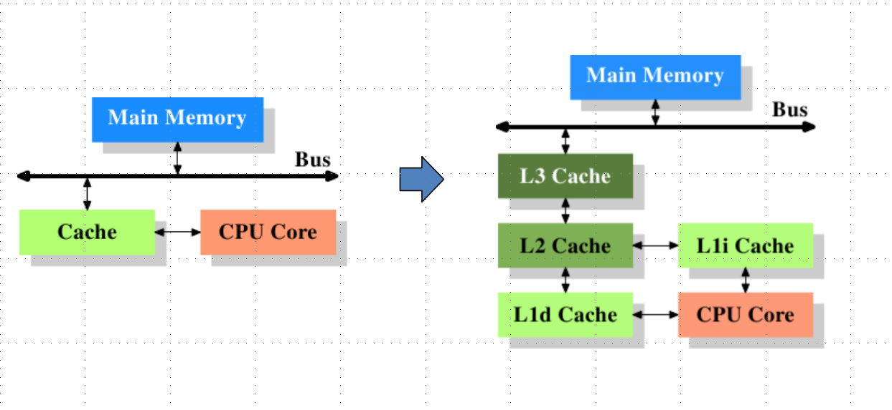
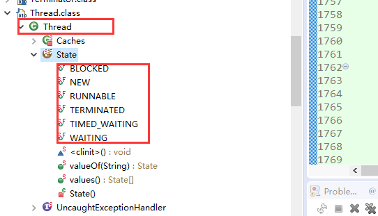
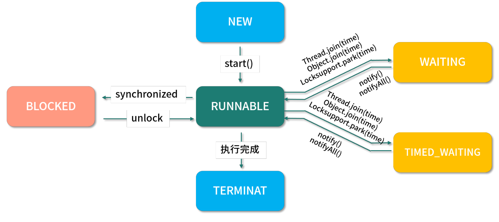
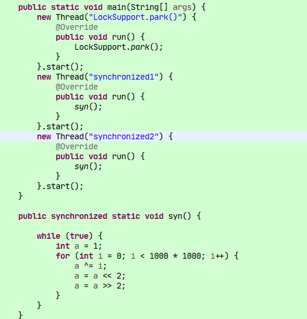
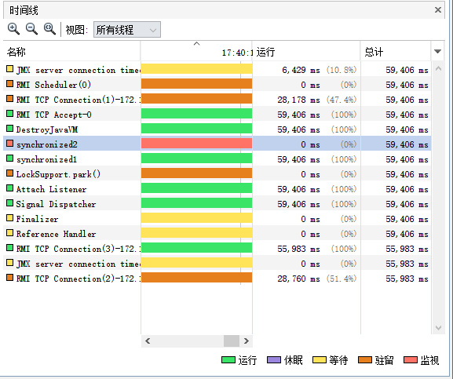

# 1.线程基础

[多线程学习笔记【推荐】](https://www.kancloud.cn/luoyoub/java-thread)

## 1.多线程基本概念

### 1.1.并发

指的是多个线程。如果程序可以使用的机器是单核处理器，那多个线程会在一个处理器上交替进行执行。
如果是多核处理器，那么多个线程可能被分配到不同的处理器上进行执行。
当出现并发问题的时候，我们是指多线程处理相同的资源，线程安全、合理使用资源等。

### 1.2.高并发

high concurrency,是互联网分布式系统架构设计中必须考虑的因素之一，通常指的是，系统能够同时并行处理很多请求。 
高并发出现的问题是，同时处理大量的请求，导致系统响应速度降低服务器宕机，oom等，需要提供系统性能

### 1.3.上下文切换

多线程并不一定是要在多核处理器才支持的，就算是单核也是可以支持多线程的。
CPU 通过给每个线程分配一定的时间片，由于时间非常短通常是几十毫秒，所以 CPU 可以不停的切换线程执行任务从而达到了多线程的效果。

但是由于在线程切换的时候需要保存本次执行的信息，在该线程被 CPU剥夺时间片后又再次运行恢复上次所保存的信息的过程就称为上下文切换。
根据现有的经验来看：上下文切换是明显影响效率（如果计算机的CPU核心数量多的话，上下文切换的次数会明显降低）。

通常有以下解决方案:

- 合理的创建线程，避免创建了一些线程但其中大部分都是处于 waiting 状态，因为每当从 waiting 状态切换到 running 状态都是一次上下文切换。
- 采用无锁编程，比如将数据按照 Hash进行取模分段，每个线程处理各自分段的数据，从而避免使用锁。
- 采用 CAS(compare and swap) 算法，如 Atomic 包就是采用 CAS 算法。

### 1.4.死锁

死锁的场景一般是：线程A和线程B都在互相等待对方释放锁，或者是其中某个线程在释放锁的时候出现异常如死循环之类的。这时就会导致系统不可用。

常用的解决方案如下：
- 尽量一个线程只获取一个锁。
- 一个线程只占用一个资源。
- 尝试使用定时锁，至少能保证锁最终会被释放。

### 1.5.共享资源

我们定义的共享变量保存在主内存中。

当其他线程访问这个共享变量的时候，JMM会将共享变量的副本交给线程，保存副本到线程自己的线程内存中。
可能出现主内存的值被修改了，但是线程内存内部的副本值不是最新的，导致数据的不一致。所以这个共享资源最好设置为Atomic包下的原子性的类。
比如AtomicInteger，底层使用CAS算法，每次修改变量的时候都会去主内存同步最新的内容。


## 2.cpu多级缓存



[三级缓存](/article/16.Linux/1.Linux理论)

## 3.Java内存模型(JMM)


[Java内存模型(JMM)](/article/1.Java基础/1.JVM/2.JVM内存模型)

Heap是堆，主要存放的是对象，涉及到GC。

stack是栈，主要存放动态生成的变量引用。而在JVM中规定调用栈必须保存在线程栈上(调用栈就是pojo创建的对象，局部变量等等)

如图中，object3同时被两个线程调用，这个时候两个线程都保存的是这个对象的一个私有的对象副本。


## 4.创建线程

生产环境的代码中，不要自己去创建线程，会出现很多不良的问题，必须依靠线程池。

- 继承Thread类
- 实现Runnable接口
- 实现Callable接口

## 5.线程的生命周期/状态

这6种状态被明确地定义在Thread类的一个内部枚举类Thread.State

Thread类中有一个方法：getState，返回的就是这里定义的状态




- NEW (新建) 一个尚未启动的线程处于这一状态。(A thread that has not  yet started is in this state.)
- RUNNABLE (可运行) 一个正在 Java 虚拟机中执行的线程处于这一状态。(A thread executing in the Java virtual machine is in this state.)
- BLOCKED (阻塞) 一个正在阻塞等待一个监视器锁的线程处于这一状态。(A thread that is blocked waiting for a monitor lock is in this state.)
- WAITING (等待) 一个正在无限期等待另一个线程执行一个特别的动作的线程处于这一状态。(A thread that is waiting 
  indefinitely for another thread to perform a particular action is in this state.)
- TIMED_WAITING (计时等待) 一个正在限时等待另一个线程执行一个动作的线程处于这一状态。(A thread that is waiting 
  for another thread to perform an action for up to a specified waiting time is in this state.)
- TERMINATED (终止) 一个已经退出的线程处于这一状态。(A thread that has exited is in this state.)



只有使用synchronized后才会出现blocked，使用其他的话线程的状态是wait或time_wait，不是blocked。



我们看监控可以看到synchronized1获得同步锁，状态是运行synchronized2没有获得同步锁，状态是监听锁的状态，趁机获得锁

LockSupport.park()是驻留



## 6.控制线程

### 6.1.join线程

一个线程如果调用了join方法，则这个线程的优先级被提高了。如main方法中的开启线程并调用join方法， 
则必须等这个线程执行完之后，main方法才开始向下执行。 join()等待被join的线程执行完
join(long millis)等待这个线程的最长时间是millis秒。

### 6.2.后台线程又称为守护线程或精灵线程

```java
Thread t = new Thread();//1.创建一个线程
t.setDaemon(true);//2.将这个线程设置为后台线程
t.start();//3.启动这个线程
```

注意：2和3步骤不能改变。

后台线程是等到前台的线程死亡后，后台线程会自动死亡，但是会有一些延时。

### 6.3.sleep线程

让一个线程进入睡眠，也就是阻塞状态。这个线程会等待唤醒通知或阻塞指定的时间后进入就绪状态

我们一般的写法是： Thread.sleep(3000L)，表示当前线程休眠3秒钟（不推荐这样写）。

推荐使用TimeUnit类提供的方法：TimeUnit.SECONDS.sleep(3);

Sleep和wait的区别是：
1.  sleep后线程的状态是time_wait, wait后状态是wait
2.  wait操作会释放锁，所以必须在synchronized内部使用

park() 、 unpark() 与 wait()、notify()区别：[https://blog.csdn.net/h363659487/article/details/80226541](https://blog.csdn.net/h363659487/article/details/80226541)

线程挂起与恢复：[https://blog.csdn.net/zhandoushi1982/article/details/5506597](https://blog.csdn.net/zhandoushi1982/article/details/5506597)

### 6.4.线程中断

interrupt(),interrupted() 和 isInterrupted() 的区别
[https://www.jianshu.com/p/a587190e885c](https://www.jianshu.com/p/a587190e885c)

### 6.5.线程让步yield

并不是100%的有效，只是减低的本线程占用系统资源的机会。yield()给其他线程让步。

### 6.6.设置优先级

(并不是100%的有效，只是减低的本线程占用系统资源的机会)
```java
Thread t = new Thread();//1.创建一个线程
t.setPriority(Thread.MAX_PRIORITY);//最高优先级10
t.setPriority(Thread.MIN_PRIORITY);//最低优先级1
t.setPriority(Thread.NORM_PRIORITY);//普通优先级5
```

### 6.7.线程隔离

线程池看似很美好，但也会带来一些问题。如果我们很多业务都依赖于同一个线程池,当其中一个业务因为各种不可控的原因消耗了所有的线程，
导致线程池全部占满。这样其他的业务也就不能正常运转了，这对系统的打击是巨大的。比如我们 Tomcat 接受请求的线程池，
假设其中一些响应特别慢，线程资源得不到回收释放；线程池慢慢被占满，最坏的情况就是整个应用都不能提供服务。

所以我们需要将线程池进行隔离。

通常的做法是按照业务进行划分：

比如下单的任务用一个线程池，获取数据的任务用另一个线程池。这样即使其中一个出现问题把线程池耗尽，那也不会影响其他的任务运行。

本质就是多个线程池。不要公用一个线程池。

常用的方案： 1. hystrix。 2.ThreadLocal

## 7.并发编程最佳实践

背景：我们Java的定位，其实就是各种中间件之间的中间层。帮助用户与底层数据（数据存储）进行交互。
**所以大部分的Java系统，都是io密集型的。我们处理高并发场景时，应该从如何减少io方面处理**

1. 使用本地变量。尽可能的将需要使用到的变量封装到对象中，节省内存空间，降低多线程并发问题
2. 使用不可变类。
3. 最小化锁的作用域范围。无论是分布式锁还是本地同步锁
4. 使用线程池的Executor,而不是new Thread创建线程
5. 宁可使用synchronize也不要使用wait和notify
6. 使用BlockQueue实现生产和消费模式
7. 使用并发集合而不是使用加了锁的同步集合
8. 使用Semaphore创建有界的访问
9. 宁可使用同步代码块，也不要使用同步方法
10. 避免使用静态变量（静态变量尽可能使用final修饰或创建不可变集合）
11. http优化。使用链接池，条件允许的话使用http2
12. 使用NIO，IO多路复用、零拷贝技术。

高并发系统设计思路：
1. 页面静态化、文件服务器、动静分离这类：包括CDN加速，解决静态文件的并发读
2. 负载均衡、反向代理： SLB，CDN域名解析(就近原则与LB)，分而治之，降低服务压力
3. 数据缓存：使用redis、本地缓存。降低数据库压力，提高系统QPS（缓存也可以分片，将一个缓存拆分为多个，分摊并发压力）
4. 优化SQL：慢语句优化，SQL拆分，数据库分开分表(分而治之，降低数据库压力)
5. 池化技术：比如数据库连接池，Redis连接池，httpClint池化，线程池。
6. 多线程并发操作。使用FutureTask或者CountDownLatch实现并行处理
7. 乐观锁。适用于读大于写的场景

处理高并发总结为三大金刚：
1. 缓存：减少io，提高QPS
2. 异步：通常使用队列（本地或者MQ）削峰填谷。
3. 降级：包括限流（流量整形）；失败重试（根据接口的TP99\TP90,设置合理的超时时间，避免连接被长期占用，然后快速失败后即可重试）


