# 2.线程安全

## 1.线程安全

想要实现线程安全，需要同时满足 原子性、可见性、有序性 三个特性，缺一不可。

### 1.1.原子性

定义：多线程之中同时只有一个线程能够访问。程序的原子性就和数据库事务的原子性差不多，一个操作中要么全部执行成功或者失败。

JMM 只是保证了基本的原子性，但类似于 i++ 之类的操作，看似是原子操作，其实里面涉及到三个步骤:
- 获取 i 的值。比如 int a = i
- 自增。 比如 int b = a + 1
- 再赋值给 i。 比如 i = b

这三步操作，所以想要实现 i++ 这样的原子操作就需要用到 synchronized 或者是 lock 进行加锁处理。

如果是基础类的自增操作可以使用 AtomicInteger 这样的原子类来实现(其本质是利用了 CPU 级别的 的 CAS 指令来完成的)。

### 1.2.可见性

定义：一个线程修改了主内存中的数据，其他的线程也可以观察到

现代计算机中，由于 CPU 直接从主内存中读取数据的效率不高，所以都会对应的 CPU高速缓存，先将主内存中的数据读取到缓存中，
线程修改数据之后首先更新到缓存，之后才会更新到主内存。如果此时还没有将数据更新到主内存其他的线程此时来读取就是修改之前的数据。

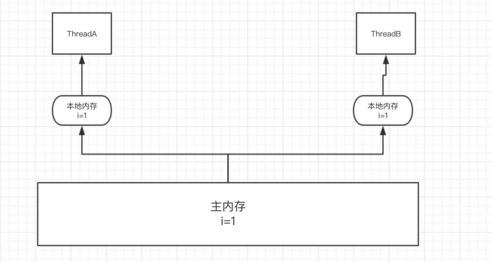

volatile 关键字就是用于保证内存可见性，当线程A更新了 volatile 修饰的变量时，它会立即刷新到主线程，
并且将其余缓存中该变量的值清空，导致其余线程只能去主内存读取最新值。

使用 volatile 关键词修饰的变量每次读取都会得到最新的数据，不管哪个线程对这个变量的修改都会立即刷新到主内存。

synchronized也能能保证可见性，实现原理就是在释放锁之前其余线程是访问不到这个共享变量的。但是和volatile 相比开销较大。

导致共享变量在线程之间不可见的原因：
- 线程交叉执行
- 重新排序后线程交叉执行
- 共享变量更新后的值没有在工作内存与主内存之间及时更新

### 1.3.有序性

以下这段代码:

- int a = 100 ; //1
- int b = 200 ; //2
- int c = a + b ; //3

正常情况下的执行顺序应该是 1>>2>>3。但是有时 JVM 为了提高整体的效率会进行指令重排导致执行的顺序可能是 2>>1>>3。
但是 JVM 也不能是什么都进行重排，是在保证最终结果和代码顺序执行结果一致的情况下才可能进行重排。

重排在单线程中不会出现问题，但在多线程中会出现数据不一致的问题。

Java 中可以使用 volatile 来保证顺序性和可见性，synchronized 和 lock 也可以来保证有序性，和保证原子性的方式一样，
通过同一段时间只能一个线程访问来实现的（仅仅保证了有序性，无法做到数据安全）。

除了通过 volatile 关键字显式的保证顺序之外， JVM 还通过 happen-before 原则来隐式的保证顺序性。

其中有一条就是适用于 volatile 关键字的，针对于 volatile 关键字的写操作肯定是在读操作之前，也就是说读取的值肯定是最新的。

#### 2.3.1.Happends-before原则

如果JVM发现多线程不符合happens-before 8大原则，JVM会对指令进行重排序。


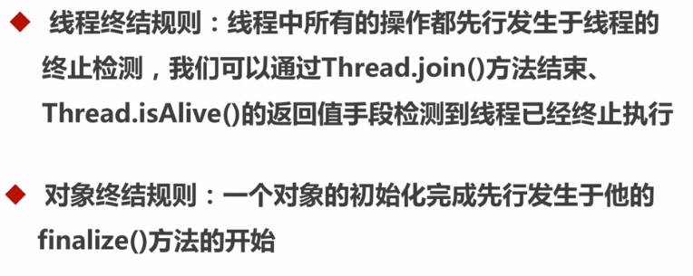

### 1.4.线程安全方案
因为锁涉及到与内核的交互，所以目前没有第三方框架提供锁的功能。目前只能使用jdk提供的。

- synchronized，同时实现三个特性
- volatile，实现了可见性和有序性  
- lock。只能实现了原子性。可见性和有序性需要使用volatile
- CAS。无锁的乐观锁方案，可见性和有序性需要使用volatile

## 2.解决方案

### 2.1.同步集合
我们经常使用的ArrayList,LinkedList,HashSet,TreeSet,HashMap,TreeMap都是不能使用在并发场景。所以就有了同步集合

JDK早期提供的Vector,Stack,HashTable都是使用synchronized修饰的，一旦加锁整个对象都会上锁，所以性能不好，不推荐使用。

Collections内部定义了若干集合的实现类，调用方法后，是重新生成一个集合保存数据，并且这些实现类也是使用synchronized修饰过的，所以性能也不会是很多。

```java
//普通集合 包装为 同步集合
Collections.synchronizedCollection()//将指定的集合包装为线程安全的

Collections.synchronizedList(list)//将list包装为线程安全的

Collections.synchronizedMap(m)

Collections.synchronizedSet(s)

Collections.synchronizedSortedSet(s)

Collections.synchronizedSortedMap(m)
```
### 2.2.并发集合

JUC指的是java.util.concurrent，jdk提供了大量操作简单，并发性能高的并发工具集。

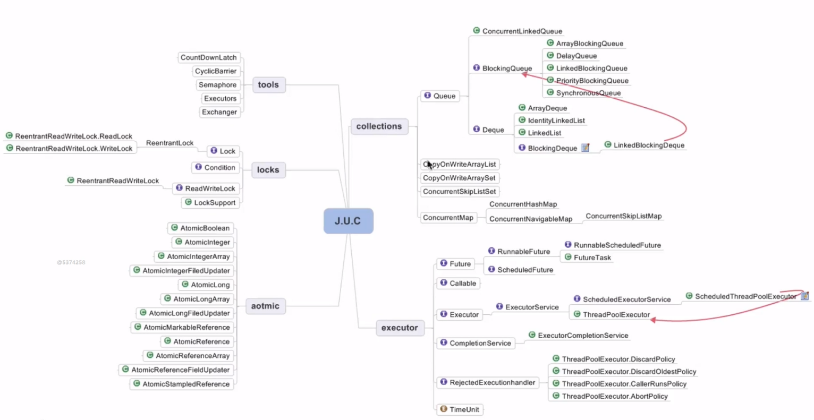

- lock：aqs、Lock、Condition、ReadWriteLock、LockSupport。juc下最核心的就是lock下面的AQS
- 并发集合：ConcurrentMap、CopyOnWrite、Queue
- executor：线程池、Future
- atomic：原子类。一种已经实现好的原子性对象。直接使用即可
- tools：CountDownLatch、CyclicBarrier、Semaphore

## 3.Synchronized

### 3.1.基础
如何使用：
1. 修饰代码块：大括号括起来的代码，作用于调用的对象
2. 修改普通方法，作用于整个对象
3. 修饰静态方法：作用于这个类
4. 修饰类：整个类。作用于这个类的所有对象

历代优化：
- JDK1.6之前，只有 Monitor 一种实现方式，被称之为重量锁
- JDK1.6之后，对 synchronized 进行了各种优化，为了能减少获取和释放锁带来的消耗引入了偏向锁和轻量锁。

### 3.2.线程安全

synchronized 底层通过JVM来实现。同时实现原子性、可见性、有序性。

JVM 是使用 monitor.enter 和 monitor.exit 2个指令实现的。

- 原子性：monitor.enter(上锁)、 monitor.exit(解锁)
- 可见性：
  - monitor.enter指令实现了Load屏障，每次读取数据的时候被强制从主内存读取最新的数据。
  - monitor.exit指令实现了Store屏障，如果数据有变更的，强制刷新回主内存。
- 有序性：4条禁止重排序的内存屏障分别
  - StoreStore屏障：禁止StoreStore屏障的前后Store写操作重排
  - LoadLoad屏障：禁止LoadLoad屏障的前后Load读操作进行重排
  - LoadStore屏障：禁止LoadStore屏障的前面Load读操作跟LoadStore屏障后面的Store写操作重排
  - StoreLoad屏障：禁止LoadStore屏障前面的Store写操作跟后面的Load/Store 读写操作重排

monitor.enter、monitor.exit 这两条指令其实就相当于复合指令，既具有加锁、释放锁的功能，同时也具有内存屏障的功能。

### 3.3.实现原理

[https://blog.csdn.net/qq_33173608/article/details/88202365](https://blog.csdn.net/qq_33173608/article/details/88202365)

[https://blog.csdn.net/super_x_man/article/details/81741073](https://blog.csdn.net/super_x_man/article/details/81741073)

[https://blog.csdn.net/tongdanping/article/details/79647337](https://blog.csdn.net/tongdanping/article/details/79647337)

synchronized的实现原理（从源码层面研究）：[https://blog.csdn.net/qq_36520235/article/details/81176536](https://blog.csdn.net/qq_36520235/article/details/81176536)

#### 3.3.1.代码分析

JVM编译之后，在同步对象 前加入一个 monitor.enter 指令，在退出方法和异常处插入 monitor.exit的指令。

现有一个类，编译后执行命令：javap -c Synchronize
```java
public class Synchronize {
    public static void main(String[] args) {
        synchronized (Synchronize.class){
            System.out.println("Synchronize");
        }
    }
}
```

下面是分析结果
```shell
D:\workspace-openSource\knowledge\target\classes\com\crossoverjie\demo2_synchronize>javap -c Synchronize
警警告告: 二二进进制制文文件件Synchronize包包含含com.crossoverjie.demo2_synchronize.Synchronize
Compiled from "Synchronize.java"
public class com.crossoverjie.demo2_synchronize.Synchronize {
  public com.crossoverjie.demo2_synchronize.Synchronize();
    Code:
       0: aload_0
       1: invokespecial #8                  // Method java/lang/Object."<init>":()V
       4: return

  public static void main(java.lang.String[]);
    Code:
       0: ldc           #1                  // class com/crossoverjie/demo2_synchronize/Synchronize
       2: dup
       3: astore_1
       4: monitorenter  // begin -> 程序在使用synchronize关键字的时候开启监听
       5: getstatic     #16                 // Field java/lang/System.out:Ljava/io/PrintStream;
       8: ldc           #22                 // String Synchronize
      10: invokevirtual #24                 // Method java/io/PrintStream.println:(Ljava/lang/String;)V
      13: aload_1
      14: monitorexit   // end <- 程序在离开synchronize的锁的时候关闭监听
      15: goto          21
      18: aload_1
      19: monitorexit
      20: athrow
      21: return
    Exception table:
       from    to  target type
           5    15    18   any
          18    20    18   any
}
```

#### 3.3.2.monitor
Object类的对象维护一个monitor，而所有的类都是Object的子类，所有所有对象都有monitor。
在Hotspot中，对象的监视器（monitor）锁对象由ObjectMonitor对象实现（C++）
```java
ObjectMonitor() {
  _count        = 0; //用来记录该对象被线程获取锁的次数
  _waiters      = 0;
  _recursions   = 0; //锁的重入次数。
  _owner        = NULL; //指向持有ObjectMonitor对象的线程 
  _WaitSet      = NULL; //处于wait状态的线程，会被加入到_WaitSet
  _WaitSetLock  = 0 ;
  _EntryList    = NULL ; //处于等待锁block状态的线程，会被加入到该列表
}
```

【重量锁】流程图如下:

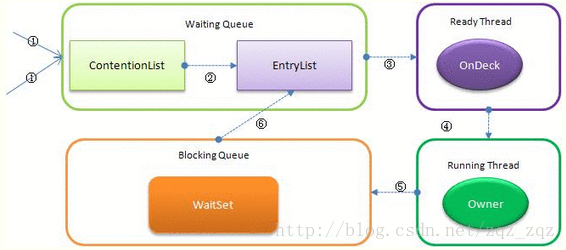
- Contention List：竞争队列，所有请求锁的线程首先被放在这个竞争队列中；
- Entry List：Contention List中那些有资格成为候选资源的线程被移动到Entry List中；
- Wait Set：哪些调用wait方法被阻塞的线程被放置在这里；
- OnDeck：任意时刻，最多只有一个线程正在竞争锁资源，该线程被成为OnDeck；
- Owner：当前已经获取到所资源的线程被称为Owner；

#### 3.3.3.非公平锁

Synchronized是非公平锁。 
1. Synchronized在线程进入ContentionList之前，线程会先尝试自旋获取锁，如果获取不到就进入ContentionList。
2. 自旋获取锁的线程还可能直接抢占OnDeck线程的锁资源。

### 3.4.底层实现原理

能修饰对象，类，方法，方法中的代码块。所有的对象都有markWord，都能加锁

上面我们知道了，object header 包括一个markWord有64位，8个byte，synchronized 各个阶段都与markWord有关。

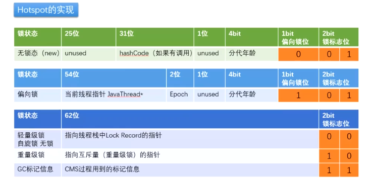

markWord在对象处于锁的不同的阶段，保存的值，有些不同

#### 3.4.1.无锁态

- 锁标志位： 2 bit
- 偏向锁位： 1 bit
- 分代年龄： 4 bit, 注意：4bit，就是1字节，值的范围0~15。所有设置对象最大age的时候，只能设置到15。
  且cms最大age是6，不设置cms的时候是15最大。网上说有31的，哈哈，假的
- HashCode: 31 bit。调用hashCode后，字段为markWord填充31位hashCode值
- Unused:25为没有使用，空白区域

#### 3.4.2.偏向锁

偏向锁的特征是:锁不存在多线程竞争，并且应由一个线程多次获得锁。为了进一步的降低获取锁的代价，JDK1.6 之后还引入了偏向锁。

- 上锁：在没有任何并发的场景，当线程访问同步块时，会使用 CAS 将线程指针更新到锁对象的 MarkWord 中，
  如果更新成功则获得偏向锁，并且之后每次进入这个对象锁相关的同步块时都不需要再次获取锁了，从而提供性能。

- 解锁：当有另外一个线程获取这个锁时，持有偏向锁的线程就会释放锁，释放时会等待全局安全点(这一时刻没有字节码运行)，
  接着会暂停拥有偏向锁的线程，根据锁对象目前是否被锁来判定将对象头中的 MarkWord 设置为无锁或者是轻量锁状态。

偏向锁可以提高带有同步却没有竞争的程序性能，但如果程序中大多数锁都存在竞争时，那偏向锁就起不到太大作用。
并且MarkWord的内容结构非常特殊，修改时有性能损耗。可以使用 -XX:-userBiasedLocking=false 来关闭偏向锁，并默认进入轻量锁。

#### 3.4.3.轻量锁

- 上锁：当代码进入同步块时，如果同步对象为无锁状态时，当前线程会在栈帧中创建一个锁记录(Lock Record)区域，
  同时将锁对象的对象头中 MarkWord 拷贝到锁记录中，再尝试使用 CAS 将 MarkWord 更新为指向锁记录的指针。
  （其实就是当前对象无锁，比如状态为0，JVM就会用CAS将“原值=0, 新值=1”写入主内存中，修改对象的锁状态）。
  - 如果更新成功，当前线程就获得了锁。
  - 如果更新失败 JVM 会先检查锁对象的 MarkWord 是否指向当前线程的锁记录。
  - 如果是则说明当前线程拥有锁对象的锁，可以直接进入同步块。
  - 不是则说明有其他线程抢占了锁，开始自旋继续修改
  - 直到自旋的次数达到阈值（次数是jvm自动判断的），或者并发线程数大于CPU核数的一般，就升级到重量锁

- 解锁：轻量锁的解锁过程也是利用 CAS 来实现的，会尝试锁记录替换回锁对象的 MarkWord。
  如果替换成功则说明整个同步操作完成，失败则说明有其他线程尝试获取锁，这时就会唤醒被挂起的线程(此时已经膨胀为重量锁)

1. 轻量锁能提升性能的原因是：

认为大多数锁在整个同步周期都不存在竞争，所以使用 CAS 比使用互斥开销更少。
但如果锁竞争激烈，轻量锁就不但有互斥的开销，还有 CAS 的开销，甚至比重量锁更慢。

2. 适应性自旋:

在使用 CAS 时，如果操作失败，CAS 会自旋再次尝试。由于自旋是需要消耗 CPU 资源的，所以如果长期自旋就白白浪费了CPU。
JDK1.6加入了适应性自旋:如果某个锁自旋很少成功获得，那么下一次就会减少自旋。这里主要讲的是Synchronized有适应性自旋。

#### 3.4.4.重量锁

思考：既然有了轻量锁，为什么还要有重量级锁？

因为轻量锁，使用自旋的方式，并发多了，消费CPU资源大。效率高，但费资源，非公平

重量级是调用计算机底层实现的，重量级中存在队列。会将竞争关系的线程阻塞排队。但也是非公平的

#### 3.4.5.锁升级

- 偏向锁：只有一个线程使用时为偏向锁。当第二个线程来使用锁的时候，如果第一个线程还占用锁，则第二个线程开始cas自旋抢占锁，
  锁就会升级为轻量锁。如果第一个线程已经不再使用锁了，不发生并发竞争，则偏向锁指向第二个线程。
  这个过程性能较差，所有我们一般选择关闭偏向锁。
- 轻量锁：特点是多个线程之间以cas自旋的方式抢占锁，这属于忙轮询，占用CPU资源。所有才有了适应性自旋。
  到达自旋阈值后，jvm会将所有抢占这个锁的线程阻塞，这时锁就升级为重量锁了。

#### 3.4.6.锁降级

对这个对象发生GC进行回收的时候，会是否锁。主要是为了回收相关的资源。

网上有很多人说，锁时无法降级的。这是个错误的。

因为重量锁在并发降低后，会降低到轻量锁。但是偏向锁结构特殊，降低到偏向锁的性能差，所有不会继续降低。
而且生产环境，一般会选择全部偏向锁

#### 3.4.7.锁消除

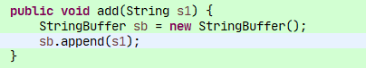

当synchronized的对象，被用作局部变量，线程私有的，所有sb不是共享的内存对象，这样jvm会消除对象内部的锁

#### 3.4.8.锁粗化

大部分情况下我们是要让锁的粒度最小化，锁的粗化则是要增大锁的粒度; 在以下场景下需要粗化锁的粒度：

假如有一个循环，循环内的操作需要加锁，我们应该把锁放到循环外面，否则每次进出循环，都进出一次临界区，效率是非常差的；

## 4.volitale

volitale 跟cpu的交互，指令重排序的意义，半初始化对象的异常

上面的问题，我们已经知道创建对象的过程至少包含5条汇编指令，现在计算机是多核心，所有计算机为了提高程序的执行效率，会将指令分配到多个CPU去执行，这就是指令重排序。

指令重排序，带来一个问题，对象创建好引用关联的时候，对象还没有初始化完成。在单线程中是没有问题的，因为需要等待return才能往下执行。
但是在多线程中，如果有线程判断对象不是null了，可以就出现异常。这是在单例模式的DCL中使用volitale的原因之一，禁止指令重排序，确保不会拿到半初始化状态的对象。

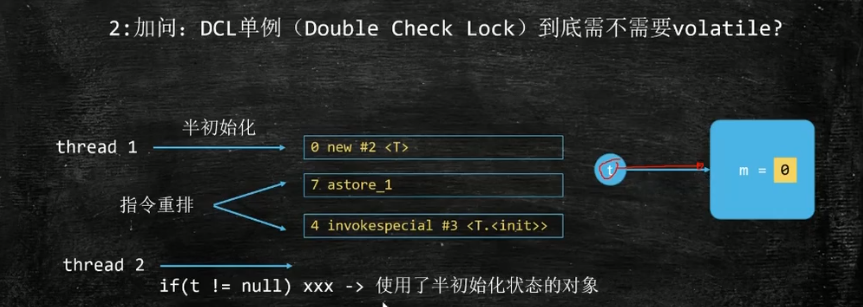

指令重排序：是使用内存屏障实现的。

可见性： 能让多CPU之间保持加载最新的值。可见性是依靠MESI Cache 缓存一致性协议实现的。

保证多核CPU中，如果valitale的值发生变化了，会修改缓存的状态，使用主动从主内存中获取数据。


### 4.1.volatile可见性

通过加入内存屏障和禁止指令重排序优化来实现的。是操作CPU指令集的方式实现的。

- 对volatile 修饰的变量进行写操作的时候，会在写操作完成后加入一条store的屏障指令，将工作内存中的共享变量刷新到主内存中。

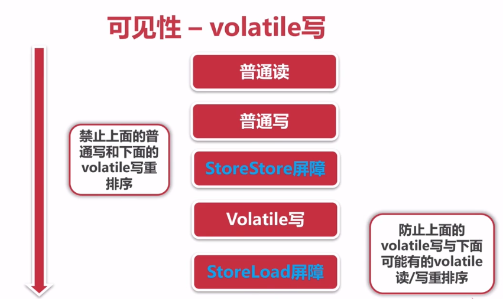

- 对volatile 修饰的变量进行读操作的时候，会在写操作完成前加入一条load的屏障指令，将主内存中的最新的共享变量读取到工作内存中。

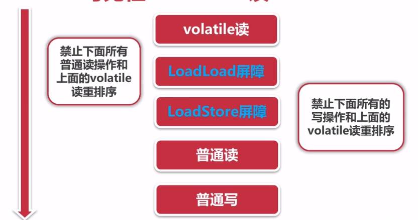


- 可见性：
  - Load屏障，每次读取数据的时候被强制从主内存读取最新的数据。
  - Store屏障，如果数据有变更的，强制刷新回主内存。
- 有序性：4条禁止重排序的内存屏障分别
  - StoreStore屏障：禁止StoreStore屏障的前后Store写操作重排
  - LoadLoad屏障：禁止LoadLoad屏障的前后Load读操作进行重排
  - LoadStore屏障：禁止LoadStore屏障的前面Load读操作跟LoadStore屏障后面的Store写操作重排
  - StoreLoad屏障：禁止LoadStore屏障前面的Store写操作跟后面的Load/Store 读写操作重排


### 4.2.Volatile使用场景

volatile能保证读取到的是最新的，到时却不能保证数据的线程安全。

volatile 适用于状态标记量

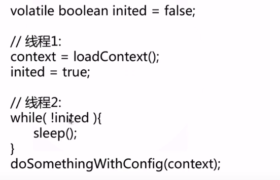

#### 4.3.4.【玩吧】Volatile修饰数组与引用类型能保证可见性吗？

[https://www.zhihu.com/question/264624410](https://www.zhihu.com/question/264624410)

比如：在concurrentHashMap中table虽然使用了volatile修饰，但其实是不能保证可见性的。所有在put/get的时候，使用的是unsafe的volatile方法操作的。

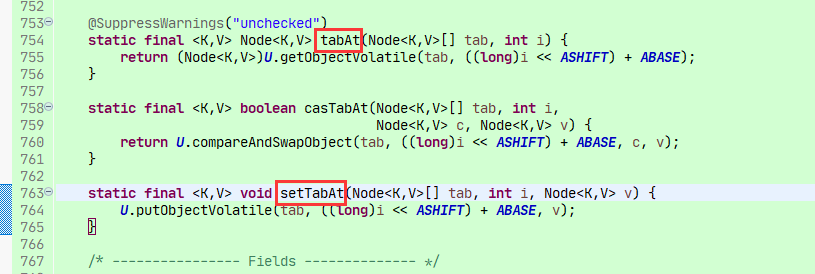


## 5.CAS

### 5.1.基础

CAS(Compare and swap)比较与交换算法，是jdk在1.5是提供的一类并发问题处理方案，核心实现方法在unsafe类下，我们可以使用jdk提供的现成方案atomic包下的各个并发工具。

设计思维：三个参数，一个当前内存的值V、旧的预期值A、即将更新的值B，当且仅当预期值A和内存值V相同时，将内存值修改为B并返回true，否则什么都不做，并返回false。

CAS是项乐观锁技术，当多个线程尝试使用CAS同时更新同一个变量时，只有其中一个线程能更新变量的值，而其它线程都失败，
失败的线程并不会被挂起，而是被告知这次竞争中失败，并可以再次尝试。

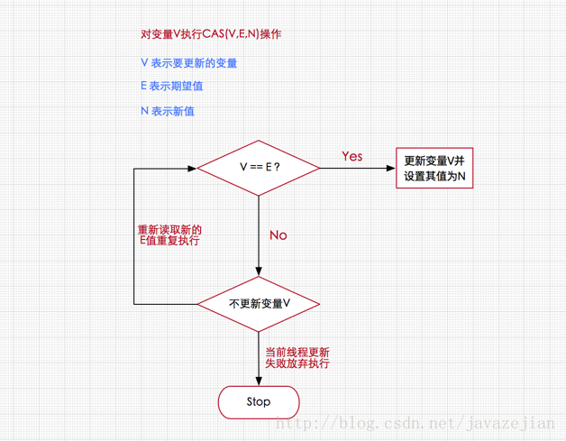

Unsafe 中提供了一套原子化的判断和值替换 api，来看一下例子：
```java
//创建一个 Integer 对象，value 为 1
Integer i = 1;

//获取到内部变量 value，这个变量用于存放值
Field valueField = Integer.class.getDeclaredField("value");
valueField.setAccessible(true);

//获取到内存地址
long valueAddress = unsafe.objectFieldOffset(valueField);

//该方法用户比较及替换值
//第一个参数为要替换的对象本身，第二个参数为值的内存地址
//第三个参数为变量的预期值，第四个参数为变量要换的值
//如果变量目前的值等于预期值(第三个参数)，则会将变量的值换成新值(第四个参数)，返回 true
//如果不等于预期，则不会改变，并返回 false
boolean isOk = unsafe.compareAndSwapInt(i,valueAddress,1,5);

//此处输出 true
System.out.println(isOk);
//此处输出 5
System.out.println(i);
```

通过上面我们可以看出，cas操作需要有3个参数： 内存位置，期望值和新值。

如果内存位置的值与期望的值匹配上了，就将var1的值进行替换了返回true，否则不替换返回false。

注意： 这个值开辟的内存是堆外内存

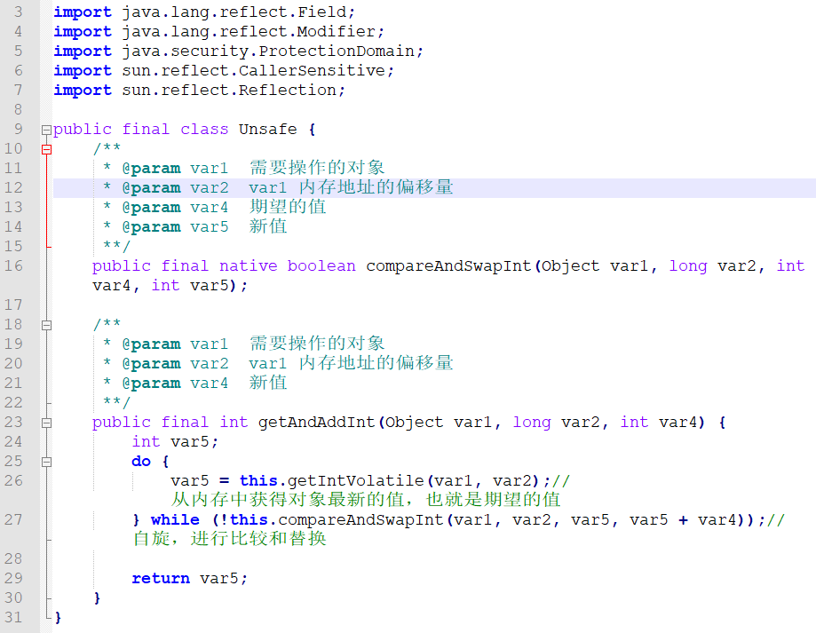

### 5.2.CAS底层实现原理

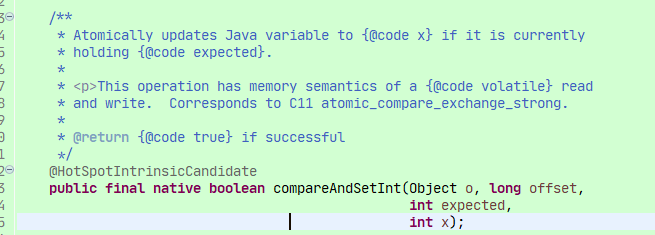

CompareAndSetInt 是native方法。但是正在的实现原理就着这，在HotSpot 的实现中unsafe.cpp中

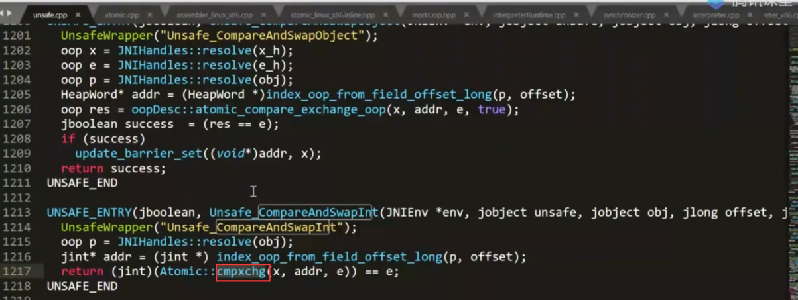

我们可以看到底层的使用了cmpxchg指令，这个是基于Linux指令实现的。这是一条汇编实现的

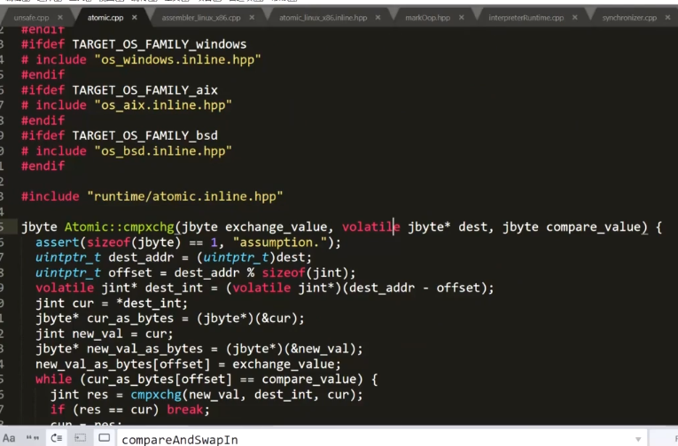


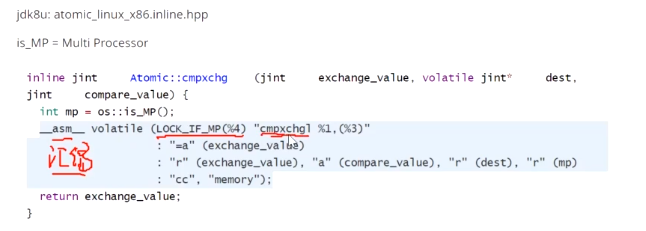

简单说：

CompareAndSwapInt 方法调用的是内核底层指令实现的，比如我们常见的x86架构中，最终的实现方式使用的是CPU指令cmpxchg。

- 在单核CPU的时候，只执行一条指令，cmpxchg。 cmpxchg 是非原子性的指令，保证不了数据安全
- 在多核CPU中，会执行lock cmpxchg 两条指令，lock指令是内核级别的指令，cas操作是在总线中发出lock命令，
  保证同时只有一条指令能操作内存中的这个值。

说道这里，其实synchronizeed也是使用lock指令实现的。

### 5.3.以AtomicInteger为例分析原理
```java
public class AtomicInteger extends Number implements java.io.Serializable {
    private static final long serialVersionUID = 6214790243416807050L;
    // 获取指针类Unsafe
    private static final Unsafe unsafe = Unsafe.getUnsafe();
    //下述变量value在AtomicInteger实例对象内的内存偏移量
    private static final long valueOffset;
    static {
        try {
           //通过unsafe类的objectFieldOffset()方法，获取value变量在对象内存中的偏移
           //通过该偏移量valueOffset，unsafe类的内部方法可以获取到变量value对其进行取值或赋值操作
            valueOffset = unsafe.objectFieldOffset(AtomicInteger.class.getDeclaredField("value"));
        } catch (Exception ex) { throw new Error(ex); }
    }
    //当前AtomicInteger封装的int变量value
    private volatile int value;
    public AtomicInteger(int initialValue) {
        value = initialValue;
    }
    public AtomicInteger() {
    }
    //获取当前最新值，
    public final int get() {
        return value;
    }
    //设置当前值，具备volatile效果，方法用final修饰是为了更进一步的保证线程安全。
    public final void set(int newValue) {
        value = newValue;
    }
    //最终会设置成newValue，使用该方法后可能导致其他线程在之后的一小段时间内可以获取到旧值，有点类似于延迟加载
    public final void lazySet(int newValue) {
        unsafe.putOrderedInt(this, valueOffset, newValue);
    }
    //设置新值并获取旧值，底层调用的是CAS操作即unsafe.compareAndSwapInt()方法
    public final int getAndSet(int newValue) {
        return unsafe.getAndSetInt(this, valueOffset, newValue);
    }
    //如果当前值为expect，则设置为update(当前值指的是value变量)
    public final boolean compareAndSet(int expect, int update) {
        return unsafe.compareAndSwapInt(this, valueOffset, expect, update);
    }
    //当前值加1返回旧值，底层CAS操作
    public final int getAndIncrement() {
        return unsafe.getAndAddInt(this, valueOffset, 1);
    }
    //当前值减1，返回旧值，底层CAS操作
    public final int getAndDecrement() {
        return unsafe.getAndAddInt(this, valueOffset, -1);
    }
    //当前值增加delta，返回旧值，底层CAS操作
    public final int getAndAdd(int delta) {
        return unsafe.getAndAddInt(this, valueOffset, delta);
    }
    //当前值加1，返回新值，底层CAS操作
    public final int incrementAndGet() {
        return unsafe.getAndAddInt(this, valueOffset, 1) + 1;
    }
    //当前值减1，返回新值，底层CAS操作
    public final int decrementAndGet() {
        return unsafe.getAndAddInt(this, valueOffset, -1) - 1;
    }
    //当前值增加delta，返回新值，底层CAS操作
    public final int addAndGet(int delta) {
        return unsafe.getAndAddInt(this, valueOffset, delta) + delta;
    }
    //省略一些不常用的方法....
}
```
通过上述的分析，可以发现AtomicInteger原子类的内部几乎是基于前面分析过Unsafe类中的CAS相关操作的方法实现的，
这也同时证明AtomicInteger是基于无锁实现的，这里重点分析自增操作实现过程，其他方法自增实现原理一样。
我们发现AtomicInteger类中所有自增或自减的方法都间接调用Unsafe类中的getAndAddInt()方法实现了CAS操作，
从而保证了线程安全，关于getAndAddInt其实前面已分析过，它是Unsafe类中1.8新增的方法，源码如下

```java
//Unsafe类中的getAndAddInt方法
public final int getAndAddInt(Object o, long offset, int delta) {
    int v;
    do {
        v = getIntVolatile(o, offset);
    } while (!compareAndSwapInt(o, offset, v, v + delta));
    return v;
}
```
可看出getAndAddInt通过一个while循环不断的重试更新要设置的值，直到成功为止，调用的是Unsafe类中的compareAndSwapInt方法，
是一个CAS操作方法。这里需要注意的是，上述源码分析是基于JDK1.8的，如果是1.8之前的方法，AtomicInteger源码实现有所不同，
是基于for死循环的，如下：
```java
//JDK 1.7的源码，由for的死循环实现，并且直接在AtomicInteger实现该方法，
//JDK1.8后，该方法实现已移动到Unsafe类中，直接调用getAndAddInt方法即可
public final int incrementAndGet() {
    for (;;) {
        int current = get();
        int next = current + 1;
        if (compareAndSet(current, next))
            return next;
    }
}
```

### 5.4.ABA问题

假设这样一种场景，当第一个线程执行CAS(V,E,U)操作，在获取到当前变量V，准备修改为新值U前，另外两个线程已连续修改了两次变量V的值，
使得该值又恢复为旧值，这样的话，我们就无法正确判断这个变量是否已被修改过，如下图

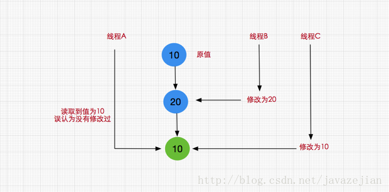

这就是典型的CAS的ABA问题，一般情况这种情况发现的概率比较小，可能发生了也不会造成什么问题，比如说我们对某个做加减法，
不关心数字的过程，那么发生ABA问题也没啥关系。但是在某些情况下还是需要防止的，那么该如何解决呢？
在Java中解决ABA问题，我们可以使用以下两个原子类。

- AtomicStampedReference（带有时间戳的对象引用）
- AtomicMarkableReference（维护的是一个boolean值的标识，也就是说至于true和false两种切换状态）

### 5.5.自旋锁

自旋锁是一种假设在不久将来，当前的线程可以获得锁，因此虚拟机会让当前想要获取锁的线程做几个空循环(这也是称为自旋的原因)，
在经过若干次循环后，如果得到锁，就顺利进入临界区。如果还不能获得锁，那就会将线程在操作系统层面挂起，这种方式确实也是可以提升效率的。
但问题是当线程越来越多竞争很激烈时，占用CPU的时间变长会导致性能急剧下降，因此Java虚拟机内部一般对于自旋锁有一定的次数限制，
可能是50或者100次循环后就放弃，直接挂起线程，让出CPU资源。

通过AtomicReference可实现简单的自旋锁

使用CAS原子操作作为底层实现，lock()方法将要更新的值设置为当前线程，并将预期值设置为null。unlock()函数将要更新的值设置为null，
并预期值设置为当前线程。然后我们通过lock()和unlock来控制自旋锁的开启与关闭，注意这是一种非公平锁。
事实上AtomicInteger(或者AtomicLong)原子类内部的CAS操作也是通过不断的自循环(while循环)实现，
不过这种循环的结束条件是线程成功更新对于的值，但也是自旋锁的一种。
```java
public class SpinLock {
  private AtomicReference<Thread> sign =new AtomicReference<>();

  public void lock(){
    Thread current = Thread.currentThread();
    while(!sign .compareAndSet(null, current)){
    }
  }

  public void unlock (){
    Thread current = Thread.currentThread();
    sign .compareAndSet(current, null);
  }
}
```

### 5.6.CAS算法的问题

1. CAS开销。CPU指令级的操作，只有一步原子操作，所以非常快。而且CAS避免了请求操作系统来裁定锁的问题，不用麻烦操作系统，直接在CPU内部就搞定了。

2. 自旋开销。自旋CAS如果长时间不成功，会给CPU带来非常大的执行开销。所有在JDK8优化后，增加了自旋锁。

3. ABA。CAS算法会将工作内存中的值与主内存中的值进行对比，如果没有发生变化则更新。但是如果一个值原来是A，变成了B，
   又变成了A，那么使用CAS进行检查时会发现它的值没有发生变化，但是实际上却变化了。这样就会给CAS一个错误的响应。

4. 只维护单一值。同时只能维护一个对象
   及时JDK1.8对CAS算法进行了优化，也是没有解决上面的问题。在低并发的场景，CAS算法效率的确是有所提升。

## 6.锁的分类

### 6.1.公平锁 / 非公平锁

- 公平锁：公平锁是指多个线程按照申请锁的顺序来获取锁。

- 非公平锁： 非公平锁是指多个线程获取锁的顺序并不是按照申请锁的顺序，有可能后申请的线程比先申请的线程优先获取锁。
  有可能，会造成优先级反转或者饥饿现象。

对于ReentrantLock而言，通过构造函数指定该锁是否是公平锁，默认是非公平锁。非公平锁的优点在于吞吐量比公平锁大。

对于Synchronized而言，也是一种非公平锁。由于其并不像ReentrantLock是通过AQS的来实现线程调度，所以并没有任何办法使其变成公平锁。

<p style="color:red;">公平锁与非公平锁有啥区别？在reentrantLock的实现有啥不同，释放锁有啥不同？</p>

[https://www.jianshu.com/p/cfb7eb66cbf0](https://www.jianshu.com/p/cfb7eb66cbf0)

### 6.2.可重入锁/ 不可重入锁

使用 ReentrantLock获取锁的时候会判断当前线程是否为获取锁的线程，如果是则将同步的状态 +1,释放锁的时候则将状态 -1。
只有将同步状态的次数置为 0 的时候才会最终释放锁。不可重入锁，与可重入锁相反，不可递归调用，递归调用就发生死锁。

由于公平锁需要关心队列的情况，得按照队列里的先后顺序来获取锁(会造成大量的线程上下文切换)，而非公平锁则没有这个限制。
所以也就能解释非公平锁的效率会被公平锁更高。

### 6.3.独享锁/共享锁

独享锁和共享锁在你去读C.U.T包下的ReentrantLock和ReentrantReadWriteLock你就会发现，它俩一个是独享一个是共享锁。

独享锁：该锁每一次只能被一个线程所持有。

共享锁：该锁可被多个线程共有，典型的就是ReentrantReadWriteLock里的读锁，它的读锁是可以被共享的，但是它的写锁确每次只能被独占。

另外读锁的共享可保证并发读是非常高效的，但是读写和写写，写读都是互斥的。

独享锁与共享锁也是通过AQS来实现的，通过实现不同的方法，来实现独享或者共享。

对于Synchronized而言，当然是独享锁。

### 6.4.互斥锁/读写锁

- 互斥锁

在访问共享资源之前对进行加锁操作，在访问完成之后进行解锁操作。加锁后，任何其他试图再次加锁的线程会被阻塞，直到当前进程解锁。

如果解锁时有一个以上的线程阻塞，那么所有该锁上的线程都被编程就绪状态，第一个变为就绪状态的线程又执行加锁操作，
那么其他的线程又会进入等待。 在这种方式下，只有一个线程能够访问被互斥锁保护的资源

- 读写锁

使用 ReentrantReadWriteLock,同时维护一对锁：读锁和写锁。当写线程访问时则其他所有锁都将阻塞，读线程访问时则不会。
通过读写锁的分离可以很大程度的提高并发量和吞吐量。

### 6.5.乐观锁 / 悲观锁

- 悲观锁

总是假设最坏的情况，每次去拿数据的时候都认为别人会修改，所以每次在拿数据的时候都会上锁，这样别人想拿这个数据就会阻塞直到它拿到锁（共享资源每次只给一个线程使用，其它线程阻塞，用完后再把资源转让给其它线程）。传统的关系型数据库里边就用到了很多这种锁机制，比如行锁，表锁等，读锁，写锁等，都是在做操作之前先上锁。Java中synchronized和ReentrantLock等独占锁就是悲观锁思想的实现。

- 乐观锁

总是假设最好的情况，每次去拿数据的时候都认为别人不会修改，所以不会上锁，但是在更新的时候会判断一下在此期间别人有没有去更新这个数据，可以使用版本号机制和CAS算法实现。乐观锁适用于多读的应用类型，这样可以提高吞吐量，像数据库提供的类似于write_condition机制，其实都是提供的乐观锁。在Java中java.util.concurrent.atomic包下面的原子变量类就是使用了乐观锁的一种实现方式CAS实现的。

### 6.6.分段锁

分段锁其实是一种锁的设计，并不是具体的一种锁，对于ConcurrentHashMap而言，其并发的实现就是通过分段锁的形式来实现高效的并发操作。

并发容器类的加锁机制是基于粒度更小的分段锁，分段锁也是提升多并发程序性能的重要手段之一。

在并发程序中，串行操作是会降低可伸缩性，并且上下文切换也会减低性能。在锁上发生竞争时将通水导致这两种问题，使用独占锁时保护受限资源的时候，基本上是采用串行方式—-每次只能有一个线程能访问它。所以对于可伸缩性来说最大的威胁就是独占锁。

### 6.7.偏向锁/轻量级锁/重量级锁

锁的状态：
1. 无锁状态
2. 偏向锁状态
3. 轻量级锁状态
4. 重量级锁状态

锁的状态是通过对象监视器（monitor）在对象头中的字段来表明的。

四种状态会随着竞争的情况逐渐升级，而且是不可逆的过程，即不可降级。

这四种状态都不是Java语言中的锁，而是Jvm为了提高锁的获取与释放效率而做的优化(使用synchronized时)。

- 偏向锁

偏向锁是指一段同步代码一直被一个线程所访问，那么该线程会自动获取锁。降低获取锁的代价。

- 轻量级

轻量级锁是指当锁是偏向锁的时候，被另一个线程所访问，偏向锁就会升级为轻量级锁，其他线程会通过自旋的形式尝试获取锁，不会阻塞，提高性能。

- 重量级锁

重量级锁是指当锁为轻量级锁的时候，另一个线程虽然是自旋，但自旋不会一直持续下去，当自旋一定次数的时候，还没有获取到锁，就会进入阻塞，该锁膨胀为重量级锁。重量级锁会让其他申请的线程进入阻塞，性能降低。

### 6.8.自旋锁

自旋锁（spinlock）：是指当一个线程在获取锁的时候，如果锁已经被其它线程获取，那么该线程将循环等待，然后不断的判断锁是否能够被成功获取，直到获取到锁才会退出循环。

它是为实现保护共享资源而提出一种锁机制。其实，自旋锁与互斥锁比较类似，它们都是为了解决对某项资源的互斥使用。无论是互斥锁，还是自旋锁，在任何时刻，最多只能有一个保持者，也就说，在任何时刻最多只能有一个执行单元获得锁。但是两者在调度机制上略有不同。对于互斥锁，如果资源已经被占用，资源申请者只能进入睡眠状态。但是自旋锁不会引起调用者睡眠，如果自旋锁已经被别的执行单元保持，调用者就一直循环在那里看是否该自旋锁的保持者已经释放了锁，”自旋”一词就是因此而得名

#### 6.8.1.自旋锁存在的问题

1. 如果某个线程持有锁的时间过长，就会导致其它等待获取锁的线程进入循环等待，消耗CPU。使用不当会造成CPU使用率极高。
2. 上面Java实现的自旋锁不是公平的，即无法满足等待时间最长的线程优先获取锁。不公平的锁就会存在“线程饥饿”问题。

#### 6.8.2.自旋锁的优点

1. 自旋锁不会使线程状态发生切换，一直处于用户态，即线程一直都是active的；不会使线程进入阻塞状态，减少了不必要的上下文切换，执行速度快
2. 非自旋锁在获取不到锁的时候会进入阻塞状态，从而进入内核态，当获取到锁的时候需要从内核态恢复，需要线程上下文切换。
   （线程被阻塞后便进入内核（Linux）调度状态，这个会导致系统在用户态与内核态之间来回切换，严重影响锁的性能）

### 6.9.分布式锁

#### 6.9.1.基于数据库

可以创建一张表，将其中的某个字段设置为唯一索引，当多个请求过来的时候只有新建记录成功的请求才算获取到锁，当使用完毕删除这条记录的时候即释放锁。

存在的问题:

- 数据库单点问题，挂了怎么办？
- 不是重入锁，同一进程无法在释放锁之前再次获得锁，因为数据库中已经存在了一条记录了。
- 锁是非阻塞的，一旦 insert 失败则会立即返回，并不会进入阻塞队列只能下一次再次获取。
- 锁没有失效时间，如果那个进程解锁失败那就没有请求可以再次获取锁了。

解决方案:

- 数据库切换为主从，不存在单点。
- 在表中加入一个同步状态字段，每次获取锁的是加 1 ，释放锁的时候-1，当状态为 0 的时候就删除这条记录，即释放锁。
- 非阻塞的情况可以用 while 循环来实现，循环的时候记录时间，达到 X 秒记为超时，break。
- 可以开启一个定时任务每隔一段时间扫描找出多少 X 秒都没有被删除的记录，主动删除这条记录。

#### 6.9.2.基于 Redis

使用 setNX(key) setEX(timeout) 命令，只有在该 key 不存在的时候创建这个
key，就相当于获取了锁。由于有超时时间，所以过了规定时间会自动删除，这样也可以避免死锁。

#### 6.9.3.基于 ZK

直接使用zk，或是使用zk的客户端curator。

## 7.总结

### 7.1.适用场景
- Synchronized：不可中断的锁，适合竞争不激烈的场景，可读性好。
- Lock: 可中断、可重入的锁，可实现多样化同步，竞争激烈时能保持常态。
- Atomic：竞争激烈时能保持常态，性能比lock好些，但是只能维护一个数值。

### 7.2.与synchronized对比

- 都是可重入性锁
- 锁定实现，synchronized是基于JVM实现的，实现不透明；reentrantlock是Java使用CAS实现的
- 功能的区别，在JDK1.8以后，synchronized的性能已经和reentrantlock差不多了，以前很差。
- 性能的区别，synchronized使用方便，但是扩展性的灵活度不行。Reentrantlock使用必须主要加锁和释放

### 7.3.Reentrantlock特有的功能

- 制定锁的类型，是公平锁还是非公平锁(公平锁就是先等待的线程先获得锁，非公平锁就是让线程去竞争)，而synchronized的锁全是非公平锁。
- 提供Condition类，可以分组唤醒线程。
- 提供中断等待锁的线程的机制，lock.lockInterruptibly()


