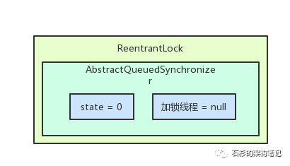
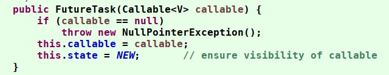
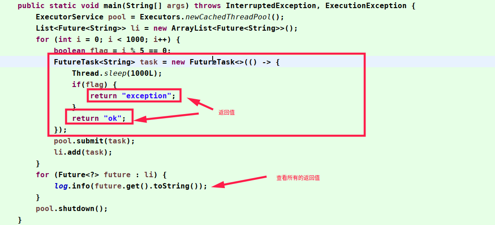
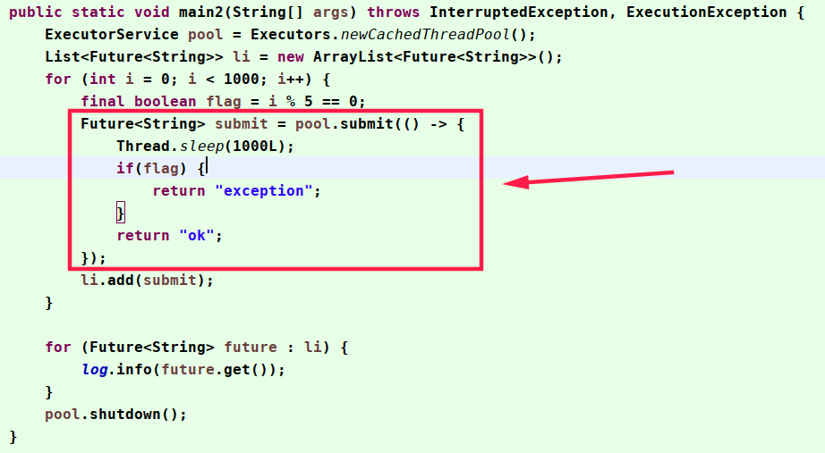

# 3.lock

## 1.AQS

### 1.1.基础概念

aqs原理：[https://www.cnblogs.com/NathanYang/p/9944632.html](https://www.cnblogs.com/NathanYang/p/9944632.html)

[https://www.cnblogs.com/NathanYang/p/9944632.html](https://www.cnblogs.com/NathanYang/p/9944632.html)

[https://blog.csdn.net/striveb/article/details/86761900](https://blog.csdn.net/striveb/article/details/86761900)

AQS是AbstractQueuedSynchronizer的简称，本身是抽象类，为其他同步的工具提供基础能力，是concurrent包下类的核心


### 1.2.数据结构
AQS全称 AbstractQueuedSynchronizer。是JUC包下很多并发工具的实现基础，由两部分数据组成
1. state，是int类型的，代表了加锁的状态，通过CAS修改state。当state=0时 表示无锁；当state=1时加锁成功；当state>1时表示重入锁重入次数。
2. 双向列表。保存需要执行任务的线程，以及任务状态。



使用LockSupport控制正在排队的线程等待获得机会去获得锁。

### 1.3.实现原理

- 锁的类型提供了独占锁与共享锁，我们可以继承实现各自的api即可。aqs采用模板模式封装好实现方式
- aqs默认实现的是非公平锁。线程尝试获得锁失败后，会将线程与等待的状态封装为node对象，保存到队列尾部（使用CAS循环添加队尾，直到成功为止）
  - 如果 当前节点 的 前驱结点 为头结点，则自旋尝试获得锁
  - 如果 当前节点 的 前驱结点 不是头结点，则线程park阻塞，等待释放后唤醒
- 头节点释放同步状态后，将会唤醒其后继节点，后继节点被唤醒后需要检查自己是否为头节点  

双向链表的头结点，在抢锁成功后，会将线程的引用为null，方便GC回收垃圾。

### 1.4.任务状态

- CANCELLED=1;因为超时或者中断，节点会被设置为取消状态，被取消的节点时不会参与到竞争中的，他会一直保持取消状态不会转变为其他状态；
- SIGNAL=-1;后继节点的线程处于等待状态，而当前节点的线程如果释放了同步状态或者被取消，将会通知后继节点，使后继节点的线程得以运行
- CONDITION=-2;节点在等待队列中，节点线程等待在Condition上，当其他线程对Condition调用了signal()后，改节点将会从等待队列中转移到同步队列中，加入到同步状态的获取中
- PROPAGATE=-3;表示下一次共享式同步状态获取将会无条件地传播下去

### 1.5.同步模式

- Exclusive（独占，只有一个线程能执行，如ReentrantLock）
- Share（共享，多个线程可同时执行，如Semaphore/CountDownLatch）

### 1.6.核心方法

- 关于state的方法主要有一下三种
```java
getState()：返回同步状态的当前值；
setState(int newState)：设置当前同步状态；
compareAndSetState(int expect, int update)：使用CAS设置当前状态，该方法能够保证状态设置的原子性；
```

- 自定义同步器实现时主要实现以下几种方法
```java
tryAcquire(int arg)：独占式获取同步状态，获取同步状态成功后，其他线程需要等待该线程释放同步状态才能获取同步状态
tryRelease(int arg)：独占式释放同步状态；
tryAcquireShared(int arg)：共享式获取同步状态，返回值大于等于0则表示获取成功，否则获取失败；
tryReleaseShared(int arg)：共享式释放同步状态；
isHeldExclusively()：当前同步器是否在独占式模式下被线程占用，一般该方法表示是否被当前线程所独占；
```

- 其余方法
```java
acquire(int arg)：独占式获取同步状态，如果当前线程获取同步状态成功，则由该方法返回，否则，将会进入同步队列等待，该方法将会调用可重写的tryAcquire(int arg)方法；
acquireInterruptibly(int arg)：与acquire(int arg)相同，但是该方法响应中断，当前线程为获取到同步状态而进入到同步队列中，如果当前线程被中断，则该方法会抛出InterruptedException异常并返回；
tryAcquireNanos(int arg,long nanos)：超时获取同步状态，如果当前线程在nanos时间内没有获取到同步状态，那么将会返回false，已经获取则返回true；
acquireShared(int arg)：共享式获取同步状态，如果当前线程未获取到同步状态，将会进入同步队列等待，与独占式的主要区别是在同一时刻可以有多个线程获取到同步状态；
acquireSharedInterruptibly(int arg)：共享式获取同步状态，响应中断；
tryAcquireSharedNanos(int arg, long nanosTimeout)：共享式获取同步状态，增加超时限制；
release(int arg)：独占式释放同步状态，该方法会在释放同步状态之后，将同步队列中第一个节点包含的线程唤醒；
releaseShared(int arg)：共享式释放同步状态；
```

## 2.LockSupport

使用Unsafe实现的锁线程进行加锁解锁的工具类，JDK中很多线程等待/唤醒，等待时间控制都使用这个实现的， 
比如： AQS、ScheduleExecutorsThreadPool等

对线程使用LockSupport控制后，线程的状态是wait或time_wait，不是blocked。只有synchronized是blocked的。

## 3.ReentrantLock

### 3.1.ReentrantLock 实现原理

使用 synchronized 来做同步处理时，锁的获取和释放都是隐式的，实现的原理是通过编译后加上不同的机器指令来实现。
而 ReentrantLock 就是一个普通的类，它是基于 AQS(AbstractQueuedSynchronizer)来实现的。
是一个重入锁：一个线程获得了锁之后仍然可以反复的加锁，不会出现自己阻塞自己的情况。

### 3.2.锁类型

ReentrantLock 分为 公平锁 和 非公平锁，可以通过构造方法来指定具体类型：

```java
//默认非公平锁
public ReentrantLock() {
    sync = new NonfairSync();
}

//公平锁
public ReentrantLock(boolean fair) {
    sync = fair ? new FairSync() : new NonfairSync();
}
```

默认一般使用非公平锁，它的效率和吞吐量都比公平锁高的多(后面会分析具体原因)。

#### 3.2.1.获取锁

通常的使用方式如下:
```java
private ReentrantLock lock = new ReentrantLock();
public void run() {
    lock.lock();
    try {
        //do bussiness
    } catch (InterruptedException e) {
        e.printStackTrace();
    } finally {
        lock.unlock();
    }
}
```

##### 3.2.1.1.公平锁

首先看下获取锁的过程：
```java
public void lock() {
    sync.lock();
}
```

可以看到是使用 sync 的方法，而这个方法是一个抽象方法，具体是由其子类(FairSync)来实现的，以下是公平锁的实现:
```java
final void lock() {
    acquire(1);
}

//AbstractQueuedSynchronizer 中的 acquire()
public final void acquire(int arg) {
if (!tryAcquire(arg) &&
    acquireQueued(addWaiter(Node.EXCLUSIVE), arg))
    selfInterrupt();
}
```

第一步是尝试获取锁(tryAcquire(arg)),这个也是由其子类实现：
```java
protected final boolean tryAcquire(int acquires) {
    final Thread current = Thread.currentThread();
    int c = getState();
    if (c == 0) {
        if (!hasQueuedPredecessors() &&
            compareAndSetState(0, acquires)) {
            setExclusiveOwnerThread(current);
            return true;
        }
    }
    else if (current == getExclusiveOwnerThread()) {
        int nextc = c + acquires;
        if (nextc < 0)
            throw new Error("Maximum lock count exceeded");
        setState(nextc);
        return true;
    }
    return false;
}
```

首先会判断 AQS 中的 state 是否等于 0，0表示目前没有其他线程获得锁，当前线程就可以尝试获取锁。

注意:尝试之前会利用 hasQueuedPredecessors() 方法来判断 AQS的队列中中是否有其他线程，如果有则不会尝试获取锁(这是公平锁特有的情况)。

如果队列中没有线程就利用 CAS 来将 AQS 中的 state 修改为1，也就是获取锁，获取成功则将当前线程置为获得锁的独占线程(setExclusiveOwnerThread(current))。

如果 state 大于 0时，说明锁已经被获取了，则需要判断获取锁的线程是否为当前线程(ReentrantLock 支持重入)，是则需要将 state + 1，并将值更新。

写入队列

如果 tryAcquire(arg) 获取锁失败，则需要用 addWaiter(Node.EXCLUSIVE)将当前线程写入队列中。

写入之前需要将当前线程包装为一个 Node 对象(addWaiter(Node.EXCLUSIVE))。

AQS 中的队列是由 Node 节点组成的双向链表实现的。

包装代码:
```java
private Node addWaiter(Node mode) {
    //根据给定的模式（独占或者共享）新建Node
    Node node = new Node(Thread.currentThread(), mode);
    //快速尝试添加尾节点
    Node pred = tail;
    if (pred != null) {
        node.prev = pred;
        //CAS设置尾节点
        if (compareAndSetTail(pred, node)) {
            pred.next = node;
            return node;
        }
    }
    //多次尝试
    enq(node);
    return node;
}
```

首先判断队列是否为空，不为空时则将封装好的 Node 利用 CAS 写入队尾，如果出现并发写入失败就需要调用 enq(node); 来写入了。
```java
private Node enq(final Node node) {
    //多次尝试，直到成功为止
    for (;;) {
        Node t = tail;
        //tail不存在，设置为首节点
        if (t == null) {
            if (compareAndSetHead(new Node()))
                tail = head;
        } else {
            //设置为尾节点
            node.prev = t;
            if (compareAndSetTail(t, node)) {
                t.next = node;
                return t;
            }
        }
    }
}
```

这个处理逻辑就相当于自旋加上 CAS 保证一定能写入队列。

挂起等待线程

写入队列之后需要将当前线程挂起(利用acquireQueued(addWaiter(Node.EXCLUSIVE),arg))

```java
final boolean acquireQueued(final Node node, int arg) {
   /* 标记是否成功拿到资源 */
   boolean failed = true;
	try {
		/* 中断标志*/
		boolean interrupted = false;
		/*  自旋，一个死循环 */
		for (;;) {
			/* 获取前线程的前驱节点*/
			final Node p = node.predecessor();
			/*当前线程的前驱节点是头结点，即该节点是第二个节点，且同步状态成功*/
			if (p == head && tryAcquire(arg)) {
				/*将head指向该节点*/
				setHead(node);
			   /* 方便GC回收垃圾 */
				p.next = null; 
				failed = false;
			   /*返回等待过程中是否被中断过*/
				return interrupted;
			}
			/*获取失败，线程就进入waiting状态，直到被unpark()*/
			if (shouldParkAfterFailedAcquire(p, node) &&parkAndCheckInterrupt())
				/*如果等待过程中被中断过一次，就标记为true*/
				interrupted = true;
		}
	} finally {
		if (failed)
			cancelAcquire(node);
	}
}

private static boolean shouldParkAfterFailedAcquire(Node pred, Node node) {
    int ws = pred.waitStatus;//拿到前驱节点的状态
    if (ws == Node.SIGNAL)
        //状态为SIGNAL,如果前驱节点处于等待状态，直接返回true
        return true;
    if (ws > 0) {
        /*
         * 如果前驱节点放弃了，那就一直往前找，直到找到最近一个正常等待的状态，并排在它的后边。
         * 注意：那些放弃的结点，由于被自己“加塞”到它们前边，它们相当于形成一个无引用链，稍后就会被GC回收
         */
        do {
            node.prev = pred = pred.prev;
        } while (pred.waitStatus > 0);
        pred.next = node;
    } else {
         //如果前驱节点正常，那就把前驱的状态通过CAS的方式设置成SIGNAL
        compareAndSetWaitStatus(pred, ws, Node.SIGNAL);
    }
    return false;
}
```

首先会根据 node.predecessor()获取到上一个节点是否为头节点，如果是则尝试获取一次锁，获取成功就万事大吉了。

如果不是头节点，或者获取锁失败，则会根据上一个节点的 waitStatus 状态来处理(shouldParkAfterFailedAcquire(p, node))。

waitStatus 用于记录当前节点的状态，如节点取消、节点等待等。

shouldParkAfterFailedAcquire(p, node)返回当前线程是否需要挂起，如果需要则调用 parkAndCheckInterrupt()：

```java
private final boolean parkAndCheckInterrupt() {
  LockSupport.park(this);
  return Thread.interrupted();
}
```

他是利用 LockSupport 的 part 方法来挂起当前线程的，直到被唤醒。

##### 3.2.1.2.非公平锁

公平锁与非公平锁的差异主要在获取锁：

公平锁就相当于买票，后来的人需要排到队尾依次买票，不能插队。

而非公平锁则没有这些规则，是抢占模式，每来一个人不会去管队列如何，直接尝试获取锁。

非公平锁:
```java
final void lock() {
    //直接尝试获取锁
    if (compareAndSetState(0, 1))
        setExclusiveOwnerThread(Thread.currentThread());
    else
        acquire(1);
}
```

公平锁:
```java
final void lock() {
    acquire(1);
}
```

还要一个重要的区别是在尝试获取锁时tryAcquire(arg)，非公平锁是不需要判断队列中是否还有其他线程，也是直接尝试获取锁：

```java
final boolean nonfairTryAcquire(int acquires) {
    final Thread current = Thread.currentThread();
    int c = getState();
    if (c == 0) {
        //没有 !hasQueuedPredecessors() 判断
        if (compareAndSetState(0, acquires)) {
            setExclusiveOwnerThread(current);
            return true;
        }
    }
    else if (current == getExclusiveOwnerThread()) {
        int nextc = c + acquires;
        if (nextc < 0) // overflow
            throw new Error("Maximum lock count exceeded");
        setState(nextc);
        return true;
    }
    return false;
}
```
#### 3.2.2.释放锁

公平锁和非公平锁的释放流程都是一样的：
```java
public void unlock() {
    sync.release(1);
}
```

```java
public final boolean release(int arg) {
    if (tryRelease(arg)) {
        Node h = head;
        if (h != null && h.waitStatus != 0)
               //唤醒被挂起的线程
            unparkSuccessor(h);
        return true;
    }
    return false;
}

//尝试释放锁
protected final boolean tryRelease(int releases) {
    int c = getState() - releases;
    if (Thread.currentThread() != getExclusiveOwnerThread())
        throw new IllegalMonitorStateException();
    boolean free = false;
    if (c == 0) {
        free = true;
        setExclusiveOwnerThread(null);
    }
    setState(c);
    return free;
}     
```

首先会判断当前线程是否为获得锁的线程，由于是重入锁所以需要将 state 减到 0 才认为完全释放锁。

释放之后需要调用 unparkSuccessor(h) 来唤醒被挂起的线程。

### 3.3.其他实用的方法

```java
boolean isLocked = lock.isLocked();//锁是否被上锁
boolean heldByCurrentThread = lock.isHeldByCurrentThread();//当前线程是否被上锁
boolean fair = lock.isFair();//是否是公平锁
int holdCount = lock.getHoldCount();//当前调用锁的线程的个数(就是当前调用lock()方法的个数)
boolean hasQueuedThreads = lock.hasQueuedThreads();//是否有线程在等待使用锁
boolean hasQueuedThread = lock.hasQueuedThread(Thread.currentThread());//某个线程是否在等待使用锁
```

## 4.Condition

用于多线程之间在等待某个条件达成的时候再去执行某些线程的场景。
```java
@Slf4j
public class Demo_07 {
	public static void main(String[] args) {
        ReentrantLock reentrantLock = new ReentrantLock();
        Condition condition = reentrantLock.newCondition();

        new Thread(() -> {
            try {
                reentrantLock.lock();
                log.info("wait signal"); // 1
                condition.await();//进入等待状态，等待condition的信号
            } catch (InterruptedException e) {
                e.printStackTrace();
            }
            log.info("get signal"); // 4
            reentrantLock.unlock();
        }).start();

        new Thread(() -> {
            reentrantLock.lock();
            log.info("get lock"); // 2
            try {
                Thread.sleep(3000);
            } catch (InterruptedException e) {
                e.printStackTrace();
            }
            condition.signalAll();//通知所有的condition，可以运行了
            log.info("send signal ~ "); // 3
            reentrantLock.unlock();
        }).start();
    }
}
```

## 5.FutureTask

Future基本操作：[https://mp.weixin.qq.com/s/qoZ9zGzROIDvD8Idyvm3XQ](https://mp.weixin.qq.com/s/qoZ9zGzROIDvD8Idyvm3XQ)

FutureTask原理: [https://juejin.im/post/5dfdf6d5f265da33af51502a](https://juejin.im/post/5dfdf6d5f265da33af51502a)

Java8的CompletableFuture进阶之道：[https://juejin.im/post/5ca47aa0e51d457131257269](https://juejin.im/post/5ca47aa0e51d457131257269)

### 5.1.FutureTask

是一个线程执行类，实现了Runnable接口。也可以获得一些线程之后的状态等。


创建FutureTask对象的时候，需要一个callable接口的实现，而callable接口是有返回值的。




所以我们知道了FutureTask可以保存线程执行的返回值




### 5.2.Future

是FutureTask实现的接口，我们很多时候也是直接使用这个接口的。默认实现就是FutureTask。



## 6.ReentrantReadWriteLock

读写锁，内部使用了一个读锁，一个写锁。读和写都能进行控制。其中想要获得写锁的时候，必须是读锁和写锁都没有人在使用的情况下。

这是一种悲观的锁。适合在读多写少的场景，但是可能出现写的饥饿情况，就是一直有线程在读取，写入一直在等待的情况。 实际开发中使用的场景较少

## 7.StampedLock

JDK 1.8新增的锁，性能、稳定性很好的锁。功能很全面

实现原理： [https://blog.csdn.net/qq_37939251/article/details/83536984](https://blog.csdn.net/qq_37939251/article/details/83536984)

> [https://blog.csdn.net/LightOfMiracle/article/details/73223614](https://blog.csdn.net/LightOfMiracle/article/details/73223614)

性能浅析：[https://blog.csdn.net/pange1991/article/details/85096408](https://blog.csdn.net/pange1991/article/details/85096408)

Jdk bug: [http://ifeve.com/stampedlock-bug-cpu/](http://ifeve.com/stampedlock-bug-cpu/)

常见面试题：stampedLock与readWriteLock的区别？

1. readWriteLock是可重入锁，stampedLock不是
2. stampedLock提供了乐观锁机制，所以在读多写少的场景，性能高10倍以上。使用起来比较复杂。
3. stampedLock是公平锁。


