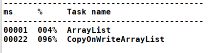
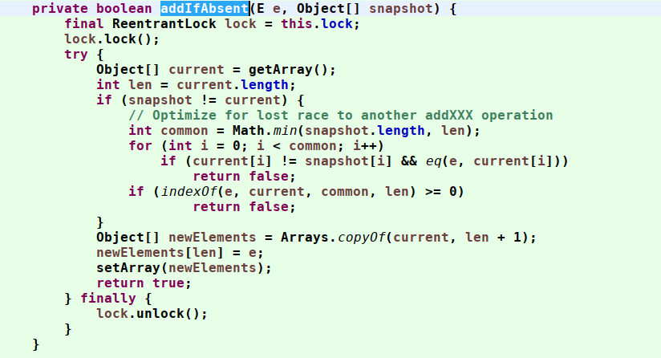
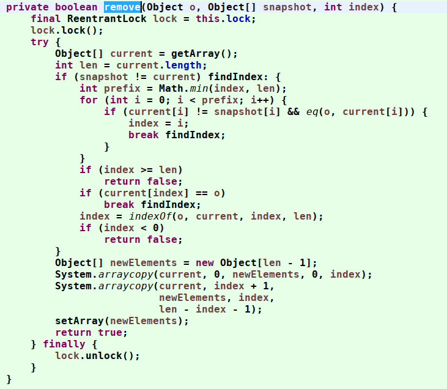
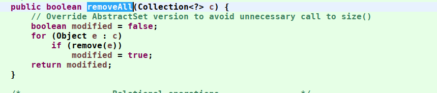
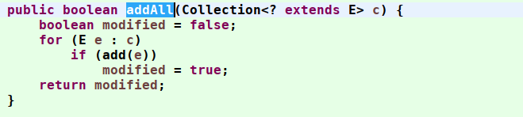
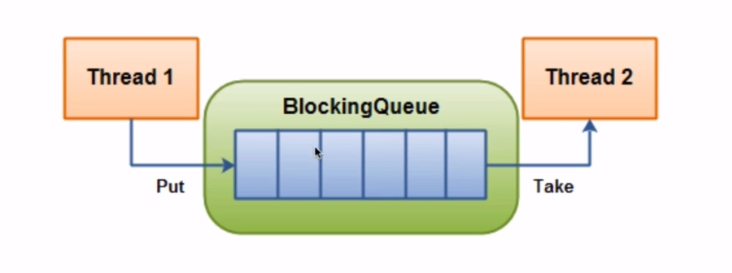
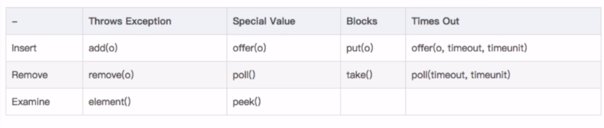

# 4.并发集合

## 1.并发容器

JUC其实指的是java.util.concurrent包下的并发集合类,都是使用lock机制实现的线程安全的集合。相比同步容器，并发容器的效率更高，操作跟简单。

1. 以concurrent开头的集合类

```java
//默认是支持16个线程并发写入，当超过了16个的时候，可能有些线程是需要等待的。它可以设置initialCapacity，设置线程数量
ConcurrentHashMap<K, V>

ConcurrentLinkedDeque<E>

//当使用多个线程访问集合的时候，这个集合是很好的选择。它不允许null，他实现了多线程的高效访问，访问时无需等待。
ConcurrentLinkedQueue<E>

ConcurrentNavigableMap<K, V>

ConcurrentSkipListMap<K, V>
```

concurrent的集合支持多个线程并发写入访问，写入的时候所有的操作都是线程安全的，但读取的时候不必锁定。
这些集合类采用更加复杂的算法保证远不会锁住整个集合，因此在并发写入的时候有较好的性能。

2. 以CopyOnWrite开头的集合类

```java

CopyOnWriteArrayList<E>

CopyOnWriteArraySet<E>

CopyOnWriteArraySet它的底层实现是CopyOnWriteArrayList，所以他们的实现原理是相同的。
```

他们的实现原理：复制底层的数组的方式，来实现写的操作。

当读取集合的时候，线程直接读取集合本身，无需加锁和阻塞。

当写入集合的时候，该集合底层会复制一份新的数组，接下来的操作是对新的数据。整个过程是对原集合的副本进行的，所以线程是安全的。

但是，他的写入时对数组的操作，所以写入到时候，性能是比较差的。但是读取是直接读取原数组，且不需要加锁，因此操作是很快，很安全的。

这两个类适用于读取操作很多的场合。

## 2.CopyOnWriteArrayList

### 2.1.介绍

CopyOnWrite，顾名思义：每次都是从主内存中获得最新的数组，copy一个新的数组，程序是操作这个新的数组的值，再将数组赋值给集合。

这样做的好处是读操作不加锁的，为了防止写的操作影响读操作

CopyOnWriteArrayList的add()方法

```java
public boolean add(E e) {
    // 获取独占锁
    final ReentrantLock lock = this.lock;
    lock.lock();
    try {
        // 获取array
        Object[] elements = getArray();
        // 复制array到新数组，添加元素到新数组
        int len = elements.length;
        Object[] newElements = Arrays.copyOf(elements, len + 1);
        newElements[len] = e;
        // 替换数组
        setArray(newElements);
        return true;
    } finally {
        // 释放锁
        lock.unlock();
    }
}
```
CopyOnWriteArrayList 内部维护了一个数组，成员变量 array 就指向这个内部数组，所有的读操作都是基于新的array对象进行的。

因为上了独占锁，所以如果多个线程调用add()方法只有一个线程会获得到该锁，其他线程被阻塞，知道锁被释放， 由于加了锁，所以整个操作的过程是原子性操作

CopyOnWriteArrayList 会将 新的array复制一份，然后在新复制处理的数组上执行增加元素的操作，执行完之后再将复制的结果指向这个新的数组。


CopyOnWriteArrayList在单线程的情况下，性能远远低于ArrayList



### 2.2.优缺点

优点：
1. 读写分离
2. 最终数据结果的一致性(弱一致性)

缺点：
1. 写操作会复制一个数组出来，频繁的调用写操作，不仅浪费CPU资源，会导致出现大量的GC。影响JVM的性能。
2. 因为写操作是加锁的，读操作不加锁，这样就导致了，多线程操作的时候，读取到的数据可能不是最新的,实时性差。
3. 性能不好，写操作消耗的计算机资源较多，如果集合的内容较大，在频繁的调用写操作时会严重影响JVM的性能
4. 弱一致性。是优点也是缺点
5. 迭代器不支持增删改

所以CopyOnWriteArrayList适合读多写少的场景

### 2.3.【缺点】弱一致性

调用iterator方法获取迭代器返回一个COWIterator对象

COWIterator的构造器里主要是 保存了当前的list对象的内容和遍历list时数据的下标。

snapshot是list的快照信息，因为CopyOnWriteArrayList的读写策略中都会使用getArray()来获取一个快照信息，生成一个新的数组。

所以在使用该迭代器元素时，其他线程对该lsit操作是不可见的，因为操作的是两个不同的数组所以造成弱一致性。

代码如下：
```java
public Iterator<E> iterator() {
    return new COWIterator<E>(getArray(), 0);
}

static final class COWIterator<E> implements ListIterator<E> {

    /** Snapshot of the array */
    private final Object[] snapshot;
    /** Index of element to be returned by subsequent call to next.  */
    private int cursor;

    private COWIterator(Object[] elements, int initialCursor) {
        cursor = initialCursor;
        snapshot = elements;
    }

    public boolean hasNext() {
        return cursor < snapshot.length;
    }

    public boolean hasPrevious() {
        return cursor > 0;
    }

    @SuppressWarnings("unchecked")
    public E next() {
        if (!hasNext())
            throw new NoSuchElementException();
        return (E) snapshot[cursor++];
    }
}    
```

### 2.4.【缺点】迭代器不支持增删改

CopyOnWriteArrayList 迭代器是只读的，不支持增删操作

CopyOnWriteArrayList迭代器中的 remove()和 add()方法，没有支持增删而是直接抛出了异常

因为迭代器遍历的仅仅是一个快照，而对快照进行增删改是没有意义的。

```java
// 尝试使用iterator删除元素，结果报错了。这个和ArrayList不一样？？？
private static void CopyOnWriteArrayListTest(){
    CopyOnWriteArrayList<String> list = new CopyOnWriteArrayList<>();
    list.add("test1");
    list.add("test2");
    list.add("test3");
    list.add("test4");

    Iterator<String> iterator = list.iterator();

    while (iterator.hasNext()){
        if ("test1".equals(iterator.next())){
            iterator.remove();
        }
    }

    System.out.println(list.toString());
}

Exception in thread "main" java.lang.UnsupportedOperationException
 at java.util.concurrent.CopyOnWriteArrayList$COWIterator.remove(CopyOnWriteArrayList.java:1178)
```

## 3.CopyOnWriteArraySet

### 3.1.对比HashSet

因为CopyOnWriteArraySet底层的实现使用的是CopyOnWriteArrayList，所以数据是有序的，且支持排序。

在执行Add/remove操作的时候，调用的还是CopyOnWriteArrayList的addIfAbsent方法。





需要注意的是CopyOnWriteArraySet的removeAll和addAll都是线程安全的。

## 4.ConcurrentSkipListSet

### 4.1.对比TreeSet

TreeSet内部实现使用的是TreeMap，默认使用key的Comparable实现进行排序

ConcurrentSkipListSet内部实现使用的是ConcurrentSkipListMap，默认使用key的Comparable实现进行排序。

由于ConcurrentSkipListMap内部的现实是没有使用锁的。所以在add和remove操作的时候性能比较好，是并发集合，却不是线程安全的集合。比如进行addAll和removeAll操作的时候是可能被多个线程同时操作的。





## 5.ConcurrentHashMap

是hashMap的并发容器，内部采用分段锁的方式进行并发操作。每一个段内保存一个Node<K, V>。
写操作的时候只对需要修改的node进行同步锁(synchronized)，读的时候会将上锁的node最后读取。

## 6.ConcurrentSkipListMap

和ConcurrentHashMap相比，ConcurrentSkipListMap性能要差很多，但是ConcurrentSkipListMap是有序的。

## 7.Queue

阻塞队列的数据结构符合FIFO规则。所以是线程安全的(使用put/take)





常见的阻塞队列有

- ArrayBlockingQueue，有界的阻塞队列，初始化时制定界限，之后不可修改
- DelayQueue, 会按照线程过期时间进行排序，比如定时关闭连接，缓存对象，请求超时处理等场景。
- LinkedBlockingQueue,可指定界限的阻塞队列
- PriorityBlockingQueue,按照保持对象的Comparable现实进行排序的队列
- SynchronousQueue,只允许存入一个对象的对象

### 7.1.插入数据

- 抛出异常 ：add(e)//队列未满时，返回true；队列满则抛出IllegalStateException(“Queue full”)异常——AbstractQueue
- 返回值（非阻塞）：offer(e)//队列未满时，返回true；队列满时返回false。非阻塞立即返回。
- 一定时间内返回值：offer(e, time, unit)//设定等待的时间，如果在指定时间内还不能往队列中插入数据则返回false，插入成功返回true。
- 返回值（阻塞）：put(e)//队列未满时，直接插入没有返回值；队列满时会阻塞等待，一直等到队列未满时再插入。

### 7.2.获得数据

- 抛出异常：remove()//队列不为空时，返回队首值并移除；队列为空时抛出NoSuchElementException()异常——AbstractQueue
- 返回值（非阻塞）：poll()//队列不为空时返回队首值并移除；队列为空时返回null。非阻塞立即返回。
- 一定时间内返回值 ：poll(time,unit)//设定等待的时间，如果在指定时间内队列还未孔则返回null，不为空则返回队首值
- 返回值（阻塞） ：take(e)//队列不为空返回队首值并移除；当队列为空时会阻塞等待，一直等到队列不为空时再返回队首值。

### 7.3.总结

一般推荐，add和remove配合使用，offer和poll配合使用，put和take配合使用。
他们各自代表了一种数据类型或数据的处理方式，这样能够使我们在处理数据的时候，保证逻辑清楚，效果可预测。
