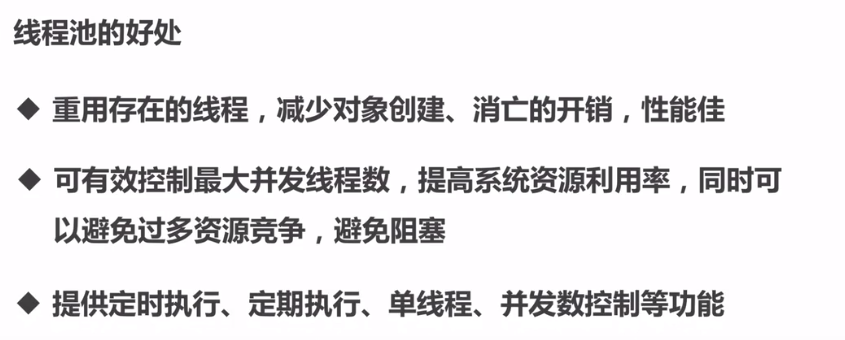

# 5.线程池

线程池灵魂8连问:[https://mp.weixin.qq.com/s/5wovWdIwMVhlR9wrMKFP-w](https://mp.weixin.qq.com/s/5wovWdIwMVhlR9wrMKFP-w)

## 1.线程池

系统启动一个线程的成本是比较高的，因为它涉及到与操作系统的交互。对于需要创建大量生命周期较短的线程的时候，应该考虑使用线程池。

ExecutorService类是jdk 1.5添加的，是jdk默认线程池的公共接口。
线程池虽然好，但是在同一个项目不要随意创建线程池。

### 1.1.new Thread的弊端


### 1.2.线程池的好处




### 1.3.ThreadPoolExecutor方法


## 2.JDK的线程池

Executors框架下的四大线程池运行原理和适用场景: https://blog.csdn.net/qq_36520235/article/details/83514470

### 2.1.newCachedThreadPool

主要基于队列SynchronousQueue实现，SynchronousQueue不保存数据，当我们提交任务之后，SynchronousQueue会开启一个新的线程去让任务执行，触发maxThreadSize创建新线程。

```java
ExecutorService p1 = Executors.newCachedThreadPool();

// 实现的代码
public static ExecutorService newCachedThreadPool() {
    return new ThreadPoolExecutor(0, Integer.MAX_VALUE, 60L, TimeUnit.SECONDS, 
        new SynchronousQueue<Runnable>());
}
```

- SynchronousQueue 的原理

[https://blog.csdn.net/yanyan19880509/article/details/52562039](https://blog.csdn.net/yanyan19880509/article/details/52562039)

1. 实现方式不使用AQS，是自己使用cas实现
2. 公平模式与非公平模式，任务消费的顺序不一样，一个是队列，一个是栈，默认非公平的的栈
3. 一个线程提交任务后，如果没有被消费的话，这个线程会被阻塞。使用put方法提交任务

### 2.2.newFixedThreadPool

```java
// 创建一个定长线程池，可控制线程最大并发数，超出的线程会在队列中等待。
ExecutorService p2 = Executors.newFixedThreadPool(6);

// 实现的代码
public static ExecutorService newFixedThreadPool(int nThreads) {
      return new ThreadPoolExecutor(nThreads, nThreads, 0L, TimeUnit.MILLISECONDS,
            new LinkedBlockingQueue<Runnable>());
  }	
```

### 2.3.newSingleThreadExecutor
```java
//创建一个单线程化的线程池，它只会用唯一的工作线程来执行任务，保证所有任务按照指定顺序(FIFO, LIFO, 优先级)执行。
ExecutorService p3 = Executors.newSingleThreadExecutor();
	public static ExecutorService newSingleThreadExecutor() {
        return new FinalizableDelegatedExecutorService
            (new ThreadPoolExecutor(1, 1, 0L, TimeUnit.MILLISECONDS, new LinkedBlockingQueue<Runnable>()));
    }
```

### 2.4.newScheduledThreadPool

```java
//创建一个定长线程池，支持定时及周期性任务执行。
ScheduledExecutorService p4 = Executors.newScheduledThreadPool(6);

public static ScheduledExecutorService newScheduledThreadPool(int corePoolSize) {
    return new ScheduledThreadPoolExecutor(corePoolSize);
}

public static ScheduledExecutorService newScheduledThreadPool(int corePoolSize, ThreadFactory threadFactory) {
    return new ScheduledThreadPoolExecutor(corePoolSize, threadFactory);
}

public ScheduledThreadPoolExecutor(int corePoolSize, ThreadFactory threadFactory) {
    super(corePoolSize, Integer.MAX_VALUE, 0, TimeUnit.NANOSECONDS, new DelayedWorkQueue(), threadFactory);
}
```

**实现原理**

核心实现方式是在 DelayedWorkQueue中，抛去这个，ScheduleExecutorService与普通的线程池差不多也是基于现场池任务阻塞的方式实现。

DelayedWorkQueue是采用最小堆实现有序队列，要执行的任务会放在队首，取出后，判断执行时间是否到了，到了或过了就执行，没过就使用Condition去等待执行的通知或者直接等待超时后，直接执行任务。

DelayedWorkQueue与DelayedQueue相似，都是使用Condition作为延迟工具。

Condition.awaitNanos(delayTime)延迟执行，最终还是调用Unsafe.park()进行实践延迟触发的条件是，
提交任务到线程池--ScheduledThreadPoolExecutor，线程池执行addWorker方法后，执行runWorker,会从队列中take任务，
这是ThreadPoolExecutor$Worker中的实现方式，这个getTask是阻塞的。


从队列中获得任务


延迟指定时间后，返回任务给上面的代码去执行任务


### 2.5.newSingleThreadScheduledExecutor

```java
//创建一个单线程化的线程池，支持定时及周期性任务执行。
ScheduledExecutorService p5 = Executors.newSingleThreadScheduledExecutor();
```

### 2.6.newWorkStealingPool

创建一个 work-stealing 线程池，使用目前机器上可用的处理器作为它的并行级别，并可以使用多个队列来减少竞争。

我的电脑有4个CPU，所以创建了4个线程，当然也可以使用newWorkStealingPool(parallelism)创建指定线程数量的线程池

### 2.8.ForkJoinPool


#### 2.8.1.什么是fork/join框架
1.7新增，是一种用于并发执行任务的框架，能够将一个大的任务分割为若干个小任务，分别运行，再将所有小任务的运行结果汇总得到预期结果的框架。

#### 2.8.2.Fork/Join框架的设计思路

1. 分割任务。首先我们需要有一个fork类来把大任务分割成子任务，有可能子任务还是很大，所以还需要不停的分割，直到分割出的子任务足够小。
2. 第二步执行任务并合并结果。分割的子任务分别放在双端队列里，然后几个启动线程分别从双端队列里获取任务执行。 
   子任务执行完的结果都统一放在一个队列里，启动一个线程从队列里拿数据，然后合并这些数据。

#### 2.8.3.任务类

1. ForkJoinTask：我们要使用ForkJoin框架，必须首先创建一个ForkJoin任务。它提供在任务中执行fork()和join()操作的机制，
   通常情况下我们不需要直接继承ForkJoinTask类，而只需要继承它的子类， Fork/Join框架提供了以下两个子类：
    - RecursiveAction：用于没有返回结果的任务。
    - RecursiveTask ：用于有返回结果的任务。

2. ForkJoinPool：ForkJoinTask需要通过ForkJoinPool来执行，任务分割出的子任务会添加到当前工作线程所维护的双端队列中，
    进入队列的头部。当一个工作线程的队列里暂时没有任务时，它会随机从其他工作线程的队列的尾部获取一个任务。	

参考：http://www.infoq.com/cn/articles/fork-join-introduction

## 3.线程池原理

1. ThreadPoolExecutor作为java.util.concurrent包对外提供基础实现，以内部线程池的形式对外提供管理任务执行，线程调度，线程池管理等等服务；
2. Executors方法提供的线程服务，都是通过参数设置来实现不同的线程池机制。
3. 先来了解其线程池管理的机制，有助于正确使用，避免错误使用导致严重故障。同时可以根据自己的需求实现自己的线程池

### 3.1.最核心的构造方法参数

|参数名                     |作用                                                                                                      |
|-------------------------- |----------------------------------------------------------------------------------------------------------|
|corePoolSize               |核心线程池大小                                                                                            |
|maximumPoolSize            |最大线程池大小                                                                                            |
|keepAliveTime              |线程池中超过corePoolSize数目的空闲线程最大存活时间；可以allowCoreThreadTimeOut(true)使得核心线程有效时间  |
|TimeUnit                   |keepAliveTime时间单位                                                                                     |
|workQueue                  |任务队列                                                                                                  |
|threadFactory              |新建线程工厂                                                                                              |
|RejectedExecutionHandler   |拒绝策略：当提交任务数超过maxmumPoolSize+workQueue之和时，任务会交给RejectedExecutionHandler来处理        |

### 3.2.拒绝策略RejectedExecutionHandler

Java 线程池必知的8 大拒绝策略：
[https://mp.weixin.qq.com/s/vnoJv79igBu1my9CoA71_A](https://mp.weixin.qq.com/s/vnoJv79igBu1my9CoA71_A)

JDK提供四种方案。第三方框架提供了多种拒绝策略，比如dubbo、activeMQ、netty、pinpoint

JDK提供四种实现方案如下：

- AbortPolicy 抛出异常

简单粗暴，直接抛出拒绝异常，这也是默认的拒绝策略


- CallerRunsPolicy 线程池就不管这个任务了，提交任务的线程去执行任务

如果线程池未关闭，则会在调用者线程中直接执行新任务，这会导致主线程提交线程性能变慢。


- DiscardOldestPolicy 丢弃队列中最靠前的任务，好让任务提交进去

抛弃最老的任务，就是从队列取出最老的任务然后放入新的任务进行执行


- DiscardPolicy 丢弃这个提交的任务

从方法看没做任务操作，即表示不处理新任务，即丢弃


### 3.3.shutdown和shutdownNow

shutdown是按过去执行已提交任务的顺序发起一个有序的关闭，但是不接受新任务。如果已经关闭，则调用没有其他作用。

shutdown被调用的时候，线程池会唤醒sleep或wait的线程，让他们赶紧执行任务 shutdownNow尝试停止所有的活动执行任务、暂停等待任务的处理，

并返回等待执行的任务列表。在从此方法返回的任务队列中排空（移除）这些任务。并不保证能够停止正在处理的活动执行任务，但是会尽力尝试。
此实现通过 Thread.interrupt()取消任务，所以无法响应中断的任何任务可能永远无法终止。

### 3.4.线程池的状态


runState的值有这样几种：

- RUNNING：　　接受新的任务，并处理队列中的任务
- SHUTDOWN：不接受新的任务，继续处理队列中的任务
- STOP： 不接受新的任务，也不处理队列中的任务，并且中断正在处理的任务
- TIDYING：所有任务都结束了，workerCount是0，通过调用terminated()方法转换状态
- TERMINATED：terminated()方法已经完成


状态之间的转换时这样的：

- RUNNING -> SHUTDOWN：调用shutdown()方法，或者隐式的调用finalize()方法
- (RUNNING or SHUTDOWN) -> STOP：调用shoutdownNow()方法
- SHUTDOWN -> TIDYING：当队列和池都是空的时候
- STOP -> TIDYING：当池是空的时候
- TIDYING -> TERMINATED：当terminated()方法调用完成时

### 3.5.线程池执行过程

其中比较容易让人误解的是：corePoolSize，maximumPoolSize，workQueue之间关系。
1. 当线程池小于corePoolSize时，新提交任务将创建一个新线程执行任务，即使此时线程池中存在空闲线程。
2. 当线程池达到corePoolSize时，新提交任务将被放入workQueue中，等待线程池中任务调度执行
3. 当workQueue已满，且maximumPoolSize>corePoolSize时，新提交任务会创建新线程执行任务
4. 当提交任务数超过maximumPoolSize时，新提交任务由RejectedExecutionHandler处理
5. 当线程池中超过corePoolSize线程，空闲时间达到keepAliveTime时，关闭空闲线程
6. 当设置allowCoreThreadTimeOut(true)时，线程池中corePoolSize线程空闲时间达到keepAliveTime也将关闭

简图如下：


上图是一张线程池工作的精简图，实际的过程比这个要复杂的多，不过这些应该能够完全覆盖到线程池的整个工作流程了。

#### 3.5.1.提交任务

当向线程池提交一个新的任务时，线程池有三种处理情况，分别是：创建一个工作线程来执行该任务、将任务加入阻塞队列、拒绝该任务。什么时候提交任务，什么时候开始创建核心线程

提交任务的过程也可以拆分成以下几个部分：

- 当工作线程数小于核心线程数时，直接创建新的核心工作线程
- 当工作线程数不小于核心线程数时，就需要尝试将任务添加到阻塞队列中去
- 如果能够加入成功，说明队列还没有满，那么需要做以下的二次验证来保证添加进去的任务能够成功被执行
- 验证当前线程池的运行状态，如果是非RUNNING状态，则需要将任务从阻塞队列中移除，然后拒绝该任务
- 验证当前线程池中的工作线程的个数，如果为0，则需要主动添加一个空工作线程来执行刚刚添加到阻塞队列中的任务
- 如果加入失败，则说明队列已经满了，那么这时就需要创建新的“临时”工作线程来执行任务
- 如果创建成功，则直接执行该任务
- 如果创建失败，则说明工作线程数已经等于最大线程数了，则只能拒绝该任务了


#### 3.5.2.创建工作线程

创建工作线程需要做一系列的判断，需要确保当前线程池可以创建新的线程之后，才能创建。

- 首先，当线程池的状态是 SHUTDOWN 或者 STOP 时，则不能创建新的线程。
- 另外，当线程工厂创建线程失败时，也不能创建新的线程。
- 还有就是当前工作线程的数量与核心线程数、最大线程数进行比较，如果前者大于后者的话，也不允许创建。
- 除此之外，会尝试通过 CAS 来自增工作线程的个数，如果自增成功了，则会创建新的工作线程，即 Worker对象。
- 然后加锁进行二次验证是否能够创建工作线程，最后如果创建成功，则会启动该工作线程。

PS:核心线程数会一直增加到设置的数量，与并发无关

#### 3.5.3.启动工作线程

当工作线程创建成功后，也就是 Worker 对象已经创建好了，这时就需要启动该工作线程，让线程开始干活了，
Worker 对象中关联着一个 Thread，所以要启动工作线程的话，只要通过 worker.thread.start() 来启动该线程即可。

启动完了之后，就会执行 Worker 对象的 run 方法，因为 Worker 实现了Runnable 接口，所以本质上 Worker 也是一个线程。

通过线程 start 开启之后就会调用到 Runnable 的 run 方法，在 worker 对象的run 方法中，
调用了 runWorker(this) 方法，也就是把当前对象传递给了 runWorker 方法，让他来执行。

#### 3.5.4.获取任务并执行

在 runWorker 方法被调用之后，就是执行具体的任务了，首先需要拿到一个可以执行的任务，而 Worker 对象中默认绑定了一个任务，
如果该任务不为空的话，那么就是直接执行。

执行完了之后，就会去阻塞队列中获取任务来执行，而获取任务的过程，需要考虑当前工作线程的个数。

如果工作线程数大于核心线程数，那么就需要通过 poll 来获取，因为这时需要对闲置的线程进行回收；

如果工作线程数小于等于核心线程数，那么就可以通过 take 来获取了，因此这时所有的线程都是核心线程，不需要进行回收，
前提是没有设置 allowCoreThreadTimeOut

### 3.6.ExecutorService调用execute与submit

线程池中可以执行线程的方法execute与submit。 两个方法的区别如下：

1. 接受的参数类型不同
2. submit有返回值，而execute没有。

在接受返回值的时候，会使获得返回值的线程阻塞，直到获得结果用到返回值的例子，比如说我有很多个做validation的task，
我希望所有的task执行完，然后每个task告诉我它的执行结果，是成功还是失败，如果是失败，原因是什么。
然后我就可以把所有失败的原因综合起来发给调用者。

### 3.7.总结

**线程池其实算是生产消费者模式的应用案例。**

1. 用ThreadPoolExecutor自定义线程池，看线程是的用途，如果任务量不大，可以用无界队列，如果任务量非常大，
   要用有界队列，防止OOM
2. 如果任务量很大，还要求每个任务都处理成功，要对提交的任务进行阻塞提交，重写拒绝机制，改为阻塞提交。保证不抛弃一个任务
3. 最大线程数一般设为2N+1最好，N是CPU核数，推荐使用Executors.newWorkStealingPool();（也不推荐）
4. 核心线程数，看应用，如果是任务，一天跑一次，设置为0，合适，因为跑完就停掉了，如果是常用线程池，看任务量，
   是保留一个核心还是几个核心线程数
5. 如果要获取任务执行结果，用CompletionService，但是注意，获取任务的结果的要重新开一个线程获取，如果在主线程获取，
   就要等任务都提交后才获取，就会阻塞大量任务结果，队列过大OOM，所以最好异步开个线程获取结果

## 4.线程池管理

### 4.1.阻塞主线程等待多线程

常见的方案如下：

- 使用awaitTermination查询线程池的状态阻塞主线程
- 使用CountDownLatch阻塞主线程
- 使用submit提交任务异步等待结果Future阻塞主线程

### 4.2.线程池监控

其实 ThreadPool 本身已经提供了不少 api 可以获取线程状态，很多方法看名字就知道其含义。


甚至我们可以继承线程池扩展其中的几个函数来自定义监控逻辑


看这些名称和定义都知道，这是让子类来实现的。可以在线程执行前、后、终止状态执行自定义逻辑。

### 4.3.线程池隔离

如果我们很多业务都依赖于同一个线程池,当其中一个业务因为各种不可控的原因消耗了所有的线程，导致线程池全部占满。

这样其他的业务也就不能正常运转了，这对系统的打击是巨大的。

比如我们 Tomcat 接受请求的线程池，假设其中一些响应特别慢，线程资源得不到回收释放；线程池慢慢被占满，最坏的情况就是整个应用都不能提供服务。

所以我们需要将线程池进行隔离。

通常的做法是按照业务进行划分：

比如下单的任务用一个线程池，获取数据的任务用另一个线程池。这样即使其中一个出现问题把线程池耗尽，那也不会影响其他的任务运行。

一般常使用hystrix 作为线程的隔离。 Hystrix 是一款开源的容错插件，具有依赖隔离、系统容错降级等功能。

### 4.4.动态线程池

方案1：dynamictp。
- 官网：[https://dynamictp.cn/](https://dynamictp.cn/)
- 源码：[https://github.com/dromara/dynamic-tp](https://github.com/dromara/dynamic-tp)
- 实现方式：https://blog.csdn.net/qq_14926159/article/details/123991231#t3

方案2：hippo4j。推荐使用，提供了管理界面。
- 官网：[https://hippo4j.cn](https://hippo4j.cn)
- 源码：[https://gitee.com/opengoofy/hippo4j](https://gitee.com/opengoofy/hippo4j)


## 5.线程池常见问题

### 5.1.多线程中的忙循环

[https://blog.csdn.net/A_Quiet_Evening/article/details/79373675](https://blog.csdn.net/A_Quiet_Evening/article/details/79373675)

### 5.2.线程池中线程复用与回收？线程的空轮询

[https://mp.weixin.qq.com/s?__biz=MzU1OTgyMDc3Mg==&mid=2247483834&idx=1&sn=db7cec29acba533cce79ec476b224a82&chksm=fc103b31cb67b2273e97e1b6836664286a99c36e196027e32cc0d45f21e690b41e70a285b1cb&token=347054940&lang=zh_CN#rd](https://mp.weixin.qq.com/s?__biz=MzU1OTgyMDc3Mg==&mid=2247483834&idx=1&sn=db7cec29acba533cce79ec476b224a82&chksm=fc103b31cb67b2273e97e1b6836664286a99c36e196027e32cc0d45f21e690b41e70a285b1cb&token=347054940&lang=zh_CN#rd)

[https://www.cnblogs.com/kingsleylam/p/11241625.html](https://www.cnblogs.com/kingsleylam/p/11241625.html)

就是防止线程被回收。现在执行完的状态是不可逆的。所以为了防止线程被回收，只要是runWorker方法中，调用的getTask方法，会进行轮询直到获得任务（阻塞获得）。runWorker方法也是不停的轮询去调用getTask获得任务。getTask返回null的话，一般是线程可以回收的，或者线程池状态是关闭的。

比如当前线程数小于等于核心线程数的时候，getTask是阻塞的。

大于核心线程数的时候，getTask是指定了一个超时时间，这样第一个空闲达到存活时间的线程就可以回收了，所有，回收线程的时候是不区分线程是核心线程还是最大线程的，谁先完成任务，谁先回收。

其实就是利用了队列的阻塞实现多线的回收与复用。

### 5.3.核心线程会被回收吗？

在JDK1.6之后，如果allowsCoreThreadTimeOut=true，核心线程也可以被终止。

### 5.4.线程池如何实现线程不被回收？

实现方式非常巧妙，核心线程（Worker）即使一直空闲也不终止，是通过workQueue.take()实现的，它会一直阻塞到从等待队列中取到新的任务。非核心线程空闲指定时间后终止是通过workQueue.poll(keepAliveTime,
TimeUnit.NANOSECONDS)实现的，一个空闲的Worker只等待keepAliveTime，如果还没有取到任务则循环终止，线程也就运行结束了。

### 5.5.现场池中的非核心线程何时被回收

代码案例：

[https://gitee.com/luckSnow/knowledge/blob/master/learn_code/src/main/java/com/zx/_02_thread/%E7%BA%BF%E7%A8%8B%E6%B1%A0/%E7%BA%BF%E7%A8%8B%E5%9B%9E%E6%94%B6%E6%97%B6%E6%9C%BA%E6%BC%94%E7%A4%BA.java](https://gitee.com/luckSnow/knowledge/blob/master/learn_code/src/main/java/com/zx/_02_thread/%E7%BA%BF%E7%A8%8B%E6%B1%A0/%E7%BA%BF%E7%A8%8B%E5%9B%9E%E6%94%B6%E6%97%B6%E6%9C%BA%E6%BC%94%E7%A4%BA.java)

线程池，工作线程为worker线程，start后就一直不停的在执行run方法。

而run方法，这是一个while循环，不停的在从worker中或者从queue中获得任务，否则就worker线程就会被阻塞，直到有新提交。而非核心线程的回收，是从最好一次提交任务开始计时，存活时间内，没有新的任务提交就会立即回收所有到期的非核心线程。但是只有回收之前有新的任务提交，则一个线程也不会被回收

### 5.6.Spring中有哪些和ThreadPoolExecutor类似的工具

| 类名                         | 作用                                                      |
|------------------------------|------------------------------------------------------------------------------------------------------------------------------------------------------|
|SimpleAsyncTaskExecutor       |使用的@Async注解，每次请求新开线程，没有最大线程数设置.不是真的线程池，这个类不重用线程，每次调用都会创建一个新的线程。                               |
|SyncTaskExecutor              |不是异步的线程。同步可以用SyncTaskExecutor，但这个可以说不算一个线程池，因为还在原线程执行。这个类没有实现异步调用，只是一个同步操作。                |
|ConcurrentTaskExecutor        |Executor的适配类，不推荐使用。如果ThreadPoolTaskExecutor不满足要求时，才用考虑使用这个类。                                                            |
|SimpleThreadPoolTaskExecutor  |监听Spring’s lifecycle callbacks，并且可以和Quartz的Component兼容.是Quartz的SimpleThreadPool的类。线程池同时被quartz和非quartz使用，才需要使用此类。  |

## 6.最佳实践

### 6.1.使用规范
以下内容来自《阿里Java开发规范》

- 【强制】使用ThreadPoolExecutor的构造函数声明线程池，避免使用Executors类的newFixedThreadPool和newCachedThreadPool。
- 【强制】创建线程或线程池时请指定有意义的线程名称，方便出错时回溯。即threadFactory参数要构造好。
- 【建议】建议不同类别的业务用不同的线程池。
- 【建议】CPU密集型任务(N+1)：这种任务消耗的主要是CPU资源，可以将线程数设置为N（CPU核心数）+1，比CPU核心数多出来的一个线程是为了防止线程偶发的缺页中断，或者其它原因导致的任务暂停而带来的影响。一旦任务暂停，CPU就会处于空闲状态，而在这种情况下多出来的一个线程就可以充分利用CPU的空闲时间。
- 【建议】I/O密集型任务(2N)：这种任务应用起来，系统会用大部分的时间来处理I/O交互，而线程在处理I/O的时间段内不会占用CPU来处理，这时就可以将CPU交出给其它线程使用。因此在I/O密集型任务的应用中，我们可以多配置一些线程，具体的计算方法是2N。
- 【建议】workQueue不要使用无界队列，尽量使用有界队列。避免大量任务等待，造成OOM。
- 【建议】如果是资源紧张的应用，使用allowsCoreThreadTimeOut可以提高资源利用率。
- 【建议】虽然使用线程池有多种异常处理的方式，但在任务代码中，使用try-catch最通用，也能给不同任务的异常处理做精细化。
- 【建议】对于资源紧张的应用，如果担心线程池资源使用不当，可以利用ThreadPoolExecutor的API实现简单的监控，然后进行分析和优化。
- 【建议】线程池设置建议
```java
private static final ThreadPoolExecutor pool;
static {
    ThreadFactory threadFactory = new ThreadFactoryBuilder().setNameFormat("po-detail-pool-%d").build();
    pool = new ThreadPoolExecutor(4, 8, 60L, TimeUnit.MILLISECONDS, new LinkedBlockingQueue<>(512),
        threadFactory, new ThreadPoolExecutor.AbortPolicy());
    pool.allowCoreThreadTimeOut(true);
}
```
- 不同的业务场景需要设置不同的线程池，隔离性。
- threadFactory：给出带业务语义的线程命名。
- corePoolSize：快速启动4个线程处理该业务，是足够的。
- maximumPoolSize：IO密集型业务，我的服务器是4C8G的，所以4*2=8。
- keepAliveTime：服务器资源紧张，让空闲的线程快速释放。
- pool.allowCoreThreadTimeOut(true)：也是为了在可以的时候，让线程释放，释放资源。
- workQueue：一个任务的执行时长在100~300ms，业务高峰期8个线程，按照10s超时（已经很高了）。10s，8个线程，可以处理10 * 1000ms / 200ms * 8 = 400个任务左右，往上再取一点，512已经很多了。
    因为：队列中保存的对象为线程，对象大小为240B，而向普通队列插入数据的对象可以自行定义，最小可以16B，是线程的15倍。如果真实场景中队列的数据非常多的话，
    可以选择使用自己实现生产者与消费者的模式。
- handler：极端情况下，一些任务只能丢弃，保护服务端。
