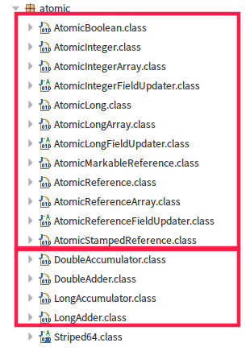
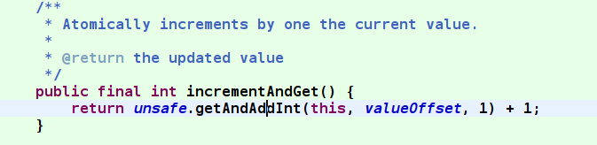
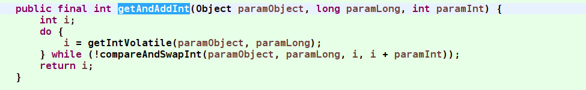
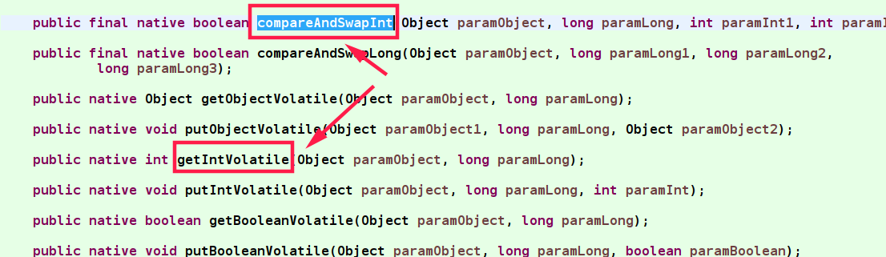
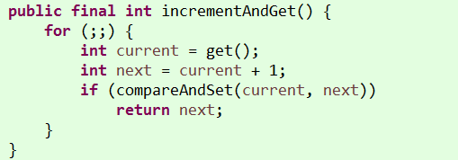
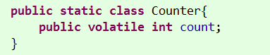
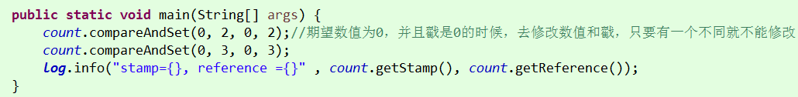

# 6.atomic

## 1.Atomic包

比如AtomicLongArray等数组的原子性类，也是很好用的。



## 2.AtomicInteger

实现方案：CAS算法，以AtomicInteger为例子，在调用incrementAndGet方法的时候调用下面的方法

- JDK 8实现方案：
  


其中unsafe类是sun.misc包下的类（JDK不提供源码），这个就是CAS算法的实现




getIntVolatile和compareAndSwapInt都是底层实现的。



- JDK1.7及以下实现方案：



以前是采用代码级别的cas实现。到1.8后采用完全的native方式。

其实看到这里就不难理解了，count定义在主内存中，当我们使用多线程操作的时候，我们操作的是count变量的副本。

当我们执行修改的时候，getAndAddInt方法会拿着副本中的变量与主线程中的变量对比，当值一致的时候，采取执行修改操作（注意这里是循环操作）

## 3.LongAdder

原理解析：[https://segmentfault.com/a/1190000015865714](https://segmentfault.com/a/1190000015865714)

AtomicLong，基于cas实现的原子性操作，但是在并发大的时候，内部的自旋非常多，导致效率降低。

LongAdder，将每个线程的并发操作分别记录到一个数组call[]，就是将一个热操作，分成了多个简单操作。之后对每个call进行操作，操作的时候再使用cas，最大程度的降低高并发时自旋导致的性能问题。
可能会动态地增加这组变量的数量。“sum”方法（等效于longValue方法）返回这组变量的“和”值。

同时call内部使用了伪共享解决方案，最大程度提高了执行的效率。


JDK1.8新增的类，相比使用CAS算法(循环调用底层去判断是否都修改数据)的Atomic类，性能更高，但是数值的精确度会比较低，
不是有对数值精度要求高的情况。比如LongAdder、DoubleAdder等。这几个类更加适合使用在高并发的场景中，性能会更高。


当我们的场景是为了统计技术，而不是为了更细粒度的同步控制时，并且是在多线程更新的场景时，LongAdder类比AtomicLong更好用。
在小并发的环境下，论更新的效率，两者都差不多。但是高并发的场景下，LongAdder有着明显更高的吞吐量，但是有着更高的空间复杂度。

LongAdder减少冲突的方法以及在求和场景下比AtomicLong更高效的原因

首先和AtomicLong一样，都会先采用cas方式更新值

在初次cas方式失败的情况下(通常证明多个线程同时想更新这个值)，尝试将这个值分隔成多个cell（sum的时候求和就行），
让这些竞争的线程只管更新自己所属的cell（因为在rehash之前，每个线程中存储的hashcode不会变，所以每次都应该会找到同一个cell），
这样就将竞争压力分散了

LongAdder适合的场景是统计求和计数的场景，而且LongAdder基本只提供了add方法，
而AtomicLong还具有cas方法(要使用cas，在不直接使用unsafe之外只能借助AtomicXXX了)

## 3.AtomicReference和AtomicIntegerFieldUpdater

AtomicReference类中初始化的值，是使用volatile修饰的变量。简单的保证了数值的可见性。底层任然调用的是CAS算法。
相比普通的Atomic类，性能上没有什么变化。

只是为pojo提供了一个可扩展的类。为自定义的对象提供一个将其修饰为原子性的方式。（实际场景使用较少）

```java
// 构造函数
java.util.concurrent.atomic.AtomicReference.AtomicReference(V initialValue)

// 返回当前的引用
V java.util.concurrent.atomic.AtomicReference.get() 

// 如果当前值与给定的expect相等，（注意是引用相等而不是equals()相等），更新为指定的update值。
boolean java.util.concurrent.atomic.AtomicReference.compareAndSet(V expect, V update)

// 原子地设为给定值并返回旧值。
V java.util.concurrent.atomic.AtomicReference.getAndSet(V newValue)

// 注意此方法不是原子的。不明白为什么要提供这个方法，很容易误用。
void java.util.concurrent.atomic.AtomicReference.set(V newValue)
```

AtomicIntegerFieldUpdater类与AtomicReference类型，他能指定对象中某个field进行原子性修改。
但是要求这个field必须使用volatile修饰的，而且必须使用public修改。



## 4.AtomicStampedReference

带有戳的AtomicReference，每次修改数值的时候，戳也可以进行修改。类似于数据库操作中的乐观锁。这样就避免了CAS算法的ABA问题。

