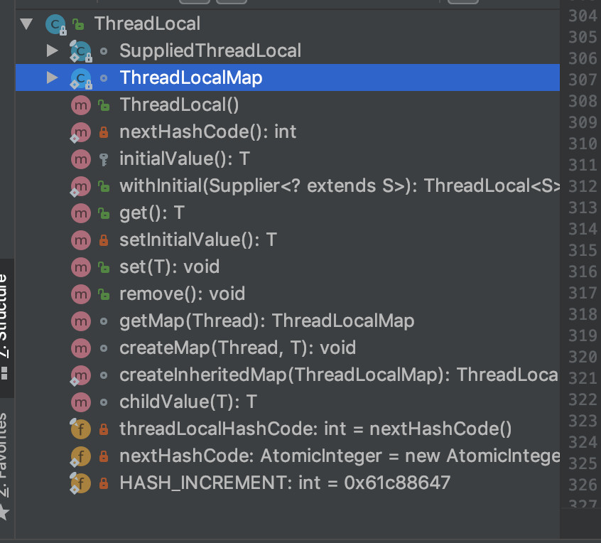
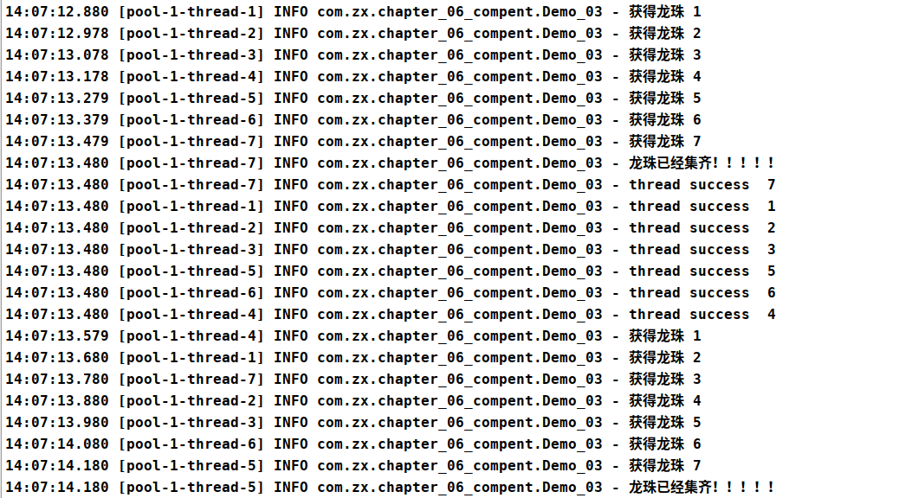

# 7.并发工具

## 1.ThreadLocal

### 1.1.介绍

- [学习笔记](https://mp.weixin.qq.com/s/WKaUzChzj2PIcqiw05jcIA)
- [threadLocal核心知识与面试题](https://mp.weixin.qq.com/s/ZqMkRXKeZ6QU-Imy3maYuQ)
- [ThreadLocal系列之业务开发实践(一)](https://www.jianshu.com/p/c2cea2285f67)
- [ThreadLocal系列之内存泄露剖析(二)](https://www.jianshu.com/p/9cc71c6a694a)
- [ThreadLocal系列之JDK为内存泄露做的努力(三)](https://www.jianshu.com/p/f135c24a4114)
- [ThreadLocal系列之父子线程传递线程私有数据(四)](https://www.jianshu.com/p/151d13011112)

1. ThreadLocal用来解决多线程程序的并发问题
2. ThreadLocal并不是一个Thread,而是Thread的局部变量,当使用ThreadLocal维护变量时,ThreadLocal为每个使用该变量的线程提供独立的变量副本,所以每个线程都可以独立地改变自己的副本,而不会影响其它线程所对应的副本.
3. 从线程的角度看，目标变量就象是线程的本地变量，这也是类名中“Local”所要表达的意思。
4. 线程局部变量并不是Java的新发明,Java没有提供在语言级支持(语法上),而是变相地通过ThreadLocal的类提供支持.
5. ThreadLocal类中的方法:(JDK5版本之后支持泛型)
```java
// 将此线程局部变量的当前线程副本中的值设置为指定值
void set(T value)

//移除此线程局部变量当前线程的值
void remove()

// 返回此线程局部变量的当前线程的“初始值”
protected T initialValue()

//返回此线程局部变量的当前线程副本中的值
T get()
```

### 1.2.set/get源码分析

以下是JDK1.8中，我们可以看到ThreadLocal和ThreadLocalMap两个类


我们有以下一段代码
```java
private statif final ThreadLocal<Integer> seqNum = new ThreadLocal<>(){
     @Override
     protected Integer initialValue() {
         return 0;
     }
 };

public int getNextNum(){
    seqNum.set(seqNum.get()+1);
    return seqNum.get();
}
```

程序调用 getNextNum()的时候，内部流程如下：
1. 先调用ThreadLocal里面的get方法，内容是判断当前线程的ThreadLocalMap中，是否存在key=seqNum。
    - 存在的话，则取出值来，转化成T类型的返回
    - 不存在的话，然后在调用setInitialValue，返回一个null
```java
public T get() {
    Thread t = Thread.currentThread();
    ThreadLocalMap map = getMap(t);
    if (map != null) {
        ThreadLocalMap.Entry e = map.getEntry(this);
        if (e != null) {
            T result = (T)e.value;
            return result;
        }
    }
    return setInitialValue();
}
// 需要我们重写
protected T initialValue() {
    return null;
}
// setInitialValue先查询是否存在值，存在的话，直接覆盖，不存在的话，先创建map在设置初始化值是一个null
private T setInitialValue() {
    T value = initialValue();
    Thread t = Thread.currentThread();
    ThreadLocalMap map = getMap(t);
    if (map != null)
        map.set(this, value);
    else
        createMap(t, value);
    return value;
}

void createMap(Thread t, T firstValue) {
    t.threadLocals = new ThreadLocalMap(this, firstValue);
}
```

下面我们再来看一下set()，存储数据的过程, 会调用ThreadLocal.set(T value) 方法。
如果map存在值的话，会直接覆盖，不存在的话会创建一个map并且初始化值。
```java
public void set(T value) {
    Thread t = Thread.currentThread();
    ThreadLocalMap map = getMap(t);
    if (map != null)
        map.set(this, value);
    else
        createMap(t, value);
}
```

上述示例说明，每个线程都是单独维护一套自己的变量，从源码看得出来，其主要作用的是里面的内部类ThreadLocalMap，
每个线程单独把自己的变量存在在不同的Entry，从而实现线程之间数据相互隔离。

ThreadLocal适用于资源共享但不需要维护状态的情况，也就是一个线程对资源的修改，不影响另一个线程的运行；这种设计是‘空间换时间’，synchronized顺序执行是‘时间换取空间’。

### 1.3.内存泄露风险

- ThreadlocalMap内部回收策略：[https://www.jianshu.com/p/69ae8c213b30](https://www.jianshu.com/p/69ae8c213b30)
- ThreadLocal为啥会出现内存泄漏：[https://blog.csdn.net/qq_28165595/article/details/83932214](https://blog.csdn.net/qq_28165595/article/details/83932214)

<p style="color: red">1.什么是内存泄漏？</p>

不再使用的内存，没有及时释放，就叫做内存泄漏。
对于持续运行的服务进程，必须及时释放内存，否则内存占用率越来越高，轻则影响系统性能，重则导致进程崩溃。

<p style="color: red">2.ThreadLocal是怎么造成内存泄露的呢？</p>

ThreadLocal中的有两条引用链：
1. 栈内存中ThreadLocal引用:我们定义ThreadLocal变量的引用，我们一般都是创建强引用。
2. ThreadLocalMap中的Key: Thread ->ThreadLocalMap -> Entry -> {key: ThreadLocal, value:Object}

其中key是弱引用，value是强引用。下面分两种情况：
1. Thread执行完毕，状态terminated，gc时会将线程回收掉，这样整个引用链都会被回收，不会内存泄露。
2. ThreadLocal的生命周期结束（例如方法中创建局部变量，方法结束后就不在使用了，ThreadLocal失去引用关系），等待被回收。
    这样会导致entry中的key没有被强引用到，gc时key被回收，但是value还在没有被回收。
    如果使用了这个ThreadLocal的线程一直在被复用着，那这个线程的ThreadLocalMap 中会出现大量无法被回收的entry，导致内存泄露。

什么场景会导致ThreadLocal被回收呢
1. 类的卸载，fullGC的时候会对永久代（matespace）中不再使用的类进行卸载  
2. 手动设置为null，例如在方法中创建ThreadLocal局部变量。

总之：ThreadLocalMap的key没了，但是value还在，这就造成了内存泄漏。


<p style="color: red">3.ThreadLocalMap 的key为什么是弱引用？</p>
如果不使用弱引用。我们在使用ThreadLocal时，代码中使用强引用。如果使用完后我们将强引用去掉（设置为null或者局部变量方法结束），
ThreadLocalMap的key也是强引用，就会导致ThreadLocal无法被GC，导致key数据的内存泄漏。

所以为了解决这个问题，就将key设置为弱引用。如果没有一个强引用在使用ThreadLocal，key就会被gc掉。


<p style="color: red">4.清理策略解决value内存泄露</p>

jdk提供了两种策略：
- 探测式清理（Proactive Cleanup）：当线程在调用 任意一个ThreadLocal的get/set/remove()方法时，都会检查ThreadLocalMap的所有的key，
    如果key为null，就将entry删除。具体可以见ThreadLocal#expungeStaleEntry方法
- 启发式清理（Heuristic Cleanup）：ThreadLocalMap 的 set方法 有一个阈值（默认为ThreadLocalMap.Entry数组长度的 1/4）。 
    当元素数量达到阈值是，会检查所有的entry，回收无效entry。具体可以见ThreadLocal#cleanSomeSlots方法

<p style="color: red">5.最佳实践</p>

ThreadLocal的性能开销主要来自两个方面：
1. ThreadLocalMap的维护。解决不了，尽量不要设置太多的ThreadLocal就行
2. ThreadLocal变量的创建和销毁。所以就static final，创建一次不销毁就行。

```java
// 1. 设置static final 静态变量，不回收
private static final ThreadLocal<Integer> TL = new ThreadLocal<>();

public void run(){
    try{
        TL.set(1);
        TL.get();
    } catch(Exception e){
    } finally{
        // 2.使用完后必须删除
        TL.remove();
    }
}
```

<p style="color: red">6.最佳实践的引入带来了新的变化</p>

使用static 、final修饰TheadLocal对象实例 一直不会被GC，是强引用。只有线程还存活，就不会自动回收value。所以必须人工remove数据，并且使用finally。

其实这里也导致了jdk的设计无效了，因为key是强引用。
1. 导致JDK解决key内存泄露问题的弱引用清理方式彻底失效，。
2. 导致JDK解决value内存泄露问题的两大清理方式彻底失效。

### 1.4.ThreadLocal增强

#### 1.4.1.InheritableThreadLocal

[https://www.cnblogs.com/Nonnetta/p/10175662.html](https://www.cnblogs.com/Nonnetta/p/10175662.html)

InheritableThreadLocal可以继承ThreadLocal中的数据，但是子线程必须是由父线程创建出来的才行，且父线程已经在InheritableThreadLocal中保存了数据。

且只能将数据从父线程传递给子线程一次，之后的父子线程修改的话，就没有用了。所以实际使用的很少。

#### 1.4.2.FastThreadLocal

ThreadLocal 在高并发环境下存在一些问题：
- 内存占用：每个 ThreadLocal 变量都会在每个线程中持有一个独立的副本，这可能导致大量的内存占用。
- 性能开销：创建和销毁这些线程局部变量会带来额外的性能开销。

Netty 是一个追求极致高性能的组件， Netty 的 FastThreadLocal 就是为了解决这些问题而诞生的。
FastThreadLocal 的实现与 ThreadLocal 非常类似，Netty 为 FastThreadLocal 量身打造了 FastThreadLocalThread 和 InternalThreadLocalMap 两个重要的类。

实现原理：
FastThreadLocalThread 是对 Thread 类的一层包装，每个线程对应一个 InternalThreadLocalMap 实例。
需要FastThreadLocal 和 FastThreadLocalThread配合使用。

高性能原因：
InternalThreadLocalMap也是数组结构，但是没有使用线性探测法来解决 Hash 冲突，而是在 FastThreadLocal 初始化 的时候，
为每一个本地变量，分配一个全局唯一的索引 index，数组索引 index 的值采用原子类 AtomicInteger 保证顺序递增。
简单说：就是每个FastThreadLocalThread都有一个唯一递增的id，查询时间复杂度是O(1)。


#### 1.4.3.TransmittableThreadLocal

TransmittableThreadLocal是阿里巴巴开源的一个框架，用于解决在使用线程池等场景下，ThreadLocal变量无法跨线程传递的问题。

### 1.5.应用场景

作用：
- 线程本地存储：线程隔离，线程之间互不干扰。
- 简化线程间数据传递：使用ThreadLocal读取线程中的变量，不需要在对象间传递数据。
- 管理线程特定资源：ThreadLocal常用于存储线程上下文信息，如用户会话信息、事务信息等。

优缺点：
- 优点：线程安全、无锁无并发性能好、简化编程模型。
- 缺点：空间换时间内存消耗大;数据无法共享;使用不当容易内存泄漏;ThreadLocalMap在hash冲突时使用线性探索法，需要 O(n) 时间复杂度解决冲突问题，效率较低。

框架中的应用：
1. spring：1）存储当前线程操作的数据源对象。2）事务管理
2. mybatis：存储SqlSession。
3. 链路追踪，记录traceId和spanId。这里应用的是日志框架的能力，例如slf4j的MDC。
4. RPC：记录调用链的上下文信息，可能包括调用者的身份、调用的参数、超时设置等
5. kafka：生产者和消费者线程会存储与连接相关的配置信息和状态信息等。

## 2.CountDownLatch倒计时器

### 2.1.使用方式

CountDownLatch。线程计数器，在计数器的值减到0之前，主线程会被阻塞。

CountDownLatch是在java1.5被引入的，它存在于java.util.concurrent包下。CountDownLatch这个类能够使一个线程等待其他线程完成各自的工作后再执行。例如，应用程序的主线程希望在负责启动框架服务的线程已经启动所有的框架服务之后再执行。

CountDownLatch是通过一个计数器来实现的，计数器的初始值为线程的数量。每当一个线程完成了自己的任务后，计数器的值就会减1。当计数器值到达0时，它表示所有的线程已经完成了任务，然后在闭锁上等待的线程就可以恢复执行任务。

构造器中的计数值（count）实际上就是闭锁需要等待的线程数量。这个值只能被设置一次，而且CountDownLatch没有提供任何机制去重新设置这个计数值。

与CountDownLatch的第一次交互是主线程等待其他线程。主线程必须在启动其他线程后立即调用CountDownLatch.await()方法。这样主线程的操作就会在这个方法上阻塞，直到其他线程完成各自的任务。

其他N
个线程必须引用闭锁对象，因为他们需要通知CountDownLatch对象，他们已经完成了各自的任务。这种通知机制是通过
CountDownLatch.countDown()方法来完成的；每调用一次这个方法，在构造函数中初始化的count值就减1。所以当N个线程都调用了这个方法，count的值等于0，然后主线程就能通过await()方法，恢复执行自己的任务。

### 2.2.使用场景

让我们尝试罗列出在java实时系统中CountDownLatch都有哪些使用场景。我所罗列的都是我所能想到的。如果你有别的可能的使用方法，请在留言里列出来，这样会帮助到大家。

（1）实现最大的并行性：有时我们想同时启动多个线程，实现最大程度的并行性。例如，我们想测试一个单例类。如果我们创建一个初始计数为1的CountDownLatch，并让所有线程都在这个锁上等待，那么我们可以很轻松地完成测试。我们只需调用
一次countDown()方法就可以让所有的等待线程同时恢复执行。

（2）开始执行前等待n个线程完成各自任务：例如应用程序启动类要确保在处理用户请求前，所有N个外部系统已经启动和运行了。

（3）死锁检测：一个非常方便的使用场景是，你可以使用n个线程访问共享资源，在每次测试阶段的线程数目是不同的，并尝试产生死锁。

## 3.CyclicBarrier循环屏障

### 3.1.介绍
CyclicBarrier。线程计数器，和CountDownLatch功能一样，但是CyclicBarrier可以循环使用。被多组多线程使用，而CountDownLatch只能被使用一次

CyclicBarrier是另一种多线程并发控制使用工具，和CountDownLatch非常类似，他也可以实现线程间的计数等待，但他的功能要比CountDownLatch更加强大一些。

CyclicBarrier的字面意思是可循环使用（Cyclic）的屏障（Barrier）。它要做的事情是，让一组线程到达一个屏障（也可以叫同步点）时被阻塞，直到最后一个线程到达屏障时，屏障才会开门，所有被屏障拦截的线程才会继续干活。

CyclicBarrier默认的构造方法是CyclicBarrier(int parties)，其参数表示屏障拦截的线程数量，每个线程调用await方法告诉CyclicBarrier我已经到达了屏障，然后当前线程被阻塞。

CyclicBarrier强调的是n个线程，大家相互等待，只要有一个没完成，所有人都得等着。

cyclicBarrier设置一个数量，意思是当等待的线程数量达到这个值的时候，线程才能继续执行。

主要用于多个线程相互等待的场景。

### 3.2.案例
```java
@Slf4j
public class Demo_03 {
	public static void main(String[] args) throws InterruptedException {
		int ThreadToatl = 70;//线程数
		int parties = 7;//等待的线程数
		final CyclicBarrier cyclicBarrier = new CyclicBarrier(parties, ()->{log.info("龙珠已经集齐！！！！！");}) ;

		ExecutorService pool = Executors.newCachedThreadPool();
		
		for (int i = 0; i < ThreadToatl; i++) {
			final int in = i % 7 + 1;
			Thread.sleep(100L);//执行方法
			pool.execute(() -> {
				try {
					log.info("获得龙珠 {}", in);
					cyclicBarrier.await();//执行完成后，开始等待其他线程，等数量等于parties的时候，在往下执行
					log.info("thread success  {}", in);
				} catch (Exception e) { e.printStackTrace(); }
			});
		}
		pool.shutdown();
	}
}
```



上述的例子，大致说了一下屏障，因为设置了两个屏障，并没有演示上述说的可循环使用（Cyclic）的屏障（Barrier）中的可循环使用（Cyclic）

查看CyclicBarrier.reset()可知，可以使CyclicBarrier回到最初始的状态，由于使用的相对较少，这里不再演示。

### 3.3.CyclicBarrier和CountDownLatch的区别

（1）CountDownLatch的计数器只能使用一次。而CyclicBarrier的计数器可以使用reset()
方法重置。所以CyclicBarrier能处理更为复杂的业务场景，比如如果计算发生错误，可以重置计数器，并让线程们重新执行一次。

（2）CyclicBarrier还提供其他有用的方法，比如getNumberWaiting方法可以获得CyclicBarrier阻塞的线程数量。isBroken方法用来知道阻塞的线程是否被中断。比如以下代码执行完之后会返回true。

（3）CountDownLatch会阻塞调用await方法的线程，CyclicBarrier不会阻塞主线程，只会阻塞子线程。

## 4.Semaphore 信号量

Semaphore。当前许可运行线程的数量，大于这个数量的时候工作线程会被阻塞。

使用场景：比如数据库的连接数，最多为200之类的访问限制等。
```java
@Slf4j
public class Demo_02 {
	public static void main(String[] args) {
		int ThreadToatl = 100;//线程数
		final CountDownLatch downLatch = new CountDownLatch(ThreadToatl);
		int permits = 10;//允许并发的线程数
		Semaphore semaphore = new Semaphore(permits);
		ExecutorService pool = Executors.newCachedThreadPool();
		for (int i = 0; i < ThreadToatl; i++) {
			pool.execute(() -> {
				try {
					//1. 每次只申请一个许可
//					semaphore.acquire();//申请本线程执行的许可，获得许可前，线程为阻塞状态
//					Thread.sleep(1000L);
//					log.info("thread run");
//					semaphore.release();//释放一个许可
					//2. 每次只申请多个许可
//					semaphore.acquire(3);//申请本线程执行的许可，获得许可前，线程为阻塞状态
//					Thread.sleep(1000L);
//					log.info("thread run");
//					semaphore.release(3);//释放三个许可
					//3. 尝试获得许可
//					if(semaphore.tryAcquire()) {
//						Thread.sleep(1000L);
//						semaphore.release();//释放三个许可
//						log.info("thread run");
//					}
					//4. 尝试获得许可,允许等待阻塞2秒钟
					if(semaphore.tryAcquire(2, TimeUnit.SECONDS)) {
						Thread.sleep(1000L);
						semaphore.release();//释放三个许可
						log.info("thread run");
					}
				} catch (InterruptedException e) { e.printStackTrace(); }
				downLatch.countDown();
			});
		}
		pool.shutdown();
		try {
			downLatch.await();
		} catch (InterruptedException e) {	e.printStackTrace(); }
		pool.shutdownNow();
	}
}
```

## 5.TimeUnit

TimeUnit是java.util.concurrent包下面的一个类，表示给定单元粒度的时间段

### 5.1.主要作用

- 时间颗粒度转换
- 延时

### 5.2.常用的颗粒度
```java
TimeUnit.DAYS //天
TimeUnit.HOURS //小时
TimeUnit.MINUTES //分钟
TimeUnit.SECONDS //秒
TimeUnit.MILLISECONDS //毫秒
TimeUnit.NANOSECONDS //毫微秒
TimeUnit.MICROSECONDS //微秒
```

### 5.3.时间颗粒度转换
```java
public long toMillis(long d) //转化成毫秒
public long toSeconds(long d) //转化成秒
public long toMinutes(long d) //转化成分钟
public long toHours(long d) //转化成小时
public long toDays(long d) //转化天
```

实例：
```java
package com.app;
import java.util.concurrent.TimeUnit;
public class Test {
    public static void main(String[] args) {
        //1天有24个小时 1代表1天：将1天转化为小时
        //结果： 24
        System.out.println( TimeUnit.DAYS.toHours( 1 ) );

        //1小时有3600秒
        //结果3600
        System.out.println( TimeUnit.HOURS.toSeconds( 1 ));

        //把3天转化成小时
        //结果是：72
        System.out.println( TimeUnit.HOURS.convert( 3 , TimeUnit.DAYS ) );
    }
}
```

### 5.4.延时

- 一般的写法
```java
package com.app;  
public class Test2 {  
    public static void main(String[] args) {  
        new Thread( new Runnable() {  
            @Override  
            public void run() {  
                try {  
                    Thread.sleep( 5 * 1000 );  
                    System.out.println( "延时完成了");  
                } catch (InterruptedException e) {  
                    e.printStackTrace();  
                }  
            }  
        }).start();  ;  
    }  
} 
```

- TimeUnit 写法
```java
package com.app;  
import java.util.concurrent.TimeUnit;  
public class Test2 {  
    public static void main(String[] args) {  
        new Thread( new Runnable() {  
            @Override  
            public void run() {  
                try {  
                    TimeUnit.SECONDS.sleep( 5 );  
                    System.out.println( "延时5秒，完成了");  
                } catch (InterruptedException e) {  
                    e.printStackTrace();  
                }  
            }  
        }).start();  ;  
    }  
} 
```


### 5.5.常用时间段
```java
/** 
 * 无固定期限 
 */  
NONE(0, "无固定期限")  
  
/** 
 * 1秒钟 
 */  
,ONE_SEC(1, "1秒钟")  

/** 
 * 5秒钟 
 */  
,FIVE_SEC(5, "5秒钟")  

/** 
 * 10秒钟 
 */  
,TEN_SEC(10, "10秒钟")  

/** 
 * 30秒钟 
 */  
,HALF_A_MIN(30, "30秒钟")  

/** 
 * 1分钟 
 */  
,ONE_MIN(60, "1分钟")  

/** 
 * 5分钟 
 */  
,FIVE_MIN(5 * 60, "5分钟")  

/** 
 * 10分钟 
 */  
,TEN_MIN(10 * 60, "10分钟")  
  
/** 
 * 20分钟 
 */  
,TWENTY_MIN(20 * 60, "20分钟")  

/** 
 * 30分钟 
 */  
,HALF_AN_HOUR(30 * 60, "30分钟")  

/** 
 * 1小时 
 */  
,ONE_HOUR(60 * 60, "1小时")  

/** 
 * 1天 
 */  
,ONE_DAY(24 * 60 * 60, "1天")  

/** 
 * 1个月 
 */  
,ONE_MON(30 * 24 * 60 * 60, "1个月")  

/** 
 * 1年 
 */  
,ONE_YEAR(365 * 24 * 60 * 60, "1年")  
```


