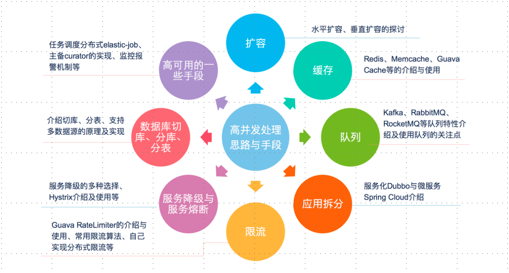
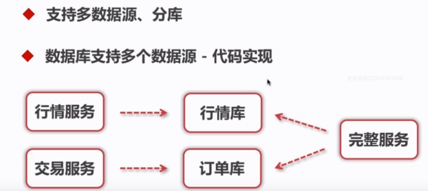
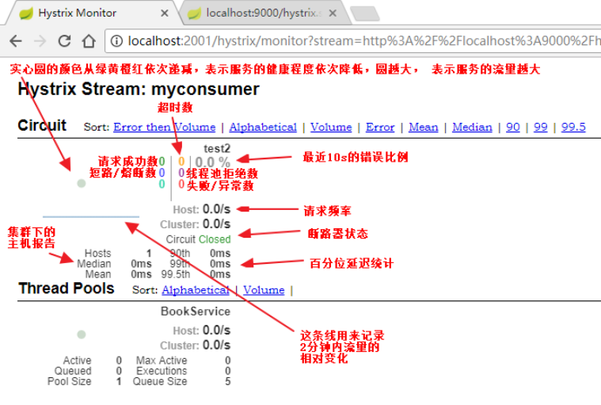

# 8.高并发处理思路和方法

[设计一个高流量高并发的系统](https://mp.weixin.qq.com/s/bD5aVWIV8NQgcBj4cLQ19Q)

## 1.扩容

我们将扩容分为垂直扩容和水平扩容

垂直扩容：就是在单体机器上进行的，比如升级CPU，增加内存等

水平扩容：是指多个机器或者服务上的，比如多启动一个服务等，应用服务器与数据服务器。集群等

### 1.1.数据库扩容

系统读的操作非常多的话，可以对读取进行扩容（垂直扩容）：比如使用memcache、redis、CDN等缓存。

系统写的操作非常多的话，可以对写进行扩容（水平扩容）：Cassandra,Hbase等。

## 2.缓存

### 2.1.应用使用流程

### 2.2.缓存特征

命中率：

> 对于实时性要求不高的业务场景使用使用缓存
>
> 设计缓存：缓存的粒度设计的越细越好，缓存的时间越长，命中率越高
>
> 缓存的容器大小和基础设施，单机还是集群

清空策略：

> FIFO：在缓存容量到达临界值时，最先存储的数据最先被清除
>
> LFU：最少使用策略，无论过期时间，以使用次数最少的缓存开始清除

****LRU：最近最少使用策略，无论过期时间，以最近一个使用时间为依据，清除使用最近使用时间最早的

> 过期时间：就是过期了就被清除
>
> 随机：随机清除缓存

### 2.3.缓存命中率影响因素

1.
业务场景和业务需求：适合读多写少的场景，并且适用于实时性要求不高的需求中。即使是实时性要求高但是并发也很高的场景中，也可以使用缓存，这个时候缓存的有效期可能比较短。

2.
缓存的粒度和策略：保持的数据key越精确，比如一个key只保存一个用户的基础数据，就比将所有用户的基础数据保持在一个list的缓存中要好写。更新缓存比移除缓存好些。

3.
缓存的容量和基础设施。现在LRU的使用场景就很多，使用集群的提供容量的扩展性。

### 2.4.缓存工具分类

本地缓存：编码实现（成员变量、局部变量、静态变量等）、Guava
Cache、hibernate的一二级缓存

分布式缓存：memcache、redis等

#### 2.4.1.Guava Cache

#### 2.4.2.Memcache

限制：

1. 一个slab_class存放数据最大为1M
2. 一个key的长度是250Byte
3. 不支持遍历所有的key

#### 2.4.3.Redis

数据类型多，可单机、可集群，扩展性强，支持数据持久化，支持原子性操作，事务Redis内部设计有强大合理的内存结构。

### 2.5.高并发场景下出现的缓存问题

- 缓存一致性
- 缓存并发
- 缓存穿透现象
- 缓存的雪崩现象。解决方案，可以参考redis中的解决方案

#### 2.5.1.缓存一致性

方案1	数据实时同步失效

强一致性，更新数据库之后主动淘汰缓存。客户端在请求的时候，更新缓存。
为避免出现缓存的雪崩，更新缓存的过程必须使用同步机制（根据情况采用同步代码块、锁或者是分布式锁等方案），保证同时只有一个请求在访问数据库，
同时为了避免由大量的客户端请求在堆积，也得考虑在读取缓存的时候考虑到服务降级与熔断机制
为了保证数据的一致性，也要加上缓存的失效时间。

	优点：只增量更新，主动的去更新，实时性请
	缺点：需要考虑的场景复杂，容错性查，容易出现灾难性的问题
	场景：适合实时性要求强的场景，比如电商的库存等

方案2  数据准实时更新

准一致性，当数据库的缓存数据更新之后，通过异步的方式更新缓存
比如通过MQ、多线程调用、消息队列等方式进行

	综合了第一和第三方案的优缺点。

方案3  任务调度

采用任务调度，实现数据的最终一致性，按照一定的频率更新

	优点：操作简单，容错性强
	缺点：全量更新，实时性差
	场景：适合实时性没有要求的，比如系统的配置，用户信息等

#### 2.5.2.缓存并发

缓存失效后，大量的请求获得缓存失败，失败后又都去重新生成缓存，这就出现了缓存并发问题。

解决方案：有一个请求在重新生成缓存时，对这个功能上锁。

#### 2.5.3.缓存穿透现象

在高并发的场景中，当某个数据的key没有被命中的时候。为了降级系统的容错率，我们一般的做法是尝试直接读取数据库获得数据。导致大量的请求直接访问到了数据库上，但是数据库、服务器等内存暴涨，CPU使用率居高不下，甚至宕机。

如何避免缓存穿透问题：

1. 允许缓存null。对查询结果为null的数据也保持在缓存中。
2. 对即将到达过期时间的数据，增加拦截器，单独处理。

#### 2.5.4.缓存的雪崩现象

一般是由于缓存节点故障造成的。导致所有的请求打到数据库上。

比如缓存并发、缓存穿透、缓存抖动等，都会导致雪崩。

或者大量的缓存过期时间集中，导致出现周期性雪崩现象。

### 2.6.缓存实例

使用redis和guava cache

1. 采用定时任务，将最新的数据保持在redis中（数据来自第三方或数据库）。
2. guava cache 将过期时间设置为1分钟，并从redis中读取数据进行缓存。

## 3.消息队列

比如发生短信、下订单等操作都适合使用消息队列

### 3.1.特征

1. 与业务无关，只做消息的分发
2. FIFO:按序执行
3. 容灾：节点动态增删、消息持久化
4. 高吞吐

### 3.2.优势

相对于多个系统之间，实时性要求不高。

1. 业务解耦
2. 数据一致性

> 主要指两个方面：强一致性（例如分布式事务，成本高，落地难）；最终一致性，采用补偿的方式去处理。
>
> 比如kafka本身的设计就会有丢失消息的场景，所以kafka多用于存储日志。

3.广播

4.错峰和流控

### 3.3.Kafka

### 3.4.RabbitMQ

## 4.应用拆分

很多时候，单个服务器无论怎么样优化，其性能都会出现瓶颈。所以使用了扩容、缓存、消息队列等进行优化。为了提供扩展行，我们将服务拆分成多个系统。

### 4.1.实例

系统初始的时候，只有一个大的系统，不同的业务线之间有不同的使用情况，比如用户信息相关的功能，也只有用户登录的时候使用一次，每天使用到的次数很少，而股票行情查询的功能，每秒并发量大于1W。

原来的系统中一旦发现问题，直接导致整个系统无法使用。

我们基于模块将系统拆分为5个应用。其中用户中心使用量很少，开启一个服务节点即可，行情中心并发很多，可以开启5个甚至更多的节点(每个节点都是一台机器)进行扩容。应用直接使用dubbo进行数据交互

弊端：应用拆分后，直接将应用的管理变得很复杂。服务器数量提升成本增加。网络开销更大（主要是对局域网内部）。

### 4.2.原则

- 业务优先：

- 循序渐进: 小步拆分，边拆分边测试，保证整体功能的完整性。

- 兼顾技术：重构、分层。应用拆分的代价十分昂贵，直接导致人力成本、运维成本、管理成本大幅度提升，不能为了拆分而拆分。

- 可靠性测试

目前初创公司的普遍模式

第一步：组建开发团队，开发蓝本系统(所有的功能都在一个系统中，作为业务的摸索，试探)

第二步：业务迭代，线上系统反馈，持续集成，一直到系统无法满足线上需求

第三步：根据业务需求，尝试性的进行第一次的系统重构，扩大开发团队，每个小组负责不同的拆分出来的应用。

第四步。。。第N步：不同的重复第三步。逐渐形成一个庞大完整的业务系统。

### 4.3.分层思路

- 应用之间如何通讯：使用RPC(dubbo，thrift)，消息队列，http，webSerivces等

- 数据库设计：每个应用都应用使用各自的数据库

- 尽量避免跨应用的事务

- 数据一致性和性能瓶颈

### 4.4.微服务

用于后台无状态的请求处理。

## 5.应用限流

不是指流量Byte,而是相同代码的使用次数。

在一个高并发系统中对流量的把控是非常重要的，当巨大的流量直接请求到我们的服务器上没多久就可能造成接口不可用，不处理的话甚至会造成整个应用不可用。

比如最近就有个这样的需求，我作为生产者要向kafka生产数据，而kafka的消费者则再源源不断的消费数据，并将消费的数据全部请求到web服务器，虽说做了负载(有4台web服务器)但业务数据的量也是巨大的，每秒钟可能有上万条数据产生。如果生产者直接生产数据的话极有可能把web服务器拖垮。

对此就必须要做限流处理，每秒钟生产一定限额的数据到kafka，这样就能极大程度的保证web的正常运转。

其实不管处理何种场景，本质都是降低流量保证应用的高可用。

### 5.1.常使用的限流算法

#### 5.1.1.漏桶算法

漏桶算法比较简单，就是将流量放入桶中，漏桶同时也按照一定的速率流出，如果流量过快的话就会溢出(漏桶并不会提高流出速率)。溢出的流量则直接丢弃。这种做法简单粗暴。漏桶算法虽说简单，但却不能应对实际场景，比如突然暴增的流量。

#### 5.1.2.令牌桶算法（常见）

令牌桶是对漏桶算法的升级。令牌桶会以一个恒定的速率向固定容量大小桶中放入令牌，当有流量来时则取走一个或多个令牌。当桶中没有令牌则将当前请求丢弃或阻塞。相比之下令牌桶可以应对一定的突发流量。

代码实现：下面是基于单个应用的限流。对于分布式应用的话，还是推荐使用Redis进行限流。

对于令牌桶的代码实现，可以直接使用Guava包中的RateLimiter。

代码可以看出以每秒向桶中放入两个令牌，请求一次消耗一个令牌。所以每秒钟只能发送两个请求。按照图中的时间来看也确实如此(返回值是获取此令牌所消耗的时间，差不多也是每500ms一个)。

使用RateLimiter有几个值得注意的地方:

允许先消费，后付款，意思就是它可以来一个请求的时候一次性取走几个或者是剩下所有的令牌甚至多取，但是后面的请求就得为上一次请求买单，它需要等待桶中的令牌补齐之后才能继续获取令牌。

针对于单个应用的限流 RateLimiter 够用了，如果是分布式环境可以借助 Redis
来完成。

#### 5.1.3.计算器法

#### 5.1.4.滑动窗口

## 6.数据库

### 6.1.数据库的瓶颈

> 1.单个数据库数据量太大（1T~2T），推荐使用多个库
>
> 2.单个数据库服务器的压力太大，读写瓶颈，推荐使用多个库，做读写分离
>
> 3.单个表的数据量过大，读写瓶颈，创建索引效率低，推荐分表

### 6.2.切库

最简单的是一主一从，读写分离，分摊压力。

我们一般是自行使用代码实现切库的代码

### 6.3.分表

横向分表，一个表中字段数量很大，可以讲其中热数据字段和冷数据字段分离。

纵向分表，按照时间、编号、名称等规则进行分表

数据库分表工具：mybatis的分表插件shardbatis2.0。

## 7.服务降级与服务熔断

### 7.1.服务降级

自动降级：

> 超时，求情时间大于超时时间，服务器返回相应的数据。比如设置dubbo超时时间
>
> 失败次数，对于调用不稳定的API在累计达到一定次数后，进行降级处理
>
> 故障，比如数据库断开、缓存失效等，返回默认的数据
>
> 限流，限制流量

人工降级：秒杀、双11。

### 7.2.服务熔断

某个服务发生异常，调用者进行保护的一种方式

### 7.3.Hystrix

## 8.高可用

1.任务调度分布式系统：elastic-job（当当开源）+zookeeper，xxx-job

2.主备切换： apache curator + zookeeper分布式锁实现。

curator
是Apache顶级项目，可以实现session超时重连、主从选择、分布式计算器、分布式锁等

3.监控警报机制

## 9.处理高并发常见解决思路

常见思路，缓存、异步、限流、分流

缓存：将不经常变化的数据，进程缓存，比如Redis，本地缓存，cdn缓存，客户端缓存等

异步：处理请求过多，对于没有实时性要求的，可以使用异步的方式进行削峰,提高吞吐量，比如mq

限流：是一种降级方案，对于访问量太大的时候，可以对超出的部分进行控制

分流：降低单个服务的访问量，可以按照AKF拆分原则（考虑是根据业务拆分还是多实例部署）。数据库的话可以使用读写分离的方式。

### 9.1.真正能支撑高并发以及高可用的复杂系统中的缓存架构有哪些东西？

（1）如何让redis集群支撑几十万QPS高并发+99.99%高可用+TB级海量数据+企业级数据备份与恢复？：redis企业级集群架构

（2）如何支撑高性能以及高并发到极致？同时给缓存架构最后的安全保护层？：(nginx+lua)+redis+ehcache的三级缓存架构

（3）高并发场景下，如何解决数据库与缓存双写的时候数据不一致的情况？：企业级的完美的数据库+缓存双写一致性解决方案

（4）如何解决大value缓存的全量更新效率低下问题？：缓存维度化拆分解决方案

（5）如何将缓存命中率提升到极致？：双层nginx部署架构，以及lua脚本实现的一致性hash流量分发策略

（6）如何解决高并发场景下，缓存重建时的分布式并发重建的冲突问题？：基于zookeeper分布式锁的缓存并发重建解决方案

（7）如何解决高并发场景下，缓存冷启动MySQL瞬间被打死的问题？：基于storm实时统计热数据的分布式快速缓存预热解决方案

（8）如何解决热点缓存导致单机器负载瞬间超高？：基于storm的实时热点发现，以及毫秒级的实时热点缓存负载均衡降级

（9）如何解决分布式系统中的服务高可用问题？避免多层服务依赖因为少量故障导致系统崩溃？：基于hystrix的高可用缓存服务，资源隔离+限流+降级+熔断+超时控制

（10）如何应用分布式系统中的高可用服务的高阶技术？：基于hystrix的容错+多级降级+手动降级+生产环境参数优化经验+可视化运维与监控

（11）如何解决恐怖的缓存雪崩问题？避免给公司带来巨大的经济损失？：独家的事前+事中+事后三层次完美解决方案

（12）如何解决高并发场景下的缓存穿透问题？避免给MySQL带来过大的压力？：缓存穿透解决方案

（13）如何解决高并发场景下的缓存失效问题？避免给redis集群带来过大的压力？：缓存失效解决方案

### 9.2.一个秒杀系统的设计思考

案例：[https://mp.weixin.qq.com/s/ijw9_TudDTYg7Nyrc2NmMA](https://mp.weixin.qq.com/s/ijw9_TudDTYg7Nyrc2NmMA)

[https://developer.51cto.com/art/201909/602864.htm](https://developer.51cto.com/art/201909/602864.htm)

一个秒杀系统要满足3个基本要求:高并发、高一致、高可用

解决的问题主要是两个：并发读、并发写

思考顺序如下，客户端→代理层→应用层→数据库→压力测试：

客户端 90% 静态 HTML+10% 动态 JS;配合 CDN 做好缓存工作。

接入层专注于过滤和限流。

应用层利用缓存+队列+分布式处理好订单。

做好数据的预估，隔离，合并。
