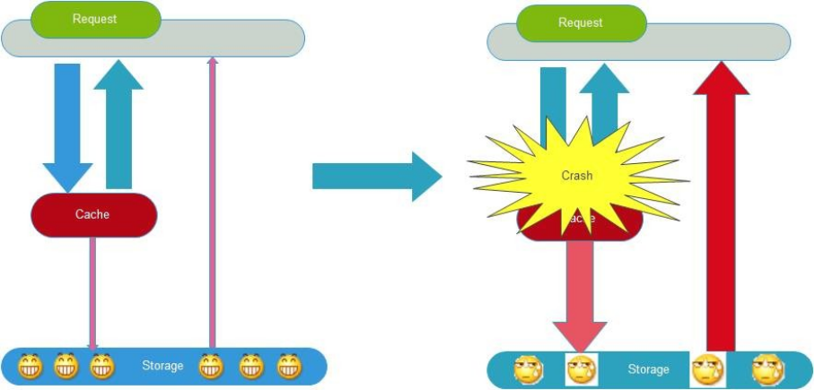

# 8.高并发处理思路和方法

[设计一个高流量高并发的系统](https://mp.weixin.qq.com/s/bD5aVWIV8NQgcBj4cLQ19Q)

## 1.扩容

我们将扩容分为垂直扩容和水平扩容

垂直扩容：就是在单体机器上进行的，比如升级CPU，增加内存等

水平扩容：是指多个机器或者服务上的，比如多启动一个服务等，应用服务器与数据服务器。集群等

### 1.1.数据库扩容

系统读的操作非常多的话，可以对读取进行扩容（垂直扩容）：比如使用memcache、redis、CDN等缓存。

系统写的操作非常多的话，可以对写进行扩容（水平扩容）：Cassandra,Hbase等。

## 2.缓存

### 2.1.应用使用流程

### 2.2.缓存特征

对于实时性要求不高且变化慢的数据可以使用缓存

命中率：命中率越高，缓存设计越好。

清空策略：
- FIFO：在缓存容量到达临界值时，最先存储的数据最先被清除
- LFU：最少使用策略，无论过期时间，以使用次数最少的缓存开始清除
- LRU：最近最少使用策略，无论过期时间，以最近一个使用时间为依据，清除使用最近使用时间最早的
- TTL：过期时间，就是过期了就被清除
- 随机：随机清除缓存

### 2.3.缓存命中率影响因素

1. 业务场景和业务需求：适合读多写少的场景，并且适用于实时性要求不高的需求中。即使是实时性要求高但是并发也很高的场景中，也可以使用缓存，这个时候缓存的有效期可能比较短。
2. 缓存的粒度和策略：保持的数据key越精确，比如一个key只保存一个用户的基础数据，就比将所有用户的基础数据保持在一个list的缓存中要好写。更新缓存比移除缓存好些。
3. 缓存的容量和基础设施。现在LRU的使用场景就很多，使用集群的提供容量的扩展性。

### 2.4.缓存工具分类

- 本地缓存：编码实现（成员变量、局部变量、静态变量等）、Guava Cache、ehcache、coffine、hibernate的一二级缓存
- 分布式缓存：memcache、redis等

#### 2.4.1.Guava Cache

#### 2.4.2.Memcache

限制：

1. 一个slab_class存放数据最大为1M
2. 一个key的长度是250Byte
3. 不支持遍历所有的key

#### 2.4.3.Redis

数据类型多，可单机、可集群，扩展性强，支持数据持久化，支持原子性操作，事务Redis内部设计有强大合理的内存结构。

### 2.5.高并发场景下出现的缓存问题

- 缓存一致性
- 缓存并发
- 缓存穿透现象
- 缓存的雪崩现象。

#### 2.5.1.缓存一致性

只要双写就必然会出现不一致的情况。
- 一致性问题还可以再分为最终一致性和强一致性。缓存是只能尽可能保证最终一致性，如果需要强一致性，就不能使用缓存。
- 一切想要保证一致性的方案都只能降低问题发生的概率，不可能完全解决。

解决方案：
- 首先，采取正确更新策略。重点是不要双写。
- 其次，因为可能存在删除缓存失败的问题，提供补偿措施，例如定时任务。

方案1、数据实时更新【强一致性】

更新数据库之后主动淘汰缓存。其中任意一点失败，则事务回滚，缓存即使失效，也是使用的旧数据。
而客户端在请求的时候，缓存未命中，从数据库查询数据，并加载缓存。

问题：
1. 过程中存在缓存穿透，可能导致缓存雪崩。更新缓存的过程必须使用锁机制，保证同时只有一个请求在访问数据库。
2. 缓存并发：同时为了避免由大量的客户端请求在堆积，也得考虑在读取缓存的时候考虑到服务降级与熔断机制。
   同时为了保证数据的一致性，也要加上缓存的失效时间。
3. 数据库更新和淘汰缓存不能放在同一个事务当中，因为缓存更新时，事务还没完成提交，导致数据不一致。所以必须事务提交之后再淘汰缓存。

- 优点：只增量更新，主动的去更新，实时性强
- 缺点：需要考虑的场景复杂，容错性查，容易出现灾难性的问题
- 场景：实时性要求强的场景，且更新的缓存数量少，并发低。例如个人登录信息、单个商品的信息等。

方案2、数据异步更新【最终一致性】

当数据库的缓存数据更新之后，通过异步的方式更新缓存。比如通过MQ。

注意：必须事务提交之后再淘汰缓存。

方案3、任务调度【最终一致性】

采用任务调度，实现数据的最终一致性，按照一定的频率更新

- 优点：操作简单，容错性强
- 缺点：全量更新，实时性差
- 场景：适合实时性没有要求的，比如系统的配置等全局数据。

方案4、延迟同步【最终一致性】

就是不双写。仅仅写入缓存，用户只使用缓存，数据始终是一致的。而数据通过定时任务，同步到数据库中，进行落地。

例如：电商秒杀场景，库存数量保存到Redis中，秒杀时做自增/自减(incr/decr)，操作成功的抢单成功。Redis仅仅做了最简单的操作。

缺点：对Redis的稳定性有很高的要求，且需要Redis的数据能够持久化。例如tendis底层使用rocketDB存储数据。

#### 2.5.2.缓存并发

缓存失效后，大量的请求获得缓存失败，失败后又都去重新生成缓存，这就出现了缓存并发问题。

解决方案：有一个请求在重新生成缓存时，对这个功能上锁。

#### 2.5.3.缓存穿透

在高并发的场景中，当某个数据的key没有被命中的时候，为了降级系统的容错率，我们一般的做法是尝试直接读取数据库获得数据。

如何避免缓存穿透问题：
1. 互斥锁。缓存失效的时候，先去获得锁，得到锁了，再去请求数据库。没得到锁，则休眠一段时间重试【double check】。
2. 快速返回。允许缓存未命中，无论 Key 是否取到值，都直接返回。
3. 合法校验。能够迅速判断Key是否合法有效。如果不合法，则直接返回。例如布隆过滤器。
4. 异步更新。例如Redis设置过期时间是-1，表示永不过期。异步开启线程刷新缓存。

#### 2.5.4.缓存雪崩

即缓存同时大面积未命中，导致大量的请求直接访问到了数据库上，导致数据库、服务器等内存暴涨，CPU使用率居高不下，甚至宕机。

比如缓存并发、缓存穿透、缓存抖动等，都可能导致雪崩。 或者大量的缓存过期时间集中，导致出现周期性雪崩现象。

针对异常情况可以使用服务降级、熔断、限流、多级缓存等进行解决：
- 给缓存的失效时间，加上一个随机值，避免集体失效。
- 使用互斥锁，但是该方案吞吐量明显下降了。
- 缓存预热。项目启动时就加载缓存，防止缓存穿透导致雪崩。
- 多级缓存，比如我们有两个缓存，缓存 A 和缓存 B。缓存 A 的失效时间为 20 分钟，缓存 B 不设失效时间。自己做缓存预热操作。 然后细分以下几个小点：
    - 从缓存 A 读，有则直接返回；
    - A 没有数据，从 B  读数据，直接返回
    - B 没有数据，B异步启动一个更新线程，更新线程同时更新缓存 A 和缓存 B。

#### 2.5.5.热key

热key问题可能导致CPU飙升（主要是因为数据拷贝、处理网络io等）。解决方案：
1. 数据分片。将热点数据分散到多个Redis实例上，避免单个节点负载过高。例如使用Redis cluster。
2. 读写分离。在主从复制的场景下，将读请求分发到从节点上，减轻主节点的压力。
3. 多级缓存。主要是将热key保存到本地缓存中，分摊请求处理压力。
4. 限流和熔断降级。在应用层实现限流和熔断降级机制，防止系统过载和雪崩效应的发生。

发现hot key的方法：按照经验预测、客户端收集（有赞方案）、使用代理收集（Twemproxy）

- 京东热key探测与管理工具：[https://gitee.com/jd-platform-opensource/hotkey](https://gitee.com/jd-platform-opensource/hotkey)
- [【原创】谈谈redis的热key问题如何解决](https://www.cnblogs.com/rjzheng/p/10874537.html)

### 2.6.实践案例

使用redis和guava cache

1. 采用定时任务，将最新的数据保持在redis中（数据来自第三方或数据库）。
2. guava cache 将过期时间设置为1分钟，并从redis中读取数据进行缓存。

## 3.消息队列

比如发生短信、下订单等操作都适合使用消息队列

### 3.1.特征

1. 与业务无关，只做消息的分发
2. FIFO:按序执行
3. 容灾：节点动态增删、消息持久化
4. 高吞吐

### 3.2.优势

相对于多个系统之间，实时性要求不高。

1. 业务解耦
2. 数据一致性

> 主要指两个方面：强一致性（例如分布式事务，成本高，落地难）；最终一致性，采用补偿的方式去处理。
>
> 比如kafka本身的设计就会有丢失消息的场景，所以kafka多用于存储日志。

3.广播

4.错峰和流控

### 3.3.Kafka

### 3.4.RabbitMQ

## 4.应用拆分

很多时候，单个服务器无论怎么样优化，其性能都会出现瓶颈。所以使用了扩容、缓存、消息队列等进行优化。为了提供扩展行，我们将服务拆分成多个系统。

### 4.1.实例

系统初始的时候，只有一个大的系统，不同的业务线之间有不同的使用情况，比如用户信息相关的功能，也只有用户登录的时候使用一次，每天使用到的次数很少，而股票行情查询的功能，每秒并发量大于1W。

原来的系统中一旦发现问题，直接导致整个系统无法使用。

我们基于模块将系统拆分为5个应用。其中用户中心使用量很少，开启一个服务节点即可，行情中心并发很多，可以开启5个甚至更多的节点(每个节点都是一台机器)进行扩容。应用直接使用dubbo进行数据交互

弊端：应用拆分后，直接将应用的管理变得很复杂。服务器数量提升成本增加。网络开销更大（主要是对局域网内部）。

### 4.2.原则

- 业务优先：

- 循序渐进: 小步拆分，边拆分边测试，保证整体功能的完整性。

- 兼顾技术：重构、分层。应用拆分的代价十分昂贵，直接导致人力成本、运维成本、管理成本大幅度提升，不能为了拆分而拆分。

- 可靠性测试

目前初创公司的普遍模式

第一步：组建开发团队，开发蓝本系统(所有的功能都在一个系统中，作为业务的摸索，试探)

第二步：业务迭代，线上系统反馈，持续集成，一直到系统无法满足线上需求

第三步：根据业务需求，尝试性的进行第一次的系统重构，扩大开发团队，每个小组负责不同的拆分出来的应用。

第四步。。。第N步：不同的重复第三步。逐渐形成一个庞大完整的业务系统。

### 4.3.分层思路

- 应用之间如何通讯：使用RPC(dubbo，thrift)，消息队列，http，webSerivces等

- 数据库设计：每个应用都应用使用各自的数据库

- 尽量避免跨应用的事务

- 数据一致性和性能瓶颈

### 4.4.微服务

用于后台无状态的请求处理。

## 5.限流

背景：当巨大的流量直接请求到服务器上没多久就可能造成接口不可用，不处理的话甚至会造成整个应用不可用。

- 限流的目的：为了防止流量大于服务集群的处理能力，造成服务性能降低。其实就是预防恶意访问以及突发的大流量
- 最终目的：吞吐量最大，qps与并发数的平衡。 
- 本质：通过降低流量的手段，提高应用的可用性。

### 5.1.限流算法
- 固定时间窗口法：也叫计数器法，实现简单，每个时间窗口内计数，超过则限流。
  - 缺点：流量其实不均匀，无法应对突发情况，导致流量突刺。
- 滑动时间窗口法：是计数器法的一种优化，降低时间粒度，划分的更细，流量更加均匀。
  - 缺点：实现比较复杂，可以一定程度解决突刺问题，但是在极端情况下任然存在问题，导致系统面临更严重的问题。
- 漏桶算法：固定桶的容量 和 流出桶的速度。处理任意流量更加平滑，使用场景就是流量整形。
  - 缺点：流量太多就会溢出桶，突发流量处理能力较弱。例如nginx就是返回错误。
- 令牌桶算法：固定桶的容量，以固定的速度生产令牌，请求获得令牌就可以通过。
  - 缺点：相比漏桶算法，可以处理一定程度的突发流量。分析以下几种情况：
  - 在流量大于令牌生产速度，小于桶容量时，流量有一定的堆积，效果和漏洞算法一样
  - 突发流量，请求几乎同时获得全部令牌，效果和固定时间窗口法类型，会产生突刺

1. 固定时间窗口法
   
2. 滑动窗口
   
3. 漏桶算法
   
4. 令牌桶算法
   

### 5.2.算法实现
常见的限流算法实现有：
- Guava RateLimiter：Guava中提供了基于令牌桶算法的RateLimiter类，用于限制请求的处理速率。
- Sentinel：阿里巴巴开源的分布式系统流量防卫兵，提供了丰富的流量控制、熔断降级等功能，其内部实现了多种限流算法，包括滑动窗口、漏桶等。
- Hystrix：Netflix开源的用于处理分布式系统的延迟和容错框架，其中也包含了限流功能，具体实现方式可能依赖于其配置和内部机制。
- Resilience4j：一个轻量级的容错库，用于Java应用程序，提供了限流、熔断、重试等功能，具体限流算法实现可能因版本和配置而异。
- Nginx自带限流模块：内置限流模块，实现漏桶算法，限制请求的速度，以及总的总量。

### 5.3.令牌桶算法实现

代码实现：下面是基于单个应用的限流。对于分布式应用的话，还是推荐使用Redis进行限流。

对于令牌桶的代码实现，可以直接使用Guava包中的RateLimiter，针对于单个应用的限流。

代码可以看出以每秒向桶中放入两个令牌，请求一次消耗一个令牌。所以每秒钟只能发送两个请求。按照图中的时间来看也确实如此(返回值是获取此令牌所消耗的时间，差不多也是每500ms一个)。

使用RateLimiter有几个值得注意的地方:

允许先消费，后付款，意思就是它可以来一个请求的时候一次性取走几个或者是剩下所有的令牌甚至多取，但是后面的请求就得为上一次请求买单，它需要等待桶中的令牌补齐之后才能继续获取令牌。

### 5.4.最佳实践

限流只是一种入门的手段，更重要的是被限流后的处理策略，例如：等待、拒绝等。
实际中更多的是结合熔断、降级、队列、缓存等机制来处理突发流量

## 6.分库分表

### 6.1.数据库的瓶颈

> 1.单个数据库数据量太大（1T~2T），推荐使用多个库
>
> 2.单个数据库服务器的压力太大，读写瓶颈，推荐使用多个库，做读写分离
>
> 3.单个表的数据量过大，读写瓶颈，创建索引效率低，推荐分表

### 6.2.切库

最简单的是一主一从，读写分离，分摊压力。

我们一般是自行使用代码实现切库的代码

### 6.3.分表

横向分表，一个表中字段数量很大，可以讲其中热数据字段和冷数据字段分离。

纵向分表，按照时间、编号、名称等规则进行分表

数据库分表工具：mybatis的分表插件shardbatis2.0。

## 7.服务降级与服务熔断

### 7.1.服务降级

自动降级：

> 超时，求情时间大于超时时间，服务器返回相应的数据。比如设置dubbo超时时间
>
> 失败次数，对于调用不稳定的API在累计达到一定次数后，进行降级处理
>
> 故障，比如数据库断开、缓存失效等，返回默认的数据
>
> 限流，限制流量

人工降级：秒杀、双11。

### 7.2.服务熔断

某个服务发生异常，调用者进行保护的一种方式

### 7.3.Hystrix

## 8.高可用

1.任务调度分布式系统：elastic-job（当当开源）+zookeeper，xxx-job

2.主备切换： apache curator + zookeeper分布式锁实现。

curator
是Apache顶级项目，可以实现session超时重连、主从选择、分布式计算器、分布式锁等

3.监控警报机制

## 9.处理高并发常见解决思路

常见思路，缓存、异步、限流、分流

缓存：将不经常变化的数据，进程缓存，比如Redis，本地缓存，cdn缓存，客户端缓存等

异步：处理请求过多，对于没有实时性要求的，可以使用异步的方式进行削峰,提高吞吐量，比如mq

限流：是一种降级方案，对于访问量太大的时候，可以对超出的部分进行控制

分流：降低单个服务的访问量，可以按照AKF拆分原则（考虑是根据业务拆分还是多实例部署）。数据库的话可以使用读写分离的方式。

### 9.1.真正能支撑高并发以及高可用的复杂系统中的缓存架构有哪些东西？

（1）如何让redis集群支撑几十万QPS高并发+99.99%高可用+TB级海量数据+企业级数据备份与恢复？：redis企业级集群架构

（2）如何支撑高性能以及高并发到极致？同时给缓存架构最后的安全保护层？：(nginx+lua)+redis+ehcache的三级缓存架构

（3）高并发场景下，如何解决数据库与缓存双写的时候数据不一致的情况？：企业级的完美的数据库+缓存双写一致性解决方案

（4）如何解决大value缓存的全量更新效率低下问题？：缓存维度化拆分解决方案

（5）如何将缓存命中率提升到极致？：双层nginx部署架构，以及lua脚本实现的一致性hash流量分发策略

（6）如何解决高并发场景下，缓存重建时的分布式并发重建的冲突问题？：基于zookeeper分布式锁的缓存并发重建解决方案

（7）如何解决高并发场景下，缓存冷启动MySQL瞬间被打死的问题？：基于storm实时统计热数据的分布式快速缓存预热解决方案

（8）如何解决热点缓存导致单机器负载瞬间超高？：基于storm的实时热点发现，以及毫秒级的实时热点缓存负载均衡降级

（9）如何解决分布式系统中的服务高可用问题？避免多层服务依赖因为少量故障导致系统崩溃？：基于hystrix的高可用缓存服务，资源隔离+限流+降级+熔断+超时控制

（10）如何应用分布式系统中的高可用服务的高阶技术？：基于hystrix的容错+多级降级+手动降级+生产环境参数优化经验+可视化运维与监控

（11）如何解决恐怖的缓存雪崩问题？避免给公司带来巨大的经济损失？：独家的事前+事中+事后三层次完美解决方案

（12）如何解决高并发场景下的缓存穿透问题？避免给MySQL带来过大的压力？：缓存穿透解决方案

（13）如何解决高并发场景下的缓存失效问题？避免给redis集群带来过大的压力？：缓存失效解决方案

### 9.2.一个秒杀系统的设计思考

案例：[https://mp.weixin.qq.com/s/ijw9_TudDTYg7Nyrc2NmMA](https://mp.weixin.qq.com/s/ijw9_TudDTYg7Nyrc2NmMA)

[https://developer.51cto.com/art/201909/602864.htm](https://developer.51cto.com/art/201909/602864.htm)

一个秒杀系统要满足3个基本要求:高并发、高一致、高可用

解决的问题主要是两个：并发读、并发写

思考顺序如下，客户端→代理层→应用层→数据库→压力测试：

客户端 90% 静态 HTML+10% 动态 JS;配合 CDN 做好缓存工作。

接入层专注于过滤和限流。

应用层利用缓存+队列+分布式处理好订单。

做好数据的预估，隔离，合并。
