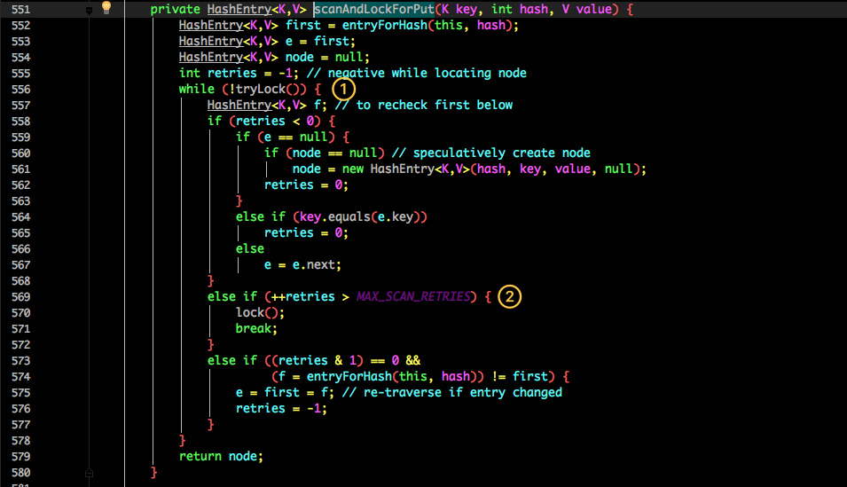

# 源码分析：ConcurrentHashMap

## 1.concurrentHashMap

ConcurrentHashMap 同样也分为 1.7 、1.8 版，两者在实现上略有不同。

## 2.JDK1.7实现方式

先来看看 1.7 的实现，下面是他的结构图：


如图所示，是由 Segment 数组、HashEntry 组成，和 HashMap 一样，仍然是数组加链表。

它的核心成员变量：
```java
/**
 * Segment 数组，存放数据时首先需要定位到具体的 Segment 中。
 */
final Segment<K,V>[] segments;
transient Set<K> keySet;
transient Set<Map.Entry<K,V>> entrySet;
Segment 是 ConcurrentHashMap 的一个内部类，主要的组成如下：

static final class Segment<K,V> extends ReentrantLock implements Serializable {
    private static final long serialVersionUID = 2249069246763182397L;
    
    // 和 HashMap 中的 HashEntry 作用一样，真正存放数据的桶
    transient volatile HashEntry<K,V>[] table;
    transient int count;
    transient int modCount;
    transient int threshold;
    final float loadFactor;
}
```

看看其中 HashEntry 的组成：


和 HashMap 非常类似，唯一的区别就是其中的核心数据如 value ，以及链表都是 volatile 修饰的，保证了获取时的可见性。

### 2.1.实现原理

ConcurrentHashMap 采用了分段锁技术，其中 Segment 继承于ReentrantLock。
不会像 HashTable 那样不管是 put 还是 get 操作都需要做同步处理，理论上 ConcurrentHashMap 支持 CurrencyLevel
(Segment 数组数量)的线程并发。每当一个线程占用锁访问一个 Segment 时，不会影响到其他的 Segment。

下面也来看看核心的 put get 方法。

### 2.2.put 方法
```java
public V put(K key, V value) {
    Segment<K,V> s;
    if (value == null)
        throw new NullPointerException();
    int hash = hash(key);
    int j = (hash >>> segmentShift) & segmentMask;
    if ((s = (Segment<K,V>)UNSAFE.getObject          // nonvolatile; recheck
         (segments, (j << SSHIFT) + SBASE)) == null) //  in ensureSegment
        s = ensureSegment(j);
    return s.put(key, hash, value, false);
}
```

首先是通过 key 定位到 Segment，之后在对应的 Segment 中进行具体的 put。
```java
final V put(K key, int hash, V value, boolean onlyIfAbsent) {
    HashEntry<K,V> node = tryLock() ? null :
        scanAndLockForPut(key, hash, value);
    V oldValue;
    try {
        HashEntry<K,V>[] tab = table;
        int index = (tab.length - 1) & hash;
        HashEntry<K,V> first = entryAt(tab, index);
        for (HashEntry<K,V> e = first;;) {
            if (e != null) {
                K k;
                if ((k = e.key) == key ||
                    (e.hash == hash && key.equals(k))) {
                    oldValue = e.value;
                    if (!onlyIfAbsent) {
                        e.value = value;
                        ++modCount;
                    }
                    break;
                }
                e = e.next;
            }
            else {
                if (node != null)
                    node.setNext(first);
                else
                    node = new HashEntry<K,V>(hash, key, value, first);
                int c = count + 1;
                if (c > threshold && tab.length < MAXIMUM_CAPACITY)
                    rehash(node);
                else
                    setEntryAt(tab, index, node);
                ++modCount;
                count = c;
                oldValue = null;
                break;
            }
        }
    } finally {
        unlock();
    }
    return oldValue;
}
```

虽然 HashEntry 中的 value 是用 volatile 关键词修饰的，但是并不能保证并发的原子性，所以 put 操作时仍然需要加锁处理。

首先第一步的时候会尝试获取锁，如果获取失败肯定就有其他线程存在竞争，则利用 scanAndLockForPut() 自旋获取锁。



1. 尝试自旋获取锁。
2. 如果重试的次数达到了 MAX_SCAN_RETRIES 则改为阻塞锁获取，保证能获取成功。


再结合图看看 put 的流程。

1. 将当前 Segment 中的 table 通过 key 的 hashcode 定位到 HashEntry。
2. 遍历该 HashEntry，如果不为空则判断传入的 key 和当前遍历的 key 是否相等，相等则覆盖旧的 value。
3. 不为空则需要新建一个 HashEntry 并加入到 Segment 中，同时会先判断是否需要扩容。
4. 最后会解除在 1 中所获取当前 Segment 的锁。

### 2.3.get 方法
```java
public V get(Object key) {
    Segment<K,V> s; // manually integrate access methods to reduce overhead
    HashEntry<K,V>[] tab;
    int h = hash(key);
    long u = (((h >>> segmentShift) & segmentMask) << SSHIFT) + SBASE;
    if ((s = (Segment<K,V>)UNSAFE.getObjectVolatile(segments, u)) != null &&
        (tab = s.table) != null) {
        for (HashEntry<K,V> e = (HashEntry<K,V>) UNSAFE.getObjectVolatile
                 (tab, ((long)(((tab.length - 1) & h)) << TSHIFT) + TBASE);
             e != null; e = e.next) {
            K k;
            if ((k = e.key) == key || (e.hash == h && key.equals(k)))
                return e.value;
        }
    }
    return null;
}
```

get 逻辑比较简单：

只需要将 Key 通过 Hash 之后定位到具体的 Segment ，再通过一次 Hash定位到具体的元素上。

由于 HashEntry 中的 value 属性是用 volatile关键词修饰的，保证了内存可见性，所以每次获取时都是最新值。

ConcurrentHashMap 的 get 方法是非常高效的，因为整个过程都不需要加锁。

## 3.JDK1.8实现方式

1.8 在 1.7 的数据结构上做了大的改动，采用红黑树之后可以保证查询效率（O(logn)），
甚至取消了 ReentrantLock 改为了 synchronized，这样可以看出在新版的 JDK 中对 synchronized 优化是很到位的。

1.7 已经解决了并发问题，并且能支持 N 个 Segment这么多次数的并发，但依然存在 HashMap 在 1.7 版本中的问题。

那就是查询遍历链表效率太低。

因此 1.8 做了一些数据结构上的调整。

首先来看下底层的组成结构：


### 3.1.实现原理

看起来是不是和 1.8 HashMap 结构类似？

其中抛弃了原有的 Segment 分段锁，而采用了 CAS + synchronized 来保证并发安全性。


也将 1.7 中存放数据的 HashEntry 改为 Node，但作用都是相同的。其中的 val next 都用了 volatile 修饰，保证了可见性。

### 3.2.put 方法

重点来看看 put 函数：


1.  根据 key 计算出 hashcode 。
2.  判断是否需要进行初始化。
3.  f 即为当前 key 定位出的 Node，如果为空表示当前位置可以写入数据，利用 CAS 尝试写入，失败则自旋保证成功。
4.  如果当前位置的 hashcode == MOVED == -1,则需要进行扩容。
5.  如果都不满足，则利用 synchronized 锁写入数据。
6.  如果数量大于 TREEIFY_THRESHOLD 则要转换为红黑树。

### 3.3.get 方法

#### 3.3.1.源码
```java
//会发现源码中没有一处加了锁
public V get(Object key) {
    Node[] tab; Nodee, p; int n, eh; K ek;
    int h = spread(key.hashCode()); //计算hash
    if ((tab = table) != null && (n = tab.length) > 0 &&
      (e = tabAt(tab, (n - 1) & h)) != null) {//读取首节点的Node元素
        if ((eh = e.hash) == h) { //如果该节点就是首节点就返回，这个地方可能map正在扩容。
            if ((ek = e.key) == key || (ek != null && key.equals(ek)))
                return e.val;
        }
        //hash值为负值表示正在扩容，这个时候查的是ForwardingNode的find方法来定位到nextTable来
        //eh=-1，说明该节点是一个ForwardingNode，正在迁移，此时调用ForwardingNode的find方法去nextTable里找。
        //eh=-2，说明该节点是一个TreeBin，此时调用TreeBin的find方法遍历红黑树，由于红黑树有可能正在旋转变色，所以find里会有读写锁。
        //eh>=0，说明该节点下挂的是一个链表，直接遍历该链表即可。
        else if (eh < 0)
            return (p = e.find(h, key)) != null ? p.val : null;
        while ((e = e.next) != null) {//既不是首节点也不是ForwardingNode，那就往下遍历
            if (e.hash == h &&
             ((ek = e.key) == key || (ek != null && key.equals(ek))))
                 return e.val;
        }
    }
    return null;
}
```

#### 3.3.2.步骤分析

通过看源码可以看出，get方法基本分为3个步骤

- 第一步：计算hash值，定位到table的位置，如果该位置的首节点就是想要的值，便直接返回数据与hashMap一样的计算公式：
```java
// 这个HASH_BITS其实就是Integer.MAX_VALUE，为了控制map的长度
static final int HASH_BITS = 0x7fffffff; // usable bits of normal node hash
static final int spread(int h) {
	return (h ^ (h >>> 16)) & HASH_BITS;
}
```

- 第二步：如果不是首节点，就要当前节点的状态了，主要是看eh的值是-1,-2,-3还是正数。如果eh<5的话，就会调用find方法。
  这个find方法根据不同的节点状态有不同的实现方式，在ConcurrentHashMap中有5种实现方式。


    
```text
eh=-1，说明该节点是一个ForwardingNode，正在迁移，此时调用ForwardingNode的find方法去nextTable里找。
eh=-2，说明该节点是一个TreeBin，此时调用TreeBin的find方法遍历红黑树，由于红黑树有可能正在旋转变色，所以find里会有读写锁。
eh=-3，是预留出来的对象一般就是临时创建出来的，不会出现在get方法中。
```

    

- 第三步：eh>=0，说明该节点下挂的是一个链表，直接遍历该链表即可

#### 3.3.3.读操作不需要加锁

[https://mp.weixin.qq.com/s/h1twXuPJzQPvslIGuZOGbw](https://mp.weixin.qq.com/s/h1twXuPJzQPvslIGuZOGbw)

第一个原因：使用了volatile关键字保证了对象的可见性、有序性，但无法保证原子性。这样就能在某一个线程修改数据后，强制将的数据立即写入到主内存中，并使得其他线程该数据的缓存副本无效，其他的线程在查询该数据的时候，就会从主内存中拉取的最新的数据了。

第二个原因：volatile加到了保存数据的table[]上面，以及Node节点的的val，next。数组加volatile修饰，对get方法没有效果，是用于put方法中保证在数组扩容的时候保证可见性。而在Node的属性上加修饰，是为了再扩容或者转红黑树的时候，next可能会发生变化，所有需要对其他线程是可见的。

1.8中ConcurrentHashMap的get操作全程不需要加锁，这也是它比其他并发集合如hashtable、用Collections.synchronizedMap()包装的hashmap;安全效率高的原因之一。

### 3.4.关于红黑树

- 为什么要转换:这个问题比较简单，因为Map中桶的元素初始化是链表保存的，其查找性能是O(n)，而树结构能将查找性能提升到O(log(n))。
  当链表长度很小的时候，即使遍历，速度也非常快，但是当链表长度不断变长，肯定会对查询性能有一定的影响，所以才需要转成树。

- 为什么阈值是8：在HashMap中有一段Implementation notes
```text
This map usually acts as a binned (bucketed) hash table, but
when bins get too large, they are transformed into bins of TreeNodes,
each structured similarly to those in java.util.TreeMap

大概含义是当bin变得很大的时候，就会被转换成TreeNodes中的bin，其结构和TreeMap相似，也就是红黑树

Because TreeNodes are about twice the size of regular nodes, we
use them only when bins contain enough nodes to warrant use
(see TREEIFY_THRESHOLD). And when they become too small (due to
removal or resizing) they are converted back to plain bins.  In
usages with well-distributed user hashCodes, tree bins are
rarely used.  Ideally, under random hashCodes, the frequency of
nodes in bins follows a Poisson distribution
(http://en.wikipedia.org/wiki/Poisson_distribution) with a
parameter of about 0.5 on average for the default resizing
threshold of 0.75, although with a large variance because of
resizing granularity. Ignoring variance, the expected
occurrences of list size k are (exp(-0.5)*pow(0.5, k)/factorial(k)). 
The first values are:
0:    0.60653066
1:    0.30326533
2:    0.07581633
3:    0.01263606
4:    0.00157952
5:    0.00015795
6:    0.00001316
7:    0.00000094
8:    0.00000006
more: less than 1 in ten million
```

继续往下看，TreeNodes占用空间是普通Nodes的两倍，所以只有当bin包含足够多的节点时才会转成TreeNodes，而是否足够多就是由TREEIFY_THRESHOLD的值决定的。当bin中节点数变少时，又会转成普通的bin。并且我们查看源码的时候发现，链表长度达到8就转成红黑树，当长度降到6就转成普通bin。

这样就解析了为什么不是一开始就将其转换为TreeNodes，而是需要一定节点数才转为TreeNodes，说白了就是trade-off，空间和时间的权衡

当hashCode离散性很好的时候，树型bin用到的概率非常小，因为数据均匀分布在每个bin中，几乎不会有bin中链表长度会达到阈值。但是在随机hashCode下，离散性可能会变差，然而JDK又不能阻止用户实现这种不好的hash算法，因此就可能导致不均匀的数据分布。不过理想情况下随机hashCode算法下所有bin中节点的分布频率会遵循泊松分布，我们可以看到，一个bin中链表长度达到8个元素的概率为0.00000006，几乎是不可能事件。所以，之所以选择8，不是拍拍屁股决定的，而是根据概率统计决定的。由此可见，发展30年的Java每一项改动和优化都是非常严谨和科学的。

总结：
1.  从时间复杂度上解释：（当然这个是牺牲空间换来的）
    - 红黑树的平均查找长度是log(n)，如果长度为8，平均查找长度为log(8)=3，链表的平均查找长度为n/2，当长度为8时，平均查找长度为8/2=4，这才有转换成树的必要；
    - 链表长度如果是小于等于6，6/2=3，而log(6)=2.6，虽然速度也很快的，但是转化为树结构和生成树的时间并不会太短。
2.  从概率学上解释
    首先数据结构在设计的时候，设计了加载因子0.75 以及扩容的倍数，就是在概率学的基础上，想在时间空间两个维度进行平衡得出的结论。
    所以链表长度达到8的概率，在理想的状态下几乎为0。在我们平时使用一些离散型比较好的类型作为key的时候，转为红黑树的概率很低

## 4.实现方式改变的思路

在jdk1.7的时候，实现的方式是Segment + hashEntry + ReentrantLock的方式，实现的方式非常的臃肿。

所有在1.8的时候，Oracle将实现的方式改为Node + CAS + synchronized，主要也是因为synchronized已经被优化的很好了。

- 新的实现方式的好处：锁的控制粒度降低了，1.7是基于segment的，一个segment中是包含多个hashEntry的。
  而新的实现方式的控制的粒度是单个的hashEntry。在高并发的场景下，效率会更高些。
- 1.8的实现方式和数据结构更加简单，操作也更加的清晰，各自操作的实现也变得不再复杂。
- 1.8使用红黑树来优化链表，代替长链表，提高的查询效率。

## 5.总结

看完了整个 HashMap 和 ConcurrentHashMap 在 1.7 和 1.8 中不同的实现方式相信大家对他们的理解应该会更加到位。

其实这块也是面试的重点内容，通常的套路是：

- 谈谈你理解的 HashMap，讲讲其中的 get put 过程。
- 1.8 做了什么优化？
- 是线程安全的嘛？
- 不安全会导致哪些问题？
- 如何解决？有没有线程安全的并发容器？
- ConcurrentHashMap 是如何实现的？ 1.7、1.8 实现有何不同？为什么这么做？

这一串问题相信大家仔细看完都能怼回面试官。

除了面试会问到之外平时的应用其实也蛮多，像之前谈到的 Guava 中 Cache 的实现就是利用 ConcurrentHashMap 的思想。

同时也能学习 JDK 作者大牛们的优化思路以及并发解决方案。
