# 源码分析：HashMap

[https://blog.csdn.net/qq_36520235/article/details/82417949](https://blog.csdn.net/qq_36520235/article/details/82417949)

## 1.HashMap

HashMap是开发中使用最多的map。

### 1.1.数据结构

HashMap采取数组加链表的存储方式来实现。亦即数组（散列桶）中的每一个元素都是链表。

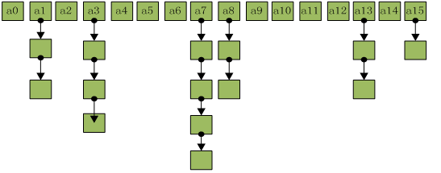


HashMap继承AbstractMap。HashMap性能瓶颈出现在内部数组扩容的时候。在扩容的时候，
HashMap会生成一个新的数组并将原有的元素复制到新的数组中，调用rehash重新生成map的索引。
所以在已知数据量，或已知数据量很大的时候，优先选择使用public HashMap(int initialCapacity, float loadFactor)
或public HashMap(int initialCapacity)初始化容量

### 1.2.Hash算法

分两步：计算hashCode 和 计算数组下标

#### 1.2.1.计算hashCode

首先所有的对象都有一个hashCode值，但是这个值的范围是int。大小不定，所有需要重新计算hashCode

公式： hashCode ^ (hashCode >>> 16)

这样的公式计算的结果，能尽量的保证获得的数组足够随机

HashMap 之所以速度快，因为他使用的是散列表，根据 key 的 hashcode 值生成数组下标（通过内存地址直接查找，没有任何判断）

其时间复杂度完美情况下可以达到O(1)（和数组相同，但是比数组用着爽多了，但是需要多出很多内存，相当于以空间换时间）

#### 1.2.2.计算数组下标

数组默认为16

公式：hashCode & ( 16 - 1) 其实就是 求与16的余数 hashCode % 16

这样的效率更高些

#### 1.2.3.Hash冲突

因为不同的对象计算出来的下标可能是相同的。这样计算多个对象就会保存到同一个位置上，出现hash冲突

为了解决这个问题，就在数组基础上设计成单向链表的结构，加入一个next记录下一个节点。数据结构如下图

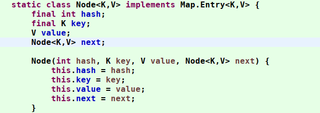

#### 1.2.4.【数学问题】String的hashCode

就是使用 String 的 char 数组的数字每次乘以 31 再叠加最后返回，因此，每个不同的字符串，返回的 hashCode
肯定不一样。这就是为什么我们喜欢使用string作为map的key。

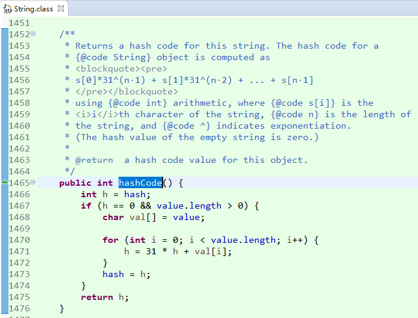


如果有使用 eclipse 的同学肯定知道，该工具默认生成的 hashCode 方法实现也和 String 类型差不多。都是使用的 31

那么有没有想过：为什么要使用 31 呢？

在名著 《Effective Java》第 42 页就有对 hashCode 为什么采用 31 做了说明：

之所以使用 31，是因为他是一个奇素数。如果乘数是偶数，并且乘法溢出的话，信息就会丢失，因为与2相乘等价于移位运算（低位补0）。

使用素数的好处并不很明显，但是习惯上使用素数来计算散列结果。

31 有个很好的性能，即用移位和减法来代替乘法，可以得到更好的性能：31 * i == (i << 5） - i， 
现代的 VM 可以自动完成这种优化。这个公式可以很简单的推导出来。

使用 31 最主要的还是为了性能。当然用 63 也可以。但是 63 的溢出风险就更大了

#### 1.2.5.【数学问题】hash 算法的实现原理

看到下图，我就想问，为什么右移 16 位，为什么要使用 ^ 位异或

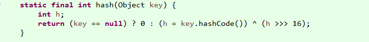

首先，我们使用hashCode是用于定位数组的索引。公式是：first = tab[(n - 1) & hash])

使用数组长度减一 与运算 hash 值。这行代码就是为什么要让前面的 hash 方法移位并异或。

我们分析一下：

首先，假设有一种情况

对象 A 的 hashCode 为 1000010001110001000001111000000

对象 B 的 hashCode 为 0111011100111000101000010100000

如果数组长度是16，也就是 15 与运算这两个数，你会发现结果都是0。这样的散列结果太让人失望了。很明显不是一个好的散列算法。

但是如果我们将 hashCode 值右移 16 位，也就是取 int 类型的一半，刚好将该二进制数对半切开。
并且使用位异或运算（如果两个数对应的位置相反，则结果为1，反之为0），这样的话，就能避免我们上面的情况的发生。

总的来说，使用位移 16 位和 异或 就是防止这种极端情况。

但是，该方法在一些极端情况下还是有问题，比如：10000000000000000000000000 和 1000000000100000000000000
这两个数，如果数组长度是16，那么即使右移16位，在异或，hash值还是会重复。

但是为了性能，对这种极端情况，JDK的作者选择了性能。毕竟这是少数情况，为了这种情况去增加 hash 时间，性价比不高。

#### 1.2.6.【数学问题】为什么使用 & 与运算代替模运算

好了，知道了 hash 算法的实现原理还有他的一些取舍，我们再看看刚刚说的那个根据hash计算下标的方法：

tab[(n - 1) & hash]；

其中 n 是数组的长度。其实该算法的结果和模运算的结果是相同的。但是，对于现代的处理器来说，除法和求余数（模运算）是最慢的动作。

上面情况下和模运算相同呢？

a % b == (b-1) & a ,当b是2的指数时，等式成立。

我们说 & 与运算的定义：与运算 第一个操作数的的第n位于第二个操作数的第n位如果都是1，那么结果的第n为也为1，否则为0；

当 n 为 16 时， 与运算 101010100101001001101 时，也就是

1111 & 101010100101001001000 结果：1000 = 8

1111 & 101000101101001001001 结果：1001 = 9

1111 & 101010101101101001010 结果：1010 = 10

1111 & 101100100111001101100 结果：1100 = 12

可以看到，当 n 为 2 的幂次方的时候，减一之后就会得到 1111*的数字，这个数字正好可以掩码。并且得到的结果取决于 hash 值。

因为 hash 值是1，那么最终的结果也是1 ，hash 值是0，最终的结果也是0。

#### 1.2.7.【数学问题】容量为什么建议是 2的幂次方

到这里，我们提了一个关键的问题：HashMap 的容量为什么建议是 2的幂次方？正好可以和上面的话题接上。楼主就是这么设计的。

为什么要 2 的幂次方呢？

我们说，hash 算法的目的是为了让hash值均匀的分布在桶中（数组），那么，如何做到呢？试想一下，如果不使用 2 的幂次方作为数组的长度会怎么样？

假设我们的数组长度是10，还是上面的公式：

1010 & 101010100101001001000 结果：1000 = 8

1010 & 101000101101001001001 结果：1000 = 8

1010 & 101010101101101001010 结果：1010 = 10

1010 & 101100100111001101100 结果：1000 = 8

看到结果我们惊呆了，这种散列结果，会导致这些不同的key值全部进入到相同的插槽中，形成链表，性能急剧下降。

所以说，我们一定要保证 & 中的二进制位全为 1，才能最大限度的利用 hash 值，并更好的散列，只有全是1 ，才能有更多的散列结果。

如果是 1010，有的散列结果是永远都不会出现的，比如 0111，0101，1111，1110…….，只要 & 之前的数有 0， 对应的 1
肯定就不会出现（因为只有都是1才会为1）。大大限制了散列的范围。

### 1.3.默认值

默认的集合容量大小DEFAULT_INITIAL_CAPACITY=16。

最大容量为2的30次方MAXIMUM_CAPACITY。

默认的加载因子是DEFAULT_LOAD_FACTOR=0.75

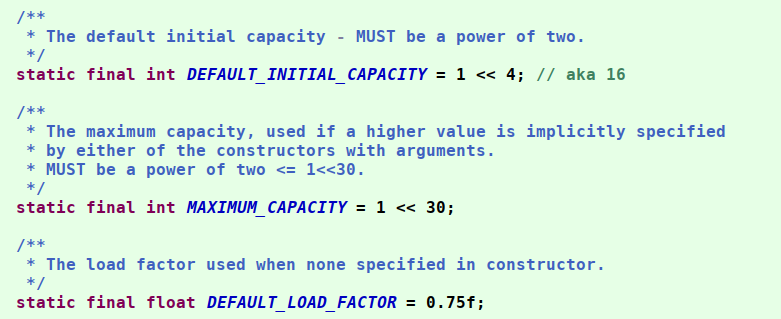

上面3个值是什么意思：

当HashMap中条目的数量达到了容器的75%时，HashMap将进行resize操作以增加桶的数量。
容器数量左移一位进行扩展，比如16 -> 32 -> 64->128->256->512.....

0.75就是进行扩容的触发条件,这个值是综合考虑时间与空间进行的。小于这个比例，可能导致有扩容前剩余很大一部分空间并没有使用，
造成空间上的浪费；大于这个比例的话，hash冲突出现的几率会更高，查询的效率会降低。所有从时间空间两个方面考虑的话（同时也是概率学上的考虑），0.75是比较合理的

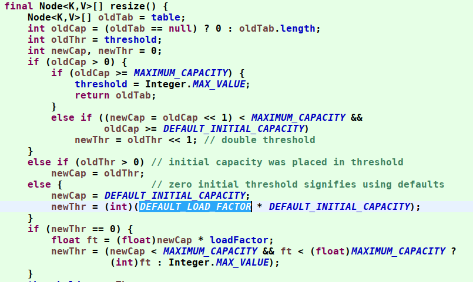

对于HashMap中桶数量的值必须是2的N次幂，而且这个是HashMap强制规定的。这样做的原因就是因为计算机进行2次幂的运算是非常高效的，仅通过位移操作就可以完成2的N次幂的运算。

### 1.4.数据table

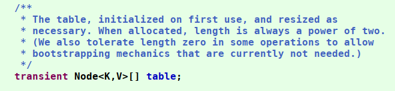


table就是HashMap的存储结构，显然这是一个数组，数组的每一个元素都是一个节点Node。Node是HashMap的一个内部类。
它有如下4个属性：final  K key;V value;Node<K,V> next;int hash。

分别为键、值、指向下一个链表结点的指针、散列（哈希）值，我们成这样的Node为链表结构，所以HashMap的数据结构是链表的数组。
虽然数组是连续的，但是HashMap生成的索引值是不连续的，所以table保存的数据也是不连续的，这就造成了map的无序性。

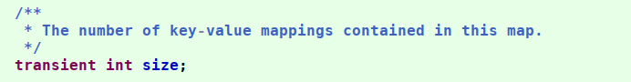

size表示HashMap中条目（即键-值对）的数量。

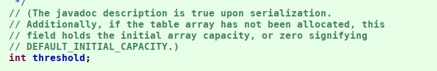

threshold是HashMap的重构阈值，它的值为容量和负载因子的乘积。在HashMap中所有桶中条目的总数量达到了这个重构阈值之后，HashMap将进行resize操作以自动扩容。

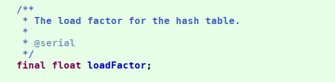

loadFactor表示HashMap的负载因子，它和容量一样都是HashMap扩容的决定性因素。


modCount表示HashMap被结构化更新的次数，比如插入、删除、清空等会更新HashMap结构的操作次数

### 1.5.Map索引

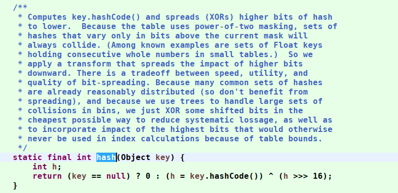


这里的Hash算法本质上就是三步：取key的hashCode值、高位运算、取模运算。

对于任意给定的对象，只要它的hashCode()返回值相同，那么程序调用方法一所计算得到的Hash码值总是相同的。
我们首先想到的就是把hash值对数组长度取模运算，这样一来，元素的分布相对来说是比较均匀的。
但是，模运算的消耗还是比较大的，在HashMap中是这样做的：我们通过h & (table.length -1)来计算该对象应该保存在table数组的哪个索引处。

这个方法非常巧妙，它通过h & (table.length -1)来得到该对象的保存位，而HashMap底层数组的长度总是2的n次方，这是HashMap在速度上的优化。
当length总是2的n次方时，h&(length-1)运算等价于对length取模，也就是h%length，但是&比%具有更高的效率。

在JDK1.8的实现中，优化了高位运算的算法，通过hashCode()的高16位异或低16位实现的：(h = k.hashCode()) ^ (h >>> 16)，
主要是从速度、功效、质量来考虑的，这么做可以在数组table的length比较小的时候，也能保证考虑到高低Bit都参与到Hash的计算中，同时不会有太大的开销。

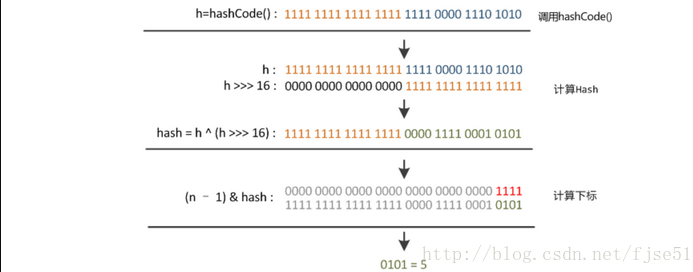

### 1.6.初始化容量--性能优化

hashMap 内部使用数组保存数据，数组长度是不透明的。

单线程时，影响HashMap性能最大的因素是扩容，减少或避免扩容能极大的提高性能。所有可以设置集合容量，计算方式是元素数量/0.75 + 1。
这样集合不进行扩容。 元素=100， 计算值=134, 初始化容量=256, threshold=192

多线程在这样简单的操作中，是远不能提高性能的。线程上下文切换，线程池内部逻辑等。

### 1.7.Put方法

put函数大致的思路为：

- 对key的hashCode()做hash，然后再计算index;
- 如果没碰撞直接放到bucket里；
- 如果碰撞了，以链表的形式存在buckets后；
- 如果碰撞导致链表过长(大于等于TREEIFY_THRESHOLD)，就把链表转换成红黑树；
- 如果节点已经存在就替换old value(保证key的唯一性)
- 如果bucket满了(超过load factor*current capacity)，就要resize。

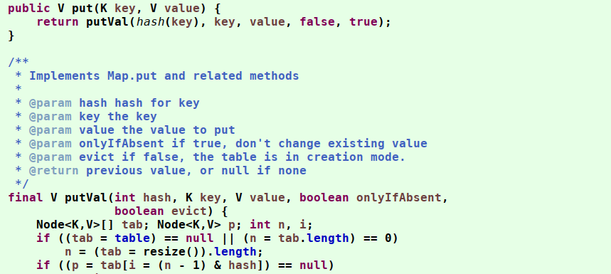

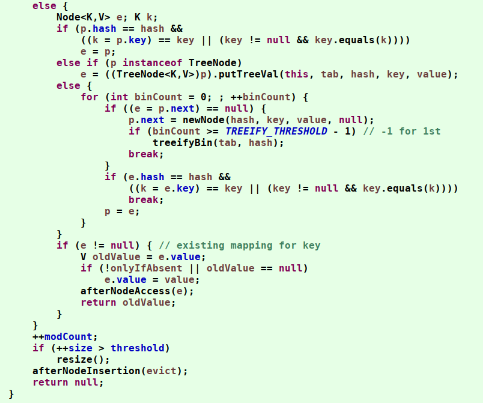

### 1.8.Get方法

思路如下：

- bucket里的第一个节点，直接命中；
- 如果有冲突，则通过key.equals(k)去查找对应的entry
- 若为树，则在树中通过key.equals(k)查找，O(logn)；
- 若为链表，则在链表中通过key.equals(k)查找，O(n)。

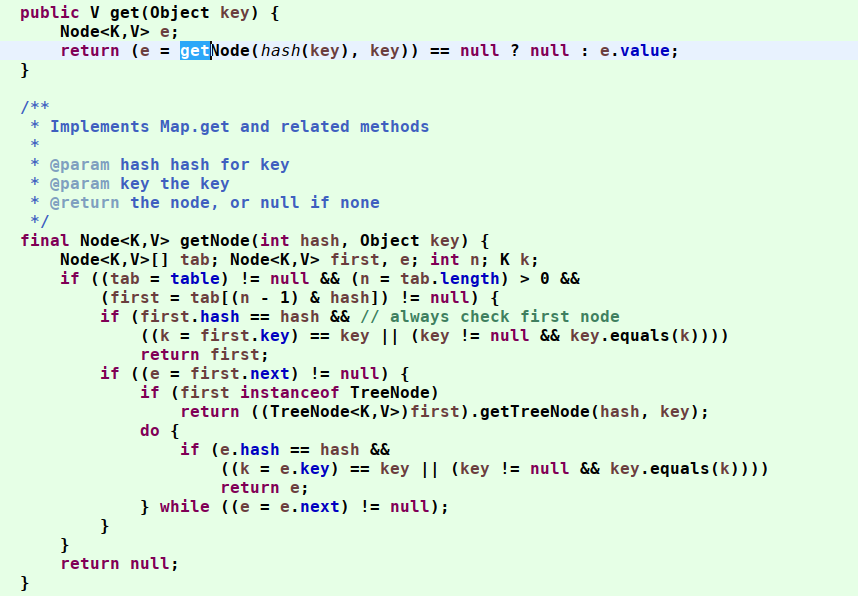

## 2.JDK1.8的优化

当链表的长度大于8的时候，将链表的数据保存到红黑树；当红黑树的长度小于6的时候，又会将数据转为链表。

红黑树是一种特殊的二叉树，用高效的检索效率

## 3.并发出现的问题

### 3.1.HashMap在多线程put后可能导致get无限循环

1.7之前，进行rehash是，采用的是头插法，造成环链；1.8之后用的是尾插法，能避免形成环链

HashMap在并发环境下多线程put后可能导致get死循环（造成死链），具体表现为CPU使用率100%
```java
void transfer(Entry[] newTable) {	
    Entry[] src = table;
    int newCapacity = newTable.length;
    for (int j = 0; j < src.length; j++) {
        Entry e = src[j];
        if (e != null) {
            src[j] = null;
            do {
                // 假设第一个线程执行到这里因为某种原因挂起，
                // 比如线程卡了下、上下文切换等，导致这一行的执行时间长
                Entry next = e.next;
                int i = indexFor(e.hash, newCapacity);
                e.next = newTable[i];
                newTable[i] = e;
                e = next;
            } while (e != null);
        }
    }
}
```

1）假设我们有两个线程

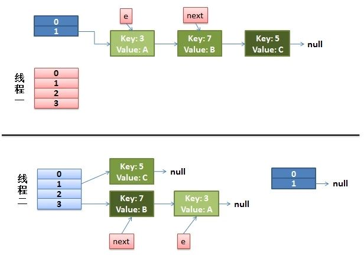


注意，因为Thread1的 e
指向了key(3)，而next指向了key(7)，其在线程二rehash后，指向了线程二重组后的链表。我们可以看到链表的顺序被反转后。

2）线程一被调度回来执行。

先是执行 newTalbe[i] = e;

然后是e = next，导致了e指向了key(7)

而下一次循环的next = e.next导致了next指向了key(3)

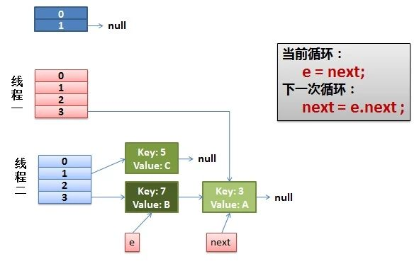

线程一接着工作。把key(7)摘下来，放到newTable[i]的第一个，然后把e和next往下移。

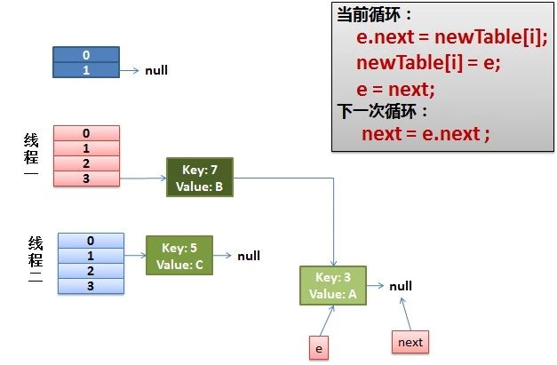

4）环形链接出现。

e.next = newTable[i] 导致 key(3).next 指向了 key(7)

注意：此时的key(7).next 已经指向了key(3)， 环形链表就这样出现了。

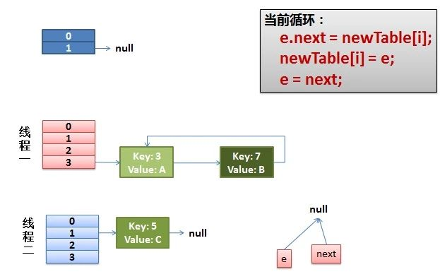


于是，当我们的线程一调用到，HashTable.get(11)时，悲剧就出现了——Infinite
Loop。

### 3.2.多线程put的时候可能导致元素丢失

HashMap另外一个并发可能出现的问题是，可能产生元素丢失的现象。

考虑在多线程下put操作时，执行addEntry(hash, key, value, i)，如果有产生哈希碰撞，
导致两个线程得到同样的bucketIndex去存储，就可能会出现覆盖丢失的情况：

```java
void addEntry(int hash, K key, V value, int bucketIndex) {
    //多个线程操作数组的同一个位置
    Entry e = table[bucketIndex];
        table[bucketIndex] = new Entry(hash, key, value, e);
        if (size++ >= threshold)
            resize(2 * table.length);
}
```

## 4.hashMap 1.7 到1.8 的比变化

https://blog.csdn.net/qq_36520235/article/details/82417949

- 1.7头插法，1.8尾插法，避免死链
- Rehash计算扩容后位置的计算公式不一样了，计算的更快了
- 1.8加入红黑树
- 1.7先扩容再插入，1.8先插入在扩容

## 5.常见问题

### 5.1.hashMap 加载因子，设置的过程？

加载因子过小，比如0.1,0.2的时候，内部数组扩容的频率会变快，数组中很多位置都没有数据，内存的利用率会降低。

加载因子大于1的时候，内部数组虽然扩容变得不频繁了，但是hash碰撞的次数变的非常多，几乎数组的每个位置都会生成链表，极大的影响性能
