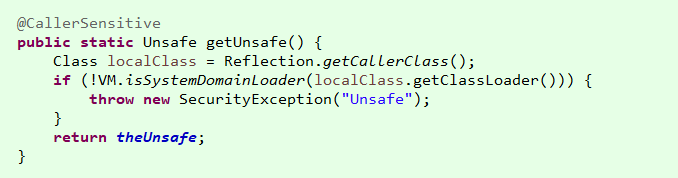
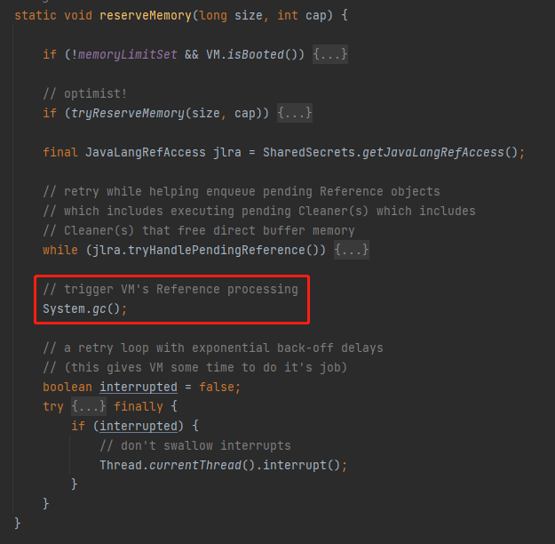

# 源码分析：Unsafe

## 1.Unsafe

Unsafe 是 java 留给开发者的后门，用于直接操作系统内存且不受 jvm 管辖，实现类似 C++ 风格的操作。

Oracle 官方一般不建议开发者使用 Unsafe 类，因为正如这个类的类名一样，它并不安全，使用不当会造成内存泄露。

在平时的业务开发中，这个类基本是不会有接触到的，但是在 java 的并发包和众多偏向底层的框架中，都有大量应用。

值得一提的是，该类的大部分方法均为 native 修饰，即为直接调用的其它语言(大多为 C++)编写的方法来进行操作，很多细节无法追溯，只能大致了解。

### 1.1.Unsafe 的获取

jdk8 中的 Unsafe 在包路径 sun.misc 下，引用全名 sun.misc.Unsafe。
而在 jdk9 中，官方在 jdk.internal.misc 包下又增加了一个 Unsafe 类，引用全名 jdk.internal.misc.Unsafe。

这两个 Unsafe 的构造方法均被 private 修饰，且类中有一个自身的静态实例对象，即经典的单例模式实现，并且提供了 getUnsafe() 方法调用：

```java
Unsafe unsafe = Unsafe.getUnsafe();
```

但是其实这个方法是无法在日常开发中使用的，下面的是原有。非jdk的程序调用方法的时候，由于classLoader不同，所以不能被调用。



sun.misc.Unsafe 是 jdk 中一直存在的 Unsafe，一般的第三方库的实现会使用该类。

该类在 jdk9 之后移动到了 jdk.unsupported 模块中。

在 jdk.unsupported 模块的 module-info.class 中可以看到：

```java
//jdk.unsupported 模块下的 module-info.class
module jdk.unsupported {
    exports com.sun.nio.file;
    exports sun.misc; //sun.misc.Unsafe 所在的路径
    exports sun.reflect;

    opens sun.misc;
    opens sun.reflect;
}
```

也就是说该模块将该类开放了出来，其它应用可以使用该类。

在 jdk11 中，该类的 api 实现很有意思：

```java
//sun.misc.Unsafe.class
@ForceInline
public void putInt(Object o, long offset, int x) {
    theInternalUnsafe.putInt(o, offset, x);
}

@ForceInline
public Object getObject(Object o, long offset) {
    return theInternalUnsafe.getObject(o, offset);
}

@ForceInline
public void putObject(Object o, long offset, Object x) {
    theInternalUnsafe.putObject(o, offset, x);
}

@ForceInline
public boolean getBoolean(Object o, long offset) {
    return theInternalUnsafe.getBoolean(o, offset);
}

@ForceInline
public void putBoolean(Object o, long offset, boolean x) {
    theInternalUnsafe.putBoolean(o, offset, x);
}
```

此处仅举部分例子，在这个 Unsafe 类中，大多数的实现都调用了
theInternalUnsafe 这个对象的相关方法。

而这个对象，则是一个 jdk.internal.misc.Unsafe 对象：
```java
//sun.misc.Unsafe.class
private static final jdk.internal.misc.Unsafe theInternalUnsafe = jdk.internal.misc.Unsafe.getUnsafe();
在 java.base 的 module-info.class 中笔者也看到了这样的配置：

//java.base 模块下的 module-info.class
exports jdk.internal.misc to //jdk.internal.misc 是 jdk.internal.misc.Unsafe 所在的包路径
    java.desktop,
    java.logging,
    java.management,
    java.naming,
    java.net.http,
    java.rmi,
    java.security.jgss,
    java.sql,
    java.xml,
    jdk.attach,
    jdk.charsets,
    jdk.compiler,
    jdk.internal.vm.ci,
    jdk.jfr,
    jdk.jlink,
    jdk.jshell,
    jdk.net,
    jdk.scripting.nashorn,
    jdk.scripting.nashorn.shell,
    jdk.unsupported; //jdk.unsupported 是 sun.misc.Unsafe 所在的模块
```

可见，java.base只是将该类所在的包路径开放给了有限的几个模块，而没有完全开放给广大开发者。

看到此处，大致可以猜想，Oracle 应该是希望使用 jdk.internal.misc.Unsafe作为真正的 Unsafe 使用，但是为了兼容性考虑保留了 sun.misc.Unsafe。

并且其实从 api 来说，jdk.internal.misc.Unsafe的数量更多，权限更大；sun.misc.Unsafe 则比较有限。

### 1.2.Unsafe 对象获取

由于 jdk.internal.misc.Unsafe 无法使用，所以以下均使用 sun.misc.Unsafe 来做 demo。

之前提到了 Unsafe 类的 getUnsafe() 静态获取单例的方法 

一些第三方库对 Unsafe 的使用，也确实不会直接使用该方式，而是使用反射机制去获取该类：

```java
try {
    //获取 Unsafe 内部的私有的实例化单例对象
    Field field = Unsafe.class.getDeclaredField("theUnsafe");
    //无视权限
    field.setAccessible(true);
    unsafe = (Unsafe) field.get(null);
} catch (NoSuchFieldException e) {
    e.printStackTrace();
} catch (IllegalAccessException e) {
    e.printStackTrace();
}
```

### 1.3.内存

在 Unsafe 中可以直接申请一块内存：
```java
//需要传入一个 long 类型的参数，作为申请的内存的大小，单位为 byte
//返回这块内存的 long 类型地址
long memoryAddress = unsafe.allocateMemory(8);
```

Unsafe 申请的内存不在 jvm 管辖范围内，需要手动释放：
```java
//传入之前申请的内存的地址就可以释放该块内存了
unsafe.freeMemory(memoryAddress);
```

注意，如果申请了内存，但是中途报错导致中断了代码执行，没有执行内存的释放，就出现了内存泄漏。所以为了保险起见，实际生产中尽量在 finally 区域里进行内存的释放操作。

还有一个重新分配内存的方法：
```java
//传入之前申请的内存的地址和一个 long 类型的参数作为新的内存的 byte 大小
//此方法会释放掉之前地址的内存，然后重新申请一块符合要求大小的内存
//如果之前那块内存上已经存在对象了，就会被拷贝到新的内存上
long newMemoryAddress = unsafe.reallocateMemory(memoryAddress, 32);
```

### 1.4.存取对象

Unsafe 中有数量众多的 put 和 get方法，用于将对象存入内存或者从内存中获取值。原理类似，可以选取几个来进行理解：
```java
//将 int 型整数 5 存入到指定地址中
unsafe.putInt(menmoryAddress,5);
//根据地址获取到整数
int a = unsafe.getInt(menmoryAddress);
//打印，得到 5
System.out.println(a);
```

这是最基本的 putInt 和 getInt 的运用，除此之外还有 putLong/getLong、putByte/getByte 等等，覆盖了几个基本类型。

但是 put 和 get 方法还有一套常用的重载方法，在这里先借助一个 bean 进行测试：
```java
class UnsafeBean{
    //测试1 测试 static 修饰的 int 类型的存取
    private static int staticInt = 5;
    //测试2 测试 static 修饰的 object 类型的存取
    private static String staticString = "static_string";
    //测试3 测试 final 修饰的 int 类型的存取
    private final int finalInt = 5;
    //测试4 测试 final 修饰的 object 类型的存取
    private final String finalString = "final_string";
    //测试5 测试一般的 int 类型的存取
    private int privateInt;
    //测试6 测试一般的 object 类型的存取
    private String privateString;
}
```

测试内容：
```java
UnsafeBean bean = new UnsafeBean();
```

- 1.测试 staticInt
```java
//先通过变量名反射获取到该变量
Field staticIntField = UnsafeBean.class.getDeclaredField("staticInt");
//无视权限
staticIntField.setAccessible(true);
//staticFieldOffset(...) 方法能够获取到类中的 static 修饰的变量
long staticIntAddress = unsafe.staticFieldOffset(staticIntField);
//使用 put 方法进行值改变，需要传入其所在的 class 对象、内存地址和新的值
unsafe.putInt(UnsafeBean.class,staticIntAddress,10);
//使用 get 方法去获取值，需要传入其所在的 class 对象和内存地址
int stiatcIntTest = unsafe.getInt(UnsafeBean.class,staticIntAddress);
//此处输出为 10
System.out.println(stiatcIntTest);
```
- 2.测试 staticString
```java
//基本流程相同，只是 put 和 get 方法换成了 getObject(...) 和 putObject(...)
Field staticStringField = UnsafeBean.class.getDeclaredField("staticString");
staticStringField.setAccessible(true);
long staticStringAddress = unsafe.staticFieldOffset(staticStringField);
unsafe.putObject(UnsafeBean.class,staticStringAddress,"static_string_2");
String staticStringTest = (String)unsafe.getObject(UnsafeBean.class,staticStringAddress);
///此处输出为 static_string_2
System.out.println(staticStringTest);
```

- 3.测试 finalInt
```java
//基本流程相同，只是 staticFieldOffset(...) 方法换成了 objectFieldOffset(...) 方法
Field finalIntField = UnsafeBean.class.getDeclaredField("finalInt");
finalIntField.setAccessible(true);
long finalIntAddress = unsafe.objectFieldOffset(finalIntField);
//需要注意的是，虽然该变量是 final 修饰的，理论上是不可变的变量，但是 unsafe 是具有修改权限的
unsafe.putInt(bean,finalIntAddress,10);
int finalIntTest = unsafe.getInt(bean,finalIntAddress);
//此处输出为 10
System.out.println(finalIntTest);
```

- 4.测试 finalString
```java
Field finalStringField = UnsafeBean.class.getDeclaredField("finalString");
finalStringField.setAccessible(true);
long finalStringAddress = unsafe.objectFieldOffset(finalStringField);
unsafe.putInt(bean,finalStringAddress,"final_string_2");
String finalStringTest = (String)unsafe.getObject(bean,finalStringAddress);
///此处输出为 final_string_2
System.out.println(finalStringTest);
```

- 测试5 和 测试6 此处省略，因为和上述 final 部分的测试代码一模一样
```java
put 和 get 方法还有一组很类似的 api，是带 volatile 的：

public int getIntVolatile(Object o, long offset);
public void putIntVolatile(Object o, long offset, int x);
public Object getObjectVolatile(Object o, long offset);
public void putObjectVolatile(Object o, long offset, Object x);
```


这一组 api 的使用方式和上述一样，只是增加了对 volatile 关键词的支持。测试发现，该组 api 也支持不使用 volatile 关键词的变量。

get 和 put 方法的思路都比较简单，使用思路可以归纳为：
```java
1 用反射获取变量对象 (getDeclaredField)
2 开放权限，屏蔽 private 关键字的影响 (setAccessible(true))
3 调用相关方法获取到该对象中的该变量对象的内存地址 (staticFieldOffset/objectFieldOffset)
4 通过内存地址去修改该对象的值 (putInt/putObject)
5 获取对象的值 (getInt/getObject)
```

### 1.5.线程的挂起和恢复（操作时间）

线程的挂起调用 park(…) 方法：
```java
//该方法第二个参数为 long 类型对象，表示该线程准备挂起到的时间点
//注意，此为时间点，而非时间，该时间点从 1970 年(即元年)开始
//第一个参数为 boolean 类型的对象，用来表示挂起时间的单位，true 表示毫秒，false 表示纳秒
//第一个参数为 true，第二个参数为 0 的时候，线程会直接返回，不太清楚机理
unsafe.park(false,0L);
```

与之对应的 unpark(…) 方法：

//此处传入线程对象

unsafe.unpark(thread);

请注意，挂起时是不需要传入线程对象的，即只有线程自身可以执行此方法用于挂起自身，但是恢复方法是需要其它线程来帮助恢复的。


## 2.操作对外内存

JDK提供分配 堆外内存 的功能是 ByteBuffer.allocateDirect 方法。底层是调用 Unsafe 里面的 allocateMemory 这个 native 方法，
它相当于 C++ 的 malloc 函数。方法返回值是 long 类型数值，也就是申请的内存对应的首地址。

使用 ByteBuffer.allocateDirect 方法，存在一定的不稳定性。 JVM 有个叫做 -XX:MaxDirectMemorySize （最大堆外内存）的配置，申请堆外内存时大小会受到这个配置的限制。



如果分配内存的时候，没有更多的堆外内存可以使用，它可能会触发一个 Full GC，如果多个申请内存的线程同时遇到这种情况，这是有问题的，因为这意味着大量 Full GC 的连续发生。
如果堆外内存不足的时候，会触发一次 Full GC。可以想象，在机器内存吃紧的时候，程序还在不停的申请堆外内存，继而导致 Full GC 的频繁出现，是一种什么样的“灾难性”的后果，基本上服务就处于不可用状态了。

[堆外内存OHC](https://heapdump.cn/article/5250140)

所以部分堆外内存使用框架，并没有使用Unsafe提供的方法，而是通过JDI的自行维护堆外内存。


