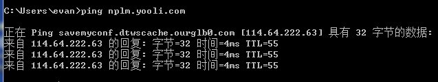
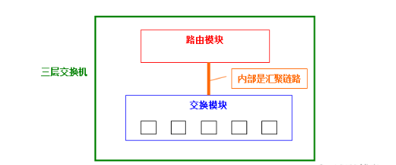

# 1.网络

## 1.DNS

DNS （Domain Name System 的缩写）的作用非常简单，就是根据域名查出IP地址。你可以把它想象成一本巨大的电话本。

使用方式：在指定服务器部署DNS服务（大量开源方案），启动DNS服务后，暴露相关ip和端口。我们可以在电脑中设置这个DNS。
如果是IDC中的话，可以在网络的出口（交换机或者路由器）设置DNS解析。

### 1.1.查询过程

```shell
# 工具软件dig可以显示整个查询过程。
[root@localhost ~]# dig www.baidu.com
## 1. 查询参数和统计。
; <<>> DiG 9.11.4-P2-RedHat-9.11.4-26.P2.el7_9.9 <<>> www.baidu.com
;; global options: +cmd
;; Got answer:
;; ->>HEADER<<- opcode: QUERY, status: NOERROR, id: 5178
;; flags: qr rd ra; QUERY: 1, ANSWER: 3, AUTHORITY: 0, ADDITIONAL: 1

;; OPT PSEUDOSECTION:
; EDNS: version: 0, flags:; udp: 512

## 2. 查询内容。查询域名的A记录。
;; QUESTION SECTION:
;www.baidu.com.			IN	A

## 3. DNS服务器的答复。 其中一个结果是CNAME，另外2个是A记录；64和36是TTL表示缓存时间；最后表示真实地址
;; ANSWER SECTION:
www.baidu.com.		64	IN	CNAME	www.a.shifen.com.
www.a.shifen.com.	36	IN	A	110.242.68.4
www.a.shifen.com.	36	IN	A	110.242.68.3

## 4.显示NS记录（Name Server的缩写），即哪些服务器负责管理域名的DNS记录
;; AUTHORITY SECTION:
a.shifen.com.		396	IN	SOA	ns1.a.shifen.com. baidu_dns_master.baidu.com. 2208080086 5 5 2592000 3600

## 5.DNS服务器对应的IP
;; ADDITIONAL SECTION:

## 6.DNS服务器信息
;; Query time: 23 msec
;; SERVER: 114.114.114.114#53(114.114.114.114)## DNS服务器的ip
;; WHEN: 一 8月 08 21:22:46 CST 2022
;; MSG SIZE  rcvd: 101
```
Dig 工具全称为域名信息搜索器（Domain InformationGroper），能够显示详细的DNS查询过程，是一个非常强大的DNS故障诊断工具。
[window安装dig](https://cloud.tencent.com/developer/article/1569087)

DNS服务器根据域名的层级，进行分级查询。
所谓”分级查询”，就是从根域名开始，依次查询每一级域名的NS记录，直到查到最终的IP地址，过程大致如下。
- 从”根域名服务器”查到”顶级域名服务器”的NS记录和A记录（IP地址）
- 从”顶级域名服务器”查到”次级域名服务器”的NS记录和A记录（IP地址）
- 从”次级域名服务器”查出”主机名”的IP地址

```shell
## 1.只看真实的ip
dig +short www.baidu.com
## 2.显示DNS的整个分级查询过程
dig +trace www.baidu.com
```

### 1.2.记录类型
域名与IP之间的对应关系，称为”记录”（record）。根据使用场景，”记录”可以分成不同的类型（type），前面已经看到了有A记录和NS记录。

常见的DNS记录类型如下。
1. A：地址记录（Address），返回域名指向的IP地址。
2. NS：域名服务器记录（Name Server），返回保存下一级域名信息的服务器地址。该记录只能设置为域名，不能设置为IP地址。
3. MX：邮件记录（Mail eXchange），返回接收电子邮件的服务器地址。
4. CNAME：规范名称记录（Canonical Name），返回另一个域名，即当前查询的域名是另一个域名的跳转。主要用于域名的内部跳转，
   为服务器配置提供灵活性，用户感知不到
5. PTR：逆向查询记录（Pointer Record），只用于从IP地址查询域名比如。dig -x 192.30.252.153

一般来说，为了服务的安全可靠，至少应该有两条NS记录，而A记录和MX记录也可以有多条，这样就提供了服务的冗余性，防止出现单点失败。

### 1.3.DNS产品
公有云、域名系统通常自带DNS产品。

具备的功能有：
- 负载均衡。简单成本低，但是DNS本身并不具备主动监测服务器负载情况或动态调整权重的能力，不能区分不同服务器之间的性能和负载差异，不能反映服务器当前的运行状态。
  所以一些大型网站总是使用 DNS 域名解析作为第一级负载均衡手段，然后在通过负载均衡服务器提供更高级的负载均衡算法
- 基于地理位置的域名解析，可以将域名解析成距离用户地理位置最近的服务器地址，加快用户访问速度。

### 1.3.DNS安全问题
1. 针对域名系统的恶意攻击：DDOS攻击造成域名解析瘫痪。
2. 域名劫持：修改注册信息、劫持解析结果。
3. 国家性质的域名系统安全事件：“.ly”域名瘫痪、“.af”域名的域名管理权变更。
4. 系统上运行的DNS服务存在漏洞，导致被黑客获取权限，从而篡改DNS信息。
5. DNS设置不当，导致泄漏一些敏感信息。提供给黑客进一步攻击提供有力信息。

## 2.ARP
网络层协议。我们知道通过ip发送数据时，网络层的下一层是数据链路层，所以需要知道ip对应的mac地址。
在路由器中，具备ARP服务，内部缓存了ip对应的mac地址，当请求经过路由器的时候，帮助其找到对应的机器。

## 3.DHCP

动态网络ip分配。

[37 张图详解 DHCP ：给你 IP 地址的隐形人](https://mp.weixin.qq.com/s/UP-bav7c2Lwz0GjIW-Vtsw)

## 4.NAT

网络地址转换，是一种缓解IPV4消耗的技术。说白了就是统一出入口IP。
这个公网IP可以设置不同的端口，对应不同的IP。

由于 NAT/NAPT 都依赖于自己的转换表，因此会有以下的问题：
- 外部无法主动与 NAT 内部服务器建立连接，因为 NAPT 转换表没有转换记录。
- 转换表的生成与转换操作都会产生性能开销。
- 通信过程中，如果 NAT 路由器重启了，所有的 TCP 连接都将被重置。

## 5.CDN

### 5.1.介绍
[CDN加速的原理](https://mp.weixin.qq.com/s/CIxlrgqQUtPd_X0M8HQX-Q)

作用：
1. 静态资源缓存，加速网络访问，降低服务器压力，提升访问效率。
2. 提升安全性。
3. 异地灾备。通过CDN实现自动的灾备切换。
4. 实现全网覆盖。CDN通过和运营商合作，部署IDC资源，在全国骨干节点上合理部署CDN边缘分发存储节点，实现跨域跨网的全覆盖效果。
   用户只需要部署一个地区，就可以实现全网覆盖

### 5.2.CDN故障处理方法

1.ping 问题域名,截图下来；

ping nplm.yooli.com




2.访问www.ip138.com，获取本机出口公网IP


3.把上面信息提交给CDN或者相关运维；

4.在问题pc机器绑定hosts，下面是源IP，绑定之后就不过CDN了；

C:\\Windows\\System32\\drivers\\etc\\hosts

119.254.115.82 nplm.yooli.com #贷后

119.254.115.76 cas.yooli.com

119.254.115.76 sso.yooli.com

119.253.249.134 collection.yooli.com #自建催收

5.正常源IP是无法ping通，telnet 119.253.249.134 80

### 5.3.绕过cdn使用ip访问

一般网站会使用cdn防御，我们访问时会经过cdn再经过源站服务器，这样我们进行渗透测试很容易被拦截，我们的思路是这样的，
通过找到源站ip之后，把IP添加到hosts文件里面去；你访问网站返回的就是真实IP了，这样我们再进行测试，就会少很多麻烦。

[hosts文件的前世今生](https://jingyan.baidu.com/article/9f7e7ec04dacc06f281554dd.html)

### 5.4.怎么判断网站有没有cdn防御？

在不同地区ping同一个网址，我们得到不同的IP地址，那么这种情况，我们就可以判断该网站开了CDN加速。讲得在通俗易懂就是“就近原则”了

可选线路1：多个地点Ping服务器,网站测速 - 站长工具

可选线路2：网站测速工具_超级ping _多地点ping检测 - 爱站网

## 6.域名

www.example.com真正的域名是www.example.com.root，简写为www.example.com.。因为，根域名.root对于所有域名都是一样的，所以平时是省略的。

- 根域名的下一级，叫做”顶级域名”（top-level domain，缩写为TLD），比如.com、.net；
- 再下一级叫做”次级域名”（second-level domain，缩写为SLD），比如www.example.com里面的.example，这一级域名是用户可以注册的；
- 再下一级是主机名（host），比如www.example.com里面的www，又称为”三级域名”，这是用户在自己的域里面为服务器分配的名称，是用户可以任意分配的。

```text
主机名.次级域名.顶级域名.根域
www.baidu.com.root
```

## 7.SEO

### 7.1.主流的搜索引擎：
国内：百度、360、搜狗。
国外：谷歌、必应、雅虎。

### 7.2.seo和sem
sem:竞价广告（搜索引擎推广），收费。排名最前。特征，有广告的
seo:符合搜索引擎要求的网站，免费。特征，有快照的

### 7.3.搜索引擎工作原理（以百度为例）

1. 抓取
    百度的抓取工具叫做蜘蛛
2. 收录建库预处理
    比如：索引数据库和网页数据库
    预处理：去重复->去噪音（去幻灯banner、去广告）->
        去代码->去停止词（的，啊，吗，啦）->分词
3. 分析搜索请求
4. 对结果排序

### 7.4.收录
被蜘蛛抓取的网站，能被搜索引擎展示处理，就是收录
查询是否被收录：
百度搜索：site:www.baidu.com

### 7.5.第三方seo工具
1.百度：http://zhanzhang.baidu.com/
2.站长之家：http://seo.chinaz.com/
3.爱站：http://www.aizhan.com/
爱站提供seo软件，推荐下载

### 7.6.SEO中的高级搜索指令
```text
intitle:keyword 标题中含有关键词的页面
intext:keyword 正文中包含关键词的页面
site:domain 在某个域名和子域名下的页面
```

## 8.虚拟网卡

- [图解:VETH/MACVLAN/MACVTAP/IPVLAN](https://blog.csdn.net/dog250/article/details/45788279)
- [macvlan技术](https://www.cnblogs.com/bigberg/p/8659123.html)

常见的虚拟网卡技术：VETH、MACVLAN、MACVTAP和IPVLAN

作用：ARP协议与虚拟网卡一起工作，实现了IP地址到MAC地址的映射，实现硬件与软件的绑定，帮助局域网内部通过IP找到mac地址，
从而定位到机器的目的，这样就帮助设备从虚机局域网中快速找到另一个设备的技术。

通常：这样同一个虚拟网卡内的设备可以通讯，不同虚拟网卡的设备不可以通讯（需要通讯的话需要用到路由的功能）；

如果没有虚拟网卡，成百上千的设备都在一个网络中，设备A想要向设备B发送消息，设备A只能通过广播的方式发送发给局域网内所有的设备，这样浪费了带宽、降低了效率。

虚机局域网。一般指的是一个家庭多台设备或者企业成百上千的设备组成的局域网。

虚拟网卡的不同技术，也是为就解决不同的应用之间的通讯问题。
1. IPVLAN
    - IPVLAN是一种把主机网卡虚拟化多个子网卡的技术，允许物理网卡（或虚拟网卡）拥有多个IP地址。
    - 这些子网卡与主网卡共享相同的MAC地址，但具有不同的IP地址。
    - IPVLAN有两种模式：L2模式和L3模式，同一张父网卡同一时间只能使用一种模式。
2. VETH（Virtual Ethernet）
    - VETH是虚拟一对直连的网卡，一端连接内核协议栈，主要用于解决两个隔离网络空间的通信问题。
    - 相比于tun/tap等技术，VETH无需多次经过网络协议栈，性能得到了极大提高。
    - VETH在容器技术中扮演着关键角色，是容器网络的关键组成部分。
3. MACVLAN
    - MACVLAN是一种Linux虚拟化网卡技术，允许用户在主机的一个物理网卡上配置多个虚拟网卡。
    - 每个MACVLAN接口都有自己的区别于父接口的MAC地址，并且可以像普通网络接口一样分配IP地址。
    - MACVLAN接口在逻辑上与物理网卡是对等的，因此可以实现容器直接访问物理网络。
4. MACVTAP
    - MACVTAP是一种将虚拟网卡和tap设备结合起来的技术，结合了虚拟网卡和tap设备的优点。
    - MACVTAP在某些情况下可以提供更好的性能和灵活性，特别适用于需要高性能网络通信的场景。

## 9.单臂路由与三层交换机

单臂路由，就是一台二层交换机 加 一台路由器
组成的网络转发设备。一般可以应对小型网络架构。

三层交换机，就是一台有路由功能的二层交换机，一把用于大型企业的复杂网络常见。



在一台本体内，分别设置了交换机模块和路由器模块；而内置的路由模块与交换模块相同，使用ASIC硬件处理路由。
因此，与传统的路由器相比，可以实现高速路由。并且，路由与交换模块是汇聚链接的，由于是内部连接，可以确保相当大的带宽，所以对于正规的项目，需要使用三层交换机来实现网网络间的通信。

三层交换机能实现同机房不同VLAN之间的通讯。

想要实现不同机房间的通讯则需要四层网络架构，就是在机房之间再加一层路由，以及专线。

## 10.网关

网关(Gateway)又称网间连接器、协议转换器。网关在传输层上以实现网络互连，是最复杂的网络互连设备，仅用于两个高层协议不同的网络互连。

他一般是TCP/IP层协议的。帮助2个VLAN之间转发数据包网关ip。一般选择网段内第一个或者最后一个ip作为网关的ip

## 11.宽带接入技术

在互联网初期，都是用电话的用户线加个调制器连接到ISP的，最高速率只有56kb/s。
接入宽带的意思其实就是通过各种改造方法提高速率，所以有人认为只要接入因特网的速率大于56kb/s就是宽带。

- ADSL技术
    - 非对称数字用户线，就是对用户线改造，使其能够承载宽带数字业务。由于大部分用户上网都是下载资源远多于上传资源，所以下行带宽要高于上行带宽（非对称）
    - ADSL还要配合调解器使用，我国采用的是DMT离散多音调：DMT 调制技术采用频分复用的方法，把 40 kHz 以上一直到 1.1 MHz 的高端频谱划分为许多的子信道，其中 25 个子信道用于上行信道，而 249 个子信道用于下行信道。
      所有它允许高达8 Mbps的下行速度和 1 Mbps的上行速度
    - 在电信服务提供商端，需要将每条开通ADSL业务的电话线路连接在数字用户线路访问多路复用器(DSLAM)上。而在用户端，用户需要使用一个ADSL终端(因为和传统的调制解调器(Modem)类似，所以也被称为“猫”)来连接电话线路
- 光纤同轴混合网（有线电视上网）
    - HFC (Hybrid Fiber Coax)是在目前覆盖面很广的有线电视网 CATV 的基础上开发的一种居民宽带接入网。
- FTTx技术
    - FTTx（ Fiber To The x）也是一种实现宽带居民接入网的方案，俗称光纤到家，但由于各种成本问题，不可能真的到家，也没有必要
    - 光纤到家 FTTH (Fiber To The Home)：光纤一直铺设到用户家庭可能是居民接入网最后的解决方法。
    - 光纤到大楼 FTTB (Fiber To The Building)：光纤进入大楼后就转换为电信号，然后用电缆或双绞线分配到各用户。
    - 光纤到路边 FTTC (Fiber To The Curb)：从路边到各用户可使用星形结构双绞线作为传输媒体。

## 12.专线

[一文读懂专线](https://baijiahao.baidu.com/s?id=1723368920972643965)

网络专线就是为某个机构拉一条独立的网线，也就是一个独立的局域网，例如军事，银行等，让用户的数据传输变得可靠可信，专线的优点就是安全性好，QoS 可以得到保证。不过，专线租用价格也相对比较高，而且管理也需要专业人员。

网络专线主要有两种信道
1. 物理专用信道。物理专用信道就是在服务商到用户之间铺设有一条专用的线路，线路只给用户独立使用，其他的数据不能进入此线路，而一般的线路就允许多用户共享信道；
2. 虚拟专用信道。虚拟专用信道就是在一般的信道上为用户保留一定的带宽，使用户可以独享这部分带宽，就像在公用信道上又开了一个通道，只让相应用户使用，而且用户的数据是加密的，以此来保证可靠性与安全性；

专线特点：
- ATM的特点高带宽、低延时或高数据突发等。
- ADSL是一种非对称的DSL技术，所谓非对称是指用户线的上行速率与下行速率不同，上行速率低，下行速率高，特别适合传输多媒体信息业务，
  如视频点播（VOD）、多媒体信息检索和其他交互式业务。ADSL在一对铜线上支持上行速率512Kbps～1Mbps，下行速率1Mbps～8Mbps，
  有效传输距离在3～5公里范围以内。
- 虚拟专用网络。VPN（Virtual Private Network）。VPN的核心就是在利用公共网络建立虚拟私有网。

云联网。可以理解为互联网中的专线。一般都是各大运营商或者公有云商提供的专线能力。
- [带宽利用率提升50%，腾讯云联网架构方案解析](https://zhuanlan.zhihu.com/p/323800776)

我们都知道，公有云的地区（region）内可以创建vpc，可以为不同的可用区分配子网，这样同一个vpc的子网之间就可以通讯。
但是想要实现跨地区的内网通讯，就必须使用专线了，云联网是公有云提供的一种服务，有公有云进行维护，降低公司专线的成本。  