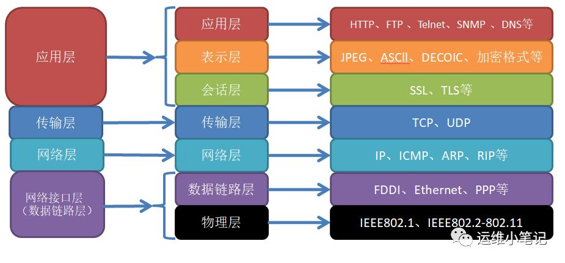
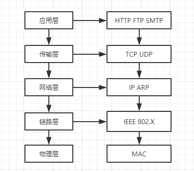
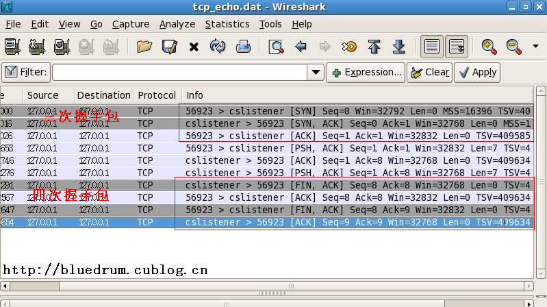
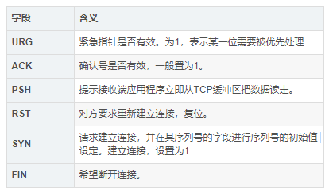
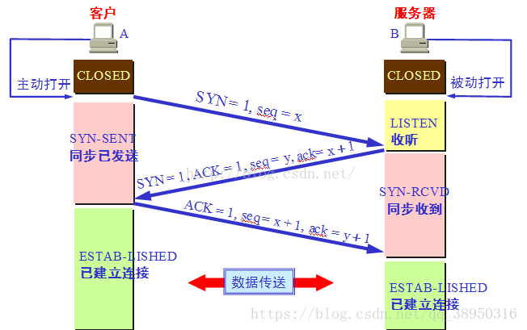
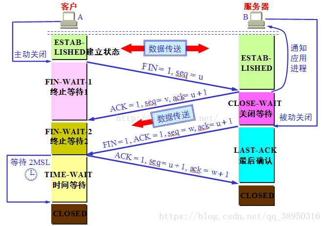
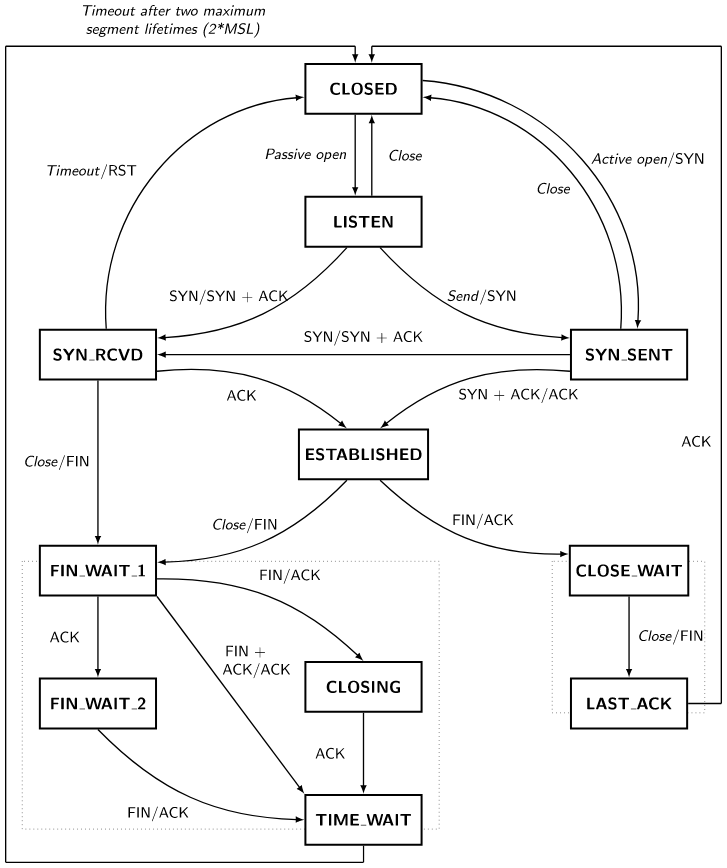

# 2.网络协议

## 1.介绍

### 1.1.计算机网络的分类

计算机网络按照规模大小和延伸范围，分为：局域网（LAN），广域网（WAN），城域网（MAN）。Internet可以认为是世界上最大的广域网。

### 1.2.通讯协议

计算机网路实现通信必须有一些约定，这被称为通讯协议。它负责对传输速率，传输代码，代码结构，传输控制步骤，
以及出错控制等指定处理标准。 为了让两个节点之间能够进行对话，必须在他们之间建立通讯工具，使他们能够进行信息的交互。

国际标准化组织ISO，与1978年提出了OSI(open system interconnection)，即“开放系统互联参考模型”，
力求简化网络，并以模块化的方式来设计网络。它将计算机网络分为7层。

自下而上依次是：物理层、数据链路层、网络层、传输层、会话层、表示层、应用层。
- 左边的4层协议：TCP/IP 的 4层协议
- 中间的7层协议：OSI 的 7层协议



### 1.3.socket

#### 1.3.1.套接字（socket）概念

套接字（socket）是通信的基石，是支持TCP/IP协议的网络通信的基本操作单元。它是网络通信过程中端点的抽象表示，
**用最直白的话解释，socket就是计算机暴露出去的插口、插座，每个socket都对应一个唯一的端口号，用于网络交互，**
包含进行网络通信必须的五种信息：
- 连接使用的协议
- 本地主机的IP地址
- 本地进程的协议端口
- 远地主机的IP地址
- 远地进程的协议端口

应用层通过传输层进行数据通信时，TCP会遇到同时为多个应用程序进程提供并发服务的问题。
多个TCP连接或多个应用程序进程可能需要通过同一个 TCP协 议端口传输数据。
为了区别不同的应用程序进程和连接，许多计算机操作系统为应用程序与TCP／IP协议交互提供了套接字(Socket)接口。
应用层可以 和传输层通过Socket接口，区分来自不同应用程序进程或网络连接的通信，实现数据传输的并发服务。

#### 1.3.2.建立socket连接

建立Socket连接至少需要一对套接字，其中一个运行于客户端，称为ClientSocket ，另一个运行于服务器端，称为ServerSocket。
套接字之间的连接过程分为三个步骤：服务器监听，客户端请求，连接确认。
- 服务器监听：服务器端套接字并不定位具体的客户端套接字，而是处于等待连接的状态，实时监控网络状态，等待客户端的连接请求。
- 客户端请求：指客户端的套接字提出连接请求，要连接的目标是服务器端的套接字。为此，客户端的套接字必须首先描述它要连接的服务器的套接字，
  指出服务器端套接字的地址和端口号，然后就向服务器端套接字提出连接请求。
- 连接确认：当服务器端套接字监听到或者说接收到客户端套接字的连接请求时，就响应客户端套接字的请求，建立一个新的线程，
把服务器端套接字的描述发给客户端，一旦客户端确认了此描述，双方就正式建立连接。而服务器端套接字继续处于监听状态，
继续接收其他客户端套接字的连接请求。

#### 1.3.3.SOCKET连接与TCP连接

创建Socket连接时，可以指定使用的传输层协议，Socket可以支持不同的传输层协议（TCP或UDP），当使用TCP协议进行连接时，
该Socket连接就是一个TCP连接。

#### 1.3.4.Socket连接与HTTP连接
由于通常情况下Socket连接就是TCP连接，因此Socket连接一旦建立，通信双方即可开始相互发送数据内容，直到双方连接断开。
但在实际网络应用中，客户端到服务器之间的通信往往需要穿越多个中间节点，例如路由器、网关、防火墙等，
大部分防火墙默认会关闭长时间处于非活跃状态的连接而导致Socket连接断连，因此需要通过轮询告诉网络，该连接处于活跃状态。
而HTTP连接使用的是“请求—响应”的方式，不仅在请求时需要先建立连接，而且需要客户端向服务器发出请求后，服务器端才能回复数据。
很多情况下，需要服务器端主动向客户端推送数据，保持客户端与服务器数据的实时与同步。
此时若双方建立的是Socket连接， 服务器就可以直接将数据传送给客户端；
若双方建立的是HTTP连接，则服务器需要等到客户端发送一次请求后才能将数据传回给客户端，
因此，客户端定时向服务器端发送连接请求，不仅可以 保持在线，同时也是在“询问”服务器是否有新的数据，如果有就将数据传给客户端。

### 1.4.通讯传输方式

- 单工：指在通信过程的任意时刻，信息只能由一方A传到另一方B，如广播电台、BP机、电视传播等。单工工作方式目前已经很少使用了
- 半双工：是指在通信过程的任意时刻，信息既可由A传到B，又能由B传A，但只能由一个方向上的传输存在。
  采用半双工方式时，通信系统每一端的发送器和接收器，通过收/发开关转接到通信线上，进行方向的切换，因此，会产生时间延迟。收/发开关实际上是由软件控制的电子开关。
- 全双工：指在通信的任意时刻，线路上存在A到B和B到A的双向信号传输。在全双工方式下，通信系统的每一端都设置了发送器和接收器，
  因此，能控制数据同时在两个方向上传送。全双工方式无需进行方向的切换，因此，没有切换操作所产生的时间延迟。

### 1.5.RFC

RFC不是协议，而是由互联网工程任务组（IETF）发布的一系列以编号排定的文件。这些文件涵盖了互联网的许多重要方面，包括但不限于各种协议、标准和技术规范。

官网：[https://www.rfc-editor.org/](https://www.rfc-editor.org/)
进入RFC官网主页后，点击左侧Document Retrieval进入文档索引页，我可以根据需要下载对应的应用层协议文档。


我们常用的协议编号：
- RFC 793：TCP标准协议文档
- RFC 792：ICMP（因特网控制报文协议）文档
- RFC 791：IP标准协议文档
- RFC 768：UDP标准协议文档
- RFC 2068：HTTP/1.1

## 2.IP协议

[IP协议基础整理](https://mp.weixin.qq.com/s/VBtzIFhLXnqu2k8mTD8AoQ)

### 2.1.协议

IP为三个部分，分别是 IP 寻址、路由和分包组包。

### 2.2.掩码

10.1.0.0/16后面16就是掩码，表示可用ip的数量

表示的是一种ip的范围，这样可以简单点，比如：192.168.1.2/255.255.255.0　写成192.168.1.2/24

在计算机里都是用二进制存放的，所以你也把十进制的IP全部写成二进制的：如00000010.00000001.00000000.00000000(10.1.0.0)

16就表示网络掩码1的位数有16位，写成点分形式就是：11111111.11111111.00000000.00000000(255.255.0.0)

对应的IP前面16位就是你的网络号

这也是CIDR（无类型域间选路）的一种书写方式.

CIDR采用13～27位可变网络ID，而不是A-B-C类网络ID所用的固定的8、16和24位。
例如：192.168.0.132/28，这排数字告诉你的子网掩码是多少，/28表示多少位为1，最大/32.但是你必须知道的一点是，
不管是A类还是B类还是其他类别地址，最大可用的只能为/30。即保留2位主机位。

ip 掩码计算工具： https://www.bejson.com/convert/subnetmask/

### 2.3.DHCP分配ip过程
[37 张图详解 DHCP ：给你 IP 地址的隐形人](https://mp.weixin.qq.com/s/UP-bav7c2Lwz0GjIW-Vtsw)

### 2.4.IP地址和端口号

1.IP：是在一个在网络中，作为唯一的标识的通讯实体。这个通信实体可以是一台电脑，一台打印机，一个路由器的端口。

2.IP地址是数字型的，他是一个32位整数，但是通常会把它分为4个8位的二进制数，每8位之间以圆点隔开，
   每个8位的整数可以转化为一个0~255的十进制整数。 因此，我们常看到的ip地址的格式是：192.168.1.1

3.IP的申请。NIC(Internet network information center)统一负责全球的规划和管理， 
   1. Internet NIC，APNIC，RIPE三大网络信息中心负责美国以及其他地区IP的分配。 
   2. APNIC负责亚太地区的IP管理，我国申请IP地址也是需要APNIC，APNIC的总部设在日本东京大学。

4.IP的分类，分为A，B，C，D，E五类，每个类别的网络标识和主机标识各有规则。

```text
A:10.0.0.0~10.255.255.255
B:172.16.0.0~172.31.255.255
C:192.168.0.0~192.168.255.255
```

5.端口。虽然每个ip都只对应一个通讯实体，但是一个通讯实体却可以有多个通讯程序同事提供网络服务，因此，需要使用端口。
   端口是一个16位的整数，用于表示数据交给那个通信程序使用。可以说，端口就是应用程序和外界交流的入口，
   他是一种抽象的软件结构，包括一些数据结构和I/O缓冲区。但是每一个端口同时只能有一个应用程序使用。端口号是0~65535。

6.端口的分类

- 公认端口（well known ports）：0~1023，一般是系统紧密绑定的特定的服务
- 注册端口（registered ports）：1024~49151，他们松散的绑定的一些服务。
  通常我们就是使用这些，3306,1521,8080,8009
- 动态和/或私有端口（dynamic and/or private ports）：49152~65535，是一些应用程序使用的动态端口，
  应用一般不会主动使用这些端口。

## 3.TCP

常见面试题：[https://mp.weixin.qq.com/s/kBhAJHXkhVdYTmdrWQXoCQ](https://mp.weixin.qq.com/s/kBhAJHXkhVdYTmdrWQXoCQ)

TCP协议是一种可靠的全双工连接网络协议，他在通讯的两端都要建立一个socket，在通讯的两端形成网络虚拟链路，从而实现通讯。

Java对基于TCP协议的网络通讯提供了良好的封装，Java使用socket对象，代表两端的通信端口，并通过socket产生的io流实现信息通讯。

### 3.1.TCP与UDP协议的区别

- TCP:传输控制协议，面向连接的运输层协议。使用TCP协议之前， 必须先建立TCP连接。 使用完毕后， 必须释放已经建立的TCP连接
  - 每条TCP连接只能有两个端点（endpoint）， 每一条TCP连接只能是点对点的（一 对一）
  - TCP提供可靠交付的服务。 通过TCP连接传送的数据， 无差错、 不丢失、 不重复，并且按序到达。
  - TCP 提供全双工通信。 TCP允许通信双方的应用进程在任何时候都能发送数据。 TCP连接的两端都设有发送缓存和接收缓存， 用来临时存放双向通信的数据。 
    在发送时，应用程序在把数据传送给TCP的缓存后， 就可以做自己的事， 而TCP在合适的时候把数据发送出去。 
    在接收时， TCP把收到的数据放入缓存， 上层的应用进程在合适的时候读取缓存中的数据。
  - 面向字节流。虽然应用程序和TCP的交互是一次 一个数据块（大小不等）， 但TCP把应用程序交下来的数据仅仅看成是一连串的无结构的字节流  
  - 差错控制开销很大。tcp通讯过程，再出现抖动，丢包问题的时候会进行重试。
  - 传输大小没有限制
  - 需要连接时间。三次握手，四次挥手
- UDP:数据报文协议，面向报文的运输层协议。他们的链接是不稳定的，差错控制开销很小，传输大小限制在64k以下，不需要建立连接，数据是无序的。一个发送，一个接收。

### 3.2.连接

#### 3.2.1.概念

每一条TCP连接有两个端点，TCP连接的端点叫做套接字（socket）或插口。根据RC 793的定义： 端口号拼接到（ concatenated with） IP地址即构成了套接字。

每一条TCP连接唯－地被通信两端的两个端点（即两个套接宇）所确定。公式如下：
```text
socket：  socket = (ip:port)
tcp连接：  tcp  = {socket(客户端), socket(服务端)} = {(ip2:port2), (ip2:port2)}
```

TCP四元组可以唯一确定一个连接，四元组包括如下：这就是上面的公式可以看出来四元组
- 源地址
- 源端口
- 目的地址
- 目的端口

源地址和目的地址字段都是32位，在IP头部，目的是通过IP协议发送报文给对端主机。

除此之外还有：
- 五元组是:源IP地址、目的IP地址、协议号、源端口、目的端口
- 七元组是:源IP地址、目的IP地址、协议号、源端口、目的端口，服务类型以及接口索引

#### 3.2.2.三次握手

下面是TCP/IP协议族的架构。一般网路寻址的过程是 域名-->IP-->MAC



抓包工具 wireshark






- 第一次握手：客户端发送SYN=1（syn包的数据为客户端的值seq=x）到服务端。客户端进入SYN_SENT状态，等待服务器确认。
- 第二次握手：服务器接收到SYN=1后，也向客户端发送SYN=1（syn包的数据为服务端的值seq=y）， 
    以及让客户端确认连接是否有效的ACK=1（ack包的值是服务器的值ack=x+1）,服务器进入SYN_RECV状态，等待客户端发送请求
- 第三次握手：客户端接收SYN+ACK后，验证 x + 1 ? = ? ack。之后又向服务器发送ACK(ack=y+1)。
    此包发送完毕，客户端和服务器进入ESTABLISHED（TCP连接成功）状态，完成三次握手。



特别注意：连接过程状态的变化，双方的状态也是不太一样。但是开始状态都是CLOSED，数据开始传输的状态是ESTAB-LISHED。

<p style="color: red">第三次握手的原因</p>
为什么客户端最后还要发送一次确认呢？这主要是为了防止己失效的连接请求报文段突然又传送到了B（服务器）， 因而产生错误。

所谓 “己失效的连接请求报文段” 是这样产生的。 考虑一种正常情况， A（客户端）发出连接请求， 但因连接请求报文丢失而未收到确认。 
于是A（客户端）再重传一次连接请求。 后来收到了确认， 建立了连接。 数据传输完毕后， 就释放了连接。 
A（客户端）共发送了两个连接请求报文段， 其中第一个丢失，第二个到达了B（服务器）， 没有 “己失效的连接请求报文段”。

现假定出现一种异常情况， 即A（客户端）发出的第一个连接请求报文段并没有丢失， 而是在某些网络结点长时间滞留了， 以致延误到连接释放以后的某个时间才到达B（服务器）。
本来这是一个早己失效的报文段。 但B（服务器）收到此失效的连接请求报文段后， 就误认为是A（客户端）又发出一次新的连接请求。 
于是就向A（客户端）发出确认报文段， 同意建立连接。 假定不采用报文握手， 那么只要B（服务器） 发出确认， 新的连接就建立了。

由于现在A（客户端）并没有发出建立连接的请求， 因此不会理睬B（服务器）的确认， 也不会向B（服务器）发送数据。 但B（服务器）却以为新的运输连接已经建立了，
并一直等待A发来数据。 B（服务器）的许多资源就这样白白浪费了。

采用三报文握手的办法， 可以防止上述现象的发生。 例如在刚才的异常情况下， A（客户端）不会向B（服务器）的确认发出确认。 
B（服务器）由于收不到确认， 就知道A（客户端）并没有要求建立连接。

#### 3.3.3.四次挥手

1. 客户端进程发出连接释放报文，并且停止发送数据。释放数据报文首部，FIN=1，其序列号为seq=u
   （等于前面已经传送过来的数据的最后一个字节的序号加1），此时，客户端进入FIN-WAIT-1（终止等待1）状态。
    TCP规定，FIN报文段即使不携带数据，也要消耗一个序号。
2. 服务器收到连接释放报文，发出确认报文，ACK=1，ack=u+1，并且带上自己的序列号seq=v，此时，
   服务端就进入了CLOSE-WAIT（关闭等待）状态。TCP服务器通知高层的应用进程，客户端向服务器的方向就释放了，
   这时候处于半关闭状态，即客户端已经没有数据要发送了，但是服务器若发送数据，客户端依然要接受。
   这个状态还要持续一段时间，也就是整个CLOSE-WAIT状态持续的时间。
3. 客户端收到服务器的确认请求后，此时，客户端就进入FIN-WAIT-2（终止等待2）状态，
   等待服务器发送连接释放报文（在这之前还需要接受服务器发送的最后的数据）。
4. 服务器将最后的数据发送完毕后，就向客户端发送连接释放报文，FIN=1，ack=u+1，由于在半关闭状态，服务器很可能又发送了一些数据，
   假定此时的序列号为seq=w，此时，服务器就进入了LAST-ACK（最后确认）状态，等待客户端的确认。
5. 客户端收到服务器的连接释放报文后，必须发出确认，ACK=1，ack=w+1，而自己的序列号是seq=u+1，此时，
   客户端就进入了TIME_WAIT（时间等待）状态。注意此时TCP连接还没有释放，必须经过2*MSL（最长报文段寿命）的时间后，
   当客户端撤销相应的TCB后，才进入CLOSED状态。
6. 服务器只要收到了客户端发出的确认，立即进入CLOSED状态。同样，撤销TCB后，就结束了这次的TCP连接。
   可以看到，服务器结束TCP连接的时间要比客户端早一些。



#### 3.3.4.RST

RST数据包，RST（Reset）包是一种特殊的网络数据包，用于中断或重置TCP连接。
它在检测到错误或需要异常关闭连接时使用，并通知对方连接已被中断。与立即关闭不同，RST包提供了一种有意的、受控的连接中断机制。

### 3.3.滑动窗口

TCP默认采用AIMD算法（利用AIMD算法来控制传输窗口大小），以达到资源的均分。其中如果遇到拥塞（现象为丢包），那么立刻减少自己的窗口大小，
如果信道是空闲，即慢慢增加自己的窗口大小。

### 3.4.拆包与粘包

- [TCP粘包，拆包及解决方法](https://blog.csdn.net/scythe666/article/details/51996268)
- [TCP粘包 数据包](https://mp.weixin.qq.com/s/0-YBxU1cSbDdzcZEZjmQYA)

原因：TCP是传输层协议，传输的是“流”式数据，不关心具体传输的是哪种业务数据。
1. 要发送的数据大于TCP缓冲区大小：将会发生拆包。
2. 要发送的数据小于TCP缓冲区大小：TCP将多次写入缓冲区的数据一次发送出去，将会发生粘包。
3. 待发送数据大于MSS（最大报文长度），TCP在传输前将进行拆包。
4. 接收方法不及时读取套接字缓冲区数据：这也会导致粘包现象。

解决方法
1. 使用自定义协议+编解码器：
    - 自定义TCP数据包，包含长度和内容两个属性。发送数据时，先发送长度信息，再发送具体数据内容。接收端在读取数据时，先读取长度信息，再根据长度信息读取相应的数据内容。
    - 可以解决服务器端每次读取数据长度的问题，从而避免多读或少读数据导致的粘包拆包问题。
2. 调整发送和接收策略：
    - 控制发送数据的频率和大小，避免发送过快或过大导致的数据包拆分。
    - 在接收端，及时读取套接字缓冲区的数据，避免数据积压导致的粘包现象。
3. 使用应用层协议：
    - HTTP1.1：请求的数据是连续的，可以通过分隔符拆分出各自的请求。并且可以设置长度。
    - HTTP/2：它使用帧（Frame）和流（Stream），帧的头部包含了关于帧类型、大小、流标识符等信息。
4. 启用TCP_NODELAY选项：
    - 这个选项可以禁用Nagle算法，减少TCP粘包的可能性。但需要注意的是，禁用Nagle算法可能会增加网络带宽的占用。

### 3.5.TCP最佳实践

**MSL是Maximum Segment Lifetime英文的缩写,中文可以译为“报文最大生存时间”。以Linux为例，通常是半分钟，两倍的MSL就是一分钟，也就是60秒**

服务器上TCP的连接数是有限的。很多应用协议都是基于tcp实现的，所有对于tcp连接的需求量很大。

一般根据数据传输次数，可以将使用类型分为 
- 长连接（多次使用）。适用数据交互频繁的场景，合理的利益的tcp的连接资源，效率更高。
- 短连接（使用一次就是释放）。适用于数据交互很小的场景。

其中某些状态的需要特别关注。

#### 3.5.1.TIME_WAIT

TCP/IP协议的TIME-WAIT状态是指应用关闭用于通信的套接口（socket）之后，TCP/IP协议栈保持socket处于打开状态。
该状态默认持续60秒，用来保证完成服务器和客户端的数据传输，以及确保客户端tcp连接能正常关闭（客户端关闭超时的话，会重新发起FIN=1的请求，重试关闭）。
该状态只出现在客户端，也就是主动关闭方。如果服务器端出现大量该状态的TIME_WAIT，可能存在以下两种问题
- 访问服务器的客户端没有正常关闭连接，导致tcp或者http设置的Keepalive_timeout，有服务器端主动关闭连接
- 服务器上的服务调用其他服务，使用了大量短连接（比如http连接，用完就关闭）。

<p style="color: red">上述大量的 TIME_WAIT 状态 TCP 连接，有什么业务上的影响吗？</p>

Nginx 作为反向代理时，大量的短链接，可能导致 Nginx 上的 TCP 连接处于 time_wait 状态：

- 每一个 time_wait 状态，都会占用一个本地端口，上限为 65535(16 bit，2 Byte)，可能出现 open too many files；
- 间在高并发（每秒几万qps）并且采用短连接方式进行交互的系统中运行一段时后，服务器端会出现大量的连接处于 time_wait 时，
  导致无法分配新的连接，新建立 TCP 连接会出错，address already in use : connect 异常
- 大量的time_wait状态也会系统一定的fd，内存和cpu资源，当然这个量一般比较小，并不是主要危害

统计 TCP 各种连接状态的数量
```shell
for i in {1..1000};do  netstat -tn | grep '8090' |awk '/^tcp/ {++S[$NF]} END {for(a in S) printf "%-15s\t%-5s", a, S[a] ; print "" }' && sleep 1;done
```

```shell
netstat -atnx | grep '8090' 
# 协议                  本地地址                  远程地址                 状态
Proto   Recv-Q Send-Q   Local Address           Foreign Address         State
tcp        0      0     0.0.0.0:8090            0.0.0.0:*               LISTEN     
tcp        0      0     127.0.0.1:8090          127.0.0.1:59824         ESTABLISHED
tcp        0      0     127.0.0.1:59824         127.0.0.1:8090          ESTABLISHED
```

因为tcp与端口有关，本地端口数量上限为 65535，这是因为 TCP 头部使用 16 bit，存储端口号 ，因此约束上限为 65535。所以不能一味地增加tcp的数量。

<p style="color: red">大量的 TIME_WAIT 状态 TCP 连接存在，其本质原因是什么</p>

客户端没有正常关闭或者客户端使用了大量的短连接。特别是 HTTP 请求中，如果 connection 头部取值被设置为 close 时，基本都由服务端发起主动关闭连接。

而 TCP 四次挥手关闭连接机制中，为了保证 ACK 重发和丢弃延迟数据，设置 TIME_WAIT 为 2 倍的 MSL

<p style="color: red">为何要有TIME_WAIT这个状态？</p>

1. 当TCP的一端发起主动关闭（收到 FIN 请求），在发出最后一个ACK 响应后，即第3次握 手完成后，
   发送了第四次握手的ACK包后，就进入了TIME_WAIT状态。
2. 必须在此状态上停留两倍的MSL时间，等待2MSL时间主要目的是怕最后一个 ACK包对方没收到，
   那么对方在超时后将重发第三次握手的FIN包，主动关闭端接到重发的FIN包后，可以再发一个ACK应答包。
3. 在 TIME_WAIT 状态时，两端的端口不能使用，要等到2MSL时间结束，才可继续使用。（IP 层）
4. 当连接处于2MSL等待阶段时，任何迟到的报文段都将被丢弃。

存在的必要性：
1. 可靠的实现 TCP 全双工连接的终止 ：四次挥手关闭 TCP 连接过程中，最后的 ACK 是由主动关闭连接的一端发出的，
   如果这个 ACK 丢失，则，对方会重发 FIN 请求，因此，在主动关闭连接的一段，需要维护一个 time_wait 状态，
   处理对方重发的 FIN 请求；
2. 处理延迟到达的报文 ：由于路由器可能抖动，TCP 报文会延迟到达，为了避免延迟到达的 TCP 报文被误认为是新 TCP 连接的数据，
   则需要在允许新创建 TCP 连接之前，保持一个不可用的状态，等待所有延迟报文的消失，一般设置为 2 倍的 MSL，
   解决延迟达到的 TCP 报文问题；

简单说timewait之所以等待2MSL的时长，是为了避免因为网络丢包或者网络延迟而造成的tcp传输不可靠，而这个time_wait状态则可以最大限度的提升网络传输的可靠性。

<p style="color: red">如何解决TIME_WAIT</p>

[阿里云修改TCP TIME-WAIT超时时间【优化方案】](https://help.aliyun.com/document_detail/155470.html)
1. 客户端。
   1. 使用 HTTP 请求时，不要使用HTTP/1.0，使用 1.1或者2.0。并设置 header 的 keep-alive，保持长连接。
   2. 尽可能使用连接池，复用连接。
2. 服务器端。
    1. 允许 time_wait 状态的 socket 被重用，【慎用】。
    2. 缩减 time_wait 时间，比如5秒钟
    
```properties
# 方案1: 修改/etc/sysctl.conf，增加以下内容
#表示开启SYN Cookies。当出现SYN等待队列溢出时，启用cookies来处理，可防范少量SYN攻击，默认为0，表示关闭
net.ipv4.tcp_syncookies = 1

#表示开启重用。允许将TIME-WAIT sockets重新用于新的TCP连接，默认为0，表示关闭
net.ipv4.tcp_tw_reuse = 1

#表示开启TCP连接中TIME-WAIT sockets的快速回收，默认为0，表示关闭
# 当开启了它，比如使用了 NAT，LVS，MySQL、k8s等，没法保证时间戳单调递增的，会出现部分数据包被服务端拒绝的情况。该参数在内核 4.12 之后被移除，生产环境不建议开启。
net.ipv4.tcp_tw_recycle = 1

#使结果立即生效
/sbin/sysctl -p

## 方案2：以下2个命令执行一个即可
sysctl -w "net.ipv4.tcp_tw_timeout=5"
echo 5 > /proc/sys/net/ipv4/tcp_tw_timeout
```

<p style="color: red">TCP长连接的优势？</p>

长连接比短连接从根本上减少了关闭连接的次数，减少了TIME_WAIT状态的产生数量，在高并发的系统中，这种方式的改动非常有效果，可以明显减少系统TIME_WAIT的数量

当使用nginx作为反向代理时，为了支持长连接，需要做到两点：
- 从client到nginx是长连接：默认情况下，nginx已经自动开启了对client连接的keepalive支持
- 从nginx到server是长连接：向后端代理服务的upstream设置keepalive（Nginx 1.1以上版本）

#### 3.5.2.CLOSE_WAIT

CLOSE_WAIT是被动关闭连接是形成的，服务器端收到客户端发送的FIN，TCP协议栈会自动发送ACK，TCP进入CLOSE_WAIT状态。

但如果服务器端不执行SOCKET的CLOSE()操作，状态就不能由CLOSE_WAIT迁移到LAST_ACK，则系统中会存在很多CLOSE_WAIT状态的连接

可能的原因如下：

关闭socket不及时：例如I/O线程被意外阻塞，或者I/O线程执行的用户自定义Task比例过高，导致I/O操作处理不及时，链路不能被及时释放。
通常，CLOSE_WAIT 状态在服务器停留时间很短，如果你发现大量的 CLOSE_WAIT 状态，那么就意味着被动关闭的一方没有及时发出 FIN 包，一般有如下几种可能：

- 程序问题：如果代码层面忘记了 close 相应的 socket 连接，那么自然不会发出 FIN 包，从而导致 CLOSE_WAIT 累积；或者代码不严谨，出现死循环之类的问题，导致即便后面写了 close 也永远执行不到。
- 响应太慢或者超时设置过小：如果连接双方不和谐，一方不耐烦直接 timeout，另一方却还在忙于耗时逻辑，就会导致 close 被延后。响应太慢是首要问题，不过换个角度看，也可能是 timeout 设置过小。

### 3.5.tcp内核参数

TCP状态转换图如下：


ps: 绝大多数net.ipv4下的内核参数，在net.ipv6下也有同样的参数，如直接提供ipv6服务，配置相同

查看linux的tcp参数：
```shell
# 此目录下是所有的同tcp配置
cd /proc/sys/net/ipv4 
# 例如
cat tcp_tw_reuse
```

修改内核参数
```shell
vim /etc/sysctl.conf 
。。。添加我们的配置。。。
# sysctl.conf为根配置，直接添加配置，覆盖别的配置文件的配置即可。
# 执行命令,使之生效
sysctl -p
```

#### 3.5.1.net.ipv4.tcp_tw_reuse
tcp_tw_reuse默认为0关闭，设置为1打开，作用是让处于TIME_WAIT的状态的TCP连接的资源可以不用等2MSL，1s之后直接被复用，重新发起SYN包。
经过SYN - FIN_ACK- RST - SYN - SYN_ACK重新进入ESTABLISHED状态。

对于服务器来说，TCP连接在被动关闭的情况下，并不存在TIME_WAIT状态，很多时候是不需要修改这个参数的，如果出现TIME_WAIT过多，也不要盲目配置此参数，想一想原因，netstat找一找是哪些连接在TIME_WAIT，可能的典型场景有这些：
- 用于压测的客户端机器：作为客户端不停地发起大量TCP连接
- 短连接调用的微服务场景：A服务调B服务，B服务调C服务，虽然大家都是服务器，但是互相调用时，调用方也是客户端(用http2，gRPC，dubbo等只产生少量长连接的RPC协议除外)
- 转发大量请求到外部服务：比如Nginx，HAProxy，Traefik等反向代理，或是服务端有对外调用第三方开放平台服务的场景，因为大部分平台提供的都是HTTP API，比较容易产生TIME_WAIT的积压

服务端在内存充裕的情况下，也可以增大net.ipv4.tcp_max_tw_buckets来提高最大允许的TIME_WAIT状态的TCP连接数量

#### 3.5.2.net.ipv4.tcp_tw_recycle

这个参数永远都不要用，并且Linux 4.10之后已经移除了这个参数。这里有一篇写的很好的Blog说明，https://vincent.bernat.ch/en/blog/2014-tcp-time-wait-state-linux。
对于解决TIME_WAIT积压的问题，首先找到是否是应用本身的问题，减少不该建立的连接，基本上tcp_tw_reuse已经足够，recycle是比较危险的，尤其是经过NAT之后的时间戳问题会导致次生灾害。


#### 3.5.3.net.ipv4.tcp_fin_timeout
默认60s，在网络状况很好的情况下可以减少到10-30s,有部分文章解释这个参数是修改2MSL时间来减少TIME_WAIT，这是错误的解释。
因为，这个参数只能改4次挥手第2步完成（收到FIN_ACK）进入FIN_WAIT_2后，最长等待的超时时间。
一般Nginx等反向代理机器配置这个参数，是因为Nginx作为客户端来说，后端服务都是在局域网，理论上网络状况很好，没有必要在FIN_WAIT_2状态等待太久。

#### 3.5.4.net.ipv4.tcp_syncookies

默认打开，打开可以防止大部分SYN洪水攻击。这里有一篇讲解TCP SYN Cookies和SYN Flood攻击的文章：https://segmentfault.com/a/1190000019292140。

总结如下三点：
- SYN Flood原理是伪造大量三次握手的第一次SYN包，让对端产生大量半连接状态的TCP连接直至资源耗尽
- SYN Cookies防止SYN Flood的原理是通过记录第一个SYN包部分信息Hash，然后在握手最后一步ACK来校验，校验成功后才真正分配连接资源
- SYN Cookies消耗少量计算资源，避免了伪造SYN包导致大量半连接状态的TCP连接

SYN Cookies是一种用HMAC手段来达到延迟初始化和资源分配的目的，搭配下面两个参数可以对半连接状态做更多的优化：
- net.ipv4.tcp_synack_retries： 默认5，如果SYN没有SYN_ACK，默认重试5次，可以适当降低
- net.ipv4.tcp_max_syn_backlog：在达到ESTABLISHED之前，半连接状态的TCP连接最大数量，默认值不同发行版不同，找了几种版本看默认值都在128~512之间，视网络状况和具体应用可以适当调整

#### 3.5.5.net.core.tcp_somaxconn
这个参数也有不少人误解，有些Nginx的Tuning方案认为这是最大连接数，建议把这个值从默认值128改大一些，甚至改到65535，这种理解是不正确的。

somaxconn不是指每个listen端口的的最大连接数，而是指 max backlogged connections, 可以理解为在应用层accept之前的缓冲区大小。

因此，如果服务端处理能力有盈余，及时accept了，就没必要调整这个参数了，尤其是现在主流框架都是单独的I/O线程循环accept和read，真正的处理都放到Worker线程，128足矣。

边缘入口服务如Nginx机器改成512（Nginx默认listen backlog参数为511）也足矣。

这个参数可以在服务端繁忙时缓解connection refuse的说法的没有错的。比如：
- 秒杀，抢票这种对边缘流量入口节点产生瞬间大流量冲击的场景
- 预防或缓解DDoS攻击

这些情况下是可以增大somaxconn的值作为辅助手段的。毕竟，让用户等待转圈圈总比浏览器直接跳出来CONNECTION_REFUSED要好

#### 3.5.6.net.ipv4.ip_local_port_range
默认值”32768 60999”,含义是端口号从32768到60999都可以作为建立TCP连接的端口，默认接近3w个连接基本足够了，使用场景与tcp_tw_reuse类似。优先去找过多连接导致端口号耗尽的根本原因，切忌盲目修改内核参数，即使看起来没有太大副作用。

#### 3.5.7.net.ipv4.tcp_congestion_control
修改TCP拥塞控制算法。tcp默认使用拥塞窗口cwnd和接收窗口rwnd共同控制着传输的滑动窗口的大小。4.9及以上版本的内核，Linux提供了新的TCP拥塞控制算法BBR。

滑动窗口的大小直接决定了传输的吞吐量。 因此，一个合适的拥塞控制算法会影响服务传输数据的RTT和带宽利用率，这对高I/O的应用，如文件下载，多媒体播放，音视频通信等服务端是非常重要的，
毕竟这些应用动辄传输GB级别的数据，而不是一般Web应用传输KB, MB级别的页面或JSON数据。

拥塞控制算法：
- reno：在不同阶段采用慢启动，拥塞避免，快速恢复，快速重传这些不同策略，比如一开始指数增长窗口大小，到达慢开始门限（ssthresh）后进入线性增长的拥塞避免阶段，遇到丢包，RTT延长等事件再降下去
- cubic：reno进化版，目前大部分Linux版本默认的拥塞控制算法，由三次函数控制，宏观上可以分为稳定阶段，探测阶段，公平收敛阶段，能比较平滑地试探最大带宽
- BBR：开启BBR后，下载文件的速度大约是原来的2倍，网速忽上忽下的感觉少了很多。更适合大流量的带宽网络。

BBR更适合相比于十年前更加稳定高速的网络，毕竟Windows 10已经默认使用BBR作为TCP拥塞控制算法，在内核版本4.9以上的Linux上开启BBR也很容易

开启方式
```shell
net.core.default_qdisc = fq
net.ipv4.tcp_congestion_control = bbr
net.ipv4.tcp_notsent_lowat = 16384
```

#### 3.5.8.net.ipv4.tcp_keepalive_time
默认长连接TCP KeepAlive包是两小时发送一次（7200），Nginx等反向代理服务，可以降低这个参数的值。本身提供长连接的服务比如WebSocket，大多都会有应用层/协议层的保活机制，个人感觉其实没有必要改这个参数。

#### 3.5.9.net.ipv4.ip_forward
ip forward即对IP包做路由，大多数情况下是不需要的，如果被打开了，可以设置为0关闭掉。多网卡做软路由的场景，则需要打开这个功能。需要注意：在Kubernetes集群中，需要打开ip forward功能，否则某些CNI实现会出问题

#### 3.5.10.Socket Read/Write Memory
有4个参数控制着Socket发送（Write）、接收（Read）数据的缓冲区大小。这个缓冲区是不分TCP UDP的，TCP在net.ipv4下面也有单独设置缓冲区大小的参数。下面这样可以把缓冲区增大到8MB～16MB，可以视网络状况、应用场景、机器性能来增大缓冲区。

```shell
net.core.wmem_default = 8388608
net.core.rmem_default = 8388608
net.core.wmem_max = 16777216
net.core.rmem_max = 16777216
```

#### 3.5.11.高并发tcp设置

用apache 自带的ab工具测试，当并发量达到1000多的时候报错如下：
```shell
Completed 700 requests
Completed 800 requests
apr_socket_recv: Connection reset by peer (104)
Total of 870 requests completed
```
apr_socket_recv这个是操作系统内核的一个参数，在高并发的情况下，内核会认为系统受到了SYN flood攻击，会发送cookies，
这样会减慢影响请求的速度，所以在应用服务武器上设置下这个参数为0禁用系统保护就可以进行大并发测试了

```properties
# 1.表示开启SYN Cookies。当出现SYN等待队列溢出时，启用cookies来处理，可防范少量SYN攻击，默认为0，表示关闭
# 此参数是为了防止洪水攻击的，但对于大并发系统，要禁用此设置
net.ipv4.tcp_syncookies=0

# 2.#参数决定了SYN_RECV状态队列的数量，一般默认值为512或者1024，即超过这个数量，系统将不再接受新的TCP连接请求，一定程度上可以防止系统资源耗尽。可根据情况增加该值以接受更多的连接请求。
net.ipv4.tcp_max_syn_backlog=1024

# 3.参数决定是否加速TIME_WAIT的sockets的回收，默认为0。
net.ipv4.tcp_tw_recycle=0

# 4.参数决定是否可将TIME_WAIT状态的sockets用于新的TCP连接，默认为0。
net.ipv4.tcp_tw_reuse=0

# 5.参数决定TIME_WAIT状态的sockets总数量，可根据连接数和系统资源需要进行设置。 
net.ipv4.tcp_max_tw_buckets=16384
```

## 4.UDP

UDP协议是一种不可靠的网络协议，他在通讯的两端都要建立一个socket，但是两端形成没有网络虚拟链路，这两个socket只是接收和发送数据的对象。

### 4.1.UDP协议的基础。

1. UDP的优势

UDP是user datagram protocol 的缩写，即用户数据报协议。它的应用不如TCP协议广泛，但是UDP是一个非常实用的和可行的网络传输层协议。

主要应用于实时性很强、每次传输的信息量小、对可靠性要求不高的应用中。如，网络游戏、视频会议等。UDP的快速更具有优势。

2. UDP运行模型

UDP是一种面向非连接的协议，意思就是在正式通讯之前不需要与对方先建立连接，无视对方的状态就可以直接发送，所以他的信息传输效率更高。

至于对方是否可以接收到数据，UDP是控制不了的。这就是为什么说UDP是一种不可靠的协议的原因。

3. UDP与IP协议

UDP可以直接位于IP协议之上，因为IP协议属于OSI参考模型中的网络层协议，而UDP和TCP都是传输层的协议。

4. UDP在数据传输中的作用。

在信息发送时，UDP协议将网络“数据流”封装成“数据报”，然后把数据报发出去；

在信息接收时，UDP将数据报转换为实际数据内容。

注意：一般在通讯的时候，实际上是没有服务器好客户端的区别的，但是通常会把IP、端口都固定以及主动接收客户端信息的一端称为服务器。

### 4.2.UDP通讯

DatagramSocket代表了udp协议的socket，他本身只是接受和发送数据报，不维护状态，不产生io流；

DatagramPacket代表了数据报，它里面封装了数据报以及要发送/接收对象的信息

```java
//1.创建一个socket这个是指定端口
DatagramSocket socket = new DatagramSocket(30000);

//这个是随机一个端口
DatagramSocket socket = new DatagramSocket(30000);

//2.创建一个DatagramPacket用来接收数据报保存数据报的字节数组数据报的大小
DatagramPacket inPacket = new DatagramPacket(new byte[4096], 4096);

//3.接收数据包
socket.receive(inPacket);

//4.将数据报转换为字符串
String data = new String(inPacket.getData() 0, inPacket.getLength());

//5.创建一个DatagramPacket用来发送数据报 初始化数组 大小对方的ip的对象对方端口
DatagramPacket outPacket = new DatagramPacket(new byte[0], 0,InetAddress.getByName("127.0.0.1"),30000);

//6.将要发送的信息转为数据报
outPacket.setData(new byte[4096]{......});

//7.发送
socket.send(outPacket);
```

### 4.3.MulticastSocket多点广播 
DatagramSocket只能发送给指定的一个地址，而MulticastSocket可以把数据报以广播的方式发送给多个用户。

这个时候，就需要一个数据报有一组目标主机地址。整个组的所有主机都可以接收到数据报。

每个MulticastSocket都可以看作是一个组，当某个客户端需要收发数据报的时候，加入组即可。

1.setTimeToLive(int ttl);ttl设置数据报可以跨越多少个网络。

```text
0 数据报停留在本地
1 数据报发送到本地局域网这个是默认值
32 发送到本站点的网络上
64 数据报保留在本地区（如：中国地区）
128 数据报保留在本大洲
255 数据报发送到所有地方
```

2.关于组播地址

组播的地址是保留的D类地址从224.0.0.0—239.255.255.255，而且一些地址有特定的用处如，224.0.0.0—244.0.0.255只能用于局域网中路由器是不会转发的，并且224.0.0.1是所有主机的地址，224.0.0.2所有路由器的地址，224.0.0.5所有ospf路由器的地址，224.0.13事PIMv2路由器的地址；239.0.0.0—239.255.255.255是私有地址（如192.168.x..x）；224.0.1.0—238.255.255.255可以用与Internet上的。

2层的MAC地址是如何与3层的IP地址进行映射的呢？通过将MAC地址的前25位强行规定位0100.5e，而后23位对应IP地址的后23位，而组播IP地址的前4位均相同如：

IP地址： 1110yyyy.yxxxxxxx.xxxxxxx.xxxxxxxx

MAC地址： 00000001.00000000.01011110.0xxxxxxx.xxxxxxx.xxxxxxxx

显然有32个IP地址（有5个y可以不一样）对应一个MAC地址，所以要避免在同一网络中使用的多个组播IP地址对应一个MAC地址。

## 5.代理服务器

1.Proxy的构造器（Proxy.Type tye, SocketAddress sa）

```java
SocketAddress as = new InetSocketAddress("127.0.0.1",8888);
```

2.Proxy.Type 是代理服务器的类型。有三种

- Proxy.Type.DIRECT 表示直接连接,不使用代理；
- Proxy.Type.HTTP，表示使用高级协议代理，如HTTP或FTP协议；
- Proxy.Type.SOCKS,表示SOCKS（v4或v5）代理；

3.ProxySelector

```java
//设置了这个之后，每个url都会自动调用这个设置的默认代理，去访问，如果代理不能使用，则直接去访问
ProxySelector.setDefault(new ProxySelector() {
	//返回某个固定的代理服务器
	@Override
	public List<Proxy> select(URI uri) {
		List<Proxy> res = new ArrayList<>();
		res.add(new Proxy(Proxy.Type.HTTP, new InetSocketAddress(proxy_ip, proxy_port)));
		return res;
	}
	@Override
	public void connectFailed(URI uri, SocketAddress sa, IOException ioe) {
		System.err.println("无法连接到指定的代理服务器");
	}
});
```

4.设置本地默认代理服务器选择器的配置。

## 6.FTP

相关代码

[http://www.cnblogs.com/langtianya/archive/2013/02/01/2889682.html](http://www.cnblogs.com/langtianya/archive/2013/02/01/2889682.html)

[http://lavasoft.blog.51cto.com/62575/93883/](http://lavasoft.blog.51cto.com/62575/93883/)

[https://www.cnblogs.com/tt_mc/archive/2010/03/22/1691708.html](https://www.cnblogs.com/tt_mc/archive/2010/03/22/1691708.html)

## 7.RMI 协议

- 采用 JDK 标准的 java.rmi.* 实现，采用阻塞式短连接和 JDK  标准序列化方式
- 如果服务接口继承了 java.rmi.Remote 接口，可以和原生 RMI 互操作
- 因反序列化漏洞，需升级 commons-collections3 到 3.2.2版本或 commons-collections4 到 4.1 版本
- 对传输数据包不限，消费者和传输者个数相当
- 只能Java进程之间进行通信。不能跨平台

## 8.http 协议

- 基于 http 表单的远程调用协议，短连接，json 序列化
- 适用于同时给应用程序和浏览器 JS 使用的服务

代码案例：[https://gitee.com/luckSnow/spring-boot-example/tree/master/lab_050_http_httpClient](https://gitee.com/luckSnow/spring-boot-example/tree/master/lab_050_http_httpClient)

```text
目录结构如下：
cpt1_jdk： jdk自带http相关工具，jdk 发送http，jdk 网络代理
cpt2_httpClient： Apache开源工具
cpt3_restTemplate： spring web自带工具
cpt4_okhttp： 好用的开源工具，能实现很多高级特性
cpt5_爬虫_jsoup:主要是解析HTML相关的框架
cpt6_爬虫_Nekohtml:主要是解析HTML相关的框架
cpt7_retrofit ： okhttp 的高级封装。能实现较好的面对接口调用
cpt8_forest：okhttp 的高级封装。
```

## 9.webservice 协议

- 基于 Apache CXF 的 frontend-simple 和 transports-http 实现，短连接，SOAP文本序列化
- 可与原生 WebService 服务互操作
- 适用于系统集成、跨语言调用
- 不轻量，实现比较复杂，使用的是xml方式的交互。目前逐渐不再使用

## 10.主流MQ协议

查看消息队列章节。

