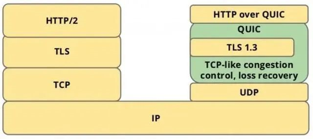
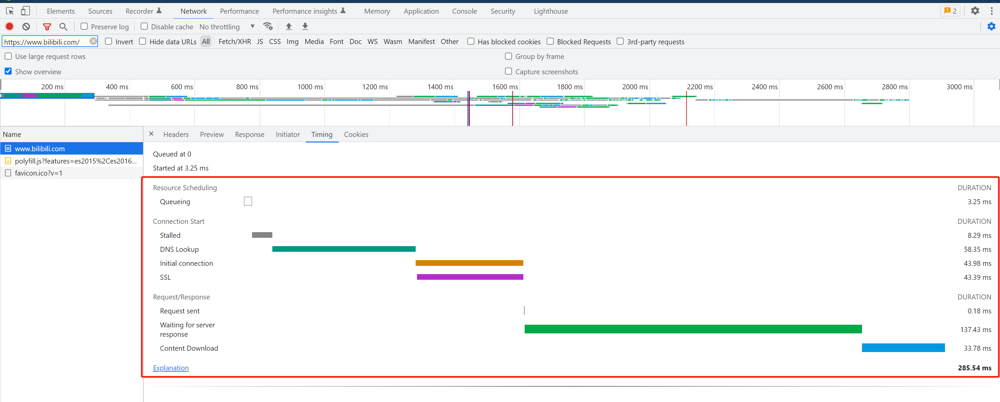
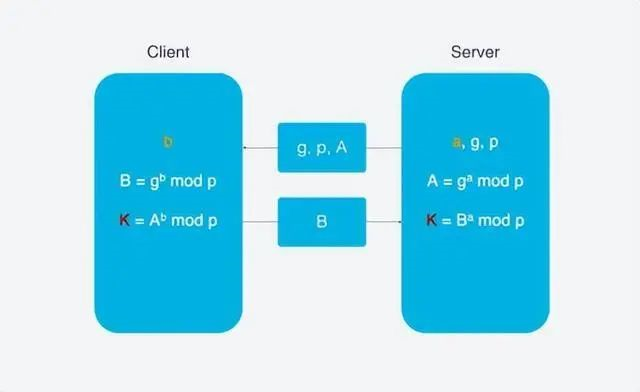
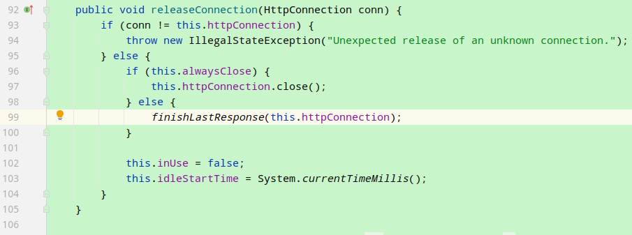
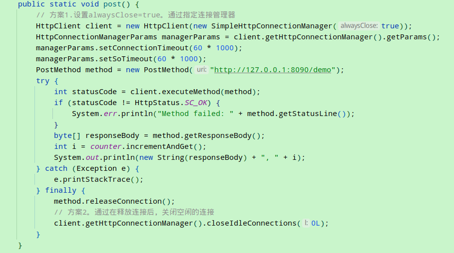

# 3.http

## 1.基础

[HTTP 协议整理](https://my.oschina.net/u/3768341/blog/3130392)

### 1.1.介绍
HTTP协议即超文本传送协议(Hypertext Transfer Protocol)，是Web联网的基础，也是手机联网常用的协议之一，HTTP协议是建立在TCP协议之上的一种应用。

HTTP连接最显著的特点是客户端发送的每次请求都需要服务器回送响应，在请求结束后，会主动释放连接。从建立连接到关闭连接的过程称为“一次连接“。

1）在HTTP 1.0中，客户端的每次请求都要求建立一次单独的连接，在处理完本次请求后，就自动释放连接。

2）在HTTP 1.1中则可以在一次连接中处理多个请求，并且多个请求可以重叠进行，不需要等待一个请求结束后再发送下一个请求。

由于HTTP在每次请求结束后都会主动释放连接，因此HTTP连接是一种“短连接”，要保持客户端程序的在线状态，需要不断地向服务器发起连接请求。
通常的 做法是即时不需要获得任何数据，客户端也保持每隔一段固定的时间向服务器发送一次“保持连接”的请求，服务器在收到该请求后对客户端进行回复，
表明知道客 户端“在线”。若服务器长时间无法收到客户端的请求，则认为客户端“下线”，若客户端长时间无法收到服务器的回复，则认为网络已经断开。

### 1.2.tcp与http的关系

- TCP是底层通讯协议，定义的是数据传输和连接方式的规范
- HTTP是应用层协议，定义的是传输数据的内容的规范
- HTTP协议中的数据是利用TCP协议传输的，所以支持HTTP也就一定支持TCP
- HTTP支持的是www服务，而TCP/IP是协议它是Internet国际互联网络的基础。TCP/IP是网络中使用的基本的通信协议。
- TCP/IP实际上是一组协议，它包括上百个各种功能的协议，如：远程登录、文件传输和电子邮件等，
  而TCP协议和IP协议是保证数据完整传输的两个基本的重要协议。通常说TCP/IP是Internet协议族，而不单单是TCP和IP。

### 1.3.协议发展

- 1991 HTTP/0.9
- 1996 HTTP/1.0
- 1997 HTTP/1.1
- 2009 Google 设计了基于TCP的SPDY
- 2013 QUIC
- 2015 HTTP/2
- 2018 HTTP/3

#### 1.3.1. http 0.9
早期版本，只支持GET方法，只支持文本，短连接，每次发送请求后就释放连接。

#### 1.3.2. http 1.0

支持GET、POST、HEAD等方法，支持MIME(所有文件格式)，新增功能还包括状态码、多字符集支持、多部分发送、权限、缓存、内容编码。
但还是短连接，性能不高。

#### 1.3.3. http 1.1

- 新增了许多请求方法：PUT、PATCH、HEAD、 OPTIONS、DELETE。
- 最大的变化就是引入了持久连接（persistent connection），在HTTP/1.1中默认开启 Connection: keep-alive，即TCP连接默认不关闭，可以被多个请求复用，实现连接复用。
- 管道机制：就是在同一个TCP连接中可以同时发送多个HTTP请求而不用等待上一个请求返回数据后，再发送下一个请求。虽然可以同时发送多个HTTP请求，但是服务器响应是按照请求的顺序进行响应的。
- 分块传输编码：  
  - 背景：请求的编码实体资源尚未全部传输完成之前，浏览器无法显示请求页面。于是，1.1在1.0内容编码的基础上，提出了分块传输编码。
    这样在传输大容量数据时，通过便可以把数据分割成多块，让浏览器逐步显示页面。
  - 如何使用分块传输编码 :   Transfer-Encoding: chunked
  - 如何确定传输已结束：每一块都会用十六进制来标记块的大小，而实体主体的最后一块会使用“0”来标记表示结束
  
```text
HTTP/1.1 200 OK
Content-Type: text/plain
Transfer-Encoding: chunked

25
This is the data in the first chunk

1C
and this is the second one

3
con

8
sequence

0
```

#### 1.3.4. http 2.0

- 多路复用。在同一个TCP连接中，可以发送多个HTTP请求，而且请求的响应不依赖于前一个请求。每个请求单独处理，不会出现HTTP1.1中上一个请求没有回应便一直等待的情况。
- 头部压缩。当前我们在head上做了非常多的处理，导致头部过重，经过压缩后最多可压缩90%以上，降低带宽。
- 二进制数据。使用二进制数据进行通讯，提高数据解析效率
- 服务器推送。替代webSocket，轻量化推送功能。

#### 1.3.5.QUIC
QUIC(Quick UDP Internet Connections, 快速UDP网络连接)是基于UDP的协议, 利用了UDP的速度和效率, 同时整合TCP, 
TLS和HTTP/2的优点并加以优化. 用一张图可以清晰的表示他们之间的关系。



QUIC是用来替代TCP, SSL/TLS的传输层协议, 在传输层之上还有应用层. 我们熟知的应用层协议有HTTP, FTP, IMAP等, 
这些协议理论上都可以运行在QUIC上, 其中运行在QUIC之上的协议被称为HTTP/3, 这就是HTTP over QUIC即HTTP/3的含义


#### 1.3.6.http 3.0

HTTP3是在保持QUIC稳定性的同时使用UDP来实现高速度（选择QUIC就是选择UDP）, 同时又不会牺牲TLS的安全性。【是的，3.0放弃TCP，选择了UDP】

### 1.4.MIME

资源实际上是一种承载着某种信息的数据，相同的信息可以采用不同形态的数据来展现，数据的“形态”主要体现为展示数据所采用的格式，
比如一个数据对象可以通过XML格式来表示，也可以通过JSON格式来表示。数据的处理必须依赖于一种已知的格式，所以将Web资源的形态以一种标准化的方式固定下来显得尤为重要，这就是我们接下来着重介绍的媒体媒体（Media Type）。

不论是通过HTTP请求从Web服务器上获取资源，还是利用请求向服务器提交资源，响应或者请求的主体（Body）除了包含承载资源本身的数据之外，其报头（Header）部分还应该包含表示数据形态的媒体类型。

媒体类型又被称为MIME（Multipurpose Internet Mail Extension）类型，MIME是一个互联网标准，它扩展了电子邮件标准，
使其能够支持非ASCII字符、二进制格式附件等多种格式的邮件消息。由于MIME在电子邮件系统应用得非常好，所以被HTTP用于描述并标记多媒体内容。
下面的列表给出了一种常用的媒体类型。

- text/html：HTML格式的文档。
- text/xml（application/xml）：XML格式的文本。
- text/json（application/json）： JSON格式的文本。
- image/gif（image/jpeg、image/png）：GIF（JPEG、PNG）格式的图片。
- audio/mp4（audio/mpeg、audio/vnd.wave）：MP4（MPEG、WAVE）格式的音频文件。
- video/mp4（video/mpeg、video/quicktime）：MP4（MPEG、QUICKTIME）格式的视频文件。

### 1.5.HTTP方法

HTTP采用简单的请求/响应模式的消息交换旨在实现针对某个Web资源的某种操作。

至于针对资源的操作类型，不外乎CRUD（Create、Retrieve、Update和Delete）而已。

一个HTTP请求除了利用URI标志目标资源之外，还需要通过HTTP方法（HTTP Method或者HTTP Verb）指名针对资源的操作类型。

我们常用的HTTP方法 包括GET、POST、PUT、DELETE、HEAD、OPTIONS、TRACE、CONNECTION和PATCH等

### 1.6.状态码

[https://baike.baidu.com/item/HTTP/243074?fr=aladdin](https://baike.baidu.com/item/HTTP/243074?fr=aladdin)

总结：
- 200: 正常
- 300: 交给别人
- 400: 客户端的错
- 500: 服务端的错

### 1.7.浏览器

每个请求，使用不同的颜色标记不同的阶段：
- Resource Scheduling：阶段一：本地资源调度
  - Queueing： 浏览器本地请求队列。
- Connection Start： 阶段二：建立连接
  - Stalled：浏览器得到要发出这个请求的指令，到请求可以发出的等待时间，一般是代理协商、以及等待可复用的TCP连接释放的时间，不包括DNS查询、建立TCP连接等时间等。
  - DNS Lookup: DNS解析查询地址
  - Initial connection：初始化连接，TCP三次握手
  - SSL: 建立SSL
- Request/Response   阶段三：请求与响应
  - Request sent:请求第一个字节发出前到最后一个字节发出后的时间，也就是上传时间
  - Waiting for server response:请求发出后，到收到响应的第一个字节所花费的时间
  - Content Download: 收到响应的第一个字节，到接受完最后一个字节的时间，就是下载时间

### 1.8.相关命令

```shell
# 1.ping 域名
[root@localhost ~]# ping -c 4 www.bilibili.com
PING a.w.bilicdn1.com (221.204.56.95) 56(84) bytes of data.
64 bytes from 95.56.204.221.adsl-pool.sx.cn (221.204.56.95): icmp_seq=1 ttl=53 time=11.2 ms
64 bytes from 95.56.204.221.adsl-pool.sx.cn (221.204.56.95): icmp_seq=2 ttl=53 time=17.2 ms
64 bytes from 95.56.204.221.adsl-pool.sx.cn (221.204.56.95): icmp_seq=3 ttl=53 time=12.9 ms
64 bytes from 95.56.204.221.adsl-pool.sx.cn (221.204.56.95): icmp_seq=4 ttl=53 time=12.9 ms

--- a.w.bilicdn1.com ping statistics ---
4 packets transmitted, 4 received, 0% packet loss, time 3002ms
rtt min/avg/max/mdev = 11.267/13.596/17.225/2.209 ms


# 2.查询DNS。安装 yum install bind-utils
[root@localhost ~]# nslookup
## 进入查询模式，这里服务器默认使用DNS是114.114.114.114
> www.bilibili.com
Server:		114.114.114.114
Address:	114.114.114.114#53
## 以下是查询出来域名解析出来的地址（都是cdn地址）
Non-authoritative answer:
www.bilibili.com	canonical name = a.w.bilicdn1.com.
Name:	a.w.bilicdn1.com
Address: 123.234.3.167
Name:	a.w.bilicdn1.com
Address: 123.234.3.168
Name:	a.w.bilicdn1.com
Address: 221.204.56.91
## 修改DNS为8.8.8.8
> server 8.8.8.8
Default server: 8.8.8.8
Address: 8.8.8.8#53
## 再查询出来域名解析出来的地址（都是cdn地址）
> www.bilibili.com
Server:		8.8.8.8
Address:	8.8.8.8#53

Non-authoritative answer:
www.bilibili.com	canonical name = a.w.bilicdn1.com.
Name:	a.w.bilicdn1.com
Address: 221.204.56.93
Name:	a.w.bilicdn1.com
Address: 221.204.56.95

# 3.域名注册信息。安装yum install jwhois
[root@localhost ~]# whois bilibili.com
[Querying whois.verisign-grs.com]
[Redirected to grs-whois.hichina.com]
[Querying grs-whois.hichina.com]
[grs-whois.hichina.com]
Domain Name: bilibili.com
Registry Domain ID: 133351793_DOMAIN_COM-VRSN
Registrar WHOIS Server: grs-whois.hichina.com
Registrar URL: http://www.net.cn
Updated Date: 2021-12-29T02:09:35Z
Creation Date: 2004-10-21T11:37:37Z
Registrar Registration Expiration Date: 2031-10-21T11:37:37Z
Registrar: Alibaba Cloud Computing (Beijing) Co., Ltd.
Registrar IANA ID: 420
Reseller:
Domain Status: clientTransferProhibited https://icann.org/epp#clientTransferProhibited
Domain Status: clientUpdateProhibited https://icann.org/epp#clientUpdateProhibited
Domain Status: serverDeleteProhibited https://icann.org/epp#serverDeleteProhibited
Domain Status: serverTransferProhibited https://icann.org/epp#serverTransferProhibited
Domain Status: serverUpdateProhibited https://icann.org/epp#serverUpdateProhibited
Registrant City: 
Registrant State/Province: 
Registrant Country: 
Registrant Email:https://whois.aliyun.com/whois/whoisForm
Registry Registrant ID: Not Available From Registry
Name Server: NS3.DNSV5.COM
Name Server: NS4.DNSV5.COM
DNSSEC: unsigned
Registrar Abuse Contact Email: DomainAbuse@service.aliyun.com
Registrar Abuse Contact Phone: +86.95187
URL of the ICANN WHOIS Data Problem Reporting System: http://wdprs.internic.net/
>>>Last update of WHOIS database: 2023-03-16T14:16:31Z <<<

# 4.请求过程追踪。安装 yum install traceroute。
教程1：https://www.mumupc.com/archives/19402.html
教程2：https://mp.weixin.qq.com/s/ha9LNilrLuA0YIdIonMgVw
[root@localhost ~]# traceroute -m 10 www.bilibili.com
traceroute to www.bilibili.com (221.15.71.67), 10 hops max, 60 byte packets
 1  gateway (192.168.3.1)  3.363 ms  4.934 ms  6.603 ms
 2  192.168.1.1 (192.168.1.1)  11.931 ms  11.813 ms  11.726 ms
 3  10.70.0.1 (10.70.0.1)  11.628 ms  11.539 ms  11.499 ms
 4  125.33.184.53 (125.33.184.53)  13.005 ms  11.295 ms  12.848 ms
 5  125.33.186.85 (125.33.186.85)  12.922 ms * nec.bta.net.cn (202.96.12.121)  12.680 ms
 6  219.158.11.102 (219.158.11.102)  22.875 ms 219.158.108.174 (219.158.108.174)  17.619 ms 219.158.100.94 (219.158.100.94)  15.347 ms
 7  pc162.zz.ha.cn (61.168.31.162)  17.776 ms pc98.zz.ha.cn (61.168.30.98)  17.729 ms pc142.zz.ha.cn (61.168.37.142)  16.651 ms
 8  hn.kd.ny.adsl (125.45.253.222)  23.836 ms hn.kd.ny.adsl (125.45.253.90)  20.204 ms hn.kd.ny.adsl (125.45.253.222)  23.707 ms
 9  hn.kd.dhcp (61.54.92.102)  20.026 ms hn.kd.dhcp (61.54.92.98)  19.822 ms hn.kd.dhcp (61.54.92.102)  19.897 ms
10  * * *
```




## 2.报文

### 2.1.协议的组成

1. 请求部分：
```text
GET /App1/1.html HTTP/1.1
Accept: */*
Accept-Language: zh-cn
Accept-Encoding: gzip, deflate
User-Agent: Mozilla/4.0 (compatible; MSIE 6.0; Windows NT 5.1; SV1; .NET CLR 2.0.50727; .NET CLR 3.0.4506.2152; .NET CLR 3.5.30729)
Host: localhost:8080
Connection: Keep-Alive
第一个空行-->			
username=admin&password=123

请求部分由三部分组成的：
请求行：位于第一行,GET /App1/1.html HTTP/1.1
请求消息头：从第二行开始至第一个空行结束
请求正文：从第一个空行之后的都是正文
```

2. 响应部分：
```text
HTTP/1.1 200 OK
Server: Apache-Coyote/1.1
Accept-Ranges: bytes
ETag: W/"65-1366335797484"
Last-Modified: Fri, 19 Apr 2013 01:43:17 GMT
Content-Type: text/html
Content-Length: 65
Date: Fri, 19 Apr 2013 02:06:23 GMT
Warnning：w1
Warnning: w2

hello http
<a href="b.html">click</a>


响应部分由三部分组成的：
响应行：位于第一行
响应消息头：从第二行开始至第一个空行结束
响应正文：从第一个空行之后的都是正文
```

### 2.2.请求头
HTTP的请求头（Request Headers）包含了关于请求的各种信息，由客户端发送给服务器。这些信息帮助服务器理解客户端的请求，以及如何处理这个请求。
1. Host：请求所发送的目标域名或IP地址。
2. User-Agent：发送请求的浏览器类型、版本、操作系统等信息。这对于服务器来说很有用，因为它可以根据这些信息来定制响应或识别恶意行为。
3. Accept：浏览器能够处理的内容类型，如text/html, image/jpeg等。
4. Accept-Language：浏览器所支持的自然语言列表，按照优先级排序。
5. Accept-Encoding：浏览器所支持的编码类型，如gzip, deflate等。
6. Connection：浏览器是否希望与服务器保持持久连接（如keep-alive）。
7. Cookie：包含先前服务器通过Set-Cookie头发送给客户端的cookie信息。
8. Referer：发出请求的页面的URL。这通常用于分析来源、防盗链等。
9. Cache-Control：指定请求和响应遵循的缓存机制。
10. Authorization：包含客户端的认证信息，通常用于HTTP基本认证或Bearer令牌。
11. Content-Type：如果请求体中有数据，这个头部会指定数据的类型，如application/json或multipart/form-data。
12. Content-Length：请求体的长度（以字节为单位）。
13. Origin：发起请求的页面的源（协议、域名和端口）。通常用于CORS（跨源资源共享）检查。
14. If-Modified-Since：如果指定的日期之后资源未被修改，则服务器返回304 Not Modified状态，而不返回资源内容。
15. If-None-Match：如果资源的ETag没有改变，则服务器返回304 Not Modified状态。

请注意，这只是一个简略的列表，HTTP协议定义了更多的请求头字段，而且也可以自定义请求头字段。在实际应用中，可以根据具体的需求和场景来选择合适的请求头字段。

### 2.3.cookie
HTTP cookies 详解[https://www.w3cschool.cn/pegosu/](https://www.w3cschool.cn/pegosu/)

http是无状态的协议，但是很多时候需要记录用户的登录状态，所以就出现了cookie。
请求头中包含一个或多个Cookie，用于传递之前服务器通过Set-Cookie响应头发送给客户端的cookie信息。这样，服务器就能够识别并跟踪特定的用户会话，从而提供个性化的服务或维护用户的登录状态等。

重点：cookie的属性通常都是后端创建的，大部分属性都是作用于浏览器，帮助浏览器控制网站的安全性。

作用：
1. 会话管理：例如java后端服务器会生成name=jsessionId
2. 个性化服务：基于Cookie存储的用户信息，例如，记录用户偏好设置，调整页面的布局等。
3. 用户身份验证：例如使用JWT记录token信息等
4. 安全性：可以通过设置Cookie的属性来提高安全性。例如：
  - 设置HttpOnly属性，使得Cookie不能通过JavaScript访问，从而防止跨站脚本攻击（XSS）。
  - 设置Secure属性，可以确保Cookie只在HTTPS连接中传输，增强数据传输的安全性。
5. 网站统计和分析：可以收集用户的访问数据，如访问次数、访问页面等。用于分析用户行为、优化网站结构和内容。


常见的Cookie属性：
1. Name（名称）：Cookie的名称，用于在服务器端识别和访问特定的Cookie。
2. Value（值）：Cookie相关联的值，可以是任何字符串或文本。它表示Cookie的具体内容或数据。
3. Domain（域）：指定了哪些域可以接收该Cookie。只有发送到指定域或其子域的请求才会携带该Cookie。如果未指定，则默认为设置Cookie的同一主机。
4. Path（路径）：指定了哪些请求URL路径可以访问该Cookie，可以限制Cookie的访问范围，设置为“/”则可以访问全部路径
5. Expires/Max-Age（过期时间）：设置Cookie的过期时间。
6. HttpOnly：设置该属性后，则Cookie只能通过HTTP请求访问，而不能通过客户端脚本（如JavaScript）来访问。
   因为攻击者无法使用 JavaScript 窃取或篡改 cookie，这有助于防止跨站脚本攻击（XSS）。 
7. Secure：当此属性设置为True时，Cookie只能通过HTTPS协议进行传输，而不能在HTTP协议中传输。这增加了Cookie传输的安全性。 
8. SameSite：用于限制第三方网站访问Cookie（用于告诉浏览器如何处理跨站请求）。作用是防止跨站点请求伪造（CSRF）攻击。 它有三个值：
   - Strict：浏览器仅在请求的来源与 cookie 的来源完全匹配时才会附带 cookie。这有助于防止跨站点请求伪造攻击
   - Lax：浏览器在某些情况下会附带 cookie，例如，当用户通过链接或按钮从其他站点导航到目标站点时，浏览器会附带 cookie。
   - None：不会限制第三方网站访问Cookie，默认值。

```http request
Set-Cookie: userId=123; SameSite=None; Secure; HttpOnly
```

### 2.4.前端存储

主流方案：
1. Cookie：Cookie的数量和大小都受到一定的限制。通常限制每个域名20个cookie，每个cookie大小4KB
2. Web Storage：2014 年发布的 HTML5 标准新增了 Web Storage 的本地储存方案，其包括 LocalStorage 和 SessionStorage
   - LocalStorage 的特点是：
     - 使用 Key-Value 形式储存
     - 大小有 10MB
     - Key 和 Value 以字符串形式储存，不能存储对象
   - 使用案例：localStorage.setItem('userId', '123'); localStorage.getItem('userId')
   - 区别：SessionStorage 与会话生命周期一致。LocalStorage一直存储在本地。
- IndexedDB：前端数据库，kv结构，可以存储对象，但是操作比较复杂，使用门槛较高。
  - GoDB.js。是一个基于 IndexedDB 实现前端本地储存的类库，简化操作，有点类似hibernate是面对对象的使用方式。

## 3.https

[https://www.jianshu.com/p/26285148ec32](https://www.jianshu.com/p/26285148ec32)

- http是不安全的：数据容易被拦截，被篡改，被攻击等
- https是安全的：对数据进行加密，对请求进行身份验证，数据是完整的不易被篡改
- https的连接：https://mp.weixin.qq.com/s/Sqco2jlApWpDAJ9XD7Mgcw

### 3.1.https使用非对称加密

对称加密：就是使用一个密钥，一个加密也可以解密

非对称加密：就是加密使用公钥，解密必须使用私钥；加密使用私钥，解密必须使用私钥；

公钥是可以公开的，而私钥是只有一个人知道的（在浏览器中浏览器有自己的私钥）

### 3.2.HTTPS双向认证指南

客户端和服务器端都需要验证对方的身份，在建立Https连接的过程中，握手的流程比单向认证多了几步。
单向认证的过程，客户端从服务器端下载服务器端公钥证书进行验证，然后建立安全通信通道。
双向通信流程，客户端除了需要从服务器端下载服务器的公钥证书进行验证外，还需要把客户端的公钥证书上传到服务器端给服务器端进行验证，
等双方都认证通过了，才开始建立安全通信通道进行数据传输。

[https://www.jianshu.com/p/2b2d1f511959?utm_campaign=haruki](https://www.jianshu.com/p/2b2d1f511959?utm_campaign=haruki)

[https://help.aliyun.com/document_detail/160093.html?spm=5176.22414175.sslink.1.92b21e432Ub9Fd](https://help.aliyun.com/document_detail/160093.html?spm=5176.22414175.sslink.1.92b21e432Ub9Fd)

[https://help.aliyun.com/document_detail/85954.html?spm=5176.22414175.sslink.2.92b21e432Ub9Fd](https://help.aliyun.com/document_detail/85954.html?spm=5176.22414175.sslink.2.92b21e432Ub9Fd)

HTTPS双向认证方式通信在一些安全级别较高的场景非常有用，拥有合法证书的客户端才能正常访问业务。

## 4.QUIC特性

- [提速 30%！腾讯TQUIC 网络传输协议](https://mp.weixin.qq.com/s/Sf8JsZKeZYxT9WBZrh_etg)
- [http3的特性](https://mp.weixin.qq.com/s/ESjxTQlYQ7aZRWKivZ4-Uw)

http3的特性其实就是QUIC特性

### 4.1.RTT建立连接

RTT: round-trip time, 仅包括请求访问来回的时间。http 1.1 建立连接的时候，需要3次握手，也就是3个RTT。

HTTP/3首次连接只需要1RTT, 后面的链接只需要0RTT, 意味着客户端发送给服务端的第一个包就带有请求数据, 其主要连接过程如下:
- 首次连接, 客户端发送Inchoate Client Hello, 用于请求连接;
- 服务端生成g, p, a, 根据g, p, a算出A, 然后将g, p, A放到Server Config中在发送Rejection消息给客户端.
- 客户端接收到g,p,A后, 自己再生成b, 根据g,p,a算出B, 根据A,p,b算出初始密钥K, B和K算好后, 客户端会用K加密HTTP数据, 连同B一起发送给服务端.
- 服务端接收到B后, 根据a,p,B生成与客户端同样的密钥, 再用这密钥解密收到的HTTP数据. 为了进一步的安全(前向安全性), 服务端会更新自己的随机数a和公钥, 
  在生成新的密钥S, 然后把公钥通过Server Hello发送给客户端. 连同Server Hello消息, 还有HTTP返回数据.



这里使用DH密钥交换算法, DH算法的核心就是服务端生成a,g,p3个随机数, a自己持有, g和p要传输给客户端, 而客户端会生成b这1个随机数, 
通过DH算法客户端和服务端可以算出同样的密钥. 在这过程中a和b并不参与网络传输, 安全性大大提升. 因为p和g是大数, 
所以即使在网络传输中p, g, A, B都被劫持, 靠现在的计算力算力也无法破解.

### 4.2.连接迁移

TCP连接基于四元组(源IP, 源端口, 目的IP, 目的端口), 切换网络时至少会有一个因素发生变化, 导致连接发送变化. 当连接发送变化是, 
如果还是用原来的TCP连接, 则会导致连接失败, 就得等到原来的连接超时后重新建立连接, 所以我们有时候发现切换到一个新的网络时, 
即使网络状况良好, 但是内容还是需要加载很久. 如果实现的好, 当检测到网络变化时, 立即建立新的TCP连接, 即使这样, 建立新的连接还是需要几百毫秒时间.

QUIC不受四元组的影响, 当这四个元素发生变化时, 原连接依然维持. 原理如下:

QUIC不以四元素作为表示, 而是使用一个64位的随机数, 这个随机数被称为Connection ID, 即使IP或者端口发生变化, 
只要Connection ID没有变化, 那么连接依然可以维持.

### 4.3.队头阻塞/多路复用
HTTP/1.1和HTTP/2都存在队头阻塞的问题(Head Of Line blocking). TCP是个面向连接的协议, 即发送请求后需要收到ACK消息, 
以确认对象已接受数据. 如果每次请求都要在收到上次请求的ACK消息后再请求, 那么效率无疑很低. 后来HTTP/1.1提出了Pipeline技术, 
允许一个TCP连接同时发送多个请求. 这样就提升了传输效率.

队头阻塞：一个TCP连接同时传输10个请求, 其中1,2,3个请求给客户端接收, 但是第四个请求丢失, 那么后面第5-10个请求都被阻塞. 
需要等第四个请求处理完毕后才能被处理. 这样就浪费了带宽资源. 因此, HTTP一般又允许每个主机建立6个TCP连接, 这样可以更加充分的利用带宽资源, 
但每个连接中队头阻塞的问题还是存在的. 

HTTP/2的多路复用解决了上述的队头阻塞问题. 在HTTP/2中, 每个请求都被拆分为多个Frame通过一条TCP连接同时被传输, 这样即使一个请求被阻塞, 也不会影响其他的请求
但是, HTTP/2虽然可以解决请求这一粒度下的阻塞, 但HTTP/2的基础TCP协议本身却也存在队头阻塞的问题. HTTP/2的每个请求都会被拆分成多个Frame, 
不同请求的Frame组合成Stream, Stream是TCP上的逻辑传输单元, 这样HTTP/2就达到了一条连接同时发送多个请求的目标, 其中Stram1已经正确送达, Stram2中的第三个Frame丢失
TCP处理数据是有严格的前后顺序, 先发送的Frame要先被处理, 这样就会要求发送方重新发送第三个Frame, Steam3和Steam4虽然已到达但却不能被处理, 那么这时整条链路都会被阻塞.

QUIC是如何解决队头阻塞的问题的? 主要有两点:
- QUIC的传输单位是Packet, 加密单元也是Packet, 整个加密, 传输, 解密都基于Packet, 这就能避免TLS的阻塞问题.
- QUIC基于UDP, UDP的数据包在接收端没有处理顺序, 即使中间丢失一个包, 也不会阻塞整条连接. 其他的资源会被正常处理.

### 4.4.拥塞控制

拥塞控制的目的是避免过多的数据一下子涌入网络, 导致网络超出最大负荷. QUIC的拥塞控制与TCP类似, 并在此基础上做了改进. 先来看看TCP的拥塞控制.

- 慢启动: 发送方像接收方发送一个单位的数据, 收到确认后发送2个单位, 然后是4个, 8个依次指数增长, 这个过程中不断试探网络的拥塞程度.
- 避免拥塞: 指数增长到某个限制之后, 指数增长变为线性增长
- 快速重传: 发送方每一次发送都会设置一个超时计时器, 超时后认为丢失, 需要重发
- 快速恢复: 在上面快速重传的基础上, 发送方重新发送数据时, 也会启动一个超时定时器, 如果收到确认消息则进入拥塞避免阶段, 如果仍然超时, 则回到慢启动阶段.

QUIC重新实现了TCP协议中的Cubic算法进行拥塞控制, 下面是QUIC改进的拥塞控制的特性:
1. 热插拔。tcp的拥塞算法调整需要修改内核参数，这样会导致整个服务器的配置都发生变化。而QUIC的调整是应用侧的配置调整。
2. 前向纠错 FEC。
3. 单调递增的Packer Number。TCP为了保证可靠性使用Sequence Number和ACK来确认消息是否有序到达
4. ACK Delay。
5. 更多的ACK块

### 4.5.
### 4.6.

## 5.常见面试题

### 5.1.浏览器与服务器建立TCP连接后，是否会在一个http请求完成后断开？什么情况下回断开？

http/1.0
的时候，服务器完成一个http连接之后就会断开这个连接。每次请求每次重连，代码很大。到了http/1.1
后 ，增加了 Connection: keep-alive，在请求之后会保持连接一定时间。当
Header 中有 collection: close 的时候，TCP连接会关闭；或者 当keep-alive
设置的时间到了，自动断开。

### 5.2.一个 TCP 连接可以对应几个http请求？

一个 TCP 创建出来后，会保持一定时间。这个时间内，可以发送多个http请求。

### 5.3.一个 TCP 连接中，http请求可以一起发送吗？

在http/1.1 中， 单个 TCP
同时只能处理一个请求。也就是当我们打开一个页面的时候，有多个较大的请求，他们应该各个会创建一个
TCP 连接。其实就是两个不同的http请求，开始到结束的时间在同一个 TCP
连接里不能重叠。但是在http/2， 提供了multiplexing，支持多路传输

### 5.4.为什么有的时候刷新页面不需要重新创建SSL连接？

TCP 连接有的时候会被浏览器和服务端维持一段时间。TCP 不需要重新建立，SSL
自然也会用之前的。

### 5.5.浏览器对同一个host建立的TCP连接数量是否有限制？

假设我们还处在 HTTP/1.1
时代，那个时候没有多路传输，当浏览器拿到一个有几十张图片的网页该怎么办呢？肯定不能只开一个
TCP 连接顺序下载，那样用户肯定等的很难受但是如果每个图片都开一个 TCP
连接发 HTTP 请求，那电脑或者服务器都可能受不了要是有 1000
张图片的话总不能开 1000 个TCP 连接吧，你的电脑同意 NAT
也不一定会同意。Chrome 最多允许对同一个 Host 建立六个 TCP
连接。不同的浏览器有一些区别。

### 5.6.HTTP长连接、短连接究竟是什么？

[https://www.cnblogs.com/gotodsp/p/6366163.html](https://www.cnblogs.com/gotodsp/p/6366163.html)

### 5.7.http常见面试题

[https://mp.weixin.qq.com/s/t7ZYT6wBBbFYVBPOSztpRg](https://mp.weixin.qq.com/s/t7ZYT6wBBbFYVBPOSztpRg)

HTTP Status Code详解：
[https://mp.weixin.qq.com/s/UaVuQEUehZxJdv0i-NiZmQ](https://mp.weixin.qq.com/s/UaVuQEUehZxJdv0i-NiZmQ)


### 5.8.httpclient3.1无法正常关闭连接

1.现象

经过测试，apache commns httpclient 3.1，在发送请求后，不会自动关闭连接。导致被调用方的tcp数量不断的累计，
出现大量的 time_wait（根据设置的超时时间，累成的时间不同，如nginx配置了keepalive_timeout=10，则会保持连接10s）。

如果并发过高，不进行关闭的话，应用会linux下运行会出现 too many open files 的错误，导致服务不可用。

2.分析原因

3.1版本的 httpclient ，默认使用了SimpleHttpConnectionManager进行连接管理。但是在我们调用releaseConnection的时候，alwaysClose默认是false，虽然可以使连接复用，但是却导致了连接长期不释放。官方的意思是想让我们复用http连接，避免频繁的进行tcp连接与释放，但是官方文档没有进行说明，代码案例没有正常使用，导致了目前市面上存在大量的错误使用。



3.解决方案

- 方案1。设置alwaysClose默认是false，如下图所示。
- 方案2。通过在释放连接后，关闭空闲的连接，如下图所示。



3.方案3【推荐】。尽可能升级到新版本的httpclient。新版本支持很多与微服务相关的特性，方便后期改造。并且httpclient3及以下的版本已经被官方舍弃

```xml
<dependency>
    <groupId>org.apache.httpcomponents</groupId>
    <artifactId>httpclient</artifactId>
    <version>4.5.12</version>
</dependency>
```
