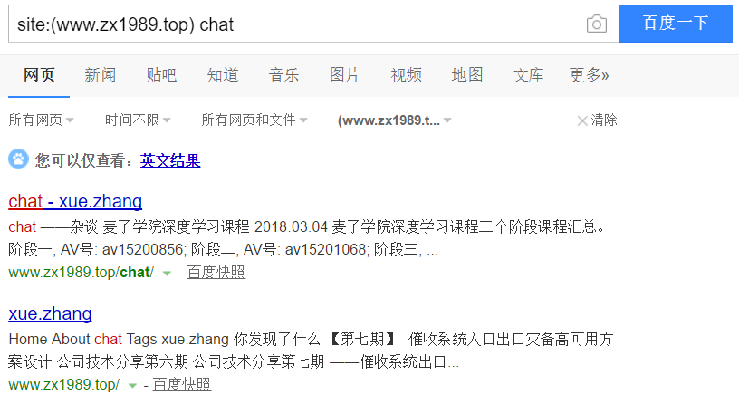

# 5.安全

## 1.web基础介绍

### 1.1.web介绍

什么是web:
- 万维网
- word wide web
- 非常普遍的互联网应用
- 每天都有数以亿万的资源在传输

#### 1.1.1. web发展史

1.web 1.0:比如个人网站和门户网站，以静页面为主的文本应用。

面临的安全问题：SQL注入、文件包含、命令执行、上传漏洞、挂马、暗链，直接危害web服务器

2.web 2.0:比如微博和博客等，能都进行人与人之间互动。
面临的安全问题：URL跳转、数据劫持、钓鱼、框架漏洞、逻辑漏洞、CSRF、XSS，直接危害web用户

随着技术的发展，web安全问题数量迅速增加、种类迅速增加，并由针对web服务器转向针对web用户。

#### 1.1.2. web流程

web用户使用浏览器访问web应用，web服务器到数据库获得数据，并发送给web服务器，web服务器把数据发送给浏览器，浏览器把数据展示给web用户

#### 1.1.3. 浏览器

web用户使用域名访问web应用，浏览器首先到DNS服务器，将域名解析为web应用的IP，浏览器通过IP访问web应用。
之后浏览器将web应用返回的数据，使用HTML、JavaScript、css等技术渲染成我们见到的页面。


### 1.2.web通讯

#### 1.2.1.URL协议

URL是什么:统一资源定位符（Uniform Resouces Locator）。支持多种协议：http、ftp、file等。用于定位到web服务器的资源

URL格式：
- schema:  host [:port] [/path/../] [?query-string] [#anchor]
- schema底层协议：https、http、ftp、file
- host域名或IP
- port端口号，https默认443、http默认80，可以不写，其他的都要写

#### 1.2.2. HTTP协议

1. HTTP是什么：

超文本传输协议（hyper test transfer protocol）,是web应用的通讯协议，是web的基础协议。
常见的HTTP请求方法有GET和POST,响应报文包括：请求行(request lines)、请求头(headers)、数据体(body， get请求没有body)
除此之外还有，put,delete,options等方法。

2. referer
   作用：
- 在请求头中添加，告诉web应用请求从哪个URL跳转过来的。
- 统计流量，如CNZZ和百度统计
- 判断来源合法性；防止盗链和CSRG漏洞

3. location
   在页面跳转的时候，状态码为301 / 302 ，location表示跳转到那个URL上。


### 1.3.HTML语法
略略略~~~

1. 浏览器的提示弹框：
```javascript
alert("方式1");
confirm('方式2');
prompt('方式3','123');    
```


2. 获得cookie

- 方式1：
```javascript
document.cookie = 'is my cookie'// 写cookie
alert(document.cookie)// 读取cookie
```


- 方式2：
  在浏览器的console窗口获得。


3. 获取或控制用户页面
```javascript
window.location.href // 获得页面URL
window.location.href='https://www.baidu.com'// 跳转到URL
```

4. 获得浏览器信息
```javascript
window.navigator
```

### 1.4.web服务端
#### 1.4.1. 概述


#### 1.4.2. 环境搭建
以下教程以java环境运行
- 技术框架： spring boot
- 数据库： MySQL
- web容器： tomcat

## 2.web常见安全问题

> 以下演示案例，请clone到本地后运行项目。访问 http://127.0.0.1:8888 即可查看
> 项目地址 [点这里](https://gitee.com/luckSnow/network_security)

### 2.1.常见的web安全问题
#### 2.1.1.钓鱼Phishing
##### 2.1.1.1. 特征
- 诱惑性标题
- 仿冒真实网站
- 骗取用户账号
- 骗取用户资料

##### 2.1.1.2. 常见手法
模仿真正的官网，让用户误以为进入了官网，这个时候用户进行登录或修改密码等操作后，
钓鱼网站就获得了用户的登录信息。技术含量低，受害者多为安全意识差的用户。

##### 2.1.1.3. 场景
- 账号异常登录信息，需要修改密码
- 中奖信息

#### 2.1.2、网页篡改 Tampering
##### 2.1.2.1. 介绍
多为黑客进行攻击后，修改服务器上的文件，已达到自己的目的。

##### 2.1.2.2.怎么发现网页被篡改
这里我们可以使用百度的搜索引擎(SEO)进行搜索。
intitle是SEO中的高级搜索指令，intitle：关键词指令返回的是页面title中包含关键词的页面。Goolge和百度都支持intitle指令。

intitle:hacked by


intitle:keyword 标题中含有关键词的页面
intext:keyword 正文中包含关键词的页面
site:domain 在某个域名和子域名下的页面


#### 2.1.3、暗链 Hidden hyperlineks
##### 2.1.3.1. 介绍
黑客入侵后，在页面中添加隐藏的链接。以此达到提高搜索引擎排名的目的。
目前中文互联网网站存在的安全隐患：


暗链是目前法律风险最小，收入最高，受影响最广最大的安全隐患。

目前，在国内已经形成成熟的产业链

##### 2.1.3.2. 特征
- 隐藏在页面中的连接，无法被用户看见和使用
- 网游/医疗/博彩/色情类居多
- 为了提交网站排名


#### 2.1.4、webshell
##### 2.1.4.1. 介绍
webshell就是以asp、php、jsp或者cgi等网页文件形式存在的一种命令执行环境，也可以将其称做为一种网页后门。
黑客在入侵了一个网站后，通常会将asp或php后门文件与网站服务器WEB目录下正常的网页文件混在一起，
然后就可以使用浏览器来访问asp或者php后门，得到一个命令执行环境，以达到控制网站服务器的目的。
说白了就是木马。

##### 2.1.4.2.分类
- 大马: 功能强大，能都对服务器进行一系列操作
- 小马: 功能单一，常备称为“一句话木马”


### 2.2.XSS

#### 2.2.1. 什么是XSS
- 全称为 cross site script,翻译为跨站脚本。
- 主要的危害：盗取用户信息、钓鱼、制造蠕虫等。
- 通过“HTML注入”篡改页面，插入恶意脚本，当用户浏览页面时，实现控制用户浏览器行为的一种攻击方式。

#### 2.2.2. XSS分类
1. 存储型(永久型)
	xss脚本有页面提交后，保存在数据库中，之后查询的时候，xss脚本随着数据返回到页面上，并触发。

2. 反射型(一次型)
	xss脚本传入服务端后，有返回到客户端，导致XSS。xss脚本一般会写在URL中。由黑客散布URL，用户点击该URL后触发。

3. DOM型
	实际中包含以上两种，只是表现执行是以页面中的JS来触发XSS脚本。比如，将内容写在location.hash中。 方式 ： http://127.0.0.1:8888?#name=

#### 2.2.3. XSS演示

http://127.0.0.1:8888/city/insert?name=
http://127.0.0.1:8888?#name=

项目首页的 xss

### 2.3、CSRF

#### 2.3.1. 什么是CSRF
全称：跨站请求伪造：  cross site request forgery
就是利用已经登录的用户，在用户不知情的情况下，用用户的名义完成非法操作。

#### 2.3.2. 危害
- 执行恶意操作(“被转账”，“被发垃圾评论”)
- 制造蠕虫

#### 2.3.3. 原理
用户登录到自己的账户——>访问黑客构造的恶意页面——>页面中隐藏了非法操作。

比如：用户登录邮箱——>查看陌生人的邮件(黑客的蠕虫脚本)
					邮件中隐藏的位置|——>调用登录人的所有联系人，转发本邮件。

#### 2.3.4. 演示
第一次直接访问： http://127.0.0.1:8888/chapter_02/csrfDemo?money=11， 由于没有用户登录提示转账失败
第二次访问： 项目首页的 csrf。模拟用户已经登录成功


### 2.4、点击劫持

#### 2.4.1. 什么是点击劫持
通过覆盖不可见的页面，误导受害者点击而造成的攻击行为，骗取用户操作

也叫做UI-覆盖攻击。利用iframe或其他标签的属性

#### 2.4.3. 原理
通过误导用户点击隐藏的内容


### 2.5、URL跳转
#### 2.5.1. 什么是URL跳转
利用正规网站的URL，比如：http://www.qq.com,添加url参数进行跳转：http://www.qq.com?qq=123&url=http://hacked.com


#### 2.5.2. 实现方式：
- head头跳转： 设置 location: http://hacked.com
- js跳转: window.location.href=http://hacked.com
- mate跳转:
```
<meta http-equiv="Refresh" content="5;url=http://hacked.com" ></meta>
```

### 2.6、SQL注入
#### 2.6.1. 什么是SQL注入
是最常见的web安全漏洞，攻击者利用这个漏洞，可以访问和修改数据，甚至利用SQL注入对数据库、服务器已有的漏洞进行攻击。

#### 2.6.2. SQL注入的必备条件
- 可以控制输入的参数
- 服务器执行的SQL拼接了上面的参数

#### 2.6.3. SQL注入的本质
数据与代码未分离。将数据当成代码去使用

#### 2.6.4.演示-万能密码
账号数据 admin_zx' -- ,密码随意。发现可以登录，这就是完成了SQL注入。

我们传入的参数还可以是: admin_zx' UNION SELECT VERSION() UNION SELECT USER() --
获得数据库的版本和数据库的用户

#### 2.6.5. 危害
- 获取数据库的信息，比如管理员的账号/密码，获得数据库的用户敏感信息，甚至脱库(导出全部数据库)
- 获取服务器权限
- 植入webshell，获得服务器后门
- 操作服务器文件


### 2.7.命令注入
这里以doc命令为例：
#### 2.7.1. doc命令
- ipconfig 查看网络配置
- net user 查看系统用户
- dir "./" 查看当前目录
- find "demo" ./demo.txt	在文件中查找字符串
- echo 123 & echo 456 复合命令，使用 & 进行多个命令拼接
- ipconfig | find 'IPV4'  管道 | ，将前面命令的输出作为后面命令的输入
- echo 123 > ./demo.txt 内容输出命令，>。一个>表示将内容输出到demo.txt，覆盖原文件。两个>>表示在文件后面追加

cmd /c dir 是执行完dir命令后关闭命令窗口
cmd /k dir 是执行完dir命令后不关闭命令窗口
cmd /c start dir  会打开一个新窗口后执行dir命令，原窗口会关闭
cmd /k start dir  会打开一个新窗口后执行dir命令，原窗口不会关闭
cmd /?  查看帮助信息

#### 2.7.2. web应用如何命令注入
- 调用可执行系统命令的函数
- 函数或函数的参数可控
- 拼接注入命令

#### 2.7.3. 危害
是已知web安全问题中最严重的问题。
一般的程序不会去调用Runtime.getRuntime().exec(cmd)去执行命令。

普遍的问题出在某些框架程序的漏洞，导致的远程执行漏洞。比如：Jackson远程执行漏洞，和spring-message远程执行漏洞等。

### 2.8.文件操作漏洞
#### 2.8.1. 常见文件操作
- 文件上传: 上传附件、头像等
- 文件下载: 下载应用、附件等

#### 2.8.2. 黑客的文件操作
- 文件上传: webshell、木马
- 文件下载: 下载系统文件、程序代码等

#### 2.8.3. 常见文件操作漏洞
- 上传任意文件漏洞，webshell、木马。比如有些项目使用jsp/php/asp等，直接可以访问这些。文件上传后，再次访问这个上传的页面后，回去执行代码。
- 任意下载漏洞
- 文件包含漏洞，文件中保存webshell、木马


### 2.9.计时攻击

计时攻击是边信道攻击(或称"侧信道攻击"， Side Channel Attack， 简称SCA) 的一种， 边信道攻击是一种针对软件或硬件设计缺陷，走“歪门邪道”的一种攻击方式。
这种攻击方式是通过功耗、时序、电磁泄漏等方式达到破解目的。
在很多物理隔绝的环境中，往往也能出奇制胜，这类新型攻击的有效性远高于传统的密码分析的数学方法。
例如下面的例子，就可能被黑客利用。

比较时转化为两个数组去比较每一位是否相等，不同直接返回false,相同返回true。通过比较调用的耗时的不同，尝试破解。

```java
public boolean equals(Object var1) {
	if (this == var1) {
		return true;
	} else {
		if (var1 instanceof String) {
			String var2 = (String)var1;
			int var3 = this.value.length;
			if (var3 == var2.value.length) {
				char[] var4 = this.value;
				char[] var5 = var2.value;

				for(int var6 = 0; var3-- != 0; ++var6) {
					if (var4[var6] != var5[var6]) {
						return false;
					}
				}

				return true;
			}
		}

		return false;
	}
}
```

安全的比较工具
```java
public static boolean isEqual(byte[] digesta, byte[] digestb) {
   if (digesta == digestb) return true;
   if (digesta == null || digestb == null) {
       return false;
   }
   if (digesta.length != digestb.length) {
       return false;
   }
 
   int result = 0;
   // time-constant comparison
   for (int i = 0; i < digesta.length; i++) {
       result |= digesta[i] ^ digestb[i];
   }
   return result == 0;
}
```

## 3.web安全工具

> 以下演示案例，请clone到本地后运行项目。访问 http://127.0.0.1:8888即可查看
项目地址：https://gitee.com/luckSnow/network_security

### 3.1.浏览器和浏览器扩展(初级)
#### 3.1.1. 浏览器的安全特性与设置
我们常用的浏览器包括chrome、Firefox、IE...,不同的浏览器安全特性存在差异，导致同一个漏洞在不同的浏览器的触发效果不同。

- chrome浏览器安全配置
  

- Firefox浏览器安全配置.png
  

- IE浏览器安全配置.png
  

#### 3.1.2. 安全测试常用功能
- 清除缓存(alt + shift + delete)：为了方便安全测试，避免干扰。尤其是cookie和登录密码推荐清除。现在有些浏览器提供隐身和无痕模式，也是同样的效果。
- 查看页面源码
- 查看DOM代码
- 查看网络数据包: 开发者工具(F12)

#### 3.1.3. 浏览器插件
chrome(需要翻墙)的扩展插件、Firefox附件组件管理功能。这里我们使用Firefox为例子安装插件
- firebug:  Firefox自带开发者工具
- hackbar: 提供快速构造HTTP请求和编码转换的功能
- cookie manager: 操作cookie，可编辑cookie

### 3.2.代理抓包分析工具
#### 3.2.1. 代理工作的原理
代理是什么：当我们使用抓包工具的时候，我们希望抓包分析工具里面获得的数据都是来自某个浏览器的。所以我们使用抓包分析工具开启一个代理服务，如下。

#### 3.2.2. 浏览器代理设置

浏览器设置网络代理，让我们访问的所有URL都经过这个代理，方便我们分析。比如，火狐的高级设置网络代理，如下：


当然上面的方式比较麻烦，我们可以使用浏览器插件:proxy switcher。

#### 3.2.3. 常用的HTTP代理工具
Burpsuite: 基于Java平台的HTTP代理工具，实际中使用较多的软件，入门很难，参数复杂。
charles:基于Java平台的HTTP代理工具，功能单一，使用简单，简单的工作与学习推荐使用。
fiddler:window软件，有免费的社区版本，使用的较多，兼容win10。
httpwatch:比较老的项目，window软件。目前使用的较少。


### 3.3.敏感文件探测(初级)
使用python作为脚本
#### 3.3.1. 什么敏感文件
就像网站的秘密日记，如果这些文件没有保护好被访问者发现了，就可能暴露网站脆弱性或保密数据

#### 3.3.2. 常见的敏感文件类型
- 网站管理，比如： http://host[:port]/login/go
- 数据文件，比如： http://host[:port]/www.aa.com.sql
- 备份文件，比如： http://host[:port]/www.aa.com.tar.gz
- webshell，网站被工具后,扫描木马

#### 3.3.3. 使用“御剑”扫描工具
工作原理：预先将可能存在的敏感文件写在一个字典文件中，使用工具进行遍历访问。如果响应状态为200，就是存在敏感文件

工具使用步骤


#### 3.3.4. 根据URL生产目标备份文件猜测字段
demo.py是通过url生产备份文件的扫描字典


### 3.4.web漏洞扫描工具(初级)
#### 3.4.1.常见的web漏洞扫描工具
AWVS、Netsparker、AppScan

一款优秀的web漏洞扫描工具是一批安全专家将自己积累的“测试手法”和“测试经验”自动化的产物。

#### 3.4.2.扫描流程与基本原理
扫描配置与目标基本信息探测 -> 工具使用爬虫爬取站点 -> 各个漏洞探测模块依次进行测试 -> 扫描结果显示

#### 3.4.3. 常见问题
- 1. 对目标站点造成损伤，比如高流量、高并发、请求了危险的功能(删除数据等);
- 2. 漏洞等级评判，我们要以技术角度和业务角度综合分析;
- 3. 随着业务的迭代，测试用户可能需要调整;
- 4. 误报和漏报是一定会存在的;
- 5. 扫描出来的漏洞只能作为人工测试的线索。

#### 3.4.4.渗透测试及漏洞挖掘工具（高级）
- 项目地址：https://github.com/Threezh1/JSFinder

### 3.5.SQL注入漏洞
#### 3.5.1. Sqlmap
Sqlmap是开源的自动化SQL注入工具，由Python写成，具有如下特点：

- 完全支持MySQL、Oracle、PostgreSQL、Microsoft SQL Server、Microsoft Access、IBM DB2、SQLite、Firebird、Sybase、SAP MaxDB、HSQLDB和Informix等多种数据库管理系统。
- 完全支持布尔型盲注、时间型盲注、基于错误信息的注入、联合查询注入和堆查询注入。
- 在数据库证书、IP地址、端口和数据库名等条件允许的情况下支持不通过SQL注入点而直接连接数据库。
- 支持枚举用户、密码、哈希、权限、角色、数据库、数据表和列。
- 支持自动识别密码哈希格式并通过字典破解密码哈希。
- 支持完全地下载某个数据库中的某个表，也可以只下载某个表中的某几列，甚至只下载某一列中的部分数据，这完全取决于用户的选择。
- 支持在数据库管理系统中搜索指定的数据库名、表名或列名
- 当数据库管理系统是MySQL、PostgreSQL或Microsoft SQL Server时支持下载或上传文件。
- 当数据库管理系统是MySQL、PostgreSQL或Microsoft SQL Server时支持执行任意命令并回现标准输出。

安装Sqlmap: git clone https://github.com/sqlmapproject/sqlmap.git, 执行命令: python sqlmap.py 即可使用

#### 3.5.2. 常见Sqlmap命令
- 1. python sqlmap.py -h 	帮助
- 2. python sqlmap.py -u "http://localhost/user.do?method=login&root=1"  检测URL是否存在SQL注入漏洞。u表示url,后面是可能存在sql注入的url。如果发现SQL注入漏洞，sqlmap会提示是否进行进一步操作
- 3. python sqlmap.py -u "..." --users  (已经检测到SQL注入漏洞)Linux系统用户有哪些(受运行数据库的用户权限限制)
- 4. python sqlmap.py -u "..." --dbs  	(已经检测到SQL注入漏洞)查看有哪些数据库
- 5. python sqlmap.py -u "..." --current-user   --current-db	(已经检测到SQL注入漏洞)当前的用户和数据库
- 6. python sqlmap.py -u "..." --tables -D "users"		(已经检测到SQL注入漏洞)数据库users的数据表有哪些
- 7. python sqlmap.py -u "..." --columns- T "t_user" -D "users"	(已经检测到SQL注入漏洞)数据库users中表t_user有哪些字段
- 8. python sqlmap.py -u "..." --count- T "t_user" -D "users"	(已经检测到SQL注入漏洞)数据库users中表t_user数据量
- 9. python sqlmap.py -u "..." --dump - T "t_user" -D "users"	(已经检测到SQL注入漏洞)数据库users中表t_user数据，保存到本地(默认是cvs格式)，并显示输出全部
- 10. python sqlmap.py -u "..." --dump - T "t_user" -D "users" satrt 1 stop 10	(已经检测到SQL注入漏洞)数据库users中表t_user数据，保存到本地(默认是cvs格式)，导出的数据是第一至第十行的数据。
- 11. python sqlmap.py -u "..." --dump-all -D "users" (已经检测到SQL注入漏洞)导出数据库users全部的数据表
- 12. python sqlmap.py -r "post.txt"	用于将post请求的请求信息写入文件当中进行操作。下面就是文本的内容
```
POST http://localhost/user.do?method=login HTTP/1.1
Host: localhost
Connection: keep-alive
Content-Length: 33
Cache-Control: max-age=0
Origin: http://localhost
Upgrade-Insecure-Requests: 1
User-Agent: Mozilla/5.0 (Windows NT 10.0; WOW64) AppleWebKit/537.36 (KHTML, like Gecko) Chrome/55.0.2883.87 UBrowser/6.2.3964.2 Safari/537.36
Content-Type: application/x-www-form-urlencoded
Accept: text/html,application/xhtml+xml,application/xml;q=0.9,image/webp,*/*;q=0.8
Referer: http://localhost/user.do?method=logout
Accept-Encoding: gzip, deflate, br
Accept-Language: zh-CN,zh;q=0.8
Cookie: JSESSIONID=B340358681A38D5C3940E36EAFF7D7BA

name=aa&password=aa&verification=
```

- 13. python sqlmap.py -u "..." --data "username=zx&pwd=123"	用于post请求，data的内容为post请求的参数


#### 3.5.3. 实际操作
注意： 实际操作中，我们只需确定一个sql注入点以及基本的信息就可以完成进行SQL注入的操作了。
高级参数用法: level 以及risk
其他的sql注入工具: 啊D、明小子、Pangolin（穿山甲）、havij（胡萝卜）等


### 3.6.在线工具

#### 3.6.1. 搜索引擎
比如百度，在首页的右上角有个设置，可以进行高级搜索。


比如，我们搜索某个网站带有某个关键词的页面，高级搜索会帮助我们生成对应的搜索语法。
site:(account.zx1989.top) "login"


#### 3.6.2. Google hack
google hack是指使用Google等搜索引擎对某些特定的网络主机漏洞（通常是服务器上的脚本漏洞）进行搜索，以达到快速找到漏洞主机或特定主机的漏洞的目的。


#### 3.6.3. 搜索语法
- 1. site: www.xxx.xx	搜索指定网站的信息
- 2. inurl:文件名称		搜索url中包含文件的，比如site:www.zx1989.top inurl:(admin|zx) , | 表示或
- 3. intitle: 			包含标题
- 4. intext:  			包含文本

#### 3.6.4. 网络空间搜索引擎语法
常见的网络空间搜索引擎： ShoDAN, ZoomEye(钟馗之眼), FOFA等

国内的是 ZoomEye。


语法1: app:"网站容器的名称" ver:"网站容器的版本"

以下是：app:"tomcat" ver:"8.5.15" 地方结果


#### 3.6.5. 网络空间搜索引擎基本原理

探测/爬取 ——> 识别/打标签 ——> 存储


#### 3.6.6. 在线WEB工具
- whatweb.net	 	可以查看url的站点基本信息

- www.ipip.net		查看IP的基本信息，机房，预测为代理IP的几率，以及第三方的结果

- www.cmd5.com		md5加密解密

- www.anquanquan.info 各类工具的导航

## 4.web安全实战

> 以下演示案例，请clone到本地后运行项目。访问 http://127.0.0.1:8888即可查看
项目地址：https://gitee.com/luckSnow/network_security

### 4.1.渗透测试平台
#### 4.1.1. DVWA
主流的渗透测试学习平台: 提供暴力破解、命令注入、CSRF、文件操作、SQL注入、XSS等漏洞，以及不同的安全等级。 依赖于php运行环境。

### 4.2.暴力破解
#### 4.2.1. 使用DVWA
将可能是账号与密码的信息写入字典当中，让DVWA去执行操作。

#### 4.2.2. 防止暴力破解
- 限制账号/密码输入错误次数
- 增加验证码，比如滑动拼图、依次点击文字等。


### 4.3.命令注入
DVWA使用 ping ip 的方式去检验该地址是否有命令注入

### 4.4.CSRF
#### 4.4.1. 防止CSRF
- 1. 校验请求中的Referer		安全等级Medium
- 2. 随机Token				安全等级Hihh
- 3. 验证码					安全等级impossible（在做某些重要操作的时候必须使用验证码）

### 4.5.文件漏洞
#### 4.5.1. 文件包含漏洞
比如:http://192.168.1.100?page=..\..\php.ini。获得php的配置文件
比如:http://192.168.1.100?page=file:\usr\local\tomcat\webapps\ROOT\WEB-INF\db.properties。获得数据库的配置文件
防止文件包含漏洞，设置文件类型的白名单
#### 4.5.2. 文件上传漏洞
- 1. 将可执行文件(webshell)或代码(jsp、php、ASP)等上传到服务器
- 2. 使用“内涵图”，比如将 正常的图片 1.jpg 与 2.jsp 合并， 在Windows下使用命令: copy  1.jpg/b  2.jsp/a 2.jpg。这个jsp就植入到图片中，在访问图片的时候，我们使用
     http://192.168.1.100?page=2.jpg,代码就会被执行。

防止文件上传漏洞：
- 1. 服务器需校验文件名与http request 的文件类型，设置文件类型的白名单
- 2. 对文件进行重命名以及压缩重新生成
- 3. 文件存储目录的执行权限控制，甚至将目录与web分离


### 4.6.SQL注入
#### 4.6.1. 防止SQL注入
- 1. 不使用代码去拼接参数，组成sql，而是所有的参数都使用预编译 ，并使用程序校验数据类型
- 2. 使用程序对输入的参数进行过滤，将特殊符号进行转义

### 4.7.XSS漏洞
#### 4.7.1. 防止XSS漏洞
- 1. 输入: 使用程序对输入的参数进行过滤，将特殊符号进行转义
- 2. 输出: 对数据进行对应格式的转义.(推荐使用jQuery对数据进行输入和输出)


### 4.8.Java中的安全问题
#### 4.8.1.Lower
##### 4.8.1.1.拒绝服务

拒绝服务是攻击者通过极度消耗应用资源，以致程序崩溃或其他合法用户无法进行使用的一种攻击方式。

例如：下面代码片段中，解压文件前，未检查文件大小，攻击者可以通过提供一个超大文件，实施DOS攻击。

```java
public long getWordCount() throws IOException{
    FileReader f = FileReader(new InputStreamReader(new
    FileInputStream(textFile), charsetName));
    String line = null;
    StringBuffer sb = new StringBuffer();
    while( (line = this.readLine()) != null) {//这里如果文件非常大的话，这个位置可能一直在执行，导致问题出现。
        sb.append(line);
    }
    return StringUtils.getWordsCount(sb.toString());
}
```

##### 4.8.1.2.不安全的随机数

Random类和Math.random()方法提供的随机函数为伪随机。在安全性要求较高的应用中，应使用更安全的随机数生成器，如java.security.SecureRandom类。

例如：下面代码片段中，使用java.security.SecureRandom来生成更安全的随机数。

```java
import java.security.SecureRandom;
import java.security.NoSuchAlgorithmException;

public static void main (String args[]) {
    try {
        SecureRandom number = SecureRandom.getInstance("SHA1PRNG");
        for (int i = 0; i < 20; i++) {
            System.out.println(number.nextInt(21));
        }
    } catch (NoSuchAlgorithmException nsae) {
    }

}
```

#### 4.8.2.Medium
##### 4.8.2.1.系统信息泄露

系统数据或调试信息通过输出流或日志功能输出系统，将有助于攻击者了解系统并制定相应攻击计划。

例：下面代码片段中，通过标准错误流输出异常的堆栈信息，攻击者可能会利用这些堆栈信息制定相应的攻击计划。

```java
try{
}catch(Exception e){
    e.printStackTrace();
}
```

##### 4.8.2.2.资源未释放

程序创建或分配流资源后，不进行合理释放，将会降低系统性能。攻击者可能会通过耗尽资源池的方式发起拒绝服务攻击。

例1：在下面Java方法中，创建I/O流对象后未进行合理释放，程序依靠Java虚拟机的垃圾回收机制释放I/O流资源，事实上，程序不能确定何时调用虚拟机的finalize()方法。在繁忙的程序环境下，可能导致Java虚拟机不能有效的使用I/O对象。

FileReader f = FileReader(new InputStreamReader(new
FileInputStream(textFile), charsetName));

f.close();//这个close会关闭InputStreamReader 的流 ，但是FileInputStream
可能不会被关闭。

##### 4.8.2.3.配置文件中的明文密码

配置文件中采用明文存储密码，将会降低系统安全性。如下面的配置，一旦站点被攻陷，MySQL数据库就直接被暴露了。应该使用加密码加密后写入配置文件，在程序中加密后使用，比如spring
properties的隐式加密。

```java
driverclass=com.mysql.jdbc.Driver
url=jdbc:mysql://localhost:3306/accountbook?&autoReconnect=true&failOverReadOnly=false&useUnicode=true&characterEncoding=utf8
username=root
password=root
hibernate.dialect=org.hibernate.dialect.MySQLDialect
```

#### 4.8.3.Height

##### 4.8.3.1.日期格式化异常

SimpleDateFormat类是线程非安全的，当多个线程同时使用getStringDate()方法的时候，可能出现格式化异常的问题。
```java
public class DateHandler extends Date {
    private static final long serialVersionUID = 1L;
    private static SimpleDateFormat sdf = null;
    public static String getStringDate(Date date,String pattern) {
        sdf = new SimpleDateFormat(pattern);
        return sdf.format(date);
    }
```

##### 4.8.3.2.Double解析异常

程序调用Double的解析方法时，可能导致线程被挂起。java.lang.Double.parseDouble()方法解析位于[2^(-1022)
- 2^(-1075) :2^(-1022) -
  2^(-1076)]范围内的任何数字时可能导致线程被挂起，攻击者可以故意触发该漏洞执行拒绝服务攻击。该漏洞在java6
  update24或更高版本中进行了修复。

下面代码片段中，使用了易受攻击的方法。

Double d = Double.parseDouble(request.getParameter("d"));

攻击者可发送 d 参数值位于该范围(例如
"0.0222507385850720119e-00306"）内的请求，致使程序在处理该请求时被挂起。

修复该缺陷的方式如下：

（1）验证传递给parseDouble数据的合法性。

（2）升级JDK版本到6 Update 24或更高版本。

##### 4.8.3.3.XML外部实体注入

攻击者通过操纵XML外部实体的URI,使其指向特定的文件，从而造成拒绝服务攻击或者程序崩溃。

例如：下面代码片段尝试对evil.xml文件进行解析

```java
class XXE {
    private static void receiveXMLStream(InputStream inStream, DefaultHandler defaultHandler)
            throws ParserConfigurationException, SAXException, IOException {
        SAXParserFactory factory = SAXParserFactory.newInstance();
        SAXParser saxParser = factory.newSAXParser();
        saxParser.parse(inStream, defaultHandler);
    }

    public static void main(String[] args)  throws ParserConfigurationException, SAXException, IOException {
        receiveXMLStream( new FileInputStream("evil.xml"),  new DefaultHandler());
    }

}
```

如果evil.xml文件中包含以下文本

<?xml version="1.0"?>

<!DOCTYPE foo SYSTEM "file:/dev/tty">

<foo>bar</foo>

...

SAX或者DOM解析器会尝试访问在SYSTEM属性中标识的URL,这意味着它将读取本地/dev/tty文件的内容。在POSIX系统中，读取这个文件会导致程序阻塞，直到可以通过计算机控制台得到输入数据为止。这样，攻击者可以使用这个恶意的XML文件来导致系统挂起，程序会受到XML外部实体注入攻击。

## 5.web安全体系建设

### 5.1.SDL
#### 5.1.1. 什么是SDL
SDL即Security Development Lifecycle (SDL)，是微软提出的从安全角度指导软件开发过程的管理模式。

SDL的核心理念就是将软件安全的考虑集成在软件开发的每一个阶段 需求分析、设计、编码、测试和维护。

作用: 提高web应用的安全性，降低安全漏洞修复成本。

#### 5.1.2. SDL 构建安全体系


### 5.2. 如何建立SDL
#### 5.2.1. 安全需求分析(开发前)
在项目初期介入: 提前发现安全问题。比如: Web框架和语法的选型建议(不使用Struts2)，敏感信息如密码的保存方案(MD5使用加盐的强哈希加密)，是否有文件上传功能。

#### 5.2.2. 安全扫描(自动化发现漏洞)
通过扫描发现安全问题、自动化、周期性执行

#### 5.2.3. 安全测试(手动发现漏洞)
白盒测试和黑盒测试(以业务性漏洞为主)

#### 5.2.4. 入侵检测(上线后)
通过检测入侵行为发现安全问题

#### 5.2.5. 日志分析(上线后)
是通过人工发现或扫描器发现的可疑日志发现安全问题。

#### 5.2.6. 建立SRC(上线后)
SRC是安全应急响应中心，企业通过与白帽子建立合作关系，通过白帽子发生安全问题。

#### 5.2.7. 与漏洞搜集平台合作(上线后)
借助安全平台的力量和影响力，发现平台的安全问题。相比于SRC，这个方式比较被动。

#### 5.2.8. 渠道
通过人工到各个论坛和交流群，有人发现安全漏洞(需要坚持常驻,会消耗大量的人力和时间，但是往往会在第一时间知道安全问题)


### 5.3. 如何处理安全问题
#### 5.3.1. 防御
- 输入检查: 检查数据合法性(类型范围长度)，尽可能使用白名单。
- 输出检查: 数据输出需要进行特定的过滤与转义
- 针对性防御: 针对特定安全漏洞的利用方式，采取特定的防御措施。比如，重要的cookie设置为httponly,这样这个cookie就不能被获取到。还有sql中使用预编译。
- WAF(web application firewall):能够拦截攻击，如SQL注入、xss、远程代码执行等。容易造成性能瓶颈，但是能够及时的对出现的漏洞进行补丁

#### 5.3.2. 修复
- 漏洞知识库: 提供详细的漏洞说明和修复方案，结合公司的框架、语法，给出可行的解决方案。
- 漏洞修复周期: 根据不同级别的漏洞有不同时限。比如严重的漏洞需要24小时修复。
- 漏洞复查: 在漏洞修复后需要安全团队复查，业务方与开发方都不可行。

#### 5.3.3. 安全事件分类
- 1. 入侵事件
- 2. 攻击事件
- 3. 信息泄露事件

#### 5.3.4. 安全事件分级
各个公司根据自己的安全事件分级标准，一般分为高危事件、中危事件、低危事件。
而事件的等级可能随着时间的推移，升级或降级。

#### 5.3.5. 企业如何处理安全事件
建立安全事件应急响应流程
事件确认: 由产品方和安全方确认事件的真实性，必要时需要和运维、公关和法务部等其他团队共同确定->
事件上报: 向上级汇报事件，得到上级的许可，获得相应的资源去处理事件->
事件处理: 成立安全应急小组、应急方案确定、应急方案执行、事件回复-> 	
归档与复盘: 处理过程需要详细记录、归档，对事件进行复盘


### 5.4.安全运营
安全是一个过程，需要持续周期性的运营
#### 5.4.1. 安全运营的工作
- 发现和修复安全问题
- 防御体系建设和快速响应攻击
- SDL落实推动

#### 5.4.2. 安全运营如何落地
1. 对内工作:
- 周期性安全扫描
- 安全漏洞预警: 关注重大漏洞与事件、提前部署防御方案、提前提供解决方案(比如Jackson的远程执行漏洞需要版本升级即可)
- 应急响应
- 安全监控和入侵检测
2. 对外工作:
- 建立外部沟通渠道和流程:提供统一对外的邮件和IM工具、提供安全相关的沟通群、提供外部反馈问题的网站
- 安全圈关系: 了解著名的安全公司与安全圈子，积极参加安全会议，积极	融入安全圈，进行合作。
- 品牌建设(属于公司的战略方面): 参加合作会议、举办安全会议、打造安全产品、成立安全实验室。


## 6.安全策略

### 6.1.同源策略

同源策略（Same-Origin Policy）是指浏览器安全策略中的一项重要规则，它规定了浏览器只允许当前网页的脚本与来自同一站点（协议、主机、端口号相同）的窗口进行交互，
而限制了与不同源（协议、主机、端口号任一不同）的窗口进行交互。这种限制能够有效保障用户的信息安全和隐私。

同源策略限制了跨域请求、Cookie、LocalStorage、IndexedDB 等跨站点资源的访问，防止恶意网站窃取用户数据和攻击。
同源策略的存在是 Web 安全的重要保障，是浏览器防范跨站脚本攻击（XSS）、跨站请求伪造（CSRF）等安全威胁的关键措施。

如果需要进行跨域请求或共享数据，可以通过特定的手段（如 JSONP、CORS、代理等）来实现。同时，Web 应用开发中应当严格遵守同源策略的原则，避免将敏感信息暴露在跨域页面中。