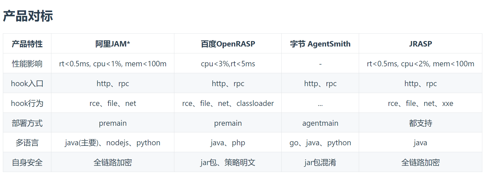

# 5.安全

[网络安全入门必知的OWASP top 10漏洞详解](https://blog.csdn.net/Wufjsjjx/article/details/132103936)

- [「 网络安全术语解读 」通用漏洞评分系统CVSS详解](https://blog.csdn.net/u013129300/article/details/129458468)
- [「 网络安全术语解读 」通用漏洞披露CVE详解](https://cheeker.blog.csdn.net/article/details/129329783)
- [「 网络安全术语解读 」通用缺陷枚举CWE详解](https://cheeker.blog.csdn.net/article/details/128487328)
- [「 网络安全术语解读 」通用平台枚举CPE详解](https://cheeker.blog.csdn.net/article/details/129329786)
- [「 网络安全术语解读 」安全自动化协议SCAP详解](https://cheeker.blog.csdn.net/article/details/135299123)
- [「 网络安全术语解读 」静态分析结果交换格式SARIF详解](https://cheeker.blog.csdn.net/article/details/135374650)
- [「 网络安全术语解读 」内容安全策略CSP详解](https://cheeker.blog.csdn.net/article/details/135445561)
- [「 网络安全术语解读 」点击劫持Clickjacking详解](https://cheeker.blog.csdn.net/article/details/135491362)
- [「 网络安全术语解读 」悬空标记注入详解](https://cheeker.blog.csdn.net/article/details/135468329)
- [「 网络安全术语解读 」杀链Kill Chain详解](https://cheeker.blog.csdn.net/article/details/135685558)
- [「 网络安全术语解读 」网络攻击者的战术、技术和常识知识库ATT&CK详解](https://cheeker.blog.csdn.net/article/details/135685572)
- [「 网络安全术语解读 」通用攻击模式枚举和分类CAPEC详解](https://cheeker.blog.csdn.net/article/details/135735938)

## 1.web基础介绍

### 1.1.web介绍

什么是web:
- 万维网
- word wide web
- 非常普遍的互联网应用
- 每天都有数以亿万的资源在传输

#### 1.1.1. web发展史

1.web 1.0:比如个人网站和门户网站，以静页面为主的文本应用。

面临的安全问题：SQL注入、文件包含、命令执行、上传漏洞、挂马、暗链，直接危害web服务器

2.web 2.0:比如微博和博客等，能都进行人与人之间互动。
面临的安全问题：URL跳转、数据劫持、钓鱼、框架漏洞、逻辑漏洞、CSRF、XSS，直接危害web用户

随着技术的发展，web安全问题数量迅速增加、种类迅速增加，并由针对web服务器转向针对web用户。

#### 1.1.2. web流程

web用户使用浏览器访问web应用，web服务器到数据库获得数据，并发送给web服务器，web服务器把数据发送给浏览器，浏览器把数据展示给web用户

#### 1.1.3. 浏览器

web用户使用域名访问web应用，浏览器首先到DNS服务器，将域名解析为web应用的IP，浏览器通过IP访问web应用。
之后浏览器将web应用返回的数据，使用HTML、JavaScript、css等技术渲染成我们见到的页面。


### 1.2.web通讯

#### 1.2.1.URL协议

URL是什么:统一资源定位符（Uniform Resouces Locator）。支持多种协议：http、ftp、file等。用于定位到web服务器的资源

URL格式：
- schema:  host [:port] [/path/../] [?query-string] [#anchor]
- schema底层协议：https、http、ftp、file
- host域名或IP
- port端口号，https默认443、http默认80，可以不写，其他的都要写

#### 1.2.2. HTTP协议

1. HTTP是什么：

超文本传输协议（hyper test transfer protocol）,是web应用的通讯协议，是web的基础协议。
常见的HTTP请求方法有GET和POST,响应报文包括：请求行(request lines)、请求头(headers)、数据体(body， get请求没有body)
除此之外还有，put,delete,options等方法。

2. referer
   作用：
- 在请求头中添加，告诉web应用请求从哪个URL跳转过来的。
- 统计流量，如CNZZ和百度统计
- 判断来源合法性；防止盗链和CSRG漏洞

3. location
   在页面跳转的时候，状态码为301 / 302 ，location表示跳转到那个URL上。


### 1.3.HTML语法
略略略~~~

1. 浏览器的提示弹框：
```javascript
alert("方式1");
confirm('方式2');
prompt('方式3','123');    
```


2. 获得cookie

- 方式1：
```javascript
document.cookie = 'is my cookie'// 写cookie
alert(document.cookie)// 读取cookie
```


- 方式2：
  在浏览器的console窗口获得。


3. 获取或控制用户页面
```javascript
window.location.href // 获得页面URL
window.location.href='https://www.baidu.com'// 跳转到URL
```

4. 获得浏览器信息
```javascript
window.navigator
```

### 1.4.web服务端
#### 1.4.1. 概述


#### 1.4.2. 环境搭建
以下教程以java环境运行
- 技术框架： spring boot
- 数据库： MySQL
- web容器： tomcat

## 2.web常见安全问题

> 以下演示案例，请clone到本地后运行项目。访问 http://127.0.0.1:8888 即可查看
> 项目地址 [点这里](https://gitee.com/luckSnow/network_security)

### 2.1.常见的web安全问题
#### 2.1.1.钓鱼Phishing
##### 2.1.1.1. 特征
- 诱惑性标题
- 仿冒真实网站
- 骗取用户账号
- 骗取用户资料

##### 2.1.1.2. 常见手法
模仿真正的官网，让用户误以为进入了官网，这个时候用户进行登录或修改密码等操作后，
钓鱼网站就获得了用户的登录信息。技术含量低，受害者多为安全意识差的用户。

##### 2.1.1.3. 场景
- 账号异常登录信息，需要修改密码
- 中奖信息

#### 2.1.2、网页篡改 Tampering
##### 2.1.2.1. 介绍
多为黑客进行攻击后，修改服务器上的文件，已达到自己的目的。

##### 2.1.2.2.怎么发现网页被篡改
这里我们可以使用百度的搜索引擎(SEO)进行搜索。
intitle是SEO中的高级搜索指令，intitle：关键词指令返回的是页面title中包含关键词的页面。Goolge和百度都支持intitle指令。

intitle:hacked by


intitle:keyword 标题中含有关键词的页面
intext:keyword 正文中包含关键词的页面
site:domain 在某个域名和子域名下的页面


#### 2.1.3、暗链 Hidden hyperlineks
##### 2.1.3.1. 介绍
黑客入侵后，在页面中添加隐藏的链接。以此达到提高搜索引擎排名的目的。
目前中文互联网网站存在的安全隐患：


暗链是目前法律风险最小，收入最高，受影响最广最大的安全隐患。

目前，在国内已经形成成熟的产业链

##### 2.1.3.2. 特征
- 隐藏在页面中的连接，无法被用户看见和使用
- 网游/医疗/博彩/色情类居多
- 为了提交网站排名


#### 2.1.4、webshell
##### 2.1.4.1. 介绍
webshell就是以asp、php、jsp或者cgi等网页文件形式存在的一种命令执行环境，也可以将其称做为一种网页后门。
黑客在入侵了一个网站后，通常会将asp或php后门文件与网站服务器WEB目录下正常的网页文件混在一起，
然后就可以使用浏览器来访问asp或者php后门，得到一个命令执行环境，以达到控制网站服务器的目的。
说白了就是木马。

##### 2.1.4.2.分类
- 大马: 功能强大，能都对服务器进行一系列操作
- 小马: 功能单一，常备称为“一句话木马”


### 2.2.XSS

#### 2.2.1. 什么是XSS
- 全称为 cross site script,翻译为跨站脚本。
- 主要的危害：盗取用户信息、钓鱼、制造蠕虫等。
- 通过“HTML注入”篡改页面，插入恶意脚本，当用户浏览页面时，实现控制用户浏览器行为的一种攻击方式。

#### 2.2.2. XSS分类
1. 存储型(永久型)
	xss脚本有页面提交后，保存在数据库中，之后查询的时候，xss脚本随着数据返回到页面上，并触发。

2. 反射型(一次型)
	xss脚本传入服务端后，有返回到客户端，导致XSS。xss脚本一般会写在URL中。由黑客散布URL，用户点击该URL后触发。

3. DOM型
	实际中包含以上两种，只是表现执行是以页面中的JS来触发XSS脚本。比如，将内容写在location.hash中。 方式 ： http://127.0.0.1:8888?#name=

#### 2.2.3. XSS演示

http://127.0.0.1:8888/city/insert?name=
http://127.0.0.1:8888?#name=

项目首页的 xss

### 2.3、CSRF

#### 2.3.1. 什么是CSRF
全称：跨站请求伪造：  cross site request forgery
就是利用已经登录的用户，在用户不知情的情况下，用用户的名义完成非法操作。

#### 2.3.2. 危害
- 执行恶意操作(“被转账”，“被发垃圾评论”)
- 制造蠕虫

#### 2.3.3. 原理
用户登录到自己的账户——>访问黑客构造的恶意页面——>页面中隐藏了非法操作。

比如：用户登录邮箱——>查看陌生人的邮件(黑客的蠕虫脚本)
					邮件中隐藏的位置|——>调用登录人的所有联系人，转发本邮件。

#### 2.3.4. 演示
第一次直接访问： http://127.0.0.1:8888/chapter_02/csrfDemo?money=11， 由于没有用户登录提示转账失败
第二次访问： 项目首页的 csrf。模拟用户已经登录成功


### 2.4、点击劫持

#### 2.4.1. 什么是点击劫持
通过覆盖不可见的页面，误导受害者点击而造成的攻击行为，骗取用户操作

也叫做UI-覆盖攻击。利用iframe或其他标签的属性

#### 2.4.3. 原理
通过误导用户点击隐藏的内容


### 2.5、URL跳转
#### 2.5.1. 什么是URL跳转
利用正规网站的URL，比如：http://www.qq.com,添加url参数进行跳转：http://www.qq.com?qq=123&url=http://hacked.com


#### 2.5.2. 实现方式：
- head头跳转： 设置 location: http://hacked.com
- js跳转: window.location.href=http://hacked.com
- mate跳转:
```
<meta http-equiv="Refresh" content="5;url=http://hacked.com" ></meta>
```

### 2.6、SQL注入
#### 2.6.1. 什么是SQL注入
是最常见的web安全漏洞，攻击者利用这个漏洞，可以访问和修改数据，甚至利用SQL注入对数据库、服务器已有的漏洞进行攻击。

#### 2.6.2. SQL注入的必备条件
- 可以控制输入的参数
- 服务器执行的SQL拼接了上面的参数

#### 2.6.3. SQL注入的本质
数据与代码未分离。将数据当成代码去使用

#### 2.6.4.演示-万能密码
账号数据 admin_zx' -- ,密码随意。发现可以登录，这就是完成了SQL注入。

我们传入的参数还可以是: admin_zx' UNION SELECT VERSION() UNION SELECT USER() --
获得数据库的版本和数据库的用户

#### 2.6.5. 危害
- 获取数据库的信息，比如管理员的账号/密码，获得数据库的用户敏感信息，甚至脱库(导出全部数据库)
- 获取服务器权限
- 植入webshell，获得服务器后门
- 操作服务器文件


### 2.7.命令注入
这里以doc命令为例：
#### 2.7.1. doc命令
- ipconfig 查看网络配置
- net user 查看系统用户
- dir "./" 查看当前目录
- find "demo" ./demo.txt	在文件中查找字符串
- echo 123 & echo 456 复合命令，使用 & 进行多个命令拼接
- ipconfig | find 'IPV4'  管道 | ，将前面命令的输出作为后面命令的输入
- echo 123 > ./demo.txt 内容输出命令，>。一个>表示将内容输出到demo.txt，覆盖原文件。两个>>表示在文件后面追加

cmd /c dir 是执行完dir命令后关闭命令窗口
cmd /k dir 是执行完dir命令后不关闭命令窗口
cmd /c start dir  会打开一个新窗口后执行dir命令，原窗口会关闭
cmd /k start dir  会打开一个新窗口后执行dir命令，原窗口不会关闭
cmd /?  查看帮助信息

#### 2.7.2. web应用如何命令注入
- 调用可执行系统命令的函数
- 函数或函数的参数可控
- 拼接注入命令

#### 2.7.3. 危害
是已知web安全问题中最严重的问题。
一般的程序不会去调用Runtime.getRuntime().exec(cmd)去执行命令。

普遍的问题出在某些框架程序的漏洞，导致的远程执行漏洞。比如：Jackson远程执行漏洞，和spring-message远程执行漏洞等。

### 2.8.文件操作漏洞
#### 2.8.1. 常见文件操作
- 文件上传: 上传附件、头像等
- 文件下载: 下载应用、附件等

#### 2.8.2. 黑客的文件操作
- 文件上传: webshell、木马
- 文件下载: 下载系统文件、程序代码等

#### 2.8.3. 常见文件操作漏洞
- 上传任意文件漏洞，webshell、木马。比如有些项目使用jsp/php/asp等，直接可以访问这些。文件上传后，再次访问这个上传的页面后，回去执行代码。
- 任意下载漏洞
- 文件包含漏洞，文件中保存webshell、木马


### 2.9.计时攻击

计时攻击是边信道攻击(或称"侧信道攻击"， Side Channel Attack， 简称SCA) 的一种， 边信道攻击是一种针对软件或硬件设计缺陷，走“歪门邪道”的一种攻击方式。
这种攻击方式是通过功耗、时序、电磁泄漏等方式达到破解目的。
在很多物理隔绝的环境中，往往也能出奇制胜，这类新型攻击的有效性远高于传统的密码分析的数学方法。
例如下面的例子，就可能被黑客利用。

比较时转化为两个数组去比较每一位是否相等，不同直接返回false,相同返回true。通过比较调用的耗时的不同，尝试破解。

```java
public boolean equals(Object var1) {
	if (this == var1) {
		return true;
	} else {
		if (var1 instanceof String) {
			String var2 = (String)var1;
			int var3 = this.value.length;
			if (var3 == var2.value.length) {
				char[] var4 = this.value;
				char[] var5 = var2.value;

				for(int var6 = 0; var3-- != 0; ++var6) {
					if (var4[var6] != var5[var6]) {
						return false;
					}
				}

				return true;
			}
		}

		return false;
	}
}
```

安全的比较工具
```java
public static boolean isEqual(byte[] digesta, byte[] digestb) {
   if (digesta == digestb) return true;
   if (digesta == null || digestb == null) {
       return false;
   }
   if (digesta.length != digestb.length) {
       return false;
   }
 
   int result = 0;
   // time-constant comparison
   for (int i = 0; i < digesta.length; i++) {
       result |= digesta[i] ^ digestb[i];
   }
   return result == 0;
}
```

## 3.web安全工具

> 以下演示案例，请clone到本地后运行项目。访问 http://127.0.0.1:8888即可查看
项目地址：https://gitee.com/luckSnow/network_security

### 3.1.浏览器和浏览器扩展(初级)
#### 3.1.1. 浏览器的安全特性与设置
我们常用的浏览器包括chrome、Firefox、IE...,不同的浏览器安全特性存在差异，导致同一个漏洞在不同的浏览器的触发效果不同。

- chrome浏览器安全配置
  

- Firefox浏览器安全配置.png
  

- IE浏览器安全配置.png
  

#### 3.1.2. 安全测试常用功能
- 清除缓存(alt + shift + delete)：为了方便安全测试，避免干扰。尤其是cookie和登录密码推荐清除。现在有些浏览器提供隐身和无痕模式，也是同样的效果。
- 查看页面源码
- 查看DOM代码
- 查看网络数据包: 开发者工具(F12)

#### 3.1.3. 浏览器插件
chrome(需要翻墙)的扩展插件、Firefox附件组件管理功能。这里我们使用Firefox为例子安装插件
- firebug:  Firefox自带开发者工具
- hackbar: 提供快速构造HTTP请求和编码转换的功能
- cookie manager: 操作cookie，可编辑cookie

### 3.2.代理抓包分析工具
#### 3.2.1. 代理工作的原理
代理是什么：当我们使用抓包工具的时候，我们希望抓包分析工具里面获得的数据都是来自某个浏览器的。所以我们使用抓包分析工具开启一个代理服务，如下。

#### 3.2.2. 浏览器代理设置

浏览器设置网络代理，让我们访问的所有URL都经过这个代理，方便我们分析。比如，火狐的高级设置网络代理，如下：


当然上面的方式比较麻烦，我们可以使用浏览器插件:proxy switcher。

#### 3.2.3. 常用的HTTP代理工具
Burpsuite: 基于Java平台的HTTP代理工具，实际中使用较多的软件，入门很难，参数复杂。
charles:基于Java平台的HTTP代理工具，功能单一，使用简单，简单的工作与学习推荐使用。
fiddler:window软件，有免费的社区版本，使用的较多，兼容win10。
httpwatch:比较老的项目，window软件。目前使用的较少。

### 3.3.敏感文件探测(初级)
使用python作为脚本
#### 3.3.1. 什么敏感文件
就像网站的秘密日记，如果这些文件没有保护好被访问者发现了，就可能暴露网站脆弱性或保密数据

#### 3.3.2. 常见的敏感文件类型
- 网站管理，比如： http://host[:port]/login/go
- 数据文件，比如： http://host[:port]/www.aa.com.sql
- 备份文件，比如： http://host[:port]/www.aa.com.tar.gz
- webshell，网站被工具后,扫描木马

#### 3.3.3. 使用“御剑”扫描工具
工作原理：预先将可能存在的敏感文件写在一个字典文件中，使用工具进行遍历访问。如果响应状态为200，就是存在敏感文件

工具使用步骤


#### 3.3.4. 根据URL生产目标备份文件猜测字段
demo.py是通过url生产备份文件的扫描字典

### 3.4.web漏洞扫描工具(初级)
#### 3.4.1.常见的web漏洞扫描工具
AWVS、Netsparker、AppScan

一款优秀的web漏洞扫描工具是一批安全专家将自己积累的“测试手法”和“测试经验”自动化的产物。

#### 3.4.2.扫描流程与基本原理
扫描配置与目标基本信息探测 -> 工具使用爬虫爬取站点 -> 各个漏洞探测模块依次进行测试 -> 扫描结果显示

#### 3.4.3. 常见问题
- 1. 对目标站点造成损伤，比如高流量、高并发、请求了危险的功能(删除数据等);
- 2. 漏洞等级评判，我们要以技术角度和业务角度综合分析;
- 3. 随着业务的迭代，测试用户可能需要调整;
- 4. 误报和漏报是一定会存在的;
- 5. 扫描出来的漏洞只能作为人工测试的线索。

#### 3.4.4.渗透测试及漏洞挖掘工具（高级）
- 项目地址：https://github.com/Threezh1/JSFinder

### 3.5.SQL注入漏洞
#### 3.5.1. Sqlmap
Sqlmap是开源的自动化SQL注入工具，由Python写成，具有如下特点：

- 完全支持MySQL、Oracle、PostgreSQL、Microsoft SQL Server、Microsoft Access、IBM DB2、SQLite、Firebird、Sybase、SAP MaxDB、HSQLDB和Informix等多种数据库管理系统。
- 完全支持布尔型盲注、时间型盲注、基于错误信息的注入、联合查询注入和堆查询注入。
- 在数据库证书、IP地址、端口和数据库名等条件允许的情况下支持不通过SQL注入点而直接连接数据库。
- 支持枚举用户、密码、哈希、权限、角色、数据库、数据表和列。
- 支持自动识别密码哈希格式并通过字典破解密码哈希。
- 支持完全地下载某个数据库中的某个表，也可以只下载某个表中的某几列，甚至只下载某一列中的部分数据，这完全取决于用户的选择。
- 支持在数据库管理系统中搜索指定的数据库名、表名或列名
- 当数据库管理系统是MySQL、PostgreSQL或Microsoft SQL Server时支持下载或上传文件。
- 当数据库管理系统是MySQL、PostgreSQL或Microsoft SQL Server时支持执行任意命令并回现标准输出。

安装Sqlmap: git clone https://github.com/sqlmapproject/sqlmap.git, 执行命令: python sqlmap.py 即可使用

#### 3.5.2. 常见Sqlmap命令
- 1. python sqlmap.py -h 	帮助
- 2. python sqlmap.py -u "http://localhost/user.do?method=login&root=1"  检测URL是否存在SQL注入漏洞。u表示url,后面是可能存在sql注入的url。如果发现SQL注入漏洞，sqlmap会提示是否进行进一步操作
- 3. python sqlmap.py -u "..." --users  (已经检测到SQL注入漏洞)Linux系统用户有哪些(受运行数据库的用户权限限制)
- 4. python sqlmap.py -u "..." --dbs  	(已经检测到SQL注入漏洞)查看有哪些数据库
- 5. python sqlmap.py -u "..." --current-user   --current-db	(已经检测到SQL注入漏洞)当前的用户和数据库
- 6. python sqlmap.py -u "..." --tables -D "users"		(已经检测到SQL注入漏洞)数据库users的数据表有哪些
- 7. python sqlmap.py -u "..." --columns- T "t_user" -D "users"	(已经检测到SQL注入漏洞)数据库users中表t_user有哪些字段
- 8. python sqlmap.py -u "..." --count- T "t_user" -D "users"	(已经检测到SQL注入漏洞)数据库users中表t_user数据量
- 9. python sqlmap.py -u "..." --dump - T "t_user" -D "users"	(已经检测到SQL注入漏洞)数据库users中表t_user数据，保存到本地(默认是cvs格式)，并显示输出全部
- 10. python sqlmap.py -u "..." --dump - T "t_user" -D "users" satrt 1 stop 10	(已经检测到SQL注入漏洞)数据库users中表t_user数据，保存到本地(默认是cvs格式)，导出的数据是第一至第十行的数据。
- 11. python sqlmap.py -u "..." --dump-all -D "users" (已经检测到SQL注入漏洞)导出数据库users全部的数据表
- 12. python sqlmap.py -r "post.txt"	用于将post请求的请求信息写入文件当中进行操作。下面就是文本的内容
```
POST http://localhost/user.do?method=login HTTP/1.1
Host: localhost
Connection: keep-alive
Content-Length: 33
Cache-Control: max-age=0
Origin: http://localhost
Upgrade-Insecure-Requests: 1
User-Agent: Mozilla/5.0 (Windows NT 10.0; WOW64) AppleWebKit/537.36 (KHTML, like Gecko) Chrome/55.0.2883.87 UBrowser/6.2.3964.2 Safari/537.36
Content-Type: application/x-www-form-urlencoded
Accept: text/html,application/xhtml+xml,application/xml;q=0.9,image/webp,*/*;q=0.8
Referer: http://localhost/user.do?method=logout
Accept-Encoding: gzip, deflate, br
Accept-Language: zh-CN,zh;q=0.8
Cookie: JSESSIONID=B340358681A38D5C3940E36EAFF7D7BA

name=aa&password=aa&verification=
```

- 13. python sqlmap.py -u "..." --data "username=zx&pwd=123"	用于post请求，data的内容为post请求的参数


#### 3.5.3. 实际操作
注意： 实际操作中，我们只需确定一个sql注入点以及基本的信息就可以完成进行SQL注入的操作了。
高级参数用法: level 以及risk
其他的sql注入工具: 啊D、明小子、Pangolin（穿山甲）、havij（胡萝卜）等

### 3.6.在线工具

#### 3.6.1. 搜索引擎
比如百度，在首页的右上角有个设置，可以进行高级搜索。


比如，我们搜索某个网站带有某个关键词的页面，高级搜索会帮助我们生成对应的搜索语法。
site:(account.zx1989.top) "login"


#### 3.6.2. Google hack
google hack是指使用Google等搜索引擎对某些特定的网络主机漏洞（通常是服务器上的脚本漏洞）进行搜索，以达到快速找到漏洞主机或特定主机的漏洞的目的。


#### 3.6.3. 搜索语法
- 1. site: www.xxx.xx	搜索指定网站的信息
- 2. inurl:文件名称		搜索url中包含文件的，比如site:www.zx1989.top inurl:(admin|zx) , | 表示或
- 3. intitle: 			包含标题
- 4. intext:  			包含文本

#### 3.6.4. 网络空间搜索引擎语法
常见的网络空间搜索引擎： ShoDAN, ZoomEye(钟馗之眼), FOFA等

国内的是 ZoomEye。


语法1: app:"网站容器的名称" ver:"网站容器的版本"

以下是：app:"tomcat" ver:"8.5.15" 地方结果


#### 3.6.5. 网络空间搜索引擎基本原理

探测/爬取 ——> 识别/打标签 ——> 存储


#### 3.6.6. 在线WEB工具
- whatweb.net	 	可以查看url的站点基本信息

- www.ipip.net		查看IP的基本信息，机房，预测为代理IP的几率，以及第三方的结果

- www.cmd5.com		md5加密解密

- www.anquanquan.info 各类工具的导航

## 4.web安全实战

> 以下演示案例，请clone到本地后运行项目。访问 http://127.0.0.1:8888即可查看
项目地址：https://gitee.com/luckSnow/network_security

### 4.1.渗透测试平台
#### 4.1.1. DVWA
主流的渗透测试学习平台: 提供暴力破解、命令注入、CSRF、文件操作、SQL注入、XSS等漏洞，以及不同的安全等级。 依赖于php运行环境。

### 4.2.暴力破解
#### 4.2.1. 使用DVWA
将可能是账号与密码的信息写入字典当中，让DVWA去执行操作。

#### 4.2.2. 防止暴力破解
- 限制账号/密码输入错误次数
- 增加验证码，比如滑动拼图、依次点击文字等。


### 4.3.命令注入
DVWA使用 ping ip 的方式去检验该地址是否有命令注入

### 4.4.CSRF
#### 4.4.1. 防止CSRF
- 1. 校验请求中的Referer		安全等级Medium
- 2. 随机Token				安全等级Hihh
- 3. 验证码					安全等级impossible（在做某些重要操作的时候必须使用验证码）

### 4.5.文件漏洞
#### 4.5.1. 文件包含漏洞
比如:http://192.168.1.100?page=..\..\php.ini。获得php的配置文件
比如:http://192.168.1.100?page=file:\usr\local\tomcat\webapps\ROOT\WEB-INF\db.properties。获得数据库的配置文件
防止文件包含漏洞，设置文件类型的白名单
#### 4.5.2. 文件上传漏洞
- 1. 将可执行文件(webshell)或代码(jsp、php、ASP)等上传到服务器
- 2. 使用“内涵图”，比如将 正常的图片 1.jpg 与 2.jsp 合并， 在Windows下使用命令: copy  1.jpg/b  2.jsp/a 2.jpg。这个jsp就植入到图片中，在访问图片的时候，我们使用
     http://192.168.1.100?page=2.jpg,代码就会被执行。

防止文件上传漏洞：
- 1. 服务器需校验文件名与http request 的文件类型，设置文件类型的白名单
- 2. 对文件进行重命名以及压缩重新生成
- 3. 文件存储目录的执行权限控制，甚至将目录与web分离


### 4.6.SQL注入
#### 4.6.1. 防止SQL注入
- 1. 不使用代码去拼接参数，组成sql，而是所有的参数都使用预编译 ，并使用程序校验数据类型
- 2. 使用程序对输入的参数进行过滤，将特殊符号进行转义

### 4.7.XSS漏洞
#### 4.7.1. 防止XSS漏洞
- 1. 输入: 使用程序对输入的参数进行过滤，将特殊符号进行转义
- 2. 输出: 对数据进行对应格式的转义.(推荐使用jQuery对数据进行输入和输出)


### 4.8.Java中的安全问题
#### 4.8.1.Lower
##### 4.8.1.1.拒绝服务

拒绝服务是攻击者通过极度消耗应用资源，以致程序崩溃或其他合法用户无法进行使用的一种攻击方式。

例如：下面代码片段中，解压文件前，未检查文件大小，攻击者可以通过提供一个超大文件，实施DOS攻击。

```java
public long getWordCount() throws IOException{
    FileReader f = FileReader(new InputStreamReader(new
    FileInputStream(textFile), charsetName));
    String line = null;
    StringBuffer sb = new StringBuffer();
    while( (line = this.readLine()) != null) {//这里如果文件非常大的话，这个位置可能一直在执行，导致问题出现。
        sb.append(line);
    }
    return StringUtils.getWordsCount(sb.toString());
}
```

##### 4.8.1.2.不安全的随机数

Random类和Math.random()方法提供的随机函数为伪随机。在安全性要求较高的应用中，应使用更安全的随机数生成器，如java.security.SecureRandom类。

例如：下面代码片段中，使用java.security.SecureRandom来生成更安全的随机数。

```java
import java.security.SecureRandom;
import java.security.NoSuchAlgorithmException;

public static void main (String args[]) {
    try {
        SecureRandom number = SecureRandom.getInstance("SHA1PRNG");
        for (int i = 0; i < 20; i++) {
            System.out.println(number.nextInt(21));
        }
    } catch (NoSuchAlgorithmException nsae) {
    }

}
```

#### 4.8.2.Medium
##### 4.8.2.1.系统信息泄露

系统数据或调试信息通过输出流或日志功能输出系统，将有助于攻击者了解系统并制定相应攻击计划。

例：下面代码片段中，通过标准错误流输出异常的堆栈信息，攻击者可能会利用这些堆栈信息制定相应的攻击计划。

```java
try{
}catch(Exception e){
    e.printStackTrace();
}
```

##### 4.8.2.2.资源未释放

程序创建或分配流资源后，不进行合理释放，将会降低系统性能。攻击者可能会通过耗尽资源池的方式发起拒绝服务攻击。

例1：在下面Java方法中，创建I/O流对象后未进行合理释放，程序依靠Java虚拟机的垃圾回收机制释放I/O流资源，事实上，程序不能确定何时调用虚拟机的finalize()方法。在繁忙的程序环境下，可能导致Java虚拟机不能有效的使用I/O对象。

FileReader f = FileReader(new InputStreamReader(new
FileInputStream(textFile), charsetName));

f.close();//这个close会关闭InputStreamReader 的流 ，但是FileInputStream
可能不会被关闭。

##### 4.8.2.3.配置文件中的明文密码

配置文件中采用明文存储密码，将会降低系统安全性。如下面的配置，一旦站点被攻陷，MySQL数据库就直接被暴露了。应该使用加密码加密后写入配置文件，在程序中加密后使用，比如spring
properties的隐式加密。

```java
driverclass=com.mysql.jdbc.Driver
url=jdbc:mysql://localhost:3306/accountbook?&autoReconnect=true&failOverReadOnly=false&useUnicode=true&characterEncoding=utf8
username=root
password=root
hibernate.dialect=org.hibernate.dialect.MySQLDialect
```

#### 4.8.3.Height

##### 4.8.3.1.日期格式化异常

SimpleDateFormat类是线程非安全的，当多个线程同时使用getStringDate()方法的时候，可能出现格式化异常的问题。
```java
public class DateHandler extends Date {
    private static final long serialVersionUID = 1L;
    private static SimpleDateFormat sdf = null;
    public static String getStringDate(Date date,String pattern) {
        sdf = new SimpleDateFormat(pattern);
        return sdf.format(date);
    }
```

##### 4.8.3.2.Double解析异常

程序调用Double的解析方法时，可能导致线程被挂起。java.lang.Double.parseDouble()方法解析位于[2^(-1022)
- 2^(-1075) :2^(-1022) -
  2^(-1076)]范围内的任何数字时可能导致线程被挂起，攻击者可以故意触发该漏洞执行拒绝服务攻击。该漏洞在java6
  update24或更高版本中进行了修复。

下面代码片段中，使用了易受攻击的方法。

Double d = Double.parseDouble(request.getParameter("d"));

攻击者可发送 d 参数值位于该范围(例如
"0.0222507385850720119e-00306"）内的请求，致使程序在处理该请求时被挂起。

修复该缺陷的方式如下：

（1）验证传递给parseDouble数据的合法性。

（2）升级JDK版本到6 Update 24或更高版本。

##### 4.8.3.3.XML外部实体注入

攻击者通过操纵XML外部实体的URI,使其指向特定的文件，从而造成拒绝服务攻击或者程序崩溃。

例如：下面代码片段尝试对evil.xml文件进行解析

```java
class XXE {
    private static void receiveXMLStream(InputStream inStream, DefaultHandler defaultHandler)
            throws ParserConfigurationException, SAXException, IOException {
        SAXParserFactory factory = SAXParserFactory.newInstance();
        SAXParser saxParser = factory.newSAXParser();
        saxParser.parse(inStream, defaultHandler);
    }

    public static void main(String[] args)  throws ParserConfigurationException, SAXException, IOException {
        receiveXMLStream( new FileInputStream("evil.xml"),  new DefaultHandler());
    }

}
```

如果evil.xml文件中包含以下文本

<?xml version="1.0"?>

<!DOCTYPE foo SYSTEM "file:/dev/tty">

<foo>bar</foo>

...

SAX或者DOM解析器会尝试访问在SYSTEM属性中标识的URL,这意味着它将读取本地/dev/tty文件的内容。在POSIX系统中，读取这个文件会导致程序阻塞，直到可以通过计算机控制台得到输入数据为止。这样，攻击者可以使用这个恶意的XML文件来导致系统挂起，程序会受到XML外部实体注入攻击。

## 5.web安全体系建设

### 5.1.SDL
#### 5.1.1. 什么是SDL
SDL即Security Development Lifecycle (SDL)，是微软提出的从安全角度指导软件开发过程的管理模式。

SDL的核心理念就是将软件安全的考虑集成在软件开发的每一个阶段 需求分析、设计、编码、测试和维护。

作用: 提高web应用的安全性，降低安全漏洞修复成本。

#### 5.1.2. SDL 构建安全体系


### 5.2. 如何建立SDL
#### 5.2.1. 安全需求分析(开发前)
在项目初期介入: 提前发现安全问题。比如: Web框架和语法的选型建议(不使用Struts2)，敏感信息如密码的保存方案(MD5使用加盐的强哈希加密)，是否有文件上传功能。

#### 5.2.2. 安全扫描(自动化发现漏洞)
通过扫描发现安全问题、自动化、周期性执行

#### 5.2.3. 安全测试(手动发现漏洞)
白盒测试和黑盒测试(以业务性漏洞为主)

#### 5.2.4. 入侵检测(上线后)
通过检测入侵行为发现安全问题

#### 5.2.5. 日志分析(上线后)
是通过人工发现或扫描器发现的可疑日志发现安全问题。

#### 5.2.6. 建立SRC(上线后)
SRC是安全应急响应中心，企业通过与白帽子建立合作关系，通过白帽子发生安全问题。

#### 5.2.7. 与漏洞搜集平台合作(上线后)
借助安全平台的力量和影响力，发现平台的安全问题。相比于SRC，这个方式比较被动。

#### 5.2.8. 渠道
通过人工到各个论坛和交流群，有人发现安全漏洞(需要坚持常驻,会消耗大量的人力和时间，但是往往会在第一时间知道安全问题)


### 5.3. 如何处理安全问题
#### 5.3.1. 防御
- 输入检查: 检查数据合法性(类型范围长度)，尽可能使用白名单。
- 输出检查: 数据输出需要进行特定的过滤与转义
- 针对性防御: 针对特定安全漏洞的利用方式，采取特定的防御措施。比如，重要的cookie设置为httponly,这样这个cookie就不能被获取到。还有sql中使用预编译。
- WAF(web application firewall):能够拦截攻击，如SQL注入、xss、远程代码执行等。容易造成性能瓶颈，但是能够及时的对出现的漏洞进行补丁

#### 5.3.2. 修复
- 漏洞知识库: 提供详细的漏洞说明和修复方案，结合公司的框架、语法，给出可行的解决方案。
- 漏洞修复周期: 根据不同级别的漏洞有不同时限。比如严重的漏洞需要24小时修复。
- 漏洞复查: 在漏洞修复后需要安全团队复查，业务方与开发方都不可行。

#### 5.3.3. 安全事件分类
- 1. 入侵事件
- 2. 攻击事件
- 3. 信息泄露事件

#### 5.3.4. 安全事件分级
各个公司根据自己的安全事件分级标准，一般分为高危事件、中危事件、低危事件。
而事件的等级可能随着时间的推移，升级或降级。

#### 5.3.5. 企业如何处理安全事件
建立安全事件应急响应流程
事件确认: 由产品方和安全方确认事件的真实性，必要时需要和运维、公关和法务部等其他团队共同确定->
事件上报: 向上级汇报事件，得到上级的许可，获得相应的资源去处理事件->
事件处理: 成立安全应急小组、应急方案确定、应急方案执行、事件回复-> 	
归档与复盘: 处理过程需要详细记录、归档，对事件进行复盘


### 5.4.安全运营
安全是一个过程，需要持续周期性的运营
#### 5.4.1. 安全运营的工作
- 发现和修复安全问题
- 防御体系建设和快速响应攻击
- SDL落实推动

#### 5.4.2. 安全运营如何落地
1. 对内工作:
- 周期性安全扫描
- 安全漏洞预警: 关注重大漏洞与事件、提前部署防御方案、提前提供解决方案(比如Jackson的远程执行漏洞需要版本升级即可)
- 应急响应
- 安全监控和入侵检测
2. 对外工作:
- 建立外部沟通渠道和流程:提供统一对外的邮件和IM工具、提供安全相关的沟通群、提供外部反馈问题的网站
- 安全圈关系: 了解著名的安全公司与安全圈子，积极参加安全会议，积极	融入安全圈，进行合作。
- 品牌建设(属于公司的战略方面): 参加合作会议、举办安全会议、打造安全产品、成立安全实验室。

## 6.安全策略

### 6.1.同源策略

同源策略（Same-Origin Policy）是指浏览器安全策略中的一项重要规则，它规定了浏览器只允许当前网页的脚本与来自同一站点（协议、主机、端口号相同）的窗口进行交互，
而限制了与不同源（协议、主机、端口号任一不同）的窗口进行交互。同源策略的存在是 Web 安全的重要保障，是浏览器防范跨站脚本攻击（XSS）、跨站请求伪造（CSRF）、HTTP 首部注入攻击等安全威胁的关键措施。

同源策略主要表现在以下三个方面：DOM、Web数据和网络。

- DOM访问限制：同源策略限制了网页脚本（如 JavaScript）访问其他源的 DOM。这意味着通过脚本无法直接访问跨源页面的 DOM 元素、属性或方法。这是为了防止恶意网站从其他网站窃取敏感信息。
- Web数据限制：同源策略也限制了从其他源加载的 Web 数据，这有助于防止跨站点请求伪造（CSRF）等攻击。被限制的数据如下：
  - 浏览器限制从脚本内发起的跨源 HTTP 请求。在同源策略下，XMLHttpRequest 或 Fetch 请求只能发送到与当前网页具有相同源的目标。
  - Cookie、LocalStorage、SessionStorage、IndexedDB 等跨站点资源的访问，防止恶意网站窃取用户数据和攻击。  
- 网络通信限制：同源策略还限制了跨源的网络通信。浏览器会阻止从一个源发出的请求获取来自其他源的响应。这样做是为了确保只有受信任的源能够与服务器进行通信，以避免恶意行为。

如果需要进行跨域请求或共享数据，可以通过特定的手段（如 JSONP、CORS、代理等）来实现。同时，Web 应用开发中应当严格遵守同源策略的原则，避免将敏感信息暴露在跨域页面中。

### 6.2.跨域问题

同源策略会参数跨域问题。host+port全都不同，则为跨域。

1.  jsonp【不推荐使用】
    - 跨域请求，通过ajax请求参数后面追加callback参数，后端请求到请求参数并将callback添加到JsonpObject中返回到前端，实现一次安全到握手。
    - 优点：没有兼容性问题
    - 缺点：1.只支持get请求。2.callback字段存在安全分险。3.前后端耦合严重。
2. springboot使用@CrossOrigin注解
   - 优点：精准控制允许跨域到方法级别，前端不需要任何修改。
   - 本质：对单个URL设置响应头信息
3. springboot自定义WebMvcConfigurer，重写addCrosMappings方法
   - 优点：可以对所有到controller方法都设置了CORS
4. springboot设置CorsFilter
   - 优点：部分URL可能不是controller，例如servlet等，可以使用这个方式
5. 使用Nginx反向代理【推荐】
   - 在location中添加代理 proxy_pass http://a; 让nginx代理不同域地址，这样浏览器就不会出现这种问题了。当然在nginx中也可以设置cors信息。
    
2，3，4都是设置响应头中添加信息，要求浏览器不低于IE10。

## 7.信息泄漏

### 7.1.AccessKey泄漏
AccessKey包括AccessKeyID和AcessKeySecret两部分，AccessKeyID用于标识用户，AcessKeySecret用于验证用户的密钥，主要用于程序方式调用云服务API

泄漏方式：
- 前端: 前端代码写死AccessKey
- 后台直接泄露：后端向前端直接返回AccessKey
- 开发平台/开源平台泄露：代码上传到github、Gitee
- 配置文件泄露。

以常见的阿里云 OSS为例子。AccessKey泄露后，如何进行漏洞利用呢？
1. 通过API直接调用。
2. OSSBrowser。是 OSS 官方提供的图形化管理工具，提供类似 Windows 资源管理器的功能，使用 ossbrowser，您可以方便地浏览、上传、下载和管理文件。
3. 护卫神.云备份。一键备份数据到阿里云OSS，支持Bucket管理，支持鼠标拖放，支持剪贴板，支持断点续传，支持统计目录大小，支持文件搜索。
4. 行云管家。多云管理平台，导入AccessKey，可重置服务器密码，接管服务器。

- OSS的AccessKey 在什么情况下会出现泄露？
> 采用JavaScript客户端直接签名时，AccessKeyID和AcessKeySecret会暴露在前端页面，存在严重的安全隐患。
> Github等平台泄露，通过关键字可搜索到。
> 通过其他漏洞读取配置文件获取AccessKey。

- 前端OSS的AccessKey 泄露，代码如何修复？
> 采用JavaScript客户端签名直传存在严重安全风险，建议采用服务端签名后直传。

- 访问OSS的AccessKey泄露了，该如何补救？
> 最安全的办法就是更换AccessKey，毕竟它只能创建或删除，启用或禁用，是没有给你修改密码的机会的。

- 测试时，如何简单地来判断OSS的AccessKey是否储存在前端？
> 可以通过上传操作时，抓取的HTTP请求数量来做简单的判断。
> 当采用JavaScript客户端直接签名，用户直接上传数据到OSS，一次请求即可完成。
> 当采用服务端签名后直传的方式，需要用户向应用服务器请求上传Policy，再将数据上传到OSS，至少需要两次请求。
> 企业上云已成趋势，面对云平台的部署架构，不管是开发、安全或是运维，都将面临新的风险和挑战。
> 云上丰富的产品矩阵，为用户提供了各种实例的选项，但技术方案的实现，云上的安全策略及服务，RAM精准的权限控制，每一步都与安全有关。

## 8.安全保护工具

### 8.1.WAF

Web应用防火墙（WAF）是一种传统的安全设备或应用程序，通常放置在Web应用程序之前，用于检查每个传入的HTTP请求流量是否存在已知攻击，并检测任何异常模式。
防火墙规则可以内置到WAF中，仅用于众所周知的攻击。但就一些非常复杂的新威胁而言，WAF将不会真正有效，因为编写规则来阻止它们将不是一件容易的事情。

### 8.2.RASP

RASP(Runtime Application Self Protection)是让应用程序通过实时识别和阻止攻击来保护自己。这就是所谓的运行时应用程序自我保护（RASP）技术所做的。
- [什么是RASP](https://zhuanlan.zhihu.com/p/577766694)

国内的RASP产品
- JRASP:[http://jrasp.com/](http://jrasp.com/)
- OpenRASP：OpenRASP 是百度安全推出的一款 免费、开源 的应用运行时自我保护产品。[https://rasp.baidu.com/](https://rasp.baidu.com/)



### 8.3.DLP数据泄露防护系统

本质上就是一种特殊的服务，介于内部系统与外部系统之间。 

服务提供方：[https://www.skyguard.com.cn/](https://www.skyguard.com.cn/)

### 8.4.网络安全扫描工具

```text
子域名枚举扫描器或爆破工具
    https://github.com/lijiejie/subDomainsBrute (lijiejie开发的一款使用广泛的子域名爆破枚举工具)
    https://github.com/ring04h/wydomain (猪猪侠开发的一款域名收集全面、精准的子域名枚举工具)
    https://github.com/le4f/dnsmaper (子域名枚举爆破工具以及地图位置标记)
    https://github.com/0xbug/orangescan (提供web界面的在线子域名信息收集工具)
    https://github.com/TheRook/subbrute （高效精准的子域名爆破工具,同时也是扫描器中最常用的子域名API库)
    https://github.com/We5ter/GSDF (基于谷歌SSL透明证书的子域名查询脚本)
    https://github.com/mandatoryprogrammer/cloudflare_enum （使用CloudFlare进行子域名枚举的脚本）
    https://github.com/guelfoweb/knock (Knock子域名获取，可用于查找子域名接管漏洞)
    https://github.com/exp-db/PythonPool/tree/master/Tools/DomainSeeker （多方式收集目标子域名信息）
    https://github.com/code-scan/BroDomain (兄弟域名查询）
    https://github.com/chuhades/dnsbrute (高效的子域名爆破工具)
    https://github.com/yanxiu0614/subdomain3 (一款高效的子域名爆破工具）
    https://github.com/michenriksen/aquatone (子域名枚举、探测工具。可用于子域名接管漏洞探测)
    https://github.com/evilsocket/dnssearch (一款子域名爆破工具)
    https://github.com/reconned/domained (可用于子域名收集的一款工具）
    https://github.com/bit4woo/Teemo (域名收集及枚举工具)
    https://github.com/laramies/theHarvester (邮箱、服务器信息收集及子域名枚举工具）
    https://github.com/swisskyrepo/Subdomino (子域名枚举，端口扫描，服务存活确认）
    https://github.com/nmalcolm/Inventus (通过爬虫实现的子域名收集工具）
    https://github.com/aboul3la/Sublist3r (快速子域枚举工具)
    https://github.com/jonluca/Anubis （子域名枚举及信息搜集工具）
    https://github.com/n4xh4ck5/N4xD0rk (子域名查询工具)
    https://github.com/infosec-au/altdns (一款高效的子域名爆破工具)
    https://github.com/FeeiCN/ESD (基于AsyncIO协程以及非重复字典的子域名爆破工具)
    https://github.com/giovanifss/Dumb (快速而灵活的子域名爆破工具)
    https://github.com/UnaPibaGeek/ctfr (通过域名透明证书记录获取子域名)
    https://github.com/caffix/amass (Go语言开发的子域名枚举工具)
    https://github.com/Ice3man543/subfinder (继承于sublist3r项目的模块化体系结构，一个强劲的子域名枚举工具)
数据库类漏洞扫描器或爆破工具
    https://github.com/0xbug/SQLiScanner (一款基于SQLMAP和Charles的被动SQL注入漏洞扫描工具)
    https://github.com/stamparm/DSSS (99行代码实现的sql注入漏洞扫描器)
    https://github.com/LoRexxar/Feigong （针对各种情况自由变化的MySQL注入脚本）
    https://github.com/youngyangyang04/NoSQLAttack (一款针对mongoDB的攻击工具)
    https://github.com/Neohapsis/bbqsql （SQL盲注利用框架）
    https://github.com/NetSPI/PowerUpSQL （攻击SQLSERVER的Powershell脚本框架）
    https://github.com/WhitewidowScanner/whitewidow (一款数据库扫描器)
    https://github.com/stampery/mongoaudit (MongoDB审计及渗透工具）
    https://github.com/torque59/Nosql-Exploitation-Framework (NoSQL扫描/爆破工具）
    https://github.com/missDronio/blindy (MySQL盲注爆破工具）
    https://github.com/fengxuangit/Fox-scan (基于SQLMAP的主动和被动资源发现的漏洞扫描工具）
    https://github.com/NetSPI/PowerUpSQL (用于SQL Server审计的powershell脚本）
    https://github.com/JohnTroony/Blisqy （用于http header中的时间盲注爆破工具，仅针对MySQL/MariaDB）
    https://github.com/ron190/jsql-injection (Java 编写的SQL注入工具)
    https://github.com/Hadesy2k/sqliv (基于搜索引擎的批量SQL注入漏洞扫描器）
    https://github.com/s0md3v/sqlmate (在sqlmap基础上增加了目录扫描、hash爆破等功能)
    https://github.com/m8r0wn/enumdb (MySQL以及MSSQL爆破脱裤工具）
    https://github.com/9tail123/wooscan (批量查询网站在乌云是否存在忽略的sql注入漏洞并自动调用sqlmap测试)
弱口令/弱用户名扫描器或爆破工具
    https://github.com/lijiejie/htpwdScan (一个简单的HTTP暴力破解、撞库攻击脚本)
    https://github.com/ysrc/F-Scrack （对各类服务进行弱口令检测的脚本)
    https://github.com/Mebus/cupp （根据用户习惯生成弱口令探测字典脚本）
    https://github.com/netxfly/crack_ssh （Go写的协程版的ssh\redis\mongodb弱口令破解工具）
    https://github.com/LandGrey/pydictor (暴力破解字典建立工具)
    https://github.com/shengqi158/weak_password_detect (多线程探测弱口令）
    https://github.com/s0md3v/Blazy (支持测试 CSRF, Clickjacking, Cloudflare and WAF的弱口令探测器）
    https://github.com/MooseDojo/myBFF (对CiscoVPN、Citrix Gateway等各类服务进行弱口令检测的脚本)
物联网设备识别工具或扫描器
    https://github.com/rapid7/IoTSeeker （物联网设备默认密码扫描检测工具)
    https://github.com/shodan-labs/iotdb (使用nmap扫描IoT设备)
    https://github.com/googleinurl/RouterHunterBR （路由器设备漏洞扫描利用)
    https://github.com/scu-igroup/telnet-scanner (Telnet服务密码撞库)
    https://github.com/viraintel/OWASP-Nettacker (自动化信息搜集及渗透测试工具，比较适用于IoT扫描)
反射型或DOM-Based XSS扫描器
    https://github.com/shawarkhanethicalhacker/BruteXSS （一款XSS扫描器,可暴力注入参数）
    https://github.com/1N3/XSSTracer (小型XSS扫描器,也可检测CRLF、XSS、点击劫持的)
    https://github.com/0x584A/fuzzXssPHP (PHP版本的反射型xss扫描)
    https://github.com/chuhades/xss_scan (批量扫描XSS的python脚本）
    https://github.com/BlackHole1/autoFindXssAndCsrf (自动化检测页面是否存在XSS和CSRF漏洞的浏览器插件）
    https://github.com/shogunlab/shuriken (使用命令行进行XSS批量检测)
    https://github.com/s0md3v/XSStrike (可识别并绕过WAF的XSS扫描工具)
    https://github.com/stamparm/DSXS (支持GET、POST方式的高效XSS扫描器）
企业资产管理或信息泄露搜集工具
    https://github.com/ysrc/xunfeng (网络资产识别引擎，漏洞检测引擎）
    https://github.com/laramies/theHarvester （企业被搜索引擎收录敏感资产信息监控脚本：员工邮箱、子域名、Hosts）
    https://github.com/x0day/Multisearch-v2 (Bing、google、360、zoomeye等搜索引擎聚合搜索，可用于发现企业被搜索引擎收录的敏感资产信息）
    https://github.com/Ekultek/Zeus-Scanner (集成化的综合搜索引擎，能够抓取被搜索引擎隐藏的url,并交由sqlmap、nmap扫描）
    https://github.com/0xbug/Biu-framework (企业内网基础服务安全扫描框架)
    https://github.com/metac0rtex/GitHarvester (github Repo信息搜集工具)
    https://github.com/shengqi158/svnhack （.svn文件夹泄漏利用工具）
    https://github.com/repoog/GitPrey (GitHub敏感信息扫描工具)
    https://github.com/0xbug/Hawkeye (企业资产、敏感信息GitHub泄露监控系统）
    https://github.com/lianfeng30/githubscan （根据企业关键词进行项目检索以及相应敏感文件和文件内容扫描的工具）
    https://github.com/UnkL4b/GitMiner （github敏感信息搜索工具）
    https://github.com/lijiejie/GitHack (.git文件夹泄漏利用工具)
    https://github.com/dxa4481/truffleHog (GitHub敏感信息扫描工具,包括检测commit等)
    https://github.com/1N3/Goohak （自动化对指定域名进行Google hacking搜索并收集信息）
    https://github.com/UKHomeOffice/repo-security-scanner (用于搜索git commit中的敏感信息，例如密码、私钥等的客户端工具)
    https://github.com/FeeiCN/GSIL (Github敏感信息泄露扫描)
    https://github.com/MiSecurity/x-patrol (Github泄露巡航工具)
    https://github.com/1N3/BlackWidow (Web站点信息搜集工具，包括邮箱、电话等信息）
    https://github.com/anshumanbh/git-all-secrets (集合多个开源GitHub敏感信息扫描的企业信息泄露巡航工具)
    https://github.com/s0md3v/Photon (可以提取网址，电子邮件，文件，网站帐户等的高速爬虫)
webshell检测或木马分析工具
    https://github.com/he1m4n6a/findWebshell （一款简单的webshell检测工具)
    https://github.com/Tencent/HaboMalHunter （哈勃分析系统，linux系统病毒分析及安全检测）
    https://github.com/PlagueScanner/PlagueScanner (使用python实现的集成ClamAV、ESET、Bitdefender的反病毒引擎)
    https://github.com/nbs-system/php-malware-finder (一款高效率PHP-webshell扫描工具)
    https://github.com/emposha/PHP-Shell-Detector/ (测试效率高达99%的webshell检测工具)
    https://github.com/erevus-cn/scan_webshell (一款简洁的Webshell扫描工具）
    https://github.com/emposha/Shell-Detector （Webshell扫描工具，支持php/perl/asp/aspx webshell扫描)
    https://github.com/m4rco-/dorothy2 (一款木马、僵尸网络分析框架）
    https://github.com/droidefense/engine (高级安卓木马病毒分析框架）
内网渗透或扫描工具
    https://github.com/0xwindows/VulScritp （企业内网渗透脚本，包括banner扫描、端口扫描；phpmyadmin、jenkins等通用漏洞利用等）
    https://github.com/lcatro/network_backdoor_scanner （基于网络流量的内网探测框架）
    https://github.com/fdiskyou/hunter （调用 Windows API 枚举用户登录信息）
    https://github.com/BlackHole1/WebRtcXSS （自动化利用XSS入侵内网）
中间件扫描器或指纹识别工具
    https://github.com/ring04h/wyportmap (目标端口扫描+系统服务指纹识别)
    https://github.com/ring04h/weakfilescan (动态多线程敏感信息泄露检测工具)
    https://github.com/EnableSecurity/wafw00f (WAF产品指纹识别)
    https://github.com/rbsec/sslscan （SSL类型识别)
    https://github.com/urbanadventurer/whatweb (Web指纹识别)
    https://github.com/tanjiti/FingerPrint (Web应用指纹识别)
    https://github.com/nanshihui/Scan-T （网络爬虫式指纹识别)
    https://github.com/OffensivePython/Nscan (基于Masscan和Zmap的网络扫描器)
    https://github.com/ywolf/F-NAScan (网络资产信息扫描, ICMP存活探测,端口扫描，端口指纹服务识别）
    https://github.com/ywolf/F-MiddlewareScan （中间件扫描）
    https://github.com/maurosoria/dirsearch (web路径收集与扫描)
    https://github.com/x0day/bannerscan （C段Banner与路径扫描）
    https://github.com/RASSec/RASscan (端口服务扫描)
    https://github.com/3xp10it/bypass_waf （waf自动暴破）
    https://github.com/3xp10it/xcdn (尝试找出cdn背后的真实ip)
    https://github.com/Xyntax/BingC （基于Bing搜索引擎的C段/旁站查询，多线程，支持API）
    https://github.com/Xyntax/DirBrute （多线程WEB目录爆破工具）
    https://github.com/zer0h/httpscan （一个爬虫式的网段Web主机发现小工具）
    https://github.com/lietdai/doom （Thorn上实现的分布式任务分发的ip端口漏洞扫描器）
    https://github.com/chichou/grab.js (类似 zgrab 的快速 TCP 指纹抓取解析工具，支持更多协议)
    https://github.com/Nitr4x/whichCDN (CDN识别、检测）
    https://github.com/secfree/bcrpscan (基于爬虫的web路径扫描器)
    https://github.com/mozilla/ssh_scan (服务器ssh配置信息扫描）
    https://github.com/18F/domain-scan (针对域名及其子域名的资产数据检测／扫描，包括http/https检测等）
    https://github.com/ggusoft/inforfinder (域名资产收集及指纹识别工具）
    https://github.com/boy-hack/gwhatweb (CMS识别 python gevent实现)
    https://github.com/Mosuan/FileScan (敏感文件扫描 / 二次判断降低误报率 / 扫描内容规则化 / 多目录扫描)
    https://github.com/Xyntax/FileSensor (基于爬虫的动态敏感文件探测工具)
    https://github.com/deibit/cansina (web路径扫描工具）
    https://github.com/0xbug/Howl (网络设备 web 服务指纹扫描与检索)
    https://github.com/mozilla/cipherscan (目标主机服务ssl类型识别)
    https://github.com/xmendez/wfuzz (Web应用fuzz工具、框架，同时可用于web路径/服务扫描）
    https://github.com/s0md3v/Breacher (多线程的后台路径扫描器，也可用于发现Execution After Redirect漏洞）
    https://github.com/ztgrace/changeme (弱口令扫描器，不仅支持普通登录页，也支持ssh、mongodb等组件）
    https://github.com/medbenali/CyberScan (渗透测试辅助工具，支持分析数据包、解码、端口扫描、IP地址分析等）
    https://github.com/m0nad/HellRaiser (基于nmap的扫描器，与cve漏洞关联）
    https://github.com/scipag/vulscan (基于nmap的高级漏洞扫描器，命令行环境使用）
    https://github.com/jekyc/wig (web应用信息搜集工具）
    https://github.com/eldraco/domain_analyzer (围绕web服务的域名进行信息收集和”域传送”等漏洞扫描，也支持针对背后的服务器端口扫描等）
    https://github.com/cloudtracer/paskto (基于Nikto扫描规则的被动式路径扫描以及信息爬虫）
    https://github.com/zerokeeper/WebEye (快速识别WEB服务器类型、CMS类型、WAF类型、WHOIS信息、以及语言框架)
    https://github.com/m3liot/shcheck (用于检查web服务的http header的安全性)
    https://github.com/aipengjie/sensitivefilescan (一款高效快捷的敏感文件扫描工具）
    https://github.com/fnk0c/cangibrina (通过字典穷举、google、robots.txt等途径的跨平台后台管理路径扫描器）
    https://github.com/n4xh4ck5/CMSsc4n (常规CMS指纹识别）
    https://github.com/Ekultek/WhatWaf （WAF指纹识别及自动化bypass工具）
    https://github.com/dzonerzy/goWAPT (Web应用fuzz工具、框架，同时可用于web路径/服务扫描)
    https://github.com/blackye/webdirdig (web敏感目录/信息泄漏扫描脚本)
专用（即特定性针对某些组件）扫描器
    https://github.com/blackye/Jenkins (Jenkins漏洞探测、用户抓取爆破)
    https://github.com/code-scan/dzscan (首款集成化的Discuz扫描工具)
    https://github.com/chuhades/CMS-Exploit-Framework (一款简洁优雅的CMS扫描利用框架)
    https://github.com/lijiejie/IIS_shortname_Scanner （IIS短文件名暴力枚举漏洞利用工具)
    https://github.com/riusksk/FlashScanner (flashxss扫描)
    https://github.com/coffeehb/SSTIF （一个Fuzzing服务器端模板注入漏洞的半自动化工具）
    https://github.com/epinna/tplmap (服务器端模板注入漏洞检测与利用工具)
    https://github.com/cr0hn/dockerscan (Docker扫描工具)
    https://github.com/m4ll0k/WPSeku (一款精简的wordpress扫描工具)
    https://github.com/rastating/wordpress-exploit-framework (集成化wordpress漏洞利用框架)
    https://github.com/ilmila/J2EEScan (用于扫描J2EE应用的一款burpsuite插件)
    https://github.com/riusksk/StrutScan (一款基于perl的strut2的历史漏洞扫描器)
    https://github.com/D35m0nd142/LFISuite (本地文件包含漏洞利用及扫描工具，支持反弹shell)
    https://github.com/0x4D31/salt-scanner (基于Salt Open以及Vulners Linux Audit API的linux漏洞扫描器，支持与JIRA、slack平台结合使用)
    https://github.com/tijme/angularjs-csti-scanner (自动化探测客户端AngularJS模板注入漏洞工具)
    https://github.com/irsdl/IIS-ShortName-Scanner (Java编写的IIS短文件名暴力枚举漏洞利用工具)
    https://github.com/swisskyrepo/Wordpresscan (基于WPScan以及WPSeku的优化版wordpress扫描器)
    https://github.com/CHYbeta/cmsPoc (CMS渗透测试框架）
    https://github.com/rudSarkar/crlf-injector (CRLF注入漏洞批量扫描）
    https://github.com/3gstudent/Smbtouch-Scanner (自动化扫描内网中存在的由shadow brokers泄露的ETERNAL系列漏洞)
    https://github.com/utiso/dorkbot （通过定制化的谷歌搜索引擎进行漏洞页面搜寻及扫描）
    https://github.com/OsandaMalith/LFiFreak （本地文件包含漏洞利用及扫描工具，支持反弹shell)
    https://github.com/mak-/parameth (用于枚举脚本的GET/POST未知参数字段）
    https://github.com/Lucifer1993/struts-scan (struts2漏洞全版本检测和利用工具)
    https://github.com/hahwul/a2sv (SSL漏洞扫描，例如心脏滴血漏洞等）
    https://github.com/NullArray/DorkNet (基于搜索引擎的漏洞网页搜寻）
    https://github.com/NickstaDB/BaRMIe (用于攻击爆破Java Remote Method Invocation服务的工具)
    https://github.com/RetireJS/grunt-retire (扫描js扩展库的常见漏洞）
    https://github.com/kotobukki/BDA (针对hadoop/spark等大数据平台的的漏洞探测工具）
    https://github.com/jagracey/Regex-DoS (RegEx 拒绝服务扫描器)
    https://github.com/milesrichardson/docker-onion-nmap (使用nmap扫描Tor网络上隐藏的”onion”服务)
    https://github.com/Moham3dRiahi/XAttacker (Web CMS Exploit 工具,包含针对主流 CMS 的 66 个不同的 Exploits)
    https://github.com/lijiejie/BBScan (一个迷你的信息泄漏批量扫描脚本)
    https://github.com/almandin/fuxploider (文件上传漏洞扫描器及利用工具）
    https://github.com/Ice3man543/SubOver (子域名接管漏洞检测工具，支持30+云服务托管检测)
    https://github.com/Jamalc0m/wphunter (Wordpress漏洞扫描器,同时也支持敏感文件泄露扫描)
    https://github.com/retirejs/retire.js (检测网站依赖的JavaScript库中存在的已知通用漏洞)
    https://github.com/3xp10it/xupload (自动检测上传功能是否可上传webshell)
    https://github.com/mobrine-mob/M0B-tool （CMS指纹识别及自动化渗透测试框架）
    https://github.com/rezasp/vbscan (论坛框架vBulletin黑盒漏洞扫描器)
    https://github.com/MrSqar-Ye/BadMod (CMS指纹识别及自动化渗透测试框架)
    https://github.com/Tuhinshubhra/CMSeeK (CMS漏洞检测和利用套件)
无线网络（审计）扫描器
    https://github.com/savio-code/fern-wifi-cracker/ (无线安全审计工具)
    https://github.com/m4n3dw0lf/PytheM （Python网络/渗透测试工具）
    https://github.com/P0cL4bs/WiFi-Pumpkin （无线安全渗透测试套件）
    https://github.com/MisterBianco/BoopSuite (无线网络审计工具，支持2-5GHZ频段）
    https://github.com/DanMcInerney/LANs.py (ARP欺骗，无线网络劫持）
    https://github.com/besimaltnok/PiFinger (检查wifi是否是”大菠萝”所开放的热点，并给予网络评分）
    https://github.com/derv82/wifite2 （自动化无线网络攻击工具wifite的重构版本）
局域网络（本地网络）扫描器
    https://github.com/sowish/LNScan (基于BBScan via.lijiejie的本地网络扫描)
    https://github.com/niloofarkheirkhah/nili （网络扫描，中间人攻击，协议检测与逆向）
    https://github.com/SkyLined/LocalNetworkScanner （基于javascript的本地网络扫描)
    https://github.com/rootlabs/nWatch (基于网卡ip地址段的本地主机扫描、主机端口扫描、指纹识别)
代码审计工具或扫描器
    https://github.com/wufeifei/cobra (白盒代码安全审计系统)
    https://github.com/OneSourceCat/phpvulhunter (静态PHP代码审计)
    https://github.com/Qihoo360/phptrace (跟踪、分析PHP运行情况的工具）
    https://github.com/ajinabraham/NodeJsScan (NodeJS应用代码审计）
    https://github.com/shengqi158/pyvulhunter （Python应用审计）
    https://github.com/presidentbeef/brakeman ( Ruby on Rails应用静态代码分析）
    https://github.com/python-security/pyt (Python应用静态代码审计）
    https://github.com/m4ll0k/WPSploit (Wordpress插件代码安全审计）
    https://github.com/emanuil/php-reaper (用于扫描PHP应用程序中可能存在SQL漏洞的ADOdb代码）
    https://github.com/lowjoel/phortress (用于检测潜在安全漏洞的PHP静态代码分析工具）
模块化设计扫描器或漏洞检测框架
    https://github.com/az0ne/AZScanner (自动漏洞扫描器，子域名爆破，端口扫描，目录爆破，常用框架漏洞检测)
    https://github.com/blackye/lalascan (集合owasp top10漏洞扫描和边界资产发现能力的分布式web漏洞扫描框架)
    https://github.com/blackye/BkScanner (BkScanner 分布式、插件化web漏洞扫描器)
    https://github.com/ysrc/GourdScanV2 （ysrc出品的被动式漏洞扫描工具)
    https://github.com/netxfly/passive_scan (基于http代理的web漏洞扫描器)
    https://github.com/1N3/Sn1per (自动化扫描器，包括中间件扫描以及设备指纹识别)
    https://github.com/RASSec/pentestEr_Fully-automatic-scanner （定向全自动化渗透测试工具）
    https://github.com/3xp10it/3xp10it （自动化渗透测试框架，支持cdn真实ip查找、指纹识别等)
    https://github.com/Lcys/lcyscan (python插件化漏洞扫描器，支持生成扫描报表）
    https://github.com/Xyntax/POC-T （渗透测试插件化并发框架）
    https://github.com/v3n0m-Scanner/V3n0M-Scanner （支持检测SQLi/XSS/LFI/RFI等漏洞的扫描器）
    https://github.com/Skycrab/leakScan （Web图形化的的漏洞扫描框架）
    https://github.com/zhangzhenfeng/AnyScan (一款web化的自动化渗透测试框架)
    https://github.com/Tuhinshubhra/RED_HAWK (一款集成信息收集、漏洞扫描、指纹识别等的多合一扫描工具）
    https://github.com/Arachni/arachni (高度集成化的Web应用漏洞扫描框架，支持REST、RPC等api调用）
    https://github.com/infobyte/faraday （集成化渗透测试辅助平台及漏洞管理平台）
    https://github.com/boy-hack/w8scan (一款基于bugscan扫描和架构思想的扫描器）
    https://github.com/juansacco/exploitpack (渗透测试集成框架，包含超过38,000+ exploits)
    https://github.com/swisskyrepo/DamnWebScanner （基于chrome/opera插件的被动式漏洞扫描）
    https://github.com/anilbaranyelken/tulpar (支持多种web漏洞扫描，命令行环境使用）
    https://github.com/m4ll0k/Spaghetti (web应用扫描器，支持指纹识别、文件目录爆破、SQL/XSS/RFI等漏洞扫描，也可直接用于struts、ShellShock等扫描)
    https://github.com/Yukinoshita47/Yuki-Chan-The-Auto-Pentest (集成子域名枚举、nmap、waf指纹识别等模块的web应用扫描器）
    https://github.com/0xsauby/yasuo (使用ruby开发的扫描网络中主机存在的第三方web应用服务漏洞）
    https://github.com/hatRiot/clusterd (Web应用自动化扫描框架,支持自动化上传webshell)
    https://github.com/erevus-cn/pocscan （一款开源 Poc 调用框架,可轻松调用Pocsuite,Tangscan,Beebeeto,Knowsec老版本POC，可使用docker部署）
    https://github.com/TophantTechnology/osprey (斗象能力中心出品并长期维护的开源漏洞检测框架)
    https://github.com/yangbh/Hammer (Web应用漏洞扫描框架)
    https://github.com/Lucifer1993/AngelSword (Web应用漏洞扫描框架,基于python3)
    https://github.com/secrary/EllaScanner (被动式漏洞扫描，支持历史cve编号漏洞识别)
    https://github.com/zaproxy/zaproxy (The OWASP ZAP core project出品的综合性渗透测试工具）
    https://github.com/sullo/nikto (Web服务综合型扫描器，用于指定目标的资产收集、安全配置缺陷或者安全漏洞扫描）
    https://github.com/s0md3v/Striker (一款多方位信息收集、指纹识别及漏洞扫描工具）
    https://github.com/dermotblair/webvulscan (一款web应用漏洞扫描器，支持扫描反射型以及存储型xss、sql injection等漏洞，支持输出pdf报告)
    https://github.com/alienwithin/OWASP-mth3l3m3nt-framework (渗透测试辅助工具，综合利用框架）
    https://github.com/toyakula/luna (基于被动式扫描框架的自动化web漏洞扫描工具）
    https://github.com/Manisso/fsociety (渗透测试辅助框架，包含信息搜集、无线渗透、web应用扫描等功能)
    https://github.com/boy-hack/w9scan (内置1200+插件的web漏洞扫描框架)
    https://github.com/YalcinYolalan/WSSAT (Web服务安全评估工具,提供基于windows操作系统的简单.exe应用)
    https://github.com/AmyangXYZ/AssassinGo (使用Go开发的可扩展以及高并发渗透测试框架)
    https://github.com/jeffzh3ng/InsectsAwake (基于 Flask 应用框架的漏洞扫描系统)
    https://github.com/m4ll0k/Galileo (一个操作上类似metasploit的web应用安全审计框架)
    https://github.com/joker25000/Optiva-Framework (一款web应用漏洞扫描器，支持扫描反射型以及存储型xss、sql injection等漏洞)
高级持续性威胁(APT)相关工具
    https://github.com/Neo23x0/Loki (一款APT入侵痕迹扫描器)
工控安全相关工具
     https://github.com/w3h/icsmaster/tree/master/nse （ICS设备nmap扫描脚本)
```

### 8.5.爬虫与反爬

[爬虫与反爬-B站接口安全的风控介绍](https://mp.weixin.qq.com/s/09L7p-EAXFe3G7NvHtx33Q)

## 9.漏洞数据库

### 9.1.常见的漏洞数据库
- CVE（Common Vulnerabilities & Exposures，通用漏洞披露）：是国际著名的安全漏洞库，也是对已知漏洞和安全缺陷的标准化名称的列表。
   - 它是一个由企业界、政府界和学术界综合参与的国际性组织，采取一种非盈利的组织形式，其使命是为了能更加快速而有效地鉴别、发现和修复软件产品的安全漏洞。
   - 是由美国国土安全部网络安全和基础设施安全局(CISA)资助的项目，但是漏洞主要来自社区
- NVD（National Vulnerability Database，）：是一个由美国国家标准与技术研究院（NIST）维护的综合性漏洞数据库，旨在收集、共享和分发关于计算机软件和硬件中存在的安全漏洞的信息
  - NVD的主要目标之一是提供一个全面且及时的漏洞信息库，帮助安全专业人员更好地了解和管理已知的漏洞
  - [什么是 NVD(National Vulnerability Database)](https://blog.csdn.net/fuhanghang/article/details/133802955)

<p style="color: red">CVE 和 NVD 的区别</p>
- CVE是一个全球性的漏洞数据库。它提供了一个统一的编号系统，使得每个漏洞都有一个唯一的CVE编号，这有助于安全研究人员、开发人员和组织更好地沟通、识别和管理这些漏洞。
- CVE编号由CVE编号管理机构（CNAS）分配，并采用特定的格式，通常由“CVE”字母加上披露年份和一个4到5位数的数字组成。
- CVE本身并不提供漏洞的严重性评估或其他深入分析，而是作为一个集中的、易于访问的漏洞信息来源。

- NVD 是建立在CVE基础上的，NVD是美国政府机构NIST主导建立的，数据与CVE完全同步。
- NVD不仅包含CVE中的漏洞信息，还提供了关于这些漏洞的额外分析和元数据，以及CVSS评分
- NVD还使用标准化的数据格式，使得算法可以直接处理其数据，从而提高了漏洞信息的可处理性和准确性。

综上：我们可以直接使用NVD的数据实现开源组件的漏洞扫描。


以下为国内的漏洞库
- 国家信息安全漏洞库（CNNVD）：这是国内的一个权威漏洞库，它提供了针对信息安全漏洞的详细描述、分析、解决方案以及风险评估等服务。
- 国家信息安全漏洞共享平台（CNVD）：该平台旨在建立一个国家级的漏洞信息共享机制，促进漏洞信息的及时收集、发布和共享。
- 国家工业信息安全漏洞库（CICSVD）：专注于工业信息安全领域的漏洞收集、分析和发布，为工业企业的信息安全提供有力支撑。
- 奇安信补天漏洞响应平台：该平台提供了针对各种安全漏洞的及时响应和解决方案，帮助企业和个人用户应对安全威胁。
- 360漏洞云漏洞众包响应平台：该平台利用众包模式，广泛收集并验证安全漏洞信息，为漏洞的修复和防范提供有力支持。


### 9.2.CVSS
CVSS（通用漏洞评分系统，Common Vulnerability Scoring System）是根据网络安全风险的严重程度，为每一个CVE漏洞提供一个数据评分。

评分模型，分为三组指标，每组中包括多种指标。根据指标进行评分（0~10分），然后根据评分划分级别。
- 基础度量组：表示漏洞的内在特性，这些特性不会随时间和用户环境而变化；
- 时间度量组：反映了漏洞随时间变化的特性；
- 环境度量组：表示用户环境特有的漏洞特性。

在线计算CVSS评分：[https://www.first.org/cvss/calculator/3.1](https://www.first.org/cvss/calculator/3.1)

#### 9.3.CPE

CPE（Common Platform Enumeration）是一种标准化的平台描述方法，用于标识计算机系统、操作系统、应用程序等的特征和属性。
它提供了一个统一的命名和编号体系，以便于管理和比较不同软件平台的功能、漏洞和配置。CPE是对IT产品的统一命名规范，包括系统、平台和软件包等。

其常见格式如cpe:/::::::，其中各个部分分别表示目标类型、供应商、产品名称、版本号、更新包、版本和语言项等信息。

CPE字典以XML格式提供，由NIST托管和维护，公众可以免费使用。它是描述和识别企业计算资产中存在的应用程序、操作系统和硬件设备类别的标准化方法，提供了一个标准的机器可读的格式，可以对IT产品和平台进行唯一编码。

开源的解析器：[https://github.com/stevespringett/CPE-Parser](https://github.com/stevespringett/CPE-Parser)

```xml
<dependency>
    <groupId>us.springett</groupId>
    <artifactId>cpe-parser</artifactId>
    <version>2.1.0</version>
</dependency>
```

#### 9.4.下载漏洞库 

本多漏洞库是运行下载使用的，例如CVE,NVD等

1. CVE： [下载地址](https://cve.mitre.org/data/downloads/index.html)。提供csv和xml等标准格式，但是数据内容相对较少，缺少很多用于匹配的关键信息，所以很少会直接使用。
2. NVD：提供全面的标准化数据，可以直接用于开发安全工具。并且推荐使用官方的api实时查询漏洞库数据。
    - [漏洞库文件下载](https://nvd.nist.gov/vuln/data-feeds)，支持多种数据格式，每年一个文件。
    - API方式，官方推荐使用，可以直接使用，也可以申请key，免费加速。例如 https://services.nvd.nist.gov/rest/json/cves/2.0?resultsPerPage=10&startIndex=1
3. CNNVD：同样支持下载，但是数据的内容与CVE类似，无法直接使用。


下载工具：[Open-Vulnerability-Project](https://github.com/jeremylong/Open-Vulnerability-Project)
    - 开源漏洞项目，主要是将各种漏洞数据源（NVD、GitHub安全公告、CISA已知利用漏洞目录、FIRST漏洞预测评分系统(EPSS) 等）进行读取，并转化为统一标准数据格式的工具。
    - open-vulnerability-clients是一个客户端集合，用于从各种数据源和 API 检索漏洞数据。
    - vulnz一个简单的 CLI，可用于访问漏洞源，并下载漏洞库数据到本地。