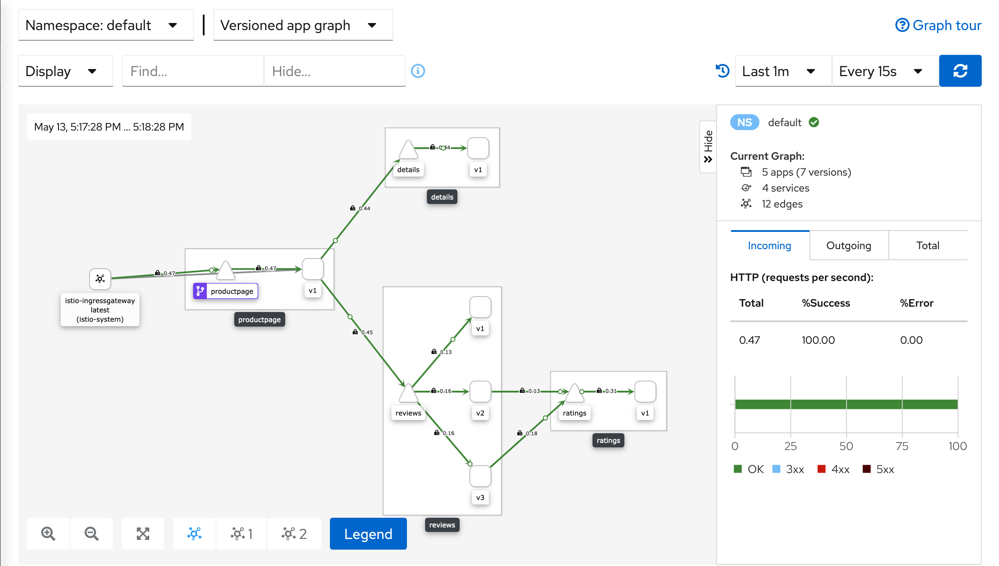
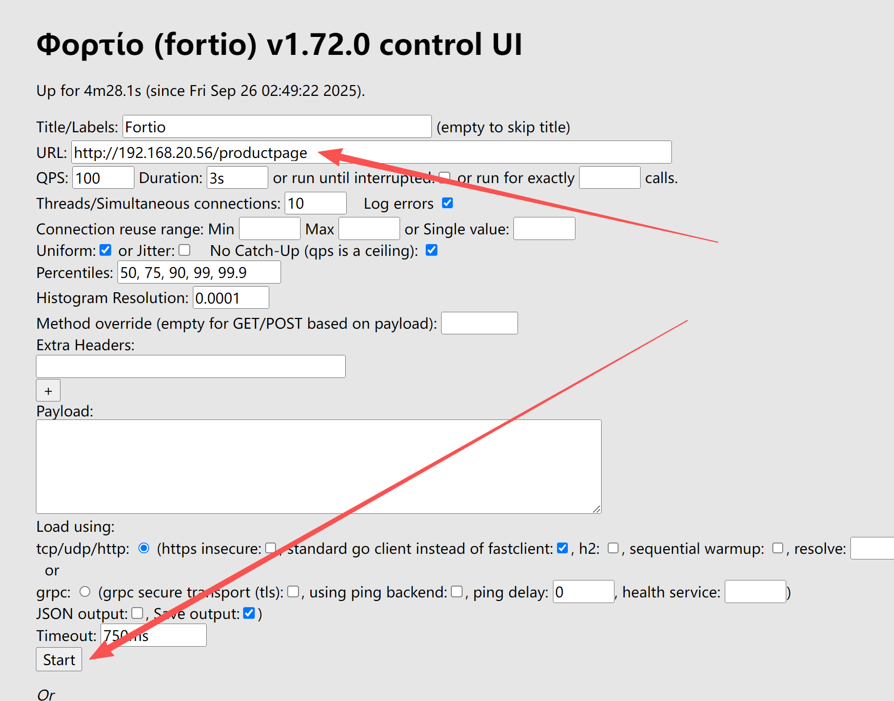
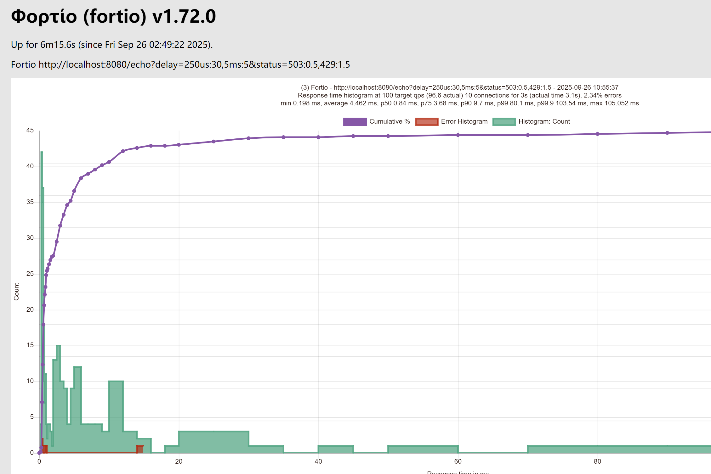

# 4.Istio

官网：[https://istio.io/](https://istio.io/)。Istio比较友好，提供中文版文档，且内容比较成熟。

- [云原生服务网格Istio实战——快速入门篇](https://mp.weixin.qq.com/s/hjIWE3e1YQi5y3NPVKM8bg)
- [云原生服务网格Istio实战——流量管理篇](https://mp.weixin.qq.com/s/fDBzeWfZtRQCAVp3VAqd2Q)
- [基于istio模式快速部署云原生微服务架构的商城示例项目](https://mp.weixin.qq.com/s/XN6EupNStf_Am0ZALK4JnA)
- [云原生服务网格Istio实战——可观测性](https://mp.weixin.qq.com/s/pKvMV_Q6ak4Q3U3F5Q9tbQ)
- [阿里巴巴开源的云原生网关Higress实战](https://mp.weixin.qq.com/s/BjCtFlPl7lIG4vMwQ7Kekw)
- [Linkerd2官网](https://linkerd.io/2/home/)
- [Envoy官网](https://www.envoyproxy.io/)
- 《Service Mesh模式》一书详细介绍了服务网格的设计理念与实践案例。

教程(istio1.14)：
- [Istio(一)：服务网格和 Istio 概述](https://www.cnblogs.com/renshengdezheli/p/16836205.html)
- [Istio(二)：在Kubernetes(k8s)集群上安装部署istio1.14](https://www.cnblogs.com/renshengdezheli/p/16836404.html)
- [Istio(三)：服务网格istio可观察性：Prometheus,Grafana,Zipkin,Kiali](https://www.cnblogs.com/renshengdezheli/p/16836943.html)
- [Istio(四)：创建部署Gateway并使用网关暴露服务](https://www.cnblogs.com/renshengdezheli/p/16838966.html)
- [Istio(五)：使用服务网格Istio进行流量路由](https://www.cnblogs.com/renshengdezheli/p/16839175.html)
- [Istio(六)：Istio弹性(超时&重试)和故障注入](https://www.cnblogs.com/renshengdezheli/p/16839182.html)
- [Istio(七)：ServiceEntry，sidecar，Envoy Filter](https://www.cnblogs.com/renshengdezheli/p/16839960.html)
- [Istio(八)：istio安全之认证，启用mTLS](https://www.cnblogs.com/renshengdezheli/p/16840382.html)
- [Istio(九)：istio安全之授权](https://www.cnblogs.com/renshengdezheli/p/16840393.html)
- [Istio(十)：istio多集群部署模式](https://www.cnblogs.com/renshengdezheli/p/16840924.html)
- [Istio(十一)：向istio服务网格中引入虚拟机](https://www.cnblogs.com/renshengdezheli/p/16840972.html)
- [Istio(十二)：Istio问题排查](https://www.cnblogs.com/renshengdezheli/p/16841748.html)
- [Istio(十三)：Istio项目实际案例——Online Boutique](https://www.cnblogs.com/renshengdezheli/p/16841875.html)

[九析带你轻松完爆 istio 服务网格系列教程](https://blog.51cto.com/u_14625168/2474277)


## 1.服务网格ServiceMesh

### 1.1.介绍

服务网格（Service Mesh）是用于管理微服务架构中服务间通信的专用基础设施层，它通过将服务间的网络交互逻辑（如服务发现、负载均衡、流量控制、安全加密、可观测性等）从业务代码中剥离，
实现 “业务逻辑与通信逻辑解耦”，从而简化微服务的治理复杂度。

随着微服务架构的普及，服务数量从几个增长到成百上千，服务间不断的架构分层，服务间的通信变得异常复杂，主要面临以下痛点：
1. 通信逻辑与业务耦合：每个服务都需手写代码处理重试、熔断、负载均衡、TLS 加密等通信逻辑，侵入业务代码，增加开发和维护成本。
2. 可观测性缺失：难以追踪跨服务调用链、监控通信延迟 / 错误率，问题排查困难。
3. 安全管控复杂：服务间认证、授权、数据加密需逐个服务实现，统一管控难度大。 
4. 流量管理灵活度低：灰度发布、蓝绿部署、流量镜像等需求需业务代码或网关配合，扩展性差。

微服务内部为了使用RPC引入了客户端的服务注册与发现、负载均衡、流量控制等手段，导致服务承担的非核心工作越来越多、越来越冗余，
服务网格正是为解决这些痛点而生——它将所有服务间的通信逻辑“下沉”到一个独立的基础设施层，让业务团队专注于业务开发，运维/平台团队专注于通信治理。

### 1.2.核心架构：数据平面 + 控制平面
服务网格的架构分为数据平面（Data Plane） 和控制平面（Control Plane） 两层，二者协同工作但职责完全分离，类似“交通警察”与“交通指挥中心”的关系。

| 维度         | 数据平面（Data Plane）                                                            | 控制平面（Control Plane）                                               |
|--------------|-----------------------------------------------------------------------------|-------------------------------------------------------------------|
| 核心组件 | 代理（Proxy），如Envoy、Linkerd2-proxy                                             | 管控组件（如Istio的Pilot、Citadel、Galley）                                 |
| 部署方式 | 以“边车（Sidecar）”模式与每个服务实例共生                                                   | 独立部署的中心化组件                                                        |
| 核心职责 | 1. 转发服务间的所有网络流量<br>2. 执行控制平面的策略（如流量路由、TLS加密、限流）<br>3. 收集流量 metrics、日志、调用链数据 | 1. 定义和管理全局通信策略<br>2. 动态配置数据平面代理<br>3. 提供统一的可观测性入口<br>4. 服务发现与证书管理 |
| 类比     | 路口的交通警察（执行具体指挥）                                                             | 交通指挥中心（制定规则、监控全局）                                                 |


边车代理（Sidecar Proxy）:数据平面的核心是“边车代理”——它像“副驾驶”一样，与每个服务实例部署在同一Pod（K8s环境）中，所有进出该服务的网络流量强制经过代理。
- 对业务服务完全透明：业务代码无需感知代理存在，也无需修改任何逻辑。
- 代理间构成“网格”：所有服务的边车代理相互通信，形成覆盖整个微服务集群的“通信网格”，这也是“服务网格”名称的由来。

### 1.3.核心功能
1. 流量管理：灵活控制服务间通信
   - 动态路由：按权重（灰度发布）、请求头、路径等规则转发流量，例如将10%流量路由到新版本服务。
   - 流量控制：实现熔断（服务故障时快速失败）、限流（防止过载）、重试（自动重试临时失败请求）、超时控制。
   - 流量镜像/复制：将生产流量复制一份发送到测试服务，用于无感知测试。
2. 可观测性：全面监控通信状态
   - Metrics：收集延迟、错误率、吞吐量等关键指标（如P99延迟、5xx错误占比），支持Prometheus/Grafana可视化。
   - Logging：记录每一次服务调用的详细日志（源服务、目标服务、请求耗时、状态码等）。
   - Tracing：生成跨服务调用链（如Jaeger/Zipkin），追踪请求从入口到出口的完整路径，快速定位性能瓶颈。
3. 安全：保障服务间通信安全
   - TLS加密：自动为服务间通信启用TLS，实现“加密传输”，防止数据泄露。
   - 身份认证：基于SPIFFE（安全身份标识）为每个服务分配唯一身份，确保只有授权服务能通信。
   - 授权控制：通过策略定义“哪些服务可以调用哪些接口”，例如禁止测试服务调用生产支付服务。
4. 服务发现与负载均衡
   - 替代传统的服务发现工具（如Consul），控制平面动态维护服务注册表，数据平面代理基于注册表实现智能负载均衡（如轮询、最小连接数）。

### 1.4.实现方案
目前业界有多个成熟的服务网格项目，其中以Istio、Linkerd最为流行：

| 方案         | 核心代理       | 特点                                  | 优势                                      | 适用场景                                  |
|--------------|----------------|---------------------------------------|-------------------------------------------|-------------------------------------------|
| Istio    | Envoy          | 功能全面、生态丰富、社区活跃          | 支持几乎所有服务网格功能，与K8s深度集成   | 大型复杂微服务集群、对功能完备性要求高的场景 |
| Linkerd  | Linkerd2-proxy | 轻量、低延迟、易用性强                | 性能开销小（~1ms延迟），部署和运维简单    | 对性能敏感、追求轻量化的场景              |
| Consul Connect | Envoy/Sidecar | 与Consul服务发现深度集成              | 适合已使用Consul的团队，无缝扩展          | 基于Consul的微服务架构                    |
| AWS App Mesh | Envoy          | 云厂商托管，无需自建控制平面          | 零运维成本，与AWS生态（ECS/EKS）无缝集成  | AWS云原生用户                             |

### 1.5.优缺点
优点：
1. 解耦业务与通信：业务团队无需关注通信逻辑，专注业务开发。
2. 统一管控：所有服务的通信策略由控制平面集中配置，一致性强。
3. 透明化升级：通信功能（如新增限流策略）可通过更新代理或控制平面实现，无需重启业务服务。
4. 增强可观测性与安全性：开箱即用的监控、追踪、加密能力，降低治理门槛。

缺点：
1. 性能开销：流量经过边车代理会增加少量延迟（Istio约2-5ms，Linkerd约1ms），对极端低延迟场景不友好。
2. 复杂度提升：新增了控制平面和代理层，增加了部署、运维和问题排查的复杂度。
3. 资源消耗：每个服务实例需额外运行一个代理，增加CPU/内存消耗（通常每个代理占10-50MB内存）。

### 1.6.适用场景
服务网格并非“银弹”，以下场景更适合引入：
- 大型微服务集群：服务数量超过50个，服务间通信复杂，需统一治理。
- 对可观测性/安全要求高：需精细化监控跨服务调用，或强制服务间加密通信。
- 频繁进行流量操作：需频繁执行灰度发布、蓝绿部署、流量镜像等需求。

对于小型微服务集群（<10个服务）或极端低延迟场景（如高频交易），服务网格的开销可能大于收益，建议优先使用简单的网关或SDK方案。

### 1.7.现实情况
绝大部分系统已经运行稳定，切换到SM代价太大。推动升级的周期往往是以季度、半年、又甚至更久，整体效率极低。
而且无法代替程序中的rpc client。只适合使用Restful API的场景。

## 2.Istio基础

Istio官网[https://istio.io/](https://istio.io/)

注意：
```shell
istioctl 有时读取k8s默认配置异常(尤其是使用k3s部署)，需要指定配置文件
istioctl version   --kubeconfig /etc/rancher/k3s/k3s.yaml

或者设置环境变量
export KUBECONFIG=/etc/rancher/k3s/k3s.yaml

或者复制一份配置文件
mkdir -p ~/.kube
sudo cp /etc/rancher/k3s/k3s.yaml ~/.kube/config
sudo chown $(id -u):$(id -g) ~/.kube/config
```


### 2.1.介绍
Istio是首个开源的服务网格项目，由Google、IBM和Lyft联合发起，专为微服务治理设计。

它通过 Envoy 边车代理（数据平面）拦截服务间通信，配合控制平面组件（如 Pilot、Galley、Citadel 等）提供流量管理、安全加密、可观测性等核心能力，且对业务代码完全透明。

简单来说，Istio 能帮你在不修改业务代码的前提下，实现微服务的灰度发布、熔断限流、调用链追踪、TLS 加密等高级功能，是云原生时代微服务治理的主流工具。

### 2.2.核心组件

| 组件                    | 功能                              |
|-----------------------|---------------------------------|
| Pilot                 | 管理服务注册与发现，动态配置代理路由规则            |
| Citadel               | 提供身份认证与证书管理功能                   |
| Galley                | 负责从外部源（如K8s ConfigMap）同步策略到控制平面 |
| Sidecar Proxy (Envoy) | 数据平面的边车代理，负责转发流量并执行控制面          |

### 2.3.安装
Istio 依赖 K8s
1. 已部署 Kubernetes 集群（版本 ≥ 1.24，推荐用 Minikube、Kind 或生产级集群）。
2. 已安装 `kubectl` 命令行工具，并能正常访问 K8s 集群（`kubectl get nodes` 可返回节点信息）。
3. 集群资源：至少 2 CPU、4GB 内存（用于部署 Istio 控制平面和示例应用）。


Istio 提供 `istioctl` 工具简化安装，步骤如下：

```shell
1. 下载 Istio
# 官网下载压缩包 或者 直接使用命令下载
curl -L https://istio.io/downloadIstio | sh -

# 解压并进入目录
cd istio-1.27.1

2. 配置 istioctl 环境变量
vim /etc/profile
export ISTIO_BIN=/data/istio/istio-1.27.1/
export PATH=$ISTIO_BIN/bin:$PATH
source /etc/profile

3. 安装 Istio 到 K8s 集群：Istio 提供多种配置文件（Profile），适合不同场景：
demo：包含所有组件，适合测试（推荐新手使用）。
default：生产环境默认配置，组件精简。

这里选择 demo 配置安装：
# 安装 Istio（-y 表示自动确认）
istioctl install --set profile=demo -y

这里可能存在证书的问题。例如使用k3s安装的k8s则需要手动指定证书。
# 导出 k3s 的 CA 证书
export KUBE_CA_FILE=/var/lib/rancher/k3s/server/tls/server-ca.crt
# 使用证书重新安装 Istio
istioctl install --set profile=demo -y --kubeconfig /etc/rancher/k3s/k3s.yaml

输出类似如下信息，表示安装成功：
✔ Istio core installed
✔ Istiod installed
✔ Ingress gateways installed
✔ Egress gateways installed
✔ Installation complete

4. 验证安装：检查 Istio 组件是否正常运行（默认部署在 `istio-system` 命名空间）：
kubectl get pods -n istio-system

正常情况下，所有 Pod 状态应为 `Running`：
NAME                                   READY   STATUS    RESTARTS   AGE
istio-egressgateway-xxx                1/1     Running   0          1m
istio-ingressgateway-xxx               1/1     Running   0          1m
istiod-xxx                             1/1     Running   0          1m
```

### 2.4.使用案例-部署应用

Istio 提供官方示例应用 Bookinfo（在线书店系统，包含多个微服务），用于演示服务网格功能。

核心流程
```shell
[ 外部流量 ]http://192.168.3.201:8080/productpage
       │
       ▼
[ istio-ingressgateway (Envoy) ]   <-- 入口网关：http://bookinfo-gateway-istio.default.svc.cluster.local:80/productpage
       │       istio-ingressgateway 向istio请求路由表，istio 根据 `Gateway` 和 `VirtualService` 生成路由规则，返回给 ingress。
       ▼
[productpage|details|reviews|ratings]   <-- 带 Envoy Sidecar 的service: http://clusterId:9080/productpage（service随机路由到某个pod）
       │
       ▼
[productpage-v1|reviews-v1|.........]   <-- 带 Envoy Sidecar 的pod: http://ip:9080/productpage
```

操作流程：
```shell
进入istio根目录，方便执行命令：
cd /data/istio/istio-1.27.1

# 1. 创建命名空间
kubectl create namespace bookinfo

# 2. 启用 Sidecar 自动注入
kubectl label namespace bookinfo istio-injection=enabled

# 3. 验证标签（确保 istio-injection=enabled）
kubectl get namespace bookinfo --show-labels

# 4. 部署应用（使用 Istio 自带的示例配置）
kubectl apply -f samples/bookinfo/platform/kube/bookinfo.yaml -n bookinfo
service/details created
serviceaccount/bookinfo-details unchanged
deployment.apps/details-v1 created
service/ratings created
serviceaccount/bookinfo-ratings unchanged
deployment.apps/ratings-v1 created
service/reviews created
serviceaccount/bookinfo-reviews unchanged
deployment.apps/reviews-v1 created
deployment.apps/reviews-v2 created
deployment.apps/reviews-v3 created
service/productpage created
serviceaccount/bookinfo-productpage unchanged
deployment.apps/productpage-v1 created

# 5. 验证部署状态
检查 Pod 状态：确保所有 Pod 包含 2 个容器（应用容器 + istio-proxy 代理容器），且状态为 Running：
kubectl get pods -n bookinfo
NAME                              READY   STATUS    RESTARTS   AGE
details-v1-766844796b-sgplr       2/2     Running   0          24m
productpage-v1-54bb874995-8kt5p   2/2     Running   0          24m
ratings-v1-5dc79b6bcd-ghppp       2/2     Running   0          24m
reviews-v1-598b896c9d-2dqn8       2/2     Running   0          24m
reviews-v2-556d6457d-khv98        2/2     Running   0          24m
reviews-v3-564544b4d6-rvr8f       2/2     Running   0          24m

检查 Service 状态：确认所有服务已创建（均为 ClusterIP 类型，仅集群内部可访问）
kubectl get svc -n bookinfo
NAME          TYPE        CLUSTER-IP      EXTERNAL-IP   PORT(S)    AGE
details       ClusterIP   10.43.68.222    <none>        9080/TCP   24m
productpage   ClusterIP   10.43.32.212    <none>        9080/TCP   24m
ratings       ClusterIP   10.43.100.220   <none>        9080/TCP   24m
reviews       ClusterIP   10.43.181.101   <none>        9080/TCP   24m

# 6. 通过 Istio Ingress Gateway 暴露应用（外部访问）Bookinfo 的 productpage 服务是前端入口，
但默认是 ClusterIP 类型，外部无法访问。需通过 Istio Gateway + VirtualService 配置入站流量规则，将外部请求路由到 productpage
kubectl apply -f samples/bookinfo/networking/bookinfo-gateway.yaml -n bookinfo
gateway.networking.istio.io/bookinfo-gateway created
virtualservice.networking.istio.io/bookinfo created

Gateway：定义 Istio Ingress Gateway 如何接收外部流量（监听 80 端口，匹配 host: *）。
VirtualService：定义流量路由规则（将外部请求路由到 productpage:9080 服务）。

# 7.  验证路由配置:istio自定义的资源，使用自定义资源的查询方式
kubectl get gateways.networking.istio.io -A
NAMESPACE   NAME               AGE
bookinfo    bookinfo-gateway   20m

kubectl get virtualservices.networking.istio.io -A
NAMESPACE   NAME       GATEWAYS               HOSTS   AGE
bookinfo    bookinfo   ["bookinfo-gateway"]   ["*"]   20m

因为istio-ingressgateway整个集群的唯一入口，对外提供http2 80(内部8080)，https 443(内部8443)端口。
而bookinfo-gateway作为微服务的网关，暴露8080端口，可以被istio-ingressgateway代理到。

# 8.访问：
# 查看 对外暴露的IP，输出中 EXTERNAL-IP 即为外部访问地址
kubectl get svc istio-ingressgateway -n istio-system

http://<EXTERNAL-IP>/productpage，可看到 Bookinfo 首页，多次刷新会发现评论区显示不同（因为 reviews 服务有 3 个版本）。
```

### 2.5.完整的请求流程
以 Bookinfo 为例：
1. 用户访问 `istio-ingressgateway`。
2. Ingress Gateway Envoy 向 `istiod` 请求路由配置（RDS）。
3. `istiod` 根据 `Gateway` 和 `VirtualService` 生成路由规则，返回给 Envoy。
4. Envoy 按规则将流量转发到 `productpage` 服务的 Sidecar Envoy。
5. `productpage` 的 Sidecar 同样从 `istiod` 获取目标服务（details、reviews）的集群信息（CDS/EDS）。
6. `istiod` 同时通过 SDS 推送证书，实现 mTLS 加密通信。
7. 所有流量经过 Envoy 时，自动生成指标和追踪数据，发送给遥测后端。

### 2.6.清理环境

如需卸载 Istio 和示例应用，执行以下命令：
```bash
# 1. 删除 Bookinfo 服务和路由配置
kubectl delete -f samples/bookinfo/platform/kube/bookinfo.yaml -n bookinfo
kubectl delete -f samples/bookinfo/networking/bookinfo-gateway.yaml -n bookinfo

# 2. 删除命名空间（可选，彻底清理）
kubectl delete namespace bookinfo

# 3. 卸载 Istio（可选）
istioctl uninstall --purge
kubectl delete namespace istio-system
```

## 3.控制平面

在 Istio 1.5 之前，控制平面是由多个独立组件构成的： Pilot（服务发现、流量管理），Galley（配置验证），Citadel（证书管理），Sidecar Injector（自动注入代理）

从 Istio 1.5 开始，这些组件被合并成了一个单体服务，命名为 `istiod`（Istio Daemon）。

### 3.1.服务发现
功能：让 Envoy 代理知道集群中有哪些服务以及它们的网络地址（Endpoint）。

实现方式：
- 数据源：`istiod` 通过 k8s watch API 监听 Service、Pod、Endpoint 等资源的变化。
- 内部处理：
   - istiod 将 K8s Service 模型转换成 Envoy 能识别的 服务注册表（Service Registry）。
   - 注册表中保存服务名、IP、端口、标签等信息。
- 下发机制：
   - 使用 XDS 协议（gRPC 流式推送）将服务信息推送到 Envoy 代理（Sidecar 或 Gateway）。
   - Envoy 收到后更新自己的路由表和集群信息。

### 3.2.配置管理
功能：管理 Istio 的流量规则、安全策略、遥测配置等，并将其转化为 Envoy 配置。

实现方式：
- 配置来源：
   - 用户通过 `kubectl apply` 创建 Istio 自定义资源（CRD），例如：
      - `Gateway`
      - `VirtualService`
      - `DestinationRule`
      - `ServiceEntry`
      - `AuthorizationPolicy`
- 配置验证：
   - Galley 的功能被集成到 `istiod`，负责验证这些 YAML 配置的语法和语义是否正确。
- 配置转换：
   - `istiod` 将这些高-level 规则翻译成 Envoy 的底层配置（`envoy.json` 风格的结构化数据）。
- 下发机制：
   - 通过 XDS 协议（包括 LDS、RDS、CDS、EDS 等）将配置推送到 Envoy。

### 3.3.流量管理
功能：实现动态路由、负载均衡、灰度发布、熔断、重试、镜像等。

实现方式：
- 基于 Envoy 过滤器链：
   - Envoy 代理会在 HTTP/TCP 连接处理链中插入多个过滤器（Filter）。
   - 这些过滤器由 `istiod` 通过 RDS（Route Discovery Service） 和 CDS（Cluster Discovery Service） 动态配置。
- 动态更新：
   - 当你修改 `VirtualService` 或 `DestinationRule` 时，`istiod` 会立即推送新的路由规则到 Envoy，无需重启服务。

### 3.4.安全
功能：提供服务间的双向 TLS（mTLS）加密、身份认证、授权等。

实现方式：
- 证书签发：
   - `istiod` 内置 Citadel 功能，作为 CA（证书颁发机构）。
   - 为每个服务账户（Service Account）签发身份证书（X.509），默认有效期 24 小时，自动轮转。
- 密钥分发：
   - 通过 SDS（Secret Discovery Service） 将证书和私钥推送到 Envoy 代理。
- 双向认证（mTLS）：
   - Envoy 收到 SDS 推送的证书后，在服务调用时自动协商 TLS 连接。
- 授权策略：
   - 用户创建 `AuthorizationPolicy` CRD。
   - `istiod` 将策略转换为 Envoy 的 RBAC（Role-Based Access Control）配置并下发。

### 3.5.遥测（Telemetry）
功能：自动收集流量指标、日志和分布式追踪数据。

实现方式：
- 指标收集：
   - `istiod` 下发 Envoy 的 Telemetry API 配置，让 Envoy 代理在处理请求时生成指标（如延迟、错误率、请求量）。
   - 指标默认通过 Prometheus 格式暴露，由 Prometheus 采集。
- 分布式追踪：
   - 下发 Envoy 的追踪配置（支持 Jaeger、Zipkin 等）。
   - Envoy 在请求头中注入追踪信息（`x-request-id`、`x-b3-*`），实现跨服务追踪。
- 日志：
   - 可配置 Envoy 输出访问日志，支持 JSON 格式，可集成 Fluentd/Elasticsearch。

### 3.6.Sidecar 自动注入
功能：在 Pod 创建时自动将 Envoy 代理容器注入到 Pod 中。

实现方式：
- Kubernetes Mutating Webhook：
   - `istiod` 注册一个 Mutating Admission Webhook 到 K8s API Server。
   - 当有 Pod 创建请求时，API Server 会调用 `istiod` 的 webhook。
   - `istiod` 在响应中修改 Pod 定义，添加 Envoy 容器和相关的初始化容器（`istio-init`）。
- 注入策略：
   - 可通过命名空间标签 `istio-injection=enabled` 控制是否自动注入。
   - 也可以在 Pod 注解中单独控制。

### 3.7.Istiod 与 Envoy 的交互方式
Istiod 与 Envoy 之间通过 XDS 协议（基于 gRPC 长连接）通信：
- XDS 是一组发现服务的总称：
   - LDS（Listener Discovery Service）：推送监听端口配置
   - RDS（Route Discovery Service）：推送路由规则
   - CDS（Cluster Discovery Service）：推送上游服务集群信息
   - EDS（Endpoint Discovery Service）：推送服务实例（Endpoint）信息
   - SDS（Secret Discovery Service）：推送证书密钥等安全材料

工作流程：
1. Envoy 启动时连接 `istiod`，请求初始配置。
2. `istiod` 根据 K8s 资源和 Istio 配置生成 Envoy 配置。
3. 建立 gRPC 流式连接，持续推送配置更新。
4. Envoy 本地应用新配置，无需重启。

### 3.8.Istiod实现原理
- XDS 协议：动态下发配置（服务发现、路由、集群、监听器、证书）
- Mutating Webhook：自动注入 Sidecar
- Kubernetes API Server：作为唯一的真实数据源（服务、配置、账户）
- CRD + Validation：定义和校验 Istio 配置
- SDS：安全证书分发
- MCP（Mesh Configuration Protocol）：内部配置同步（已逐步被 XDS 取代）

## 4.数据平面

数据平面（Envoy 代理）：
- Sidecar：注入到应用 Pod 内，负责服务之间的通信（东西向流量）。
- Ingress Gateway：部署在集群边缘，负责接收外部流量并转发到内部服务。
- Egress Gateway（可选）：负责管理集群对外访问的流量。

### 4.1.ingress gateway

istio-ingressgateway 是 Istio 数据平面的一部分，本质上是一个 Envoy 代理，专门用来处理 从集群外部进入 Kubernetes 集群的流量（即南北向流量，North-South Traffic）。

它通常以 Deployment + Service 的形式部署在 istio-system 命名空间，并且会绑定一些节点端口（NodePort）或者通过云平台的 LoadBalancer 暴露到公网。

istio-ingressgateway 本质： 是一个独立的服务（Service），它运行 Envoy 代理容器，监听容器内部的一些端口。

流量方向
```shell
[ 外部流量 ]
       │
       ▼
[ istio-ingressgateway (Envoy) ]   <-- 入口网关
       │
       ▼
[ 服务 A | 服务 B | 服务 C ]        <-- 带 Envoy Sidecar 的应用 Pods
```

主要作用：
1. 集群入口流量管理：作为所有外部请求进入集群的 “入口”，统一接入 HTTP、HTTPS、TCP 流量。
   - 结合 Istio 的 Gateway 和 VirtualService 资源，精确控制流量路由。
   - 例如：将 bookinfo.example.com/productpage 请求转发到 productpage 服务
2. 流量控制与治理
   - 支持基于权重的灰度发布（A/B 测试）
   - 支持路径匹配、重定向、重试、熔断等。
   - 支持流量镜像（mirroring）。
3. 安全控制
   - TLS 终止（HTTPS 解密）
   - 客户端证书认证（mTLS 对服务端） 
   - 集成 JWT 认证
4. 可观测性
   - 统一收集入口流量的日志、指标（Prometheus）、分布式追踪（Jaeger/Zipkin）。
   - 方便监控外部请求的延迟、错误率、流量大小。

<p style="color: red">它和 Kubernetes Ingress 的区别</p>

1. K8s Ingress：是 Kubernetes 原生资源，只能做简单的 HTTP/HTTPS 路由，功能有限。
2. Istio Gateway：
   - 功能更强大，支持 TCP、TLS、流量控制、安全策略等。 
   - 配置与服务发现集成得更紧密，可以直接利用 Istio 的流量管理能力。
   - istio-ingressgateway 就是 Gateway 资源的 “执行者”，它读取 Gateway + VirtualService 配置并生效。

Bookinfo的案例：创建gateway+路由规则(VirtualService)
```yaml
# 1. 创建 Gateway，name=bookinfo-gateway，绑定istio-ingressgateway的8080端口，协议为http
apiVersion: networking.istio.io/v1alpha3
kind: Gateway
metadata:
  name: bookinfo-gateway
spec:
  selector:
    istio: ingressgateway # 选择 istio-ingressgateway 作为实现
  servers:
  - port:
      number: 8080
      name: http
      protocol: HTTP
    hosts:
    - "*"
---
# 2. 创建 VirtualService，name=bookinfo，匹配所有主机，路由到productpage服务的9080端口，协议为http
apiVersion: networking.istio.io/v1alpha3
kind: VirtualService
metadata:
  name: bookinfo
spec:
  hosts:
  - "*"
  gateways:
  - bookinfo-gateway
  http:
  - match:
    - uri:
        exact: /productpage
    - uri:
        prefix: /static
    - uri:
        exact: /login
    - uri:
        exact: /logout
    - uri:
        prefix: /api/v1/products
    route:
    - destination:
        host: productpage
        port:
          number: 9080
```

### 4.2.networking.istio.io

上面案例中创建的 gateway，本质：只是声明性配置，并不会真实运行资源，可以理解为ingress的配置。

Gateway（无论是 networking.istio.io/v1alpha3 还是 gateway.networking.k8s.io）只是一个 声明性配置，
作用是告诉 Istio： “请在某个 Ingress Gateway 上，监听某个端口，并且按照规则转发流量”

注意：这个端口必须是 Ingress Gateway 容器已经监听并暴露 的端口，否则 Istio 会报错（配置无效）。

也就是bookinfo-gateway 可以使用8080端口，其他所有的gateway都必须使用8080端口，才能被istio-ingressgateway的80端口代理到。

## 5.其他核心功能

### 5.1.流量管理

作用：通过流量控制实现：1. 流量转移（蓝绿部署、金丝雀发布）；2. 故障注入；3. 超时和重试策略。

```bash
# 应用权重路由规则
1. 将 90% 流量路由到 `reviews-v1`，10% 路由到 `reviews-v2`：
kubectl apply -f samples/bookinfo/networking/virtual-service-reviews-90-10.yaml -n bookinfo

2. 将所有流量路由到 reviews-v1（无星级评分）
kubectl apply -f samples/bookinfo/networking/virtual-service-all-v1.yaml -n bookinfo

3. 再将流量切换到 reviews-v2（黑色星级）
kubectl apply -f samples/bookinfo/networking/virtual-service-reviews-v2.yaml -n bookinfo
```

流量控制核心使用VirtualService实现
```yaml
apiVersion: networking.istio.io/v1alpha3
kind: VirtualService
metadata:
  name: reviews
spec:
  # 1. 应用权重路由规则
  hosts:
    - reviews.bookinfo.svc.cluster.local
  trafficPolicy:       # 负载均衡：ROUND_ROBIN,RANDOM,LEAST_CONN
    loadBalancer:
      simple: ROUND 
  http:
    route:
      - destination:
        host: reviews-v1.bookinfo.svc.cluster.local
      weight: 90
      - destination:
        host: reviews-v2.bookinfo.svc.cluster.local
      weight: 10
      timeout: 3s        # 超时时间
      reties:
        attempts: 3      # 重试次数
  # 2.匹配规则/条件从关键字。使用match开始：使用精确值（exact），前缀（prefix）或正则表达式	  
  http:  
  - match:    
    - headers:        
        end-user:          
          exact: jason      		  # 设置http header: end-user=jason
      uri:        
        prefix: "/reviews/v1/"      # 前缀匹配
      ignoreUriCase: true  		  # 请求 uri 忽略大小写
    route:    
    - destination:        
        host: reviews.bookinfo.svc.cluster.local
  # 3. url重写
  http:
  - match:
    - uri:
        prefix: /book-api/
	  rewrite:
	    uri: /
```

### 5.2.故障注入（模拟服务延迟）

```shell
给 ratings 服务注入 2 秒延迟（测试 productpage 的容错能力）
kubectl apply -f samples/bookinfo/networking/virtual-service-ratings-test-delay.yaml -n bookinfo
访问页面，评价区会显示 “Error fetching product reviews”（因延迟导致超时），验证故障注入生效。

移除故障注入：
kubectl delete -f samples/bookinfo/networking/virtual-service-ratings-test-delay.yaml -n bookinfo
```

也是通过VirtualService实现，但是需要用到fault模块：
```yaml
apiVersion: networking.istio.io/v1alpha3
kind: VirtualService
metadata:
  name: ratings
spec:
  hosts:
  - ratings
  http:
  - match:
    fault:
      delay:                        # 延迟故障注入
        percentage:                 # 百分比，默认为100.0
          value: 100.0      
        fixedDelay: 7s              # 延迟时间，7s  																																																								        
    route:
    - destination:
        host: ratings
        subset: v1
```

### 5.3.可观测性：查看服务拓扑与指标

Istio 集成了 Kiali（服务拓扑）、Grafana（监控指标）、Jaeger（调用链）等工具。
遥测能帮您了解服务网格的结构、展示网络的拓扑结构、分析网格的健康状态。

```shell
安装 Kiali 和其他插件，等待部署完成。
kubectl apply -f /data/istio/istio-1.27.1/samples/addons

查看创建的状态
kubectl rollout status deployment/kiali -n istio-system
Waiting for deployment "kiali" rollout to finish: 0 of 1 updated replicas are available...
deployment "kiali" successfully rolled out  # 成功的标识

以下为本地访问：
# 打开 Kiali（服务网格可视化）
istioctl dashboard kiali

# 打开 Grafana（监控指标，如延迟、错误率）
istioctl dashboard grafana

# 打开 Jaeger（调用链追踪）
istioctl dashboard jaeger
```

Kiali 仪表板展示了网格的概览以及 Bookinfo 示例应用的各个服务之间的关系。 它还提供过滤器来可视化流量的流动。



- [初探istio kiali](https://blog.csdn.net/shykevin/article/details/112256808)
- [Istio 部署Bookinfo 应用](https://blog.csdn.net/shykevin/article/details/112301611)
- [istio kiali 可视化bookinfo](https://blog.csdn.net/shykevin/article/details/112301612)
- [istio kiali 内部介绍](https://blog.csdn.net/shykevin/article/details/112301613)
- [istio kiali 亲和性调度](https://blog.csdn.net/shykevin/article/details/112301615)
- [istio kiali jaeger 关联](https://blog.csdn.net/shykevin/article/details/112301614)

### 5.4.压测Fortio
Fortio 是 Istio 的负载测试工具，它提供了 web 控制台和命令行控制台的操作方式。

```shell
# 安装
docker run -p 8080:8080 -p 8079:8079 fortio/fortio server & # For the server

# 压测某个站点
docker run fortio/fortio load -c 5 -n 20 -qps 0 -logger-force-color http://www.baidu.com
# -c 表示并发数
# -n 一共多少请求
# -qps 每秒查询数，0 表示不限制
```

web 控制台：打开浏览器，输入 http://IP:8080/fortio

输入地址点击start


生成报表



## 6.原理

### 6.1.故障注入

依赖于envoy代理提供的功能。分为 延迟（delay） 和 中断（abort） 两种。基本原理
1. 数据面拦截流量。因为istio会在每个pod中注入envoy作为代理，envoy通过iptables/IPVS劫持所有进入pod的流量。
2. 控制面下发规则。定义istio的VirtualService（或 Gateway、DestinationRule 等）时，通过fault引入故障类型。
  而pilot会监听k8s api获得规则，将其转为envoy的配置并推送给对应pod的envoy。
3. 代理执行故障。envoy根据配置，对流量进行延迟或中断处理。