# docker

- 官网： [https://docker.io](https://docker.io)
- 官方仓库：[https://hub.docker.com/](https://hub.docker.com/)
- 在线中文书:[https://github.com/yeasy/docker_practice](https://github.com/yeasy/docker_practice)
- Docker —— 从入门到实践在线pdf[https://legacy.gitbook.com/book/yeasy/docker_practice](https://legacy.gitbook.com/book/yeasy/docker_practice)
- 代码案例：[https://gitee.com/luckSnow/spring-boot-example/tree/master/lab_084_docker](https://gitee.com/luckSnow/spring-boot-example/tree/master/lab_084_docker)
- Docker 资源(cpu、memory)限制实践篇：[https://blog.csdn.net/jzg5845201314/article/details/105295310/](https://blog.csdn.net/jzg5845201314/article/details/105295310/)
- docker 教程： [https://www.runoob.com/docker/docker-tutorial.html](https://www.runoob.com/docker/docker-tutorial.html)
- Docker在雪球的技术实践：[https://mp.weixin.qq.com/s/X4CsA_sb8zaL7G0vQm9G5w](https://mp.weixin.qq.com/s/X4CsA_sb8zaL7G0vQm9G5w)

## 1.基础介绍

### 1.1.什么是docker

- Docker是开源应用容器引擎，轻量级容器技术。
- 基于Go语言，并遵循Apache2.0协议开源
- Docker可以让开发者打包他们的应用以及依赖包到一个轻量级、可移植的容器中，然后发布到任何流行的Linux系统上，也可以实现虚拟化
- 容器完全使用沙箱技术，相互之间不会有任何接口（不支持32位）
- 类似于虚拟机技术(vmware、vitural)，但docker直接运行在操作系统(Linux)上，而不是运行在虚拟机中，速度快，性能开销极低

### 1.2.Docker核心概念

- docker镜像(Images)：Docker镜像是用于创建Docker容器的模板
- docker容器(Container)：镜像启动后的一个实例称为容器，容器是独立运行的一个或一组应用，
- docker客户端(Client)：客户端通过命令行或其他工具使用 Docker API(https://docs.docker.com/reference/api/docker_remote_api)与Docker的守护进程进行通信
- docker主机(Host)：一个物理或虚拟的机器用来执行Docker守护进程和容器
- docker仓库(Registry)：Docker仓库用来存储镜像，可以理解为代码控制中的代码仓库，Docker Hub(https://hub.docker.com) 提供了庞大的镜像集合供使用

### 1.3.LXC
LXC为Linux Container的简写。可以提供轻量级的虚拟化，以便隔离进程和资源，而且不需要提供指令解释机制以及全虚拟化的其他复杂性。相当于C++中的NameSpace。容器有效地将由单个操作系统管理的资源划分到孤立的组中，以更好地在孤立的组之间平衡有冲突的资源使用需求。

与传统虚拟化技术相比，它的优势在于：

（1）与宿主机使用同一个内核，性能损耗小；

（2）不需要指令级模拟；

（3）不需要即时(Just-in-time)编译；

（4）容器可以在CPU核心的本地运行指令，不需要任何专门的解释机制；

（5）避免了准虚拟化和系统调用替换中的复杂性；

（6）轻量级隔离，在隔离的同时还提供共享机制，以实现容器与宿主机的资源共享。

总结：Linux Container是一种轻量级的虚拟化的手段。

Linux Container提供了在单一可控主机节点上支持多个相互隔离的server container同时执行的机制。
Linux Container有点像chroot，提供了一个拥有自己进程和网络空间的虚拟环境，但又有别于虚拟机，因为lxc是一种操作系统层次上的资源的虚拟化。在LXC的基础之上，docker提供了一系列更强大的功能

docker和openstack的几项对比

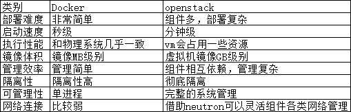

### 1.4.Docker的架构

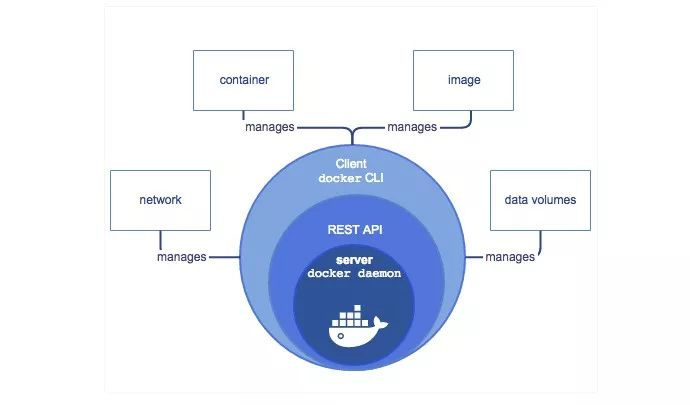


docker
daemon就是docker的守护进程即server端，可以是远程的，也可以是本地的，这个不是C/S架构吗，客户端Docker
client 是通过rest api进行通信。

docker cli
用来管理容器和镜像，客户端提供一个只读镜像，然后通过镜像可以创建多个容器，这些容器可以只是一个RFS（Root
file system根文件系统），也可以ishi一个包含了用户应用的RFS，容器再docker
client中只是要给进程，两个进程之间互不可见。

用户不能与server直接交互，但可以通过与容器这个桥梁来交互，由于是操作系统级别的虚拟技术，中间的损耗几乎可以不计。

## 2.安装

Docker需要Linux内核版本在3.10以上。


### 2.1.Linux安装

Ubuntu(14.04之后默认自带docker)命令：sudo apt-get install docker.io

Centos(默认安装1.13.0): yum install docker

Centos7安装最新版docker:

```shell
curl -fsSL https://get.docker.com/ | sh
```


### 2.2.window安装

1.下载

下载Docker
Toolbox，https://www.docker.com/products/docker-toolbox，选择所有安装的选项

点击Docker Quickstart Terminal图标，从而打开一个Docker Toolbox
terminal。开启安装docker

安装过程中需要boot2docker.iso文件，这个文件被墙了。自己下载后放在：C:\\Users\\zhangxue\.docker\machine\cache

2.校验命令：docker info

3.登录docker hub账号：docker login

（在使用docker时，是否登陆没有特别大的影响，只不过是，如果登陆了，就可以向docker
hub上push自己的镜像了）

注册地址：https://hub.docker.com/

（账号：zhangxue19890628，密码：zhangxue19890628，邮箱：1039791136@qq.com）

4.使用ssh工具连接（Docker Toolbox terminal 不好用太简单了）

登录iP:打开Docker Toolbox terminal时，会显示docker的iP

默认的用户名和密码是： docker/tcuser

5.设置docker系统时间

查看：date

修改：date -s "2017-4-7 20:24:30"

6.初始化root用户(我的密码是zx)

sudo passwd root

### 2.3.校验

校验命令：sudo docker info

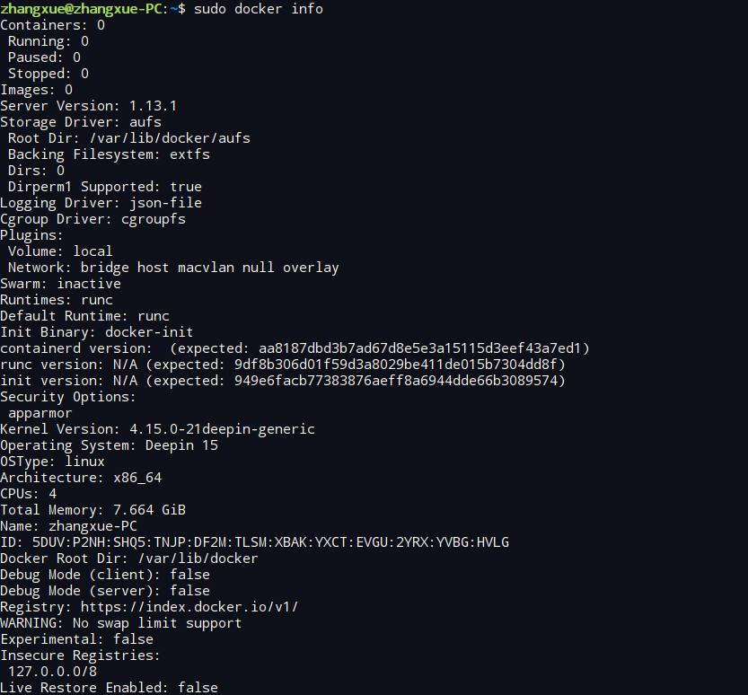


### 2.4.登录docker hub(可选)

账号：docker login

（在使用docker时，是否登陆没有特别大的影响，只不过是，如果登陆了，就可以向docker
hub上push自己的镜像了）

注册地址：https://hub.docker.com/

（账号：zhangxue19890628，密码：zhangxue1989，邮箱：1039791136@qq.com）

### 2.5.使用ssh工具连接(windows版本)

1.Docker Toolbox terminal。 不好用太简单了

登录iP:打开Docker Toolbox terminal时，会显示docker的iP

默认的用户名和密码是： docker/tcuser

2.设置docker系统时间

查看：date

修改：date -s "2017-4-7 20:24:30"

3.初始化root用户： sudo passwd root

### 2.6.启动停止 

启动： sudo systemctl start docker

停止： sudo systemctl stop docker

开启启动:

sudo systemctl enable docker

将Docker的docker.service服务移动到系统服务中

cp /usr/lib/systemd/system/docker.service /etc/systemd/system/

sudo systemctl daemon-reload

sudo systemctl restart docker

### 2.7.Docker日志

[https://blog.csdn.net/warrior_0319/article/details/79713155](https://blog.csdn.net/warrior_0319/article/details/79713155)

Centos查看日志：journalctl -u docker.service

## 3.基本操作

官方命令清单：[https://docs.docker.com/engine/reference/run/](https://docs.docker.com/engine/reference/run/)

Docker run命令清单：[https://www.616818.net/newslist/143.html](https://www.616818.net/newslist/143.html)

Docker update 命令清单：[https://www.lwhweb.com/posts/26195/](https://www.lwhweb.com/posts/26195/)

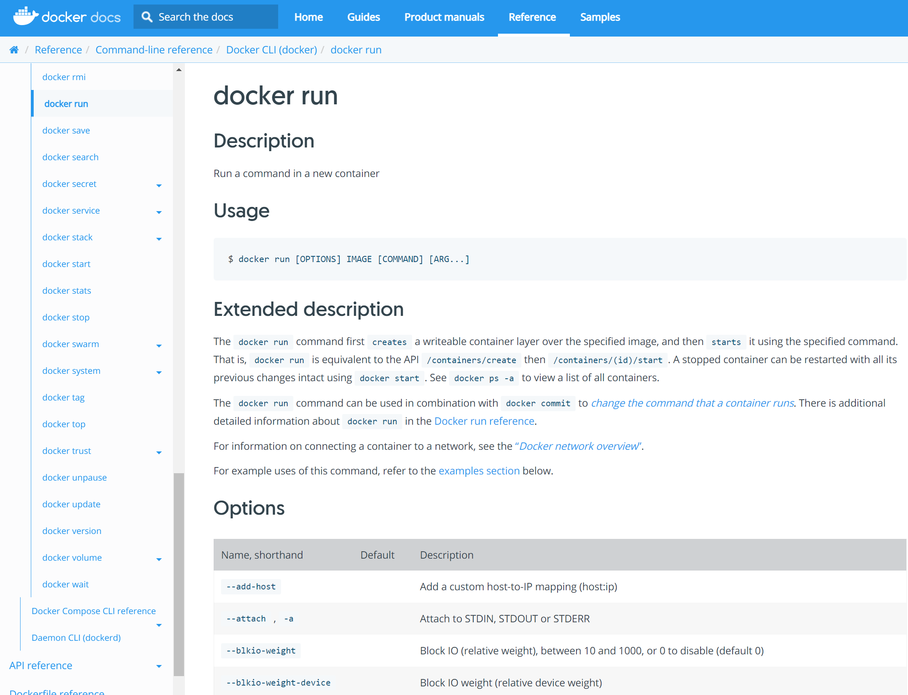


### 3.1.操作镜像

1.下载一个镜像：docker pull 镜像名称 (如：docker pull ubuntu:14.04)

2.查看docker中所有的镜像：docker images -a (-a 表示所有的)

3.删除全部镜像的话：docker rmi $(docker images -q)

4.删除一个镜像: docker rmi <image id>

删除时出现异常：

Error response from daemon: conflict: unable to delete ea5f89e79b1e
(must be forced) - image is referenced in multiple repositories

这是因为被删除的ImageID，这里存在多个REPOSITORY名字引用,删除的时候需要使用REPOSITORY名字


docker rmi tb518550_11/zx-redis:v1

5.运行镜像，比如：docker run -it ubuntu:14.04, 使用exit退出镜像。

docker run --name container-name -d i-p port1:port2 mage-name:tag

```text
--name：自定义容器名
-d：表示后台运行
image-name:指定运行的镜像名称
tag:镜像的版本
-p:主机端口映射到容器内部的端口，1是外部，2是内部
-P随机指定一个docker主机端口给容器中的端口做映射（-p与-P不能同时使用）
```

6.上传镜像到docker hub:docker push 用户名/仓库名:tag信息

(比如：docker push zhangxue19890628/ubuntu-nginx:v1,这个过程非常慢，建议使用国内的镜像)

如果使用的是国内的镜像。私有仓库pull和push

```shell
Login：  docker login <host>
Pull：   docker pull <host>/<project>/<repo>:<tag>
重新tag： docker tag <img_name>:<tag><host>/<project>/<repo>:<tag>
Push：   docker push <host>/<project>/<repo>:<tag>
```

7.导入/导出镜像

导出镜像： docker save nginx > /tmp/nginx.tar.gz

导入镜像： docker load < /tmp/nginx.tar.gz

### 3.2.操作容器

1.运行镜像时自动创建容器

2.查看容器

查看所有容器 docker ps -a (-a 表示所有的)

查看运行的容器 docker ps

3.进入容器

docker attach <container_id> 【不推荐，可能导致容器停止】

docker exec -it <container_id> /bin/bash 【推荐】

4.退出容器：

快捷键：Ctl + P +Q

命令：exit【正常shell命令】

5.启动容器

启动所有的容器 docker start $(docker ps -a -q)

启动一个容器 docker start <container_id>

6.停止容器

> 默认stop后，docker会sleep 10s。我们也可哟通过docker stop -t 100 id
> 的方式设置等待时长

停止所有的容器（优雅停机） docker stop $(docker ps -a -q)

停止一个容器（优雅停机） docker stop <container_id>

停止一个容器（强制停机） docker kill <container_id>

7.删除容器

删除所有容器 docker rm $(docker ps -a -q)

删除一个容器 docker rm <container_id>

8.将容器保存为镜像:

sudo docker commit -m "Added nginx from ubuntu14.04" -a
"zhangxue19890628" 79c761f627f3 zhangxue19890628/ubuntu-nginx:v1

-m参数用来来指定提交的说明信息；

-a可以指定用户信息的；

79c761f627f3代表的是容器的id；

zhangxue19890628/ubuntu-nginx:v1指定目标镜像的用户名、仓库名和tag信息。

创建成功后会返回这个镜像的ID信息。

注意的是，你一定要将saymagic改为你自己的用户名（docker hub用户名）

之后执行：docker images，就会出现zhangxue19890628/ubuntu-nginx镜像

9.查看日志

```shell
docker logs --tail 50 --follow --timestamps mysql

--follow 挂起这个终端，动态查看日志
--timestamps 带有时间戳
```


10.更新容器

> docker update [OPTIONS] CONTAINER [CONTAINER...]

更新 CPU 共享数量： docker update --cpu-shares 512 f361b7d8465

更新容器的重启策略： docker update --restart=always f361b7d8465

更新容器内存： docker update -m 500M f361b7d8465

11.容器重启

> Docker容器的重启策略是面向生产环境的一个启动策略，在开发过程中可以忽略该策略
>
> Docker容器的重启都是由Docker守护进程完成的，因此与守护进程息息相关
>
> no，默认策略，在容器退出时不重启容器
>
> on-failure，在容器非正常退出时（退出状态非0），才会重启容器
>
> on-failure:3，在容器非正常退出时重启容器，最多重启3次
>
> always，在容器退出时总是重启容器
>
> unless-stopped，在容器退出时总是重启容器，但是不考虑在Docker守护进程启动时就已经停止了的容器

### 3.3.其他

1.查看docker详细信息： sudo docker info

2.查看docker版本： sudo docker version

3.更新docker ： sudo docker-machine upgrade default

4.登录docker hub: sudo docker login

国内镜像登录：sudo docker login --username=tb518550_11 registry.cn-beijing.aliyuncs.com

### 3.4.注意

问：docker部署服务是否支持优雅下线？

方式1：docker stop，它会发一个SIGTERM(kill -15 term信息)给容器的PID1进程，并且默认会等待10s， 再发送一个SIGKILL(kill -9 信息)给PID1。
很明显，docker stop允许程序有个默认10s的反应时间去做一下优雅停机的操作，程序只要能对kill -15 信号做些反应就好了。
那么这是比较良好的方式。当然如果shutdownHook方法执行了个50s，那肯定不优雅了。可以通过docker stop -t 加上等待时间。

方式2：docker kill，直接发送一个SIGKILL(kill -9 信息)给PID1。显然这是不好的方式

方式3：通过docker exec kill -12去关闭，直接进入容器内部对服务器进行优雅停机，这也是不存的方式，就是实现起来不太方便

### 3.5.命令
```shell
docker run
--network vfnet
--ip 10.176.241.22 ## 私网ip
--restart always
--name 6939a5ae-d48d-47d8-b6b7-1f76334fbfa7 ## name，可以设置唯一id
--cap-add CAP_SYS_RESOURCE ##进程权能,忽略资源限制
--cap-add SYS_ADMIN ##进程权能,允许执行系统管理任务
--cap-add CAP_SYS_NICE
##进程权能,允许提升优先级，设置其它进程的优先级
--cap-add CAP_IPC_LOCK ##进程权能,允许锁定共享内存片段
--tmpfs /run ##挂载卷
-v /sys/fs/cgroup:/sys/fs/cgroup:ro ##mount目录到卷中
-v /search/odin/6939a5ae-d48d-47d8-b6b7-1f76334fbfa7_coredata:/coredata
-v /search/odin/6939a5ae-d48d-47d8-b6b7-1f76334fbfa7_data:/search/odin
-v /etc/10.176.241.22:/etc/sn
-itd
--security-opt seccomp=unconfined
##如使用命名空间进行用户隔离，使用cgroup限制容器使用的资源上限，使用apparmor限制容器对资源的访问以及使用seccomp限制容器的系统调用等
--cpus=2
--memory 4096M
--device=/dev/sdb
docker-reg.zhangxue.com/standard/centos8.2-standard
```

### 3.6.进程权能
```text
CAP_CHOWN 0 允许改变文件的所有权
CAP_DAC_OVERRIDE 1 忽略对文件的所有DAC访问限制
CAP_DAC_READ_SEARCH 2 忽略所有对读、搜索操作的限制
CAP_FOWNER 3 如果文件属于进程的UID，就取消对文件的限制
CAP_FSETID 4 允许设置setuid位
CAP_KILL 5 允许对不属于自己的进程发送信号
CAP_SETGID 6 允许改变组ID
CAP_SETUID 7 允许改变用户ID
CAP_SETPCAP 8 允许向其它进程转移能力以及删除其它进程的任意能力
CAP_LINUX_IMMUTABLE 9
允许修改文件的不可修改(IMMUTABLE)和只添加(APPEND-ONLY)属性
CAP_NET_BIND_SERVICE 10 允许绑定到小于1024的端口
CAP_NET_BROADCAST 11 允许网络广播和多播访问
CAP_NET_ADMIN 12
允许执行网络管理任务：接口、防火墙和路由等，详情请参考/usr/src/linux/include/linux/capability.h文件
CAP_NET_RAW 13 允许使用原始(raw)套接字
CAP_IPC_LOCK 14 允许锁定共享内存片段
CAP_IPC_OWNER 15 忽略IPC所有权检查
CAP_SYS_MODULE 16 插入和删除内核模块
CAP_SYS_RAWIO 17 允许对ioperm/iopl的访问
CAP_SYS_CHROOT 18 允许使用chroot()系统调用
CAP_SYS_PTRACE 19 允许跟踪任何进程
CAP_SYS_PACCT 20 允许配置进程记帐(process accounting)
CAP_SYS_ADMIN 21
允许执行系统管理任务：加载/卸载文件系统、设置磁盘配额、开/关交换设备和文件等。详情请参考/usr/src/linux/include/linux/capability.h文件。
CAP_SYS_BOOT 22 允许重新启动系统
CAP_SYS_NICE 23 允许提升优先级，设置其它进程的优先级
CAP_SYS_RESOURCE 24 忽略资源限制
CAP_SYS_TIME 25 允许改变系统时钟
CAP_SYS_TTY_CONFIG 26 允许配置TTY设备
CAP_MKNOD 27 允许使用mknod()系统调用
CAP_LEASE 28 Allow taking of leases on files
```

## 4.docker网络模式

查看命令：docker network ls

默认docker主机会存在三种类型的网络。还有一种共享模式

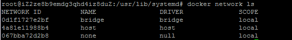


docker主机会有一个默认使用的桥接网卡bridge，它是在运行docker容器时，如果不指定网络，默认bridge

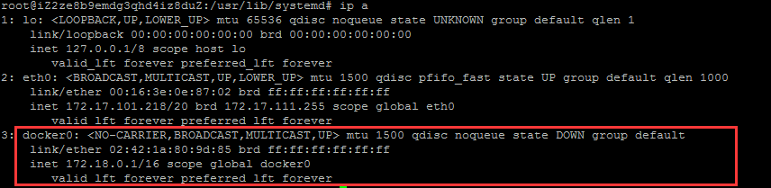


当运行一个容器时，我们可以看到在docker主机上多了一个网卡，而且master指向docker0

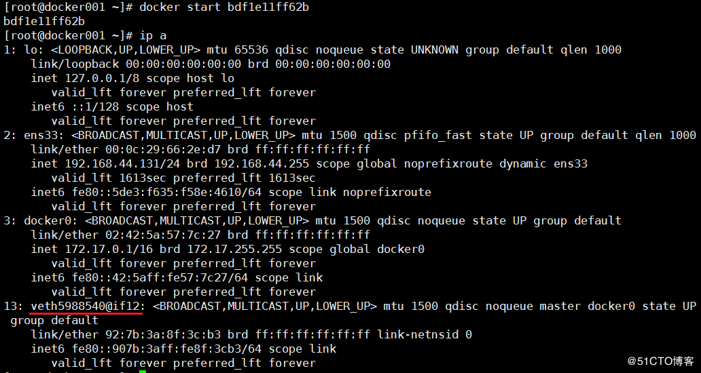


这时候我们在查看该容器的网络信息（ip地址和网关）。发现它的ip地址和docker0一个网段，网关则是docker0的地址

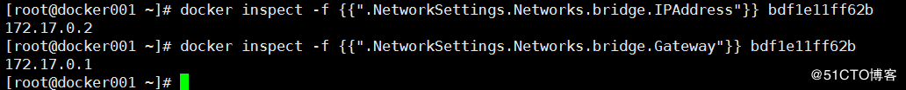


### 4.1.四种网络模式的特点

- bridge网络的特点

使用一个 linux bridge，默认为 docker0

使用veth 对，一头在容器的网络 namespace中，一头在docker0上

该模式下Docker Container不具有一个公有IP，因为宿主机的IP地址与veth pair的IP地址不在同一个网段内

Docker采用NAT方式，将容器内部的服务监听的端口与宿主机的某一个端口进行“绑定”，使得宿主机以外的世界可以主动将网络报文发送至容器内部

外界访问容器内的服务时，需要访问宿主机的 IP 以及宿主机的端口 port

NAT 模式由于是在三层网络上的实现手段，故肯定会影响网络的传输效率。

容器拥有独立、隔离的网络栈；让容器和宿主机以外的世界通过NAT建立通信

- host网络

Host模式并没有为容器创建一个隔离的网络环境。该模式下的Docker容器会和host宿主机共享同一个网络namespace，所以容器可以和宿主机一样，使用宿主机的eth0，实现和外界的通信。

特点：

这种模式下的容器没有隔离的network namespace

容器的IP地址同 Docker主机的IP地址

需要注意容器中服务的端口号不能与Docker主机上已经使用的端口号相冲突

host模式能够和其它模式共存

- None模式

网络模式为
none，即不为Docker容器构造任何网络环境，不会为容器创建网络接口，一旦Docker容器采用了none网络模式，那么容器内部就只能使用loop
back网络设备，不会再有其他的网络资源。

- Container共享模式

这个模式指定新创建的容器和已经存在的一个容器共享一个 Network
Namespace，而不是和宿主机共享。新创建的容器不会创建自己的网卡，配置自己的
IP，而是和一个指定的容器共享
IP、端口范围等。同样，两个容器除了网络方面，其他的如文件系统、进程列表等还是隔离的。两个容器的进程可以通过
lo 网卡设备通信。

### 4.2.切换网络模式

在运行镜像时指定网络：
```shell
docker run -itd --network [host|brige|none|container] --name ubuntu01 ubuntu:14.04
```

### 4.3.用户自定义网络
```shell
通过docker network create --driver network_type
```
network_name命令即可创建自定义网络。其中--driver后面支持的类型有三种：bridge、macvlan、overlay。

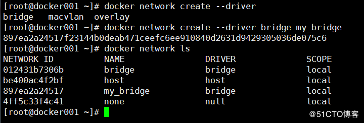


通过docker network inspect network_name可以查看该网络的信息

[root@docker001 ~]# docker network inspect my_bridge


```json
[
  {
    "Name": "my_bridge",
    "Id": "897ea2a24517f23144b0deab471ceefc6ee910840d2631d9429305036de075c6",
    "Created": "2018-08-19T15:16:25.49887066+08:00",
    "Scope": "local",
    "Driver": "bridge",
    "EnableIPv6": false,
    "IPAM": {
      "Driver": "default",
      "Options": {},
      "Config": [
        {
          "Subnet": "172.19.0.0/16",
          "Gateway": "172.19.0.1"
        }
      ]
    },
    "Internal": false,
    "Attachable": false,
    "Ingress": false,
    "ConfigFrom": {
      "Network": ""
    },
    "ConfigOnly": false,
    "Containers": {},
    "Options": {},
    "Labels": {}
  }
]
```


### 4.4.network管理命令的使用

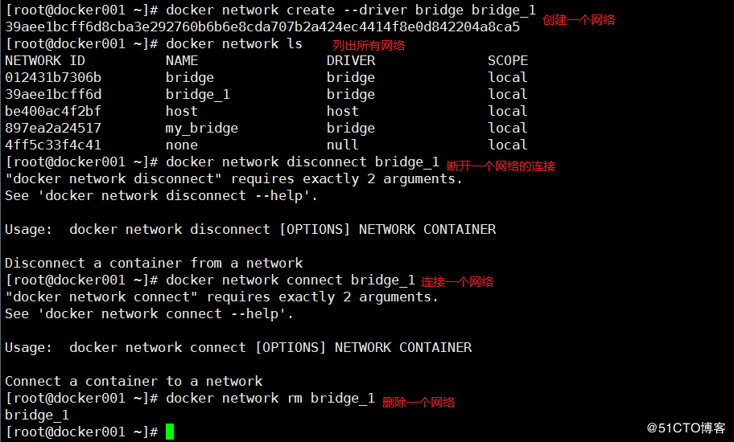


显示一个网络的信息（只截取了一部分）

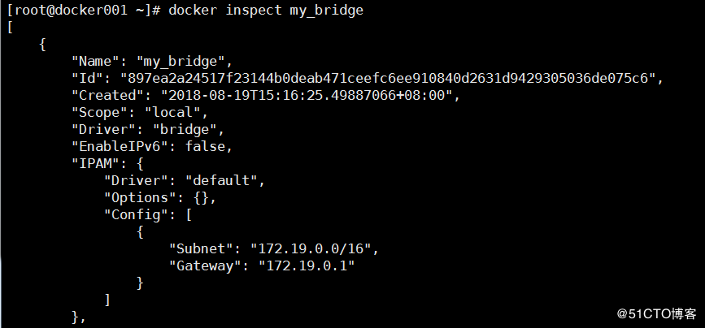


### 4.5.docker容器通信

### 4.6.【宿主内】

[https://www.cnblogs.com/soymilk2019/p/11553541.html](https://www.cnblogs.com/soymilk2019/p/11553541.html)

#### 4.6.1.【跨主机】基于实现方式的分类

- 隧道方案（Overlay Networking）：
    - Weave：UDP广播，本机建立新的BR，通过PCAP互通。
    - Open vSwitch(OVS)：基于VxLAN和GRE协议，但是性能方面损失比较严重。
    - Flannel：UDP广播，VxLan。

- 路由方案：
    - Calico：基于BGP协议的路由方案，支持很细致的ACL控制，对混合云亲和度比较高。
    - Macvlan：从逻辑和Kernel层来看隔离性和性能最优的方案，基于二层隔离，所以需要二层路由器支持，大多数云服务商不支持，所以混合云上比较难以实现。

#### 4.6.2.【跨主机】基于网络模型分类

- Docker Libnetwork Container Network Model(CNM)：
    - Docker Swarm overlay
    - Macvlan & IP network drivers
    - Calico
    - Contiv（from Cisco）

Docker Libnetwork 的优势就是原生，而且和Docker容器生命周期结合紧密；缺点也可以理解为是原生，被Docker“绑架”。

- Container Network Interface(CNI)：
    - Kubernetes
    - Weave
    - Macvlan
    - Flannel
    - Calico
    - Contiv
    - Mesos CNI

CNI的优势是兼容其他容器技术(e.g. rkt)及上层编排系统(Kuberneres & Mesos)，而且社区活

跃势头迅猛，Kubernetes加上CoreOS主推；缺点是非Docker原生。

#### 4.6.3.【案例】基于macvlan

docker 使用macvlan 实现独立ip，以及跨宿主通讯。定义网络

```shell
docker network create -d macvlan 
--subnet=192.168.1.0/24
--ip-range=192.168.1.0/24
--gateway=192.168.1.1
-o parent=ens33
my_macvlan 
```

## 5.案例

这里以redis为例子

### 5.1.下载redis镜像

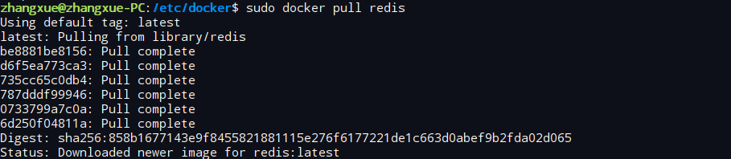


### 5.2.查看redis镜像

我去一个镜像80多兆。


### 5.3.简单启动
```shell
docker run --name some-redis -d redis
```

用docker inspect 容器id
可看到镜像的相关信息,直接用上述命令启动默认暴露6379端口,正常情况下都是不需要修改的

### 5.4.添加持久化仓库
```shell
docker run --name some-redis -d redis redis-server --appendonly yes
```

数据默认存储在VOLUME /data目录下,使用--volumes-from
some-volume-container 或者 -v /docker/host/dir:/data 可实现挂载

### 5.5.应用需要连接redis

```shell
docker run --name some-app --link some-redis:redis -d redis

或者

docker run -it --link some-redis:redis --rm redis redis-cli -h redis -p 6379
```

### 5.6.外部应用访问redis（常用）

```shell
sudo docker run -it -p 192.168.1.40:6379:6379 --name some-redis -d redis
redis-server --appendonly yes --requirepass pass123
```

### 5.7.dockerfile

如果想使用自己的配置文件启动redis,则在其基础上写一个dockerfile

```dockerfile
FROM redis
COPY redis.conf /usr/local/etc/redis/redis.conf
CMD [ "redis-server", "/usr/local/etc/redis/redis.conf" ]
```

或者在启动命令中修改配置

docker run -v /myredis/conf/redis.conf:/usr/local/etc/redis/redis.conf
--name myredis redis redis-server /usr/local/etc/redis/redis.conf

### 5.8.生成镜像

这里我们使用的是阿里云提供的私服

```shell
sudo docker commit -m "张雪的redis镜像" -a "tb518550_11" 79c761f627f3 tb518550_11/zx-redis:v1 registry.cn-beijing.aliyuncs.com/zx_base_service_img/zx_base_service_img:v1
```

如果生成的命名方式不对，需要使用命令重新修改。
```shell
docker tag <img_name>:<tag><host>/<project>/<repo>:<tag>

<img_name>:<tag> 是旧的的镜像名称和tag

<host>/<project>/<repo> 是下图里面的内容

最后的<tag>可有可无，默认是latest。这里我们写成v1
```

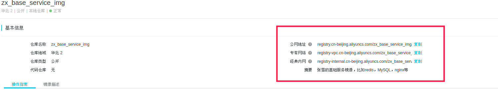


### 5.9.Push
```shell
docker push registry.cn-beijing.aliyuncs.com/zx_base_service_img/zx_base_service_img:v1
```

## 6.镜像仓库

默认pull镜像都是从官网的仓库：docker.io拉取。对于我们需要定制化镜像，需要频繁的构建、push、pull镜像，所以就需要使用国内的仓库或者自建仓库。

在/etc/docker/daemon.json文件（没有请自行创建）添加如下配置：

```shell
{
    "registry-mirrors" : [
      "https://registry.docker-cn.com",
      "https://fskvtob.mirror.aliyuncs.com",
      "https://docker.mirrors.ustc.edu.cn",
      "http://hub-mirror.c.163.com",
      "https://cr.console.aliyun.com/"
    ]
}
```


保存配置并重启

systemctl daemon-reload

systemctl restart docker

如果只是临时的从其他仓库下载镜像，可以在docker pull的时候指定镜像的全路径

docker pull your-registry-server/your/image/path

### 6.1.Docker国内镜像

DaoCloud - Docker加速器 https://account.daocloud.io

阿里云 - 开发者平台 https://dev.aliyun.com/search.html

微镜像 - 希云cSphere http://csphere.cn/hub/

镜像广场 - 时速云 https://hub.tenxcloud.com/

灵雀云 https://hub.alauda.cn/

网易蜂巢 https://www.163yun.com/?h=fc

### 6.2.阿里云Docker镜像

#### 6.2.1.注册使用

就是阿里云提供的一个基础服务，在进入服务的时候，会让你创建一个docker的服务账号，与docker hub的账号作用相同，用来管理自己的镜像。

比如我的账号是： tb518550_11

进入页面后还需要我们创建一个自己的docker仓库。比如下面的这个就是自己创建的仓库。

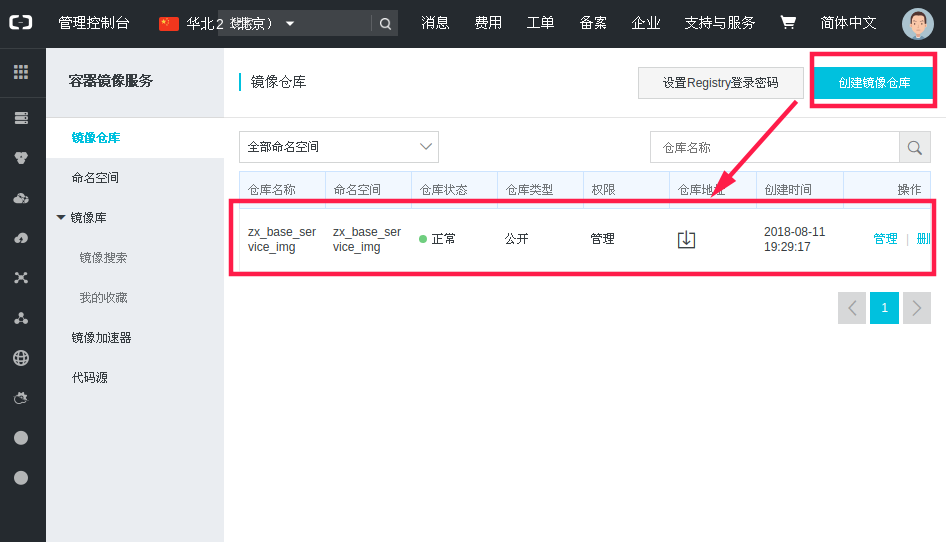


点击右边的管理，进入仓库的管理页面，这里会告诉我们一些基本的操作，比如登录进行，pull，push等。

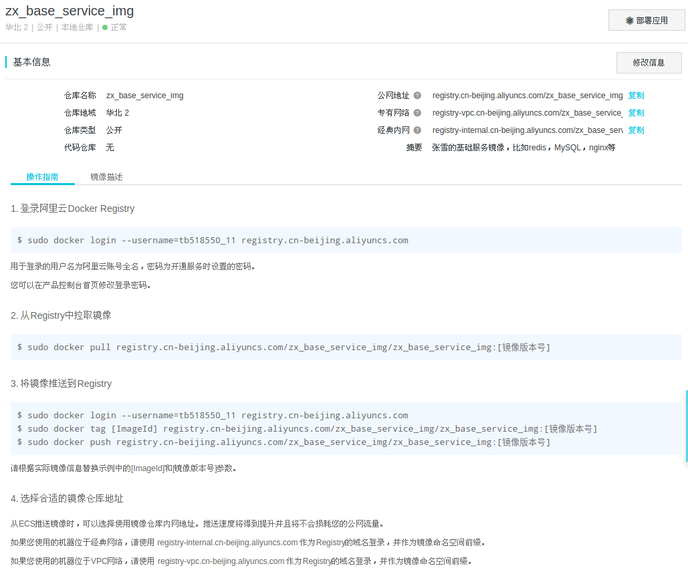


下面是我们尝试登录的界面。

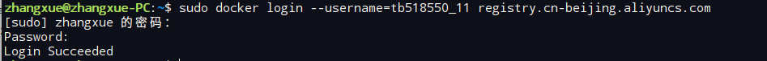


#### 6.2.2.基本操作

1.登录阿里云Docker Registry
```shell
$ sudo docker login --username=tb518550_11 registry.cn-beijing.aliyuncs.com
```

用于登录的用户名为阿里云账号全名，密码为开通服务时设置的密码。

您可以在产品控制台首页修改登录密码。

2.从Registry中拉取镜像

```shell
$ sudo docker pull registry.cn-beijing.aliyuncs.com/zx_base_service_img/zx_base_service_img:[镜像版本号]
```

3.将镜像推送到Registry

```shell

$ sudo docker login --username=tb518550_11 registry.cn-beijing.aliyuncs.com

$ sudo docker tag [ImageId] registry.cn-beijing.aliyuncs.com/zx_base_service_img/zx_base_service_img:[镜像版本号]

$ sudo docker push registry.cn-beijing.aliyuncs.com/zx_base_service_img/zx_base_service_img:[镜像版本号]

```

请根据实际镜像信息替换示例中的[ImageId]和[镜像版本号]参数。

4.选择合适的镜像仓库地址

从ECS推送镜像时，可以选择使用镜像仓库内网地址。推送速度将得到提升并且将不会损耗您的公网流量。

如果您使用的机器位于经典网络，请使用 registry-internal.cn-beijing.aliyuncs.com 作为Registry的域名登录，并作为镜像命名空间前缀。

如果您使用的机器位于VPC网络，请使用 registry-vpc.cn-beijing.aliyuncs.com 作为Registry的域名登录，并作为镜像命名空间前缀。

5.示例

使用"docker tag"命令重命名镜像，并将它通过专有网络地址推送至Registry。

```shell
$ sudo docker images

REPOSITORY TAG IMAGE ID CREATED VIRTUAL SIZE

registry.aliyuncs.com/acs/agent 0.7-dfb6816 37bb9c63c8b2 7 days ago 37.89 MB

$ sudo docker tag 37bb9c63c8b2 registry-vpc.cn-beijing.aliyuncs.com/acs/agent:0.7-dfb6816
```

使用"docker images"命令找到镜像，将该镜像名称中的域名部分变更为Registry专有网络地址。

```shell
$ sudo docker push registry-vpc.cn-beijing.aliyuncs.com/acs/agent:0.7-dfb6816
```

#### 6.2.3.Docker 镜像加速器

阿里云官方的加速器使用方法： https://yq.aliyun.com/articles/29941

我们使用Docker的第一步，应该是获取一个官方的镜像，例如mysql、wordpress，基于这些基础镜像我们可以开发自己个性化的应用。我们可以使用Docker命令行工具来下载官方镜像。

但是因为网络原因，我们下载一个300M的镜像需要很长的时间，甚至下载失败。因为这个原因，阿里云容器Hub服务提供了官方的镜像站点加速官方镜像的下载速度。

1.使用镜像加速器

在不同的系统下面，配置加速器的方式有一些不同，所以我们介绍主要的几个操作系统的配置方法。

关于加速器的地址，你只需要登录容器Hub服务的控制台，左侧的加速器帮助页面就会显示为你独立分配的加速地址。

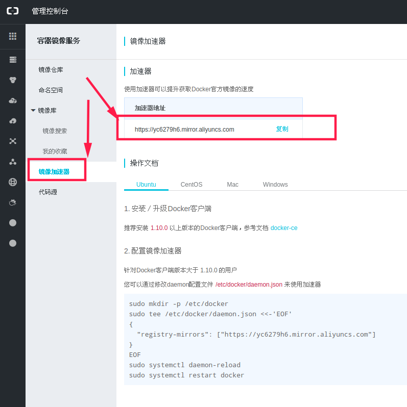


2.当你的docker版本较新时

当你下载安装的Docker Version不低于1.10时，建议直接通过daemon
config进行配置。

使用配置文件 /etc/docker/daemon.json（没有时新建该文件）

```json
{
  "registry-mirrors": ["<your accelerate address>"]
}
```

重启Docker Daemon就可以了。

sudo systemctl daemon-reload

sudo systemctl restart docker

### 6.3.手动配置Docker加速器

配置Docker加速器的本质就是把Docker配置文件中的镜像下载地址由默认的Docker
Hub地址变为国内镜像的加速地址。

/lib/systemd/system/docker.service

/etc/systemd/system/docker.service

例如：CentOS7

将如下内容加入到Docker配置文件/etc/sysconfig/docker，然后重启docker。

OPTIONS=--registry-mirror=http://abcd1234.m.daocloud.io

### 6.4.私有镜像仓库harbor

简单的安装教程：[https://blog.csdn.net/shawn210/article/details/98068165](https://blog.csdn.net/shawn210/article/details/98068165)

## 7.dockerFile

### 7.1. 基本说明

Dockfile是一个用于编写docker镜像生成过程的文件，其有特定的语法。在一个文件夹中，如果有一个名字为Dockfile的文件，其内容满足语法要求，在这个文件夹路径下执行命令:docker
build --tag name:tag
.，就可以按照描述构建一个镜像了。name是镜像的名称，tag是镜像的版本或者是标签号，不写就是lastest。注意后面有一个空格和点。

### 7.2.Dockfile语法

Dockerfile的基本指令有十三个，分别是：FROM、MAINTAINER、RUN、CMD、EXPOSE、ENV、ADD、COPY、ENTRYPOINT、VOLUME、USER、WORKDIR、ONBUILD。下面对这些指令的用法一一说明。

- FROM

用法：FROM <image>

说明：第一个指令必须是FROM了，其指定一个构建镜像的基础源镜像，如果本地没有就会从公共库中拉取，没有指定镜像的标签会使用默认的latest标签，可以出现多次，如果需要在一个Dockerfile中构建多个镜像。

- MAINTAINER

用法：MAINTAINER <name> <email>

说明：描述镜像的创建者，名称和邮箱

- RUN

用法：RUN "command" "param1" "param2"

说明：RUN命令是一个常用的命令，执行完成之后会成为一个新的镜像，这里也是指镜像的分层构建。一句RUN就是一层，也相当于一个版本。这就是之前说的缓存的原理。我们知道docker是镜像层是只读的，所以你如果第一句安装了软件，用完在后面一句删除是不可能的。所以这种情况要在一句RUN命令中完成，可以通过&符号连接多个RUN语句。RUN后面的必须是双引号不能是单引号（没引号貌似也不要紧），command是不会调用shell的，所以也不会继承相应变量，要查看输入RUN
"sh" "-c" "echo" "$HOME"，而不是RUN "echo" "$HOME"。

- CMD 容器启动命令

用法：CMD command param1 param2

说明：CMD在Dockerfile中只能出现一次，有多个，只有最后一个会有效。其作用是在启动容器的时候提供一个默认的命令项。如果用户执行docker
run的时候提供了命令项，就会覆盖掉这个命令。没提供就会使用构建时的命令。

- ENTRYPOINT 入口点

用法：ENTRYPOINT "command" "param1" "param2"

说明：这个命令和CMD命令一样，唯一的区别是不能被docker
run命令的执行命令覆盖，如果要覆盖需要带上选项--entrypoint，如果有多个选项，只有最后一个会生效。

- EXPOSE 暴露端口

用法：EXPOSE <port> [<port>...]

说明：告诉Docker服务器容器对外映射的容器端口号，在docker run
-p的时候生效。

- ENV设置环境变量

用法：EVN <key>=<value>允许一次设置多个

说明：设置容器的环境变量，可以让其后面的RUN命令使用，容器运行的时候这个变量也会保留。

- ARG 构建参数

格式：ARG <参数名>[=<默认值>]

构建参数和 ENV 的效果一样，都是设置环境变量。所不同的是，ARG
所设置的构建环境的环境变量，在将来容器运行时是不会存在这些环境变量的。但是不要因此就使用
ARG 保存密码之类的信息，因为 docker history 还是可以看到所有值的。

- COPY 复制文件

用法：COPY <src> <dest>

说明：COPY除了不能自动解压，也不能复制网络文件。其它功能和ADD相同。

- ADD高级的复制文件

用法：ADD <src> <dest>

说明：复制本机文件或目录或远程文件，添加到指定的容器目录，支持GO的正则模糊匹配。路径是绝对路径，不存在会自动创建。如果源是一个目录，只会复制目录下的内容，目录本身不会复制。ADD命令会将复制的压缩文件夹自动解压，这也是与COPY命令最大的不同。

- VOLUME 定义匿名卷

用法：VOLUME ["path"]

说明：在主机上创建一个挂载，挂载到容器的指定路径。docker run
-v命令也能完成这个操作，而且更强大。这个命令不能指定主机的需要挂载到容器的文件夹路径。但docker
run -v可以，而且其还可以挂载数据容器。

- USER 指定当前用户

用法：USER daemon

说明：指定运行容器时的用户名或UID，后续的RUN、CMD、ENTRYPOINT也会使用指定的用户运行命令。

- WORKDIR 指定工作目录

用法:WORKDIR path

说明：为RUN、CMD、ENTRYPOINT指令配置工作目录。可以使用多个WORKDIR指令，后续参数如果是相对路径，则会基于之前的命令指定的路径。如：WORKDIR
/home　　WORKDIR test
。最终的路径就是/home/test。path路径也可以是环境变量，比如有环境变量HOME=/home，WORKDIR $HOME/test也就是/home/test。

- ONBUILD

用法：ONBUILD [INSTRUCTION]

说明：配置当前所创建的镜像作为其它新创建镜像的基础镜像时，所执行的操作指令。意思就是，这个镜像创建后，如果其它镜像以这个镜像为基础，会先执行这个镜像的ONBUILD命令。

### 7.3.Dockerfile例子
一个使用安装包安装的tomcat例子：
```dockerfile
FROM centos
MAINTAINER nobody "xx@qq.com"
RUN mkdir -p /opt/jdk/
RUN mkdir -p /opt/tomcat/
ADD jdk1.7.0_79 /opt/jdk/
ADD tomcat  /opt/tomcat/
ENV CATALINA_HOME /opt/tomcat
ENV JAVA_HOME /opt/jdk
EXPOSE 8080
ENV PATH $PATH:$JAVA_HOME/bin
CMD ["/opt/tomcat/bin/catalina.sh","run"]

FROM openjdk:8-jdk-alpine

MAINTAINER "蒋超<chao.jiang@yooli.com>"

LABEL   Date="2019-07-26" \
        Subscribe="本次版本更新内容描述"
```


一个使用spring boot项目例子：
```dockerfile
#生产环境推荐为一个容器分配5G内存，本地测试环境视情况而定或忽略该参数
ARG JAVA_OPTS="-Xmx4g -Xms4g -Xmn2g"
ARG JVM_SERVER_OPTS="-XX:+DisableExplicitGC \
 -XX:+UseConcMarkSweepGC \
 -XX:+UseCMSInitiatingOccupancyOnly \
 -XX:CMSInitiatingOccupancyFraction=70 \
 -XX:+ExplicitGCInvokesConcurrentAndUnloadsClasses \
 -XX:+CMSClassUnloadingEnabled \
 -XX:+ParallelRefProcEnabled \
 -XX:+CMSScavengeBeforeRemark \
 -XX:+HeapDumpOnOutOfMemoryError \
 -XX:+PrintGCDetails \
 -XX:+PrintGCTimeStamps \
 -XX:+PrintHeapAtGC \
 -XX:+PrintGCApplicationStoppedTime \
 -XX:+PrintGCDateStamps"
ARG JVM_GC_LOG="-XX:ErrorFile=/var/app/gc/hs_err_pid%p.log -XX:HeapDumpPath=/var/app/gc"
ARG EXPOSE_PORT=8080
ARG LOG_ROOT_VOLUME
ARG PROJECT_ARTIFACTID
#环境变量
ENV JAVA_OPTS=$JAVA_OPTS
ENV JVM_GC_LOG=$JVM_GC_LOG
ENV JVM_SERVER_OPTS=$JVM_SERVER_OPTS
ENV LOG_VOLUME=$LOG_ROOT_VOLUME/$PROJECT_ARTIFACTID
ENV JAVA_SECURITY_EGD="-Djava.security.egd=file:/dev/./urandom -Dsession.timeout=3000"
#远程debug模式，默认端口为7474；启动参数引用该变量即可开启该模式
ENV REMOTE_DEBUG_MODEL="-Xdebug -Xrunjdwp:transport=dt_socket,server=y,suspend=n,address=7474"
ENV EXPOSE_PORT=$EXPOSE_PORT
#注意：这个环境变量打开的话，项目配置的端口就会 被pom中传递过来的EXPOSE_PORT覆盖
ENV SERVER_PORT=$EXPOSE_PORT
#指定时区
ENV TZ=Asia/Shanghai
RUN ln -snf /usr/share/zoneinfo/$TZ /etc/localtime && echo $TZ > /etc/timezone

#将服务的日志保存至宿主机的匿名存储卷；
#如果想指明存储卷的位置，应在容器启动时通过-v hostDir:containerDir指定
VOLUME $LOG_VOLUME
VOLUME /var/app/gc

#指定容器的工作目录，必须在ADD指令之前！
WORKDIR /workDir

#如需指明映射的主机端口号，可在容器启动时通过-p hostPort:containerPort指定
EXPOSE $EXPOSE_PORT 7474

#指定需要制作成镜像的jar包
ARG JAR_FILE
ADD $JAR_FILE app.jar

ENTRYPOINT ["sh","-c","java $JAVA_OPTS $JVM_SERVER_OPTS $JVM_GC_LOG $JAVA_SECURITY_EGD -jar app.jar"]
```

### 7.4.运行spring boot

依赖镜像如下: java:8u111

依赖组件: maven

#### 7.4.1.创建一个spring boot项目

添加pom依赖
```xml
<properties>
    <project.build.sourceEncoding>UTF-8</project.build.sourceEncoding>
    <project.reporting.outputEncoding>UTF-8</project.reporting.outputEncoding>
    <docker.image.prefix>springboot</docker.image.prefix><!-- 在 pom.xml和properties中添加 Docker 镜像名称 -->
    <java.version>1.8</java.version>
</properties>

<dependencies>
    <dependency>
        <groupId>org.springframework.boot</groupId>
        <artifactId>spring-boot-starter-web</artifactId>
    </dependency>

    <dependency>
        <groupId>org.springframework.boot</groupId>
        <artifactId>spring-boot-starter-test</artifactId>
        <scope>test</scope>
    </dependency>
</dependencies>

<build>
    <finalName>spring-boot-demo</finalName>
    <plugins>
        <plugin>
            <groupId>org.springframework.boot</groupId>
            <artifactId>spring-boot-maven-plugin</artifactId>
        </plugin>
        <!-- Docker maven plugin -->
        <plugin>
            <groupId>com.spotify</groupId>
            <artifactId>docker-maven-plugin</artifactId>
            <version>1.0.0</version>
            <configuration>
                <imageName>${docker.image.prefix}/${project.artifactId}</imageName>
                <dockerDirectory>src/main/docker</dockerDirectory>
                <resources>
                    <resource>
                        <targetPath>/</targetPath>
                        <directory>${project.build.directory}</directory>
                        <include>${project.build.finalName}.jar</include>
                    </resource>
                </resources>
            </configuration>
        </plugin>
        <!-- Docker maven plugin -->
    </plugins>
</build>
```

#### 7.4.2.创建controller

```java
@RestController
public class DockerController {
  @RequestMapping("/")
  public String index() {
    return "Hello Docker!";
  }
}
```

#### 7.4.3.编写dockerfile

在目录src/main/docker下创建 Dockerfile 文件，Dockerfile 文件用来说明如何来构建镜像。
```shell
FROM java:8u111
VOLUME /tmp
ADD spring-boot-demo.jar app.jar
ENTRYPOINT ["java","-Djava.security.egd=file:/dev/./urandom","-jar","/app.jar"]
```

这个 Dockerfile 文件很简单，构建 Jdk 基础环境，添加 Spring Boot Jar 到镜像中，简单解释一下:

FROM ，表示使用 Jdk8 环境 为基础镜像，如果镜像不是本地的会从 DockerHub 进行下载

VOLUME ，VOLUME 指向了一个/tmp的目录，由于 Spring Boot 使用内置的Tomcat容器，Tomcat 默认使用/tmp作为工作目录。
这个命令的效果是：在宿主机的/var/lib/docker目录下创建一个临时文件并把它链接到容器中的/tmp目录

ADD ，拷贝文件并且重命名

ENTRYPOINT ，为了缩短 Tomcat 的启动时间，添加java.security.egd的系统属性指向/dev/urandom作为 ENTRYPOINT

这样 Spring Boot 项目添加 Docker 依赖就完成了。

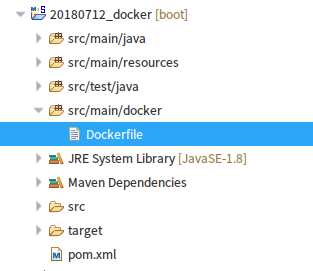

#### 7.4.4.使用 Docker 部署 Spring Boot 项目

```shell
#打包
mvn package

#启动
java -jar target/spring-boot-demo.jar

看到 Spring Boot 的启动日志后表明环境配置没有问题

#使用 DockerFile 构建镜像。
# 方式1：这个选择的是使用maven的插件构建镜像，但是这样就造成了容器和项目的耦合，非常不好
mvn package docker:build
# 方式2：使用docker命令

# 2.构建镜像 /usr/local/data 目录下有dockerfile，可以自动化进行构建镜像。
# 这种方式可以通过通用dockerfile模板，动态生成DockerFile，与项目解耦
docker build -t public/my_project:1.0 /usr/local/data

# 3.对本地镜像创建tag
docker tag 1319b1eaa0b7 192.168.3.101:9010/public/my_project:1.0

# 4.推送仓库
docker push 192.168.3.101:9010/public/my_project:1.0

# 5.移除已经运行的容器
docker rm -f my_project

# 6.运行新容器
docker run -d -p 8080:8080 --name=my_project public/my_project:1.0
```

第一次构建可能有点慢，当看到以下内容的时候表明构建成功：

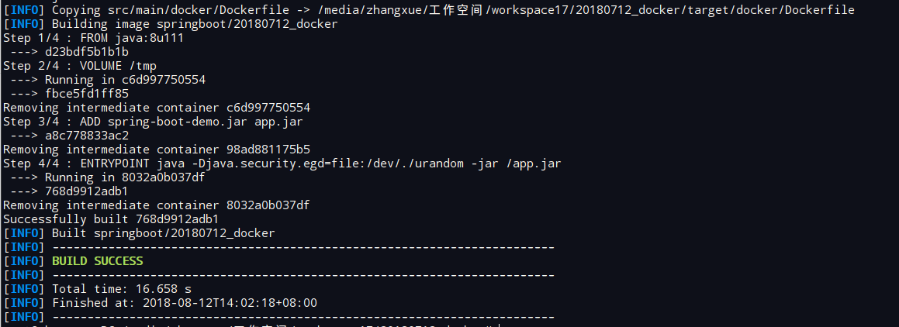

这里我们就可以看到镜像，这里是因为我们使用的是完整的JDK所以镜像文件很大，所以我们推荐使用较小的jre去启动。镜像文件不会超过200M。

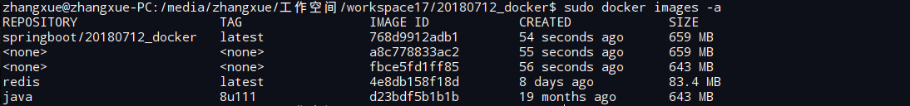


#### 7.4.5.启动服务

docker run -p 8080:8080 -t springboot/spring-boot-docker

启动之后我们查看容器，端口的8080

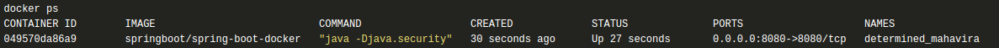


我们访问 127.0.0.1:8080,返回文字Hello Docker!。表示完成

## 8.Docker客户端工具

[https://zhuanlan.zhihu.com/p/343550244](https://zhuanlan.zhihu.com/p/343550244)

[https://blog.csdn.net/H176Nhx7/article/details/122504730](https://blog.csdn.net/H176Nhx7/article/details/122504730)

portainer教程：https://www.cnblogs.com/xianz666/p/14275394.html


### 8.1.docker compose

docker的简化工具：

```shell
下载：       curl -L https://get.daocloud.io/docker/compose/releases/download/v2.4.1/docker-compose-`uname -s`-`uname -m` > /usr/local/bin/docker-compose
将可执行权限应用于二进制文件：sudo chmod +x /usr/local/bin/docker-compose  
创建软链：       sudo ln -s /usr/local/bin/docker-compose /usr/bin/docker-compose
查看版本：       docker-compose version
```

## 9.Docker api

官方文档：[https://docs.docker.com/engine/api/](https://docs.docker.com/engine/api/)

Docker 开放API使用(创建容器/启动容器/停止容器/删除容器

[https://blog.csdn.net/weixin_40049583/article/details/104108246](https://blog.csdn.net/weixin_40049583/article/details/104108246)

[@jshd_SG11_32_22 odin]# docker version
```text
Client: Docker Engine - Community ## docker client 信息
Version: 19.03.6 ## doccker 版本
API version: 1.40 ## api 版本
Go version: go1.12.16 ## docker 源码 go 版本
Git commit: 369ce74a3c
Built: Thu Feb 13 01:24:49 2020
OS/Arch: linux/amd64
Experimental: false
Server: Docker Engine - Community ## docker server 信息
Engine:
Version: 19.03.6
API version: 1.40 (minimum version 1.12)
Go version: go1.12.16
Git commit: 369ce74a3c
Built: Thu Feb 13 01:32:22 2020
OS/Arch: linux/amd64
Experimental: false
containerd:
Version: v1.2.12
GitCommit: 35bd7a5f69c13e1563af8a93431411cd9ecf5021
runc:
Version: 1.0.0-rc6+dev
GitCommit: 6635b4f0c6af3810594d2770f662f34ddc15b40d
docker-init:
Version: 0.18.0
GitCommit: fec3683
```

### 9.1.Docker cli 实现原理

源码解析： [https://blog.csdn.net/goose_flesh/article/details/83892246](https://blog.csdn.net/goose_flesh/article/details/83892246)

### 9.2.Java docker client

docker-java项目： [https://github.com/docker-java/docker-java](https://github.com/docker-java/docker-java)

AbstrSyncDockerCmdExec 有多种实现类型，封装了各种docker操作

比如创建容器：

URL        /containers/create  
命令执行   CreateContainerCmdExec   
命令参数   CreateContainerCmdImpl  

参考：[https://www.jianshu.com/p/f28a04e4e5b6](https://www.jianshu.com/p/f28a04e4e5b6)

## 10.常见问题

<p style="color: red">chown: changing ownership of : Permission denied</p>

启动失败。查看日志报这个错误。这是因为Centos7安全Selinux禁止了一些安全权限

解决方案有三个【任选一个即可】：
- 在docker run中加入 --privileged=true 给容器加上特定权限
- 关闭selinux

临时关闭
[root@localhost ~]# getenforce
Enforcing

[root@localhost ~]# setenforce 0
[root@localhost ~]# getenforce
Permissive

永久关闭：
[root@localhost ~]# vim /etc/sysconfig/selinux
SELINUX=enforcing 改为 SELINUX=disabled
- 在selinux添加规则，修改挂载目录

<p style="color: red">WARNING: IPv4 forwarding is disabled. Networking will not work.</p>

本地没有配置网络转发导致：
    
vim /etc/sysctl.conf

```properties
#配置转发
net.ipv4.ip_forward=1

#重启服务，让配置生效
systemctl restart network

#查看是否成功,如果返回为“net.ipv4.ip_forward = 1”则表示成功
sysctl net.ipv4.ip_forward
```
