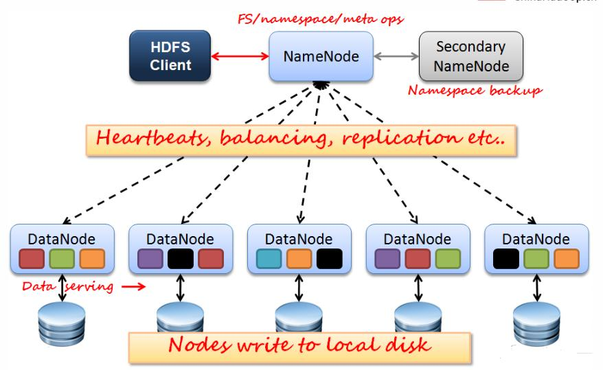
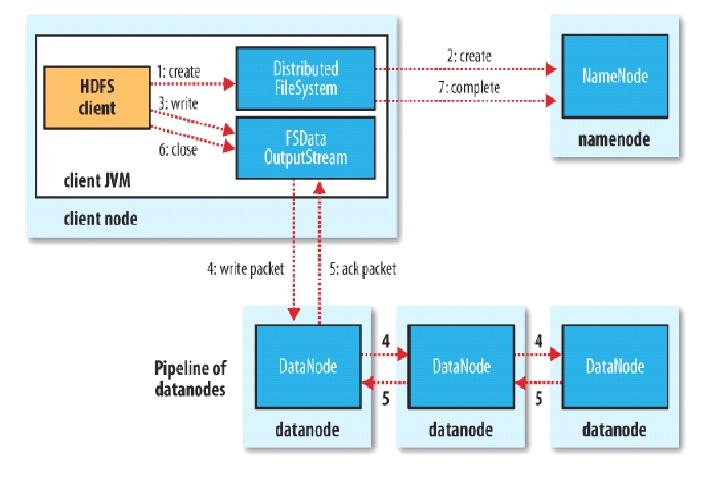
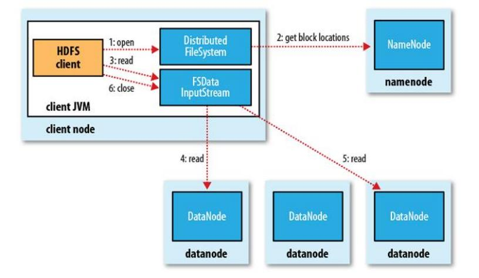
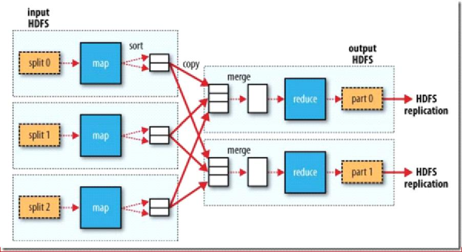
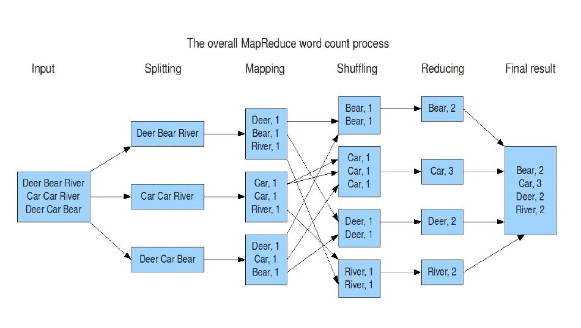
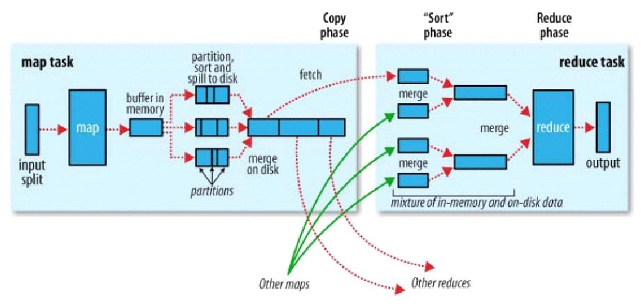
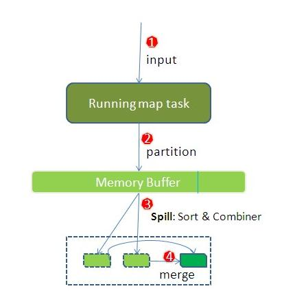
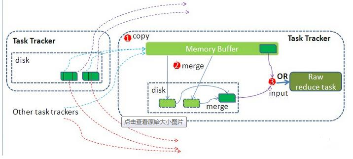
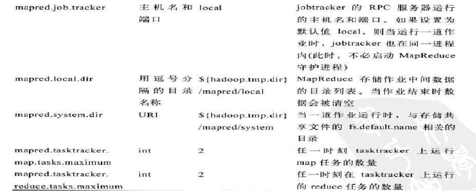
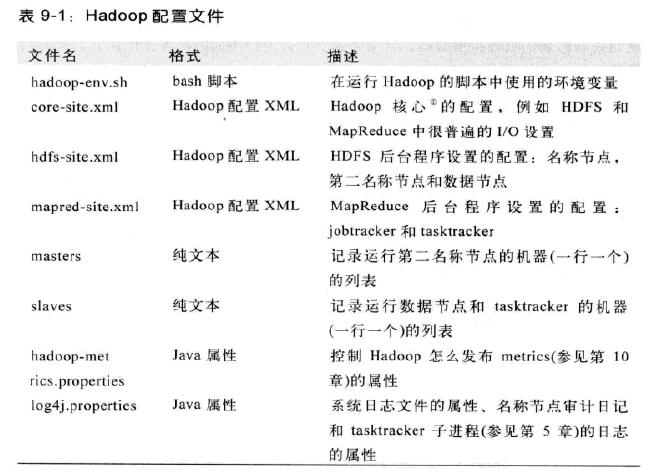

# hadoop

## 1.介绍

1.Hadoop的思想之源：Google

面对的数据和计算难题：
-  大量的网页怎么存储
-  搜索算法

带给我们的关键技术和思想：
-  GFS
-  Map-Reduce
-  BigTable

2.Hadoop创始人

Hadoop作者Doug cutting，就职Yahoo期间开发了Hadoop项目，以儿子的玩具大象命名（Lucene以他的情人名字命名）。

3.发展过程

（1）2003-2004年，Google公开了部分GFS和Mapreduce思想的细节，以此为基础Doug Cutting等人用了2年业余时间实现了DFS和Mapreduce机制，一个微缩版：Nutch

（2）Hadoop 于 2005 年秋天作为 Lucene的子项目 Nutch（爬虫工具）的一部分正式引入Apache基金会。
   2006 年 3 月份，Map-Reduce 和 Nutch Distributed File System (NDFS) 分别被纳入称为 Hadoop 的项目中。

4.Hadoop核心组件

（1）分布式存储系统HDFS （Hadoop Distributed File System ）
— 分布式存储系统
— 提供了高可靠性、高扩展性和高吞吐率的数据存储服务

（2）分布式计算框架MapReduce
— 分布式计算框架
— 具有 易于编程、高容错性和高扩展性等优点。

5.Hadoop、Spark、Strom的区别

- Hadoop适合于离线的批量数据处理适用于对实时性要求极低的场景
- Storm适合于实时流数据处理，实时性方面做得极好
- Spark是内存分布式计算框架，试图吞并hadoop的Map-Reduce批处理框架和Storm的流处理框架，
但是Spark已经做得很不错了，批处理方面性能优于Map-Reduce，但是流处理目前还是弱于Storm，产品仍在改进之中

## 2.分布式文件系统HDFS

### 2.1.HDFS优点

1.高容错性
- 数据自动保存多个副本
- 副本丢失后，自动恢复

2.适合批处理
- 移动计算而非数据
- 数据位置暴露给计算框架

3.适合大数据处理
- GB 、TB 、甚至PB 级数据
- 百万规模以上的文件数量
- 10K+ 节点

4.可构建在廉价机器上
- 通过多副本提高可靠性
- 提供了容错和恢复机制

### 2.2.HDFS缺点

1.低延迟数据访问
- 比如毫秒级
- 低延迟与高吞吐率

2.小文件存取
- 占用NameNode 大量内存
- 寻道时间超过读取时间

3.并发写入、文件随机修改
- 一个文件只能有一个写者
- 仅支持append

### 2.3.hdfs系统组成

1.NameNode（NN）：主要功能是接受客户端的读写服务

- NameNode保存metadata信息包括
   - 文件owership和permissions
   - 文件包含哪些块
   - Block保存在哪个DataNode（由DataNode启动时上报）
   
- NameNode的metadata信息在启动后会加载到内存
   - metadata存储到磁盘文件名为”fsimage”
   - Block的位置信息不会保存到fsimage
   - edits记录对metadata的操作日志

2.DataNode（DN）：
-  存储数据（Block）
-  启动DN线程的时候会向NN汇报block信息
-  通过向NN发送心跳保持与其联系（3秒一次），如果NN 10分钟没有收到DN的心跳，
则认为其已经lost，并copy其上的block到其它DN

3.SecondaryNameNode（SNN）：（一般与NameNode是不同的物理机）
- 它不是NN的备份（但可以做备份），它的主要工作是帮助NN合并edits log，减少NN启动时间。
- SNN执行合并时机
   - 根据配置文件设置的时间间隔fs.checkpoint.period 默认3600秒
   - 根据配置文件设置edits log大小 fs.checkpoint.size 规定edits文件的最大值默认是64MB

4.Block： 数据存储单元
- 文件被切分成固定大小的数据块
   - 默认数据块大小为64MB（Hadoop 1.x是64M，Hadoop 2.x是128M），可配置
   - 若文件大小不到64MB ，则单独存成一个block
- 一个文件存储方式
   - 按大小被切分成若干个block ，存储到不同节点上
   - 默认情况下每个block都有三个副本
-  Block大小和副本数通过Client端上传文件时设置，文件上传成功后副本
   - 数可以变更，Block Size不可变更




Block的副本放置策略
-  第一个副本：放置在上传文件的DN；
如果是集群外提交，则随机挑选一台
磁盘不太满，CPU不太忙的节点。
-  第二个副本：放置在于第一个副本不同的 机架的节点上。
-  第三个副本：与第二个副本相同机架的节点。
-  更多副本：随机节点

### 2.4.hdfs数据读写流程

1.写流程

第一步：这里比如使用Java代码进行文件上传。首先是创建一个HDFSClient对象，open一个对HDFS的访问session。

第二步：client从NameNode获得DataNode中最清闲。

第三步：将文件通过流写入文件系统比如：/input/斗破苍穹.txt。（hdfs自动进行副本）

第四步：DataNode与NameNode之间进行心跳测试，NameNode记录DataNode和block的相关信息。

第五步：关闭session。



2.读流程

第一步：这里比如使用Java代码读取，首先是创建一个HDFSClient对象，open一个对HDFS的访问session。

第二步：比如这里想要读取文件系统中的：/input/斗破苍穹.txt文件，client向NameNode发出请求。
    NameNode 这里返回的其实是DataNode中Block的路径。

第三步：client根据返回的block路径，首先获得保存这个文件所有副本的DataNode，比较DataNode的使用情况，
    选择最清闲的DataNode，作为读取Block的DataNode。

第四步：关闭session。



### 2.5.hdfs文件读写权限

-  与Linux文件权限类似
- r: read; w:write; x:execute，权限x对于文件忽略，对于文件夹表示是否允许访问其内容
-  如果Linux系统用户zhangsan使用hadoop命令创建一个文件，那么这个文件在HDFS中owner就是zhangsan。
-  HDFS的权限目的：阻止好人错错事，而不是阻止坏人做坏事。HDFS相信，你告诉我你是谁，我就认为你是谁。

### 2.6.安全模式
-  namenode启动的时候，首先将映像文件(fsimage)载入内存，并执行编辑日志(edits)中的各项操作。
-  一旦在内存中成功建立文件系统元数据的映射，则创建一个新的fsimage文件(这个操作不需要SecondaryNameNode)和一个空的编辑日志。
-  此刻namenode运行在安全模式。即namenode的文件系统对于客服端来说是只读的。(显示目录，显示文件内容等。写、删除、重命名都会失败)。
-  在此阶段Namenode收集各个datanode的报告，当数据块达到最小副本数以上时，会被认为是“安全”的， 在一定比例（可设置）的数据块被确定为“安全”后，再过若干时间，安全模式结束
-  当检测到副本数不足的数据块时，该块会被复制直到达到最小副本数，系统中数据块的位置并不是由namenode维护的，而是以块列表形式存储在datanode中。

### 2.7. HDFS安装
1.版本

分为3个系列：0.x系列、1.x系列、2.x系列（现在的主流）
搭建Hadoop相关的大数据平台的时候，一定要到官网关注Hadoop、hbase、hive、jdk之间的兼容性。

2.安装方式
-  伪分布式安装
-  完全分布式安装（参考hadoop 2.x安装手）
- 下载（http://apache.fayea.com/hadoop/common/）

hadoop2.5之后的Hadoop都是64位的，之前的都是32位的，但是官方又不说。
- 解压
- 检查java和ssh的免密码登陆
- 修改core-site.xml
- 修改hdfs-site.xml
- 修改masters文件和slaves文件
- 格式化namenode
- Start-hdfs.sh启动

## 3.Hadoop分布式计算框架MR
### 3.1. 介绍
   分布式计算框架MapReduce，是hadoop的两大核心组件之一。
   底层依赖于HDFS的分布式文件系统，分布式计算每个节点上的数据。（即计算的时候，只计算自己节点上的数据，并将结果整合给master）

### 3.2. 处理流程
   1.将需要处理的数据（指的是block块）split成若干个map。
   2.sort（排序）或sjiffling（洗牌）后，处理数据，一个map获得一个结果
   3.将结果复制给master，进行merge（结果数据文件合并）
   4.reduce（归纳）计算的结果，获得最终的结果part
   5.将结果输出到HDFS



案例：



### 3.3. Mapper
-  Map-reduce的思想就是“分而治之”
    - Mapper负责“分”，即把复杂的任务分解为若干个“简单的任务”执行
    
-  “简单的任务”有几个含义：
    - 数据或计算规模相对于原任务要大大缩小；
    - 就近计算，即会被分配到存放了所需数据的节点进行计算；
    - 这些小任务可以并行计算，彼此间几乎没有依赖关系

### 3.4. Reducer
-  对map阶段的结果进行汇总。
-  Reducer的数目由mapred-site.xml配置文件里的项目mapred.reduce.tasks决定。

缺省值为1，用户可以在Java代码中覆盖。

### 3.5. Shuffler
-  在mapper和reducer中间的一个步骤
-  可以把mapper的输出按照某种key值重新切分和组合成n份，把key值符合某种范围的输出送到特定的                                                                    reducer那里去处理
-  可以简化reducer过程
（也就是对map输出的数据进行分组、排序、合并、分区、拷贝）

下图是shuffler的流程图：



步骤：
1. 每个map task都有一个内存缓冲区（默认是100MB），存储着map的输出结果
2. 当缓冲区快满的时候需要将缓冲区的数据以一个临时文件的方式存放到磁盘（Spill）
3. 溢写是由单独线程来完成，不影响往缓冲区写map结果的线程（spill.percent，默认是0.8）
4. 当溢写线程启动后，需要对这80MB空间内的key做排序(Sort)



假如client设置过Combiner，那么现在就是使用Combiner的时候了。将有相同key的key/value对的value加起来，减少溢写到磁盘的数据量。（reduce1，word1，[8]）。

当整个map task结束后再对磁盘中这个map task产生的所有临时文件做合并（Merge），对于“word1”就是像这样的：{“word1”, [5, 8, 2, …]},假如有Combiner,{word1 [15]}，最终产生一个文件。

reduce 从tasktracker copy数据，copy过来的数据会先放入内存缓冲区中，这里的缓冲区大小要比map端的更为灵活，它基于JVM的heap size设置

merge有三种形式：1)内存到内存 2)内存到磁盘 3)磁盘到磁盘。merge从不同tasktracker上拿到的数据， {word1 [15，17，2]}



### 3.6. MapReduce的 Split大小
-  max.split(100M)
-  min.split(10M)
-  block(1.x 64M， 2.X 128M)

计算split的大小：max(min.split,min(max.split,block))

例如： max(10, min(100, 64)) = 64M， max(10, min(100, 128)) = 128M

### 3.7. 架构（一主多从架构）
- 主 JobTracker:
    - 负责调度分配每一个子任务task运行于TaskTracker上，如果发现有失败的task就重新分配其任务到其他节点。每一个hadoop集群中只一个 JobTracker,一般它运行在Master节点上。

- 从TaskTracker:
    - TaskTracker主动与JobTracker通信，接收作业，并负责直接执行每一个任务，为了减少网络带宽TaskTracker最好运行在HDFS的DataNode上

### 3.8. 安装

Mapred-size.xml






### 3.9. 开发

hadoop中 

输入的key默认是split的下标索引，输入值为字符串

输出的key这里是字符串，输出的值是次数为整数

在hadoop中，长整数字使用LongWritable，整数使用IntWritable，字符串使用Text

案例一：统计单词出现次数
参考案例中的com.mr.wc下三个类。

### 3.10. 运行

1.增加环境变量hadoop的执行用户：System.setProperty("HADOOP_USER_NAME",  "root");（防止上传失败） 
   
2.MR执行环境有两种：本地测试环境，服务器环境

本地测试环境(windows)：在windows的hadoop目录bin目录有一个winutils.exe
- 在windows下配置hadoop的环境变量
- 拷贝debug工具(winutils.exe)到HADOOP_HOME/bin
- 修改hadoop的源码 ，注意：确保项目的lib需要真实安装的jdk的lib
- MR调用的代码需要改变：
    - src不能有服务器的hadoop配置文件
    - 在调用是使用：

```java
Configuration config = new  Configuration();
config.set("fs.defaultFS", "hdfs://node7:8020");
config.set("yarn.resourcemanager.hostname", "node7");
```

服务器环境：首先需要在src下放置服务器上的hadoop配置文件
- 在本地直接调用，执行过程在服务器上（真正企业运行环境）
    - 把MR程序打包（jar），直接放到本地
    - 修改hadoop的源码 ，注意：确保项目的lib需要真实安装的jdk的lib
    - 增加一个属性：config.set("mapred.jar", "C:\\Users\\Administrator\\Desktop\\wc.jar");
    - 本地执行main方法，servlet调用MR。
- 直接在服务器上，使用命令的方式调用，执行过程也在服务器上
    - 把MR程序打包（jar），传送到服务器上
    - 通过： hadoop jar jar路径  类的全限定名

## 4.Hadoop体系架构


## 5.Hadoop安装

### 5.1.软件

系统：Ubuntu  32位

Apache Hadoop: 2.5.0  32位（hadoop2.5之后的Hadoop都是64位的，之前的都是32位的，但是官方又不说，我们这里使用的是用ant在32位环境下自己重新编译的，这个过程非常慢）

Jdk:  1.7.0_75  32位

### 5.2.安装规划

安装到Hadoop用户下：/home/zhangxue/hadoop

jdk和Hadoop都是用的是这个用户下的环境变量，不作为系统变量。

### 5.3.创建用户账号

```shell
groupadd hadoop   #添加hadoop用户组
useradd -g hadoop hadoop  #添加hadoop用户并添加到hadoop组中
passwd hadoop  #为hadoop用户设置密码
```

### 5.4.安装JDK
```shell
cd /home/zhangxue/       			#进入到软件包目录
tar -zxvf jdk-7u75-linux-i586.tar.gz   	#解压jdk tar包
mv jdk1.7.0_75/   jdk1.7			#修改文件夹名称
vi  /home/zhangxue/.profile  		
#配置环境变量，在文件最后添加如下配置

export JAVA_HOME=/home/zhangxue/jdk1.7
export JAVA_BIN=/home/zhangxue/jdk1.7/bin
export PATH=$PATH:$JAVA_HOME/bin
export CLASSPATH=.:$JAVA_HOME/lib/dt.jar:$JAVA_HOME/lib/tools.jar
export JAVA_HOME JAVA_BIN PATH CLASSPATH


#使环境变量立即生效
source	/home/zhangxue/.profile
#检查配置
java -version  					
```

### 5.5.安装Hadoop
```shell
cd /home/zhangxue/       			#进入到软件包目录
tar -zxvf hadoop-2.5.0.tar.gz 		 #解压tar包
chown -R hadoop:hadoop hadoop-2.5.0  #修改用户和组
vi  /home/zhangxue/.profile  		


#配置环境变量，在文件最后添加如下配置
export HADOOP_HOME=/home/zhangxue/hadoop-2.5.0
export HADOOP_PREFIX=/home/zhangxue/hadoop-2.5.0  
export YARN_CONF_DIR=/home/zhangxue/hadoop-2.5.0
export HADOOP_COMMON_LIB_NATIVE_DIR=$HADOOP_PREFIX/lib/native
export HADOOP_OPTS="-Djava.library.path=$HADOOP_PREFIX/lib"  
export PATH=$PATH:$HADOOP_HOME/bin:$HADOOP_PREFIX/bin

#使环境变量立即生效
source	/home/zhangxue/.profile

#检查配置
hadoop version  					
```

### 5.6.配置ssh免密登录
```text
以下两种方式任选其一。
（1）dsa加密方式
cd /home/zhangxue/       			#进入到软件包目录
 ssh-keygen -t dsa -P '' -f ~/.ssh/id_dsa
 cat ~/.ssh/id_dsa.pub >> ~/.ssh/authorized_keys
 chmod 644 authorized_keys 		 #权限修改为rw-r-r

（2）rsa加密方式
1.ssh-keygen -t rsa			
2.cd .ssh
3.cp id_rsa.pub authorized_keys
4.将authorized_keys的内容相互复制到其他的的authorized_keys中
```

### 5.7.配置hdfs

配置文件在hadoop-2.5.0/etc/hadoop下

（1）hadoop-env.sh:
```shell
#显式配置JAVA_HOME，而非使用JAVA_HOME=${JAVA_HOME}
export JAVA_HOME=/usr/java/jdk1.7.0_75
```

（2）core-site.xml

```xml
<property>					    <!--指定文件系统的主机和端口-->
    <name>fs.defaultFS</name>   <!--localhost为本地使用，如果做开发应配置为固定ip-->
    <value>hdfs://localhost:9000</value>
</property>
    <!--指定文件系统临时文件路径默认存储在/tmp/hadoop-hadoop/dfs/name目录下，
    清空缓存时，集群数据丢失，且无法重建，后果非常严重-->
<property>
<name>hadoop.tmp.dir</name>
<value>/home/zhangxue/hadoop/hadoop-master/temp</value>
</property>

```

（3）hdfs-site.xml

```xml
<!--指定文件系统文件冗余的数量（即副本的数量），分布式推荐3，伪分布式为1-->
<property> 					
    <name>dfs.replication</name>
    <value>1</value>
</property>
        
<!--指定namenode文件的路径-->
<property> 					
    <name>dfs.namenode.name.dir</name>
    <value>file:/home/zhangxue/hadoop/hadoop-master/hdfs/name</value>
</property>

<!--指定datanode数据文件的路径-->
<property>					
    <name>dfs.datanode.data.dir</name>
    <value>file:/home/zhangxue/hadoop/hadoop-master/hdfs/data</value>
</property>
```


（4）mapred-site.xml，伪分布式不用

```xml
<configuration>
    <property>
        <name>mapred.job.tracker</name>
        <value>192.168.159.128:9001</value>
    </property>
</configuration>
```

（5）master文件，伪分布式不用

master或主节点ip

（6）slaves文件，伪分布式不用

- node1或子节点ip
- node2或子节点ip
- node3或子节点ip


### 5.8.格式化文件系统

格式化操作一定要在所有的环境配置完成后进行,否则就需要删除所有的格式化信息重新格式化
```shell
#格式化操作会给整个文件系统namenode、datanode、secondnamenode等信息。
hdfs namenode -format  
```

### 5.9.启动namenode和datanode守护进程

```shell
$ ./sbin/start-dfs.sh   				#启动hdfs
$ jps   							#进程查看
masert:出现4个
5722 	JobTracker
5503 	NameNode
5657	SecondaryNameNode
5821	Jps

node:出现3个
5437 	DataNode
5503 	TaskTracker
5821	Jps
```

### 5.10.访问管理页面

```shell
http://localhost:50070				#namenode 管理页面
http://localhost:8088				#任务日志界面
```

### 5.11.启动yarn

（1）mapred-site.xml

```xml
<!--local:本地作业运行器  classic:经典mapreduce框架  yarn:新框架-->
<property>   
    <name>mapreduce.framework.name</name>
    <value>yarn</value>
</property>
```

（2）yarn-site.xml

```xml
<property>
    <name>yarn.nodemanager.aux-services</name>
    <value>mapreduce_shuffle</value>
</property>
```

（3）./sbin/start-yarn.sh

```shell
jps

SecondaryNameNode
Jps
DataNode
NameNode
ResourceManager
NodeManager
```

（4）访问ResourceManager web页面：localhost:8088

### 5.12.测试hdfs

（1）创建一个文本文件：echo "a a b b c d" >  demo.txt

（2） 在Hadoop中创建一个目录：hadoop fs -mkdir /in

（3）上传文件：hadoop fs -put demo.txt /in/demo.txt

（4）用官方案例计算单词数量：hadoop jar share/hadoop/mapreduce/sources/hadoop-mapreduce-examples-2.5.0-sources.jar org.apache.hadoop.examples.WordCount /in /out

（5）查看计算结果：hadoop fs -cat /out/*

（6）删除文件夹：hadoop fs -rmr /out


### 5.13.常见异常

<p style="color: red">问题2：WARN util.NativeCodeLoader: Unable to load native-hadoop library for your platform... using builtin-java classes where applicable，</p>

产生原因：其实就是32/64位的问题。

解决方案：在文件hadoop-env.sh中增加：

```shell
export HADOOP_OPTS="-Djava.library.path=${HADOOP_HOME}/lib/native"
```

<p style="color: red">问题2：Hadoop分布式及伪分布式下DataNode不能启动的问题（即jps没有dataNode）</p>

产生原因：

执行文件系统格式化时，会在namenode数据文件夹（即配置文件中dfs.name.dir在本地系统的路径）中保存一个current/VERSION文件，
记录namespaceID，标识了所格式化的namenode的版本。如果我们频繁的格式化namenode，
那么datanode中保存（即配置文件中dfs.data.dir在本地系统的路径）的current/VERSION文件只是你第一次格式化时保存的namenode的ID，
因此就会造成datanode与namenode之间的id不一致。

解决方案：
1. 先执行stop-all.sh暂停所有服务
2. 将所有Salve节点上的tmp(即 hdfs-site.xml 中指定的 dfs.data.dir 文件夹，DataNode存放数据块的位置)、 logs 文件夹删除 ， 然后重新建立tmp , logs 文件夹
3. 将所有Salve节点上的/usr/hadoop/conf下的core-site.xml删除，将master节点的core-site.xml文件拷贝过来，到各个Salve节点scp /usr/hadoop/conf/core-site.xml   用户名@ip:/usr/hadoop/conf/
4. 重新格式化: hadoop namenode -format
5. 启动：start-all.sh


## 6.Hadoop shell

## 7.Hadoop API


## 8.公司案例


## 9.Hadoop2的特性