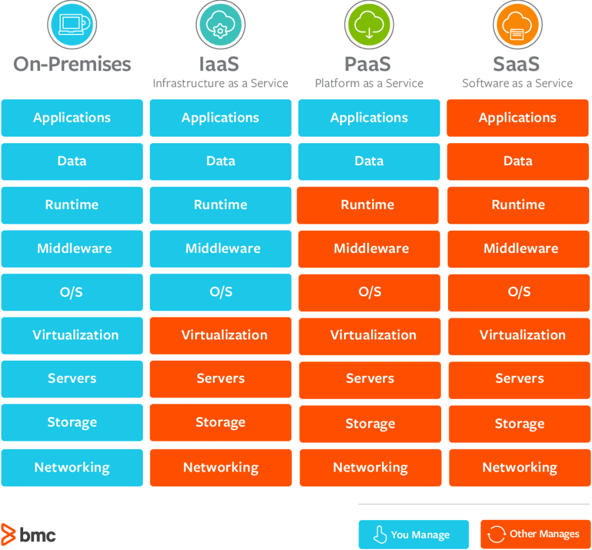
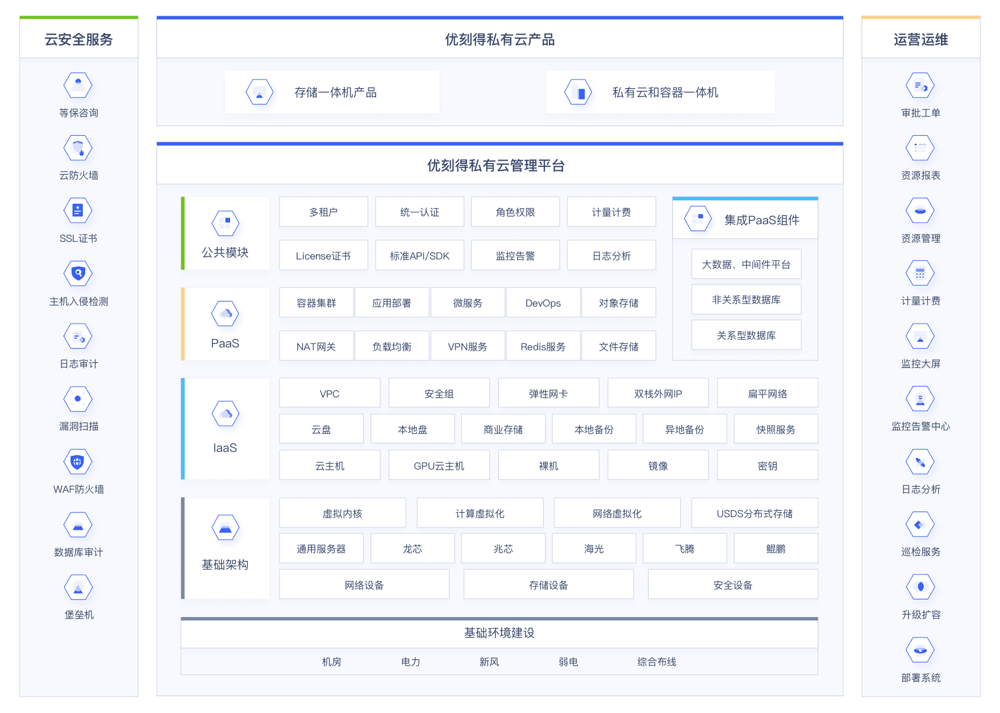

# 云原生&云服务

## 1.云原生

### 1.1.什么是云原生

知乎-华为开发者社区回复： [https://zhuanlan.zhihu.com/p/150190166](https://zhuanlan.zhihu.com/p/150190166)

什么是云原生？
[https://blog.csdn.net/weixin_44296862/article/details/108675404](https://blog.csdn.net/weixin_44296862/article/details/108675404)

私有云、公共云、混合云安全性的优点和缺点：
http://www.d1net.com/cloud/news/569151.html

什么是私有云：
https://www.zhihu.com/question/315549505/answer/2002077655

腾讯云首次披露自研业务上云历程：https://baijiahao.baidu.com/s?id=1641761636187313687&wfr=spider&for=pc

简单理解：

- 一种概念

- 将微服务、DevOps、持续集成等继承在一起

### 1.2.云原生12要素

[https://www.12factor.net/zh_cn/](https://www.12factor.net/zh_cn/)

I. 基准代码： 一份基准代码，多份部署

II. 依赖： 显式声明依赖关系

III. 配置： 在环境中存储配置

IV. 后端服务： 把后端服务当作附加资源

V. 构建，发布，运行： 严格分离构建和运行

VI. 进程： 以一个或多个无状态进程运行应用

VII. 端口绑定： 通过端口绑定提供服务

VIII. 并发： 通过进程模型进行扩展

IX. 易处理： 快速启动和优雅终止可最大化健壮性

X. 开发环境与线上环境等价： 尽可能的保持开发，预发布，线上环境相同

XI. 日志： 把日志当作事件流

XII. 管理进程： 后台管理任务当作一次性进程运行

进阶要素：

- 优先考虑设计API

- 通过遥测感知系统状态（比如，系统探针）

- 认证和授权

## 2.公有云

### 2.1.基础云服务架构

如何通俗解释 IaaS、PaaS、SaaS 的区别：

[https://www.zhihu.com/question/21641778/answer/62523535](https://www.zhihu.com/question/21641778/answer/62523535)

常见几类云架构如上图所示：

- On-Premises（本地部署）。

- IaaS（基础设施即服务）：用户：租用（购买|分配权限）云主机，用户不需要考虑网络，DNS，硬件环境方面的问题；运营商：提供网络，存储，DNS，这样服务就叫做基础设施服务。

- PaaS（平台即服务）：MySQL/elasticSearch/MQ/Redis等等

- SaaS（软件即服务）：钉钉，财务管理。

### 2.2.Serverless

Serverless：无服务架构，不需要服务器。站在用户的角度考虑问题，用户只需要使用云服务器即可，在云服务器所在的基础环境，软件环境都不需要用户关心。
无服务器计算结合了无状态的函数即服务（FaaS，比如AWS Lambda）与有状态的存储后端即服务（BaaS，比如AWS S3）。

“根据我们的定义，无服务器的服务无需明确配置也能够自动伸缩，而且能够根据使用量收费。”

> —— Berkeley（关于无服务器计算的观点）
- 在无服务器计算中，云服务被全面托管。你可以通过编写代码来构建应用程序，同时无需管理或维护服务器等基础设施。
- 无服务器计算支持按需付费的计费方式，允许用户按照消耗的资源量付费。与传统计算平台相比，无服务器计算允许用户根据具体的情况选择收费方式，从而帮助他们降低成本。
- 无服务器计算面向的是应用程序，不同于虚拟机和容器等面向资源的计算平台。

- serverless官网： [https://cn.serverless.com/](https://cn.serverless.com/)
- 概念： [https://cn.serverless.com/framework/docs](https://cn.serverless.com/framework/docs)
- [Serverless 兴起，下一代微服务的雏形和标准化开始呈现](https://mp.weixin.qq.com/s/rZzW1Dnm7I3m6SCGABC2Vg)

简单理解就是：无服务应用，也就是我们可以不用自己部署服务，通过我们自己编写的业务脚本（js、Python等），直接发布为可用的URL接口。
低代码，发展了十几年的旧概念，但是结合如今快速发展的互联网应用，这个概念重新赋予了新的使命。
目前的低代码，最突出的体现在前端应用上面。例如AntDesign、elementUi等，通过拖拽、配置的方式构建一个新的web应用。
通过serverless与低代码结合，能够让架构出一套单一领域的真正意义上的低代码平台。
能够让开发人员的精力集中在更有价值的地方。
推动这一概念的人主要是企业，为了降低人力成本，和复杂的业务逻辑。

### 2.3.云服务商

在传统软件架构下，撇开业务层代码，都需要部署计算节点、存储资源、网络资源，然后安装、配置操作系统等。而云服务本质上是实现 IT 架构软件化和 IT 平台智能化，
通过软件的形式定义这些硬件资源，充分抽象并封装其操作接口，任何资源均可直接调用相关 API 完成创建、删除、修改、查询等操作。

资源(ECS)短缺问题日益严峻，加上粗粒度的扩缩容、升降配功能已不能满足客户的需求，资源池化(Resource Pooling)、自动伸缩(Auto Scaling)、
滚动升级(Rolling Update) 被提上日程并成为提升产品竞争力的一大利器。

### 2.4.公有云架构

以下为ucloud私有云架构图：

### 2.5.SLA（服务等级协议）

服务级别协议是指提供服务的企业与客户之间就服务的品质、水准、性能等方面所达成的双方共同认可的协议或契约。

比较简单的数据指标案例就是，服务器的可靠性达到4个9， 也就是99.99%=(1-0.9999)*264*24=52.6分钟。

腾讯云CVM的SLA: [https://cloud.tencent.com/document/product/213/48920](https://cloud.tencent.com/document/product/213/48920)

## 3.云产品

### 3.1.虚拟化技术

各个云服务商的云服务器，几乎全都使用的虚拟化技术实现。

比如：kvm

### 3.2.云rds

关系型数据库。主流的包括MySQL、SQL Server、PostgreSQL、MariaDB

#### 3.2.1.实现方案

如下为搜狗的实现方案

采用docker容器化部署的方式。

- 选择最优解宿主算法

一、宿主最优解字典表：

typeA 内存124000、磁盘2417G 最优解=124000/2417=51

typeB 内存124000、磁盘3755G 最优解=124000/3755=33

二、宿主当前资源使用量表：

标号1 宿主typeA 当前内存使用量M1 当前磁盘使用量D1

标号2 宿主typeB 当前内存使用量M2 当前磁盘使用量D2

标号3 宿主typeA 当前内存使用量M3 当前磁盘使用量D3

标号4 宿主typeA 当前内存使用量M4 当前磁盘使用量D4

三、本次申请规格 4C12000M75G

1、选择满足基础条件的宿主为标号1、2、3

2、分别计算新增后最优解内存量/磁盘量

 新增后 标号1最优解Y1= （M1+12000）/ (D1+75)

 新增后 标号2最优解Y2= （M2+12000）/ (D2+75)

 新增后 标号3最优解Y3= （M3+12000）/ (D3+75)

3、比较第2步骤中的最优解Y1、Y2、Y3 与对应type最优解的偏移程度；

typeA类型最优解为51 标号1新增后最优解为Y1 |51-Y1|

typeB类型最优解为33 标号2新增后最优解为Y2 |33-Y2|

typeA类型最优解为51 标号3新增后最优解为Y3 |51-Y3|

4、 将各宿主分配后的值进行排序

|51-Y1| > |33-Y2| > |51-Y3|

申请2台虚机时，选择较小的两个做为结果

申请1台虚机时，选择最小的做为结果

5、 若选择的最优值一样，优先选择宿主容器最小的宿主（2021-08-24朱玄补充）

### 3.3.VPC

同一个VPC内实例默认是可以相互访问的，存在安全风险，因此在系统设计初期就需要考虑到相关问题的应对方案。

一个比较常用的安全的IP规划策略是分配多个VPC,不同的vpc网段也不同，比如
- vpc1 10.101.0.0/16 可用地址 65534 个 可用区 北京1
- vpc2 10.102.0.0/16 可用地址 65534 个 可用区 上海2
- vpc3 10.103.0.0/16 可用地址 65534 个 可用区 广东3

一般的公司也是完全足够了。

注意:vpc与地域是同级的，每个vpc可以拆分为多个subnet，比如北京的vpc只能分给北京可用区，不能分给上海。
且网络是基于vpc隔离的，vpc之间网络不通，如果需要通讯的话，可以进行云联网，打通网络即可。

### 3.4.OSS

对象存储服务（Object Storage Service，OSS）是一种海量、安全、低成本、高可靠的云存储服务，适合存放任意类型的文件。
容量和处理能力弹性扩展，多种存储类型供选择，全面优化存储成本。

### 3.5.SLB

负载均衡（Server Load Balancer，简称SLB）是云原生时代应用高可用的基本要素。通过将流量分发到不同的后端服务来扩展应用系统的服务吞吐能力，消除单点故障并提升应用系统的可用性。

- [阿里云SLB负载均衡配置教程](https://blog.csdn.net/qq_50660509/article/details/127884984)
- 公有云服务地址：[https://www.aliyun.com/product/slb](https://www.aliyun.com/product/slb)

阿里云SLB产品如下三种：
1. 面向4层的网络型负载均衡NLB，单实例最大支持1亿并发连接，基于NFV虚拟化平台，支持弹性伸缩，一般作为公司服务集群的入口。
    - 场景1:四层大流量高并发业务场景
    - 场景2:物联网、车联网等IoT业务入口
    - 场景3:多活容灾、IDC云上出入口场景
2. 面向7层的应用型负载均衡ALB，单实例最大支持100万QPS，基于NFV虚拟化平台，支持弹性伸缩，一般作为某个服务的入口。
    - 场景1:互联网应用7层高性能自动弹性负载均衡场景
    - 场景2:音视频应用大流量低时延负载均衡场景
    - 场景3:云原生应用金丝雀蓝绿发布负载均衡场景
3. 面向4层传统型负载均衡CLB，单实例最大支持100万并发、5万QPS，基于物理机架构，与nginx相似。
    - 场景1:网站/系统同地域高可靠负载均衡场景
    - 场景2:四层流量大并发业务负载均衡场景
    - 场景3：同城双活/跨地域容灾负载均衡场景

### 3.6.弹性网卡

弹性网卡公有云的一种云服务，可以与服务器、NAT网关、ENI网卡、SLB绑定，并可以动态解绑满足灵活管理的要求。

使用场景：
1. 服务器有绑定多个IP的需求，可以借住弹性网卡，与服务器进行绑定。每台机器上面都会有一个主网卡，以及0以上各辅助网卡。

## 4.使用方案

云服务器怎么限制ip访问

要限制云服务器的IP访问，可以采取以下几种方法：
1. 配置防火墙规则：使用云服务器提供的防火墙功能，可以设置只允许特定IP地址或IP地址段访问服务器。通过配置防火墙规则，可以限制来自指定IP的访问请求，从而实现IP访问限制。
2. 使用访问控制列表（ACL）：某些云服务提供商提供ACL功能，它可以帮助你限制云服务器的IP访问。通过配置ACL规则，你可以指定允许或拒绝的IP地址或IP地址范围，从而实现IP访问限制。
3. 使用安全组：安全组是一种虚拟防火墙，可以用来控制云服务器的入站和出站流量。你可以在安全组中配置规则，只允许特定IP地址或IP地址段访问云服务器，从而限制IP访问。
4. 通过服务器软件配置：一些服务器软件（如Nginx）允许你在配置文件中指定只允许特定IP地址访问服务器。你可以编辑配置文件，在其中配置允许的IP地址，从而实现IP访问限制。

无论使用哪种方法，都需要仔细考虑需要限制的IP地址范围，并确保只有授权的IP地址可以访问云服务器。